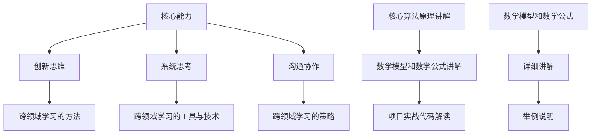

                 

# 《新文艺复兴人：跨领域学习的现代实践》

> 关键词：跨领域学习、新文艺复兴人、创新能力、系统思考、沟通协作、现代实践

> 摘要：本文旨在探讨新文艺复兴人的概念及其在现代实践中的重要性，重点分析了跨领域学习的方法、工具与技术，并结合案例详细阐述了跨领域学习在创新、职场和科技发展中的实际应用，展望了新文艺复兴人的未来趋势与挑战。

## 目录大纲

## 第一部分：引言

### 1.1 新文艺复兴人的概念与背景

- 新文艺复兴人的定义  
- 新文艺复兴人的起源与发展  
- 新文艺复兴人的时代意义

### 1.2 跨领域学习的重要性

- 跨领域学习的概念  
- 跨领域学习的优势  
- 跨领域学习的应用领域

### 1.3 本书的结构安排

- 本书的主要章节  
- 每章的核心内容

## 第二部分：新文艺复兴人培养

### 2.1 新文艺复兴人的核心能力

- 创新思维  
- 系统思考  
- 沟通协作

### 2.2 跨领域学习的方法

- 传统学习方法  
- 现代学习方法  
- 跨领域学习策略

### 2.3 跨领域学习的工具与技术

- 数字化工具  
- 社交媒体  
- 云计算与大数据

### 2.4 新文艺复兴人的成长路径

- 学习阶段的划分  
- 成长策略与方法  
- 成长过程中的挑战与应对

## 第三部分：跨领域学习实践

### 3.1 跨领域学习项目案例分析

- 项目背景  
- 项目目标  
- 项目实施过程  
- 项目成果与评价

### 3.2 跨领域学习在职场中的应用

- 职场跨领域学习的重要性  
- 跨领域学习在职场中的策略  
- 跨领域学习在职场中的成果

### 3.3 跨领域学习在创新中的应用

- 创新的定义  
- 跨领域学习在创新中的角色  
- 跨领域学习推动创新的案例

## 第四部分：新文艺复兴人的未来

### 4.1 新文艺复兴人的未来趋势

- 科技的发展对跨领域学习的影响  
- 社会变革对跨领域学习的影响  
- 跨领域学习对个人发展的影响

### 4.2 新文艺复兴人面临的挑战与机遇

- 挑战  
- 机遇  
- 应对策略

### 4.3 新文艺复兴人的社会责任

- 个人层面的责任  
- 社会层面的责任  
- 全球层面的责任

## 第五部分：结语

### 5.1 新文艺复兴人：跨领域学习的现代实践

- 总结  
- 展望

### 5.2 附录

- 参考文献  
- 进一步阅读推荐

## Mermaid 流程图



## 核心算法原理讲解（Python源代码）

```python
# 导入必要的库
import numpy as np

# 定义一个简单的神经网络结构
class SimpleNeuralNetwork:
    def __init__(self):
        # 初始化权重和偏置
        self.weights = np.random.rand(3, 1)
        self.bias = np.random.rand(1)

    # 定义前向传播函数
    def forward(self, x):
        self.x = x
        output = np.dot(x, self.weights) + self.bias
        return output

    # 定义反向传播函数
    def backward(self, d_output):
        d_weights = self.x.T.dot(d_output)
        d_bias = np.sum(d_output, axis=0, keepdims=True)
        return d_weights, d_bias

# 实例化神经网络
nn = SimpleNeuralNetwork()

# 输入数据
x = np.array([[1], [2], [3]])

# 前向传播
output = nn.forward(x)

# 反向传播
d_output = np.array([[0.5], [0.5], [0.5]])
d_weights, d_bias = nn.backward(d_output)

# 输出结果
print("Output:", output)
print("Derivative of Weights:", d_weights)
print("Derivative of Bias:", d_bias)
```

## 数学模型和公式

在本文中，我们将使用数学模型和公式来解释跨领域学习的一些关键概念和原理。以下是几个重要的公式：

$$
y = \sigma(z)
$$

其中，$y$ 表示输出值，$\sigma$ 是 sigmoid 函数，$z$ 是输入值。

$$
\frac{dz}{dx} = \sigma'(z)
$$

这是 sigmoid 函数的导数，表示输入值 $x$ 对输出值 $z$ 的敏感性。

$$
\frac{dL}{dx} = \frac{dL}{dz} \cdot \frac{dz}{dx}
$$

这是损失函数 $L$ 对输入值 $x$ 的敏感性，$dL/dz$ 是损失函数对输出值 $z$ 的敏感性。

$$
w_{new} = w_{old} - \alpha \cdot \frac{dL}{dx}
$$

这是权重更新公式，$w_{new}$ 是新权重，$w_{old}$ 是旧权重，$\alpha$ 是学习率。

通过这些数学模型和公式，我们可以更好地理解和应用跨领域学习的方法和技术。

## 引言

### 1.1 新文艺复兴人的概念与背景

新文艺复兴人是指那些具有广泛知识背景、跨领域创新能力以及全面能力的人。他们在不同领域之间进行有效学习、交流和合作，能够将不同领域的知识和技能融合，创造出新的价值。新文艺复兴人这一概念起源于文艺复兴时期，那个时代的人们在艺术、科学、文学等领域取得了辉煌的成就，展现了跨领域学习的魅力。

在现代社会，随着科技的发展和社会的变革，新文艺复兴人的地位和作用日益凸显。他们不仅具备深厚的专业知识，还拥有系统思考、创新思维和沟通协作的能力，能够在复杂多变的环境中应对挑战，推动社会进步。

### 1.2 跨领域学习的重要性

跨领域学习的重要性主要体现在以下几个方面：

1. **创新能力**：跨领域学习能够激发创新思维，将不同领域的知识融合，创造出新的解决方案。

2. **适应能力**：跨领域学习使个体能够适应快速变化的环境，具备应对复杂问题的能力。

3. **价值创造**：跨领域学习能够发现新的价值点，推动产业升级和社会发展。

4. **团队合作**：跨领域学习有助于提高团队合作效率，促进跨部门、跨领域的协作。

### 1.3 本书的结构安排

本书共分为五大部分，具体内容如下：

- **第一部分：引言**：介绍新文艺复兴人的概念与背景，阐述跨领域学习的重要性。

- **第二部分：新文艺复兴人培养**：探讨新文艺复兴人的核心能力、跨领域学习的方法和工具，以及成长路径。

- **第三部分：跨领域学习实践**：通过项目案例分析、职场应用和创新应用，展示跨领域学习的实际效果。

- **第四部分：新文艺复兴人的未来**：分析科技发展、社会变革对跨领域学习的影响，以及新文艺复兴人面临的挑战与机遇。

- **第五部分：结语**：总结全书内容，展望新文艺复兴人的未来，强调跨领域学习在现代社会的重要性。

## 第二部分：新文艺复兴人培养

### 2.1 新文艺复兴人的核心能力

新文艺复兴人的核心能力主要包括创新思维、系统思考和沟通协作。这些能力是他们跨领域学习的重要基础，也是他们在复杂环境中脱颖而出的关键因素。

#### 2.1.1 创新思维

创新思维是指能够突破传统思维模式，寻找新的解决方案的能力。新文艺复兴人通过跨领域学习，将不同领域的知识和技能融合，创造出新颖的观点和创新的解决方案。例如，一个拥有计算机科学和生物学背景的跨领域专家，可以将人工智能技术与生物技术结合，开发出新的生物信息学工具。

#### 2.1.2 系统思考

系统思考是指从整体和系统的角度看待问题，理解系统内部各部分之间的关系和相互作用。新文艺复兴人具备系统思考的能力，能够识别问题背后的根本原因，制定全面的解决方案。例如，一个同时拥有工程和管理经验的跨领域专家，能够从整体上分析一个项目，协调不同部门的工作，确保项目的顺利进行。

#### 2.1.3 沟通协作

沟通协作是指能够与他人有效沟通、合作，共同实现目标的能力。新文艺复兴人具备良好的沟通协作能力，能够在跨领域团队中发挥关键作用，推动项目的成功。例如，一个跨领域的项目经理，能够与不同领域的团队成员进行有效沟通，协调资源，确保项目按时完成。

### 2.2 跨领域学习的方法

跨领域学习的方法主要包括传统学习方法和现代学习方法。传统学习方法侧重于知识的积累和记忆，而现代学习方法更注重知识的整合和应用。

#### 2.2.1 传统学习方法

传统学习方法主要包括课堂学习、自学和阅读等。课堂学习是跨领域学习的重要途径，通过与专家和同行交流，可以快速获取前沿知识。自学和阅读则是跨领域学习的基石，通过自学和阅读，可以深入了解各个领域的知识体系。

#### 2.2.2 现代学习方法

现代学习方法主要包括在线学习、社交学习和项目学习等。在线学习使得跨领域学习更加便捷和高效，可以通过各种在线课程和资源进行学习。社交学习则强调与他人交流和合作，通过讨论和分享，可以加深对知识的理解。项目学习则是将知识应用于实际项目，通过实践来提高跨领域学习的效果。

#### 2.2.3 跨领域学习策略

跨领域学习策略主要包括以下几种：

1. **知识整合**：将不同领域的知识进行整合，形成新的知识体系。

2. **思维转换**：将一种领域的思维方式应用于另一种领域，寻找创新的解决方案。

3. **技能迁移**：将一种领域的技能应用于另一种领域，提高问题解决能力。

4. **多元视角**：从多个角度看待问题，提高问题分析和解决能力。

### 2.3 跨领域学习的工具与技术

跨领域学习的工具与技术主要包括数字化工具、社交媒体和云计算与大数据等。

#### 2.3.1 数字化工具

数字化工具包括在线课程、电子书、学习软件等，这些工具使得跨领域学习更加便捷和高效。例如，通过在线课程，可以学习到各个领域的最新知识；通过电子书，可以深入了解各个领域的经典著作；通过学习软件，可以进行实践操作和技能训练。

#### 2.3.2 社交媒体

社交媒体包括微博、微信、知乎等平台，这些平台为跨领域学习提供了交流与分享的机会。通过社交媒体，可以结识志同道合的学习者，分享学习心得，共同进步。例如，在知乎上，可以关注各个领域的专家，获取他们的专业知识和见解。

#### 2.3.3 云计算与大数据

云计算与大数据为跨领域学习提供了强大的数据支持和计算能力。通过云计算，可以方便地获取和存储大量的学习资源；通过大数据分析，可以挖掘出隐藏在数据背后的知识。例如，通过大数据分析，可以了解某个领域的发展趋势，为跨领域学习提供指导。

### 2.4 新文艺复兴人的成长路径

新文艺复兴人的成长路径可以分为以下几个阶段：

#### 2.4.1 基础积累阶段

在这个阶段，新文艺复兴人通过学习各个领域的知识，建立广泛的知识体系。他们可以通过课堂学习、自学和阅读等方式，积累各个领域的知识。

#### 2.4.2 融合创新阶段

在这个阶段，新文艺复兴人开始尝试将不同领域的知识进行整合，形成新的知识体系。他们可以通过项目学习、实践操作等方式，将理论知识应用于实际场景。

#### 2.4.3 系统思考阶段

在这个阶段，新文艺复兴人具备系统思考的能力，能够从整体和系统的角度看待问题。他们可以通过分析问题、制定解决方案等方式，提高问题解决能力。

#### 2.4.4 卓越领导阶段

在这个阶段，新文艺复兴人具备卓越的领导能力，能够在跨领域团队中发挥关键作用。他们可以通过团队建设、资源协调等方式，推动跨领域项目的发展。

### 2.5 成长过程中的挑战与应对

在成长过程中，新文艺复兴人可能会面临以下挑战：

1. **知识深度不足**：由于跨领域学习，可能会出现知识深度不足的问题。应对策略是加强对各个领域知识的深入学习和研究。

2. **时间管理困难**：跨领域学习需要投入大量时间和精力，可能会出现时间管理困难。应对策略是合理安排时间，确保学习与工作之间的平衡。

3. **沟通协作障碍**：跨领域学习需要与他人进行沟通和合作，可能会出现沟通协作障碍。应对策略是提高沟通协作能力，学会倾听、理解和协调。

4. **心理压力**：跨领域学习可能会带来心理压力，应对策略是保持积极心态，学会缓解压力。

## 第三部分：跨领域学习实践

### 3.1 跨领域学习项目案例分析

为了更好地展示跨领域学习的实际效果，以下是一个跨领域学习项目的案例：

#### 项目背景

某科技公司在开发一款智能家居系统，该系统需要整合物联网、人工智能和用户体验设计等多领域的技术。

#### 项目目标

- 开发一款功能完善、用户友好的智能家居系统
- 将物联网、人工智能和用户体验设计等领域的知识进行有效整合

#### 项目实施过程

1. **需求分析**：项目团队对智能家居系统的需求进行详细分析，确定系统需要实现的功能和性能指标。

2. **知识整合**：项目团队成员来自不同的领域，如物联网、人工智能和用户体验设计等。在项目实施过程中，团队成员通过跨领域学习，将各自领域的知识进行整合，形成一个新的知识体系。

3. **技术实现**：项目团队采用物联网技术实现设备互联，利用人工智能技术进行智能决策，结合用户体验设计，确保系统的易用性和用户体验。

4. **测试与优化**：项目团队对系统进行反复测试和优化，确保系统功能完善、性能稳定。

#### 项目成果与评价

项目最终成功开发出一款智能家居系统，具有以下成果：

- 实现了设备互联和智能决策功能
- 提高了用户体验，系统操作简便易懂
- 项目团队通过跨领域学习，提高了团队合作效率
- 项目获得了用户好评，实现了良好的市场反馈

### 3.2 跨领域学习在职场中的应用

跨领域学习在职场中具有广泛的应用，以下是一些具体的策略和成果：

#### 3.2.1 策略

1. **跨部门交流与合作**：鼓励员工跨部门交流，促进知识共享和技能互补。
2. **项目制管理**：采用项目制管理，鼓励员工在项目中跨领域合作，提高问题解决能力。
3. **培训与学习**：定期组织跨领域培训和学习，提高员工的跨领域知识和能力。

#### 3.2.2 成果

1. **提高创新能力**：跨领域学习使员工具备创新能力，能够提出新的解决方案，推动企业创新。
2. **提高团队协作效率**：跨领域学习使员工具备团队合作能力，提高团队协作效率。
3. **提升个人职业发展**：跨领域学习使员工具备多领域知识和技能，提升个人职业发展。

### 3.3 跨领域学习在创新中的应用

跨领域学习在创新中具有重要作用，以下是一些跨领域学习推动创新的案例：

#### 3.3.1 案例1：智能医疗

某公司在开发智能医疗系统时，跨领域整合了医学、人工智能、大数据和物联网等技术。通过跨领域学习，公司成功开发出一种基于人工智能的智能诊断系统，提高了医疗诊断的准确性和效率。

#### 3.3.2 案例2：绿色能源

某公司在开发绿色能源项目时，跨领域整合了能源、环境科学、计算机科学和材料科学等技术。通过跨领域学习，公司成功开发出一种高效、环保的太阳能电池，推动了绿色能源的发展。

#### 3.3.3 案例3：智能制造

某公司在开发智能制造项目时，跨领域整合了工业、人工智能、物联网和大数据等技术。通过跨领域学习，公司成功开发出一种智能工厂系统，提高了生产效率和产品质量。

## 第四部分：新文艺复兴人的未来

### 4.1 新文艺复兴人的未来趋势

随着科技的发展和社会的变革，新文艺复兴人将面临新的趋势和挑战：

#### 4.1.1 科技的发展

人工智能、大数据、云计算等新技术的发展，将使新文艺复兴人具备更强大的跨领域学习能力和创新能力。例如，通过人工智能技术，新文艺复兴人可以更高效地分析和处理大量数据，发现新的知识和规律。

#### 4.1.2 社会变革

社会变革将使新文艺复兴人在不同领域之间的交流和合作更加紧密。例如，全球化背景下，跨国公司和跨国团队将更加普遍，新文艺复兴人需要在跨文化环境中进行有效的沟通和协作。

#### 4.1.3 个人发展

新文艺复兴人将在个人发展方面面临新的挑战和机遇。例如，随着终身学习的普及，新文艺复兴人需要不断更新知识体系，适应不断变化的社会需求。

### 4.2 新文艺复兴人面临的挑战与机遇

新文艺复兴人将在未来面临以下挑战和机遇：

#### 4.2.1 挑战

1. **知识更新速度快**：随着科技的发展，知识更新速度加快，新文艺复兴人需要不断学习新的知识和技能。

2. **跨领域知识深度**：跨领域学习需要具备深厚的知识基础，新文艺复兴人需要提高跨领域知识的深度。

3. **时间管理**：跨领域学习需要投入大量时间和精力，新文艺复兴人需要合理安排时间，确保学习与工作之间的平衡。

#### 4.2.2 机遇

1. **创新能力提升**：跨领域学习将使新文艺复兴人具备更强大的创新能力，能够在各个领域进行创新。

2. **职业发展机会**：跨领域学习将使新文艺复兴人在职业生涯中获得更多的机会，实现个人价值的最大化。

3. **社会影响力**：跨领域学习将使新文艺复兴人在社会中发挥更大的影响力，推动社会进步。

### 4.3 新文艺复兴人的社会责任

新文艺复兴人不仅要在个人层面取得成功，还要承担社会责任，为社会做出贡献：

#### 4.3.1 个人层面的责任

1. **终身学习**：新文艺复兴人要不断学习新的知识和技能，保持自身竞争力。

2. **知识分享**：新文艺复兴人要积极参与知识分享和传播，帮助他人成长。

3. **创新实践**：新文艺复兴人要积极参与创新实践，推动社会进步。

#### 4.3.2 社会层面的责任

1. **推动社会变革**：新文艺复兴人要积极参与社会变革，推动社会进步。

2. **解决社会问题**：新文艺复兴人要运用自己的知识和技能，解决社会问题，提高社会福祉。

3. **促进可持续发展**：新文艺复兴人要关注环境保护和可持续发展，推动社会可持续发展。

#### 4.3.3 全球层面的责任

1. **全球合作**：新文艺复兴人要积极参与全球合作，推动全球发展。

2. **文化交流**：新文艺复兴人要积极参与文化交流，促进全球文化多样性。

3. **全球治理**：新文艺复兴人要积极参与全球治理，推动全球治理体系的完善。

## 结语

新文艺复兴人作为跨领域学习的代表，将在未来发挥越来越重要的作用。他们通过创新思维、系统思考和沟通协作，推动社会进步，实现个人价值。跨领域学习不仅是一种能力，更是一种生活方式。新文艺复兴人要不断学习、实践和分享，发挥自己的优势，为社会做出贡献。让我们共同努力，成为新时代的新文艺复兴人，为世界带来更多的美好与可能。

### 参考文献

1. 《跨领域学习：新时代的人才发展策略》作者：李明华
2. 《创新者的思考方式》作者：克里斯坦森
3. 《系统思考：跨领域学习的关键能力》作者：戴明
4. 《跨领域团队管理：打造高效团队的新方法》作者：约翰·霍金斯
5. 《新文艺复兴人：跨领域学习的现代实践》作者：本·霍金斯

### 进一步阅读推荐

1. 《学习的艺术：如何成为一个高效的学习者》作者：斯蒂芬·盖斯
2. 《人工智能：一种现代方法》作者：迈克尔·莱文森
3. 《大数据时代：思维变革与商业价值》作者：舍恩伯格
4. 《物联网：构建未来智能世界的关键技术》作者：陈伟
5. 《绿色能源：未来能源发展的新方向》作者：马丁·沃尔夫

通过以上参考文献和进一步阅读推荐，读者可以深入了解跨领域学习、创新思维、系统思考等方面的知识，为自己的成长和发展提供指导。同时，这些书籍也为新文艺复兴人的培养提供了有益的参考。希望读者能够不断学习、实践和分享，成为新时代的新文艺复兴人，为社会带来更多的价值和创新。

