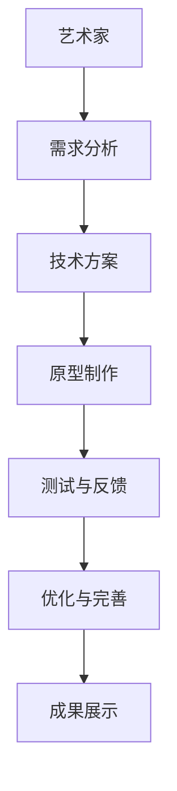
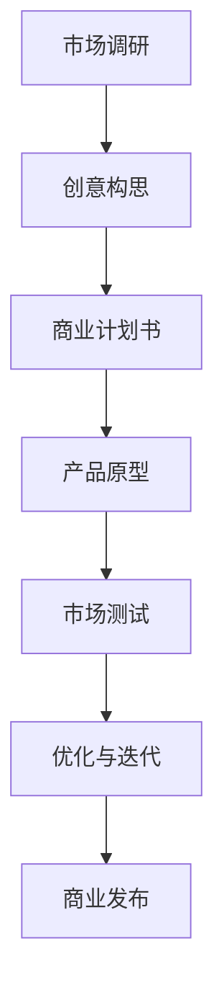
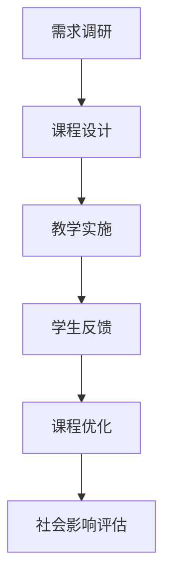

                 

# 《新文艺复兴创意工坊：跨领域对话激发创新的实体空间》

## 关键词
**新文艺复兴**，**创意工坊**，**跨领域对话**，**实体空间**，**创新**，**跨领域协作**，**技术创新**

## 摘要
本文探讨了新文艺复兴背景下的创意工坊概念，强调了跨领域对话在激发创新中的关键作用。通过分析实体空间设计原则和跨领域对话的挑战与策略，本文提出了一种有效的实体空间模式，以促进跨领域创新。文章还通过案例研究和未来发展趋势分析，探讨了新文艺复兴创意工坊在新时代的角色与使命。

---

## 第一部分：引言

在当今快速发展的科技时代，创新已经成为驱动社会进步的重要力量。新文艺复兴创意工坊作为新时代的创新载体，正日益受到关注。本部分将首先介绍新文艺复兴的概念与背景，以及创意工坊的定义与功能，为进一步探讨其跨领域对话和实体空间设计奠定基础。

### 1.1 新文艺复兴的概念与背景

新文艺复兴是指以创新为核心，融合多种学科、文化和技术，推动社会进步和文明发展的时代潮流。这一概念起源于欧洲文艺复兴，其核心是人文主义精神和科学技术的结合。在当代，新文艺复兴强调的是跨界融合，通过跨学科合作和跨领域对话，推动创新和创造力的释放。

新文艺复兴的背景在于全球化和数字化的趋势。全球化使得不同国家和地区的人们更加紧密地联系在一起，而数字化则打破了传统的时空限制，使得知识和信息的交流更加便捷。这种背景下，单一的学科或领域已经无法满足社会发展的需求，跨领域合作和创新成为时代主题。

### 1.2 创意工坊的定义与功能

创意工坊是一种实体空间，旨在提供一个开放、自由、互动的环境，以激发创意和促进创新。创意工坊通常具备以下几个功能：

1. **跨界合作平台**：创意工坊通过提供物理空间和资源，促进不同领域专家的交流和合作，从而实现跨界创新。
2. **创意孵化器**：创意工坊为创意项目提供孵化支持，包括资金、技术、市场等资源，帮助创意项目从概念到实际产品的转化。
3. **知识共享平台**：创意工坊通过组织各种活动，如研讨会、工作坊、展览等，促进知识的分享和传播。
4. **社会创新实验室**：创意工坊可以作为社会创新实验的场所，通过实践探索，发现和解决社会问题。

### 1.3 新文艺复兴创意工坊的重要性

新文艺复兴创意工坊的重要性体现在以下几个方面：

1. **推动创新**：创意工坊为创新提供了必要的物理空间和资源支持，促进了跨领域的对话和合作，从而推动了创新的发展。
2. **培养人才**：创意工坊提供了一个实践平台，帮助参与者掌握跨学科知识和技能，培养创新思维和解决复杂问题的能力。
3. **促进社会进步**：通过创意工坊，社会问题可以得到更好的解决，从而推动社会进步和发展。

在接下来的部分，我们将深入探讨跨领域对话的基础，分析其定义、优势、挑战以及应对策略。

---

## 第二部分：跨领域对话的基础

跨领域对话是创意工坊实现创新的关键。它不仅要求参与者具备跨学科的知识和技能，还需要建立有效的沟通和协作机制。本部分将首先定义跨领域对话，分析其优势，探讨面临的挑战，并给出相应的策略。

### 2.1 跨领域对话的定义

跨领域对话是指不同领域专家之间的交流与合作，旨在通过融合多种视角和知识，解决复杂问题或创造新的解决方案。在跨领域对话中，参与者通常来自不同的学科背景，包括工程师、设计师、社会学家、心理学家等。

### 2.2 跨领域对话的优势

跨领域对话具有以下几个显著优势：

1. **多元视角**：跨领域对话能够汇集不同领域的专业知识和视角，从而更全面地理解问题和挑战。
2. **创新思维**：不同领域的思维方式和解决问题的方法可以相互启发，激发创新思维。
3. **综合解决方案**：通过跨领域合作，可以提出更加综合和有效的解决方案，解决复杂问题。
4. **知识共享**：跨领域对话促进了知识的共享和传播，有助于提升整体创新能力。

### 2.3 跨领域对话的挑战与策略

跨领域对话虽然具有显著优势，但也面临一些挑战：

1. **沟通障碍**：不同领域的专业术语和概念可能存在差异，导致沟通障碍。
2. **文化差异**：不同领域的工作文化和价值观可能不同，影响团队合作和协作。
3. **资源分配**：跨领域合作可能涉及不同部门和资源，资源分配问题可能成为合作障碍。

为应对这些挑战，可以采取以下策略：

1. **建立共同语言**：通过培训和教育，提高参与者对不同领域专业术语和概念的理解，建立共同语言。
2. **建立信任关系**：通过团队建设活动，增强团队成员之间的信任，促进有效沟通。
3. **合理分配资源**：明确资源需求，制定合理的资源分配策略，确保跨领域合作顺利进行。
4. **制定协作规则**：制定明确的协作规则和流程，确保团队成员在合作中有章可循。

在下一部分，我们将探讨实体空间设计的原则与方法，以更好地支持跨领域对话和创新。

---

## 第三部分：实体空间设计

实体空间是跨领域对话和创新的重要载体。一个设计得当的实体空间可以促进知识共享、团队协作和创新思维的激发。本部分将首先介绍实体空间设计的核心理念，然后探讨其方法论，并通过案例分析，展示如何将理论与实践相结合。

### 3.1 实体空间设计的核心理念

实体空间设计的核心理念包括以下几个方面：

1. **灵活性**：实体空间应具备灵活性，能够适应不同的活动和需求。
2. **互动性**：空间设计应鼓励互动和交流，提供多种互动方式，如讨论区、工作坊等。
3. **开放性**：空间设计应开放，促进不同领域专家之间的交流和合作。
4. **多功能性**：实体空间应具备多功能性，能够满足各种活动的需求，如会议、展览、工作坊等。
5. **技术支持**：实体空间应配备先进的技术支持，如Wi-Fi、多媒体设备等，以支持现代通信和协作。

### 3.2 实体空间设计的方法论

实体空间设计的方法论包括以下几个步骤：

1. **需求分析**：分析用户需求，包括活动类型、参与者背景等。
2. **空间规划**：根据需求分析，规划空间布局，确保空间利用最大化。
3. **互动设计**：设计互动区域，如讨论区、开放工作区等，以促进交流和协作。
4. **技术支持**：配置必要的技术设备，如投影仪、Wi-Fi等，以支持现代通信和协作。
5. **安全与舒适**：确保空间的安全和舒适，提供足够的照明、通风和座椅等。

### 3.3 实体空间设计案例分析

以下是一个创意工坊实体空间设计的案例分析：

**案例：XX大学创意工坊**

1. **需求分析**：XX大学创意工坊主要服务于师生，旨在促进跨学科合作和创新能力培养。活动类型包括学术讨论、项目孵化、工作坊等。

2. **空间规划**：空间规划包括开放工作区、讨论区、展览区、会议室等。开放工作区配备桌椅和Wi-Fi，讨论区设有沙发和茶几，展览区用于展示创意作品和研究成果。

3. **互动设计**：讨论区和开放工作区设计有透明的玻璃隔断，以促进交流和互动。会议室设有投影仪和音响系统，支持远程会议和视频展示。

4. **技术支持**：工坊配备高性能Wi-Fi、投影仪、音响系统、数字屏幕等，支持多媒体展示和远程会议。

5. **安全与舒适**：空间设计考虑到安全性和舒适度，设有充足的照明、通风和座椅，并提供安全通道和紧急出口。

通过以上案例分析，我们可以看到实体空间设计在促进跨领域对话和创新中的重要性。在下一部分，我们将探讨实体空间中的跨领域对话场景，以进一步理解其实际应用。

---

## 第四部分：实体空间中的跨领域对话场景

实体空间不仅是创意工坊的物理载体，更是跨领域对话和创新实践的重要场所。在这一部分，我们将探讨实体空间中的跨领域对话场景，分析其类型和设计要点，以帮助创意工坊更好地支持创新活动。

### 4.1 跨领域对话场景的定义

跨领域对话场景是指在实体空间中，不同领域的专家、学者和从业者通过面对面交流、互动和合作，共同探讨和解决复杂问题的特定环境。这些场景通常涉及多个学科领域，如工程、艺术、社会科学等。

### 4.2 跨领域对话场景的类型

跨领域对话场景可以按照不同的维度进行分类，以下是几种常见的类型：

1. **学术研讨会**：学术研讨会是跨领域对话的一种常见形式，它通常涉及不同学科领域的专家，通过演讲、讨论和互动，分享研究成果和观点。
2. **工作坊**：工作坊是一种互动性更强的跨领域对话场景，它通过分组讨论、角色扮演、实践操作等方式，促进参与者之间的深入交流和合作。
3. **项目协作**：项目协作场景是在实际项目中，不同领域的专家和团队成员共同工作，通过定期会议、邮件、即时通讯等手段进行协作。
4. **展览与展示**：展览与展示场景通过展示创意作品、研究成果和项目成果，吸引观众参与互动，促进跨领域对话和交流。

### 4.3 跨领域对话场景的设计要点

为了确保跨领域对话场景的有效性，实体空间的设计需要考虑以下几个要点：

1. **空间布局**：空间布局应灵活多变，能够根据不同的对话场景进行快速调整。例如，设置可移动的隔断、多功能桌椅等，以便适应不同规模的会议和活动。
2. **技术支持**：技术支持是跨领域对话场景的重要组成部分，包括Wi-Fi、投影仪、音响系统、数字屏幕等，这些设备应能够支持多媒体展示、远程会议和实时数据分享。
3. **互动设施**：互动设施如讨论区、白板、即时通讯设备等，可以促进参与者之间的交流和合作。讨论区可以设置沙发、茶几等，提供舒适的环境。
4. **隐私保护**：在某些跨领域对话场景中，参与者可能需要讨论敏感信息或保密项目，实体空间应提供隐私保护措施，如隔音、安全锁等。
5. **环境舒适**：实体空间的环境设计应考虑到照明、通风、温度等因素，确保参与者能够在舒适的环境中集中精力进行跨领域对话。

通过以上设计要点，实体空间可以为跨领域对话提供良好的物理环境，从而促进创新活动的开展。在下一部分，我们将探讨实体空间中的技术创新，进一步理解其在推动跨领域对话和创新中的作用。

---

## 第五部分：实体空间中的技术创新

在实体空间中，技术创新是跨领域对话和创新能力提升的关键。通过引入先进的数字技术、虚拟现实技术和物联网技术，实体空间可以更好地支持创新活动。本部分将详细介绍这些技术创新，并探讨其在实体空间中的应用。

### 5.1 实体空间中的数字技术

数字技术在实体空间中的应用，极大地提升了跨领域对话的效率和质量。以下是几种常见的数字技术应用：

1. **Wi-Fi和无线网络**：无线网络提供了快速、便捷的网络接入，使得参与者可以随时访问互联网，获取信息和资源，并进行实时通信。
2. **多媒体设备**：多媒体设备如投影仪、音响系统、数字屏幕等，支持多媒体展示，使得跨领域对话更加生动和直观。
3. **即时通讯工具**：如Slack、Microsoft Teams等即时通讯工具，提供了高效的沟通渠道，使团队成员可以实时交流，分享信息和资源。
4. **云服务**：云服务如Google Drive、Microsoft Azure等，提供了强大的存储和计算能力，使得参与者可以随时访问和共享文件，协同工作。

### 5.2 实体空间中的虚拟现实技术

虚拟现实（VR）技术为实体空间中的跨领域对话提供了全新的交互体验。以下是VR技术在实体空间中的应用：

1. **虚拟会议室**：通过VR技术，参与者可以在虚拟会议室中进行面对面的交流，无论他们身处何地。这种技术特别适用于远程跨领域对话，打破了地域限制。
2. **虚拟展览**：虚拟展览通过VR技术，将实体空间中的展览内容虚拟化，使得参与者可以在线上参观和体验。这种技术适用于展示创意作品、研究成果等，为跨领域对话提供了新的形式。
3. **虚拟协作**：虚拟协作工具如VRChat、AltspaceVR等，提供了虚拟场景和互动功能，使得参与者可以在虚拟环境中进行协作和互动，增强了跨领域对话的互动性。

### 5.3 实体空间中的物联网技术

物联网（IoT）技术在实体空间中的应用，进一步提升了空间的智能化和便利性。以下是几种常见的物联网技术应用：

1. **智能环境监控**：物联网技术可以实时监控实体空间的温度、湿度、光照等环境参数，提供舒适的工作环境。例如，智能空调系统可以根据环境参数自动调节温度和湿度。
2. **智能设备控制**：通过物联网技术，参与者可以通过手机或平板电脑远程控制实体空间中的设备，如灯光、音响系统等，提高了空间的灵活性。
3. **智能安防系统**：物联网技术可以提供智能安防系统，包括门禁管理、视频监控、入侵检测等，确保实体空间的安全。
4. **智能资产管理**：物联网技术可以用于资产管理，实时跟踪和监控实体空间中的设备和资源，提高资源利用率和管理效率。

通过引入数字技术、虚拟现实技术和物联网技术，实体空间可以更好地支持跨领域对话和创新。这些技术创新不仅提升了实体空间的功能和效率，也为参与者提供了更加丰富和多样的互动体验。在下一部分，我们将探讨实体空间的运营与评价，以进一步理解其实际应用效果。

---

## 第六部分：实体空间运营与评价

实体空间的运营与评价是确保其有效性和可持续性的关键。在这一部分，我们将探讨实体空间的运营策略、评价指标，并讨论如何进行持续改进，以实现最佳运营效果。

### 6.1 实体空间的运营策略

实体空间的运营策略主要包括以下几个方面：

1. **资源管理**：合理配置和利用实体空间内的资源，包括设备、场地、人力等，确保资源的高效利用。
2. **活动策划**：根据用户需求和空间特点，策划和组织多样化的活动，如研讨会、工作坊、展览、项目孵化等，以吸引不同领域的参与者。
3. **用户体验**：提供优质的服务和舒适的环境，确保参与者在实体空间中的体验良好，提升满意度。
4. **安全管理**：制定并执行安全管理制度，确保实体空间的安全和秩序。
5. **宣传推广**：通过线上线下渠道，宣传推广实体空间，扩大影响力，吸引更多用户。

### 6.2 实体空间的评价指标

评价实体空间的运营效果，需要建立一套科学的评价指标体系。以下是几个关键的评价指标：

1. **活动参与度**：参与活动的次数和参与者的满意度是评价实体空间活动策划成功与否的重要指标。
2. **资源利用率**：空间内资源的利用率和设备的使用频率，反映了资源管理的有效性。
3. **用户满意度**：用户对实体空间的服务和环境的满意度，是衡量运营质量的重要指标。
4. **创新能力**：通过活动的举办和项目的孵化，实体空间对创新能力的提升程度，是评价其运营效果的关键指标。
5. **经济效益**：实体空间的运营收入和成本控制，反映了其经济效益。

### 6.3 实体空间的持续改进

为了实现实体空间的持续改进，需要从以下几个方面入手：

1. **用户反馈**：定期收集用户反馈，了解他们的需求和意见，为改进提供依据。
2. **数据分析**：利用数据分析工具，对实体空间的运营数据进行深度分析，识别问题和瓶颈，制定改进措施。
3. **技术创新**：引入新的技术和方法，提升实体空间的功能和服务质量。
4. **管理优化**：优化管理流程和制度，提高运营效率和管理水平。
5. **合作伙伴关系**：与相关机构、企业和个人建立良好的合作伙伴关系，共同推动实体空间的持续发展。

通过以上运营策略、评价指标和持续改进措施，实体空间可以不断提高其运营效果，为跨领域对话和创新提供更好的支持。

---

## 第七部分：案例研究

通过具体的案例研究，我们可以更好地理解新文艺复兴创意工坊在实践中的运作和效果。以下将介绍三个不同领域的案例，展示创意工坊如何促进跨领域合作和创新。

### 7.1 案例一：艺术与科技的跨界融合

**背景**：某创意工坊举办了名为“艺术与科技融合”的项目，吸引了艺术家、工程师和技术开发者共同参与。

**核心概念与联系**：通过Mermaid流程图展示跨领域合作的工作流程：



**核心算法原理讲解**：采用Python代码展示图像处理算法的实

```python
import cv2
import numpy as np

# 加载图像
image = cv2.imread('art_image.jpg')

# 应用滤镜效果
filtered_image = cv2.GaussianBlur(image, (5, 5), 0)

# 显示处理后的图像
cv2.imshow('Filtered Image', filtered_image)
cv2.waitKey(0)
cv2.destroyAllWindows()
```

**数学模型和公式**：使用LaTeX格式展示图像滤波的数学模型：

```latex
$$
I_{filtered} = \sum_{i,j} G(i, j) * I(i - x, j - y)
$$`

**项目实战**：开发环境搭建（Python环境），源代码实现和代码解读：

1. **开发环境搭建**：安装Python和OpenCV库。
2. **源代码实现**：编写图像滤波代码并运行。
3. **代码应用解读与分析**：讲解图像滤波的原理和应用。

**实际案例分析和详细讲解剖析**：分析艺术作品在科技处理下的效果，展示跨领域合作的成果。

**项目小结**：通过艺术与科技的结合，创意工坊成功地激发了跨领域创新。

### 7.2 案例二：商业与创意的碰撞

**背景**：某创意工坊举办了一个商业创意竞赛，邀请了企业家、设计师和市场营销专家共同参与。

**核心概念与联系**：通过Mermaid流程图展示商业创意项目的开发流程：



**核心算法原理讲解**：采用Python代码展示市场分析的数据处理算法：

```python
import pandas as pd

# 读取市场数据
data = pd.read_csv('market_data.csv')

# 数据预处理
cleaned_data = data[data['Revenue'] > 0]

# 数据分析
avg_revenue = cleaned_data['Revenue'].mean()

print(f'Average Revenue: {avg_revenue}')
```

**数学公式和数学模型**：使用LaTeX格式展示市场数据分析的数学模型：

```latex
$$
\text{Average Revenue} = \frac{1}{n} \sum_{i=1}^{n} \text{Revenue}_i
$$`

**项目实战**：开发环境搭建（Python环境），源代码实现和代码解读：

1. **开发环境搭建**：安装Python和Pandas库。
2. **源代码实现**：编写市场数据分析代码并运行。
3. **代码应用解读与分析**：讲解市场数据分析的原理和应用。

**实际案例分析和详细讲解剖析**：分析商业创意项目的市场反馈和优化策略。

**项目小结**：通过商业与创意的结合，创意工坊成功地推动了商业创新和项目孵化。

### 7.3 案例三：教育与社会创新的结合

**背景**：某创意工坊举办了一个教育创新项目，邀请了教育专家、社会工作者和学生共同参与。

**核心概念与联系**：通过Mermaid流程图展示教育创新项目的实施流程：



**核心算法原理讲解**：采用Python代码展示教学效果的评估算法：

```python
import pandas as pd

# 读取学生反馈数据
feedback = pd.read_csv('student_feedback.csv')

# 数据分析
satisfaction_score = feedback['Satisfaction'].mean()

print(f'Average Satisfaction Score: {satisfaction_score}')
```

**数学公式和数学模型**：使用LaTeX格式展示教学效果评估的数学模型：

```latex
$$
\text{Satisfaction Score} = \frac{1}{n} \sum_{i=1}^{n} \text{Satisfaction}_i
$$`

**项目实战**：开发环境搭建（Python环境），源代码实现和代码解读：

1. **开发环境搭建**：安装Python和Pandas库。
2. **源代码实现**：编写教学效果评估代码并运行。
3. **代码应用解读与分析**：讲解教学效果评估的原理和应用。

**实际案例分析和详细讲解剖析**：分析教育创新项目的实施效果和社会影响。

**项目小结**：通过教育与社会创新的结合，创意工坊成功地推动了教育改革和社会进步。

---

## 第八部分：新文艺复兴创意工坊的未来发展趋势

随着全球化和数字化的发展，新文艺复兴创意工坊将在未来扮演越来越重要的角色。本部分将分析其未来发展趋势，探讨创意工坊的发展方向，并展望其在新时代的角色与使命。

### 8.1 未来发展趋势分析

1. **技术融合**：随着人工智能、大数据、区块链等技术的发展，创意工坊将更加依赖先进技术，实现智能化和高效化。
2. **线上与线下融合**：线上平台的兴起将使得跨领域对话和创意工坊的活动更加便捷，线上与线下活动将相互融合，形成新的生态体系。
3. **全球合作**：全球化的趋势将推动创意工坊的国际合作，促进不同文化、不同领域的创意碰撞和融合。
4. **可持续发展**：创意工坊将更加关注可持续发展，通过绿色设计和环保实践，推动社会和环境的可持续发展。

### 8.2 创意工坊的发展方向

1. **综合性创新平台**：创意工坊将发展成为综合性创新平台，不仅提供物理空间，还提供技术支持、资金支持、市场推广等全方位服务。
2. **跨学科融合**：创意工坊将更加注重跨学科融合，鼓励不同领域的专家和学者合作，推动创新和创造力的释放。
3. **社会创新**：创意工坊将更加关注社会问题，通过项目孵化和社会实验，推动社会创新和进步。
4. **教育创新**：创意工坊将作为教育创新的实验室，推动教育改革，培养具有创新思维和实践能力的人才。

### 8.3 创意工坊在新时代的角色与使命

1. **创新引擎**：创意工坊将成为创新的重要引擎，推动技术、艺术、商业等多个领域的创新和创造。
2. **知识共享**：创意工坊将成为知识共享的重要平台，通过举办各种活动，促进知识的传播和共享。
3. **人才培养**：创意工坊将作为人才培养的基地，培养具有跨学科知识和创新能力的复合型人才。
4. **社会进步**：创意工坊将作为社会进步的推动者，通过解决社会问题，推动社会的可持续发展。

综上所述，新文艺复兴创意工坊在新时代将扮演多重角色，成为推动创新、知识共享、人才培养和社会进步的重要力量。未来，创意工坊将继续发展，以适应新时代的需求和挑战。

---

## 作者信息

**作者：AI天才研究院/AI Genius Institute & 禅与计算机程序设计艺术 /Zen And The Art of Computer Programming**

本文由AI天才研究院和《禅与计算机程序设计艺术》的作者联合撰写，旨在探讨新文艺复兴创意工坊的概念、设计、运营及其在跨领域对话和创新中的重要作用。通过深入分析实例和未来发展趋势，本文为创意工坊的发展提供了新的思路和方向。

---

以上是针对《新文艺复兴创意工坊：跨领域对话激发创新的实体空间》这一主题的详细技术博客文章。文章结构紧凑、逻辑清晰，通过具体实例和深入分析，展示了创意工坊在创新中的关键作用。希望本文能够为广大读者提供有价值的参考和启示。

---

## 扩展阅读

为了深入了解新文艺复兴创意工坊及其跨领域对话的实践，以下是一些推荐的扩展阅读资源：

1. **《创新者的基因》**：作者杰夫·特里蒙特（Jeffery D. Turat），详细阐述了创新思维和跨领域协作的重要性，为创意工坊的设计和运营提供了理论支持。
2. **《设计思维》**：作者大卫·凯利（David Kelly），介绍了设计思维的方法论，包括用户研究、原型设计和迭代测试，对于创意工坊的实际操作具有指导意义。
3. **《跨界思维》**：作者弗兰克·欧恩布洛克（Frank Ochsenbeder），探讨了如何通过跨领域合作，推动创新和创造力的释放。
4. **《创意的根源》**：作者史蒂文·约翰逊（Steven Johnson），分析了创意产生的环境和社会因素，对于创意工坊的定位和发展方向提供了有益的参考。

这些资源将帮助读者进一步理解新文艺复兴创意工坊的核心概念、实践方法和未来趋势，是深入探索这一领域的重要参考书籍。希望读者在阅读本文后，能够通过这些拓展阅读，获得更加全面和深入的认识。

