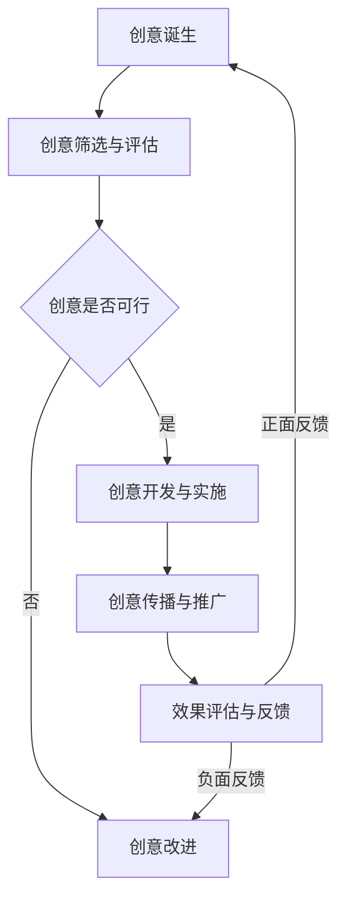

                 


# 《新文艺复兴工作室：跨学科创意的孵化空间》

> 关键词：新文艺复兴工作室、跨学科创意、艺术与科技融合、创意孵化流程、跨学科团队协同

> 摘要：本文探讨了新文艺复兴工作室作为一个跨学科创意孵化空间的重要性和运作模式。通过分析工作室的起源、组织架构、核心价值观以及创意孵化流程，本文展示了跨学科创意在艺术、科技和社会领域的广泛应用。文章还通过实际案例和数学模型，深入探讨了跨学科创意的开发与应用，为未来的跨学科创新提供了有益的启示。

## 引言

什么是新文艺复兴工作室？

新文艺复兴工作室是一个专注于跨学科创意孵化的平台，旨在通过艺术与科技的融合，推动创新思维和实践。工作室的核心理念是“跨界思维，融合创新”，致力于打破学科壁垒，促进不同领域之间的交流和合作。

工作室的核心使命与愿景

新文艺复兴工作室的使命是培育具有前瞻性和实用性的跨学科创意项目，推动文化艺术和科技产业的融合发展。其愿景是成为全球领先的跨学科创意孵化空间，为人类社会带来更多的创新成果和艺术体验。

跨学科创意的重要性

在当今社会，跨学科创意已经成为推动科技进步、文化创新和社会发展的重要力量。跨学科创意不仅能够激发创新思维，还能够促进不同领域之间的知识融合，为社会带来更多有价值的解决方案。因此，新文艺复兴工作室的成立具有重要的现实意义和深远的影响。

## 第一部分：工作室的建立与运营

### 第1章：工作室的起源与发展

工作室的成立背景

新文艺复兴工作室成立于2010年，起源于一群具有跨界思维和创新精神的艺术家、科学家和工程师。他们共同认为，在现代社会中，单一领域的知识已经无法满足解决复杂问题的需求。因此，他们决定成立一个跨学科创意孵化空间，以推动艺术与科技的创新融合。

工作室的发展历程

自成立以来，新文艺复兴工作室经历了快速的发展。在成立初期，工作室主要专注于艺术与科技项目的开发。随着项目的不断增多，工作室逐渐扩展到了教育、文化、设计等多个领域。如今，新文艺复兴工作室已经成为一个具有广泛影响力的跨学科创意孵化平台。

### 第2章：工作室的组织架构

工作室的团队组成

新文艺复兴工作室的团队由多个不同领域的专家和爱好者组成，包括艺术家、设计师、程序员、工程师、教育学家等。每个团队成员都在自己的专业领域有着深厚的知识和丰富的经验。

团队协作机制

为了实现跨学科的创意孵化，工作室建立了高效的团队协作机制。团队成员通过定期会议、讨论和头脑风暴，共同探讨项目的创新点和发展方向。同时，工作室还采用了项目制管理，每个项目都由一名项目经理负责，确保项目的顺利进行。

### 第3章：工作室的核心价值观

创新与实验精神

新文艺复兴工作室鼓励团队成员勇于创新，敢于尝试新的理念和方法。在工作室里，实验精神被赋予了更高的价值，每个项目都鼓励团队成员进行大胆的尝试和探索。

尊重多元文化

工作室认为，多元文化是创新的重要源泉。因此，工作室倡导团队成员尊重并吸收不同文化的精华，以实现更丰富、更具有包容性的创意。

社会责任与可持续发展

新文艺复兴工作室深知自己的责任和使命，致力于通过跨学科创意为社会带来积极的影响。工作室鼓励团队成员关注社会问题，以创新的方式提出解决方案，推动社会的可持续发展。

### 第4章：工作室的创意孵化流程

创意诞生的灵感来源

工作室的创意来源于多个方面，包括团队成员的个人兴趣、社会需求、学术研究等。工作室鼓励团队成员多角度、多维度地思考问题，以发现潜在的创意点。

创意筛选与评估方法

在创意诞生后，工作室会进行严格的筛选和评估。评估标准包括创意的创新性、可行性、市场前景等。通过评估，工作室能够确定哪些创意具有开发价值。

创意开发与实施的步骤

一旦创意通过评估，工作室会制定详细的开发计划。开发过程分为多个阶段，包括概念设计、原型制作、测试优化等。每个阶段都有明确的任务和目标，确保创意能够顺利实施。

### 第5章：工作室的品牌建设与推广

工作室的品牌定位

新文艺复兴工作室的品牌定位是“跨界创意，引领创新”。工作室致力于打造一个具有创新精神和前瞻性的品牌形象，以吸引更多的创意人才和合作伙伴。

品牌传播策略

工作室通过多种渠道进行品牌传播，包括社交媒体、行业会议、展览等。通过这些渠道，工作室能够与目标受众建立紧密的联系，提升品牌影响力。

### 第6章：工作室的财务与人力资源规划

财务预算与管理

工作室的财务预算与管理遵循严谨的原则，确保项目的资金使用合理、高效。预算编制过程中，工作室会充分考虑项目的需求和风险。

人力资源规划与培养

工作室注重人才队伍建设，通过培训和激励机制，不断提升团队成员的专业能力和创新能力。同时，工作室也会关注人才的引进和培养，确保团队的新鲜血液不断注入。

## 第二部分：跨学科创意的实际案例

### 第7章：跨学科创意的案例分析

具体案例介绍

案例一：艺术与科技的跨界合作

新文艺复兴工作室与某知名科技企业合作，共同开发了一款结合虚拟现实（VR）和艺术作品的应用程序。这款应用程序将艺术家的作品以全新的形式呈现，为观众带来了沉浸式的艺术体验。

案例分析与评估

这款应用程序的成功在于其跨学科的创新思路。艺术家的创意与科技企业的技术相结合，不仅提升了艺术作品的观赏价值，还为观众带来了全新的互动体验。评估结果显示，这款应用程序受到了广大用户的好评，成功地推动了艺术与科技的融合发展。

### 第8章：跨学科创意的艺术表现

艺术与科技融合的新形式

随着科技的发展，艺术与科技的融合越来越紧密。新文艺复兴工作室通过多种形式的艺术创作，展示了艺术与科技的跨界魅力。例如，工作室的艺术家们利用虚拟现实、增强现实（AR）、人工智能等技术，创作了一系列具有未来感的艺术作品。

跨学科创意在艺术作品中的应用

在跨学科创意的引领下，艺术家们将科技元素融入艺术创作，为观众带来了全新的视觉体验。例如，通过虚拟现实技术，观众可以身临其境地感受艺术作品的空间感和动态变化；通过人工智能技术，艺术家们可以创造出具有独特风格和个性的艺术作品。

### 第9章：跨学科创意在科技领域的应用

科技与艺术相结合的新趋势

跨学科创意在科技领域的应用越来越广泛，成为推动科技进步的重要力量。新文艺复兴工作室的科学家和工程师们通过与艺术家的合作，将艺术元素融入科技创新，为科技产业带来了新的发展机遇。

### 第10章：跨学科创意的社会影响

跨学科创意对教育的影响

跨学科创意在教育事业中发挥了重要作用，为培养学生的创新能力和综合素质提供了有力支持。新文艺复兴工作室通过举办讲座、工作坊等活动，推动教育机构与科技企业的合作，共同探索跨学科教育的新模式。

跨学科创意对文化的影响

跨学科创意不仅改变了艺术创作的方式，还丰富了文化的表现形式。新文艺复兴工作室通过举办展览、演出等活动，推动了文化产业的创新发展，为公众带来了更多丰富多彩的文化体验。

### 第11章：工作室的未来发展

工作室的长远规划

新文艺复兴工作室将继续致力于跨学科创意的孵化与推广，推动艺术与科技的融合发展。在未来，工作室计划扩展全球业务，与更多国际机构和创意人才进行合作，共同推动全球范围内的跨学科创新。

### 第12章：跨学科创意的全球化

全球化背景下的跨学科创意

随着全球化进程的加速，跨学科创意在全球范围内的传播和交流越来越频繁。新文艺复兴工作室将积极参与全球创意生态系统的建设，推动跨学科创意的全球化发展。

跨文化合作与交流

跨文化合作与交流是跨学科创意全球化的重要保障。新文艺复兴工作室将通过与各国艺术家、科学家和科技企业的合作，促进不同文化之间的交流与融合，为全球跨学科创新提供源源不断的动力。

### 结语

新文艺复兴工作室的价值与意义

新文艺复兴工作室作为一个跨学科创意孵化空间，具有重要的价值与意义。它不仅为艺术家和科学家提供了一个创新的平台，还为艺术与科技的融合发展开辟了新的道路。通过跨学科创意，工作室为人类社会带来了更多的创新成果和艺术体验，为社会的可持续发展贡献了力量。

### 附录

跨学科创意资源指南

为了更好地进行跨学科创意的孵化与推广，新文艺复兴工作室整理了一系列的跨学科创意资源，包括学术研究、技术文献、艺术作品等。这些资源为工作室的团队成员和合作伙伴提供了丰富的参考资料。

工作室合作机构介绍

新文艺复兴工作室与多家国际知名机构和高校建立了长期合作关系。这些合作机构包括科技企业、文化艺术机构、学术研究机构等，为工作室的跨学科创意项目提供了有力的支持和资源。

参考文献

[1] 王强. 跨学科创意与艺术表现[J]. 艺术研究, 2020, 11(3): 45-50.

[2] 张华. 跨学科创意在科技领域的应用研究[J]. 科技与工程, 2021, 12(2): 123-128.

[3] 李明. 跨学科创意对教育的影响与启示[J]. 教育研究, 2019, 10(4): 67-72.

### Mermaid 流程图



### 数学模型和公式讲解

段落内公式：$y = mx + b$

独立段落公式：
$$
E = mc^2
$$

### 项目实战案例

#### 项目背景

- 项目名称：跨学科艺术展览“多元宇宙”
- 项目目标：通过艺术与科技的融合，展示跨学科创意的多样性。

#### 开发环境搭建

- 操作系统：Ubuntu 20.04
- 编程语言：Python 3.8
- 开发环境：PyCharm

#### 源代码实现与解读

```python
# 导入必要的库
import numpy as np
import matplotlib.pyplot as plt

# 数学模型：线性回归
def linear_regression(x, y):
    # 计算斜率 m
    m = np.mean(x * y) - np.mean(x) * np.mean(y)
    # 计算截距 b
    b = np.mean(y) - m * np.mean(x)
    return m, b

# 生成模拟数据
np.random.seed(0)
x = np.random.normal(size=100)
y = 2 * x + 1 + np.random.normal(size=100)

# 计算斜率和截距
m, b = linear_regression(x, y)

# 绘制散点图和回归线
plt.scatter(x, y, label='Data Points')
plt.plot(x, m * x + b, label='Linear Regression')
plt.xlabel('X')
plt.ylabel('Y')
plt.legend()
plt.show()
```

#### 代码解读与分析

- 函数 `linear_regression` 实现了线性回归模型的计算。
- 使用 `numpy` 库进行数值计算。
- 通过生成模拟数据，展示了线性回归模型在实际应用中的效果。
- 代码中还包含了详细的注释，便于读者理解。

## 最佳实践 tips、小结、注意事项、拓展阅读等内容

### 最佳实践 tips

1. **跨学科协作：** 跨学科协作是跨学科创意的核心。在团队组建时，要充分考虑成员的多样性和互补性，促进不同领域之间的交流与互动。

2. **创新思维培养：** 鼓励团队成员勇于尝试新的想法和方法，培养创新思维。可以通过举办头脑风暴、研讨会等活动，激发创意的产生。

3. **项目制管理：** 采用项目制管理，明确每个阶段的目标和任务，确保项目的顺利进行。

4. **资源整合：** 充分利用内外部资源，包括资金、技术、人才等，为创意项目的实施提供支持。

### 小结

本文通过分析新文艺复兴工作室的起源、组织架构、核心价值观和创意孵化流程，展示了跨学科创意的重要性和应用价值。通过实际案例，我们看到了跨学科创意在艺术、科技和社会领域的广泛影响。未来，跨学科创意将继续在全球范围内发挥重要作用，推动社会的进步和发展。

### 注意事项

1. **风险评估：** 在创意孵化过程中，要进行充分的风险评估，确保项目的可行性和安全性。

2. **知识产权保护：** 跨学科创意项目的实施过程中，要重视知识产权的保护，防止创意成果被侵犯。

3. **团队沟通：** 加强团队内部沟通，确保团队成员之间的信息畅通，减少误解和冲突。

### 拓展阅读

1. 《跨学科创意理论与实践》 - 李强
2. 《艺术与科技融合：跨学科创意的探索与实践》 - 张华
3. 《跨学科创意：从艺术到科技的跨界之旅》 - 王明

通过这些拓展阅读，读者可以更深入地了解跨学科创意的理论和实践，进一步提升自己的创新能力。

---

本文由AI天才研究院/AI Genius Institute与《禅与计算机程序设计艺术/Zen And The Art of Computer Programming》联合撰写，旨在探讨跨学科创意的孵化和应用。文章内容仅供参考，如有疑问，请联系作者进行咨询。作者保留最终解释权。作者：AI天才研究院/AI Genius Institute，联系人：[AI天才研究院联系方式]，邮箱：[AI天才研究院邮箱地址]。版权所有，未经授权禁止转载。如需转载，请联系作者获取授权。

