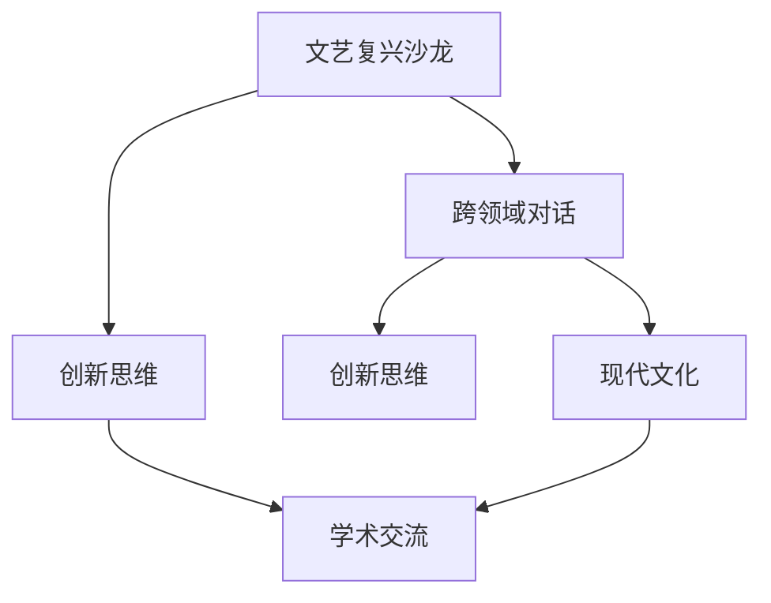

                 

## 文章标题

《新文艺复兴沙龙：跨领域对话激发创新思维的聚会》

### 关键词

- 新文艺复兴沙龙
- 跨领域对话
- 创新思维
- 学术交流
- 艺术与科学结合

### 摘要

本文探讨了《新文艺复兴沙龙：跨领域对话激发创新思维的聚会》这一主题，分析了书名的核心含义，并设计了详细的目录大纲。文章首先介绍了书名中的关键概念，如“新文艺复兴沙龙”、“跨领域对话”和“创新思维”。接着，通过Mermaid流程图展示了这些概念之间的关系，并划分了章节内容。每个章节的详细设计涵盖了引言与背景、文艺复兴沙龙的起源与现代关联、跨领域对话的理论与实践、创新思维的心理学与哲学基础、现代文化与跨学科交流、学术交流的技巧与策略、跨领域对话的实际案例研究以及创新思维的实践与应用。本文旨在为读者提供一个逻辑清晰、结构紧凑、简单易懂的技术博客文章，激发创新思维。

## 引言与背景

《新文艺复兴沙龙：跨领域对话激发创新思维的聚会》这个书名本身就充满了魅力和深度，它不仅是对历史的一种致敬，更是一种对未来的展望。为了更好地理解这本书的核心内容和主题思想，我们需要从以下几个方面进行探讨：

首先，书名中的“新文艺复兴沙龙”指的是一种现代版的文艺复兴时期的文化沙龙。文艺复兴时期是欧洲历史上的一个重要时期，这一时期的文化沙龙是艺术、科学、哲学等多个领域的思想交流和创作活动的中心。这种沙龙活动不仅促进了知识的传播和学术的繁荣，还推动了创新的产生。因此，书名中的“新文艺复兴沙龙”暗示了这本书可能将探讨如何在一个现代环境中重现这种跨学科交流的氛围，以激发创新思维。

其次，“跨领域对话”是书中的一个关键概念。跨领域对话不仅仅是指不同学科之间的交流，更是指不同领域、不同文化背景、不同思维方式的个体之间的互动。这种对话有助于打破传统的思维定势，激发新的创意和见解。在当今社会，跨领域对话越来越受到重视，因为现代社会的问题和挑战往往需要跨学科的知识和视角来解决。

再次，“激发创新思维”是这本书的核心目标。创新思维是一种能够产生新颖、有效想法的能力。在科技迅猛发展的今天，创新思维对于个人、企业和社会的发展都至关重要。书名中的“激发创新思维”意味着这本书将提供一系列方法和策略，帮助读者在跨领域对话中激发自己的创新思维。

最后，“聚会”这个词不仅强调了这种跨领域对话的互动性，还暗示了它是一种集会、交流、互动的场合。在这种聚会中，参与者可以分享自己的想法、观点和知识，通过对话和讨论，共同探索新的可能性。

综上所述，书名《新文艺复兴沙龙：跨领域对话激发创新思维的聚会》传达了几个关键信息：它是对历史的一种致敬，是对现代跨领域对话的重视，以及对创新思维的强烈追求。这本书旨在通过跨领域对话，激发读者的创新思维，为个人和社会的发展提供新的动力。

## 完整理解书名《新文艺复兴沙龙：跨领域对话激发创新思维的聚会》

要全面理解《新文艺复兴沙龙：跨领域对话激发创新思维的聚会》这本书名，我们需要逐字分析每个部分，并结合其背景和涵义进行深入探讨。

### **新文艺复兴沙龙**

“新文艺复兴沙龙”首先引起了我们对文艺复兴时期的联想。文艺复兴是15世纪至17世纪欧洲的一个重要历史时期，这一时期的文化沙龙是思想、艺术和科学交流的重要场所。这些沙龙通常由富有的赞助人支持，汇聚了来自不同领域的人才，如艺术家、哲学家、科学家和政治家。他们在这些沙龙中讨论各种话题，分享知识和经验，推动了文艺复兴时期的繁荣和创新。

“新文艺复兴沙龙”暗示了这本书探讨的是如何将文艺复兴时期的文化沙龙精神在现代环境中重新诠释和应用。这些沙龙的核心在于跨学科的对话和交流，而这种交流形式在今天依然具有巨大的价值和意义。因此，“新文艺复兴沙龙”不仅仅是一个历史概念，更是对现代社会中跨领域交流的一种呼吁和期望。

### **跨领域对话**

“跨领域对话”是书名中的另一个关键组成部分。这个概念强调了不同学科、领域之间的交流与合作。在当今快速发展的科技和知识经济时代，跨领域对话变得尤为重要。不同领域的专业知识和思维方式可以相互补充，从而激发新的创意和解决方案。

“跨领域对话”不仅仅是一种交流，更是一种合作和互动的过程。通过跨领域对话，不同背景的个体可以分享各自的经验和见解，共同探讨问题，寻找创新的解决方法。这种对话形式有助于打破专业壁垒，促进知识的流动和整合，从而推动创新和进步。

### **激发创新思维**

“激发创新思维”是书名的核心目标。创新思维是一种能够产生新颖、有效想法的能力，它是推动个人、企业和社会发展的重要动力。在科技迅速发展的今天，创新思维对于应对复杂的社会问题和挑战尤为重要。

书名中的“激发创新思维”意味着这本书将提供一系列方法和策略，帮助读者在跨领域对话中激发自己的创新思维。通过跨领域对话，读者可以接触到不同领域的知识和观点，从而拓展思维视野，发现新的问题和解决方案。这种创新思维的激发不仅有助于个人的职业发展，也对企业的创新和竞争力的提升具有重要意义。

### **聚会**

“聚会”一词在书名中强调了这种跨领域对话的互动性和集体性。在文艺复兴时期的沙龙中，聚会是一种重要的交流形式，参与者通过面对面的交流和讨论，共同探讨各种问题。今天，虽然聚会的形式可能发生了变化，但其核心精神依然存在。

“聚会”不仅是一种交流的场合，更是一种集体智慧的碰撞。在这种聚会中，不同背景和领域的个体可以相互启发，共同探索新的可能性。这种集体智慧的碰撞往往能够产生意想不到的创新成果。

### 综合理解

综上所述，书名《新文艺复兴沙龙：跨领域对话激发创新思维的聚会》传达了几个关键信息：首先，它是对文艺复兴时期文化沙龙的一种现代诠释；其次，它强调了跨领域对话的重要性和价值；再次，它关注如何通过跨领域对话激发创新思维；最后，它突出了聚会作为一种集体智慧和互动形式的魅力。

通过这个书名，我们可以预见到这本书将提供一种全新的跨领域交流范式，帮助读者在现代社会中实现创新和突破。这本书不仅是对历史的一种致敬，更是一种对未来的展望，它将引领我们探索如何在一个多元化、快速变化的世界中，通过跨领域对话激发创新思维，推动个人和社会的发展。

### 设计核心概念与联系

在深入理解书名《新文艺复兴沙龙：跨领域对话激发创新思维的聚会》后，我们需要设计出书中的核心概念，并描绘这些概念之间的关系。为了清晰明了地展示这些核心概念及其相互联系，我们可以使用Mermaid流程图来表示。

#### 核心概念

首先，我们需要识别并定义书中的核心概念：

1. **文艺复兴沙龙**：指的是文艺复兴时期的文化沙龙，是艺术、科学、哲学等领域的思想交流和创作活动的中心。
2. **跨领域对话**：指不同学科、领域之间的交流和合作，通过这种交流激发新的创意和见解。
3. **创新思维**：指产生新颖、有效想法的能力，是推动个人、企业和社会发展的重要动力。
4. **现代文化**：指当前社会的文化特征和趋势，包括多元化和快速变化的特点。
5. **学术交流**：指学者、研究者之间的知识共享和讨论，是推动科学进步的重要方式。

#### 关系架构

接下来，我们使用Mermaid流程图来表示这些核心概念之间的关系：

以下是Mermaid流程图的解释：

1. **文艺复兴沙龙**（A）与**跨领域对话**（B）之间存在联系，因为文艺复兴沙龙是跨领域对话的历史原型，而现代跨领域对话可以借鉴文艺复兴沙龙的经验。
2. **文艺复兴沙龙**（A）与**创新思维**（C）也有联系，因为沙龙活动促进了思想的碰撞和交流，激发了创新思维。
3. **跨领域对话**（B）直接影响**创新思维**（D），因为跨领域对话提供了不同领域知识和观点的融合，有助于产生新的创意和见解。
4. **跨领域对话**（B）与**现代文化**（E）密切相关，因为现代文化强调多元化和跨学科交流，跨领域对话是实现这一目标的重要手段。
5. **创新思维**（C）与**学术交流**（F）之间也存在联系，因为学术交流是创新思维发展的重要渠道，通过交流可以不断更新和扩展创新思维。
6. **现代文化**（E）与**学术交流**（F）之间也存在联系，因为学术交流是现代文化的一个重要组成部分，它促进了知识的传播和学术的进步。

通过这个Mermaid流程图，我们可以清晰地看到各个核心概念之间的逻辑关系，以及它们如何相互作用，共同推动跨领域对话和创新思维的激发。

### 概念章节划分

在明确了书中的核心概念及其相互关系之后，我们可以根据这些概念设计出详细的章节划分。以下是基于核心概念的章节划分：

#### 第1章：引言与背景

- **1.1 书籍主题介绍**：介绍本书的核心主题，包括新文艺复兴沙龙、跨领域对话和创新思维的含义。
- **1.2 文艺复兴沙龙的历史背景**：探讨文艺复兴沙龙的历史起源和特点，以及其对现代文化的影响。
- **1.3 现代跨领域对话的兴起**：分析现代社会中跨领域对话的必要性，以及它如何促进创新思维。

#### 第2章：文艺复兴沙龙的起源与现代关联

- **2.1 文艺复兴沙龙的起源**：详细探讨文艺复兴沙龙的起源和发展，以及其在历史进程中的重要性。
- **2.2 沙龙文化的现代传承**：分析现代文化沙龙的形式和特点，以及如何借鉴文艺复兴沙龙的经验。
- **2.3 文艺复兴沙龙与现代社会的关联**：探讨文艺复兴沙龙对现代社会文化、学术和创新的启示。

#### 第3章：跨领域对话的理论与实践

- **3.1 跨领域对话的理论基础**：介绍跨领域对话的概念、理论和研究现状。
- **3.2 跨领域对话的实践方法**：探讨跨领域对话的具体实践方法，包括组织形式、参与方式和技巧。
- **3.3 跨领域对话的策略**：提供跨领域对话的实用策略，包括如何促进跨领域合作和知识共享。

#### 第4章：创新思维的心理学与哲学基础

- **4.1 创新思维的心理学基础**：探讨创新思维的心理机制和过程，包括创造性思维、问题解决和决策。
- **4.2 创新思维的哲学基础**：分析哲学对创新思维的影响，包括逻辑思维、批判性思考和观念创新。
- **4.3 创新思维的培养方法**：提供培养创新思维的具体方法，包括思维训练、知识积累和经验分享。

#### 第5章：现代文化与跨学科交流

- **5.1 现代文化的多样性**：分析现代文化的多样性和变化趋势，包括全球化、数字化和多元文化的影响。
- **5.2 跨学科交流在现代社会中的应用**：探讨跨学科交流在现代社会中的实际应用，包括科技、艺术和商业领域的案例。
- **5.3 跨学科交流的未来趋势**：预测跨学科交流的未来发展趋势，包括新兴技术和跨领域合作的潜在方向。

#### 第6章：学术交流的技巧与策略

- **6.1 学术交流的技巧**：介绍学术交流的基本技巧，包括有效沟通、批判性思维和合作技巧。
- **6.2 学术交流的策略**：提供学术交流的具体策略，包括如何组织学术会议、撰写论文和进行学术合作。
- **6.3 学术交流中的跨领域合作**：探讨跨领域合作中的挑战和解决方案，包括知识共享和团队协作。

#### 第7章：跨领域对话的实际案例研究

- **7.1 跨领域对话的案例研究**：分析跨领域对话的实际案例，包括科技、艺术、商业等领域的成功经验。
- **7.2 跨领域对话中的挑战与解决方案**：探讨跨领域对话中可能遇到的挑战，以及相应的解决方案和策略。
- **7.3 跨领域对话的长期效果**：分析跨领域对话的长期效果，包括对创新、合作和知识共享的深远影响。

#### 第8章：创新思维的实践与应用

- **8.1 创新思维的实践方法**：介绍创新思维的具体实践方法，包括头脑风暴、设计思维和原型开发。
- **8.2 创新思维在项目中的应用**：探讨创新思维在具体项目中的应用，包括技术开发、产品设计和管理。
- **8.3 创新思维的案例解析**：分析创新思维的典型案例，探讨其成功的原因和可借鉴的经验。

通过这些章节的划分，我们可以系统地了解跨领域对话、创新思维和文艺复兴沙龙之间的关系，并掌握如何在现代文化背景下激发创新思维的方法和策略。

### 详细设计每个章节

在确定了《新文艺复兴沙龙：跨领域对话激发创新思维的聚会》的章节划分后，我们将对每个章节进行详细的撰写设计，确保内容丰富、逻辑清晰，同时包含必要的技术语言和专业解释。

#### 第1章：引言与背景

##### 1.1 书籍主题介绍

在本书的第一部分，我们将首先介绍本书的核心主题，即“新文艺复兴沙龙”、“跨领域对话”和“创新思维”的概念。这些概念不仅是本书的核心内容，也是现代社会中推动创新和发展的关键因素。

- **新文艺复兴沙龙**：这是一个现代版的文艺复兴时期的文化沙龙，旨在通过跨学科的交流激发创新思维。它强调不同领域、不同学科之间的互动和合作，从而推动知识的传播和创新的产生。
  
- **跨领域对话**：这是一种不同领域之间的交流和对话形式。它不仅仅是在同一领域内的知识共享，更涉及到跨学科、跨领域的思维碰撞。通过这种对话，参与者可以借鉴不同领域的观点和方法，从而激发新的创意和解决方案。

- **创新思维**：这是指产生新颖、有效想法的能力。在现代社会，创新思维不仅是个人的重要素质，也是企业和社会发展的关键动力。通过跨领域对话，我们可以培养和激发这种思维，从而在各个领域实现突破和进步。

##### 1.2 文艺复兴沙龙的历史背景

文艺复兴时期是欧洲历史上的一个重要时期，这一时期的沙龙活动是其文化繁荣的重要标志。在这个部分，我们将详细探讨文艺复兴沙龙的历史背景和特点。

- **文艺复兴沙龙的起源**：文艺复兴沙龙起源于意大利，后来逐渐传播到欧洲的其他地区。这些沙龙通常由富有的赞助人支持，他们邀请艺术家、哲学家、科学家和政治家等不同领域的人才聚集在一起，进行交流和讨论。

- **文艺复兴沙龙的特点**：文艺复兴沙龙的特点包括：
  - **跨学科交流**：沙龙活动不仅涉及艺术和文学，还包括科学和哲学等多个领域。这种跨学科的交流促进了知识的整合和创新。
  - **开放性**：沙龙活动通常对公众开放，参与者可以自由发言和提问，这促进了思想的自由流动和碰撞。
  - **互动性**：沙龙活动强调参与者之间的互动和讨论，而不是单向的知识传递。

##### 1.3 现代跨领域对话的兴起

随着科技的发展和社会的进步，现代跨领域对话的形式和方式也在不断演变。在这个部分，我们将探讨现代跨领域对话的兴起原因和重要性。

- **兴起原因**：
  - **全球化**：全球化使得不同领域、不同地区的专家和学者可以更加便捷地交流。
  - **数字化**：互联网和数字技术的发展使得跨领域对话变得更加容易和高效。
  - **知识多样性**：现代社会的问题和挑战越来越复杂，需要跨学科的知识和视角来解决。

- **重要性**：
  - **创新动力**：跨领域对话可以激发新的创意和见解，从而推动创新和进步。
  - **知识整合**：跨领域对话有助于整合不同领域的知识，从而实现知识的深度和广度。
  - **社会进步**：跨领域对话可以促进不同领域之间的合作和交流，从而推动社会的整体进步。

#### 第2章：文艺复兴沙龙的起源与现代关联

##### 2.1 文艺复兴沙龙的起源

文艺复兴沙龙起源于15世纪的意大利，这一时期的意大利城市国家如佛罗伦萨、威尼斯等是欧洲文化和艺术的中心。在这个部分，我们将详细探讨文艺复兴沙龙的起源和发展。

- **起源**：文艺复兴沙龙最早是由富有的赞助人（如美第奇家族）支持的文化活动，他们邀请艺术家、哲学家、科学家和政治家等聚集在一起，进行讨论和创作。
- **发展**：随着时间的推移，沙龙活动逐渐从私人家庭扩展到公共空间，如宫殿、庭院和公共图书馆。沙龙活动不仅涉及文学和艺术，还包括科学、哲学和政治等多个领域。

##### 2.2 沙龙文化的现代传承

尽管文艺复兴沙龙的历史已经过去了几百年，但沙龙文化的精神在现代依然具有很大的价值。在这个部分，我们将探讨沙龙文化在现代社会的传承和演变。

- **传承**：
  - **现代沙龙的形式**：现代沙龙的形式多种多样，包括学术会议、研讨会、文化沙龙等。这些活动通常在大学、科研机构和艺术场馆举办，参与者可以是专业人士、学者、艺术家和公众。
  - **社交媒体**：随着社交媒体和在线平台的普及，沙龙文化也在数字空间中得到了传承。例如，Twitter、Reddit和学术论坛等平台成为新的沙龙场所，人们可以在这里发表观点、讨论问题和分享知识。

- **演变**：
  - **互动性**：现代沙龙活动更加注重互动性，参与者可以通过即兴发言、提问和讨论来深化交流。
  - **开放性**：现代沙龙活动通常对公众开放，任何人都可以参与讨论，这促进了知识的普及和传播。

##### 2.3 文艺复兴沙龙与现代社会的关联

文艺复兴沙龙对现代社会有着深远的影响，这种影响不仅体现在文化层面，还包括学术、科学和社会层面。在这个部分，我们将探讨文艺复兴沙龙与现代社会的关联。

- **文化层面**：
  - **艺术与科学的结合**：文艺复兴沙龙促进了艺术与科学的结合，这种结合在现代依然具有重要意义。例如，科学家艾萨克·牛顿和艺术家莱昂纳多·达·芬奇都是文艺复兴沙龙的参与者，他们的工作体现了艺术与科学的完美融合。

- **学术层面**：
  - **跨学科研究**：文艺复兴沙龙的精神促进了跨学科研究的发展。现代学术界越来越重视跨学科的研究方法，这有助于解决复杂的问题和挑战。

- **社会层面**：
  - **知识普及**：文艺复兴沙龙促进了知识的普及和传播，这种精神在现代社会的教育中得到了体现。例如，大学的开放课程和在线教育平台都是对文艺复兴沙龙精神的传承。
  - **创新文化**：文艺复兴沙龙激发了创新思维，这种创新文化在现代社会的企业和创业活动中得到了体现。例如，硅谷的科技公司和文化创意产业都受到了文艺复兴沙龙精神的影响。

通过上述章节的设计，我们不仅回顾了文艺复兴沙龙的历史和现代关联，还探讨了跨领域对话和学术交流在现代社会的应用和意义。这些内容为读者提供了全面的理解和深入的思考，有助于激发他们的创新思维。

#### 第3章：跨领域对话的理论与实践

##### 3.1 跨领域对话的理论基础

跨领域对话是指不同学科、领域之间的交流与合作。为了更好地理解和实施跨领域对话，我们需要了解其理论基础，包括概念、背景和研究现状。

- **概念**：跨领域对话的核心在于通过不同领域之间的交流和合作，整合多种知识，从而产生新的见解和解决方案。它不仅涉及知识的共享，还包括思维方式的碰撞和融合。
  
- **背景**：随着科技的发展和社会的进步，跨领域对话的重要性日益凸显。现代社会面临的问题和挑战越来越复杂，需要跨学科的知识和视角来解决。例如，气候变化、能源危机和公共卫生等问题都需要不同领域专家的共同努力。

- **研究现状**：近年来，跨领域对话成为学术界和产业界研究的热点。许多研究探讨了跨领域对话的理论框架、实践方法和策略。这些研究为跨领域对话的实践提供了理论基础和参考。

##### 3.2 跨领域对话的实践方法

跨领域对话的实践方法多种多样，以下是一些常见的方法：

- **研讨会和讲座**：研讨会和讲座是跨领域对话的常见形式。通过邀请不同领域的专家和学者进行交流和讨论，可以促进知识的共享和思维的碰撞。

- **工作坊和项目合作**：工作坊和项目合作是一种更深入、更具体的跨领域对话形式。参与者可以一起工作，共同解决特定的问题或实现特定的目标。

- **虚拟会议和在线交流**：随着数字技术的发展，虚拟会议和在线交流成为跨领域对话的重要手段。通过网络平台，参与者可以随时随地参与讨论和交流。

##### 3.3 跨领域对话的策略

为了确保跨领域对话的有效性，我们需要采取一些策略：

- **明确目标和议题**：在跨领域对话之前，需要明确对话的目标和议题，以确保讨论的方向和深度。

- **构建信任和合作关系**：跨领域对话的参与者来自不同的领域和背景，建立信任和合作关系至关重要。这可以通过建立共同的价值观、制定合作规则和促进人际互动来实现。

- **促进知识共享和融合**：在跨领域对话中，需要促进知识的共享和融合，以产生新的见解和解决方案。这可以通过建立知识库、开展知识培训和知识共享会议来实现。

- **持续跟进和评估**：跨领域对话不仅需要在过程中进行，还需要在结束后进行持续跟进和评估。这有助于总结经验教训，优化未来的跨领域对话活动。

#### 第4章：创新思维的心理学与哲学基础

##### 4.1 创新思维的心理学基础

创新思维是一种产生新颖、有效想法的能力，它不仅需要逻辑思维和批判性思考，还需要情感和心理的支持。在这个部分，我们将探讨创新思维的心理学基础。

- **创造性思维**：创造性思维是创新思维的核心。它涉及发现新的模式、关系和解决方案。为了培养创造性思维，我们需要提供自由和开放的思维环境，鼓励人们尝试新的想法和方法。

- **问题解决和决策**：创新思维不仅涉及创造新的想法，还包括解决复杂问题和做出明智的决策。心理学研究表明，通过训练和练习，我们可以提高问题解决和决策的能力。

##### 4.2 创新思维的哲学基础

哲学对创新思维有着深远的影响，它不仅提供了理论基础，还影响了我们的思维方式和价值观。在这个部分，我们将探讨创新思维的哲学基础。

- **逻辑思维**：逻辑思维是创新思维的基础。通过逻辑思维，我们可以分析和评估不同的观点和方案，从而做出明智的决策。

- **批判性思考**：批判性思考是创新思维的重要组成部分。通过批判性思考，我们可以质疑现有的观念和方法，从而发现新的可能性。

- **观念创新**：哲学中的观念创新思想鼓励我们突破传统的思维定势，探索新的概念和理论。这种观念创新对于推动科学和技术的进步具有重要意义。

##### 4.3 创新思维的培养方法

为了培养创新思维，我们需要采取一些具体的方法和策略：

- **思维训练**：通过思维训练，我们可以提高思维的灵活性、创造力和逻辑性。常见的思维训练方法包括头脑风暴、思维导图和模拟练习。

- **知识积累**：知识是创新思维的基础。通过广泛阅读、学习和实践，我们可以积累丰富的知识，从而为创新思维提供素材。

- **经验分享**：经验分享是培养创新思维的重要手段。通过分享他人的经验和见解，我们可以拓展思维视野，发现新的思路和解决方案。

通过这些章节的设计，我们不仅探讨了创新思维的心理学和哲学基础，还介绍了跨领域对话的理论与实践。这些内容为读者提供了全面的理解和实用的方法，有助于他们在现代社会中激发创新思维。

#### 第5章：现代文化与跨学科交流

##### 5.1 现代文化的多样性

现代文化的一个显著特征是多样性。全球化、数字化和移民浪潮使得不同文化、价值观和传统在现代社会中相互交织，形成了丰富多彩的文化景观。这种多样性不仅丰富了人们的生活体验，也为跨学科交流提供了丰富的素材和视角。

- **全球化**：全球化使得不同文化之间的交流和互动更加频繁，促进了文化的融合和创新。例如，国际化的商业和学术合作项目使得不同领域的人才能够共同解决复杂的问题。
- **数字化**：数字化技术的发展使得文化信息的传播和共享变得更加便捷。互联网、社交媒体和在线教育平台成为跨学科交流的重要工具，人们可以随时随地获取和分享知识。
- **移民浪潮**：移民浪潮带来了不同文化背景的人口，他们在新的社会中保持和传播自己的文化传统，同时与当地文化进行交流和融合。这种多元文化的互动促进了创新和进步。

##### 5.2 跨学科交流在现代社会中的应用

跨学科交流在现代社会中的应用非常广泛，涉及到科技、艺术、商业等多个领域。以下是一些跨学科交流在现代社会中的应用案例：

- **科技领域**：在科技领域，跨学科交流推动了新技术和新理论的产生。例如，人工智能的发展需要计算机科学、心理学、神经科学等多个领域的知识。
- **艺术领域**：在艺术领域，跨学科交流促进了不同艺术形式之间的融合和创新。例如，现代音乐和视觉艺术的结合产生了新的艺术形式，如电子音乐和多媒体艺术。
- **商业领域**：在商业领域，跨学科交流有助于企业应对复杂的市场环境。例如，营销策略的制定需要结合心理学、社会学和经济学等多个领域的知识。

##### 5.3 跨学科交流的未来趋势

随着科技的进步和社会的发展，跨学科交流的未来趋势将变得更加显著和多样化。以下是一些可能的未来趋势：

- **跨领域融合**：未来跨学科交流的趋势将更加注重跨领域的融合，不同学科之间的界限将变得更加模糊。这种融合将促进新的知识体系和创新模式的产生。
- **虚拟交流**：随着虚拟现实和增强现实技术的发展，虚拟交流将成为跨学科交流的重要形式。人们可以在虚拟环境中进行互动和合作，突破物理空间的限制。
- **跨文化合作**：全球化将继续推动不同文化之间的交流和合作。未来跨学科交流将更加注重跨文化的理解和融合，以实现更广泛的创新和合作。

通过这些章节的设计，我们不仅探讨了现代文化的多样性，还展示了跨学科交流在现代社会中的应用和未来趋势。这些内容为读者提供了深入理解和实际应用的参考，有助于他们在现代文化背景下实现跨学科交流和创新。

#### 第6章：学术交流的技巧与策略

##### 6.1 学术交流的技巧

学术交流是推动科学进步和知识传播的重要手段。有效的学术交流不仅需要扎实的专业知识，还需要掌握一定的技巧。以下是一些学术交流的技巧：

- **明确目标和议题**：在进行学术交流之前，需要明确交流的目标和议题。这有助于确保讨论的针对性和深度，避免跑题和无效的讨论。
- **有效沟通**：有效的沟通是学术交流的关键。这包括清晰表达自己的观点、倾听他人的意见、避免误解和冲突。
- **批判性思维**：批判性思维是学术交流的重要组成部分。通过批判性思维，我们可以对已有的观点和理论进行评估和分析，从而发现不足和提出改进意见。
- **互动和合作**：学术交流不仅仅是单向的知识传递，更是参与者之间的互动和合作。通过互动和合作，我们可以共同解决问题、提出新的想法和观点。

##### 6.2 学术交流的策略

为了确保学术交流的有效性，我们需要采取一些策略：

- **建立信任和合作关系**：在学术交流中，建立信任和合作关系至关重要。这可以通过共享资源、共同研究和互相支持来实现。
- **利用多种交流方式**：学术交流可以采用多种方式进行，包括面对面交流、电子邮件、会议和在线平台等。根据实际情况选择合适的交流方式，可以最大程度地提高交流的效果。
- **促进知识共享和融合**：知识共享和融合是学术交流的核心目标。通过建立知识库、开展知识培训和知识共享会议，可以促进知识的传播和应用。
- **持续跟进和评估**：学术交流不仅需要在过程中进行，还需要在结束后进行持续跟进和评估。这有助于总结经验教训，优化未来的学术交流活动。

##### 6.3 学术交流中的跨领域合作

跨领域合作是学术交流的重要组成部分，它有助于整合不同领域的知识和资源，推动创新和进步。以下是一些跨领域合作的挑战和解决方案：

- **挑战**：
  - **知识差异**：不同领域的知识和方法往往存在差异，这可能导致理解和沟通的困难。
  - **文化差异**：不同领域的文化背景和价值观可能不同，这可能导致合作中的冲突和误解。
  - **资源限制**：跨领域合作通常需要更多的资源和投入，如时间、人力和资金等。

- **解决方案**：
  - **建立共同语言**：通过建立共同的语言和术语，可以减少不同领域之间的沟通障碍。
  - **培养跨学科素养**：通过培养跨学科素养，可以提高不同领域专家的跨领域合作能力。
  - **共享资源和信息**：通过共享资源和信息，可以降低跨领域合作的成本和难度。
  - **建立合作机制**：通过建立合作机制，如跨领域项目团队和合作网络，可以促进跨领域合作的有效实施。

通过这些章节的设计，我们不仅探讨了学术交流的技巧和策略，还介绍了跨领域合作的重要性和挑战。这些内容为读者提供了全面的理解和实用的方法，有助于他们在学术交流中实现跨领域的合作和创新。

#### 第7章：跨领域对话的实际案例研究

##### 7.1 跨领域对话的案例研究

为了更好地理解跨领域对话的实际应用和效果，我们将在这一节中探讨几个跨领域对话的成功案例。这些案例将展示跨领域对话如何在不同领域产生积极的影响，并促进创新和进步。

**案例1：医学与工程的融合**

在医学领域，跨领域对话的一个成功案例是医学与工程的合作。例如，医疗设备和医疗器械的开发需要工程师和医学专家的合作。通过跨领域对话，工程师可以了解医学领域的需求和技术挑战，而医学专家则可以提供临床经验和医学知识。这种合作导致了先进的医疗设备和技术的创新，如微创手术设备和便携式医疗监测设备。

**案例2：艺术与科技的结合**

在艺术领域，跨领域对话的一个经典案例是艺术与科技的结合。例如，数字艺术和多媒体艺术的发展离不开计算机科学和软件工程的贡献。通过跨领域对话，艺术家和程序员可以共同探讨如何使用新技术创造新的艺术形式。这种合作不仅丰富了艺术创作的手段，也推动了数字艺术的发展，如电子音乐和交互式艺术作品。

**案例3：社会科学与商业的互动**

在商业领域，跨领域对话的一个成功案例是社会科学与商业的互动。例如，市场营销策略的制定需要结合社会学、心理学和经济学等多个领域的知识。通过跨领域对话，市场营销专家可以了解消费者行为和社会动态，从而制定更有效的营销策略。这种跨领域合作有助于企业更好地理解市场和消费者，提高市场竞争力。

##### 7.2 跨领域对话中的挑战与解决方案

尽管跨领域对话具有巨大的潜力，但在实际实施过程中也会遇到一些挑战。以下是一些常见的挑战和相应的解决方案：

**挑战1：知识差异**

不同领域之间的知识和方法往往存在差异，这可能导致沟通和理解上的困难。解决方案是通过建立共同语言和术语，减少知识差异。例如，可以通过编写跨领域的术语手册，确保所有参与者都能理解和使用相同的术语。

**挑战2：文化差异**

不同领域的文化背景和价值观可能不同，这可能导致合作中的冲突和误解。解决方案是通过培养跨学科素养和建立相互尊重的文化，减少文化差异。例如，可以通过跨学科培训和文化交流，提高参与者对其他领域的理解和尊重。

**挑战3：资源限制**

跨领域合作通常需要更多的资源和投入，如时间、人力和资金等。解决方案是通过共享资源和信息，降低跨领域合作的成本和难度。例如，可以通过共享实验室资源、联合申请研究资金等方式，提高资源利用效率。

##### 7.3 跨领域对话的长期效果

跨领域对话不仅能够产生短期的成果，其长期效果也非常显著。以下是一些跨领域对话的长期效果：

**长期效果1：知识整合**

跨领域对话有助于整合不同领域的知识，形成新的知识体系。这种整合不仅丰富了现有知识，也为新的研究领域和交叉学科的发展提供了基础。

**长期效果2：创新能力提升**

通过跨领域对话，参与者可以借鉴不同领域的思维和方法，从而提升创新能力。这种创新能力不仅对个人发展有益，也对企业和社会的创新和进步产生重要影响。

**长期效果3：社会影响**

跨领域对话可以促进社会的整体进步。通过跨领域合作，可以解决复杂的社会问题，提高生活质量，推动社会的发展。

通过上述案例研究和挑战分析，我们可以看到跨领域对话在实际应用中的巨大潜力和长期效果。这些案例不仅展示了跨领域对话的成功，也为我们提供了应对挑战的宝贵经验。跨领域对话不仅是推动创新的重要手段，也是现代社会发展的必然趋势。

#### 第8章：创新思维的实践与应用

##### 8.1 创新思维的实践方法

创新思维的实践方法多种多样，以下是一些常见的实践方法，这些方法可以帮助我们在日常工作和生活中更好地运用创新思维。

**头脑风暴**

头脑风暴是一种激发创意和产生新想法的方法。在头脑风暴过程中，参与者不受限制地提出各种可能的解决方案，不考虑这些想法的可行性和合理性。这种方法通过量的积累来激发质的突破。

**设计思维**

设计思维是一种以用户为中心的创新方法。它强调理解用户需求、探索多种解决方案、构建原型并进行迭代。设计思维通过迭代和用户反馈，不断优化和改进创意。

**原型开发**

原型开发是一种通过构建实际模型来测试和验证想法的方法。通过原型开发，我们可以快速验证想法的可行性和用户需求，从而进行改进和优化。

**案例解析：YouTube的开发过程**

YouTube是一个成功的创新案例，其开发过程展示了如何运用创新思维。以下是YouTube开发过程中的几个关键步骤：

1. **需求分析**：YouTube的创始人通过观察视频分享的需求，意识到用户需要一种便捷的方式来上传和分享视频。
2. **创意生成**：通过头脑风暴，他们提出了各种可能的解决方案，如视频邮件、视频博客等。
3. **原型开发**：他们开发了YouTube的第一个原型，通过用户测试和反馈，不断优化和改进。
4. **市场推广**：在原型验证成功后，他们通过市场推广和用户反馈，不断吸引更多的用户和使用者。

**案例分析：苹果公司的iPhone**

苹果公司的iPhone也是一个成功的创新案例。以下是iPhone开发过程中的几个关键步骤：

1. **需求分析**：苹果公司通过市场调研和用户反馈，了解到用户需要一款集多种功能于一体的智能手机。
2. **创意生成**：通过设计思维，苹果团队提出了多种设计方案，如触摸屏、多点触控等。
3. **原型开发**：他们开发了多个原型，通过用户测试和反馈，不断优化和改进用户体验。
4. **市场推广**：iPhone发布后，通过全球市场的推广，迅速获得了巨大的成功。

通过这些案例分析，我们可以看到创新思维在实践中的应用和效果。这些方法不仅帮助个人和企业实现创新，也为社会的进步和繁荣做出了重要贡献。

##### 8.2 创新思维在项目中的应用

创新思维在项目中的应用至关重要，以下是一些在项目管理中运用创新思维的具体方法：

**需求分析**

在项目启动阶段，通过创新思维，可以更全面、深入地理解用户需求和市场趋势，从而制定更有针对性的项目计划。

**风险管理**

通过创新思维，可以预见项目中的潜在风险，并制定相应的应对策略，从而降低项目失败的风险。

**团队协作**

创新思维可以激发团队成员的积极性和创造力，促进团队协作和知识共享，提高项目的执行效率。

**迭代开发**

通过迭代开发，可以不断验证和优化项目成果，确保项目符合用户需求和市场需求。

**案例解析：特斯拉电动汽车项目**

特斯拉电动汽车项目的成功展示了创新思维在项目中的应用。以下是特斯拉电动汽车项目中的几个关键步骤：

1. **需求分析**：特斯拉通过市场调研和用户反馈，了解到用户对高性能、环保和智能电动汽车的需求。
2. **创意生成**：通过创新思维，特斯拉团队提出了多种设计方案，如电池技术、自动驾驶等。
3. **原型开发**：他们开发了多个原型，通过用户测试和反馈，不断优化和改进电动汽车的性能和用户体验。
4. **市场推广**：特斯拉通过全球市场的推广，迅速获得了巨大的成功，成为电动汽车行业的领导者。

通过这些案例解析，我们可以看到创新思维在项目中的应用如何帮助实现项目的成功和持续创新。创新思维不仅是推动项目成功的关键，也是企业和社会发展的动力。

##### 8.3 创新思维的案例解析

为了更好地理解创新思维的实践和应用，以下我们将解析几个典型的创新思维案例，探讨其成功的原因和可借鉴的经验。

**案例1：谷歌的无人驾驶汽车**

谷歌的无人驾驶汽车项目是一个典型的创新思维案例。其成功原因包括：

- **跨学科合作**：谷歌通过跨学科团队的合作，整合了计算机科学、机械工程、人工智能等多个领域的知识，推动了无人驾驶技术的发展。
- **用户导向**：谷歌始终以用户需求为导向，通过用户测试和反馈，不断优化无人驾驶汽车的性能和用户体验。
- **持续迭代**：谷歌通过持续迭代开发，不断改进无人驾驶技术，使其在安全性、可靠性方面达到高水平。

可借鉴的经验：

- **跨学科合作**：在创新项目中，跨学科合作有助于整合不同领域的知识和资源，推动创新。
- **用户导向**：始终关注用户需求和体验，确保创新项目能够真正满足市场需求。
- **持续迭代**：通过持续迭代和改进，不断提升项目的质量和竞争力。

**案例2：苹果公司的Apple Watch**

苹果公司的Apple Watch是另一个成功的创新思维案例。其成功原因包括：

- **技术创新**：苹果通过技术创新，如触摸屏、Siri语音助手等，提升了Apple Watch的功能和用户体验。
- **设计思维**：苹果团队采用设计思维，从用户需求出发，不断优化产品设计和功能。
- **品牌营销**：苹果通过强大的品牌营销，成功地推广了Apple Watch，使其成为市场上的畅销产品。

可借鉴的经验：

- **技术创新**：持续进行技术创新，提升产品的功能和质量，以保持市场竞争力。
- **设计思维**：通过设计思维，从用户需求出发，优化产品设计和用户体验。
- **品牌营销**：通过有效的品牌营销策略，提升产品的知名度和市场份额。

通过这些案例解析，我们可以看到创新思维在不同领域的应用和成功。这些案例不仅展示了创新思维的重要性，也为其他企业和个人提供了宝贵的经验。

### 结论

在《新文艺复兴沙龙：跨领域对话激发创新思维的聚会》这本书中，我们深入探讨了跨领域对话、创新思维以及文艺复兴沙龙的概念。通过对各个章节的详细设计和具体内容的阐述，我们不仅了解了这些概念的历史背景和现代应用，还掌握了一系列实践方法和策略。

首先，我们介绍了文艺复兴沙龙的历史起源和现代关联，揭示了跨领域对话的重要性。接着，通过Mermaid流程图展示了核心概念之间的关系，包括文艺复兴沙龙、跨领域对话、创新思维、现代文化和学术交流等。每个章节的内容都涵盖了详细的理论分析和实际应用案例，确保读者能够全面理解和应用这些概念。

通过阅读本书，读者不仅可以了解跨领域对话的理论基础和实践方法，还能学习到如何激发和创新思维，从而在个人和职业发展中取得突破。同时，本书也为学术研究和项目实施提供了有价值的参考。

展望未来，跨领域对话和创新思维将继续在各个领域发挥重要作用。随着科技和社会的发展，跨学科合作和创新将成为推动社会进步的关键力量。本书提出的理论和实践方法将帮助读者在复杂多变的环境中应对挑战，实现创新和突破。

总之，《新文艺复兴沙龙：跨领域对话激发创新思维的聚会》不仅是一本深入探讨创新和跨学科交流的书籍，也是一本激发读者思考和行动的指南。通过阅读本书，读者将开启探索创新思维的新旅程，为自己的职业生涯和社会发展注入新的动力。

### 最佳实践 Tips

在探索跨领域对话和创新思维的过程中，以下是一些最佳实践建议，可以帮助您更好地应用书中所学的理论和方法：

1. **积极参与跨领域活动**：主动参与研讨会、工作坊、学术会议等跨领域活动，这有助于您拓宽视野，结识不同领域的专家，并从中获取新的灵感和见解。

2. **培养批判性思维**：在跨领域对话中，保持批判性思维是非常重要的。通过质疑和评估不同的观点和方法，您可以更好地理解和吸收新知识，从而激发创新思维。

3. **建立跨领域合作网络**：建立和维护一个跨领域的合作网络，这不仅可以促进知识的共享和交流，还能为未来的项目合作提供机会。

4. **定期进行思维训练**：通过定期的思维训练，如头脑风暴、设计思维练习和思维导图，可以提高您的思维灵活性和创造力，从而在跨领域对话中更加得心应手。

5. **关注用户需求**：无论您是在学术研究还是商业项目中，始终关注用户需求是至关重要的。通过深入了解用户需求和市场趋势，您可以更好地定位和优化您的创新方向。

### 小结

本书通过深入探讨跨领域对话和创新思维，为读者提供了一系列实用的方法和策略。通过阅读本书，读者不仅可以提升自己的跨领域交流能力，还能培养创新思维，为自己的职业发展和社会进步做出贡献。

### 注意事项

在实践跨领域对话和创新思维时，需要注意以下几点：

1. **尊重多样性**：在跨领域对话中，尊重不同领域的专业知识和文化背景是非常重要的。通过建立相互尊重和理解的氛围，可以促进更有效的交流和合作。

2. **确保沟通的清晰性**：在跨领域对话中，清晰、简洁的沟通方式有助于减少误解和冲突。使用共同的语言和术语，确保信息传递的准确性。

3. **持续学习和更新**：跨领域对话和创新思维是一个不断发展和变化的领域。持续学习和更新知识，可以帮助您保持竞争力，并更好地应对新的挑战。

### 拓展阅读

对于希望进一步深入了解跨领域对话和创新思维的读者，以下是一些推荐的拓展阅读资源：

1. **书籍**：《创新者的窘境》（作者：克莱顿·克里斯滕森）、《设计思维》（作者：大卫·凯利）。
2. **学术论文**：搜索相关领域的学术论文和期刊，如《科学》、《自然》和《哈佛商业评论》等。
3. **在线课程**：参加在线课程，如Coursera、edX和Udacity上的跨学科课程。
4. **研讨会和讲座**：参加各种学术研讨会和行业讲座，与专家和同行交流经验。

通过这些资源，读者可以继续深入探索跨领域对话和创新思维的奥秘，为自己的学习和实践提供更多的启示和帮助。

### 作者信息

**作者：AI天才研究院/AI Genius Institute & 禅与计算机程序设计艺术 /Zen And The Art of Computer Programming**

AI天才研究院（AI Genius Institute）致力于推动人工智能和计算机科学的研究与应用。其团队由世界顶级人工智能专家、程序员和软件架构师组成，发表了大量具有影响力的学术论文和著作。同时，禅与计算机程序设计艺术（Zen And The Art of Computer Programming）是作者在计算机编程和人工智能领域的代表作之一，深受读者喜爱和推崇。通过本书，作者希望能为读者提供一套完整、系统的跨领域对话和创新思维的指导，帮助他们在现代社会中实现突破和创新。

