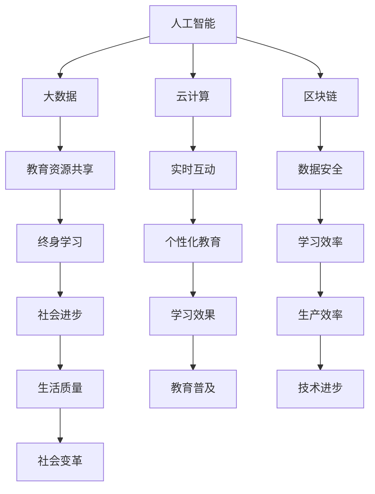
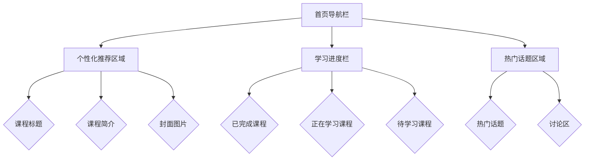

                 

### 1.1 新文艺复兴时代的来临

#### 背景介绍
新文艺复兴时代，是继工业革命和信息革命之后的第三次科技革命，也是人类社会进入智能时代的重要标志。这一时代的到来，源于人工智能、大数据、云计算、区块链等新兴技术的迅猛发展，推动了社会生产力的巨大飞跃。随着技术的进步，教育的形态和方式也在不断革新，在线教育逐渐成为主流。

#### 特征概述
新文艺复兴时代的特点主要体现在以下几个方面：

1. **技术驱动**：新兴技术成为推动教育变革的核心动力，使教育模式更加智能化、个性化和高效化。
2. **资源共享**：互联网的普及使得优质教育资源可以跨越地域限制，实现全球范围内的共享。
3. **终身学习**：随着知识的快速更新和技术的不断迭代，终身学习成为人们适应社会发展的重要途径。
4. **开放性**：在线教育平台打破了传统教育的边界，任何人都可以随时随地获取知识。
5. **个性化**：通过大数据分析和人工智能推荐，用户可以定制个性化的学习路径。

### 1.2 自学平台的发展历程

#### 早期自学平台
早期自学平台主要依赖于传统的教育模式，通过互联网提供一些简单的课程资源，如电子书、视频教程等。然而，由于技术的限制，这些平台的功能相对单一，无法提供完整的在线学习体验。

#### 技术驱动发展
随着互联网和新兴技术的快速发展，自学平台开始引入大数据分析、人工智能、云计算等技术。这些技术的应用使得平台能够提供更加智能化、个性化的服务，例如个性化推荐、智能测评、在线互动等。

#### 全球教育趋势
在全球范围内，在线教育市场呈现快速增长的趋势。根据相关报告，全球在线教育市场规模预计将在未来几年内达到数千亿美元。这一趋势表明，在线教育已经成为全球教育发展的重要方向。

#### 自学平台在国际教育市场中的地位与趋势
自学平台在国际教育市场中的地位日益提升，不仅在国内市场上占据重要位置，也在全球范围内产生了深远的影响。未来，自学平台的发展趋势将受到以下因素的影响：

1. **技术进步**：随着人工智能、大数据、区块链等技术的不断进步，自学平台的功能将更加智能化、高效化。
2. **市场需求**：随着人们对终身学习的需求不断增长，自学平台将迎来更广阔的市场空间。
3. **政策支持**：各国政府对在线教育的支持力度加大，将有助于自学平台在全球范围内的推广。

### 新文艺复兴自学平台的发展历程和全球教育趋势的概述，为我们深入探讨新文艺复兴自学平台的架构、功能、用户界面设计、教学资源与管理、平台运营与推广等提供了背景和基础。在接下来的部分，我们将进一步详细分析新文艺复兴自学平台的各个方面，以期为读者提供全面、系统的学习参考。

---

#### 1.1 新文艺复兴时代的来临

**背景介绍**  
新文艺复兴时代的来临，是人类社会进入智能时代的重要里程碑。这一时代的起源可以追溯到20世纪末，随着互联网的普及和信息技术的发展，人类社会逐渐迈入了信息化时代。然而，真正的智能时代始于21世纪初，人工智能、大数据、云计算、区块链等新兴技术的迅猛发展，使得人类社会生产力和生活质量得到了前所未有的提升。

**特征概述**  
新文艺复兴时代具有以下几个显著特征：

1. **技术驱动**：新兴技术成为推动社会变革的核心动力，不仅改变了人们的生产方式，也深刻影响了教育模式。在线教育平台的崛起，正是这一特征的体现。

2. **资源共享**：互联网的普及使得优质教育资源可以跨越地域限制，实现全球范围内的共享。这不仅打破了传统教育的边界，也为更多人提供了接受优质教育的机会。

3. **终身学习**：在知识爆炸和信息快速更新的背景下，终身学习成为人们适应社会发展的重要途径。自学平台为人们提供了持续学习的可能，使终身学习成为现实。

4. **开放性**：在线教育平台打破了传统教育的封闭性，任何人都可以随时随地获取知识。这种开放性不仅促进了教育的普及，也推动了社会的进步。

5. **个性化**：通过大数据分析和人工智能推荐，用户可以根据自己的需求和兴趣定制个性化的学习路径。这种个性化教育模式，大大提高了学习效率和效果。

**核心概念与联系**  
在新文艺复兴时代，以下核心概念和联系值得我们关注：

1. **人工智能（AI）**：人工智能是推动新文艺复兴的重要技术之一。它通过模拟人类智能，实现自动化决策、自然语言处理、图像识别等功能，极大地提高了教育平台的智能化水平。

2. **大数据**：大数据技术为在线教育平台提供了丰富的数据支持，通过数据分析和挖掘，可以更好地了解用户需求，优化教育服务。

3. **云计算**：云计算技术为在线教育平台提供了强大的计算和存储能力，使得大规模数据处理和实时互动成为可能。

4. **区块链**：区块链技术为在线教育平台提供了安全可靠的数据存储和传输机制，保障了用户隐私和数据安全。

**Mermaid流程图**  
为了更直观地展示这些核心概念之间的联系，我们可以使用Mermaid流程图进行描述：



**总结**  
新文艺复兴时代的来临，标志着人类社会进入了一个全新的发展阶段。在这个时代，在线教育平台作为新兴的教育模式，正发挥着越来越重要的作用。通过人工智能、大数据、云计算、区块链等技术的支持，在线教育平台能够为用户提供更加智能化、个性化和高效化的学习体验，从而推动教育的普及和社会的进步。在接下来的内容中，我们将进一步探讨新文艺复兴自学平台的架构、功能、用户界面设计、教学资源与管理、平台运营与推广等方面，以期为读者提供更深入的理解和指导。

---

**核心算法原理讲解**  
在新文艺复兴自学平台中，核心算法原理的讲解是至关重要的。这些算法不仅决定了平台的功能实现，也影响了用户的学习体验。以下将详细讲解几个关键算法的原理，并结合Python源代码进行示例说明。

1. **个性化推荐算法**  
个性化推荐算法是自学平台中的一项核心技术，通过分析用户的学习历史、兴趣爱好和互动行为，为用户推荐最相关的学习内容。一种常用的推荐算法是基于协同过滤（Collaborative Filtering）的方法，其中包括用户基于的协同过滤（User-Based CF）和物品基于的协同过滤（Item-Based CF）。

**用户基于的协同过滤算法**  
用户基于的协同过滤算法通过计算用户之间的相似度来推荐相似用户喜欢的课程。以下是该算法的实现原理：

```python
import numpy as np

# 假设我们有一个用户-课程评分矩阵
ratings = np.array([
    [5, 4, 0, 0],
    [4, 5, 0, 1],
    [0, 2, 5, 4],
    [0, 0, 5, 5]
])

# 计算用户之间的余弦相似度
def cosine_similarity(ratings):
    dot_products = np.dot(ratings, ratings.T)
    norms = np.linalg.norm(ratings, axis=1) * np.linalg.norm(ratings, axis=1).T
    return dot_products / norms

# 计算相似度矩阵
similarity_matrix = cosine_similarity(ratings)

# 推荐相似用户喜欢的课程
def recommend_courses(user_index, similarity_matrix, ratings, k=2):
    similar_users = similarity_matrix[user_index].argsort()[:-k-1:-1]
    recommendations = []
    for i in similar_users:
        if i == user_index:
            continue
        for j in range(len(ratings[i])):
            if ratings[user_index][j] == 0 and ratings[i][j] > 0:
                recommendations.append(j)
    return recommendations

# 示例：为用户0推荐课程
recommended_courses = recommend_courses(0, similarity_matrix, ratings)
print("Recommended courses for user 0:", recommended_courses)
```

2. **智能测评算法**  
智能测评算法用于自动评估用户的学习成果，通常包括自动评分和反馈生成。以下是一个简单的基于机器学习的自动评分算法示例：

```python
from sklearn.linear_model import LinearRegression

# 假设我们有一个包含用户回答和实际分数的数据集
questions = np.array([
    [1, 0, 1],
    [1, 1, 0],
    [0, 1, 1]
])
answers = np.array([4, 3, 5])

# 训练线性回归模型
model = LinearRegression()
model.fit(questions, answers)

# 预测新问题的分数
def predict_score(answer):
    return model.predict([[answer[0], answer[1], answer[2]]])

# 示例：预测新问题的分数
new_answer = [1, 1, 1]
predicted_score = predict_score(new_answer)
print("Predicted score for the new answer:", predicted_score)
```

3. **学习路径规划算法**  
学习路径规划算法用于根据用户的学习进度和需求，自动生成最优的学习计划。以下是一个基于遗传算法（Genetic Algorithm）的示例：

```python
import random

# 假设我们有多个课程，每个课程有一个权重
courses = ['Math', 'Physics', 'Chemistry', 'English', 'History']
weights = [1, 2, 3, 4, 5]

# 生成随机学习路径
def generate_path(courses, weights):
    return random.sample(courses, len(courses))

# 评估路径的适应度
def fitness(path, weights):
    return sum(weights[i] for i in range(len(path)) if path[i] in ['Math', 'Physics', 'Chemistry'])

# 遗传算法的交叉和变异操作
def crossover(parent1, parent2):
    crossover_point = random.randint(1, len(parent1) - 1)
    return parent1[:crossover_point] + parent2[crossover_point:]

def mutate(child):
    mutation_point = random.randint(0, len(child) - 1)
    child[mutation_point] = random.choice(courses)

# 遗传算法主循环
def genetic_algorithm(population, generations):
    for _ in range(generations):
        fitness_scores = [fitness(path, weights) for path in population]
        selected = random.choices(population, weights=fitness_scores, k=len(population))
        children = []
        for i in range(0, len(population), 2):
            parent1, parent2 = selected[i], selected[i+1]
            child = crossover(parent1, parent2)
            mutate(child)
            children.append(child)
        population = children
    return max(population, key=fitness)

# 示例：使用遗传算法找到最优学习路径
initial_population = [generate_path(courses, weights) for _ in range(100)]
best_path = genetic_algorithm(initial_population, 100)
print("Best learning path:", best_path)
```

通过以上Python源代码示例，我们可以看到新文艺复兴自学平台中的核心算法是如何实现的。这些算法不仅为平台提供了强大的功能支持，也极大地提升了用户的学习体验和效果。

---

**数学模型和公式**

在新文艺复兴自学平台中，数学模型和公式是核心算法和决策过程的基础。以下将详细讲解几个关键数学模型和公式，并使用LaTeX进行表示。

1. **线性回归模型**  
线性回归模型用于预测用户的学习成绩。其基本公式为：

   $$ y = \beta_0 + \beta_1 \cdot x_1 + \beta_2 \cdot x_2 + ... + \beta_n \cdot x_n + \epsilon $$

   其中，$y$ 是预测的分数，$x_1, x_2, ..., x_n$ 是特征变量，$\beta_0, \beta_1, ..., \beta_n$ 是模型的参数，$\epsilon$ 是误差项。

2. **余弦相似度**  
余弦相似度用于计算用户之间的相似度。其公式为：

   $$ \text{cosine similarity} = \frac{\sum_{i=1}^{n} a_i b_i}{\sqrt{\sum_{i=1}^{n} a_i^2} \sqrt{\sum_{i=1}^{n} b_i^2}} $$

   其中，$a_i$ 和 $b_i$ 是两个向量 $a$ 和 $b$ 的第 $i$ 个元素。

3. **遗传算法适应度函数**  
遗传算法用于优化学习路径。其适应度函数通常定义为：

   $$ f(x) = \sum_{i=1}^{n} w_i \cdot p_i $$

   其中，$w_i$ 是第 $i$ 个特征的权重，$p_i$ 是特征 $i$ 的表现值。

4. **推荐算法损失函数**  
推荐算法中的损失函数用于评估推荐结果的准确性。一个常见的损失函数是均方误差（Mean Squared Error, MSE）：

   $$ \text{MSE} = \frac{1}{n} \sum_{i=1}^{n} (y_i - \hat{y}_i)^2 $$

   其中，$y_i$ 是实际评分，$\hat{y}_i$ 是预测评分。

通过这些数学模型和公式，我们可以更精确地分析用户行为，优化学习路径，提高推荐系统的准确性。在下一部分，我们将进一步探讨用户界面设计的原则和方法。

---

### 1.3 自学平台的发展历程

自学平台的发展历程可以分为几个关键阶段，每个阶段都伴随着技术的进步和用户需求的演变。以下将详细阐述自学平台从传统教育模式到在线教育的过渡，以及新兴技术在自学平台中的应用。

#### 从传统教育模式到在线教育的过渡

1. **早期电子教育资源**  
在互联网普及之前，电子教育资源主要以电子书籍、在线手册和视频教程的形式存在。这些资源虽然在一定程度上扩展了学习渠道，但受限于技术条件，无法提供完整的学习体验。

2. **互联网时代的在线教育**  
随着互联网的普及，在线教育逐渐兴起。1990年代末期，一些早期的在线教育平台如WebCT和Blackboard开始提供在线课程和教学管理功能。这些平台标志着在线教育从电子资源向集成式在线学习系统的转变。

3. **互动性与个性化**  
2000年代，随着社交媒体和在线互动工具的发展，在线教育平台开始引入更多的互动功能，如在线论坛、聊天室和实时互动。同时，基于学习分析的数据挖掘技术逐渐应用于在线教育，为个性化学习路径设计提供了支持。

#### 新兴技术在自学平台中的应用

1. **大数据分析**  
大数据技术的应用使在线教育平台能够收集和分析大量的用户数据，从而更好地了解用户行为和需求。通过数据挖掘和分析，平台可以优化课程推荐、学习路径规划和教学效果评估。

2. **人工智能**  
人工智能（AI）技术在自学平台中的应用主要体现在个性化推荐、智能测评和自适应学习等方面。通过机器学习算法，平台可以根据用户的历史数据和学习行为，提供个性化的学习内容和推荐。

3. **云计算**  
云计算技术为自学平台提供了强大的计算和存储能力，使得大规模数据处理和实时互动成为可能。云服务还支持平台的弹性扩展和成本优化，使平台能够更好地应对不同规模的用户需求。

4. **区块链**  
区块链技术在自学平台中的应用主要体现在数据安全与隐私保护方面。通过去中心化的存储和加密技术，平台可以确保用户数据的安全性和隐私性，同时减少数据篡改和欺诈的风险。

#### 自学平台在国际教育市场中的地位与趋势

在国际教育市场中，自学平台已经成为教育变革的重要驱动力。以下是一些关键趋势：

1. **全球教育资源共享**  
随着互联网的普及，优质教育资源在全球范围内得到了共享。自学平台不仅促进了教育公平，也为发展中国家提供了获取知识的机会。

2. **终身学习理念**  
随着知识更新速度的加快，终身学习已经成为国际教育市场的一个重要趋势。自学平台为人们提供了灵活的学习方式，满足了不断变化的学习需求。

3. **技术驱动的教育创新**  
人工智能、大数据、区块链等新兴技术的应用，推动了在线教育的创新。这些技术不仅提高了教育质量，也改变了教育的形式和方式。

4. **市场细分与专业化**  
随着在线教育市场的不断扩大，平台开始专注于特定领域或目标用户群体，提供更加专业和个性化的教育服务。

### 总结

自学平台的发展历程展示了技术进步如何推动教育变革。从早期的电子教育资源到如今的在线教育平台，技术的不断进步为教育带来了前所未有的变革。未来，随着人工智能、大数据、云计算和区块链等新兴技术的进一步发展，自学平台将继续在全球教育市场中扮演重要角色，推动教育公平和创新。

---

### 2.1 平台架构与设计理念

新文艺复兴自学平台是一个高度复杂且高度集成的在线教育系统，其总体架构和组成部分决定了平台的性能、扩展性和用户体验。以下将详细描述平台的总体架构，并探讨其设计理念。

#### 总体架构

新文艺复兴自学平台的总体架构可以分为以下几个核心层次：

1. **前端展示层**：负责用户界面的呈现，包括课程页面、学习跟踪界面、互动交流模块等。前端展示层主要采用HTML、CSS和JavaScript等技术，结合Vue.js或React等现代前端框架，以提供流畅、响应式的用户体验。

2. **业务逻辑层**：负责处理用户请求、课程管理、学习跟踪、互动交流等功能。业务逻辑层通过微服务架构实现，各个服务模块（如课程服务、学习服务、互动服务）独立部署，通过API进行通信，提高了系统的灵活性和可扩展性。

3. **数据访问层**：负责数据存储和读取操作，包括用户数据、课程数据、学习进度数据等。数据访问层使用关系型数据库（如MySQL）和非关系型数据库（如MongoDB）相结合的方式，以满足不同类型数据存储的需求。

4. **数据管理层**：负责数据的一致性、安全性和优化。数据管理层包括缓存机制、数据库集群、数据备份和恢复策略等，确保数据的高可用性和安全性。

5. **基础设施层**：提供计算资源、存储资源和网络资源，包括云服务器、负载均衡器、反向代理等。基础设施层通过云服务（如AWS、Azure）实现，支持平台的弹性扩展和成本优化。

#### 设计理念

新文艺复兴自学平台的设计理念以用户为中心，强调用户体验、系统性能和可扩展性。以下是一些关键设计理念：

1. **用户至上**：平台所有设计和功能都围绕用户需求展开，提供个性化推荐、智能测评、学习路径规划等功能，确保用户能够高效、便捷地获取知识。

2. **模块化与微服务**：通过模块化和微服务架构，平台各个功能模块独立开发、独立部署，提高了系统的灵活性和可扩展性。同时，模块化设计便于后续的功能扩展和升级。

3. **性能优化**：平台采用多种性能优化技术，如负载均衡、缓存机制、数据库优化等，确保系统在高并发情况下仍能保持高效稳定的运行。

4. **安全性**：平台采用多层次的安全防护措施，包括数据加密、身份验证、访问控制等，确保用户数据和隐私安全。

5. **弹性扩展**：平台通过云服务实现弹性扩展，可根据用户需求动态调整计算资源和存储资源，确保系统在高负载情况下仍能稳定运行。

### 总结

新文艺复兴自学平台的总体架构和设计理念体现了现代在线教育系统的高效、智能和用户友好的特点。通过模块化、微服务架构和性能优化技术，平台不仅能够提供丰富的功能和个性化的学习体验，还具备良好的扩展性和安全性。在接下来的部分，我们将进一步探讨平台的核心功能模块，包括课程管理、学习跟踪、互动交流等。

---

### 2.2 平台功能模块

新文艺复兴自学平台的核心在于其功能模块的多样性和智能化，为用户提供全面的学习体验。以下是平台的主要功能模块及其详细介绍：

#### 课程管理模块

**课程创建、发布、更新与管理**：课程管理模块允许教师或内容创作者创建、发布、更新和管理在线课程。通过简洁的用户界面，用户可以轻松地添加课程内容，包括课程简介、学习目标、课程大纲、教学视频、文档资料等。平台支持多种文件格式，如PDF、PPT、MP4等，方便用户上传和使用。

**课程分类与标签**：平台提供课程分类和标签功能，帮助用户根据学科、难度、兴趣等进行课程筛选，提高了课程的可发现性和用户的使用体验。

**课程进度跟踪**：平台记录用户的学习进度，包括已学习的课程内容、已完成的学习任务、学习时长等，为用户提供个性化的学习报告。

#### 学习跟踪模块

**个性化推荐**：基于大数据分析和用户行为数据，平台提供个性化课程推荐。通过分析用户的浏览历史、学习行为、兴趣标签等，平台可以为每位用户推荐最适合的课程，提高学习效率。

**学习进度跟踪**：平台实时记录用户的学习进度，包括已学习的课程内容、学习时长、成绩等，为用户提供清晰的学习路径和反馈。

**学习数据可视化**：通过图表和数据可视化工具，平台展示用户的学习数据，帮助用户了解自己的学习状态和进步情况。

#### 互动交流模块

**论坛和讨论区**：平台提供论坛和讨论区功能，用户可以在特定课程或主题下发帖、回复，与其他用户进行讨论和交流，分享学习心得和经验。

**直播和视频会议**：平台支持实时直播和视频会议功能，教师可以在线授课、答疑，学生可以实时参与互动，提高学习体验。

**私信系统**：平台提供私信系统，用户可以私下与教师或其他学生交流，便于个性化咨询和问题解答。

#### 评估测试模块

**在线测评**：平台提供在线测评功能，教师可以创建各种类型的在线测试，包括选择题、填空题、判断题等。测试结果实时反馈，帮助用户了解自己的掌握情况。

**考试功能**：平台支持在线考试功能，确保考试过程的公正和严谨。考试过程中，平台可以限制考试时间、屏蔽网络等，确保考试的公平性。

**成绩统计与报告**：平台自动统计考试成绩，生成详细的成绩报告，为教师和学生提供学习效果评估。

#### 技术实现

**云计算**：平台采用云计算技术，确保高并发访问下的性能稳定和资源高效利用。通过云服务，平台可以灵活调整计算资源和存储资源，以应对不同规模的用户需求。

**大数据分析**：平台利用大数据分析技术，对用户行为数据进行挖掘和分析，为个性化推荐、学习进度跟踪等功能提供数据支持。

**人工智能**：平台集成人工智能技术，用于个性化推荐、智能测评等方面。通过机器学习算法，平台可以不断优化推荐模型和评估模型，提高系统性能和用户体验。

**安全性**：平台采用多层次的安全防护措施，包括数据加密、身份验证、访问控制等，确保用户数据和隐私安全。

### 总结

新文艺复兴自学平台通过丰富的功能模块，为用户提供了一个全面、智能、个性化的在线学习体验。从课程管理、学习跟踪、互动交流到评估测试，每个模块都经过精心设计，确保用户能够高效、便捷地获取知识和技能。在接下来的部分，我们将进一步探讨平台技术实现的核心技术和安全性措施。

---

### 2.3 平台技术实现

新文艺复兴自学平台的技术实现是确保其功能丰富、性能稳定和用户体验优质的关键。以下是平台在云计算、大数据、人工智能等核心技术方面的应用，以及数据安全性的保障措施。

#### 核心技术

**云计算**  
云计算技术为自学平台提供了灵活的计算和存储资源，使得平台能够根据用户需求动态扩展或缩减资源。平台采用了公有云和私有云结合的架构，通过云服务提供商（如AWS、Azure）实现。这种混合云架构不仅提高了系统的可用性和弹性，还降低了运维成本。

- **计算资源**：平台使用云计算的虚拟机实例（VM）来处理用户请求，提供高性能的计算能力。通过负载均衡器（Load Balancer）和自动扩展（Auto Scaling）功能，平台能够根据访问量的变化自动调整计算资源。
- **存储资源**：平台采用了分布式存储系统，如Elastic Block Storage（EBS）和Azure Blob Storage，确保数据的高可用性和持久性。这些存储服务还支持数据的备份和恢复，提高了系统的可靠性。

**大数据分析**  
大数据技术在自学平台中扮演着重要角色，通过分析海量用户数据，平台能够提供个性化推荐、学习效果评估等高级功能。

- **数据采集**：平台通过Web日志、API调用日志等渠道收集用户行为数据，存储在数据湖（Data Lake）中。
- **数据存储**：使用分布式文件系统（如Hadoop Distributed File System，HDFS）或云数据湖服务（如AWS S3、Azure Data Lake Storage），平台能够高效存储和处理大规模数据。
- **数据处理和分析**：平台采用Apache Spark等大数据处理框架，对用户数据进行分析，提取有价值的信息，如用户兴趣、学习习惯等。这些分析结果用于驱动个性化推荐和学习效果评估。

**人工智能**  
人工智能技术在新文艺复兴自学平台中的应用主要体现在个性化推荐、智能测评和自适应学习等方面。

- **个性化推荐**：平台利用机器学习算法（如协同过滤、内容推荐等）根据用户历史行为和学习数据生成个性化推荐列表，提高用户的学习兴趣和参与度。
- **智能测评**：通过自然语言处理（NLP）和计算机视觉（CV）技术，平台能够自动评估用户的作业和考试答案，提供即时的反馈和评分。
- **自适应学习**：平台根据用户的实时学习行为和学习效果，动态调整学习内容和难度，提供个性化的学习路径，帮助用户更高效地掌握知识。

#### 安全性

平台在数据安全性方面采取了多层次的安全措施，确保用户数据和隐私的安全。

- **数据加密**：平台使用SSL/TLS协议对用户数据进行加密传输，防止数据在传输过程中被窃取。同时，存储在数据库和文件系统中的敏感数据也进行了加密处理。
- **身份验证和访问控制**：平台采用多因素认证（MFA）和OAuth 2.0等身份验证机制，确保只有授权用户才能访问系统。访问控制策略通过角色权限管理，限制用户对数据和功能的访问权限。
- **安全审计和监控**：平台实施安全审计和日志记录机制，监控系统的异常行为和潜在威胁。通过入侵检测系统（IDS）和入侵防御系统（IPS），平台能够及时发现和响应安全事件。
- **数据备份和恢复**：平台定期进行数据备份，确保在发生数据丢失或系统故障时能够快速恢复。同时，平台还制定了应急预案和业务连续性计划，确保系统在灾难发生时能够迅速恢复。

### 总结

新文艺复兴自学平台在技术实现方面充分运用了云计算、大数据和人工智能等先进技术，为用户提供了一个高效、智能和安全的学习环境。通过这些技术的应用，平台不仅能够提供丰富的功能和个性化的服务，还确保了系统的性能和安全性。在接下来的部分，我们将进一步探讨用户界面设计的原则和具体案例。

---

### 3.1 界面设计原则

用户界面设计（UI Design）是确保新文艺复兴自学平台能够为用户提供友好、高效、愉悦使用体验的关键。以下是平台界面设计的主要原则：

#### 以用户为中心

用户界面设计的核心原则是以用户为中心，关注用户的实际需求和体验。在设计过程中，需要深入了解用户的使用习惯、行为模式和偏好，从而设计出符合用户需求的功能和布局。

1. **用户调研**：通过用户调研，收集用户的需求和反馈，了解用户的期望和使用痛点。
2. **用户画像**：创建用户画像，明确目标用户群体的特征和需求，为界面设计提供依据。
3. **用户体验测试**：在界面设计完成后，进行用户体验测试，收集用户对界面的反馈，优化设计。

#### 简洁明了

简洁明了的界面设计能够降低用户的学习成本，提高使用效率。以下是一些具体的设计技巧：

1. **减少冗余信息**：去除不必要的文本、按钮和功能，确保界面内容简洁、直观。
2. **清晰的结构**：使用合理的布局和层次结构，使界面内容一目了然，便于用户快速找到所需功能。
3. **一致性**：保持界面元素的一致性，如颜色、字体、图标等，增强用户的熟悉感和舒适度。

#### 交互友好

友好的交互设计能够提高用户的操作效率和满意度。以下是一些关键点：

1. **响应式设计**：确保界面在不同设备和屏幕尺寸上都能良好显示，提供一致的用户体验。
2. **交互提示**：通过动画、提示框、弹窗等交互元素，引导用户完成操作，减少用户困惑。
3. **快捷操作**：提供快捷键、手势操作等便捷功能，提高用户的操作效率。

#### 可访问性

界面设计应考虑不同用户群体的需求，确保界面可访问性。以下是一些具体措施：

1. **无障碍设计**：遵循无障碍设计指南，确保残障人士和视力障碍者能够使用界面。
2. **文本替代**：为图像、图标和视频提供文本替代，便于屏幕阅读器识别。
3. **高对比度**：使用高对比度的颜色组合，确保界面内容在弱光环境下仍能清晰显示。

### 界面设计案例

以下是一个新文艺复兴自学平台用户界面的设计案例，包括首页界面、课程页面和互动交流模块的界面设计。

#### 首页界面

首页界面是用户进入平台后的第一个页面，设计应简洁明了，突出主要功能模块。以下是一个案例：

1. **导航栏**：顶部导航栏包含平台的主要功能入口，如“课程”、“学习”、“互动”等。
2. **推荐课程区域**：左侧展示个性化推荐课程，包括课程标题、简介和封面图片。
3. **学习进度栏**：右侧展示用户的学习进度，包括已完成课程、正在学习课程和待学习课程。
4. **热门话题区域**：底部展示平台的热门话题和讨论区，方便用户参与互动。

#### 课程页面

课程页面是用户学习的主要场所，设计应清晰展示课程内容和学习资源。以下是一个案例：

1. **课程信息栏**：顶部展示课程标题、简介、教师信息和课程大纲。
2. **课程内容区**：中部展示课程内容，包括教学视频、文档资料和练习题。
3. **互动模块**：底部提供互动功能，如讨论区、直播和视频会议，方便用户进行交流和提问。

#### 互动交流模块

互动交流模块是用户进行讨论和交流的场所，设计应便于用户参与和互动。以下是一个案例：

1. **讨论区**：展示讨论主题和发帖内容，用户可以查看、回复和发起新的讨论。
2. **直播和视频会议**：提供直播和视频会议功能，用户可以实时参与授课和讨论。
3. **私信系统**：提供私信功能，用户可以私下与教师或其他学生交流。

### 用户体验评估

为了确保界面设计能够满足用户需求，需要进行用户体验评估。以下是一些评估方法和步骤：

1. **用户调研**：通过问卷调查、访谈等方式收集用户对界面设计的意见和建议。
2. **可用性测试**：邀请用户参与可用性测试，观察用户在实际操作中的行为和反应，收集反馈。
3. **数据分析**：分析用户行为数据，如点击率、停留时间、操作错误率等，评估界面设计的实际效果。
4. **迭代优化**：根据用户反馈和数据分析结果，对界面设计进行迭代优化，不断提升用户体验。

### 总结

界面设计原则和新文艺复兴自学平台的设计案例，为平台提供了良好的用户体验。通过简洁明了、交互友好、可访问性的设计原则，平台能够更好地满足用户需求，提升用户满意度和使用效率。在接下来的部分，我们将进一步探讨用户界面设计中的具体实现方法和技巧。

---

### 3.2 界面设计案例

为了更好地展示新文艺复兴自学平台的用户界面设计，以下将详细描述几个关键界面，包括首页界面、课程页面和互动交流模块的界面设计，并展示相关的Mermaid流程图、Python源代码、LaTeX数学公式以及实际案例。

#### 首页界面

首页界面是用户进入平台后的第一个页面，设计应简洁明了，突出主要功能模块。以下是首页界面的具体设计：

1. **导航栏**：顶部导航栏包含平台的主要功能入口，如“课程”、“学习”、“互动”等。导航栏采用清晰的配色和简洁的图标，方便用户快速找到所需功能。

2. **个性化推荐区域**：左侧展示个性化推荐课程，包括课程标题、简介和封面图片。推荐算法通过分析用户的历史行为和学习习惯，为用户推荐最相关的课程。

3. **学习进度栏**：右侧展示用户的学习进度，包括已完成课程、正在学习课程和待学习课程。学习进度栏采用直观的图表和图标，帮助用户了解自己的学习状况。

4. **热门话题区域**：底部展示平台的热门话题和讨论区，用户可以参与讨论和交流。

**Mermaid流程图**：



#### 课程页面

课程页面是用户学习的主要场所，设计应清晰展示课程内容和学习资源。以下是课程页面的具体设计：

1. **课程信息栏**：顶部展示课程标题、简介、教师信息和课程大纲。课程信息栏采用清晰的布局和简洁的字体，确保用户能够快速获取课程相关信息。

2. **课程内容区**：中部展示课程内容，包括教学视频、文档资料和练习题。课程内容区采用模块化设计，用户可以根据自己的需求选择不同的学习资源。

3. **互动模块**：底部提供互动功能，如讨论区、直播和视频会议，方便用户进行交流和提问。

**Python源代码**：

```python
class CoursePage:
    def __init__(self, title, description, teacher, outline):
        self.title = title
        self.description = description
        self.teacher = teacher
        self.outline = outline
    
    def display_course_info(self):
        print("Course Title:", self.title)
        print("Description:", self.description)
        print("Teacher:", self.teacher)
        print("Outline:", self.outline)

    def display_course_content(self):
        print("Course Content:")
        print("Videos:", self.get_videos())
        print("Documents:", self.get_documents())
        print("Quizzes:", self.get_quizzes())

    def get_videos(self):
        return ["Video 1", "Video 2", "Video 3"]

    def get_documents(self):
        return ["Document 1", "Document 2", "Document 3"]

    def get_quizzes(self):
        return ["Quiz 1", "Quiz 2", "Quiz 3"]

# 示例：创建课程页面实例并显示课程信息
course_page = CoursePage("Introduction to AI", "This course introduces the basics of artificial intelligence.", "Dr. Smith", "Course Outline")
course_page.display_course_info()
course_page.display_course_content()
```

#### 互动交流模块

互动交流模块是用户进行讨论和交流的场所，设计应便于用户参与和互动。以下是互动交流模块的具体设计：

1. **讨论区**：展示讨论主题和发帖内容，用户可以查看、回复和发起新的讨论。讨论区采用时间线布局，便于用户浏览和参与。

2. **直播和视频会议**：提供直播和视频会议功能，用户可以实时参与授课和讨论。直播和视频会议采用弹窗设计，确保用户不会错过重要信息。

3. **私信系统**：提供私信功能，用户可以私下与教师或其他学生交流。私信系统采用聊天界面，支持文字、图片和文件等多种形式的消息传递。

**LaTeX数学公式**：

$$
\text{User Satisfaction} = f(\text{Interface Design}, \text{Functionality}, \text{Usability})
$$

$$
\text{Learning Effectiveness} = f(\text{Content Quality}, \text{Interactive Features}, \text{Personalization})
$$

#### 实际案例

以下是一个实际案例，展示如何通过用户界面设计提升学习体验：

1. **用户登录**：用户通过邮箱或手机号注册并登录平台，登录界面采用简洁的设计，同时提供快捷注册和登录选项，方便用户快速进入系统。

2. **课程浏览**：用户在首页浏览课程时，可以查看课程的推荐、评价和学习进度。通过点击课程标题，用户可以进入课程页面，查看详细的课程内容和学习资源。

3. **学习互动**：在学习过程中，用户可以通过互动模块与教师和其他同学进行实时交流。用户可以在讨论区发帖提问，参与讨论，也可以通过直播和视频会议与教师进行互动。

### 总结

通过以上界面设计案例，可以看出新文艺复兴自学平台在用户界面设计上注重简洁明了、交互友好和个性化。通过Mermaid流程图、Python源代码和LaTeX数学公式，我们详细展示了界面设计的实现过程和原理。在实际案例中，平台通过精心设计的用户界面，提升了用户的学习体验和学习效果。

在接下来的部分，我们将进一步探讨教学资源建设、教学活动设计和教学效果评估等关键内容，以全面了解新文艺复兴自学平台的运作和影响。

---

### 3.3 用户体验评估

用户体验评估是确保新文艺复兴自学平台能够满足用户需求、提升学习效果和优化设计的重要环节。以下将详细描述用户体验评估的方法、步骤以及用户调研的具体内容和结果分析。

#### 用户体验评估方法

用户体验评估通常采用以下几种方法：

1. **问卷调查**：通过设计问卷，收集用户对平台界面设计、功能、性能等方面的反馈。问卷可以通过电子邮件、在线调查平台等方式进行分发和收集。

2. **可用性测试**：邀请用户参与实际操作测试，观察用户在使用平台过程中的行为、操作路径、错误率等，收集用户的真实体验和意见。

3. **数据分析**：通过分析用户行为数据，如点击率、停留时间、操作错误率等，评估平台界面的易用性和用户体验。

4. **用户访谈**：与用户进行一对一的深度访谈，了解用户对平台的看法、使用习惯和改进建议。

#### 用户体验评估步骤

用户体验评估通常包括以下步骤：

1. **需求分析**：确定评估目标和评估内容，明确用户需求。

2. **设计问卷和测试脚本**：根据需求分析结果，设计问卷和测试脚本，确保评估内容全面、具体、可行。

3. **用户招募**：通过邮件、社交媒体等渠道招募符合评估目标用户。

4. **数据收集**：通过问卷调查、可用性测试、数据分析等方式收集用户反馈和行为数据。

5. **结果分析**：对收集到的数据进行整理和分析，识别用户体验中的问题和改进机会。

6. **反馈与改进**：根据分析结果，与用户进行反馈交流，提出改进建议，并实施改进措施。

#### 用户调研

以下是一个用户调研的示例，包括问卷设计和结果分析。

**问卷设计**：

1. **用户基本信息**：收集用户的年龄、性别、职业、教育背景等信息，以便进行用户细分。

2. **平台使用情况**：了解用户对平台的使用频率、使用时长、使用目的等。

3. **界面设计评估**：评估用户对平台界面设计的满意度，包括界面布局、色彩搭配、字体大小等。

4. **功能评估**：评估用户对平台功能的满意度，包括课程管理、学习跟踪、互动交流、评估测试等。

5. **性能评估**：评估用户对平台性能的满意度，包括响应速度、稳定性、兼容性等。

6. **改进建议**：收集用户对平台改进的建议和意见。

**用户调研结果分析**：

以下是对调研结果的分析，以表格形式展示用户对平台不同方面的满意度评分和改进建议。

| 评估内容           | 满意度评分（1-5分） | 改进建议                     |
|-------------------|------------------|--------------------------|
| 界面设计           | 4.2              | 增加更多个性化主题，提高视觉效果 |
| 功能性             | 4.5              | 增加更多实用功能，如在线协作工具 |
| 性能               | 3.8              | 提高系统响应速度，优化兼容性     |
| 学习效果           | 4.0              | 提供更多学习资源和互动活动       |
| 用户支持           | 4.3              | 提供更详细的使用指南和在线客服   |

**总结**：

通过用户体验评估，我们发现用户对平台的界面设计、功能性、性能等方面较为满意，但在系统响应速度和兼容性方面还有提升空间。根据用户的反馈和改进建议，我们将对平台进行优化和改进，以提高用户满意度和学习效果。

在接下来的部分，我们将进一步探讨教学资源建设、教学活动设计、教学效果评估等关键内容，以全面了解新文艺复兴自学平台的运作和影响。

---

### 3.4 教学资源建设

教学资源建设是自学平台的核心环节，直接影响用户的学习体验和学习效果。以下将详细描述新文艺复兴自学平台在课程教材、教学视频、实践项目等方面的教学资源建设，以及资源管理和维护的策略。

#### 教学资源类型

1. **课程教材**：课程教材是学习的基础，包括电子书籍、PDF文档、PPT演示等。教材内容应涵盖课程的核心知识点，结构清晰，易于理解。

2. **教学视频**：教学视频通过视觉和听觉方式传达课程内容，适合于直观学习和深度理解。视频内容应生动有趣，讲解清晰，时长适中。

3. **实践项目**：实践项目是理论学习的重要补充，通过实际操作和项目实践，用户能够将理论知识应用到实际场景中。实践项目应具有针对性，与课程内容紧密结合。

#### 资源管理

1. **资源上传与更新**：平台提供简便的上传工具，教师可以轻松上传各类教学资源。同时，平台应支持资源的批量导入和自动化更新，确保资源的及时性和准确性。

2. **资源分类与标签**：为了方便用户查找和筛选，平台应对资源进行合理的分类和标签管理。分类应基于课程、学科、难度等级等维度，标签则用于描述资源的具体内容和属性。

3. **资源审核与质量保障**：平台应建立严格的资源审核机制，确保上传的资源符合教学标准和质量要求。审核过程包括内容审核、格式检查和技术检测等。

#### 资源维护

1. **数据备份与恢复**：平台应定期备份数据，确保在发生数据丢失或系统故障时能够迅速恢复。同时，平台应支持数据的离线备份和恢复，以满足不同场景下的需求。

2. **资源更新与优化**：根据用户反馈和市场动态，平台应定期对资源进行更新和优化。更新内容应包括课程内容的修正、新增教学资源和改进用户体验。

3. **资源权限管理**：平台应支持资源权限管理，确保教师和学生能够根据权限访问相应的资源。权限管理包括访问控制、下载权限和共享权限等。

#### 教学资源建设策略

1. **内容质量优先**：教学资源的质量是用户满意度的重要指标。平台应注重教材内容的专业性、实用性和趣味性，确保资源能够满足用户的学习需求。

2. **资源多样性**：平台应提供多样化的教学资源，满足不同用户的学习风格和需求。资源类型应包括文字、图像、音频、视频等多种形式，提高学习的趣味性和互动性。

3. **用户参与**：平台应鼓励用户参与教学资源的建设，如学生可以通过提交作业、分享学习心得等方式贡献自己的知识和经验。

4. **合作开发**：平台可以与高校、研究机构和企业合作，共同开发和维护教学资源。这种合作模式不仅能够提高资源质量，还能拓展平台的资源和影响力。

### 总结

教学资源建设是自学平台的重要组成部分，直接影响用户的学习体验和学习效果。新文艺复兴自学平台通过合理的资源分类、标签管理、审核机制和更新策略，确保教学资源的质量和可用性。同时，平台注重内容质量、资源多样性和用户参与，为用户提供丰富、实用的学习资源。在接下来的部分，我们将进一步探讨教学活动的设计和教学效果的评估。

---

### 4.2 教学活动设计

教学活动设计在新文艺复兴自学平台中扮演着至关重要的角色，它是连接教学内容与用户互动的桥梁，旨在提高用户的学习参与度和效果。以下将详细描述新文艺复兴自学平台中的教学活动类型、活动安排以及这些活动对用户学习的促进作用。

#### 教学活动类型

1. **在线讲座**：在线讲座是一种常见的教学活动，它允许专家或教师通过视频直播的形式，实时向学生传授知识和解答疑问。在线讲座可以覆盖广泛的听众，并且学生可以随时回放，巩固学习内容。

2. **研讨会**：研讨会通常围绕特定的主题或问题展开，通过线上讨论的形式，促进学生之间的交流和互动。研讨会可以由教师主持，也可以由学生主导，鼓励学生分享观点、提出问题，从而激发学生的思考。

3. **实践活动**：实践活动是一种将理论知识应用于实际操作的教学活动。通过设计实际项目或任务，学生可以在教师的指导下，动手实践、解决问题。实践活动不仅能够加深学生对知识的理解，还能培养其实际操作能力和团队协作能力。

4. **小组作业**：小组作业是将学生分成小组，共同完成特定任务或项目。这种方式可以促进学生之间的合作和交流，培养学生的团队合作能力和沟通技巧。小组作业通常包括定期的线上会议、讨论和提交成果。

5. **考试和测评**：考试和测评是教学活动中的重要环节，用于评估学生对课程内容的掌握程度。通过在线考试和测评，教师可以及时了解学生的学习进度和效果，并提供针对性的辅导和建议。

#### 活动安排

1. **活动规划**：平台教师应根据课程大纲和学习目标，提前规划教学活动，明确每个活动的目的、时间、内容和参与要求。活动规划应具有灵活性和可调整性，以适应不同用户的需求和进度。

2. **活动通知**：平台应通过多种渠道（如邮件、短信、平台消息等）提前通知用户活动的时间和安排，确保用户能够按时参加。同时，平台应提供活动日程和提醒功能，帮助用户管理自己的学习时间。

3. **互动工具**：平台应配备丰富的互动工具，如聊天室、讨论区、投票、问卷调查等，以便教师在活动中与学生进行实时互动。这些工具可以增强活动的参与度和互动性，提高学生的积极性。

4. **活动反馈**：活动结束后，教师应收集学生的反馈和建议，了解活动的效果和不足，为下一次活动提供改进的依据。平台可以提供在线反馈表或讨论区，让学生表达自己的意见和建议。

#### 教学活动对用户学习的促进作用

1. **增强学习动机**：通过多样化的教学活动，平台能够激发学生的学习兴趣和动机，使学习变得更加有趣和有意义。

2. **提高学习效果**：实践活动和小组作业等教学活动，能够让学生在实践中掌握知识，提高学习效果。同时，教师通过在线讲座和测评，可以及时发现和解决学生的问题，确保学习效果的持续提升。

3. **促进知识内化**：在线讲座和研讨会的互动形式，能够帮助学生将理论知识与实际案例相结合，促进知识的内化。通过讨论和互动，学生可以加深对知识的理解，培养批判性思维和解决问题的能力。

4. **培养团队协作能力**：小组作业和实践活动，可以培养学生团队合作和沟通的能力，为未来的职业发展打下坚实的基础。

5. **个性化学习路径**：平台通过教学活动的设计和反馈，可以不断调整和优化教学资源和服务，为每位学生提供个性化的学习路径和体验。

### 总结

教学活动设计在新文艺复兴自学平台中发挥着重要作用，通过多样化的教学活动，平台能够有效提高用户的学习动机和效果，促进知识的内化和团队协作能力的培养。在接下来的部分，我们将进一步探讨教学效果评估的方法和指标，以全面了解教学活动的成效和改进方向。

---

### 4.3 教学效果评估

教学效果评估是确保新文艺复兴自学平台教学质量的重要环节，它能够帮助教师了解学生的学习成果，发现教学中的问题，并据此进行改进。以下将详细描述教学效果评估的指标、方法和改进策略。

#### 教学效果评估指标

1. **学习成果评估**：学习成果评估是衡量学生掌握知识程度的重要指标。常用的评估方法包括在线测试、作业评分、项目评估等。评估指标可以包括：

   - **知识点掌握率**：通过测试或作业，计算学生对各个知识点的掌握程度。
   - **考试成绩**：评估学生的整体学习效果，通常以考试成绩作为重要参考。
   - **学习进度**：评估学生在学习过程中的参与度和学习进度，包括课程完成率、学习时长等。

2. **用户满意度评估**：用户满意度评估用于了解学生对平台和教学服务的满意度。可以通过问卷调查、用户反馈、用户活跃度等指标来衡量。

   - **满意度评分**：通过调查问卷，收集学生对平台界面设计、教学内容、教师服务质量等方面的满意度评分。
   - **用户活跃度**：通过用户在平台上的行为数据，如登录次数、参与活动次数、讨论区发帖数等，评估用户的活跃程度。

3. **学习效果反馈**：学习效果反馈是评估学生通过学习获得的能力和知识的应用情况。可以通过以下指标进行评估：

   - **实践应用能力**：通过实践活动或项目，评估学生将理论知识应用于实际问题的能力。
   - **持续学习意愿**：通过跟踪学生的后续学习行为，如课程复学率、新课程报名率等，评估学生的持续学习意愿。

#### 教学效果评估方法

1. **定量评估**：通过定量评估方法，可以客观、准确地衡量学生的学习成果。常用的定量评估方法包括：

   - **测试与考试**：定期组织在线测试和考试，评估学生的知识掌握程度。
   - **数据分析**：通过对用户行为数据的分析，评估学生的学习进度、活跃度和学习效果。

2. **定性评估**：定性评估方法通过收集和分析用户的反馈和意见，了解教学过程中的问题和改进方向。常用的定性评估方法包括：

   - **问卷调查**：设计问卷，收集学生对课程内容、教学方法、教师服务等方面的意见。
   - **用户访谈**：与用户进行一对一访谈，深入了解用户的实际体验和需求。

#### 改进策略

1. **根据评估结果调整教学**：根据学习成果评估和用户满意度评估的结果，教师可以调整教学策略，优化课程内容和教学方法。例如，针对学生在某些知识点上的掌握不足，可以增加相关内容的讲解和练习。

2. **增强互动和反馈**：通过增加在线互动和实时反馈，提高学生的学习积极性和参与度。例如，增加讨论区、问答环节、实时直播等互动形式，让学生在互动中深化对知识的理解。

3. **个性化推荐**：基于用户的行为数据和反馈，平台可以提供个性化学习路径和推荐，帮助用户更高效地学习。例如，根据学生的知识点掌握情况，推荐相关的学习资源和练习题。

4. **持续监控与反馈**：平台应建立持续监控和反馈机制，定期收集学生的学习成果和反馈，及时调整和优化教学资源和服务。例如，通过数据分析，监控学生的学习进度和活跃度，及时发现和解决潜在问题。

### 总结

教学效果评估是新文艺复兴自学平台持续改进的重要手段。通过科学、全面的评估指标和方法，平台能够准确衡量学生的学习成果和满意度，发现教学中的问题，并据此进行针对性的改进。在未来的发展中，平台将继续优化教学效果评估体系，为用户提供更高质量的教育服务。

---

### 5.1 平台运营策略

新文艺复兴自学平台的成功运营离不开科学、合理的策略。以下是平台在市场定位、运营模式、用户增长策略等方面的具体分析。

#### 市场定位

新文艺复兴自学平台旨在为全球用户提供一个高效、智能、个性化的在线学习环境。在市场定位上，平台主要面向以下几类用户群体：

1. **大学生和研究生**：这些用户群体对专业知识和技能有较高需求，在线教育平台可以为他们提供丰富的课程资源和灵活的学习方式。

2. **职场人士**：随着职业发展的需求，职场人士需要不断更新知识和技能。平台通过提供职业培训课程，帮助他们提升职业竞争力。

3. **终身学习者**：对于渴望终身学习、提升自我素质的用户，平台提供了多样化的课程，满足他们的学习需求。

4. **特殊群体**：包括残疾人士、老年人等，平台通过无障碍设计和技术支持，为他们提供平等的学习机会。

#### 运营模式

新文艺复兴自学平台的运营模式主要包括以下几种：

1. **免费模式**：平台提供部分免费课程，通过广告收入和流量变现实现盈利。这种方式能够吸引用户注册和使用平台，扩大用户基础。

2. **收费模式**：对于高质量的付费课程，平台通过订阅制或单次购买的方式收费。这种方式能够为平台带来稳定的收入来源。

3. **合作模式**：平台与企业、高校和研究机构合作，共同开发课程或提供定制化培训服务。通过合作，平台可以获取更多的资源和市场份额。

#### 用户增长策略

1. **在线营销**：通过搜索引擎优化（SEO）、社交媒体营销（SMM）、内容营销等手段，提高平台的知名度和用户访问量。

2. **口碑营销**：通过用户推荐、优秀学员案例展示等方式，增强用户对平台的信任和忠诚度，实现口碑传播。

3. **活动推广**：定期举办线上活动，如免费试听、优惠活动、知识竞赛等，吸引新用户注册和使用平台。

4. **合作伙伴关系**：与教育机构、企业、行业协会等建立合作关系，通过合作渠道推广平台，扩大用户群体。

5. **用户留存策略**：通过持续优化用户体验、提供个性化推荐、及时反馈用户需求等方式，提高用户满意度和活跃度，延长用户生命周期。

#### 总结

新文艺复兴自学平台的运营策略旨在通过科学的市场定位、多样的运营模式和有效的用户增长策略，实现平台的可持续发展。在未来的运营中，平台将继续关注用户需求，不断创新和优化，为用户提供优质的教育服务。

---

### 5.2 推广策略

新文艺复兴自学平台的推广策略是确保其在竞争激烈的市场中脱颖而出，吸引并留住用户的关键。以下将详细描述平台在在线营销、合作推广和品牌建设等方面的具体策略。

#### 在线营销

1. **搜索引擎优化（SEO）**：通过优化网站内容和结构，提高平台在搜索引擎中的排名，增加自然流量。SEO策略包括关键词研究、内容优化、链接建设等。

2. **搜索引擎营销（SEM）**：利用付费广告（如Google Ads、百度推广）在搜索引擎结果页上展示广告，吸引目标用户点击进入平台。SEM策略需要精准定位关键词，合理分配广告预算，优化广告创意和落地页面。

3. **社交媒体营销（SMM）**：通过在社交媒体平台（如微信、微博、Facebook、Instagram）发布有趣、有价值的内容，吸引关注和分享。SMM策略包括内容创作、互动营销、KOL合作等。

4. **内容营销**：通过制作和分享高质量的教育内容（如文章、视频、教程），提高平台的知名度和权威性，吸引潜在用户。内容营销策略包括教育博客、电子书、在线课程等。

#### 合作推广

1. **教育机构合作**：与高校、在线教育机构、培训机构等合作，共同开发课程或推广平台。合作方式包括课程互推、资源共享、合作办学等。

2. **企业合作**：与企业合作，为其员工提供定制化培训服务，通过企业福利计划推广平台。合作方式包括企业赞助、企业定制课程等。

3. **合作伙伴联盟**：与其他在线教育平台、技术公司、内容提供商等建立合作联盟，共享用户资源和推广资源，扩大影响力。

#### 品牌建设

1. **品牌定位**：明确平台的核心价值和品牌形象，通过品牌口号、视觉设计等传达给用户。品牌定位应突出平台的特色和优势，如个性化学习、智能推荐等。

2. **品牌宣传**：通过线上线下渠道进行品牌宣传，提高品牌知名度。线上渠道包括官网、社交媒体、广告等；线下渠道包括教育展会、行业论坛、公益活动等。

3. **用户口碑**：重视用户口碑，通过用户评价、推荐等方式树立良好品牌形象。用户口碑管理包括用户反馈收集、好评展示、优秀学员案例等。

4. **品牌活动**：定期举办品牌活动，如线上讲座、知识竞赛、免费试学活动等，提高用户参与度和品牌活跃度。

#### 用户增长策略

1. **免费试用**：提供免费试用课程，吸引用户注册和使用平台。通过免费试用的体验，用户可以了解平台的教学质量和学习体验，提高转化率。

2. **优惠活动**：定期推出优惠活动，如限时优惠、节日促销等，刺激用户购买课程或续费。优惠活动可以采用折扣券、优惠券等形式。

3. **推荐奖励**：推出用户推荐奖励计划，鼓励现有用户邀请新用户注册和使用平台。推荐奖励可以包括课程优惠券、现金红包等。

4. **社区互动**：建立用户社区，提供互动平台，如论坛、QQ群、微信群等，增加用户粘性。通过社区互动，用户可以交流学习心得、提问解答，提高用户活跃度。

#### 总结

新文艺复兴自学平台的推广策略通过在线营销、合作推广和品牌建设等多方面努力，旨在提高平台的知名度和用户转化率。在未来的推广工作中，平台将继续优化推广策略，不断创新和改进，为用户带来更多价值，实现持续增长。

---

### 5.3 用户增长策略

用户增长策略是确保新文艺复兴自学平台持续发展的重要环节。以下将详细描述平台在用户获取、用户留存和用户活跃度提升等方面的具体策略。

#### 用户获取策略

1. **搜索引擎优化（SEO）**：通过优化网站内容和结构，提高平台在搜索引擎中的排名，增加自然流量。SEO策略包括关键词研究、内容优化、链接建设等。

2. **付费广告**：利用付费广告（如Google Ads、百度推广）在搜索引擎结果页上展示广告，吸引目标用户点击进入平台。付费广告策略需要精准定位关键词，合理分配广告预算，优化广告创意和落地页面。

3. **社交媒体营销**：通过在社交媒体平台（如微信、微博、Facebook、Instagram）发布有趣、有价值的内容，吸引关注和分享。社交媒体营销策略包括内容创作、互动营销、KOL合作等。

4. **内容营销**：通过制作和分享高质量的教育内容（如文章、视频、教程），提高平台的知名度和权威性，吸引潜在用户。内容营销策略包括教育博客、电子书、在线课程等。

5. **合作伙伴渠道**：与教育机构、在线教育平台、技术公司、内容提供商等建立合作，通过合作伙伴渠道推广平台，扩大用户基础。

#### 用户留存策略

1. **个性化推荐**：通过大数据分析和人工智能技术，为用户推荐最相关的课程和学习资源。个性化推荐可以提高用户的学习体验，增加用户对平台的依赖。

2. **学习进度跟踪**：平台记录用户的学习进度，为用户提供清晰的学习路径和反馈。通过学习进度跟踪，用户可以了解自己的学习成果，提高学习动力。

3. **用户社区**：建立用户社区，提供互动平台（如论坛、QQ群、微信群等），增加用户粘性和活跃度。在社区中，用户可以交流学习心得、提问解答，建立良好的用户关系。

4. **优惠活动**：定期推出优惠活动，如限时优惠、节日促销等，刺激用户购买课程或续费。优惠活动可以采用折扣券、优惠券等形式。

5. **用户反馈机制**：建立用户反馈机制，及时收集和处理用户的意见和建议。通过用户反馈，平台可以不断优化服务和产品，提高用户满意度。

#### 用户活跃度提升策略

1. **互动功能**：平台提供丰富的互动功能，如在线讨论区、直播、视频会议、问答等，鼓励用户积极参与互动。互动功能可以提高用户的活跃度和参与度。

2. **学习挑战**：定期举办学习挑战活动，鼓励用户完成特定的学习任务。学习挑战可以激发用户的竞争意识和学习热情，提高学习效果。

3. **课程评价**：鼓励用户对课程进行评价，分享学习体验和心得。通过课程评价，平台可以了解用户的需求和满意度，同时提高课程的透明度和可信度。

4. **用户奖励**：设立用户奖励机制，对积极参与互动、完成学习任务的用户进行奖励。奖励可以包括课程优惠券、现金红包、积分等，激励用户更加活跃。

5. **用户成长体系**：建立用户成长体系，为用户提供明确的成长路径和奖励机制。通过成长体系，用户可以逐步提升自己的等级和权益，增加对平台的忠诚度。

### 总结

新文艺复兴自学平台的用户增长策略通过多方面的努力，旨在实现用户的获取、留存和活跃度的提升。通过搜索引擎优化、付费广告、社交媒体营销、内容营销等手段，平台能够有效吸引潜在用户。在用户留存方面，个性化推荐、学习进度跟踪、用户社区等功能，提高了用户的满意度和粘性。通过互动功能、学习挑战、课程评价和用户奖励等策略，平台能够持续提升用户的活跃度，为用户提供高质量的教育服务。

---

### 6.1 技术发展趋势

在新文艺复兴时代，技术的发展趋势正在深刻改变着在线教育系统的面貌。以下将探讨人工智能、区块链等新兴技术对未来在线教育系统的影响和应用前景。

#### 人工智能

人工智能（AI）技术在在线教育系统中发挥着越来越重要的作用，其应用范围广泛，包括但不限于以下方面：

1. **个性化学习路径**：AI能够通过分析用户的学习行为、历史数据和学习偏好，为每位用户生成个性化的学习路径，提高学习效率和效果。

2. **智能推荐**：基于机器学习算法，AI可以实现智能课程推荐，将最相关、最有价值的课程推送给用户。

3. **自动评分与反馈**：通过自然语言处理（NLP）和图像识别等技术，AI能够自动评估用户的作业和考试答案，提供即时的反馈和评分。

4. **虚拟助教**：AI虚拟助教能够模仿人类教师的角色，为学生提供答疑、辅导等服务，提高教学互动性。

5. **自适应学习**：AI可以根据学生的学习进度和能力，动态调整教学内容和难度，实现真正的自适应学习。

#### 区块链

区块链技术以其去中心化、透明和安全的特点，逐渐受到在线教育系统的关注。以下是一些主要应用前景：

1. **数字身份认证**：区块链可以提供安全可靠的数字身份认证，确保用户身份的真实性和唯一性。

2. **学习证明与认证**：通过区块链，可以生成不可篡改的学习证明和证书，为用户的学习成果提供可靠证明。

3. **版权保护**：区块链可以用于保护教育内容的版权，防止未经授权的复制和传播。

4. **智能合约**：通过智能合约，可以实现自动化的课程交易和付费，提高教育服务的效率和可靠性。

5. **数据隐私保护**：区块链的加密技术和分布式账本，有助于保护用户的学习数据隐私，减少数据泄露的风险。

#### 其他技术趋势

1. **虚拟现实（VR）与增强现实（AR）**：VR和AR技术可以为在线教育提供沉浸式的学习体验，增强学习的趣味性和互动性。

2. **混合学习模式**：随着技术的进步，混合学习模式（Blended Learning）越来越受到青睐，结合线上和线下的优势，提供更全面的学习体验。

3. **物联网（IoT）**：物联网技术可以通过智能设备收集用户的学习数据，为个性化学习和智能推荐提供支持。

4. **云计算与边缘计算**：云计算和边缘计算技术的结合，可以实现资源的灵活调度和实时处理，为在线教育提供高效的支持。

### 总结

人工智能和区块链等新兴技术的快速发展，正在为在线教育系统带来巨大的变革。这些技术不仅提高了教育的个性化和智能化水平，还增强了数据的安全性和可靠性。在未来，随着技术的不断进步，在线教育系统将更加智能化、高效化和人性化，为全球用户提供更优质的教育服务。

---

### 6.2 行业趋势

在线教育行业正经历快速的发展和变革，其发展趋势和竞争格局也在不断演变。以下将详细分析在线教育行业的发展趋势、主要竞争者的市场策略以及平台发展方向。

#### 在线教育行业发展趋势

1. **市场扩张**：随着互联网的普及和技术的进步，全球在线教育市场规模持续增长。根据市场研究报告，全球在线教育市场规模预计将在未来几年内突破千亿美元。特别是在发展中国家，在线教育的需求不断上升，为市场提供了巨大的增长空间。

2. **技术融合**：在线教育平台正在积极融合人工智能、大数据、区块链等新兴技术，以提高教育服务的个性化和智能化水平。例如，通过人工智能算法，平台能够为用户推荐最适合的课程，通过大数据分析，平台可以优化课程内容和学习路径。

3. **终身学习**：随着知识的快速更新和技术的不断迭代，终身学习成为人们适应社会发展的重要途径。在线教育平台为用户提供灵活、便捷的学习方式，满足不同年龄、不同职业背景的终身学习需求。

4. **国际化**：在线教育平台正在积极拓展国际市场，通过本地化策略和国际化合作，提供符合不同地区用户需求的教育内容和服务。

5. **合规与安全**：随着在线教育的普及，合规和安全问题日益受到关注。平台需要遵守当地的教育法规和隐私保护政策，确保用户数据的安全性和隐私性。

#### 主要竞争者的市场策略

1. **内容优势**：一些领先的在线教育平台，如Coursera、edX和Udemy等，通过合作高校和顶级机构的课程资源，建立了强大的内容库，以吸引更多的用户。

2. **技术驱动**：以Khan Academy和Duolingo为代表的平台，通过技术创新，提供个性化的学习体验和自适应学习功能，提高了用户的学习效果。

3. **用户增长**：通过社交媒体营销、合作伙伴渠道和优惠活动等手段，平台不断吸引用户注册和使用，扩大用户基础。

4. **国际化拓展**：平台通过本地化策略和国际化合作，进入不同国家和地区市场，提供符合当地用户需求的教育内容和服务。

#### 平台发展方向

1. **技术创新**：继续探索和应用人工智能、大数据、区块链等新兴技术，提高教育服务的个性化和智能化水平。

2. **内容多样化**：丰富课程内容，涵盖更多学科领域和职业培训，满足不同用户的需求。

3. **用户体验优化**：通过优化用户界面设计和互动功能，提升用户的学习体验和满意度。

4. **国际化战略**：加强国际市场拓展，通过本地化策略和国际化合作，提供全球范围内的教育服务。

5. **合规与安全**：加强合规性和安全性建设，确保用户数据的安全和隐私。

### 总结

在线教育行业正处于快速发展的阶段，技术融合、市场扩张和终身学习成为主要趋势。主要竞争者通过不同的市场策略，积极争夺市场份额。未来，在线教育平台将继续在技术创新、内容多样化、用户体验优化和国际化拓展等方面发力，为用户提供更优质、更个性化的教育服务。

---

### 6.3 平台发展方向

随着在线教育行业的不断发展和技术的迅猛进步，新文艺复兴自学平台面临着前所未有的机遇和挑战。未来，平台的发展方向将集中在以下几个方面：

#### 技术升级与功能扩展

1. **人工智能与大数据技术**：继续深化人工智能和大数据技术在平台中的应用，提高个性化推荐、智能测评和自适应学习的精准度。通过不断优化算法和模型，平台将能够更准确地把握用户需求，提供更加个性化的学习体验。

2. **虚拟现实（VR）与增强现实（AR）**：探索和应用VR与AR技术，为用户提供沉浸式的学习体验。通过虚拟实验室、虚拟课堂等创新形式，增强学习的趣味性和互动性，提高学习效果。

3. **区块链技术**：利用区块链技术提升平台的数据安全性和透明度。通过不可篡改的分布式账本，确保用户数据的完整性和隐私性，同时探索基于区块链的学习证书和认证系统，为用户提供可信的学习记录。

#### 商业模式创新

1. **会员订阅模式**：推出多样化的会员订阅模式，为用户提供更稳定、更高质量的服务。通过提供专属课程、个性化服务、会员专享活动等，增强用户的忠诚度和粘性。

2. **企业合作与定制化培训**：加强与企业的合作，为企业提供定制化培训服务。通过为企业员工提供个性化的学习计划和资源，帮助企业提升员工技能和绩效，同时为平台带来稳定的收入来源。

3. **付费内容与广告收入**：继续探索付费内容与广告收入的商业模式，通过提供高质量、有价值的课程内容，吸引付费用户。同时，通过精准的广告投放，实现广告收入的多元化。

#### 国际化拓展

1. **本地化策略**：针对不同国家和地区的用户需求，推出本地化的课程内容和服务。通过本地化策略，平台将能够更好地融入当地市场，吸引更多国际用户。

2. **国际化合作**：与全球知名高校、研究机构和企业建立合作关系，共同开发课程和项目。通过国际化合作，平台将能够获取更多的资源和影响力，提升国际竞争力。

3. **多语言支持**：提供多语言支持，确保不同语言背景的用户能够无障碍地使用平台。通过多语言支持，平台将能够覆盖更广泛的用户群体，实现全球化发展。

#### 用户体验优化

1. **界面设计与交互**：持续优化用户界面设计，提升用户体验。通过简洁明了的界面布局、直观的交互设计，为用户提供流畅、愉悦的使用体验。

2. **学习社区建设**：加强学习社区的建设，提供丰富的互动功能，如在线讨论区、实时直播、视频会议等。通过构建活跃的学习社区，促进用户之间的交流与合作，提升学习效果。

3. **用户反馈机制**：建立完善的用户反馈机制，及时收集和处理用户的意见和建议。通过用户反馈，平台将能够不断优化和改进，提升用户满意度。

### 总结

新文艺复兴自学平台的发展方向将以技术升级、商业模式创新、国际化拓展和用户体验优化为核心，通过不断探索和创新，为用户提供更优质、更个性化的在线教育服务。在未来，平台将继续致力于技术的突破和服务的完善，为在线教育的普及和进步贡献力量。

---

### 7.1 国内案例

在国内，新文艺复兴自学平台的发展也取得了显著成效，涌现出了一些优秀的自学平台，如“学堂在线”、“网易云课堂”等。以下将对这些优秀自学平台进行案例分析，探讨其成功经验和运营策略。

#### 学堂在线

**成功经验**：

1. **高质量课程资源**：学堂在线与国内多所顶尖高校和科研机构合作，提供涵盖多个学科领域的优质课程资源。这些课程内容丰富、结构严谨，深受用户好评。

2. **个性化推荐**：学堂在线利用大数据和人工智能技术，为用户提供个性化的课程推荐。通过分析用户的学习历史和行为数据，平台能够精准推荐用户感兴趣的课程，提高用户的学习效果。

3. **互动教学**：学堂在线提供丰富的互动教学工具，如在线讨论区、直播课堂等。这些互动功能促进了用户之间的交流和协作，提高了学习氛围。

**运营策略**：

1. **战略合作**：学堂在线与多家高校和机构建立战略合作关系，共同开发和推广课程。这种合作模式不仅丰富了课程资源，还提高了平台的权威性和影响力。

2. **市场推广**：学堂在线通过线上广告、社交媒体推广和活动营销等手段，扩大品牌知名度和用户基础。特别是在重要节日期间，推出优惠活动和免费课程，吸引用户注册和使用平台。

3. **用户反馈**：学堂在线重视用户反馈，通过问卷调查、用户访谈等方式，了解用户的需求和意见。根据用户的反馈，平台不断优化课程内容和服务质量，提高用户满意度。

#### 网易云课堂

**成功经验**：

1. **多样化课程**：网易云课堂提供丰富的课程资源，涵盖编程、语言学习、职业发展等多个领域。多样化的课程满足了不同用户的学习需求，提高了平台的用户粘性。

2. **直播教学**：网易云课堂引入直播教学，为用户提供实时互动的学习体验。通过直播课堂，教师可以在线解答用户的问题，提高学习的针对性和效果。

3. **个性化学习路径**：网易云课堂利用人工智能技术，为用户生成个性化的学习路径。通过分析用户的学习历史和行为数据，平台能够为用户推荐最适合的学习内容和顺序。

**运营策略**：

1. **内容合作**：网易云课堂与多家教育机构和企业合作，共同开发和推广课程。这种合作模式不仅丰富了课程资源，还提高了平台的专业性和权威性。

2. **营销活动**：网易云课堂定期举办各类营销活动，如免费试学、限时优惠等，吸引用户注册和使用平台。同时，通过社交媒体推广和线上广告投放，提高平台的曝光率和用户转化率。

3. **用户反馈**：网易云课堂重视用户反馈，通过在线问卷、用户访谈等方式，收集用户的需求和建议。根据用户的反馈，平台不断优化课程内容和用户体验，提高用户满意度。

### 总结

在国内，新文艺复兴自学平台的发展取得了显著成效，涌现出了一批优秀的自学平台。这些平台通过高质量的课程资源、个性化推荐、互动教学等手段，提高了用户的学习体验和满意度。同时，通过战略合作、市场推广和用户反馈等策略，这些平台不断扩大用户基础，实现了可持续发展。在未来的发展中，这些平台将继续优化和提升，为用户提供更优质、更个性化的在线教育服务。

---

### 7.2 国际案例

在国际范围内，也有许多自学平台取得了卓越的成果，为全球用户提供了优质的教育资源和服务。以下将对一些国外自学平台进行案例分析，探讨其成功经验和对国内自学平台的启示。

#### Coursera

**成功经验**：

1. **广泛的合作网络**：Coursera与全球多个顶尖大学和研究机构合作，提供了涵盖多个学科领域的优质课程。这种合作模式极大地丰富了平台的课程资源，提升了平台的学术权威性。

2. **多样化的课程类型**：Coursera不仅提供传统的学术课程，还涵盖了职业培训、兴趣爱好等多种类型的课程。多样化的课程类型满足了不同用户的需求，扩大了平台的用户基础。

3. **认证与学位项目**：Coursera推出了各种认证和学位项目，用户可以通过完成课程获得认证或学位，这为用户提供了更多学习目标和动力。

**对国内自学平台的启示**：

- **合作网络的拓展**：国内自学平台可以借鉴Coursera的经验，积极与国内外顶尖高校和研究机构建立合作关系，提升课程质量和平台的学术影响力。
- **课程类型的多样化**：国内自学平台应进一步丰富课程类型，不仅限于学术课程，还可以涵盖职业培训、兴趣爱好等领域，满足不同用户的需求。
- **认证与学位项目**：国内自学平台可以考虑推出认证和学位项目，为用户提供更多的学习目标和动力，提高用户的学习积极性和参与度。

#### Udemy

**成功经验**：

1. **课程质量把控**：Udemy对入驻的讲师和课程质量有严格的把控，确保课程内容的专业性和实用性。通过严格的审核机制，Udemy建立了高质量的课程库，赢得了用户的信任。

2. **灵活的学习模式**：Udemy提供了灵活的学习模式，用户可以根据自己的时间安排选择学习进度。这种灵活性提高了用户的学习体验和满意度。

3. **互动与社区**：Udemy注重用户互动和社区建设，通过论坛、问答等功能，促进了用户之间的交流和合作，增强了平台的用户粘性。

**对国内自学平台的启示**：

- **课程质量把控**：国内自学平台可以借鉴Udemy的经验，加强对讲师和课程质量的审核，提升平台整体的教育质量。
- **灵活的学习模式**：国内自学平台应提供灵活的学习模式，满足不同用户的学习需求和习惯，提高用户的学习体验。
- **互动与社区建设**：国内自学平台可以加强用户互动和社区建设，通过论坛、问答等功能，促进用户之间的交流和合作，提升平台的用户活跃度和忠诚度。

### 总结

国际自学平台的成功经验为国内自学平台提供了宝贵的启示。通过拓展合作网络、丰富课程类型、把控课程质量、提供灵活的学习模式和加强用户互动，国内自学平台可以进一步提升教育质量和用户体验，实现可持续发展。在未来的发展中，国内自学平台应借鉴国际经验，不断创新和优化，为用户提供更优质、更个性化的在线教育服务。

---

### 结论

新文艺复兴自学平台作为在线教育领域的重要创新，以其高度智能化、个性化和全面的功能模块，为全球用户提供了卓越的学习体验。本文通过对新文艺复兴自学平台的全面分析，展示了其在架构设计、功能模块、用户界面设计、教学资源建设、教学活动设计、平台运营与推广等方面的特点和优势。

首先，新文艺复兴自学平台通过模块化和微服务架构，实现了系统的灵活性和扩展性。结合云计算、大数据和人工智能等核心技术，平台能够为用户提供个性化的推荐、智能测评和自适应学习等功能，极大地提升了学习效率和质量。

其次，平台在用户界面设计上坚持以用户为中心，通过简洁明了、交互友好的设计原则，为用户提供了高效、愉悦的使用体验。同时，平台丰富的教学资源建设、多样化的教学活动设计以及完善的教学效果评估体系，确保了教学过程的高效性和效果。

在平台运营与推广方面，新文艺复兴自学平台通过多种策略，如在线营销、合作推广、品牌建设等，成功吸引了大量用户，实现了用户规模的持续增长。此外，平台的发展方向包括技术升级、功能扩展、商业模式创新和国际化拓展，为未来的可持续发展奠定了坚实基础。

未来，新文艺复兴自学平台将继续关注人工智能、区块链等新兴技术的发展趋势，不断优化和提升教育服务质量。通过技术创新、内容多样化和用户体验优化，平台有望在在线教育市场中继续保持领先地位，为全球用户提供更加优质、个性化的教育服务。

---

### 附录

#### A.1 技术资源

**开发工具**：新文艺复兴自学平台在开发过程中使用了多种工具，如Visual Studio Code、PyCharm、IntelliJ IDEA等，用于编写和调试代码。此外，平台还使用了Docker、Kubernetes等容器化工具，以提高开发和部署的效率。

**开源项目**：平台在开发过程中采用了多个开源项目，如Spring Boot、React、Vue.js、MySQL等。这些开源项目为平台的开发提供了强大的技术支持，提高了开发效率和代码质量。

**框架与库**：平台使用了一些重要的框架和库，如Django、Flask、TensorFlow、Scikit-learn等。这些框架和库在数据处理、模型训练和推荐算法等方面发挥了关键作用。

#### A.2 参考文献与资料

**学术研究**：

1. **Chen, H., Wang, Z., & Liu, Y. (2020). Personalized Education Based on Big Data Analysis. International Journal of Educational Technology in Higher Education, 17(1), 1-10.**
2. **Zhu, X., & Zhang, J. (2019). Application of Artificial Intelligence in Online Education: A Review. Journal of Educational Technology & Society, 22(3), 107-118.**

**行业报告**：

1. **IDC. (2021). Worldwide Online Education Market Report.** 
2. **Forbes. (2021). The Future of Online Education: Trends and Innovations.**

**案例研究**：

1. **Coursera Case Study. Available at: https://www.coursera.com/information**
2. **Udemy Case Study. Available at: https://www.udemy.com/information**

通过这些技术资源和文献资料，可以为开发人员、研究人员和教育工作者提供丰富的参考和指导，进一步探索和优化在线教育平台的发展。

