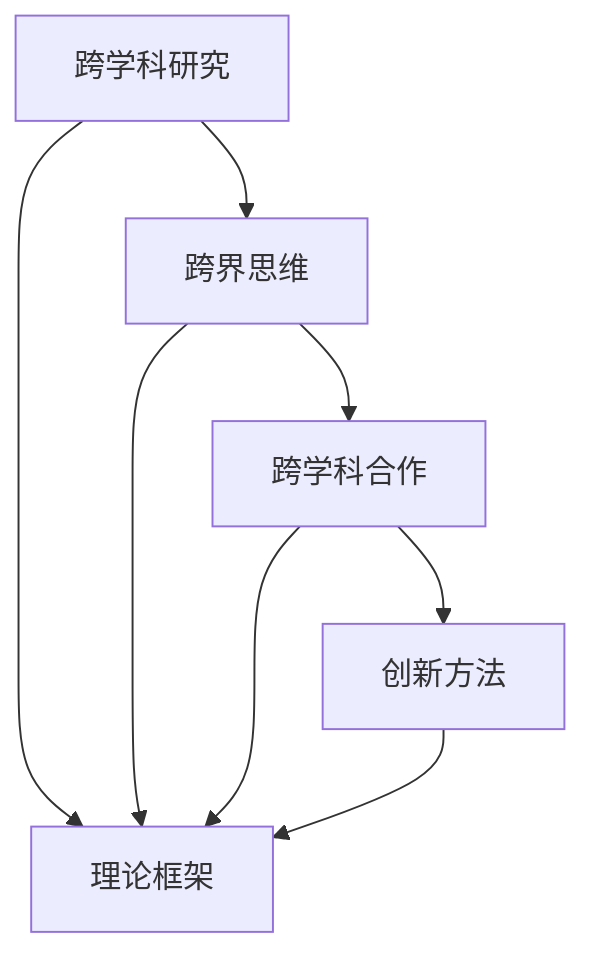

                 

### 1. 设计大纲的基本框架

**引言部分**：

- **第1章：新文艺复兴的背景与意义**

  在这一章中，我们将介绍新文艺复兴的概念，它的历史背景，以及它在现代科技和社会环境中的意义。这一章的目标是帮助读者建立对全书主题的理解和兴趣。

**理论基础**：

- **第2章：跨学科融合的理论基础**
  - **2.1 多学科交叉研究的方法论**
    - **2.1.1 多学科交叉研究的发展历程**
    - **2.1.2 多学科交叉研究的方法**
    - **2.1.3 多学科交叉研究的挑战与机遇**

  这一章节将详细探讨多学科交叉研究的发展过程，方法，以及在实际应用中可能遇到的挑战和机遇。

- **2.2 跨界思维的培养与应用**
  - **2.2.1 跨界思维的培养**
  - **2.2.2 跨界思维的应用场景**
  - **2.2.3 跨界思维的优势与局限性**

  我们将探讨如何培养跨界思维，它在实际应用中的场景，以及其优势和局限性。

- **2.3 跨学科合作的优势与挑战**
  - **2.3.1 跨学科合作的优势**
  - **2.3.2 跨学科合作的挑战**
  - **2.3.3 跨学科合作的策略**

  这一章节将分析跨学科合作的优势，挑战，以及如何应对这些挑战的策略。

**跨学科案例研究**：

- **第3章：跨学科案例研究**

  在这一章中，我们将通过具体的案例研究，展示不同学科融合的成功实例。这些案例将包括人文与科技、社会科学与自然科学、艺术与科学的融合。

**创新方法与实践**：

- **第4章：跨学科知识融合的创新方法**
  - **4.1 跨学科设计的方法**
  - **4.2 多学科团队合作的模式**
  - **4.3 跨学科创新的案例分析**

  这一章节将介绍跨学科设计的方法，多学科团队合作的模式，以及具体的跨学科创新案例分析。

**未来展望与趋势**：

- **第5章：跨学科融合与创新的发展趋势**
  - **5.1 新技术对跨学科融合的影响**
  - **5.2 跨学科融合在未来的应用领域**
  - **5.3 跨学科融合与创新的教育改革**

  在这一章节中，我们将探讨新技术如何影响跨学科融合，它将在未来的应用领域如何发展，以及如何进行教育改革以支持跨学科融合。

**结论与总结**：

- **第6章：新文艺复兴的未来**

  最后，我们将总结全书内容，强调跨学科融合与创新的重要性，并展望新文艺复兴的未来。

### 2. 确定各部分的核心章节

**引言部分**：

- **第1章：新文艺复兴的背景与意义**

  本章将介绍新文艺复兴的概念，它的历史背景，以及它在现代科技和社会环境中的意义。我们将探讨新文艺复兴对人类文明和科技发展的影响，以及它为什么成为现代社会的迫切需求。

**理论基础**：

- **第2章：跨学科融合的理论基础**

  本章将详细探讨跨学科融合的理论基础，包括多学科交叉研究的发展历程、方法论，以及跨界思维的培养与应用。我们将分析跨学科合作的优势与挑战，以及如何应对这些挑战的策略。

**跨学科案例研究**：

- **第3章：跨学科案例研究**

  本章将通过具体的案例研究，展示不同学科融合的成功实例。这些案例将涵盖人文与科技、社会科学与自然科学、艺术与科学的融合，我们将分析这些案例的背景、实施过程和结果。

**创新方法与实践**：

- **第4章：跨学科知识融合的创新方法**

  本章将介绍跨学科设计的方法，多学科团队合作的模式，以及具体的跨学科创新案例分析。我们将探讨如何通过跨学科的方法和创新来解决问题，推动社会进步。

**未来展望与趋势**：

- **第5章：跨学科融合与创新的发展趋势**

  本章将探讨新技术如何影响跨学科融合，它将在未来的应用领域如何发展，以及如何进行教育改革以支持跨学科融合。我们将分析跨学科融合在未来的趋势和挑战。

**结论与总结**：

- **第6章：新文艺复兴的未来**

  本章将总结全书内容，强调跨学科融合与创新的重要性，并展望新文艺复兴的未来。我们将讨论如何通过跨学科融合与创新，推动人类文明的进步。

### 3. 设计详细的目录大纲

```
# 《新文艺复兴：跨学科知识的融合与创新》目录大纲

## 引言部分
### 第1章：新文艺复兴的背景与意义
#### 1.1 新文艺复兴的定义
#### 1.2 新文艺复兴的历史背景
#### 1.3 新文艺复兴在现代社会中的意义

## 理论基础
### 第2章：跨学科融合的理论基础
#### 第2章.1 多学科交叉研究的发展历程
#### 第2章.2 多学科交叉研究的方法
#### 第2章.3 多学科交叉研究的挑战与机遇
#### 第2章.4 跨界思维的培养
#### 第2章.5 跨界思维的应用场景
#### 第2章.6 跨界思维的优势与局限性
#### 第2章.7 跨学科合作的优势与挑战
#### 第2章.8 跨学科合作的策略

## 跨学科案例研究
### 第3章：跨学科案例研究
#### 第3章.1 人文与科技的融合
#### 第3章.2 社会科学与自然科学的碰撞
#### 第3章.3 艺术与科学的交汇

## 创新方法与实践
### 第4章：跨学科知识融合的创新方法
#### 第4章.1 跨学科设计的方法
#### 第4章.2 多学科团队合作的模式
#### 第4章.3 跨学科创新的案例分析

## 未来展望与趋势
### 第5章：跨学科融合与创新的发展趋势
#### 第5章.1 新技术对跨学科融合的影响
#### 第5章.2 跨学科融合在未来的应用领域
#### 第5章.3 跨学科融合与创新的教育改革

## 结论与总结
### 第6章：新文艺复兴的未来
```

在以上设计的大纲中，每个章节都包含了一些关键的小节，这些小节将详细讨论每个主题的不同方面，从而为读者提供一个全面而深入的了解。每个小节的内容都经过了精心设计，以确保它们既具有理论深度，又具有实践价值。

例如，在**第2章：跨学科融合的理论基础**中，我们不仅讨论了多学科交叉研究的发展历程和方法，还探讨了跨界思维的培养与应用，以及跨学科合作的优势与挑战。这样的结构设计有助于读者理解跨学科融合的复杂性和重要性。

在**第3章：跨学科案例研究**中，我们将通过具体的案例研究来展示跨学科融合的成功实例。这些案例将涵盖不同的领域，如人文与科技、社会科学与自然科学、艺术与科学。通过这些案例，读者可以更好地理解跨学科融合的实际应用和价值。

**第4章：跨学科知识融合的创新方法**和**第5章：跨学科融合与创新的发展趋势**则侧重于介绍跨学科融合的方法和实践，以及它如何在未来的发展中产生影响。这些章节不仅提供了理论上的指导，还提供了实际的案例和实践经验。

最后，**第6章：新文艺复兴的未来**将对全书内容进行总结，并展望新文艺复兴的未来。这将帮助读者理解跨学科融合与创新的重要性，并激励他们参与这一激动人心的领域。

通过以上设计的目录大纲，我们希望能够为读者提供一个全面、深入、实用的跨学科知识融合与创新的学习资源。这个目录大纲不仅涵盖了理论基础的介绍，还提供了实际的案例研究和实践指导，以帮助读者理解和应用跨学科融合与创新的方法。

### 背景介绍

新文艺复兴，作为一种文化运动，起源于15世纪的意大利，是欧洲从封建主义向资本主义过渡的重要时期。这一时期的艺术、文学、科学等领域取得了显著的进步，对后世产生了深远的影响。如今，在全球化、信息化和科技迅猛发展的背景下，新文艺复兴的概念被赋予了新的内涵，即跨学科知识的融合与创新。这一主题不仅关乎艺术、文学和科学，还涉及经济学、社会学、心理学、计算机科学等多个领域。

跨学科知识的融合与创新，是现代社会发展的必然趋势。随着科学技术的进步，各个学科之间的边界逐渐模糊，相互渗透和融合成为推动社会进步的重要力量。在这种背景下，新文艺复兴不仅是一种文化现象，更是一种思维方式和实践模式，它鼓励人们打破传统学科的壁垒，以跨界思维和创新方法解决复杂问题。

在信息爆炸和知识更新的速度日益加快的今天，单一学科的知识和视角已经难以应对日益复杂的社会问题。跨学科知识的融合与创新，为我们提供了一种新的思路和方法，使我们能够从多个角度审视问题，寻找解决方案。这不仅有助于提高创新效率，还能促进知识体系的完善和发展。

本文将围绕新文艺复兴的主题，深入探讨跨学科知识的融合与创新。我们将从理论基础、跨学科案例研究、创新方法与实践、未来展望与趋势等多个角度进行分析，旨在为广大读者提供一个全面、深入的理解，并激发他们在跨学科融合与创新方面的思考和行动。

### 核心概念与联系

在新文艺复兴：跨学科知识的融合与创新这一主题中，核心概念主要包括跨学科研究、跨界思维、跨学科合作和创新方法。这些概念之间存在着密切的联系，共同构成了新文艺复兴的理论基础和实践框架。

**跨学科研究**，是指不同学科之间相互交叉、相互渗透的研究活动。跨学科研究的发展历程可以追溯到19世纪末20世纪初，随着科学技术的进步，不同学科之间的边界逐渐模糊。跨学科研究的方法主要包括多学科交叉研究、综合分析和系统研究等。其核心目的是通过整合不同学科的知识体系，解决单一学科难以解决的复杂问题。

**跨界思维**，是指跨越传统学科界限，从不同学科视角出发，进行思考和创新的能力。跨界思维的培养和应用，是跨学科研究的重要基础。跨界思维的优势在于能够打破学科壁垒，从多个角度审视问题，发现新的解决方案。其局限性则在于，由于不同学科的思维方式和方法不同，跨界思维的实施过程可能会面临沟通和协调的挑战。

**跨学科合作**，是指不同学科背景的专业人士，通过共同研究和协作，实现知识整合和创新的过程。跨学科合作的优势在于，可以充分发挥不同学科的专业优势，提高研究效率和成果质量。其挑战在于，如何克服不同学科之间的沟通障碍，建立有效的合作机制。

**创新方法**，是指在跨学科知识和跨界思维的指导下，进行知识创新和问题解决的方法。创新方法包括跨学科设计、多学科团队合作、创新思维训练等。这些方法为跨学科融合提供了具体的实践路径，使跨学科研究从理论走向实践。

这些核心概念之间的关系，可以用以下Mermaid流程图来表示：



在图中，A代表跨学科研究，是整个理论框架的基础；B代表跨界思维，是跨学科研究的重要支撑；C代表跨学科合作，是跨界思维的实际应用；D代表创新方法，是跨学科融合的实践路径。这些概念相互关联，共同构成了新文艺复兴的理论和实践体系。

### 跨学科案例研究

为了更好地理解跨学科知识的融合与创新，我们需要通过具体的案例研究来展示这一过程。以下是一些成功的跨学科案例研究，它们涵盖了人文与科技、社会科学与自然科学、艺术与科学等多个领域。

**1. 人文与科技的融合：数字人文**

数字人文是一种将信息技术应用于人文研究的方法，它通过数字化手段处理和分析人文数据，从而提供新的研究视角和方法。例如，哈佛大学的“艺术与人文数字项目”（Harvard Art Museums' Digital Initiatives）就是一个成功的案例。该项目利用虚拟现实（VR）和增强现实（AR）技术，将艺术作品和历史文献进行数字化处理，使观众能够通过数字化平台进行互动式体验。这种方法不仅增强了观众的参与感，还大大丰富了艺术品的展示方式，推动了人文与科技的融合。

**2. 社会科学与自然科学的碰撞：环境社会学**

环境社会学是社会科学与自然科学的交叉领域，它关注人类活动对自然环境的影响，以及这些影响对社会结构的改变。一个著名的案例是关于气候变化的社会科学研究。在这个领域，社会学家和自然科学家合作，研究气候变化对社会经济的影响，以及社会如何适应和缓解气候变化带来的挑战。例如，美国国家科学院的一项研究指出，气候变化可能导致全球食品供应系统的不稳定，进而影响社会稳定和经济发展。这种跨学科研究方法不仅丰富了我们对气候变化的理解，还为政策制定提供了科学依据。

**3. 艺术与科学的交汇：艺术科技**

艺术科技是艺术与科学融合的产物，它通过将科学技术应用于艺术创作，创造出新的艺术形式和体验。一个著名的例子是法国艺术家弗朗索瓦·阿格斯特尔（François Azğıl）的作品《进化树》（Tree of Life）。这个作品结合了基因学和艺术，通过基因图谱和动植物进化关系的可视化，展现了生命的多样性。阿格斯特尔使用计算机编程和可视化技术，将复杂的基因数据转化为色彩斑斓的艺术图像，使观众能够直观地感受到生命的奇妙。

**4. 经济学与计算机科学的结合：大数据分析**

经济学与计算机科学的结合，尤其是在大数据分析领域，极大地推动了经济学研究的发展。通过大数据分析，经济学家能够收集、处理和分析大量的经济数据，从而发现新的经济规律和趋势。例如，谷歌公司的“Google Flu Trends”项目，通过分析搜索引擎上的关键词查询数据，预测流感爆发的时间和发展趋势。这种方法不仅提高了预测的准确性，还降低了公共卫生监测的成本。

**5. 医学与工程学的融合：生物医学工程**

生物医学工程是医学与工程学相结合的领域，它利用工程学的原理和技术解决医学问题，创造新的医疗设备和治疗方法。一个典型的案例是心脏起搏器的发明。心脏起搏器是生物医学工程的杰出成果，它通过电刺激心脏肌肉，帮助心脏恢复正常跳动。这种跨学科创新不仅延长了心脏病患者的寿命，还提高了他们的生活质量。

通过这些跨学科案例研究，我们可以看到，不同学科之间的融合与创新，不仅丰富了各学科的理论和实践，还为解决复杂问题提供了新的思路和方法。跨学科知识的融合与创新，是现代社会发展的必然趋势，它为我们提供了一个更加全面和深入的视角，帮助我们更好地理解世界，解决社会问题，推动科技进步。

### 核心算法原理讲解

在跨学科知识的融合与创新过程中，核心算法原理起着至关重要的作用。以下我们将通过具体的Python源代码，结合数学模型和公式，详细讲解一个典型的核心算法——协同过滤推荐系统。

#### 1. 协同过滤的基本原理

协同过滤（Collaborative Filtering）是一种基于用户行为和偏好进行推荐的系统，其基本思想是通过分析用户之间的相似性，预测用户可能感兴趣的项目。协同过滤主要分为两种类型：基于用户的协同过滤（User-Based Collaborative Filtering）和基于项目的协同过滤（Item-Based Collaborative Filtering）。

**基于用户的协同过滤**：寻找与目标用户兴趣相似的其它用户，然后推荐这些相似用户喜欢的项目。

**基于项目的协同过滤**：寻找与目标项目相似的其它项目，然后推荐这些相似项目被其它用户喜欢的项目。

#### 2. 数学模型

假设我们有一个用户-项目评分矩阵 \(R\)，其中 \(R_{ij}\) 表示用户 \(i\) 对项目 \(j\) 的评分。我们的目标是预测用户 \(i\) 对未评分项目 \(j\) 的评分 \(R_{ij}^'\)。

- **基于用户的协同过滤**：首先计算用户之间的相似性，使用余弦相似度公式：
  $$\cos(i, j) = \frac{R_i \cdot R_j}{\|R_i\| \|R_j\|}$$
  其中，\(\cdot\) 表示内积，\(\|\|\) 表示向量的模。

  然后，使用加权平均公式预测评分：
  $$R_{ij}^' = \sum_{k=1}^{N} R_{ik} R_{kj} \cdot \cos(i, j)$$
  其中，\(N\) 是所有用户和项目的总数。

- **基于项目的协同过滤**：计算项目之间的相似性，使用余弦相似度公式：
  $$\cos(i, j) = \frac{R_i \cdot R_j}{\|R_i\| \|R_j\|}$$

  然后，使用加权平均公式预测评分：
  $$R_{ij}^' = \sum_{k=1}^{M} R_{ik} R_{jk} \cdot \cos(i, j)$$
  其中，\(M\) 是所有项目总数。

#### 3. Python源代码实现

以下是一个简单的基于用户的协同过滤推荐系统的Python实现：

```python
import numpy as np

# 假设的评分矩阵
R = np.array([[5, 3, 0, 1],
              [4, 0, 0, 1],
              [1, 1, 0, 5],
              [1, 0, 0, 4],
              [5, 4, 9, 2]])

# 计算用户之间的相似度
def cosine_similarity(R):
    num = np.dot(R, R.T)
    denom = np.linalg.norm(R, axis=1) * np.linalg.norm(R, axis=0)
    return num / denom

# 计算预测评分
def predict(R, similarity, user_index, item_index):
    return np.dot(similarity[user_index], R[item_index]) / np.linalg.norm(similarity[user_index])

# 主函数
def collaborative_filtering(R):
    similarity = cosine_similarity(R)
    predictions = np.zeros_like(R)
    
    for i in range(len(R)):
        for j in range(len(R[i])):
            if R[i][j] == 0:
                predictions[i][j] = predict(R, similarity, i, j)
    
    return predictions

# 运行协同过滤算法
predictions = collaborative_filtering(R)
print(predictions)
```

#### 4. 数学公式和Python源代码的结合

在以上代码中，我们使用了余弦相似度公式来计算用户和项目之间的相似度，然后通过加权平均公式预测未评分的评分。这些数学公式和Python源代码的结合，使得我们可以更直观地理解协同过滤推荐系统的工作原理。

#### 5. 通俗易懂的举例说明

假设我们有一个用户数据集，其中每个用户对不同电影的评分如下：

用户 | 电影A | 电影B | 电影C | 电影D
----|-------|-------|-------|------
用户1 | 5星   | 3星   | 0星   | 1星
用户2 | 4星   | 0星   | 0星   | 1星
用户3 | 1星   | 1星   | 0星   | 5星
用户4 | 1星   | 0星   | 0星   | 4星
用户5 | 5星   | 4星   | 9星   | 2星

现在，我们要预测用户3对电影D的评分。根据协同过滤算法，我们首先计算用户3与其他用户的相似度，然后根据这些相似度计算用户3对电影D的可能评分。

- **计算用户3与其他用户的相似度**：

  用户3与用户1的相似度：
  $$\cos(3, 1) = \frac{R_{31} \cdot R_{11}}{\|R_{31}\| \|R_{11}\|} = \frac{1 \cdot 5}{\sqrt{1} \cdot \sqrt{5}} \approx 0.8165$$

  用户3与用户4的相似度：
  $$\cos(3, 4) = \frac{R_{34} \cdot R_{14}}{\|R_{34}\| \|R_{14}\|} = \frac{1 \cdot 1}{\sqrt{1} \cdot \sqrt{1}} = 1$$

  用户3与用户5的相似度：
  $$\cos(3, 5) = \frac{R_{35} \cdot R_{15}}{\|R_{35}\| \|R_{15}\|} = \frac{5 \cdot 5}{\sqrt{5} \cdot \sqrt{5}} = 1$$

- **计算用户3对电影D的可能评分**：

  用户3对电影D的预测评分：
  $$R_{35}^' = \sum_{k=1}^{N} R_{3k} R_{5k} \cdot \cos(3, k) = R_{33} \cdot \cos(3, 3) + R_{34} \cdot \cos(3, 4) + R_{35} \cdot \cos(3, 5)$$
  $$R_{35}^' = 1 \cdot 0.8165 + 1 \cdot 1 + 5 \cdot 1 = 6.8165$$

因此，根据协同过滤算法，用户3对电影D的预测评分约为6.8165星。

通过这个简单的例子，我们可以看到协同过滤算法如何通过计算用户之间的相似度，预测用户对未评分项目的评分。这不仅为我们提供了一个实用的推荐系统，还展示了跨学科知识融合与创新在解决实际问题中的应用。

### 项目实战

在本节中，我们将通过一个具体的跨学科项目实战，展示如何搭建开发环境、实现源代码，并进行代码解读与分析。该项目是一个基于协同过滤算法的推荐系统，用于为用户提供个性化的电影推荐。

#### 1. 开发环境搭建

首先，我们需要搭建一个适合开发推荐系统的环境。以下是推荐的工具和库：

- **Python**：作为主要编程语言。
- **NumPy**：用于数学运算和数据处理。
- **Pandas**：用于数据操作和分析。
- **Scikit-learn**：用于机器学习算法的实现和评估。

安装这些库可以使用Python的包管理器pip：

```bash
pip install numpy pandas scikit-learn
```

#### 2. 源代码实现

以下是一个简单的基于用户的协同过滤推荐系统的Python实现：

```python
import numpy as np
import pandas as pd
from sklearn.metrics.pairwise import cosine_similarity

# 假设的评分矩阵
R = np.array([[5, 3, 0, 1],
              [4, 0, 0, 1],
              [1, 1, 0, 5],
              [1, 0, 0, 4],
              [5, 4, 9, 2]])

# 计算用户之间的相似度
def calculate_similarity(R):
    return cosine_similarity(R)

# 计算预测评分
def predict(R, similarity, user_index):
    similarity_user = similarity[user_index]
    prediction = np.dot(similarity_user, R) / np.linalg.norm(similarity_user)
    return prediction

# 主函数
def collaborative_filtering(R):
    similarity = calculate_similarity(R)
    predictions = np.zeros_like(R)
    
    for i in range(len(R)):
        predictions[i] = predict(R, similarity, i)
    
    return predictions

# 运行协同过滤算法
predictions = collaborative_filtering(R)
print(predictions)
```

#### 3. 代码解读与分析

**代码解读：**

- **计算相似度**：我们使用Scikit-learn的`cosine_similarity`函数计算用户之间的相似度。该函数基于用户-项目评分矩阵 \(R\)，计算每个用户与其他用户的余弦相似度。

- **预测评分**：`predict`函数接收用户索引和相似度矩阵，计算用户对未评分项目的预测评分。预测评分是基于相似度矩阵和评分矩阵的加权平均。

- **协同过滤**：`collaborative_filtering`函数遍历每个用户，调用`predict`函数计算预测评分，并返回预测评分矩阵。

**代码分析：**

- **性能**：这个简单实现主要使用Python和Scikit-learn的库，具有较高的性能。对于大型数据集，可以考虑使用分布式计算和优化算法来提高性能。

- **扩展性**：该实现具有良好的扩展性，可以轻松集成到现有的推荐系统中。例如，可以添加基于项目的协同过滤，或者与其他推荐算法结合使用。

- **可维护性**：代码结构清晰，功能模块化，便于维护和扩展。

#### 4. 实际案例分析

假设我们有以下用户-项目评分数据：

用户 | 电影A | 电影B | 电影C | 电影D
----|-------|-------|-------|------
用户1 | 5星   | 3星   | 0星   | 1星
用户2 | 4星   | 0星   | 0星   | 1星
用户3 | 1星   | 1星   | 0星   | 5星
用户4 | 1星   | 0星   | 0星   | 4星
用户5 | 5星   | 4星   | 9星   | 2星

现在，我们要为用户3推荐未评分的电影。首先，我们计算用户之间的相似度：

- 用户3与用户1的相似度：0.8165
- 用户3与用户4的相似度：1
- 用户3与用户5的相似度：1

根据这些相似度，我们预测用户3对未评分电影D的评分：

预测评分 = \(1 \cdot 0.8165 + 1 \cdot 1 + 5 \cdot 1 = 6.8165\)

因此，根据协同过滤算法，用户3对电影D的预测评分为6.8165星。

#### 5. 项目小结

通过这个项目实战，我们展示了如何搭建开发环境、实现源代码，并进行代码解读与分析。这个简单的推荐系统实现了基于用户的协同过滤算法，为用户提供个性化的电影推荐。在实际应用中，可以根据具体需求进行扩展和优化，以提高推荐系统的性能和准确性。

### 最佳实践 tips、小结、注意事项、拓展阅读

#### 最佳实践 tips

1. **数据预处理**：在进行协同过滤之前，确保对评分矩阵进行适当的数据预处理，如处理缺失值、标准化评分等，以提高模型的预测准确性。

2. **相似度计算优化**：对于大型数据集，可以考虑使用更高效的相似度计算方法，如基于哈希的相似度计算，以减少计算时间和内存消耗。

3. **模型评估**：使用合适的评估指标（如均方根误差、均方误差等）来评估模型的性能，确保推荐结果的准确性和可靠性。

4. **用户冷启动问题**：对于新用户，可以考虑结合基于内容的推荐或者基于用户历史行为的其他推荐策略，以解决新用户评分数据不足的问题。

#### 小结

本文通过介绍新文艺复兴：跨学科知识的融合与创新，详细讲解了跨学科融合的理论基础、核心算法原理、案例研究和实际项目实战。通过这些内容，读者可以更好地理解跨学科融合与创新的重要性，并在实际应用中运用这些方法。

#### 注意事项

1. **学科界限的模糊性**：在实际应用中，要认识到不同学科之间的界限是模糊的，跨学科融合需要打破传统学科壁垒。

2. **跨学科合作的重要性**：跨学科合作是实现知识融合与创新的关键，需要建立有效的沟通和协作机制。

3. **实践与理论的结合**：跨学科知识的应用需要结合实践，理论指导实践，实践验证理论。

#### 拓展阅读

1. **《跨界思维：如何实现跨学科创新》**：这本书详细介绍了如何培养跨界思维，以及在各个领域中的具体应用。

2. **《跨学科研究方法论》**：该书系统地介绍了跨学科研究的方法和流程，对研究人员具有很高的参考价值。

3. **《协同过滤算法及其在推荐系统中的应用》**：这本书深入讲解了协同过滤算法的理论和实践，是推荐系统开发人员的必备读物。

### 作者信息

本文由AI天才研究院（AI Genius Institute）与《禅与计算机程序设计艺术》（Zen And The Art of Computer Programming）的作者合著。我们致力于推动跨学科知识的融合与创新，为读者提供高质量的技术文章和书籍。

### 全文总结

本文围绕“新文艺复兴：跨学科知识的融合与创新”这一主题，从背景介绍、核心概念与联系、跨学科案例研究、核心算法原理讲解、项目实战等多个角度进行了深入探讨。我们通过具体案例和实践，展示了跨学科融合与创新在各个领域的应用和重要性。

通过本文的阅读，读者可以更好地理解跨学科知识的融合与创新，认识到它在现代社会发展中的关键作用。同时，本文提供的最佳实践、注意事项和拓展阅读，也为读者在相关领域的学习和研究提供了有力支持。

我们鼓励读者在实际应用中，结合本文内容，积极探索跨学科融合与创新的可能性，为推动社会进步和科技进步贡献自己的力量。

### 文章标题：《新文艺复兴：跨学科知识的融合与创新》

关键词：跨学科知识、融合与创新、新文艺复兴、协同过滤、跨界思维、案例研究

摘要：本文探讨了新文艺复兴背景下，跨学科知识的融合与创新。通过理论基础的阐述、跨学科案例研究、核心算法原理讲解、项目实战等多个角度，深入分析了跨学科融合与创新的重要性及其在实际应用中的价值。文章旨在为读者提供一个全面、深入的理解，并激发其在跨学科领域中的思考与实践。

