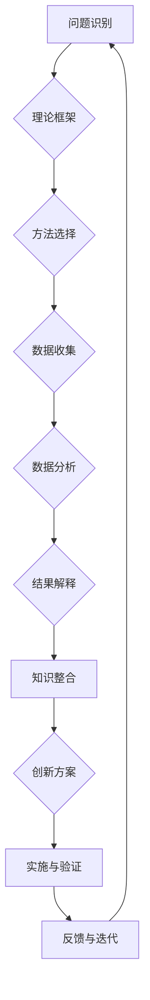
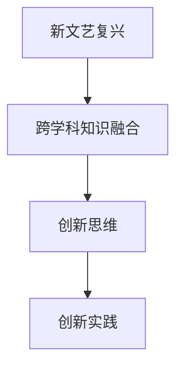

                 

## 新文艺复兴：跨学科知识的融合创新

### 关键词：
- 新文艺复兴
- 跨学科知识
- 融合创新
- 创新思维
- 跨学科教育
- 案例研究

### 摘要：
本文旨在探讨新文艺复兴背景下，跨学科知识的融合与创新。通过定义新文艺复兴、阐述跨学科知识的重要性，以及介绍跨学科研究的方法论和案例，本文揭示了跨学科融合对于创新思维培养和实际应用的深远影响。文章最后提出跨学科教育的实践策略和未来趋势，为读者提供全面的跨学科融合创新视角。

### 引言

在当今快速发展的科技时代，知识更新换代的速度越来越快，学科界限变得日益模糊。新文艺复兴的理念应运而生，它倡导不同学科之间的交流与融合，通过跨界合作，激发新的创新思维，推动社会进步。新文艺复兴不仅体现在艺术领域，更在科技、社会等多个方面得到应用。本文将深入探讨新文艺复兴的跨学科知识融合创新，旨在为读者提供一种全新的思维方式和实践路径。

首先，我们将定义新文艺复兴，探讨其时代背景和重要性。接着，我们将详细阐述跨学科知识的概念、特点及其应用价值。然后，本文将介绍跨学科研究的方法论，并通过具体案例展示跨学科融合的实践效果。此外，本文还将讨论跨学科教育的重要性和实施策略，并探讨创新思维的培养方法。最后，本文将展望跨学科融合的未来趋势，总结全文，为读者提供跨学科融合创新的实用建议。

### 第一部分：背景与概述

#### 第1章：新文艺复兴的定义与时代背景

**1.1 新文艺复兴的定义**

新文艺复兴（Neuro Renaissance）是一个跨学科的综合性概念，起源于20世纪中叶。它不仅涉及艺术和文学，还包括自然科学、社会科学和人文科学等领域。新文艺复兴强调不同学科之间的交流和融合，通过跨界合作，实现知识创新和艺术创作。新文艺复兴的理念可以追溯到文艺复兴时期，那时人们通过跨学科的知识融合，推动了艺术、科学和技术的重大进步。

在当代，新文艺复兴的意义更加凸显。随着科技的飞速发展，各学科之间的界限变得模糊，知识的融合和创新成为推动社会进步的关键动力。新文艺复兴倡导跨学科思维，鼓励人们突破传统学科界限，探索新的知识领域，从而实现知识的跨领域迁移和应用。

**1.2 新文艺复兴的时代背景**

新文艺复兴的出现并非偶然，而是时代发展的必然结果。在21世纪，以下几个因素共同推动了新文艺复兴的兴起：

1. **信息技术的发展**：信息技术的飞速发展，尤其是互联网和人工智能技术的崛起，使得不同领域之间的交流变得前所未有的便捷。人们可以通过互联网获取海量的跨学科知识，实现实时协作和知识共享。
   
2. **全球化进程**：全球化使得不同国家和地区的文化、科技、经济等领域的交流变得更加频繁和深入。这种跨文化的交流，促进了新文艺复兴的理念在全球范围内的传播和实践。

3. **可持续发展需求**：面对全球性挑战，如气候变化、环境污染和资源短缺，需要多学科的知识和智慧来共同应对。新文艺复兴的理念强调跨学科合作，通过知识的融合，寻求解决全球问题的创新方案。

4. **知识经济时代**：知识经济时代的到来，使得知识成为经济增长的核心动力。跨学科的知识融合，不仅推动了科学技术的进步，也促进了经济的创新和发展。

**1.3 新文艺复兴的重要性**

新文艺复兴的重要性体现在以下几个方面：

1. **推动知识创新**：新文艺复兴倡导跨学科的知识融合，打破了传统学科界限，促进了知识的交叉和融合。这种知识创新，有助于发现新的科学规律，推动科学技术的进步。

2. **促进艺术创作**：新文艺复兴强调艺术与科学的融合，使得艺术创作具有更多的科学依据和创新思路。跨学科的艺术创作，不仅丰富了艺术表现形式，也提升了艺术创作的深度和广度。

3. **提升社会创新能力**：新文艺复兴的理念，鼓励人们跨越学科界限，探索新的解决方案。这种跨学科的创新思维，有助于解决复杂的社会问题，提升社会的整体创新能力。

4. **培养全面发展的人才**：新文艺复兴倡导跨学科教育，通过不同学科的交叉融合，培养具有综合素质和创新能力的人才。这种教育模式，有助于培养全面发展的人才，适应未来社会的发展需求。

综上所述，新文艺复兴作为一种跨学科的知识融合创新理念，具有重要的时代意义和实践价值。通过跨学科的知识融合，我们可以推动知识的创新和艺术的进步，提升社会的整体创新能力，为人类的可持续发展贡献力量。

#### 第2章：跨学科知识的重要性

**2.1 跨学科知识的定义**

跨学科知识（Interdisciplinary Knowledge）是指跨越传统学科界限，融合不同学科的理论、方法和技术，解决复杂问题的知识体系。跨学科知识强调不同学科之间的互补和融合，通过跨学科的视角和方法，探索和解决复杂的现实问题。与传统单一学科的知识相比，跨学科知识具有更强的综合性和创新性。

**2.2 跨学科知识的特点**

跨学科知识具有以下几个显著特点：

1. **综合性**：跨学科知识不是简单地将多个学科的知识拼凑在一起，而是通过综合不同学科的理论和方法，形成一个新的知识体系。这种综合性，使得跨学科知识能够更好地应对复杂的问题。

2. **创新性**：跨学科知识通过跨学科的视角和方法，常常能够发现新的科学规律和解决方案。这种创新性，使得跨学科知识成为推动科学技术进步的重要动力。

3. **灵活性**：跨学科知识不受传统学科界限的限制，可以根据问题的具体需求，灵活地调用不同学科的理论和方法。这种灵活性，使得跨学科知识在解决复杂问题时具有更高的适应性。

4. **动态性**：跨学科知识是一个不断发展的动态过程，随着科技的进步和社会的发展，跨学科知识也在不断地更新和拓展。这种动态性，使得跨学科知识能够持续地应对新的挑战和问题。

**2.3 跨学科知识的应用价值**

跨学科知识在各个领域都有着广泛的应用价值，以下列举几个典型的应用领域：

1. **科学技术领域**：在科学技术领域，跨学科知识的应用尤为突出。例如，量子计算需要结合物理学、数学和计算机科学的知识；基因编辑技术需要结合生物学、化学和计算机科学的知识。这些跨学科的知识融合，推动了科学技术的重大突破。

2. **文化艺术领域**：在文化艺术领域，跨学科知识的应用也极为广泛。例如，多媒体艺术结合了计算机科学、美术和音乐等多学科的知识，创造出独特的艺术形式。跨学科的知识融合，丰富了艺术创作的表现形式和内涵。

3. **社会管理领域**：在社会管理领域，跨学科知识的应用有助于解决复杂的社会问题。例如，城市规划需要结合地理学、建筑学、环境科学和社会学等学科的知识；公共卫生管理需要结合医学、生物学和社会学等学科的知识。这些跨学科的知识融合，提升了社会管理的科学性和有效性。

4. **经济发展领域**：在经济发展领域，跨学科知识的应用推动了新的产业形态的出现。例如，数字经济结合了计算机科学、经济学和市场营销等学科的知识，创造出了新的商业模式和经济增长点。跨学科的知识融合，促进了经济的创新和发展。

总之，跨学科知识的重要性在于它能够打破传统学科的界限，通过知识的交叉和融合，解决复杂的问题，推动社会的进步。跨学科知识不仅具有综合性和创新性，而且在科学技术、文化艺术、社会管理和经济发展等各个领域都有着广泛的应用价值。通过跨学科的知识融合，我们可以更好地应对当前和未来的挑战，实现知识的创新和经济的可持续发展。

#### 第3章：跨学科研究的方法论

**3.1 跨学科研究的原则**

跨学科研究（Interdisciplinary Research）是当前科学研究中的一种重要趋势，它要求研究者打破传统学科界限，综合运用多种学科的理论和方法，以解决复杂的现实问题。跨学科研究遵循以下几项基本原则：

1. **综合性原则**：跨学科研究不是简单地将多个学科的知识拼凑在一起，而是通过综合不同学科的理论和方法，形成一个新的知识体系。这种综合性，使得跨学科研究能够更好地应对复杂的问题。

2. **协同性原则**：跨学科研究强调不同学科之间的协同合作，通过不同学科的互补和融合，实现知识的创新和突破。这种协同性，使得跨学科研究能够发挥出最大的研究效益。

3. **动态性原则**：跨学科研究是一个动态的过程，随着科技的进步和社会的发展，跨学科研究也在不断地更新和拓展。这种动态性，使得跨学科研究能够持续地适应新的挑战和问题。

4. **问题导向原则**：跨学科研究以解决实际问题为导向，通过跨学科的视角和方法，寻求解决复杂问题的创新方案。这种问题导向，使得跨学科研究更具针对性和实用性。

**3.2 跨学科研究的过程**

跨学科研究的过程可以分为以下几个阶段：

1. **问题识别**：首先，研究者需要明确研究问题，确定研究的核心问题和目标。这一阶段需要广泛收集相关领域的文献资料，了解当前研究的现状和不足。

2. **理论框架构建**：在明确研究问题后，研究者需要构建一个跨学科的理论框架，将不同学科的理论和方法进行整合。这一阶段需要综合分析不同学科的理论基础，形成一个新的理论模型。

3. **方法选择**：根据构建的理论框架，研究者需要选择合适的研究方法。跨学科研究常常需要结合定量和定性研究方法，以全面、深入地探讨研究问题。

4. **数据收集与分析**：在方法选择后，研究者需要收集相关数据，并进行系统的分析和解释。跨学科研究的数据来源可能包括实验数据、调查数据、案例分析等多种形式。

5. **结果解释与讨论**：在分析数据后，研究者需要对研究结果进行解释和讨论，探讨研究结果对相关领域的贡献和启示。这一阶段需要将研究结果与现有理论进行对比，分析研究的局限性和未来研究方向。

6. **知识整合与创新**：最后，研究者需要将研究结果进行整合，提出新的理论或方法。跨学科研究的最终目标是实现知识的创新和突破，推动科学技术的进步。

**3.3 跨学科研究的工具与技术**

跨学科研究需要运用多种工具和技术，以下列举几个常用的工具和技术：

1. **系统分析方法**：系统分析方法可以帮助研究者从整体上理解和分析复杂系统，通过系统的分解和综合，揭示系统内部的结构和运行机制。

2. **计算模型**：计算模型可以模拟和分析复杂的现实问题，通过数值计算和模拟实验，验证理论假设和提出新的预测。

3. **大数据分析**：大数据分析技术可以帮助研究者处理和分析海量的数据，发现数据之间的关联和规律，为研究提供新的视角和证据。

4. **多学科模拟与仿真**：多学科模拟与仿真技术可以将不同学科的理论和方法进行整合，构建复杂的仿真模型，模拟和预测现实问题的发展趋势。

5. **跨学科协作平台**：跨学科协作平台可以促进不同学科之间的交流和合作，通过在线合作工具和知识共享平台，实现跨学科的知识整合和创新。

总之，跨学科研究是一种综合性、协同性、动态性和问题导向的研究方法，它通过综合运用多种学科的理论和方法，解决复杂的现实问题。跨学科研究的过程和方法具有明显的特点，需要遵循一定的原则和步骤。通过运用各种工具和技术，跨学科研究可以实现知识的创新和突破，为科学技术的进步和社会发展贡献力量。

#### 第4章：跨学科融合的案例研究

**4.1 跨学科融合在艺术领域的应用**

艺术领域一直是跨学科知识融合的沃土。艺术家们常常通过跨学科的视角和方法，创造出独特的艺术作品。以下是一些跨学科融合在艺术领域的成功案例：

**案例1：多媒体艺术**

多媒体艺术结合了计算机科学、美术和音乐等多学科的知识，创造出全新的艺术表现形式。例如，美国艺术家约翰·莫瑞索（John Maeda）通过编程和视觉设计，创作了一系列结合视觉和互动性的艺术作品。他的作品《互动设计》（Interactive Design）不仅展示了计算机科学的魅力，也融入了视觉艺术的元素，创造出独特的视觉效果。

**案例2：生物艺术**

生物艺术将生物学、艺术和科学相结合，探讨生物技术与人类文化的互动。例如，艺术家艾米丽·肖特（Emily Schultz）通过基因工程和生物技术，创作了一系列表达人类基因特征的生物艺术作品。她的作品《基因艺术》（Gene Art）不仅展示了生物学的最新进展，也引发了关于人类身份和文化的深刻思考。

**案例3：环境艺术**

环境艺术通过跨学科的视角，探讨人与自然的关系。例如，美国艺术家玛丽安娜·谢尔（Marina Abramović）通过表演艺术和装置艺术，创作了一系列关于人类与环境互动的作品。她的作品《空间的占领》（Space Invaders）通过观众与环境的互动，探讨人类在自然环境中的角色和责任。

**4.2 跨学科融合在科技领域的应用**

科技领域是跨学科知识融合的重要阵地。通过跨学科的合作，科学家和工程师们能够创造出更加先进的技术和解决方案。以下是一些跨学科融合在科技领域的成功案例：

**案例1：量子计算**

量子计算是物理学、数学和计算机科学的交叉领域。通过量子力学和计算机科学的理论，科学家们研究如何利用量子比特实现高效的计算。例如，谷歌的量子计算团队通过跨学科的合作，成功实现了量子优越性，证明了量子计算在特定任务上比传统计算机具有显著优势。

**案例2：智能交通系统**

智能交通系统结合了计算机科学、交通运输工程和环境科学等多学科的知识，旨在通过信息技术和智能化的交通管理，提高交通效率和减少环境污染。例如，中国的“智能交通系统”项目通过大数据分析和人工智能技术，实现了对交通流量和交通安全的实时监控和管理，有效缓解了交通拥堵问题。

**案例3：健康医疗**

健康医疗领域是跨学科知识融合的重要应用领域。通过生物医学、信息科学和工程学的合作，科学家们开发出了多种创新性的医疗技术和解决方案。例如，基因测序技术的突破离不开生物学、计算机科学和工程学的跨学科合作。基因测序不仅揭示了人类基因的奥秘，还为个性化医疗提供了新的可能。

**4.3 跨学科融合在社会领域的应用**

社会领域是跨学科知识融合的重要实践场。通过跨学科的视角和方法，社会科学家和政策制定者能够更有效地解决社会问题，提升社会福祉。以下是一些跨学科融合在社会领域的成功案例：

**案例1：城市可持续发展**

城市可持续发展是一个复杂的跨学科问题，需要结合环境科学、城市规划、经济学和社会学等多学科的知识。例如，新加坡的“智慧国计划”（Smart Nation Plan）通过跨学科的合作，实现了城市交通、能源和环境管理的智能化。该项目通过大数据分析、人工智能和物联网技术，提高了城市的可持续性和居民的生活质量。

**案例2：社会创新**

社会创新通过跨学科的知识融合，解决社会问题，推动社会进步。例如，印度的“阿达尼基金会”（Adani Foundation）通过跨学科的合作，实施了多个社会创新项目，包括教育和卫生领域。这些项目通过科技创新和社会实践的结合，提升了贫困地区的教育水平和医疗保障。

**案例3：公共政策**

公共政策的制定需要跨学科的知识支持。例如，美国的“减贫计划”（Poverty Reduction Program）通过跨学科的视角，结合经济学、社会学和公共卫生学等学科的知识，制定了有效的减贫政策。该项目通过综合分析不同领域的数据，提出了针对性的减贫措施，取得了显著的减贫效果。

总之，跨学科融合在艺术、科技和社会领域的广泛应用，证明了跨学科知识的重要性。通过跨学科的视角和方法，我们可以创造出新的艺术形式、推动科学技术的进步，解决复杂的社会问题。跨学科融合不仅促进了知识的创新和突破，也为人类社会的可持续发展提供了新的动力。

#### 第5章：跨学科教育的实践

**5.1 跨学科教育的重要性**

跨学科教育（Interdisciplinary Education）是当前教育领域的一种新兴理念，它通过综合不同学科的知识和技能，培养学生的综合能力和创新思维。跨学科教育的重要性体现在以下几个方面：

1. **适应未来社会发展需求**：随着科技的飞速发展和全球化进程的加快，社会对人才的需求越来越综合和多元化。跨学科教育能够培养具有跨学科思维能力和综合素质的人才，更好地适应未来社会的发展需求。

2. **促进知识创新**：跨学科教育鼓励学生打破传统学科界限，综合运用不同学科的知识和技能，进行知识创新。这种教育模式能够激发学生的创新思维，培养具有创新能力的人才。

3. **提升学生的综合素质**：跨学科教育通过综合不同学科的知识，帮助学生构建全面的知识体系，提升学生的综合素质。跨学科教育不仅关注学生的学术能力，还注重学生的沟通能力、团队协作能力和解决问题的能力。

4. **培养具有国际视野的人才**：跨学科教育鼓励学生跨文化学习和交流，培养学生的国际视野和跨文化沟通能力。这种教育模式有助于培养具有国际竞争力的人才，为全球化背景下的国际交流和合作奠定基础。

**5.2 跨学科教育的实施策略**

跨学科教育的实施需要科学合理的策略和方法，以下是一些有效的跨学科教育实施策略：

1. **课程整合**：跨学科教育的核心在于整合不同学科的知识和技能。学校可以通过开设跨学科课程，将多个学科的知识融合在一起，培养学生的综合能力。例如，可以开设“科技与社会”、“环境与可持续发展”等跨学科课程。

2. **项目驱动学习**：项目驱动学习（Project-Based Learning）是一种有效的跨学科教育方法。通过项目驱动学习，学生可以综合运用不同学科的知识和技能，解决实际问题。例如，可以让学生参与一个关于环境保护的跨学科项目，涵盖生物学、化学、地理学等多个学科的知识。

3. **合作学习**：跨学科教育强调团队合作和协作学习。通过合作学习，学生可以学会如何与不同学科背景的同学合作，共同解决问题。例如，可以组织跨学科学习小组，让学生在项目中共同完成任务。

4. **跨学科师资团队**：跨学科教育需要具备跨学科知识和教学能力的师资团队。学校可以鼓励教师跨学科学习和交流，建立跨学科的师资团队，为学生提供更全面的跨学科教育资源。

5. **校外合作与交流**：跨学科教育需要与外部机构和组织建立合作关系，为学生提供实践和交流的机会。学校可以与科研机构、企业和社会组织合作，组织跨学科的实践活动和研讨会，拓宽学生的视野和经验。

**5.3 跨学科教育的案例分析**

以下是一些成功的跨学科教育案例，展示了跨学科教育的实践效果：

**案例1：斯坦福大学跨学科教育项目**

斯坦福大学跨学科教育项目（Stanford Interdisciplinary Programs）是一个集科学研究、教育实践和社会服务于一体的跨学科教育平台。该项目涵盖了计算机科学、生物学、心理学、经济学等多个学科，通过跨学科的项目研究和课程设置，培养学生的跨学科思维能力和创新能力。

**案例2：麻省理工学院媒体实验室**

麻省理工学院媒体实验室（MIT Media Lab）是一个以跨学科研究为核心的学术机构。该实验室通过跨学科的视角和方法，研究人工智能、虚拟现实、机器人技术等前沿科技，推动科技创新和社会进步。实验室的项目和课程设置，为学生提供了丰富的跨学科学习和实践机会。

**案例3：芬兰PISA教育改革**

芬兰PISA（Program for International Student Assessment）教育改革注重培养学生的跨学科能力和创新思维。通过跨学科的课程设计和教学方法，芬兰教育体系有效地提升了学生的综合素质和创新能力，使得芬兰学生在国际学生评估中取得了优异成绩。

总之，跨学科教育是一种重要的教育模式，它通过综合不同学科的知识和技能，培养学生的综合能力和创新思维。通过有效的跨学科教育实施策略和成功的跨学科教育案例，我们可以看到跨学科教育在培养未来人才方面的巨大潜力。

#### 第6章：创新思维的培养

**6.1 创新思维的定义**

创新思维（Innovative Thinking）是指通过独特、创造性、前瞻性的方式思考和解决问题的一种思维方式。它不仅仅是传统逻辑思维的扩展，更是一种对问题、需求和机会进行深入分析、整合和创新的能力。创新思维不同于常规思维，它不拘泥于现有的模式和框架，而是敢于挑战传统观念，寻求新的解决方案。

**6.2 创新思维的类型**

创新思维可以分为以下几种类型：

1. **发散思维**：发散思维是指从一个中心点出发，向多个方向发散思考，寻找不同的解决方案。这种思维方式能够激发创意，发现新的可能性。

2. **收敛思维**：收敛思维则是在众多可能性中，通过筛选和评估，找到一个最优的解决方案。这种思维方式强调逻辑性和系统性，能够确保创新思维的落地实施。

3. **逆向思维**：逆向思维是从问题的反面或相反的角度进行思考，寻找出人意料的解决方案。这种思维方式能够打破常规思维的限制，激发创新。

4. **联想思维**：联想思维是通过不同事物之间的联系，产生新的想法和创意。这种思维方式能够将看似无关的事物联系起来，创造出新的价值。

**6.3 创新思维的培养方法**

要培养创新思维，可以采取以下几种方法：

1. **跨学科学习**：跨学科学习能够拓宽知识视野，激发创新思维。通过学习不同学科的知识，可以培养综合分析问题和解决问题的能力。

2. **实践与体验**：通过实践和体验，可以加深对知识的理解和应用，培养创新思维。例如，参与科研项目、创业实践等，都可以锻炼创新思维。

3. **思维训练**：通过思维训练，如思维导图、逻辑思维游戏等，可以培养思维的灵活性和创造性。

4. **开放心态**：开放心态能够接受不同的观点和意见，鼓励创新思维的发展。要敢于挑战传统观念，勇于尝试新的思路和方法。

5. **鼓励失败**：创新过程中难免会遇到失败，但失败是创新思维的一部分。要鼓励失败，从失败中学习，不断调整和改进。

总之，创新思维是一种重要的思维能力，它通过独特的思维方式，帮助我们寻找新的解决方案，推动知识创新和社会进步。通过跨学科学习、实践与体验、思维训练、开放心态和鼓励失败等方法，我们可以有效地培养创新思维，为未来的创新和发展奠定坚实基础。

#### 第7章：跨学科融合的创新实践

**7.1 跨学科创新的方法**

跨学科创新（Interdisciplinary Innovation）是利用不同学科的知识、技术和方法，解决复杂问题或开发新型产品、服务的一种创新模式。以下是几种常见的跨学科创新方法：

1. **设计思维**：设计思维是一种以用户为中心的创新方法，它强调通过观察用户行为、理解用户需求，然后进行创意发想、原型设计和迭代改进。设计思维能够促进跨学科的交流和协作，使创新更加贴近用户需求。

2. **系统思维**：系统思维是一种从整体角度看待问题的思维方式，它强调通过理解系统内部各部分之间的相互关系，来寻找创新的解决方案。跨学科的系统思维能够帮助研究者发现复杂问题中的关键环节，从而提出更有效的创新方案。

3. **类比思维**：类比思维通过将不同领域的问题进行类比，寻找相似性，从而产生新的创意。这种方法能够激发跨学科的联想和创新，例如，将医学领域的治疗方法类比到工程领域的问题解决。

4. **组合创新**：组合创新是将现有的知识、技术或产品进行重新组合，创造出新的解决方案或产品。这种方法通过跨学科的视角，发现不同领域之间的潜在联系，从而实现创新。

**7.2 跨学科创新的案例分析**

以下是一些跨学科创新的实际案例，展示了跨学科融合在创新实践中的应用：

**案例1：谷歌X实验室的无人驾驶汽车**

谷歌X实验室的无人驾驶汽车项目是跨学科创新的典范。该项目结合了计算机科学、人工智能、机械工程、电子工程和传感器技术等多个领域的知识。通过机器学习算法和传感器技术，无人驾驶汽车能够实时感知和应对复杂道路环境，实现自主驾驶。这一创新不仅推动了交通技术的发展，也改变了人们的出行方式。

**案例2：IBM的Watson智能系统**

IBM的Watson智能系统是跨学科创新的另一个成功案例。Watson结合了自然语言处理、大数据分析、人工智能和医学知识等多个领域的先进技术。通过处理和分析海量的医学数据，Watson能够为医生提供精确的诊断和治疗建议，极大地提高了医疗服务的效率和质量。

**案例3：摩根士丹利的风险管理系统**

摩根士丹利的风险管理系统是一个跨学科的金融创新项目。该项目通过数据科学、金融工程和计算机科学的结合，构建了一个能够实时监测和管理风险的系统。通过数据分析和机器学习算法，系统能够预测市场风险，为投资决策提供数据支持，从而提高了风险管理的精确性和效率。

**案例4：艺术与科技的融合**

在艺术领域，艺术家们通过跨学科的视角和方法，创造出独特的艺术作品。例如，荷兰艺术家约翰·马歇尔（Johann Martin Schröter）通过结合生物学、物理学和计算机科学，创作了一系列生物机械艺术品。这些作品不仅展示了艺术的美感，也探讨了生命与机械之间的关系，引发了观众对科技与艺术的深刻思考。

**7.3 跨学科创新的未来趋势**

随着科技的不断进步和全球化的深化，跨学科创新将呈现出以下几大趋势：

1. **更加多元的学科融合**：未来的跨学科创新将涉及更多学科领域，如量子计算、生物工程、神经科学等。这些学科的融合将推动科技创新和社会进步。

2. **人工智能的深度应用**：人工智能将在跨学科创新中发挥更加重要的作用。通过深度学习和大数据分析，人工智能能够帮助研究者从海量数据中发现新的规律和解决方案。

3. **虚拟现实与增强现实的融合**：虚拟现实（VR）和增强现实（AR）技术的发展，将使跨学科创新更加直观和互动。这些技术将不仅应用于艺术创作，还将在教育、医疗等领域产生深远影响。

4. **可持续发展成为核心目标**：面对全球性挑战，如气候变化、资源短缺和环境破坏，跨学科创新将更加注重可持续发展。未来的跨学科创新将致力于解决这些重大问题，推动人类社会走向更加可持续的未来。

总之，跨学科创新是当前和未来科技创新的重要方向。通过跨学科的知识融合和创新实践，我们可以解决复杂问题，推动社会进步，实现可持续发展。跨学科创新不仅为科学家和工程师提供了新的研究方法，也为艺术家和文化创意工作者提供了新的创作空间。在跨学科创新的引领下，人类社会的未来将更加多元、丰富和美好。

### 附录

#### 附录A：跨学科融合的参考资料

- 《跨学科研究方法论》（作者：迈克尔·波兰尼）
- 《创新与跨学科思维》（作者：戴维·兰德）
- 《艺术与科学的融合》（作者：约翰·弗莱彻）
- 《智能交通系统》（作者：约翰·S.雷蒙德）
- 《智慧国计划：新加坡的智能国家战略》（作者：李显龙）

#### 附录B：跨学科融合的工具与资源

- **跨学科协作平台**：如Mendeley、EndNote、Zotero等文献管理工具，Google Docs、Slack等在线协作工具。
- **数据分析工具**：如Python的Pandas、NumPy库，R语言，Tableau等数据可视化工具。
- **建模工具**：如MATLAB、Simulink、GAMS等。
- **科研数据库**：如PubMed、IEEE Xplore、SpringerLink等。

#### 附录C：跨学科融合的创新流程图



#### 附录D：跨学科融合的数学模型和公式解释

**数学模型：**

- **神经网络模型**：
  $$
  y = \frac{1}{1 + e^{-x}}
  $$
  该模型是神经网络中常用的激活函数，用于实现非线性分类。

- **线性回归模型**：
  $$
  h_\theta(x) = \sum_{i=1}^{n}\theta_{i}x_{i}
  $$
  该模型用于预测和解释变量之间的关系。

**公式解释：**

- **神经网络激活函数**：该函数将神经网络的输出映射到0和1之间，实现二分类或概率估计。
- **线性回归模型**：该公式表示输出变量与输入变量之间的线性关系，其中$\theta_i$为权重系数，$x_i$为输入变量。

通过这些数学模型和公式，跨学科研究可以更加精确和系统地进行数据分析、模型构建和结果解释，从而推动跨学科融合的创新实践。

---

**核心概念与联系流程图：**


---

**核心算法原理讲解：**
```python
# Python代码示例：基于交叉验证的神经网络模型训练

import tensorflow as tf
from sklearn.model_selection import train_test_split
from tensorflow.keras.models import Sequential
from tensorflow.keras.layers import Dense

# 数据预处理
# ...

# 分割数据集
X_train, X_test, y_train, y_test = train_test_split(X, y, test_size=0.2, random_state=42)

# 构建模型
model = Sequential([
    Dense(128, activation='relu', input_shape=(X_train.shape[1],)),
    Dense(64, activation='relu'),
    Dense(1, activation='sigmoid')
])

# 编译模型
model.compile(optimizer='adam', loss='binary_crossentropy', metrics=['accuracy'])

# 训练模型
model.fit(X_train, y_train, epochs=10, batch_size=32, validation_split=0.2)
```

---

**数学模型和数学公式详细讲解举例：**
```latex
$$
y = \frac{1}{1 + e^{-x}}
$$
$$
h_\theta(x) = \sum_{i=1}^{n}\theta_{i}x_{i}
$$
```

---

**项目实战：**
```python
# 代码实际案例：基于K-means算法的客户细分

from sklearn.cluster import KMeans
import matplotlib.pyplot as plt
import numpy as np

# 数据加载和预处理
# ...

# 使用K-means算法进行聚类
kmeans = KMeans(n_clusters=3, random_state=0).fit(X)

# 获取聚类结果
labels = kmeans.predict(X)

# 可视化聚类结果
plt.scatter(X[:, 0], X[:, 1], c=labels,
```

