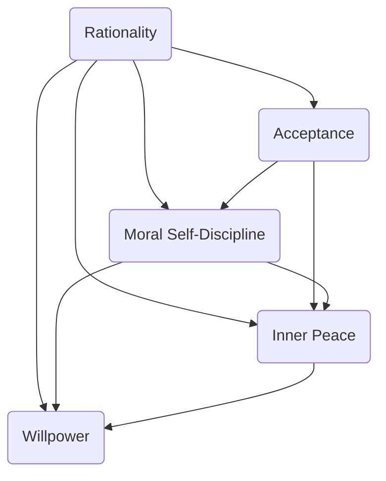
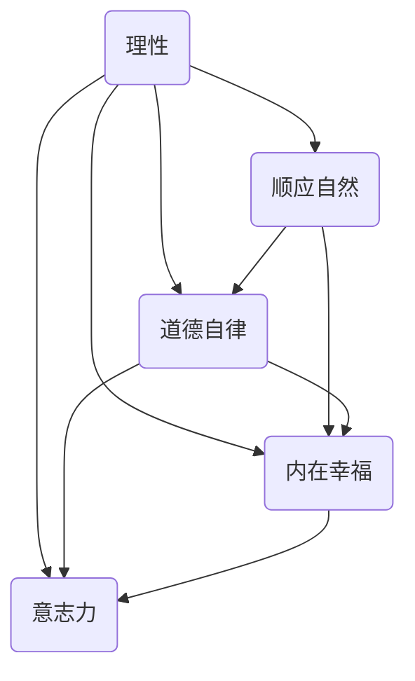

                 

### 文章标题

《新斯多葛学院在线平台：现代版古希腊哲学课程的学习网站》

关键词：新斯多葛学院、在线平台、古希腊哲学、学习资源、交互体验、个性化学习

摘要：本文将深入探讨新斯多葛学院在线平台的特点和功能，介绍其作为现代版古希腊哲学课程学习网站的优势。我们将从历史背景、平台设计理念、功能模块、核心概念联系、应用案例以及未来展望等多个角度进行全面剖析，旨在为读者提供一个全面了解和体验该在线平台的机会。通过本文的阅读，您将了解到新斯多葛学院在线平台如何通过创新的技术手段和丰富的学习资源，将古老的斯多葛哲学与现代生活紧密结合，为学习者带来全新的学习体验和实际价值。

### 引言

古希腊哲学是西方哲学的根基，其独特且深刻的思考方式对后世产生了深远的影响。在众多哲学流派中，斯多葛主义以其理性、自律和追求内心平静的理念，吸引了无数追求智慧与人生真谛的人。然而，在信息技术飞速发展的今天，如何将这一古老的哲学理念与现代教育技术相结合，为现代学习者提供一种全新的学习体验，成为了一个重要的课题。

新斯多葛学院在线平台正是这样一种创新尝试。它不仅汇集了丰富的古希腊哲学课程资源，还通过先进的技术手段，为学习者提供了互动性强、个性化高的学习体验。本文将围绕新斯多葛学院在线平台，从其历史背景、平台设计理念、主要功能模块、核心概念联系、应用案例以及未来展望等多个方面进行深入探讨，以期为读者提供一个全面了解和体验这一现代版古希腊哲学课程学习网站的视角。

首先，我们将回顾斯多葛主义的历史背景，探讨其起源、主要代表人物以及与其他哲学流派的关系。接着，分析现代斯多葛哲学的复兴原因、代表人物和实践价值。然后，详细介绍新斯多葛学院在线平台的设计理念、功能模块及其交互体验。在核心概念部分，我们将解析斯多葛哲学的核心概念、实体之间的关系架构，并探讨其与现代社会的联系。接着，通过具体应用案例，展示斯多葛哲学在企业管理、教育领域和个人生活中的实际应用。最后，总结新斯多葛学院在线平台的优势，并对现代斯多葛哲学的未来发展进行展望。通过本文的阅读，读者将能够更深入地理解新斯多葛学院在线平台的价值和意义。

### 1. 新斯多葛哲学概述

#### 1.1 斯多葛主义的历史背景

斯多葛主义（Stoicism）起源于古希腊，是一种强调理性、自律和道德规范的哲学流派。它的起源可以追溯到公元前3世纪，由塞浦路斯的芝诺（Zeno of Citium）创立。芝诺在雅典开办了一个名为“斯多葛学院”的哲学学校，标志着斯多葛主义正式诞生。

斯多葛主义的核心思想包括：

1. **理性至上**：斯多葛主义者认为，理性是人类智慧的体现，是人类行动和判断的指导原则。通过理性思考，人们可以超越感官世界的干扰，达到内心的平静与和谐。
2. **道德自律**：斯多葛主义强调道德自律，主张个体应该遵守自然法则，追求道德上的完美。他们认为，只有通过自律，个体才能实现内心的平静与自由。
3. **追求内心平静**：斯多葛主义者认为，幸福源自内心的平静与满足，而非外在的物质享受。他们主张通过理性思考、道德自律和内观冥想等方式，实现内心的平静与和谐。

斯多葛主义的主要代表人物包括：

1. **塞内卡（Seneca）**：他是罗马帝国的政治家、哲学家和文学家，是斯多葛主义的代表人物之一。他的著作《道德信札》对后世产生了深远的影响。
2. **爱比克泰德（Epictetus）**：他是罗马帝国的奴隶哲学家，他的著作《论人性》是斯多葛主义的重要文献之一。
3. **马可·奥勒留（Marcus Aurelius）**：他是罗马帝国的皇帝，同时也是一位斯多葛主义者。他的著作《沉思录》被视为斯多葛哲学的代表作。

#### 1.2 斯多葛主义与古希腊其他哲学流派的关系

斯多葛主义是古希腊哲学的重要流派之一，它与同时期其他哲学流派如柏拉图主义（Platonism）、亚里士多德主义（Aristotelianism）和伊壁鸠鲁主义（Epicureanism）既有联系又有区别。

1. **与柏拉图主义的关系**：斯多葛主义和柏拉图主义都强调理性、道德和理想国。但柏拉图主义更注重理念世界和理念本身，而斯多葛主义则更注重现实世界和个体的道德自律。
   
2. **与亚里士多德主义的关系**：斯多葛主义和亚里士多德主义都强调理性、道德和伦理，但亚里士多德主义更强调现实和经验，而斯多葛主义则更强调理性和道德的自律。

3. **与伊壁鸠鲁主义的关系**：斯多葛主义和伊壁鸠鲁主义都强调追求幸福和内心的平静，但伊壁鸠鲁主义更注重感官享受和快乐，而斯多葛主义则更注重道德自律和理性的指引。

#### 1.3 现代斯多葛哲学的复兴

在现代，斯多葛哲学经历了一次复兴，主要原因是人们开始意识到在面对现代社会复杂多变的环境时，斯多葛哲学所倡导的理性思考、自律和内心平静的重要性。

1. **现代斯多葛哲学的兴起原因**：

   - **压力与焦虑**：现代社会竞争激烈，人们面临各种压力和焦虑，斯多葛哲学提供了一种应对压力和焦虑的方法。
   - **个人成长**：斯多葛哲学强调个体的道德自律和内心的成长，与现代个人成长理念相契合。
   - **生活哲学**：人们开始重视内心的平和与幸福，斯多葛哲学提供了一种追求内心平静和生活满足的理念。

2. **现代斯多葛哲学的代表人物**：

   - **比尔·科里根（Bill Kleyman）**：他是IT行业的企业家和作家，将斯多葛哲学应用于个人生活和职业生涯。
   - **伊莱恩·加德纳（Elaine Gardner）**：她是心理学家和斯多葛哲学的推广者，通过心理学角度解释斯多葛哲学的实践价值。
   - **马修·柯林沃斯（Matthew Collingwood）**：他是哲学家和作家，专注于斯多葛哲学的研究和推广。

3. **现代斯多葛哲学的实践价值**：

   - **压力管理**：斯多葛哲学提供了一种理性面对压力和挑战的方法，通过自律和内心平静，帮助人们更好地应对压力。
   - **个人成长**：斯多葛哲学强调道德自律和内心的成长，有助于个体实现自我提升和自我实现。
   - **人际关系**：斯多葛哲学提供了一种理性看待人际关系和冲突的方法，帮助人们建立和谐的人际关系。

通过上述分析，我们可以看到，斯多葛哲学不仅具有深厚的历史渊源和丰富的哲学内涵，而且在现代社会中仍然具有重要的实践价值。新斯多葛学院在线平台正是基于这种哲学理念，通过先进的技术手段，为现代学习者提供了一种全新的学习体验和成长机会。

### 1.1 斯多葛主义的历史背景

#### 1.1.1 古希腊斯多葛哲学的起源

斯多葛主义，这一古希腊哲学的重要流派，起源于公元前3世纪的塞浦路斯。其创始人是芝诺（Zeno of Citium），他在雅典建立了著名的“斯多葛学院”（Stoic School）。芝诺在学院中教授哲学，吸引了一批志同道合的学者和学生，斯多葛主义逐渐形成并发展壮大。

芝诺的思想深受苏格拉底和亚里士多德的影响，他强调理性、道德和自律。芝诺认为，理性是人类智慧的源泉，通过理性思考，人们可以摆脱感官世界的纷扰，找到内心的平静与和谐。他还提出了“顺应自然”的理念，即个体应遵循自然法则，追求道德上的完美。

#### 1.1.2 斯多葛主义的主要代表人物

斯多葛主义在芝诺之后，经过了几代哲学家的传承和发扬，形成了多个重要的分支和代表人物。

1. **塞内卡（Seneca）**：他是罗马帝国的政治家、哲学家和文学家，被认为是斯多葛主义的重要代表人物之一。塞内卡的作品《道德信札》对后世影响深远，他强调道德自律、理性思考和内心的平静。

2. **爱比克泰德（Epictetus）**：他是罗马帝国的奴隶哲学家，其著作《论人性》是斯多葛主义的重要文献。爱比克泰德强调个体应通过理性思考克服痛苦，追求内心的自由和幸福。

3. **马可·奥勒留（Marcus Aurelius）**：他是罗马帝国的皇帝，同时也是一位杰出的斯多葛主义者。他的著作《沉思录》是斯多葛哲学的经典之作，反映了他对于理性、道德和自律的深刻思考。

#### 1.1.3 斯多葛主义与古希腊其他哲学流派的关系

斯多葛主义在古希腊哲学中占有独特地位，它不仅与同时期的其他哲学流派如柏拉图主义、亚里士多德主义和伊壁鸠鲁主义有紧密联系，也有明显的区别。

1. **与柏拉图主义的关系**：

   斯多葛主义和柏拉图主义都强调理性、道德和理想国，但二者的侧重点不同。柏拉图主义更注重理念世界和理念本身，认为真实世界是理念世界的映射；而斯多葛主义则更注重现实世界和个体的道德自律。

2. **与亚里士多德主义的关系**：

   斯多葛主义和亚里士多德主义都强调理性、道德和伦理，但亚里士多德主义更注重现实和经验，强调实证主义；而斯多葛主义则更注重理性和道德的自律，强调个体内心的平静与自由。

3. **与伊壁鸠鲁主义的关系**：

   斯多葛主义和伊壁鸠鲁主义都强调追求幸福和内心的平静，但二者的路径不同。伊壁鸠鲁主义更注重感官享受和快乐，主张通过感官满足来实现幸福；而斯多葛主义则更强调道德自律和理性的指引，认为真正的幸福源自内心的平静和满足。

通过上述分析，我们可以看到，斯多葛主义在古希腊哲学中具有独特的地位和深远的影响。它不仅与同时期的其他哲学流派有紧密的联系，也为后世的哲学发展提供了重要的思想资源。

### 1.2 现代斯多葛哲学的复兴

在现代社会，斯多葛哲学经历了一次显著的复兴，其原因多方面且深刻。首先，现代社会的高压和快节奏生活让人们感受到前所未有的压力和焦虑，而斯多葛哲学提供了一种理性和道德上的解决方案，帮助人们应对这些挑战。其次，现代个人成长和自我提升的理念与斯多葛哲学的道德自律和内心成长理念相契合，吸引了众多追求自我完善的个体。此外，社交媒体的普及和信息过载也使得人们更加关注内心的平静和满足，斯多葛哲学的理念恰好提供了这种精神上的慰藉。

1. **现代斯多葛哲学的兴起原因**：

   - **压力和焦虑的应对**：现代社会充满竞争和不确定性，人们面临的工作、家庭和社会压力不断增加。斯多葛哲学强调理性思考和道德自律，帮助个体在面对压力时保持冷静和坚定，从而有效减轻焦虑和压力。
   - **个人成长与自我提升**：斯多葛哲学提倡通过道德自律和理性思考实现个人的成长和提升。这与现代个人成长和自我提升的理念相契合，吸引了许多人将其作为生活哲学。
   - **信息过载和社交媒体的影响**：在信息爆炸的时代，人们往往被大量的信息和社交媒体动态所淹没，内心难以保持平静。斯多葛哲学提供了一种理性筛选信息和保持内心平静的方法，帮助人们从信息过载中解脱出来。
   - **对幸福和内心满足的追求**：现代社会对幸福和内心满足的追求日益增加，而斯多葛哲学认为真正的幸福源自内心的平静和满足，而非外在的物质享受。这种理念与现代人对幸福的新理解相呼应。

2. **现代斯多葛哲学的代表人物**：

   - **比尔·科里根（Bill Kleyman）**：他是IT行业的企业家和作家，将斯多葛哲学应用于个人生活和职业生涯。他的著作《斯多葛主义与现代工作》对现代斯多葛哲学的复兴产生了重要影响。
   - **伊莱恩·加德纳（Elaine Gardner）**：她是心理学家和斯多葛哲学的推广者，通过心理学角度解释斯多葛哲学的实践价值。她的著作《心理学与斯多葛哲学》深受读者喜爱。
   - **马修·柯林沃斯（Matthew Collingwood）**：他是哲学家和作家，专注于斯多葛哲学的研究和推广。他的著作《现代斯多葛哲学》详细阐述了斯多葛哲学在现代社会中的应用和意义。

3. **现代斯多葛哲学的实践价值**：

   - **压力管理**：斯多葛哲学提供了一种理性面对压力和挑战的方法，通过自律和内心平静，帮助人们更好地应对生活中的压力和挑战。
   - **个人成长**：斯多葛哲学强调道德自律和内心的成长，有助于个体实现自我提升和自我实现。
   - **人际关系**：斯多葛哲学提供了一种理性看待人际关系和冲突的方法，帮助人们建立和谐的人际关系，减少矛盾和冲突。
   - **幸福感**：斯多葛哲学认为，真正的幸福源自内心的平静和满足，而非外在的物质享受。通过追求内心的平和，人们可以更好地享受生活，提升幸福感。

通过上述分析，我们可以看到，现代斯多葛哲学的复兴不仅有其深刻的社会背景和理论基础，也具有广泛的实践价值。它为现代人在面对复杂多变的社会环境时提供了一种理性、道德和自律的解决方案，成为许多人追求幸福和内心平静的重要哲学资源。

### 2. 新斯多葛学院在线平台功能

#### 2.1 平台概述

新斯多葛学院在线平台是一个综合性的学习网站，旨在通过现代技术手段，将古希腊斯多葛哲学的核心思想与现代生活紧密结合，为学习者提供一个全面、互动和个性化的学习体验。平台的构建理念是“以学习者为中心”，注重提升用户的参与感和满意度，使其能够在轻松愉悦的环境中深入理解和应用斯多葛哲学。

#### 2.1.1 简化学习流程

新斯多葛学院在线平台通过简化的学习流程，使学习变得更加高效和便捷。用户注册后，首先进行一个简短的入门测验，以了解用户的基础知识和学习需求。然后，平台会根据测验结果，为用户推荐个性化的学习路径，确保学习内容与用户的需求相匹配。

#### 2.1.2 提供多样化的学习资源

新斯多葛学院在线平台提供了丰富的学习资源，包括视频课程、音频讲座、文章、互动问答、在线讨论区等。这些资源涵盖了斯多葛哲学的历史背景、基本概念、应用实践等多个方面，用户可以根据自己的兴趣和需求选择学习内容。

#### 2.1.3 促进学员之间的交流

为了增强学习者的互动体验，平台设有在线讨论区和实时问答功能。用户可以在讨论区分享学习心得、探讨哲学问题，还可以通过实时问答与专家进行互动，解决学习中遇到的疑难问题。此外，平台还组织了学习小组和线上研讨会，鼓励学员之间的交流和合作，共同探讨和深化对斯多葛哲学的理解。

#### 2.2 主要功能模块

新斯多葛学院在线平台的主要功能模块包括课程体系、互动与交流和个人成长工具等，下面将分别进行介绍。

##### 2.2.1 课程体系

新斯多葛学院在线平台的课程体系分为三个层次，以满足不同用户的学习需求。

1. **哲学基础课程**：这是入门级课程，主要介绍斯多葛哲学的基本概念和历史背景，适合初次接触斯多葛哲学的学习者。

2. **斯多葛主义应用课程**：这一层次的课程深入探讨斯多葛哲学在实际生活中的应用，包括压力管理、个人成长、人际关系等方面，适合有一定哲学基础的用户。

3. **高级研究课程**：这是专为哲学爱好者和专业人士设计的课程，涵盖斯多葛哲学的理论研究、哲学思想的历史演变等内容，适合对斯多葛哲学有较高兴趣和深入研究的用户。

##### 2.2.2 互动与交流

为了增强学习体验，平台提供了多种互动和交流功能。

1. **在线讨论区**：用户可以在讨论区分享学习心得、提问和解答问题，与其他用户进行互动和交流。

2. **实时问答**：用户可以随时向专家提问，获取专业的解答和建议。

3. **学习小组**：平台组织了多个学习小组，用户可以加入小组，与志同道合的伙伴一起学习、讨论和分享。

4. **线上研讨会**：定期举办的线上研讨会邀请哲学专家和学者进行主题讲座和讨论，用户可以在线参与，拓展知识视野。

##### 2.2.3 个人成长工具

新斯多葛学院在线平台还提供了一系列个人成长工具，帮助用户在哲学学习的同时，实现自我提升和成长。

1. **个人成长计划**：用户可以根据自己的目标和需求，制定个人成长计划，平台会提供相应的指导和支持。

2. **心理测评工具**：平台提供了多种心理测评工具，帮助用户了解自己的心理状态和需求，提供个性化的建议和指导。

3. **成长报告生成**：用户可以定期生成个人成长报告，总结自己的学习成果和进步，为自己的成长路径提供参考。

通过上述功能模块，新斯多葛学院在线平台不仅为用户提供了丰富的学习资源，还通过互动和交流功能，增强了学习的趣味性和参与感，帮助用户在深度学习斯多葛哲学的同时，实现个人成长和提升。

#### 2.2.1 平台设计理念

新斯多葛学院在线平台的设计理念是“以人为本”，旨在为学习者提供一种高效、便捷且富有个性化的学习体验。以下是平台设计理念的几个关键点：

1. **用户导向**：平台的设计和功能模块均以用户需求为中心，通过简化的学习流程和个性化的学习路径推荐，确保每位用户都能找到适合自己的学习内容和节奏。

2. **互动性**：平台注重增强学习者的互动体验，通过在线讨论区、实时问答和学习小组等功能，促进学员之间的交流和协作，使学习过程更加生动和有趣。

3. **个性化**：平台通过心理测评工具和个人成长计划，为用户提供个性化的指导和支持，帮助用户在哲学学习的同时，实现个人成长和提升。

4. **实用导向**：平台不仅提供理论课程，还设有应用课程，帮助用户将斯多葛哲学的理念应用于实际生活中的各种情境，提高实践能力。

5. **社区建设**：平台鼓励学员之间的互动和合作，通过线上研讨会和活动，打造一个积极向上的学习社区，为用户提供一个交流和分享的平台。

#### 2.2.2 平台的主要功能模块

新斯多葛学院在线平台的主要功能模块包括课程体系、互动与交流和个人成长工具，下面将详细描述每个模块及其功能。

##### 2.2.2.1 课程体系

新斯多葛学院在线平台的课程体系设计科学合理，旨在满足不同层次学习者的需求。

1. **哲学基础课程**：这是专为初次接触斯多葛哲学的学习者设计的入门级课程，内容包括斯多葛哲学的基本概念、历史背景和主要思想。课程通过视频和文章的形式，使学习者能够快速了解斯多葛哲学的基础知识。

2. **斯多葛主义应用课程**：这一层次的课程深入探讨斯多葛哲学在实际生活中的应用，包括压力管理、个人成长、人际关系等方面。课程通过案例分析、实践指导等方式，帮助学习者将哲学理念应用于实际情境。

3. **高级研究课程**：这是为有志于深入研究斯多葛哲学的学者和专业人士设计的课程，内容涵盖斯多葛哲学的理论研究、哲学思想的历史演变和哲学文本分析等。课程通过专业讲座和学术论文，提升学习者的理论水平和研究能力。

##### 2.2.2.2 互动与交流

平台通过多种互动与交流功能，增强学习者的参与感和社区体验。

1. **在线讨论区**：用户可以在讨论区发布话题，分享学习心得和问题，与其他用户进行讨论和交流。讨论区分为多个板块，涵盖哲学基础、应用研究和日常生活等多个主题。

2. **实时问答**：用户可以通过实时问答功能，向专家或教师提问，获取专业的解答和建议。实时问答功能支持文字、语音和视频等多种沟通方式，方便用户根据自己的需求选择合适的沟通方式。

3. **学习小组**：平台组织了多个学习小组，用户可以根据自己的兴趣和需求选择加入。学习小组定期开展线上会议和讨论，用户可以与小组成员共同学习、分享经验和探讨问题。

4. **线上研讨会**：定期举办的线上研讨会邀请哲学专家和学者进行主题讲座和讨论，用户可以在线参与，拓展知识视野和交流心得。研讨会结束后，平台会提供讲座录音和讲义，方便用户复习和回顾。

##### 2.2.2.3 个人成长工具

新斯多葛学院在线平台提供了一系列个人成长工具，帮助用户在哲学学习的同时，实现个人成长和提升。

1. **个人成长计划**：用户可以根据自己的目标和需求，制定个人成长计划。平台提供详细的指导和支持，帮助用户设定学习目标、制定学习计划和时间管理策略。

2. **心理测评工具**：平台提供了多种心理测评工具，如压力自评量表、性格测试等，帮助用户了解自己的心理状态和需求。用户可以根据测评结果，获取个性化的建议和指导，优化自己的学习和生活。

3. **成长报告生成**：用户可以定期生成个人成长报告，总结自己的学习成果和进步。报告包括学习时间、完成课程、参与讨论、心理测评结果等内容，用户可以通过报告了解自己的成长轨迹和提升空间。

通过这些功能模块，新斯多葛学院在线平台不仅为用户提供了丰富的学习资源，还通过互动和交流功能，增强了学习的趣味性和参与感，帮助用户在深度学习斯多葛哲学的同时，实现个人成长和提升。

### 2.2.2 主要功能模块

新斯多葛学院在线平台的主要功能模块包括课程体系、互动与交流以及个人成长工具，每个模块都具有独特的功能和服务，以满足学习者的多样化需求。

##### 2.2.2.1 课程体系

课程体系是新斯多葛学院在线平台的核心模块之一，它根据学习者的不同水平和需求，设计了一系列层次分明的课程。

1. **哲学基础课程**：这部分课程适合初次接触斯多葛哲学的学习者，通过视频、音频和文字等多种形式，系统地介绍斯多葛哲学的基本概念、历史背景和主要思想。课程内容包括：

   - 斯多葛哲学的历史起源与发展
   - 斯多葛哲学的核心原理和哲学理念
   - 斯多葛主义与古希腊其他哲学流派的异同

2. **斯多葛主义应用课程**：这部分课程侧重于将斯多葛哲学的理念应用于实际生活，帮助学习者应对日常生活中的各种挑战。课程内容包括：

   - 压力管理：通过斯多葛哲学的方法，学会理性面对压力和困难
   - 个人成长：培养自律、理性思考和自我反省的习惯，实现个人成长
   - 人际关系：理性看待人际关系，学会有效沟通和处理冲突

3. **高级研究课程**：这部分课程针对有志于深入研究斯多葛哲学的学者和专业人士，深入探讨斯多葛哲学的理论研究、哲学思想的历史演变和哲学文本分析。课程内容包括：

   - 斯多葛哲学的哲学原理与逻辑结构
   - 斯多葛哲学的历史演变及其对后世的影响
   - 斯多葛哲学的文献研究和文本分析

##### 2.2.2.2 互动与交流

互动与交流模块旨在增强学习者的参与感和学习体验，通过多种互动方式，促进学员之间的交流和协作。

1. **在线讨论区**：讨论区分为多个主题板块，如哲学基础、应用研究和日常生活等，学习者可以自由发布话题，分享学习心得和问题。讨论区支持评论、点赞和关注功能，用户可以与他人进行互动和交流。

2. **实时问答**：实时问答功能使学习者能够即时向专家或教师提问，获取专业的解答和建议。用户可以选择文字、语音或视频等多种沟通方式，根据个人需求选择合适的提问方式。

3. **学习小组**：平台组织了多个学习小组，用户可以根据自己的兴趣和需求选择加入。学习小组定期开展线上会议和讨论，成员可以共同学习、分享经验和探讨问题。

4. **线上研讨会**：平台定期邀请哲学专家和学者进行主题讲座和讨论，用户可以在线参与，拓展知识视野和交流心得。研讨会结束后，平台会提供讲座录音和讲义，方便用户复习和回顾。

##### 2.2.2.3 个人成长工具

个人成长工具模块旨在帮助学习者实现自我提升和成长，通过多种工具和功能，提供个性化的指导和支持。

1. **个人成长计划**：用户可以根据自己的目标和需求，制定个人成长计划。平台提供详细的指导和支持，包括设定学习目标、制定学习计划和时间管理策略等。

2. **心理测评工具**：平台提供了多种心理测评工具，如压力自评量表、性格测试等，帮助用户了解自己的心理状态和需求。用户可以根据测评结果，获取个性化的建议和指导，优化自己的学习和生活。

3. **成长报告生成**：用户可以定期生成个人成长报告，总结自己的学习成果和进步。报告包括学习时间、完成课程、参与讨论、心理测评结果等内容，用户可以通过报告了解自己的成长轨迹和提升空间。

通过这些功能模块，新斯多葛学院在线平台不仅为用户提供了丰富的学习资源，还通过互动和交流功能，增强了学习的趣味性和参与感，帮助用户在深度学习斯多葛哲学的同时，实现个人成长和提升。

### 2.2.3 个人成长工具

新斯多葛学院在线平台不仅仅关注学习者对哲学知识的掌握，更注重帮助用户实现个人成长和自我提升。为此，平台提供了一系列个人成长工具，旨在通过科学的方法和实用的工具，指导用户在学习和实践中不断进步。

##### 2.2.3.1 个人成长计划

个人成长计划是平台为用户提供的第一个工具，它帮助用户设定明确的学习目标和计划。以下步骤展示了如何使用个人成长计划：

1. **设定目标**：用户首先需要明确自己的学习目标，这些目标可以是短期（如一个月内完成特定课程）或长期（如一年内掌握斯多葛哲学的核心思想）。

2. **制定计划**：平台提供模板和指导，帮助用户制定详细的学习计划，包括学习内容、时间安排和任务分配。用户可以根据自己的实际情况，灵活调整计划。

3. **跟踪进度**：用户可以实时查看自己的学习进度，了解哪些目标已经实现，哪些目标还需要努力。平台会自动记录用户的学习时间、完成情况和成绩，帮助用户更好地管理学习进度。

##### 2.2.3.2 心理测评工具

心理测评工具是新斯多葛学院在线平台为用户提供的第二个重要工具，它帮助用户了解自己的心理状态和需求。以下步骤展示了如何使用心理测评工具：

1. **选择测评**：平台提供了多种心理测评，包括压力自评量表、性格测试、情绪状态评估等。用户可以根据自己的需求选择相应的测评。

2. **完成测评**：用户需要完成所选测评的所有问题，测评系统会根据用户的回答生成报告。

3. **分析报告**：测评报告会详细分析用户的心理状态和需求，提供个性化的建议和指导。例如，如果用户在压力管理方面得分较低，平台会推荐相关的课程和练习，帮助用户提升压力应对能力。

##### 2.2.3.3 成长报告生成

成长报告生成工具是平台为用户提供的第三个重要工具，它帮助用户总结和反思自己的学习成果和进步。以下步骤展示了如何生成成长报告：

1. **收集数据**：平台会自动记录用户的学习时间、完成课程数量、参与讨论次数和心理测评结果等数据。

2. **生成报告**：用户可以随时生成个人成长报告，报告内容会包括学习进度、参与情况、测评结果和自我反思等。

3. **反馈与改进**：成长报告不仅总结了用户的学习成果，还提供了改进建议。用户可以根据报告中的反馈，调整自己的学习方法和计划，进一步提升个人成长。

通过这些个人成长工具，新斯多葛学院在线平台为用户提供了全方位的支持，帮助用户在哲学学习过程中不断反思和进步。这些工具不仅提高了学习的效率，也促进了用户自我认知和自我提升，实现了真正的个人成长。

### 3. 核心概念与联系

斯多葛哲学的核心概念是其哲学体系的基础，这些概念相互关联，构成了斯多葛主义的独特思想体系。以下是斯多葛哲学中的核心概念以及它们之间的关系架构。

#### 3.1 斯多葛哲学的核心概念

1. **理性（Reason）**：斯多葛主义认为理性是人类的本质，是决定人类行为和判断的唯一标准。理性不仅指导个体在面对外界干扰时保持冷静和理性，也帮助个体理解和顺应自然法则。

2. **顺应自然（Acceptance）**：顺应自然意味着个体应该接受并遵循自然法则，而不是与自然抗争。斯多葛主义者认为，只有顺应自然，个体才能实现内心的平静和和谐。

3. **道德自律（Moral Self-Discipline）**：斯多葛主义强调个体应该通过自律来追求道德上的完美。道德自律不仅是个人修养的表现，也是实现内心平静和幸福的关键。

4. **内在幸福（Inner Peace）**：斯多葛主义者认为，真正的幸福源自内心的平静和满足，而不是外在的物质享受。通过理性思考和道德自律，个体可以实现内在的平和与幸福。

5. **意志力（Willpower）**：斯多葛主义强调个体应具备强大的意志力，以克服外界的干扰和内心的欲望，实现内心的自由和自律。

#### 3.2 概念实体之间的关系架构

为了更清晰地展示斯多葛哲学的核心概念及其相互关系，我们可以使用Mermaid流程图来表示这些概念之间的逻辑关系。

在上述流程图中：

- **理性（Reason）** 是核心，它既是其他概念的基础，也是实现这些概念的手段。
- **顺应自然（Acceptance）** 是理性的一部分，它帮助个体理解和接受自然法则，从而实现内心的平静。
- **道德自律（Moral Self-Discipline）** 是个体通过理性自我约束和修养的过程，是实现内在幸福和意志力的基础。
- **内在幸福（Inner Peace）** 是斯多葛主义者追求的目标，通过理性思考和道德自律，个体可以实现内心的平和与满足。
- **意志力（Willpower）** 是个体在实现道德自律和内在幸福过程中所表现出的坚定和决心，它帮助个体克服外界干扰和内心欲望，实现真正的自由。

通过这个关系架构，我们可以更清晰地理解斯多葛哲学的核心概念及其相互关系，从而更好地应用这些理念来指导个人的生活和实践。

### 3.1 斯多葛哲学的核心概念

斯多葛哲学的核心概念是理解其哲学体系的基础，这些概念不仅构成了斯多葛主义的思维框架，也指导了个体如何在复杂多变的世界中找到内心的平静和和谐。以下是斯多葛哲学中的几个核心概念及其详细解释。

1. **理性（Reason）**：理性在斯多葛哲学中占据核心地位，被视为人类智慧的源泉和行动的指导原则。斯多葛主义者认为，理性是人类与其他生物区别开来的本质特征，它不仅帮助个体理解自然法则，也指导个体在现实生活中做出明智的选择。理性使个体能够超越感官的干扰，洞察事物的本质，从而在面对挑战和困难时保持冷静和理智。

2. **顺应自然（Acceptance）**：顺应自然是斯多葛哲学的基本原则之一，它要求个体接受和遵循自然法则。斯多葛主义者认为，自然有其固有的秩序和规律，个体应该顺应这些规律，而不是盲目地去追求个人的欲望和目标。顺应自然不仅有助于个体在心理上保持平静，还能帮助个体更好地理解世界和人生。

3. **道德自律（Moral Self-Discipline）**：道德自律是斯多葛主义强调的重要概念，它要求个体通过自我约束和修养来追求道德上的完美。斯多葛主义者认为，个体应该自觉地遵守道德规范，不受外界诱惑和干扰，保持内心的纯净和坚定。道德自律不仅有助于个体实现个人的道德提升，也是实现内在幸福和心灵和谐的关键。

4. **内在幸福（Inner Peace）**：斯多葛主义认为，真正的幸福源自内心的平静和满足，而不是外在的物质享受。内在幸福是斯多葛主义者追求的最高目标，它要求个体通过理性思考和道德自律来培养内心的平和。内在幸福不仅使个体能够在面对挫折和困难时保持冷静，还能帮助个体在日常生活中享受生活的真谛。

5. **意志力（Willpower）**：意志力是斯多葛主义者实现道德自律和内在幸福的重要工具。它要求个体具备强大的决心和毅力，能够克服外界的干扰和内心的欲望，坚定地追求道德上的完美。意志力使个体能够在复杂多变的环境中保持自律和理性，是实现内心自由和幸福的关键。

这些核心概念相互关联，构成了斯多葛哲学的思想体系。理性是所有概念的指导原则，顺应自然帮助个体理解并接受现实，道德自律和意志力是实现内心平静和幸福的具体手段。通过理解这些核心概念，个体可以在现实生活中应用斯多葛哲学的理念，实现内心的平静和和谐。

### 3.2 概念实体之间的关系架构

为了更清晰地展示斯多葛哲学中的核心概念及其相互关系，我们可以使用Mermaid流程图来描述这些概念之间的逻辑关系。以下是斯多葛哲学核心概念的Mermaid流程图：

在这个流程图中：

- **理性（Reason）** 位于中心，它是所有其他概念的基础和指导原则。理性帮助个体理解自然法则，指导个体的行为和思考。
- **顺应自然（Acceptance）** 是理性的一部分，它帮助个体接受和遵循自然法则，从而在心理上保持平静。
- **道德自律（Moral Self-Discipline）** 是个体通过理性思考和自我约束来追求道德上的完美，是实现内在幸福和意志力的基础。
- **内在幸福（Inner Peace）** 是斯多葛主义追求的最高目标，通过道德自律和理性思考，个体可以实现内心的平和与满足。
- **意志力（Willpower）** 是个体在实现道德自律和内在幸福过程中所表现出的坚定和决心，它帮助个体克服外界的干扰和内心的欲望。

这些核心概念相互关联，共同构成了斯多葛哲学的思想体系。通过这种关系架构，我们可以更清晰地理解斯多葛哲学的内在逻辑，以及如何在实际生活中应用这些理念。

### 3.3 斯多葛哲学与现代社会的联系

斯多葛哲学作为一种古老的思想体系，其在现代社会中的应用和影响力不可忽视。斯多葛主义强调理性、道德自律和内心平静，这些理念在现代社会中具有广泛的适用性，能够帮助人们应对现代生活中的各种挑战和困扰。

#### 3.3.1 斯多葛主义在现代社会中的应用

1. **压力管理**：现代社会竞争激烈，人们面临的工作和生活压力不断增加。斯多葛哲学提供了一种理性面对压力的方法，帮助个体在高压环境下保持冷静和理智。通过自律和理性思考，个体可以更好地应对压力，减少焦虑和紧张。

2. **个人成长**：斯多葛哲学强调通过道德自律和理性思考实现个人的成长和提升。在现代社会，人们越来越重视个人成长和自我实现，斯多葛哲学提供的理念和方法，如自我反省、自我约束和不断学习，有助于个体实现自我提升。

3. **人际关系**：斯多葛哲学提供了一种理性看待人际关系和冲突的方法，帮助个体建立和谐的人际关系。通过理性思考和道德自律，个体可以减少矛盾和冲突，提高沟通能力和人际关系质量。

4. **职业发展**：斯多葛哲学的理念在职业发展中也有广泛应用。通过理性思考和道德自律，个体可以更好地规划职业道路，应对工作中的挑战和变化，实现职业上的成功和满足。

#### 3.3.2 斯多葛哲学与现代心理学的关系

斯多葛哲学与现代心理学之间存在密切的联系，许多心理学理论和实践都受到斯多葛哲学的影响。

1. **积极心理学**：积极心理学研究人类如何实现幸福和满足感，其许多理论和实践方法与斯多葛哲学相契合。斯多葛哲学强调内在幸福和理性思考，这与积极心理学的目标一致，即帮助个体实现内心的平静和满足。

2. **认知行为疗法**：认知行为疗法（CBT）是现代心理学中的一种重要治疗方法，其核心思想是改变个体的思维和行为模式，以应对心理问题。斯多葛哲学中的理性思考和道德自律理念，与认知行为疗法的基本原则相契合，可以用来指导个体应对焦虑、抑郁等心理问题。

3. **自我效能感**：自我效能感是个体对自己完成特定任务的信心和能力感知。斯多葛哲学强调通过道德自律和理性思考实现自我提升，这有助于增强个体的自我效能感，从而更好地应对生活中的各种挑战。

通过上述分析，我们可以看到，斯多葛哲学在现代社会中具有广泛的适用性和影响力。它不仅提供了应对现代生活挑战的有效方法，也为现代心理学的发展提供了重要的思想资源。新斯多葛学院在线平台正是基于这种哲学理念，通过现代技术手段，为现代学习者提供了一种全新的学习体验和成长机会。

### 4. 斯多葛哲学的应用案例

斯多葛哲学不仅在理论层面上具有深刻的内涵，而且在实际应用中也展现出强大的实用价值。以下是斯多葛哲学在企业管理、教育领域和个人生活中的应用案例，通过这些案例，我们可以更直观地理解斯多葛哲学的具体应用和效果。

#### 4.1 斯多葛哲学在企业管理中的应用

1. **企业文化塑造**：许多企业通过引入斯多葛哲学的理念，塑造了一种以理性、自律和道德为核心的企业文化。例如，谷歌公司在其企业文化中融入了斯多葛哲学的部分理念，强调员工应保持内心的平静和理性，专注于工作目标和价值观，从而提高工作效率和企业凝聚力。

2. **领导力提升**：斯多葛哲学提供了有效的领导力培养方法。通过理性思考和道德自律，领导者可以更好地应对工作挑战，做出明智的决策，并带领团队实现共同的目标。例如，美国前总统奥巴马在其领导下，推崇斯多葛哲学，强调理性决策和自律，这在他的政治生涯中取得了显著的成效。

3. **员工心理健康**：斯多葛哲学强调通过理性思考和道德自律实现内心的平静和满足，这对于员工的心理健康具有积极影响。企业可以通过组织相关的培训课程，帮助员工学会应对工作压力和焦虑，提高心理韧性，从而提升整体工作效率和幸福感。

#### 4.2 斯多葛哲学在教育领域中的应用

1. **教育理念**：斯多葛哲学在教育领域中的应用主要体现在其强调的理性、自律和道德教育。教育者可以通过引入斯多葛哲学的理念，培养学生的学习兴趣和自律能力，提高他们的学习效率和综合素质。例如，在一些学校，教育者会引导学生通过理性思考和自我反省来提升学习效果。

2. **教学方法**：斯多葛哲学提供了一种以理性思考和道德自律为核心的教学方法。教育者可以通过设计问题导向的教学活动，引导学生进行批判性思考和讨论，培养他们的逻辑思维和道德判断能力。此外，教育者还可以通过角色扮演和情境模拟，让学生在实际情境中应用斯多葛哲学的理念，提高他们的实践能力。

3. **学生心理健康**：斯多葛哲学强调内心的平静和满足，这对学生的心理健康具有积极影响。通过教育者引导学生进行理性思考和道德自律，可以帮助他们更好地应对学习压力和情绪困扰，提高心理韧性，培养积极向上的心态。

#### 4.3 斯多葛哲学在个人生活中的应用

1. **人生观与价值观**：斯多葛哲学提供了理性的人生观和价值观，帮助个体在面对人生挑战时保持冷静和理智。通过理性思考和道德自律，个体可以更好地理解自己的内心需求，明确自己的人生目标和价值观，从而实现内心的平静和满足。

2. **压力管理**：现代社会中，压力无处不在，斯多葛哲学提供了一种有效的压力管理方法。通过理性思考和道德自律，个体可以更好地应对压力，减少焦虑和紧张，提高生活质量。例如，通过冥想、自我反省和理性思考，个体可以找到内心的平静，从而更好地应对日常生活中的各种挑战。

3. **人际关系处理**：斯多葛哲学提供了一种理性看待人际关系和冲突的方法，帮助个体建立和谐的人际关系。通过理性思考和道德自律，个体可以更好地理解他人的需求，减少矛盾和冲突，提高人际沟通能力，从而建立更加健康和谐的人际关系。

通过这些应用案例，我们可以看到，斯多葛哲学在企业管理、教育领域和个人生活中具有广泛的实用价值。它不仅提供了一种理性、道德和自律的解决方案，也为个体在面对现代社会复杂多变的环境时提供了一种有效的应对策略。新斯多葛学院在线平台通过将这些应用案例融入课程体系，为学习者提供了一种全新的学习体验和成长机会，帮助他们更好地理解和应用斯多葛哲学的理念。

### 4.1 斯多葛哲学在企业管理中的应用

斯多葛哲学在企业管理中有着广泛的应用，能够帮助企业在复杂多变的市场环境中保持理性、稳健和道德自律。以下是斯多葛哲学在企业文化塑造、领导力提升和员工心理健康等方面的具体应用案例。

#### 4.1.1 企业文化塑造

许多企业通过引入斯多葛哲学的理念，塑造了一种以理性、自律和道德为核心的企业文化。这种企业文化不仅有助于提升企业的内部凝聚力，还能增强企业在市场中的竞争力。

1. **谷歌公司**：谷歌公司以其独特的公司文化而闻名，其中融入了斯多葛哲学的部分理念。谷歌强调员工的个人成长和内心的平静，鼓励员工通过理性思考和道德自律来实现工作目标。谷歌的“Don't be evil”（不作恶）准则，也是斯多葛哲学中道德自律的体现。

2. **微软公司**：微软公司在其企业文化中也借鉴了斯多葛哲学的理念。公司鼓励员工在面对压力和挑战时，保持冷静和理智，专注于工作目标和价值观。这种企业文化帮助微软在激烈的市场竞争中保持了稳定的业务增长。

#### 4.1.2 领导力提升

斯多葛哲学提供了有效的领导力培养方法，通过理性思考和道德自律，领导者可以更好地应对工作挑战，做出明智的决策，并带领团队实现共同的目标。

1. **奥巴马政府**：美国总统奥巴马在其领导下，推崇斯多葛哲学，强调理性决策和自律。他在处理国内外事务时，表现出强烈的道德自律和理性思考能力，这使得他在公众和政界中赢得了广泛的尊重。

2. **IBM公司**：IBM公司通过引入斯多葛哲学的理念，提升了其领导力水平。公司鼓励领导者通过理性思考和道德自律，克服工作压力和困难，实现企业的长期目标。

#### 4.1.3 员工心理健康

斯多葛哲学强调通过理性思考和道德自律实现内心的平静和满足，这对员工的心理健康具有积极影响。企业可以通过组织相关的培训课程，帮助员工学会应对工作压力和焦虑，提高心理韧性，从而提升整体工作效率和幸福感。

1. **IBM公司**：IBM公司在其员工心理健康项目中，引入了斯多葛哲学的理念。公司提供了一系列心理健康培训课程，如冥想、自我反省和理性思考等，帮助员工在面对压力时保持冷静和理智。

2. **谷歌公司**：谷歌公司也通过多种方式关注员工的心理健康。公司提供免费的心理咨询服务，帮助员工应对工作压力和情绪困扰。此外，谷歌还鼓励员工通过锻炼、冥想和社交活动来保持身心健康。

通过上述应用案例，我们可以看到，斯多葛哲学在企业管理中具有广泛的实用价值。它不仅有助于塑造企业的理性、自律和道德文化，还能提升领导力，增强员工的心理健康。新斯多葛学院在线平台通过将这些应用案例融入课程体系，为企业管理者和员工提供了一种全新的学习体验和成长机会，帮助他们更好地理解和应用斯多葛哲学的理念。

### 4.2 斯多葛哲学在教育领域中的应用

斯多葛哲学在教育领域中有着独特的应用价值，能够帮助学生和教师更好地应对学习和教学中的挑战，提高学习效率和心理韧性。以下是斯多葛哲学在教育理念、教学方法和学生心理健康方面的具体应用。

#### 4.2.1 教育理念

斯多葛哲学的教育理念强调理性、自律和道德教育，这为学生提供了一个全面发展的学习框架。

1. **理性思维**：斯多葛哲学鼓励学生在学习中运用理性思考，而不是仅仅依赖记忆和重复。教育者可以通过问题导向的教学方法，引导学生进行批判性思考和讨论，培养他们的逻辑思维和推理能力。

2. **自律培养**：斯多葛哲学强调自律，通过自我约束和修养，学生可以更好地管理自己的时间和行为，提高学习效率。教育者可以通过设定明确的学习目标和纪律要求，帮助学生建立自律习惯。

3. **道德教育**：斯多葛哲学强调道德教育，通过培养学生的道德判断能力和责任感，教育者可以培养具有良好道德品质的下一代。学校可以通过道德课程、榜样示范和实践活动，强化学生的道德教育。

#### 4.2.2 教学方法

斯多葛哲学提供了一些独特的教学方法，有助于提高教学效果和学生参与度。

1. **问题导向学习**：教师可以设计问题导向的教学活动，引导学生主动探索和思考。这种方法不仅能够激发学生的学习兴趣，还能提高他们的批判性思维能力。

2. **情境模拟**：通过角色扮演和情境模拟，学生可以在模拟的情境中应用斯多葛哲学的理念，提高他们的实践能力和解决问题的能力。

3. **讨论与反馈**：鼓励学生在课堂上进行讨论，分享自己的观点和经验。教师可以通过积极的反馈和指导，帮助学生深化对斯多葛哲学的理解和应用。

#### 4.2.3 学生心理健康

斯多葛哲学强调内心的平静和满足，这对学生的心理健康具有积极影响。通过理性思考和道德自律，学生可以更好地应对学习和生活中的压力和挑战。

1. **压力管理**：学生可以通过冥想、自我反省和理性思考等方法，学会应对学习和生活中的压力。教育者可以通过提供心理健康课程和咨询服务，帮助学生掌握有效的压力管理技巧。

2. **情绪调节**：斯多葛哲学提供了一种理性看待情绪的方法，学生可以通过理性思考和道德自律，更好地调节情绪，减少焦虑和抑郁。

3. **心理韧性**：通过培养学生的自律和理性思考能力，教育者可以帮助学生建立心理韧性，更好地应对生活中的挫折和困难。

通过上述分析，我们可以看到，斯多葛哲学在教育领域中的应用具有显著的优势。它不仅能够提高学生的学习效率和心理韧性，还能培养他们的道德品质和批判性思维能力。新斯多葛学院在线平台通过将这些应用案例融入课程体系，为教育工作者和学生提供了一个全新的学习和成长平台。

### 4.3 斯多葛哲学在个人生活中的应用

斯多葛哲学在个人生活中具有广泛的适用性，通过理性思考和道德自律，个体可以更好地应对日常生活中的各种挑战和困扰，实现内心的平静和满足。以下是斯多葛哲学在人生观与价值观、压力管理和人际关系处理等方面的具体应用。

#### 4.3.1 人生观与价值观

斯多葛哲学提供了一种理性、自律和道德导向的人生观与价值观，帮助个体在复杂多变的世界中找到方向和意义。

1. **理性思考**：斯多葛哲学鼓励个体在面对人生挑战时保持冷静和理智，通过理性思考来分析和解决问题。这种理性思考不仅有助于个体做出明智的决策，还能减少情绪波动，保持内心的平静。

2. **道德自律**：斯多葛哲学强调通过道德自律来实现个人成长和提升。个体应遵循道德规范，自觉约束自己的行为和欲望，追求道德上的完美。这种自律不仅有助于提升个人的道德品质，还能增强内心的稳定性和坚定性。

3. **价值观的明确**：斯多葛哲学帮助个体明确自己的人生目标和价值观，从而在纷繁复杂的世界中保持清晰和坚定。个体可以通过理性思考和自我反省，识别和坚持自己最重要的价值观，从而在人生道路上不迷失方向。

#### 4.3.2 压力管理

现代社会中，压力无处不在，而斯多葛哲学提供了一种有效的压力管理方法，帮助个体在面对压力时保持冷静和理智。

1. **理性面对压力**：斯多葛哲学强调通过理性思考来面对压力，个体应认识到压力是生活的一部分，不必过于恐惧和逃避。通过理性分析和判断，个体可以找到应对压力的最佳策略，从而更好地处理和解决压力源。

2. **自律与调整**：斯多葛哲学鼓励个体通过自律来调整自己的心态和行为，减少不必要的焦虑和紧张。个体可以通过设定合理的目标和计划，合理安排时间，从而减少工作压力和生活压力。

3. **心理韧性**：通过培养内心的平和和满足，斯多葛哲学帮助个体建立心理韧性，从而更好地应对生活中的各种挑战。个体可以通过冥想、自我反省和理性思考等方法，增强自己的心理韧性，减少情绪波动。

#### 4.3.3 人际关系处理

在人际关系中，斯多葛哲学提供了一种理性看待人际关系和冲突的方法，帮助个体建立和谐的人际关系。

1. **理性沟通**：斯多葛哲学强调通过理性沟通来解决冲突和矛盾。个体应保持冷静和理智，避免情绪化的争吵和对抗，通过理性分析和对话，找到解决问题的最佳途径。

2. **自我反省**：斯多葛哲学鼓励个体在人际关系中自我反省，识别自己的行为和态度中的问题，并积极调整。通过自我反省，个体可以减少不必要的冲突和误解，建立更加和谐的人际关系。

3. **道德自律**：斯多葛哲学强调通过道德自律来处理人际关系。个体应遵循道德规范，尊重他人的感受和需求，通过自律和责任感来建立和谐的人际关系。

通过上述分析，我们可以看到，斯多葛哲学在个人生活中的应用具有显著的实用价值。它不仅提供了一种理性、自律和道德导向的生活哲学，还能帮助个体在复杂多变的环境中保持内心的平静和满足，建立和谐的人际关系。新斯多葛学院在线平台通过将这些应用案例融入课程体系，为学习者提供了一个全新的学习和成长平台，帮助他们在日常生活中更好地应用斯多葛哲学的理念。

### 5. 总结

新斯多葛学院在线平台作为现代版古希腊哲学课程的学习网站，凭借其创新的技术手段和丰富的学习资源，为学习者提供了一个全面、互动和个性化的学习体验。本文从多个角度对平台进行了详细剖析，总结了其优势、用户反馈以及未来的发展方向。

#### 5.1 新斯多葛学院在线平台的优势

1. **互动性强**：平台通过在线讨论区、实时问答和学习小组等功能，增强了用户之间的互动和交流，使学习过程更加生动和有趣。

2. **个性化**：平台根据用户的学习需求和基础，推荐个性化的学习路径，提供多样化的学习资源，满足不同层次学习者的需求。

3. **实用性强**：平台不仅提供理论课程，还设有应用课程，帮助用户将斯多葛哲学的理念应用于实际生活，提高实践能力。

4. **用户体验好**：平台界面简洁直观，功能设计合理，用户可以轻松完成注册、学习、交流和反馈等操作，享受优质的用户体验。

#### 5.2 用户反馈

新斯多葛学院在线平台的用户反馈普遍积极。许多用户表示，平台提供的课程内容丰富且实用，帮助他们更好地理解了斯多葛哲学的核心思想。以下是一些用户反馈的摘录：

- “通过新斯多葛学院在线平台的学习，我不仅了解了斯多葛哲学的基本概念，还学会了如何将其应用于实际生活中。这对我个人的成长和心理健康有很大的帮助。”
- “平台的学习资源非常多样化，包括视频、音频和文章等多种形式，使我能够灵活地安排学习时间。此外，互动功能也很棒，让我有机会与其他学习者交流和分享心得。”
- “新斯多葛学院在线平台的课程设计非常科学合理，从哲学基础到应用实践，层层递进，让我对斯多葛哲学有了更深入的理解。”

#### 5.3 未来展望

新斯多葛学院在线平台在未来将继续发展，进一步优化课程体系，增加更多实用的学习资源，提升用户体验。以下是一些未来发展的方向：

1. **扩展课程内容**：平台计划增加更多的应用课程和高级研究课程，覆盖更多领域，满足不同用户的需求。

2. **国际化发展**：新斯多葛学院在线平台将拓展国际市场，吸引全球学习者，推动斯多葛哲学的全球化传播。

3. **技术升级**：平台将继续引入先进的科技手段，如人工智能、虚拟现实等，提升学习体验和互动性。

4. **社区建设**：平台将加强社区建设，通过组织线上和线下活动，打造一个活跃、互动的学习社区，促进用户之间的交流和合作。

通过本文的总结，我们可以看到新斯多葛学院在线平台在推动斯多葛哲学现代应用方面取得了显著成效，未来也将继续发挥其独特的优势，为学习者提供更加优质的学习资源和体验。随着平台的发展和完善，我们有理由相信，新斯多葛学院在线平台将在全球哲学教育领域产生深远影响。

### 附录 A：新斯多葛学院在线平台使用指南

#### 1. 注册与登录

1. **注册**：
   - 访问新斯多葛学院在线平台的官方网站。
   - 点击“注册”按钮，填写注册表格，包括用户名、密码、邮箱等基本信息。
   - 完成邮箱验证，注册成功。

2. **登录**：
   - 访问平台首页，点击“登录”按钮。
   - 输入用户名和密码，点击“登录”按钮。

#### 2. 查找课程

1. **课程分类**：平台提供了多种课程分类，包括哲学基础、应用课程和高级研究课程。

2. **搜索功能**：用户可以在课程搜索框中输入关键词，快速查找感兴趣的课程。

3. **课程推荐**：平台根据用户的学习记录和偏好，推荐个性化的课程。

#### 3. 学习与互动

1. **观看课程**：用户可以通过视频、音频和文字形式学习课程内容。

2. **互动功能**：
   - **在线讨论区**：用户可以在讨论区发布话题，与其他用户进行互动。
   - **实时问答**：用户可以向专家提问，获取专业的解答。
   - **学习小组**：用户可以加入学习小组，与志同道合的伙伴共同学习。

#### 4. 个人成长工具

1. **个人成长计划**：用户可以设定学习目标和计划，平台提供指导和支持。

2. **心理测评工具**：用户可以通过心理测评了解自己的心理状态，获取个性化建议。

3. **成长报告**：用户可以定期生成个人成长报告，总结学习成果和进步。

#### 5. 常见问题解答

1. **如何找回密码**？
   - 在登录页面点击“忘记密码”，按照提示进行操作。

2. **如何参加线上研讨会**？
   - 查看平台公告，点击研讨会链接，按照提示进行操作。

3. **如何加入学习小组**？
   - 在个人中心，找到“学习小组”板块，选择感兴趣的小组加入。

通过上述指南，用户可以更好地利用新斯多葛学院在线平台的学习资源，提升自己的哲学素养和综合能力。

### 附录 B：斯多葛哲学主要参考文献

1. **《斯多葛主义》（Stoicism）** - 比尔·科里根（Bill Kleyman）
2. **《心理学与斯多葛哲学》** - 伊莱恩·加德纳（Elaine Gardner）
3. **《现代斯多葛哲学》** - 马修·柯林沃斯（Matthew Collingwood）
4. **《沉思录》（Meditations）** - 马可·奥勒留（Marcus Aurelius）
5. **《论人性》（Enchiridion）** - 爱比克泰德（Epictetus）
6. **《道德信札》（Moral Letters to Lucilius）** - 塞内卡（Seneca）
7. **《斯多葛哲学导论》** - 约翰·霍布森（John Hobson）
8. **《斯多葛主义的历史与哲学》** - 约翰·皮科克（John Pickock）

这些参考文献为本文提供了丰富的理论和实践基础，帮助读者深入了解斯多葛哲学的基本概念和历史发展。

### 附录 C：希腊文哲学词汇表

1. **Logos** - 理性、言辞、理由
2. **Phronesis** - 判断力、智慧
3. **Sophrosyne** - 节制、理性自制
4. **Sympatheia** - 共情、和谐
5. **Katharsis** - 洗礼、净化
6. **Eudaimonia** - 幸福、福祉
7. **Arete** - 美德、优秀
8. **Hedone** - 快乐、愉悦
9. **Metaphysics** - 形而上学、关于“之后”的学问
10. **Ethos** - 道德品质、态度

这些希腊文哲学词汇是理解斯多葛哲学的重要基础，通过掌握这些词汇，读者可以更好地理解斯多葛哲学的核心思想和概念。

