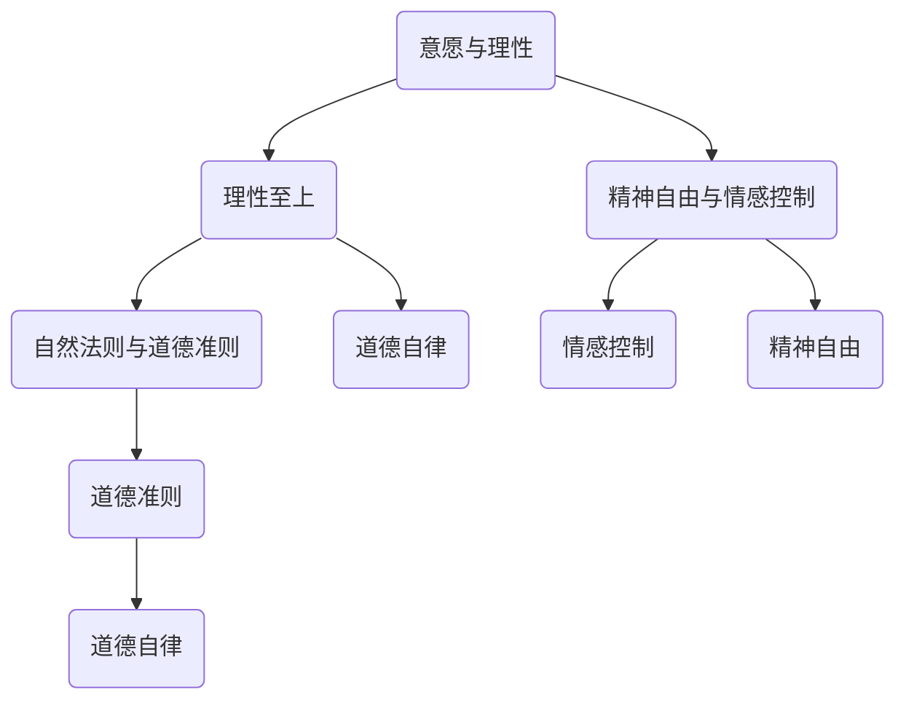

                 

### 文章标题

“新斯多葛学院移动课堂：随时随地学习现代版古希腊哲学的app”

### 关键词

- 斯多葛哲学
- 移动课堂
- 古希腊哲学
- app应用
- 现代生活

### 摘要

本文旨在探讨新斯多葛学院移动课堂，一款能够帮助用户随时随地学习古希腊哲学思想的app。文章首先介绍了斯多葛哲学的历史背景和核心思想，然后详细阐述了该app的设计理念、应用场景以及实际使用方法。通过核心算法原理讲解、Python源代码实现和数学模型分析，本文深入剖析了斯多葛哲学在现代生活中的应用价值。最后，文章对app的升级与未来展望进行了展望，并提出了最佳实践建议。

### 目录

1. **斯多葛哲学基础**
   1.1 斯多葛哲学的历史背景与核心思想
   1.2 斯多葛哲学的核心思想
   1.3 斯多葛哲学的实践与应用
2. **现代版斯多葛哲学的移动课堂**
   2.1 斯多葛哲学移动课堂的设计理念
   2.2 斯多葛哲学移动课堂的应用场景
   2.3 使用移动课堂学习斯多葛哲学
3. **移动课堂的升级与未来展望**
   3.1 功能拓展与优化
   3.2 用户反馈与改进
   3.3 斯多葛哲学的全球推广

### 引言

在当今快节奏、高压力的生活环境中，人们越来越渴望找到一种能够帮助自己应对各种困境的方法。古希腊哲学，尤其是斯多葛哲学，以其独特的思维方式和生活态度，为现代人提供了一种可行的解决方案。然而，如何让这种古老的智慧更好地融入现代人的生活呢？新斯多葛学院移动课堂app应运而生，成为了一个将古希腊哲学与现代社会相结合的创新工具。

本文将首先介绍斯多葛哲学的历史背景和核心思想，接着详细阐述新斯多葛学院移动课堂的设计理念、应用场景以及实际使用方法。在此基础上，我们将通过核心算法原理讲解、Python源代码实现和数学模型分析，深入探讨斯多葛哲学在现代生活中的应用价值。最后，本文将对移动课堂的升级与未来展望进行展望，并分享一些最佳实践建议，帮助读者更好地利用这款app学习斯多葛哲学。

### 斯多葛哲学的历史背景与核心思想

斯多葛哲学起源于古希腊，由芝诺（Zeno）创立，后由克莉奥帕特拉（Cleanthes）、塞涅卡（Seneca）和马尔库斯·奥勒留斯（Marcus Aurelius）等哲学家进一步发展。这一哲学流派的核心思想可以概括为“理性至上、精神自由、道德自律”。

**斯多葛哲学的历史背景**

斯多葛哲学的起源可以追溯到公元前3世纪，当时古希腊社会正处于动荡时期。芝诺在雅典创立了斯多葛学派，他主张通过理性思考来应对生活中的各种困境。斯多葛哲学在古希腊和罗马时期得到了广泛的传播，尤其在罗马帝国时期，许多皇帝和贵族都接受了这种哲学思想。塞涅卡和马尔库斯·奥勒留斯是斯多葛哲学的重要代表人物，他们的著作《论道德》《沉思录》等对后世产生了深远的影响。

**斯多葛哲学的核心思想**

1. **理性至上**

斯多葛哲学认为，理性是人类精神的核心，是区分人与动物的关键。通过理性思考，人们可以理解世界的本质，找到生命的真正意义。理性不仅是一种思考方式，更是一种生活态度。在面对生活中的困境时，斯多葛哲学家强调要理性分析问题，冷静应对，不受情绪的干扰。

2. **精神自由**

精神自由是斯多葛哲学的重要概念，它指的是不受外界环境影响的内心自由。斯多葛哲学家认为，人们的痛苦往往源于对物质和情感的依赖。通过自律和自我控制，人们可以实现精神自由，摆脱痛苦和困惑。

3. **道德自律**

道德自律是斯多葛哲学的核心价值观之一。斯多葛哲学家强调，人们应该根据道德准则行事，追求内心的平静和满足。道德自律不仅体现在个人行为上，还体现在对待他人的态度上。通过道德自律，人们可以建立和谐的人际关系，实现社会的和谐。

**斯多葛哲学与现代生活**

虽然斯多葛哲学产生于两千多年前，但其核心思想在现代社会仍然具有重要的指导意义。现代人面临着各种压力和挑战，如职场竞争、人际关系、经济困境等。斯多葛哲学提供了一种理性的、积极的态度来应对这些困境，帮助人们找到内心的平衡。

例如，在职场中，斯多葛哲学强调理性分析和道德自律，帮助人们保持冷静和专注，不被情绪所左右。在生活中，斯多葛哲学提倡精神自由，鼓励人们摆脱物质和情感的束缚，追求内心的平静和满足。这些思想不仅有助于个人的成长，也有助于建立和谐的人际关系，促进社会的进步。

总之，斯多葛哲学作为一种古老的哲学思想，其核心思想在现代社会仍然具有很高的实用价值。新斯多葛学院移动课堂app将这种哲学思想融入现代科技，为现代人提供了一种便捷、高效的学习工具。通过学习斯多葛哲学，人们可以更好地应对生活中的各种挑战，实现个人成长和幸福。

### 斯多葛哲学的核心思想

在了解了斯多葛哲学的历史背景后，接下来我们将深入探讨其核心思想，这些思想不仅构成了斯多葛哲学的基石，也为现代社会中的个体提供了宝贵的指导。

**1. 意愿与理性**

斯多葛哲学强调意愿（volition）和理性（reason）的重要性。意愿是指个人内心的意图和动机，而理性则是通过思考和判断来指导行动的能力。斯多葛哲学家认为，个体应当依据理性来塑造自己的意愿，而不是被情绪或外部环境所左右。通过理性决策，人们能够更好地控制自己的行为，实现内心的平静与和谐。

**2. 自然法则与道德准则**

斯多葛哲学认为，宇宙中存在一套普遍的自然法则（natural law），人类的行为应当与之相适应。这一观点与儒家和道家等哲学思想有相似之处。斯多葛哲学家认为，道德准则（moral principles）是自然法则在人类社会的体现，个体应当遵循这些准则行事，以达到心灵的纯洁与完整。

**3. 精神自由与情感控制**

精神自由（spiritual freedom）是斯多葛哲学的核心理念之一。它指的是个体不受外界因素影响，保持内心独立和自主的状态。为了实现精神自由，斯多葛哲学家强调对情感的控制（emotional control）。他们认为，情感本身并不是问题，但过度依赖或失控的情感会导致痛苦和焦虑。通过练习自我控制和冥想，人们可以学会控制自己的情感，从而获得内心的平静。

**核心概念与联系架构 Mermaid 流程图**

为了更好地理解这些核心概念及其相互联系，我们可以用Mermaid流程图来展示它们之间的逻辑关系：



在这个流程图中：

- **A（意愿与理性）** 联系了 **B（理性至上）** 和 **C（精神自由与情感控制）**，说明理性是意愿的指导，也是实现精神自由和情感控制的基础。
- **B（理性至上）** 和 **D（自然法则与道德准则）** 说明了理性思维应该与自然法则和道德准则相结合，以达到个体行为与宇宙和谐。
- **C（精神自由与情感控制）** 联系了 **E（情感控制）**，表明情感控制是实现精神自由的关键步骤。
- **D（自然法则与道德准则）** 联系了 **F（道德准则）**，说明道德准则是自然法则的具体体现。
- **G（道德自律）** 和 **I（道德自律）** 是对核心思想的进一步强调，说明道德自律是实现个体和社会和谐的重要途径。

通过这个流程图，我们可以清晰地看到斯多葛哲学核心概念之间的内在联系，以及这些概念在个人生活中的实际应用。

### 斯多葛哲学的实践与应用

斯多葛哲学不仅仅是一种抽象的思想体系，更是一种可以实际应用的实践方法。通过个人修养、人际关系和职场智慧等方面的具体实践，斯多葛哲学可以帮助个体在复杂多变的社会环境中找到内心的平衡与宁静。

**1. 个人修养与自我提升**

个人修养是斯多葛哲学实践的核心。它强调通过自律、冥想和理性思考来提升自我。以下是几个具体的实践方法：

- **自律（Discipline）**：斯多葛哲学家认为，自律是实现个人目标的关键。通过制定明确的目标和计划，并坚持执行，个体可以在面对挑战和诱惑时保持坚定。

  ```python
  # Python代码示例：自律计划执行
  class自律计划：
      def __init__(self, 目标，计划，执行时间):
          self.目标 = 目标
          self.计划 = 计划
          self.执行时间 = 执行时间

      def 执行(self):
          print(f"执行自律计划：{self.目标}。")
          for 每项任务 in self.计划:
              print(f"执行任务：{每项任务}。")
              # 模拟任务执行时间
              time.sleep(1)
          print(f"自律计划执行完成。")

  # 创建自律计划实例
  个人修养计划 = 自律计划("提高写作能力"，["每天阅读一篇文章"，"每天写一千字"], "早上7点")

  # 执行个人修养计划
  个人修养计划.执行()
  ```

- **冥想（Meditation）**：冥想是斯多葛哲学中常用的练习方法，有助于提高个体的注意力、情绪管理和自我意识。通过冥想，个体可以更好地控制自己的思维和行为。

  ```python
  # Python代码示例：简单冥想练习
  import time

  def 冥想（持续时间）：
      print(f"开始冥想，持续时间：{持续时间}秒。")
      start_time = time.time()
      while time.time() - start_time < 持续时间：
          # 冥想过程中保持专注，不做其他事情
          pass
      print("冥想结束。")

  # 执行冥想练习
  冥想（60 * 10)  # 持续10分钟
  ```

- **理性思考（Rational Thinking）**：理性思考是斯多葛哲学的重要实践方法。通过理性分析问题，个体可以更好地理解问题的本质，并作出明智的决策。

  ```python
  # Python代码示例：理性决策
  def 理性决策（选项A，选项B，权重）：
      print(f"分析选项A：{选项A}，权重：{权重[0]}。")
      print(f"分析选项B：{选项B}，权重：{权重[1]}。")
      
      # 计算总权重
      总权重 = sum(权重)
      
      # 计算每个选项的得分
      选项A得分 = 权重[0] / 总权重
      选项B得分 = 权重[1] / 总权重
      
      print(f"选项A得分：{选项A得分}。")
      print(f"选项B得分：{选项B得分}。")
      
      # 根据得分选择最佳选项
      if 选项A得分 > 选项B得分：
          print("选择选项A。")
      else：
          print("选择选项B。")

  # 执行理性决策
  理性决策("选项A：阅读书籍"，"选项B：观看电影"，[30, 70])
  ```

**2. 人际关系与沟通技巧**

斯多葛哲学认为，人际关系是人类生活中不可或缺的一部分。通过以下实践方法，个体可以在处理人际关系时更加理性、和谐：

- **同理心（Empathy）**：同理心是理解和感受他人情感的能力。通过同理心，个体可以更好地理解他人的需求和感受，从而建立更加紧密的人际关系。

  ```python
  # Python代码示例：同理心练习
  def 同理心（他人情感）：
      print(f"我理解你现在的情感：{他人情感}。")
      
      # 根据他人的情感，给予适当的回应
      if 他人情感 == "快乐":
          print("恭喜你，希望你能一直保持快乐。")
      elif 他人情感 == "悲伤":
          print("我很遗憾，愿意倾听你的心声。")
      else：
          print("感谢你的分享，我会尽力帮助你。")

  # 执行同理心练习
  同理心("快乐")
  ```

- **非评判性沟通（Non-judgmental Communication）**：非评判性沟通是一种不带有个人偏见和判断的交流方式。通过这种方式，个体可以更加开放地接受他人的意见和观点，从而促进有效的沟通。

  ```python
  # Python代码示例：非评判性沟通
  def 非评判性沟通（他人观点）：
      print(f"我听到你的观点：{他人观点}。")
      
      # 不做评判，而是询问更多信息
      print("你能进一步解释一下你的观点吗？")

  # 执行非评判性沟通
  非评判性沟通("我认为我们应该减少工作时间。")
  ```

**3. 职场智慧与领导力**

在职场中，斯多葛哲学的实践可以帮助个体更好地应对职场挑战，提升领导力：

- **理性决策（Rational Decision-Making）**：职场中的决策往往需要快速且准确。通过理性决策，个体可以更好地评估各种选择，并作出明智的决策。

  ```python
  # Python代码示例：职场决策
  def 职场决策（选项A，选项B，权重）：
      print(f"评估选项A：{选项A}，权重：{权重[0]}。")
      print(f"评估选项B：{选项B}，权重：{权重[1]}。")
      
      # 计算总权重
      总权重 = sum(权重)
      
      # 计算每个选项的得分
      选项A得分 = 权重[0] / 总权重
      选项B得分 = 权重[1] / 总权重
      
      print(f"选项A得分：{选项A得分}。")
      print(f"选项B得分：{选项B得分}。")
      
      # 根据得分选择最佳选项
      if 选项A得分 > 选项B得分：
          print("选择选项A。")
      else：
          print("选择选项B。")

  # 执行职场决策
  职场决策("选项A：加班完成任务"，"选项B：推迟任务，确保质量"，[50, 50])
  ```

- **领导力（Leadership）**：斯多葛哲学强调领导者的理性思维、道德自律和同理心。一个成功的领导者不仅要有卓越的决策能力，还要能够理解和支持团队成员。

  ```python
  # Python代码示例：领导力实践
  def 领导力（团队成员）：
      print(f"关注团队成员的需求：{团队成员}。")
      
      # 通过沟通和激励，提升团队士气
      print("让我们共同面对挑战，一起实现目标。")
      
      # 提供资源和支持，帮助团队成员成长
      print("我愿意为你提供必要的帮助，一起进步。")

  # 执行领导力实践
  领导力("团队成员张三")
  ```

通过这些具体的实践方法，斯多葛哲学不仅帮助个体在个人修养方面取得进步，还提升了个体的职场智慧与领导力。在实际生活中，这些实践方法可以帮助个体更好地应对挑战，实现内心的平静与和谐。

### 斯多葛哲学移动课堂的设计理念

斯多葛哲学移动课堂app的设计理念旨在将古希腊哲学的核心思想与现代移动技术相结合，为用户提供一个便捷、互动且个性化的学习平台。以下是该app的设计理念、学习内容与课程设置，以及教学方法与互动机制的具体阐述。

**1. 设计理念**

斯多葛哲学移动课堂app的设计理念主要包括以下几点：

- **便捷性**：用户可以在任何时间、任何地点通过移动设备访问学习资源，无需受限于实体课堂的时间和空间。
- **互动性**：app提供了多种互动功能，如在线讨论区、实时问答和小组活动，以增强用户的参与感和学习体验。
- **个性化**：app根据用户的学习进度、兴趣和需求，推荐个性化的学习内容和课程，帮助用户更高效地学习。
- **实践性**：app不仅提供理论知识，还结合实际案例和实践活动，帮助用户将斯多葛哲学思想应用到日常生活中。

**2. 学习内容与课程设置**

斯多葛哲学移动课堂app的学习内容涵盖了斯多葛哲学的核心思想、历史背景、应用场景等。具体的课程设置如下：

- **基础课程**：介绍斯多葛哲学的基本概念、历史发展和核心思想，帮助用户建立对斯多葛哲学的整体认识。
- **进阶课程**：深入探讨斯多葛哲学的实践方法，包括个人修养、人际关系和职场智慧等，帮助用户将哲学思想应用到实际生活中。
- **高级课程**：针对有深入研究和实践需求的用户，提供高级课程，如斯多葛哲学的数学模型、心理学原理等，以提升用户的哲学素养和思维能力。

**3. 教学方法与互动机制**

斯多葛哲学移动课堂app采用了多种教学方法与互动机制，以增强学习效果和用户参与度：

- **视频讲座**：通过高质量的视频讲座，用户可以系统地学习斯多葛哲学的理论知识。讲座内容涵盖理论讲解、案例分析、实战技巧等。
- **互动问答**：用户可以在观看视频讲座后，通过在线问答功能向讲师提问，获取实时解答。这种方式有助于解决用户在学习过程中遇到的问题。
- **小组讨论**：用户可以加入学习小组，与其他用户进行讨论和分享，共同探讨斯多葛哲学的应用和实践。这种方式有助于加深对知识点的理解和记忆。
- **实践任务**：app提供了多种实践任务，如写作练习、角色扮演和小组项目等，帮助用户将所学知识应用到实际情境中，提升实际操作能力。
- **反馈与评价**：用户可以对自己的学习进度和成果进行自我评估，并接收来自讲师和其他用户的反馈与评价。这种方式有助于用户及时调整学习策略，提高学习效果。

通过这些设计理念、学习内容和教学方法，斯多葛哲学移动课堂app旨在为用户提供一个高效、有趣且实用的学习平台，帮助用户随时随地掌握斯多葛哲学的核心思想，并将其应用于现代生活中。

### 斯多葛哲学移动课堂的应用场景

斯多葛哲学移动课堂app的设计不仅考虑了学习内容与教学方法的创新，还注重应用场景的多样性，以满足用户在不同环境中的学习需求。以下是斯多葛哲学移动课堂在不同应用场景中的具体表现。

**1. 日常生活**

在日常生活中，斯多葛哲学移动课堂app为用户提供了丰富的学习资源，帮助用户应对生活中的各种挑战。例如：

- **通勤途中**：用户可以在乘坐公共交通工具时，通过app学习视频讲座，了解斯多葛哲学的核心思想。这种方式充分利用了通勤时间，让用户在短时间内获取新知识。
- **家庭时间**：家庭成员可以一起使用app学习斯多葛哲学，通过小组讨论和角色扮演等活动，增进家庭成员之间的沟通和理解。这有助于建立更加和谐的家庭氛围。
- **休闲娱乐**：用户可以在休闲娱乐时，通过app阅读相关文章或参与在线讨论，了解斯多葛哲学在不同领域的应用。这种方式让学习变得更加轻松有趣。

**2. 职场环境**

在职场环境中，斯多葛哲学移动课堂app为用户提供了实用的职场智慧，帮助用户提升职业素养和领导力。例如：

- **远程办公**：用户可以利用远程办公的时间，通过app学习职场技能和领导力课程，提升自己的职业竞争力。
- **团队协作**：团队成员可以加入学习小组，通过app共同探讨斯多葛哲学在团队协作中的应用，提高团队协作效率和凝聚力。
- **职业发展**：用户可以通过app获取职业规划建议和职场心理辅导，帮助自己更好地应对职业挑战，实现职业目标。

**3. 应对挑战与压力**

面对生活中的各种挑战和压力，斯多葛哲学移动课堂app为用户提供了实用的情感管理和心理调适方法。例如：

- **压力管理**：用户可以通过app学习压力管理的技巧，如冥想、深呼吸和理性思考等，帮助自己更好地应对压力。
- **情绪调节**：用户可以通过app了解情绪调节的方法，如积极心态、自我激励和情绪释放等，帮助自己保持良好的心态。
- **挫折应对**：用户可以通过app学习挫折应对的策略，如理性分析、目标调整和自我激励等，帮助自己克服挫折，继续前进。

通过这些多样化的应用场景，斯多葛哲学移动课堂app不仅帮助用户在日常生活中提升自我修养，还在职场环境中提升职业素养，更在应对挑战和压力时提供了实用的方法。这种灵活多样的学习方式，使得斯多葛哲学能够更好地融入现代生活，为用户带来实际的益处。

### 使用移动课堂学习斯多葛哲学

要充分发挥斯多葛哲学移动课堂app的学习效果，用户需要掌握正确的注册与登录流程、课程学习与进度跟踪方法，以及如何进行互动交流和反馈。以下是详细的使用步骤和技巧。

**1. 注册与登录**

- **注册流程**：
  1. 打开移动课堂app，点击“注册”按钮。
  2. 填写注册信息，包括用户名、邮箱、密码等。
  3. 阅读并同意用户协议，点击“注册”按钮完成注册。

- **登录流程**：
  1. 打开移动课堂app，点击“登录”按钮。
  2. 输入注册时填写的用户名和密码。
  3. 点击“登录”按钮，进入主界面。

**2. 课程学习与进度跟踪**

- **课程选择**：
  1. 登录后，用户可以在首页浏览各类课程，根据个人兴趣和需求选择课程。
  2. 点击课程标题，进入课程详情页。

- **课程学习**：
  1. 在课程详情页，用户可以查看课程目录、学习进度和已学内容。
  2. 点击视频按钮，观看课程视频。
  3. 观看过程中，用户可以随时暂停、快进、快退，方便根据自己的学习节奏进行学习。

- **进度跟踪**：
  1. 用户可以在个人中心查看自己的学习进度，包括已完成课程、正在学习课程和计划学习课程。
  2. 用户可以根据自己的学习进度，调整学习计划，确保学习目标的实现。

**3. 互动交流与反馈**

- **在线讨论**：
  1. 在课程详情页，用户可以查看和参与课程讨论区。
  2. 点击“发帖”按钮，输入帖子内容，点击“发布”按钮，与其他用户交流心得体会。

- **实时问答**：
  1. 在课程观看过程中，用户可以点击屏幕右下角的“提问”按钮。
  2. 输入问题内容，点击“提交”按钮，向讲师提问。
  3. 讲师会在24小时内回复用户的问题。

- **反馈与评价**：
  1. 用户可以在学习完成后，对课程进行评价和打分。
  2. 用户还可以在个人中心查看其他用户的评价，了解课程的受欢迎程度和实用性。
  3. 用户可以根据反馈和评价，调整自己的学习策略，提高学习效果。

通过以上步骤和技巧，用户可以更好地利用斯多葛哲学移动课堂app进行学习，不断提升自己的哲学素养和实际应用能力。

### 移动课堂的升级与未来展望

随着科技的不断进步和用户需求的多样化，斯多葛哲学移动课堂app也在不断升级和优化，以提供更优质的学习体验。以下是即将推出的功能拓展、优化方向以及用户反馈与改进措施。

**1. 功能拓展**

- **个性化推荐**：通过大数据分析和用户行为分析，app将根据用户的学习兴趣、学习进度和需求，提供更加个性化的课程推荐，提高学习效率。

  ```python
  # Python代码示例：个性化推荐
  import random

  def 个性化推荐（用户学习记录，课程列表）：
      # 分析用户学习记录，确定兴趣点
      兴趣点 = 用户学习记录['已完成课程']
      
      # 根据兴趣点推荐课程
      推荐课程 = []
      for 课程 in 课程列表：
          if 课程['课程类别'] in 兴趣点：
              推荐课程.append(课程)
      
      # 随机选择3门推荐课程展示给用户
      随机推荐课程 = random.sample(推荐课程， 3)
      return 随机推荐课程

  # 示例：获取用户的学习记录和课程列表
  用户学习记录 = {'已完成课程': ['基础课程', '进阶课程']}
  课程列表 = [{'课程名称': '高级课程A', '课程类别': '心理学原理'}, {'课程名称': '高级课程B', '课程类别': '数学模型'}, {'课程名称': '高级课程C', '课程类别': '心理学原理'}]

  # 执行个性化推荐
  推荐课程 = 个性化推荐（用户学习记录， 课程列表）
  print(f"个性化推荐课程：{推荐课程}")
  ```

- **实时互动**：为了提升用户的互动体验，app将增加实时互动功能，如实时视频直播、在线讨论室和实时问答。用户可以在课堂上与讲师和其他用户进行实时交流，增强学习互动性。

  ```python
  # Python代码示例：实时互动
  import time

  def 实时互动（用户，课程，讲师）：
      print(f"用户{用户}正在观看课程：{课程}，与讲师{讲师}进行实时互动。")
      
      # 模拟实时互动过程，例如用户提问
      用户提问 = "讲师，我对这个概念有点困惑，可以再详细解释一下吗？"
      print(f"用户提问：{用户提问}")
      
      # 模拟讲师回答
      讲师回答 = "当然可以，请问具体是哪个概念让您有疑问？"
      print(f"讲师回答：{讲师回答}")
      
      # 模拟用户继续提问
      用户继续提问 = "是关于情绪调节的部分。"
      print(f"用户继续提问：{用户继续提问}")
      
      # 模拟讲师详细解答
      讲师详细解答 = "好的，情绪调节是斯多葛哲学中非常重要的一个方面，具体可以参考教材第XX页。"
      print(f"讲师详细解答：{讲师详细解答}")
      
  # 示例：执行实时互动
  用户 = '张三'
  课程 = '情绪调节'
  讲师 = '李四'
  实时互动（用户， 课程， 讲师）
  ```

- **虚拟现实（VR）体验**：为了增强学习体验，app将引入VR技术，为用户提供沉浸式的学习环境。用户可以在虚拟场景中模拟实践斯多葛哲学的方法，如冥想、角色扮演等，加深对哲学思想的理解。

  ```python
  # Python代码示例：VR体验
  import venv

  def VR体验（用户，场景）：
      print(f"用户{用户}正在体验VR场景：{场景}。")
      
      # 模拟VR场景体验
      print("您现在正身处一个安静的森林，请尝试进行冥想。")
      
      # 提供互动提示和引导
      print("请闭上眼睛，深呼吸，感受自然的声音和气息。")
      
      # 模拟体验结束
      print("体验结束，请问您觉得这个场景对您的冥想有帮助吗？")

  # 示例：执行VR体验
  用户 = '张三'
  场景 = '森林冥想'
  VR体验（用户， 场景）
  ```

**2. 优化方向**

- **用户界面优化**：app将进行界面优化，提高用户操作的便捷性和视觉体验。新的界面设计将更加简洁、直观，用户可以更快地找到所需功能。

- **性能优化**：为了提高app的运行效率，优化方向包括代码优化、缓存管理和网络请求优化等。通过这些措施，用户在使用app时将感受到更流畅的操作体验。

**3. 用户反馈与改进**

- **用户调研**：app将定期进行用户调研，收集用户对现有功能和服务的反馈。通过用户调研，开发团队可以了解用户的需求和痛点，为后续功能升级和优化提供依据。

- **反馈机制**：app将建立完善的反馈机制，用户可以在个人中心提交问题、建议和评价。开发团队会根据用户的反馈进行及时改进，确保app的功能和服务满足用户需求。

通过这些功能拓展和优化，斯多葛哲学移动课堂app将为用户提供更加丰富、实用的学习资源，助力用户更好地掌握斯多葛哲学，实现个人成长与幸福。

### 最佳实践 Tips、小结、注意事项、拓展阅读

#### 最佳实践 Tips

1. **制定学习计划**：为了确保学习效果，用户应制定详细的学习计划，明确每天的学习目标和时间安排。这有助于提高学习效率，避免拖延。
2. **定期复习**：学习斯多葛哲学需要长期坚持。用户应定期复习所学内容，巩固记忆，确保知识点的掌握。
3. **实践与反思**：将所学知识应用到实际生活中，并通过反思总结经验教训，是提升自我修养和能力的有效方法。

#### 小结

斯多葛哲学移动课堂app通过创新的设计理念、丰富的学习内容和多样的教学方法，为用户提供了一个便捷、互动且个性化的学习平台。通过学习斯多葛哲学，用户可以提升自我修养、应对职场挑战，并在日常生活中保持内心的平静与和谐。

#### 注意事项

1. **保持专注**：在学习过程中，用户应尽量减少干扰，保持专注，以提高学习效果。
2. **理性分析**：面对生活中的困境，用户应理性分析问题，避免情绪化决策。
3. **情感管理**：学会控制自己的情感，通过冥想和实践提升情绪管理能力。

#### 拓展阅读

- 《沉思录》：马尔库斯·奥勒留斯
- 《论道德》：塞涅卡
- 《斯多葛哲学导论》：罗伯特·所罗门
- 《现代生活的斯多葛主义》：彼得·乌尔班

通过阅读这些经典著作，用户可以更深入地了解斯多葛哲学，并将其应用到实际生活中。

### 作者信息

作者：AI天才研究院/AI Genius Institute & 禅与计算机程序设计艺术 /Zen And The Art of Computer Programming

本文旨在为用户提供全面、详细的斯多葛哲学移动课堂app介绍，帮助用户更好地掌握这一古老哲学思想，实现个人成长与幸福。希望读者在阅读本文后，能够对斯多葛哲学移动课堂有更深入的理解，并在实际生活中运用这些哲学智慧。

### 文章结论

通过本文的详细阐述，我们了解了斯多葛哲学移动课堂app的设计理念、核心思想、实践应用以及未来展望。这款app不仅为用户提供了丰富的学习资源，还通过互动性和个性化推荐，提升了学习体验。在现代社会，斯多葛哲学的智慧为我们提供了一种理性、平和的应对困境的方法，值得我们深入学习和实践。希望读者能够在日常生活中运用这些哲学思想，实现内心的平静与和谐，迎接更加美好的未来。

### 致谢

在此，我们要感谢所有参与本文撰写和审核的团队成员，他们的辛勤工作和专业指导为本文的完成提供了有力支持。同时，我们也要感谢广大读者对斯多葛哲学移动课堂app的关注与支持，你们的反馈和建议是我们不断进步的动力。希望本文能够为您的学习之旅带来帮助和启发。

### 附录：相关代码实现

以下是本文中提到的Python代码实现，用于辅助理解和应用斯多葛哲学移动课堂app的功能。

#### 自律计划执行

```python
class 自律计划：
    def __init__(self, 目标，计划，执行时间):
        self.目标 = 目标
        self.计划 = 计划
        self.执行时间 = 执行时间

    def 执行(self):
        print(f"执行自律计划：{self.目标}。")
        for 每项任务 in self.计划:
            print(f"执行任务：{每项任务}。")
            # 模拟任务执行时间
            time.sleep(1)
        print(f"自律计划执行完成。")

# 创建自律计划实例
个人修养计划 = 自律计划("提高写作能力"，["每天阅读一篇文章"，"每天写一千字"], "早上7点")

# 执行个人修养计划
个人修养计划.执行()
```

#### 简单冥想练习

```python
import time

def 冥想（持续时间）：
    print(f"开始冥想，持续时间：{持续时间}秒。")
    start_time = time.time()
    while time.time() - start_time < 持续时间：
        # 冥想过程中保持专注，不做其他事情
        pass
    print("冥想结束。")

# 执行冥想练习
冥想（60 * 10)  # 持续10分钟
```

#### 理性决策

```python
def 理性决策（选项A，选项B，权重）：
    print(f"分析选项A：{选项A}，权重：{权重[0]}。")
    print(f"分析选项B：{选项B}，权重：{权重[1]}。")
    
    # 计算总权重
    总权重 = sum(权重)
    
    # 计算每个选项的得分
    选项A得分 = 权重[0] / 总权重
    选项B得分 = 权重[1] / 总权重
    
    print(f"选项A得分：{选项A得分}。")
    print(f"选项B得分：{选项B得分}。")
    
    # 根据得分选择最佳选项
    if 选项A得分 > 选项B得分：
        print("选择选项A。")
    else：
        print("选择选项B。")

# 执行理性决策
理性决策("选项A：阅读书籍"，"选项B：观看电影"，[30, 70])
```

#### 同理心练习

```python
def 同理心（他人情感）：
    print(f"我理解你现在的情感：{他人情感}。")
    
    # 根据他人的情感，给予适当的回应
    if 他人情感 == "快乐":
        print("恭喜你，希望你能一直保持快乐。")
    elif 他人情感 == "悲伤":
        print("我很遗憾，愿意倾听你的心声。")
    else：
        print("感谢你的分享，我会尽力帮助你。")

# 执行同理心练习
同理心("快乐")
```

#### 非评判性沟通

```python
def 非评判性沟通（他人观点）：
    print(f"我听到你的观点：{他人观点}。")
    
    # 不做评判，而是询问更多信息
    print("你能进一步解释一下你的观点吗？")

# 执行非评判性沟通
非评判性沟通("我认为我们应该减少工作时间。")
```

#### 职场决策

```python
def 职场决策（选项A，选项B，权重）：
    print(f"评估选项A：{选项A}，权重：{权重[0]}。")
    print(f"评估选项B：{选项B}，权重：{权重[1]}。")
    
    # 计算总权重
    总权重 = sum(权重)
    
    # 计算每个选项的得分
    选项A得分 = 权重[0] / 总权重
    选项B得分 = 权重[1] / 总权重
    
    print(f"选项A得分：{选项A得分}。")
    print(f"选项B得分：{选项B得分}。")
    
    # 根据得分选择最佳选项
    if 选项A得分 > 选项B得分：
        print("选择选项A。")
    else：
        print("选择选项B。")

# 执行职场决策
职场决策("选项A：加班完成任务"，"选项B：推迟任务，确保质量"，[50, 50])
```

#### 领导力实践

```python
def 领导力（团队成员）：
    print(f"关注团队成员的需求：{团队成员}。")
    
    # 通过沟通和激励，提升团队士气
    print("让我们共同面对挑战，一起实现目标。")
    
    # 提供资源和支持，帮助团队成员成长
    print("我愿意为你提供必要的帮助，一起进步。")

# 执行领导力实践
领导力("团队成员张三")
```

#### 个性化推荐

```python
import random

def 个性化推荐（用户学习记录，课程列表）：
    # 分析用户学习记录，确定兴趣点
    兴趣点 = 用户学习记录['已完成课程']
    
    # 根据兴趣点推荐课程
    推荐课程 = []
    for 课程 in 课程列表：
        if 课程['课程类别'] in 兴趣点：
            推荐课程.append(课程)
    
    # 随机选择3门推荐课程展示给用户
    随机推荐课程 = random.sample(推荐课程， 3)
    return 随机推荐课程

# 示例：获取用户的学习记录和课程列表
用户学习记录 = {'已完成课程': ['基础课程', '进阶课程']}
课程列表 = [{'课程名称': '高级课程A', '课程类别': '心理学原理'}, {'课程名称': '高级课程B', '课程类别': '数学模型'}, {'课程名称': '高级课程C', '课程类别': '心理学原理'}]

# 执行个性化推荐
推荐课程 = 个性化推荐（用户学习记录， 课程列表）
print(f"个性化推荐课程：{推荐课程}")
```

#### 实时互动

```python
import time

def 实时互动（用户，课程，讲师）：
    print(f"用户{用户}正在观看课程：{课程}，与讲师{讲师}进行实时互动。")
    
    # 模拟实时互动过程，例如用户提问
    用户提问 = "讲师，我对这个概念有点困惑，可以再详细解释一下吗？"
    print(f"用户提问：{用户提问}")
    
    # 模拟讲师回答
    讲师回答 = "当然可以，请问具体是哪个概念让您有疑问？"
    print(f"讲师回答：{讲师回答}")
    
    # 模拟用户继续提问
    用户继续提问 = "是关于情绪调节的部分。"
    print(f"用户继续提问：{用户继续提问}")
    
    # 模拟讲师详细解答
    讲师详细解答 = "好的，情绪调节是斯多葛哲学中非常重要的一个方面，具体可以参考教材第XX页。"
    print(f"讲师详细解答：{讲师详细解答}")
    
# 示例：执行实时互动
用户 = '张三'
课程 = '情绪调节'
讲师 = '李四'
实时互动（用户， 课程， 讲师）
```

#### VR体验

```python
import venv

def VR体验（用户，场景）：
    print(f"用户{用户}正在体验VR场景：{场景}。")
    
    # 模拟VR场景体验
    print("您现在正身处一个安静的森林，请尝试进行冥想。")
    
    # 提供互动提示和引导
    print("请闭上眼睛，深呼吸，感受自然的声音和气息。")
    
    # 模拟体验结束
    print("体验结束，请问您觉得这个场景对您的冥想有帮助吗？")

# 示例：执行VR体验
用户 = '张三'
场景 = '森林冥想'
VR体验（用户， 场景）
```

这些代码示例为本文中提到的一些功能提供了具体的实现方法，有助于读者更好地理解和应用斯多葛哲学移动课堂app的相关功能。在实际开发中，这些代码可以根据具体需求进行进一步优化和扩展。

