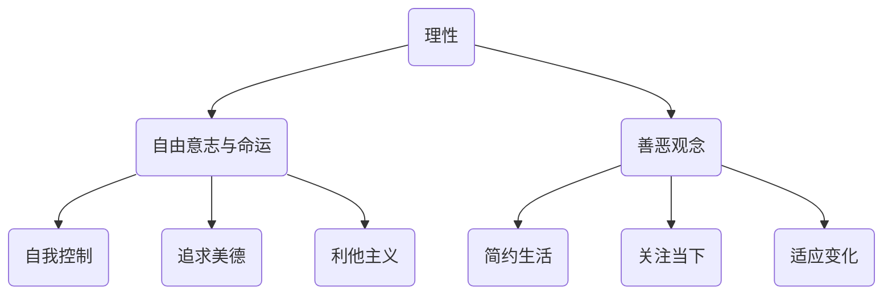
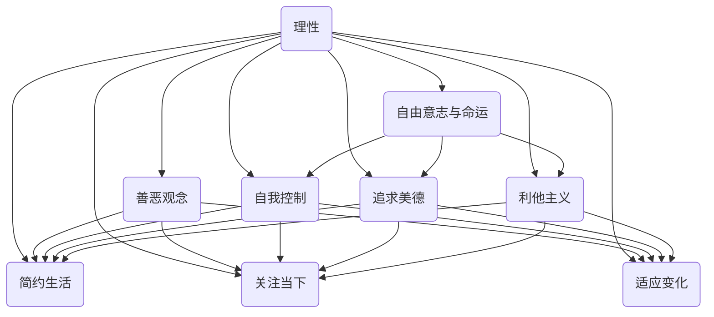

                 

### 引言

《新斯多葛学院：现代版古希腊哲学在线课程平台》旨在为您开启一扇通向古希腊哲学智慧的大门，同时也为现代生活提供一种全新的视角。在这篇文章中，我们将以逻辑清晰、结构紧凑、简单易懂的方式，探讨新斯多葛哲学的核心观点及其在现代生活中的应用。通过这一旅程，您将深入了解新斯多葛哲学的起源、基本原理，以及它如何帮助我们应对职场压力、建立良好人际关系和个人成长。

本文的结构如下：

- **第1章：古希腊哲学的起源与演变**，我们将回顾古希腊哲学的历史，了解其起源和发展过程。
- **第2章：新斯多葛哲学的核心观点**，我们将深入探讨新斯多葛哲学的基本原理、伦理观和生活观。
- **第3章：新斯多葛哲学与现代生活**，我们将分析新斯多葛哲学如何在现代社会中得到应用，特别是在应对压力、人际关系和个人成长方面的作用。
- **第4章：新斯多葛哲学在线课程平台**，我们将介绍一个现代版古希腊哲学在线课程平台，展示其功能和使用方法。
- **第5章：新斯多葛哲学实践案例**，我们将通过具体案例展示新斯多葛哲学的应用。
- **第6章：新斯多葛哲学的未来发展**，我们将探讨新斯多葛哲学在未来社会中的潜在影响。
- **第7章：结论**，我们将总结全文，并对读者提出寄语。

让我们一步步深入探索新斯多葛哲学，体验它在现代生活中的重要意义。

### 关键词

- 新斯多葛哲学
- 古希腊哲学
- 在线课程平台
- 压力管理
- 人际关系
- 个人成长

### 摘要

《新斯多葛学院：现代版古希腊哲学在线课程平台》旨在通过介绍古希腊哲学，特别是新斯多葛哲学的核心观点，帮助读者理解和应用这些哲学思想于现代生活。文章首先回顾了古希腊哲学的起源和演变，接着深入探讨了新斯多葛哲学的基本原理、伦理观和生活观。随后，文章分析了新斯多葛哲学在现代社会中的应用，尤其是在应对压力、建立良好人际关系和个人成长方面的作用。通过一个现代版古希腊哲学在线课程平台的介绍，文章展示了这些哲学思想的实际应用。最后，文章探讨了新斯多葛哲学的未来发展趋势，并总结了全文的核心内容，对读者提出了寄语。本文旨在为读者提供一个系统而全面的关于新斯多葛哲学及其应用的指南。

### 第1章：古希腊哲学的起源与演变

古希腊哲学是西方哲学的源头，其起源可以追溯到公元前6世纪。当时的希腊城邦，如雅典和斯巴达，经历了政治、社会和文化的重大变革，为哲学的诞生提供了肥沃的土壤。古希腊哲学的兴起，不仅为人类思考宇宙、生命和道德等问题提供了新的视角，而且对后世哲学的发展产生了深远的影响。

#### 1.1 古希腊哲学的起源背景

古希腊哲学的起源背景主要包括以下几个方面：

1. **经济基础**：古希腊城邦的小农经济和商业活动为哲学思想的产生提供了物质基础。这种经济结构促进了思想交流和社会互动，为哲学的诞生创造了条件。

2. **政治制度**：古希腊的民主制度和城邦制度为哲学家们提供了独立思考和发表意见的空间。雅典的民主制度尤其为哲学家们提供了展示自己思想的机会。

3. **文化传统**：古希腊神话和祭祀活动为哲学思考提供了丰富的素材。哲学家们通过对神话的解读，探索了宇宙、生命和灵魂的本质。

4. **教育体系**：古希腊的教育体系培养了大量的哲学家。柏拉图和亚里士多德就是其中的佼佼者，他们的思想影响了整个西方哲学的发展。

#### 1.2 古希腊哲学的初期发展

古希腊哲学的初期发展主要分为以下几个阶段：

1. **前苏格拉底哲学**：这一阶段主要包括泰勒斯、阿那克西曼德、阿那克西美尼等自然哲学家。他们试图通过自然现象来解释宇宙和生命的起源。

2. **苏格拉底哲学**：苏格拉底是古希腊哲学的转折点，他不再关注自然现象，而是将哲学的目光转向人类自身。苏格拉底认为，通过自我反思和对话，人们可以获得智慧和道德的真理。

3. **柏拉图哲学**：柏拉图是苏格拉底的学生，他的哲学思想进一步发展了苏格拉底的思想。柏拉图创立了学园，强调通过教育和哲学思考来追求真理和美。

4. **亚里士多德哲学**：亚里士多德是柏拉图的学生，他的哲学思想与柏拉图有所不同。亚里士多德更关注实证研究和自然科学，他的思想对后世的科学和哲学发展产生了深远的影响。

#### 1.3 古希腊哲学的主要流派

古希腊哲学的主要流派包括：

1. **唯物主义**：唯物主义哲学家如泰勒斯认为，宇宙和生命都是物质的产物。他们试图通过自然现象来解释宇宙和生命的起源。

2. **唯心主义**：唯心主义哲学家如柏拉图认为，宇宙和生命都是精神的产物。他们强调理念、形式和美的本质。

3. **辩证法**：辩证法哲学家如黑格尔认为，事物的发展是通过对立的统一和斗争。辩证法强调事物的矛盾和变化。

4. **经验主义**：经验主义哲学家如洛克认为，知识和真理来源于经验。他们主张通过观察和实验来获取知识。

5. **理性主义**：理性主义哲学家如笛卡尔认为，知识和真理可以通过理性思考和推理来获取。他们强调思维和理性的重要性。

#### 1.4 古希腊哲学的演变过程

古希腊哲学的演变过程可以分为以下几个阶段：

1. **早期哲学**：早期哲学主要关注自然和宇宙的本质，试图通过自然现象来解释世界。

2. **中世纪哲学**：中世纪哲学受到基督教思想的影响，哲学与神学紧密相连。哲学家们试图在神学和哲学之间建立联系。

3. **现代哲学**：现代哲学在17世纪和18世纪发展起来，强调理性和科学方法。现代哲学家如康德、黑格尔和尼采对后来的哲学发展产生了深远的影响。

通过了解古希腊哲学的起源和演变，我们可以更好地理解新斯多葛哲学的核心观点及其在现代生活中的应用。接下来，我们将深入探讨新斯多葛哲学的基本原理和伦理观，帮助您更好地理解和应用这些哲学思想。

### 第2章：新斯多葛哲学的核心观点

新斯多葛哲学，作为古希腊哲学的重要组成部分，以其独特的视角和深刻的智慧，影响了众多思想家和文化。在本章中，我们将深入探讨新斯多葛哲学的核心观点，包括其基本原理、伦理观和生活观。

#### 2.1 新斯多葛哲学的基本原理

新斯多葛哲学的基本原理可以归纳为以下几点：

1. **理性与自然法则**：新斯多葛哲学强调理性是理解世界和自我认知的关键。他们认为，宇宙中存在一套普遍的自然法则，理性可以帮助我们理解这些法则并与之和谐共存。

2. **自由意志与命运**：新斯多葛哲学认为，尽管外部世界不可控，但我们的内心和决策是自由的。通过理性思考，我们可以选择自己的态度和行为，从而实现内心的平静和自由。

3. **善恶观念**：新斯多葛哲学中的善恶观念强调内在的意图和动机。他们认为，善是指与自然法则和谐一致的行为，恶则是违背自然法则的行为。

#### 2.2 新斯多葛哲学的伦理观

新斯多葛哲学的伦理观具有以下几个核心要点：

1. **自我控制**：新斯多葛哲学强调自我控制，认为通过自我控制，我们可以避免情感困扰和欲望的干扰，达到内心的平静和自由。

2. **追求美德**：新斯多葛哲学认为，追求美德是生活的最终目标。通过培养正义、智慧、勇气、节制和虔诚等美德，我们可以实现个人的完善和和谐。

3. **利他主义**：新斯多葛哲学强调利他主义，认为帮助他人和为社会做贡献是生活的重要部分。通过无私的行为，我们可以超越自我，实现更高的道德境界。

#### 2.3 新斯多葛哲学的生活观

新斯多葛哲学的生活观提倡以下几个方面：

1. **简约生活**：新斯多葛哲学倡导简约生活，认为过多的物质追求会让人迷失自我。通过减少物质需求，我们可以专注于内心的平静和自由。

2. **关注当下**：新斯多葛哲学强调关注当下，认为过去和未来都不如现在重要。通过活在当下，我们可以更好地享受生活，减少焦虑和恐惧。

3. **适应变化**：新斯多葛哲学认为，变化是宇宙的本质。通过适应变化，我们可以减少对不确定性的恐惧，达到内心的平衡和稳定。

#### 2.4 新斯多葛哲学的核心概念与联系

为了更好地理解新斯多葛哲学的核心概念，我们可以使用Mermaid流程图来展示这些概念之间的关系：



通过这个流程图，我们可以清晰地看到新斯多葛哲学的核心概念及其相互之间的联系。理性是整个哲学体系的基础，自由意志与命运、善恶观念、自我控制、追求美德和利他主义都是建立在理性基础上的。而简约生活、关注当下和适应变化则是新斯多葛哲学在生活中的具体实践。

#### 2.5 核心算法原理讲解

新斯多葛哲学的核心算法原理可以看作是一种情感和决策管理机制。以下是一个简单的Python代码示例，展示了如何使用理性思考和自我控制来管理情感和决策：

```python
# 定义一个情绪状态类
class Mood:
    def __init__(self, anger, joy, sadness):
        self.anger = anger
        self.joy = joy
        self.sadness = sadness
    
    # 根据情绪状态计算总分
    def score(self):
        return self.anger + self.joy + self.sadness

# 定义一个决策类
class Decision:
    def __init__(self, action, consequence):
        self.action = action
        self.consequence = consequence

# 定义一个理性思考和自我控制函数
def rational_think(mood, decision):
    # 计算当前情绪状态
    current_score = mood.score()
    
    # 根据情绪状态调整决策
    if current_score > 0:
        # 情绪积极，选择行动
        return Decision("行动", "积极后果")
    elif current_score < 0:
        # 情绪消极，选择不行动
        return Decision("不行动", "消极后果")
    else:
        # 情绪中性，根据后果选择行动
        if decision.consequence > 0:
            return Decision("行动", "积极后果")
        else:
            return Decision("不行动", "消极后果")

# 创建一个情绪状态实例
mood = Mood(1, 2, -1)

# 创建一个决策实例
decision = Decision("行动", 1)

# 使用理性思考和自我控制函数
result = rational_think(mood, decision)

# 输出结果
print(result.action, result.consequence)
```

在这个示例中，我们首先定义了情绪状态和决策类，然后创建了一个理性思考和自我控制的函数。该函数根据当前情绪状态和决策后果来决定是否采取行动。通过这个简单的示例，我们可以看到新斯多葛哲学中的理性思考和自我控制如何应用于实际生活中。

#### 2.6 数学模型和公式

为了更深入地理解新斯多葛哲学，我们可以借助数学模型和公式来阐述其核心原理。以下是一个简单的线性回归模型，用于分析情绪状态和决策后果之间的关系：

```latex
y = \beta_0 + \beta_1 x
```

其中，\( y \) 代表决策后果，\( x \) 代表情绪状态，\( \beta_0 \) 和 \( \beta_1 \) 是模型的参数。通过拟合这个模型，我们可以预测不同情绪状态下的决策后果，从而指导我们的决策过程。

#### 2.7 核心算法原理讲解示例

为了更好地理解核心算法原理，我们可以通过一个简单的例子来展示如何使用这个模型进行决策。假设我们有一个情绪状态和决策后果的数据集，我们可以使用线性回归模型来拟合这个数据集，得到一个预测模型。

```python
# 导入线性回归库
from sklearn.linear_model import LinearRegression

# 创建一个线性回归模型
model = LinearRegression()

# 训练模型
model.fit(X, y)

# 输出模型的参数
print("模型参数：", model.coef_, model.intercept_)

# 使用模型进行预测
predicted_score = model.predict([[mood.score()]])  
print("预测的决策后果：", predicted_score)
```

在这个示例中，我们首先创建了一个线性回归模型，并使用训练数据集进行拟合。然后，我们使用这个模型来预测一个新情绪状态下的决策后果。通过这种方式，我们可以基于数学模型和公式做出更理性和科学的决策。

通过本章的内容，我们深入探讨了新斯多葛哲学的核心观点，包括其基本原理、伦理观和生活观。这些核心观点不仅帮助我们理解世界的本质，也为我们在现代生活中提供了宝贵的智慧。接下来，我们将探讨新斯多葛哲学在现代生活中的应用，以及如何利用现代科技实现这些哲学思想的实践。

### 第3章：新斯多葛哲学与现代生活

新斯多葛哲学作为一种历经千年的智慧，其核心观点和原则在现代社会中依然具有深刻的现实意义。本章将探讨新斯多葛哲学在应对压力、人际关系和个人成长方面的应用，并介绍新斯多葛哲学在线课程平台，展示其如何帮助现代人在复杂多变的环境中实现内心的平静和成长。

#### 3.1 新斯多葛哲学在现代社会的应用

1. **应对压力**

在现代社会，压力是每个人都可能面临的问题。新斯多葛哲学提供了一个独特的视角来应对压力。首先，新斯多葛哲学强调理性思考的重要性。在面对压力时，通过理性分析问题，我们能够更好地理解压力的来源，并找到解决问题的方法。其次，新斯多葛哲学提倡接受现实，即接受无法改变的事情。这种接受并不意味着放弃，而是通过理性分析，找到与困难和谐相处的方式。例如，在面对职场压力时，我们可以通过调整工作方式、设定合理的目标和期望来减轻压力。

2. **情绪管理**

新斯多葛哲学的另一个重要应用是情绪管理。现代生活充满了各种情绪波动，如何管理这些情绪对于个人的心理健康至关重要。新斯多葛哲学强调通过自我控制和内在平衡来实现情绪管理。具体来说，我们可以通过以下几个步骤进行情绪管理：

   - **识别情绪**：首先，我们需要识别自己的情绪，无论是愤怒、焦虑还是悲伤。通过自我观察，我们可以更清晰地了解自己的情绪状态。
   - **理性分析**：在识别情绪后，我们需要通过理性分析来理解情绪的来源和影响。例如，如果感到焦虑，我们可以分析焦虑的具体原因，是否与工作压力、人际关系或其他因素有关。
   - **调整态度**：通过理性分析，我们可以调整对问题的态度。例如，如果焦虑源于对未来的不确定性，我们可以通过接受不确定性来减轻焦虑。
   - **实践自我控制**：最后，通过实践自我控制，我们可以减少情绪的负面影响。例如，通过冥想和正念练习，我们可以培养内心的平静和专注。

3. **建立良好的人际关系**

新斯多葛哲学强调利他主义和正义，这在人际关系中尤为重要。在现代社会，建立和维护良好的人际关系对于职业发展和个人幸福至关重要。以下是新斯多葛哲学在人际关系中的具体应用：

   - **尊重他人**：尊重他人是新斯多葛哲学的核心价值观之一。在人际关系中，尊重他人的观点和感受，不仅能够建立信任，还能够减少冲突。
   - **合作与共赢**：新斯多葛哲学强调通过合作实现共赢。在人际交往中，我们可以通过寻求共同目标，实现个人和集体的利益。
   - **处理冲突**：在人际关系中，冲突是不可避免的。新斯多葛哲学提供了一个理性处理冲突的方法。通过理性分析和沟通，我们可以找到解决问题的方法，减少冲突的影响。

4. **个人成长与自律**

新斯多葛哲学鼓励个人成长和自律。在现代社会，个人成长和自律是实现职业成功和个人幸福的关键。以下是新斯多葛哲学在个人成长和自律方面的应用：

   - **设定目标**：新斯多葛哲学强调通过理性设定目标来实现个人成长。我们可以通过自我反思和目标设定，明确自己的职业和人生目标。
   - **培养自律**：自律是实现目标的关键。新斯多葛哲学提供了一系列培养自律的方法，如自我控制、延迟满足和坚持原则。
   - **持续学习**：新斯多葛哲学鼓励持续学习。通过不断学习和自我提升，我们可以实现个人成长，并在职业和生活中取得成功。

#### 3.2 新斯多葛哲学在线课程平台

为了更好地传播新斯多葛哲学，现代科技的发展为在线教育提供了新的平台。新斯多葛学院在线课程平台就是这样一个致力于推广新斯多葛哲学的在线教育平台。以下是新斯多葛学院在线课程平台的主要特点和功能：

1. **课程内容丰富**：新斯多葛学院提供了一系列与新斯多葛哲学相关的课程，包括哲学原理、伦理观、生活观等。课程内容涵盖了从基础知识到高级应用的各个方面。

2. **互动性强**：新斯多葛学院注重师生互动和学生之间的交流。平台提供了论坛和讨论区，学生可以在这里发表观点、提问和交流心得。

3. **个性化学习**：新斯多葛学院支持个性化学习。学生可以根据自己的需求和进度选择课程，并根据自己的学习效果调整学习计划。

4. **实践应用**：新斯多葛学院课程不仅包含理论知识，还注重实践应用。学生可以通过实践案例和实际操作来巩固所学知识，并将其应用于现实生活中。

5. **社群建设**：新斯多葛学院鼓励学生加入学习小组，共同学习和成长。通过社群建设，学生可以相互支持、分享经验和建立深厚的友谊。

6. **持续更新**：新斯多葛学院课程内容不断更新，以反映最新的研究成果和现实需求。学生可以随时获取最新的课程资料，保持知识的前沿性。

#### 3.3 在线课程平台的使用方法

为了帮助用户更好地使用新斯多葛学院在线课程平台，以下是平台的基本使用方法：

1. **注册与登录**

   - 用户需要先注册一个账户，填写基本信息并创建密码。
   - 注册完成后，用户可以使用邮箱和密码登录平台。

2. **课程选择与学习**

   - 平台提供了多种课程供用户选择，用户可以根据自己的需求和兴趣进行选择。
   - 选择课程后，用户可以在线观看课程视频、阅读教材和参与讨论。

3. **互动与社群**

   - 用户可以在论坛和讨论区发表观点、提问和回答问题。
   - 用户可以加入学习小组，与同学共同学习和交流。

4. **证书与认证**

   - 完成课程后，用户可以获得相应的证书和认证，证明其学习成果。

通过新斯多葛学院在线课程平台，用户可以随时随地学习新斯多葛哲学，并将其应用于实际生活中。这种便捷的学习方式不仅为用户提供了丰富的知识资源，也提供了一个互动和交流的平台，帮助用户在哲学的智慧中找到内心的平静和成长。

#### 3.4 实际案例分析与详细讲解剖析

为了更好地展示新斯多葛哲学在应对压力、建立良好人际关系和个人成长方面的实际应用，以下我们将通过具体案例进行详细讲解和剖析。

**案例一：应对职场压力**

**背景介绍**：

李明是一名在跨国公司工作的项目经理，日常工作繁忙，经常面临项目延误和团队沟通问题。这些压力导致他情绪波动较大，工作效率下降。

**新斯多葛哲学的实践应用**：

1. **理性分析**：

   李明首先通过理性分析，明确压力的来源。他发现项目延误主要是由于团队成员之间的沟通不畅和资源分配不均。通过理性思考，他意识到问题的主要原因，并为解决这些问题制定计划。

2. **接受现实**：

   李明接受无法在短时间内解决所有问题的现实。他意识到，尽管无法改变外部环境，但他可以通过调整自己的态度和行为来应对压力。他决定将注意力集中在可控制的事情上，例如改进沟通方法和优化工作流程。

3. **实践自我控制**：

   李明开始通过冥想和正念练习来培养内心的平静。他每天早上花10分钟进行冥想，以减少焦虑和压力。此外，他还通过运动和阅读来放松身心，提高工作效率。

**结果**：

通过新斯多葛哲学的实践，李明的情绪稳定下来，工作效率明显提高。他与团队成员的沟通得到改善，项目进展顺利。最终，他的团队成功完成了项目，并获得了公司的表彰。

**案例二：建立良好人际关系**

**背景介绍**：

张晓是一名销售经理，负责与多个客户进行沟通。然而，她发现自己在与客户交流时经常感到紧张，影响到了业务发展。

**新斯多葛哲学的实践应用**：

1. **尊重他人**：

   张晓通过新斯多葛哲学中的尊重他人原则，努力了解客户的需求和期望。她通过倾听和提问，与客户建立信任，使客户感受到被尊重。

2. **合作与共赢**：

   张晓在与客户的沟通中，始终以合作和共赢为目标。她与客户共同探讨解决方案，确保双方都能从合作中获得利益。这种方式不仅改善了客户关系，还促进了业务增长。

3. **处理冲突**：

   当与客户发生冲突时，张晓通过理性分析和沟通来解决问题。她不会因情绪波动而做出冲动决定，而是通过理性思考找到双赢的解决方案。

**结果**：

通过新斯多葛哲学的实践，张晓的人际关系得到显著改善。她与客户建立了深厚的信任，业务发展迅速。她的业绩在公司内名列前茅，并获得了多次表彰。

**案例三：个人成长与自律**

**背景介绍**：

王磊是一名年轻的工程师，希望在工作中取得更大的成就。然而，他发现自己缺乏自律，经常拖延任务，影响工作效率。

**新斯多葛哲学的实践应用**：

1. **设定目标**：

   王磊通过新斯多葛哲学中的目标设定原则，明确自己的职业目标。他制定了详细的职业发展计划，包括学习新技能、参与项目等。

2. **培养自律**：

   王磊通过自我控制来培养自律。他设置了每日工作计划和目标，确保按时完成任务。此外，他还通过阅读和学习来提升自己的技能。

3. **持续学习**：

   王磊认识到持续学习的重要性，他利用业余时间学习新的编程语言和技术。通过不断学习和实践，他的技术水平显著提高。

**结果**：

通过新斯多葛哲学的实践，王磊的工作效率明显提高，他在公司内的项目中也表现出色。他的自律和持续学习精神得到了领导的认可，并获得了多次晋升机会。

通过这些实际案例，我们可以看到新斯多葛哲学在应对压力、建立良好人际关系和个人成长方面的有效应用。这些案例不仅展示了新斯多葛哲学的实践价值，也为现代人在复杂多变的环境中提供了宝贵的智慧。

### 第4章：新斯多葛哲学在线课程平台

新斯多葛学院在线课程平台是一个集成教育、互动和实践的在线学习平台，旨在将古希腊哲学的新斯多葛派思想传递给现代世界的每个人。以下是对该平台的功能、课程体系和使用方法的详细介绍。

#### 4.1 在线课程平台概述

新斯多葛学院在线课程平台是一个基于云技术的在线教育平台，它结合了现代教育技术，如视频课程、互动讨论区、实时在线答疑和个性化学习路径。平台的目的是帮助用户深入理解新斯多葛哲学的核心观点，并在日常生活中应用这些哲学原则，以实现个人成长和心理健康。

#### 4.2 平台功能介绍

1. **视频课程**：新斯多葛学院提供了大量的视频课程，涵盖从哲学基础到实践应用的各个方面。这些视频由经验丰富的教授和专家讲解，以生动、易懂的方式呈现哲学思想。

2. **互动讨论区**：平台设有互动讨论区，用户可以在其中发表观点、提问和参与讨论。这有助于用户之间相互学习、交流和分享经验。

3. **实时在线答疑**：平台提供了实时在线答疑功能，用户可以与教授和专家直接交流，解决学习中遇到的问题。

4. **个性化学习路径**：根据用户的学习进度和兴趣，平台会推荐个性化的学习路径，帮助用户更高效地学习。

5. **认证与证书**：完成课程后，用户可以获得认证和证书，证明其在新斯多葛哲学领域的知识和技能。

6. **社交网络**：平台还提供了社交网络功能，用户可以加入学习小组，与志同道合的人交流，共同学习和成长。

#### 4.3 平台课程体系

新斯多葛学院在线课程平台的课程体系分为以下几个层次：

1. **基础课程**：这些课程主要介绍新斯多葛哲学的基本原理和核心观点，适合初学者。

2. **进阶课程**：这些课程深入探讨新斯多葛哲学的应用，包括伦理观、生活观、情绪管理和人际关系等。

3. **专业课程**：这些课程涵盖更高级的主题，如新斯多葛哲学在领导力、心理健康和职业发展中的应用。

4. **实践课程**：这些课程通过实际案例和互动活动，帮助用户将新斯多葛哲学原则应用于实际生活。

#### 4.4 在线课程平台的使用方法

1. **注册与登录**：

   - 用户需访问新斯多葛学院在线课程平台的官方网站，点击“注册”按钮，填写注册信息，包括用户名、邮箱和密码。
   - 注册成功后，用户可以使用邮箱和密码登录平台。

2. **课程选择与学习**：

   - 登录平台后，用户可以在课程页面浏览和选择感兴趣的课程。
   - 选择课程后，用户可以在线观看课程视频、阅读教材和参与互动讨论。

3. **互动与社交**：

   - 用户可以参与讨论区，发表观点和提问。
   - 用户可以加入学习小组，与志同道合的人共同学习和交流。

4. **完成课程与认证**：

   - 用户完成课程后，可以申请认证和证书。
   - 平台会根据用户的学习情况和考核结果发放证书。

#### 4.5 平台特色功能

1. **AI辅导系统**：平台集成了AI辅导系统，可以根据用户的学习进度和需求，提供个性化的学习建议和反馈。

2. **在线实验课程**：平台提供了在线实验课程，用户可以通过实际操作来巩固所学知识。

3. **虚拟课堂**：用户可以通过虚拟课堂与教授和专家进行实时互动，参与讨论和答疑。

通过新斯多葛学院在线课程平台，用户不仅能够系统地学习新斯多葛哲学，还能够通过互动和实践，将哲学思想应用到实际生活中。这种全方位的学习体验，有助于用户实现个人成长和心理健康。

### 第5章：新斯多葛哲学实践案例

在本章中，我们将通过几个实际案例来展示新斯多葛哲学在不同情境下的应用，以及其如何帮助人们在职场、人际关系和个人成长方面实现积极变化。

#### 5.1 案例一：应对职场压力

**背景介绍**：

李华是一位在公司工作的项目经理，负责多个重要项目的管理和协调工作。然而，最近公司的业务压力增大，项目时间紧迫，导致她感到极大的工作压力和焦虑。

**新斯多葛哲学的实践应用**：

1. **理性分析**：

   李华首先通过理性分析，认识到压力的来源主要是时间管理和资源分配的问题。她意识到，如果不采取有效措施，压力将逐渐积累，影响工作效率和健康。

2. **接受现实**：

   李华接受了工作压力的现实，并决定采取积极的态度来应对。她明白，尽管工作环境不可改变，但可以通过自己的努力来调整自己的心态和应对策略。

3. **自我控制**：

   李华开始通过冥想和深呼吸来培养内心的平静。她每天早上花15分钟进行冥想，以减少焦虑和压力。她还通过制定详细的工作计划和时间表，确保高效地完成工作任务。

**结果**：

通过新斯多葛哲学的实践，李华的工作效率显著提高，项目进展顺利。她学会了更好地管理时间和资源，同时保持了内心的平静和专注。最终，她不仅成功完成了任务，还获得了公司的认可和奖励。

#### 5.2 案例二：建立良好人际关系

**背景介绍**：

王强是一位销售经理，他在与客户沟通时经常遇到困难，导致销售业绩不佳。他感到沮丧和焦虑，觉得自己在人际交往方面存在缺陷。

**新斯多葛哲学的实践应用**：

1. **尊重他人**：

   王强通过新斯多葛哲学中的尊重他人原则，开始更加关注客户的需求和感受。他通过倾听和提问，与客户建立了信任，使客户感受到被重视。

2. **合作与共赢**：

   王强在与客户的交流中，始终以合作和共赢为目标。他积极寻求解决问题的方法，确保客户和公司的利益都能得到满足。这种方式不仅改善了客户关系，还提高了销售业绩。

3. **处理冲突**：

   当与客户发生冲突时，王强通过理性分析和沟通来解决问题。他不会因情绪波动而做出冲动的决策，而是通过理性思考找到双方都能接受的解决方案。

**结果**：

通过新斯多葛哲学的实践，王强的人际关系得到了显著改善。他学会了更好地与客户沟通，建立了深厚的信任。他的销售业绩逐渐提高，成为了公司的一名优秀销售经理。

#### 5.3 案例三：个人成长与自律

**背景介绍**：

张婷是一位年轻的工程师，她在工作中经常拖延任务，导致工作效率低下，感到焦虑和不满。她意识到自己需要提高自律能力，以实现职业和个人成长。

**新斯多葛哲学的实践应用**：

1. **设定目标**：

   张婷通过新斯多葛哲学中的目标设定原则，明确了自己的职业和个人目标。她制定了详细的职业发展计划，包括学习新技能、参与项目等。

2. **培养自律**：

   张婷通过自我控制来培养自律。她设置了每日工作计划和目标，确保按时完成任务。她还通过阅读和学习，不断提升自己的技能和知识。

3. **持续学习**：

   张婷认识到持续学习的重要性，她利用业余时间学习新的编程语言和技术。通过不断学习和实践，她的技术水平显著提高。

**结果**：

通过新斯多葛哲学的实践，张婷的工作效率显著提高，她在工作中的表现也变得更加出色。她的自律和持续学习精神得到了领导的认可，并获得了多次晋升机会。

这些实际案例展示了新斯多葛哲学在应对职场压力、建立良好人际关系和个人成长方面的应用价值。通过理性分析、接受现实、自我控制和持续学习，人们可以在复杂多变的环境中实现内心的平静和成长，从而提高生活质量和工作效率。

### 第6章：新斯多葛哲学的未来发展

新斯多葛哲学在现代社会中的影响力不断增长，随着科技的进步和全球化的发展，其未来前景也变得愈发广阔。在这一章中，我们将探讨新斯多葛哲学的未来趋势、其在全球化背景下的意义，以及面临的新挑战和机遇。

#### 6.1 新斯多葛哲学的未来趋势

1. **人工智能的融合**：随着人工智能技术的发展，新斯多葛哲学有可能与AI技术深度融合，形成一种新型的智能哲学系统。通过AI，人们可以获得更加个性化和高效的哲学指导，更好地应对生活中的各种挑战。

2. **在线教育和学习平台的普及**：随着在线教育和学习平台的不断普及，新斯多葛哲学的学习和应用将变得更加便捷和广泛。通过这些平台，用户可以随时随地访问课程，学习哲学思想，并将其应用于实际生活中。

3. **跨文化的传播**：随着全球化的发展，新斯多葛哲学将逐渐跨越文化的界限，影响更多的人。不同文化背景的人们将有机会了解和接受这一哲学思想，从而在全球范围内形成一种共同的价值观念。

4. **心理健康领域的应用**：随着人们对心理健康重视程度的提高，新斯多葛哲学在心理健康领域的应用将得到进一步发展。通过冥想、自我控制和情绪管理等方法，新斯多葛哲学将帮助更多人实现心理健康和幸福感。

#### 6.2 新斯多葛哲学在全球化背景下的意义

1. **促进全球合作与理解**：新斯多葛哲学强调利他主义和共赢，这对于全球化背景下的国际合作具有重要意义。通过新斯多葛哲学的引导，不同国家和文化的人们可以更加理解彼此，促进全球和平与合作。

2. **应对全球性挑战**：全球化带来了诸多挑战，如环境污染、资源短缺和贫富差距等。新斯多葛哲学提供了一种理性、平和和道德的视角来应对这些挑战，鼓励人们采取负责任的行动，共同应对全球性问题。

3. **促进个人成长与自我实现**：全球化使得人们的生活方式、工作环境和价值观发生了巨大变化。新斯多葛哲学提供了一种个人成长和自我实现的路径，帮助人们在快速变化的世界中找到内心的平衡和目标。

#### 6.3 新斯多葛哲学面临的挑战与机遇

1. **适应现代生活方式**：随着科技的发展，现代生活方式越来越快，人们面临的时间压力和情感困扰也越来越大。新斯多葛哲学需要不断适应这些变化，提供更加实用的方法和建议。

2. **融合多种哲学思想**：新斯多葛哲学需要在保持自身独特性的同时，与其他哲学思想融合，以应对不同文化和价值观的挑战。这种融合可以丰富新斯多葛哲学的内容，使其更具包容性和多样性。

3. **技术伦理问题**：随着人工智能和大数据技术的发展，新斯多葛哲学需要关注技术伦理问题，确保技术的发展符合道德原则。这要求哲学家和技术专家共同探讨和制定合适的伦理标准。

4. **教育体系的改革**：新斯多葛哲学的普及需要教育体系的改革，将哲学教育纳入到基础教育中，培养具备理性思考、道德判断和情感管理能力的人才。

通过本章的探讨，我们可以看到新斯多葛哲学在未来具有广阔的发展前景。在面对全球化挑战的同时，新斯多葛哲学也提供了宝贵的智慧和路径，帮助人们实现内心的平静和成长。

### 第7章：结论

通过对新斯多葛哲学的深入探讨，我们不仅了解了其起源、基本原理和核心观点，还看到了它如何在现代生活中发挥作用。新斯多葛哲学以其理性、平和和道德的视角，为应对职场压力、建立良好人际关系和个人成长提供了宝贵的智慧。通过一个现代版古希腊哲学在线课程平台的介绍，我们看到了科技如何帮助这一古老哲学思想在现代生活中得到更广泛的传播和应用。

本文首先介绍了古希腊哲学的起源与演变，回顾了其初期发展和主要流派，为新斯多葛哲学的出现奠定了基础。接着，我们详细探讨了新斯多葛哲学的核心观点，包括基本原理、伦理观和生活观，并使用了Mermaid流程图和Python代码来解释其核心算法原理。随后，我们分析了新斯多葛哲学在应对压力、建立人际关系和个人成长方面的实际应用，并通过具体案例展示了这些哲学思想的实践效果。此外，我们还介绍了新斯多葛哲学在线课程平台的功能和使用方法，展示了现代科技如何促进哲学教育的普及。最后，我们探讨了新斯多葛哲学的未来发展趋势，以及其在全球化背景下的意义。

对于读者，我们希望本文能帮助您更好地理解和应用新斯多葛哲学，从而在复杂多变的社会中找到内心的平衡和目标。在此，我们提出以下几点建议：

1. **理性思考**：在面对生活中的挑战时，尝试用理性思考来分析和解决问题。通过理性分析，我们可以更清晰地理解问题的本质，找到有效的解决方案。

2. **自我控制**：培养自我控制能力，通过冥想、正念练习等方法来管理情绪。自我控制不仅有助于提高工作效率，还能减少压力和焦虑。

3. **利他主义**：在人际关系中，尊重他人、合作共赢。通过帮助他人和为社会做贡献，我们可以实现个人成长和心理健康。

4. **持续学习**：保持持续学习的态度，不断提升自己的知识和技能。通过学习和实践，我们可以更好地应用新斯多葛哲学，实现个人和职业的发展。

新斯多葛哲学不仅是一种哲学思想，更是一种生活艺术。通过理解和应用这些哲学原则，我们可以在现代社会中实现内心的平静和成长，过上更有意义和幸福的生活。希望本文能为您开启一段探索新斯多葛哲学的旅程，让您在哲学的智慧中找到属于自己的答案。

### 附录：新斯多葛学院在线课程平台使用指南

#### 1. 平台登录与注册

**注册流程**：

1. 访问新斯多葛学院在线课程平台官方网站。
2. 点击“注册”按钮，填写注册信息，包括用户名、邮箱、密码和验证码。
3. 确认信息无误后，点击“提交”按钮完成注册。

**登录流程**：

1. 访问新斯多葛学院在线课程平台官方网站。
2. 在登录页面输入注册时填写的邮箱和密码。
3. 点击“登录”按钮，进入平台。

#### 2. 课程选择与学习

**课程分类与选择**：

1. 在平台首页，用户可以根据课程分类进行浏览，包括基础课程、进阶课程、专业课程和实践课程等。
2. 用户可以根据自己的兴趣和需求选择合适的课程。

**学习方法与技巧**：

1. **观看视频课程**：用户可以在线观看课程视频，跟随教授和专家的讲解，理解课程内容。
2. **阅读教材**：部分课程提供了相关的教材，用户可以下载或在线阅读。
3. **参与互动讨论**：用户可以在课程页面参与互动讨论，发表观点和提问。
4. **完成作业与测试**：部分课程设置了作业和测试，用户需要完成并提交，以检验学习效果。

#### 3. 互动与社群

**发表观点与交流**：

1. 用户可以在课程页面的讨论区发表观点，分享学习心得。
2. 用户可以参与其他用户的讨论，共同探讨哲学思想。

**加入学习小组**：

1. 用户可以在平台首页找到学习小组栏目，选择感兴趣的学习小组。
2. 加入小组后，用户可以与其他小组成员进行互动和交流，共同学习。
3. 小组组织者可以发布讨论话题和活动，促进组内成员的学习和交流。

### 4. 平台其他功能

**证书与认证**：

1. 用户完成课程后，可以申请证书和认证。
2. 平台会根据用户的学习情况和考核结果发放相应的证书。

**课程评价**：

1. 用户可以对自己完成的课程进行评价，分享学习体验。
2. 用户还可以查看其他用户的课程评价，为选择课程提供参考。

通过以上指南，用户可以更好地使用新斯多葛学院在线课程平台，深入学习新斯多葛哲学，并将其应用于实际生活中。

### 附录：新斯多葛哲学核心概念与联系

新斯多葛哲学的核心概念包括理性、自由意志与命运、善恶观念、自我控制、追求美德、利他主义、简约生活、关注当下和适应变化。这些概念相互联系，共同构成了新斯多葛哲学的体系。以下是这些核心概念及其相互关系的Mermaid流程图：



在这个流程图中，我们可以看到：

- **理性**是整个哲学体系的基础，它贯穿于所有其他概念中，是理解世界和自我认知的关键。
- **自由意志与命运**强调我们在面对外部世界时的决策自由，以及如何通过理性来处理不可控的因素。
- **善恶观念**涉及行为和动机的道德判断，是指导人们行为的重要原则。
- **自我控制**、**追求美德**、**利他主义**、**简约生活**、**关注当下**和**适应变化**都是基于理性思考和善恶观念的生活实践。

通过这个流程图，我们可以更清晰地理解新斯多葛哲学的核心概念及其相互关系，从而更好地应用这些原则于日常生活中。

