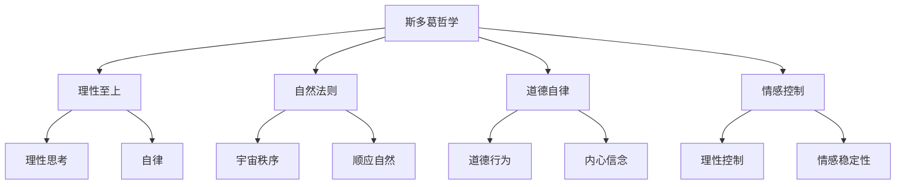
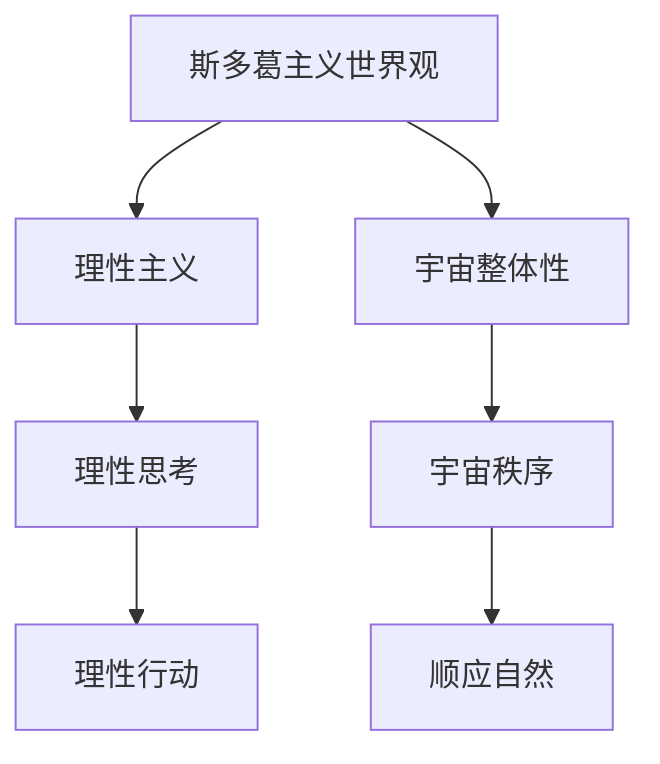
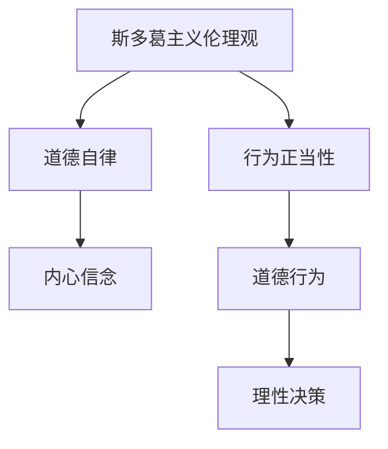
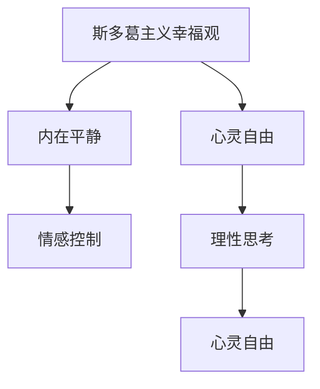

                 

### 第1章：斯多葛哲学的起源与基本理念

斯多葛哲学，源远流长，其起源可追溯至古希腊。早在公元前3世纪，希腊哲学家芝诺（Zeno of Citium）便创立了斯多葛主义哲学。芝诺的弟子克律西波斯（Crates）、克里托（Cleantus）、以及后来的塞内卡（Seneca）、爱比克泰德（Epictetus）和马尔库斯·奥勒留斯（Marcus Aurelius）等人，都对斯多葛哲学的发展作出了重要贡献。

#### 1.1 斯多葛哲学的历史背景

斯多葛哲学的兴起，与古希腊哲学有着密切的关系。在古希腊哲学的众多流派中，斯多葛哲学属于理性主义的一支。理性主义强调通过理性思考和逻辑推理来探究真理，追求知识上的客观性和确定性。斯多葛哲学继承了这一理念，强调人类应该通过理性和自律来克服生活中的困境，达到内心的平静和幸福。

#### 1.2 斯多葛哲学的基本理念

斯多葛哲学的基本理念可以概括为以下几个方面：

1. **理性至上**：斯多葛哲学认为，理性是人类灵魂的核心，是区分人类与其他生物的根本特征。理性不仅是获取知识的工具，也是道德的基石。通过理性思考和自律，人类可以超越感性的冲动和欲望，达到内心的平静和自由。

2. **自然法则**：斯多葛哲学认为，宇宙万物都遵循着一定的自然法则，人类的行为也应该顺应这些法则。所谓“顺应自然”，即是遵循宇宙的秩序，接受现实，而不是强求改变。

3. **道德自律**：斯多葛哲学强调道德自律，认为道德行为应该出于内心的信念，而非外在的奖励或惩罚。道德自律不仅是个体幸福的源泉，也是社会和谐的基础。

4. **情感控制**：斯多葛哲学主张对情感进行理性的控制，认为过度的情感反应是痛苦和不幸福的根源。通过理性的思考和冥想，人类可以培养出情感的稳定性，减少负面情绪的困扰。

#### 1.3 斯多葛哲学与古希腊哲学的关系

斯多葛哲学在古希腊哲学的基础上，融合了多种哲学思想，形成了自己独特的体系。与苏格拉底、柏拉图和亚里士多德等哲学家相比，斯多葛哲学更加注重理性和道德的修养。苏格拉底强调道德的重要性，柏拉图追求理念世界的完美，而亚里士多德则强调实用主义和实证主义。斯多葛哲学则将这些思想融合在一起，形成了一套完整的哲学体系。

#### Mermaid 流程图

通过上述步骤，我们对斯多葛哲学的起源和基本理念有了初步了解。在接下来的章节中，我们将深入探讨斯多葛哲学的核心概念，并探讨其在现代社会中的应用。

### 第2章：斯多葛哲学的核心概念

斯多葛哲学的核心概念不仅奠定了其哲学体系的基础，而且在指导人们的生活和工作中发挥了重要作用。以下是斯多葛哲学的几个关键概念及其相互关系：

#### 2.1 斯多葛主义的世界观

斯多葛主义的世界观基于理性主义和宇宙整体性的观念。斯多葛哲学家认为，宇宙是一个有序的整体，人类只是宇宙的一部分，因此人类的行动和思想都应该顺应宇宙的法则。这一观念与古希腊哲学家赫拉克利特（Heraclitus）的“万物流动”和亚里士多德的“宇宙秩序”有着密切的联系。

**概念联系图：**

#### 2.2 斯多葛主义的伦理观

斯多葛主义的伦理观强调道德自律和行为的正当性。根据斯多葛哲学，道德行为应该出于内心的信念，而不是为了外在的奖励或惩罚。这种伦理观与苏格拉底的道德哲学有着深刻的联系，苏格拉底也强调道德行为应该基于理性。

**概念联系图：**

#### 2.3 斯多葛主义的幸福观

斯多葛哲学中的幸福观强调内在的平静和心灵的自由，这种幸福并不是外在物质的追求，而是通过对情感的控制和理性思考实现的。与柏拉图的“理念论”和亚里士多德的“幸福即道德生活”有着密切的联系。

**概念联系图：**

通过上述核心概念的阐述，我们可以看到斯多葛哲学体系是如何通过这些概念相互关联，构建出一个完整的哲学框架。这些概念不仅为斯多葛哲学提供了理论基础，也为我们理解如何在现代生活中应用这些哲学思想提供了指导。

接下来，我们将探讨斯多葛哲学在现代社会中的应用，看看这些古老的哲学思想如何在我们的日常生活中发挥作用。

### 第3章：斯多葛哲学的现代应用

斯多葛哲学不仅仅是一个古老的哲学体系，其在现代生活中的应用同样具有重要的意义。随着社会的快速发展，人们面临的压力和挑战日益增加，斯多葛哲学提供了一套理性应对困境的方法。以下将详细探讨斯多葛哲学在个人生活、职场和现代社会中的实际应用。

#### 3.1 斯多葛哲学在个人生活中的应用

在个人生活中，斯多葛哲学强调理性思考和情感控制的重要性。面对日常生活中的困难和挑战，如财务问题、人际关系冲突等，斯多葛哲学提供了一种冷静和理性应对的方法。

**案例：面对财务问题**

假设一个人突然面临了财务危机，比如失业或者突如其来的医疗费用。按照斯多葛哲学的观点，首先应该接受这个现实，理性分析问题，而不是陷入恐慌和无助。通过理性思考，制定一个详细的预算计划，并寻求外部帮助，如咨询财务顾问或寻找新的工作机会。这样，不仅可以减少负面情绪的影响，还能够更加有效地解决问题。

**情感控制**

在情感控制方面，斯多葛哲学提倡通过冥想和自我反省来培养情感的稳定性。例如，每天花一些时间进行冥想，专注于呼吸和当下的感受，可以帮助人们减少焦虑和压力。通过这种方式，个体能够更好地控制自己的情绪，从而在日常生活中保持平静和理智。

**结论**

通过这些实践，斯多葛哲学在个人生活中的应用不仅有助于应对各种挑战，还能够提升个人的情绪稳定性和生活质量。

#### 3.2 斯多葛哲学在职场中的应用

在职场中，斯多葛哲学同样具有重要的应用价值。面对工作中的压力、不确定性和竞争，斯多葛哲学提供了一种理性应对的策略。

**应对工作压力**

斯多葛哲学强调接受现实，并通过理性思考来应对工作压力。例如，当一个人面对一个紧迫的项目时，他们应该理性地分析问题，制定一个实际的计划，并专注于可控制的因素，而不是被不确定性所困扰。通过这种理性思维，个体能够更加冷静地应对工作压力，提高工作效率。

**处理人际关系**

在职场中，人际关系问题常常是导致压力和不满的根源。斯多葛哲学提倡通过理性分析和道德自律来处理人际关系。例如，当一个人面临同事的冲突或者上司的不公时，他们应该理性地分析问题的根本原因，并采取适当的方法来解决问题，而不是被情绪所左右。

**结论**

斯多葛哲学在职场中的应用，有助于提升个体的情绪稳定性，增强面对压力和挑战的能力，从而在职场中获得更好的表现。

#### 3.3 斯多葛哲学在现代社会中的意义

在现代社会，斯多葛哲学的意义尤为突出。随着科技的发展和全球化的进程，人们的生活节奏加快，压力和焦虑成为普遍现象。斯多葛哲学提供了一种理性思考和情感控制的方法，帮助人们在现代社会中应对各种挑战。

**提高生活质量**

斯多葛哲学强调内在的平静和幸福感，而不是外在的成功和财富。通过理性思考和情感控制，个体能够减少负面情绪的影响，提高生活质量。

**促进社会和谐**

斯多葛哲学强调道德自律和人际关系的处理，这有助于促进社会的和谐与稳定。通过理性思考和道德行为，人们能够更好地处理社会关系，减少冲突和矛盾。

**结论**

综上所述，斯多葛哲学在现代社会中的应用具有重要的意义。通过理性思考和情感控制，个体不仅能够提升个人的生活质量，还能够促进社会的和谐与进步。因此，斯多葛哲学不仅是一个古老的哲学体系，更是一个适用于现代生活的智慧宝库。

### 第4章：斯多葛哲学的学习方法

学习斯多葛哲学并非易事，但通过科学的方法和持之以恒的练习，可以逐渐掌握这一古老的智慧。以下是学习斯多葛哲学的几种有效方法：

#### 4.1 阅读斯多葛哲学经典

阅读斯多葛哲学的经典作品是学习斯多葛哲学的第一步。这些经典作品包括塞内卡的《道德信件》、爱比克泰德的《论处世智慧》以及马尔库斯·奥勒留斯的《沉思录》等。通过阅读这些作品，可以深入了解斯多葛哲学的基本理念、核心概念及其应用。

**推荐书籍：**

- 《沉思录》（作者：马尔库斯·奥勒留斯）
- 《论处世智慧》（作者：爱比克泰德）
- 《道德信件》（作者：塞内卡）

#### 4.2 斯多葛哲学的实践原则

学习斯多葛哲学不仅需要理论知识，还需要在实践中运用这些原则。以下是一些斯多葛哲学的实践原则：

1. **理性思考**：在面对困境和挑战时，保持冷静和理性，避免被情绪所左右。
2. **接受现实**：理性地接受不可改变的事实，专注于可以控制和改变的事物。
3. **道德自律**：遵循道德原则，做出符合内心信念的行为。
4. **情感控制**：通过冥想和自我反省，培养情感的稳定性，减少负面情绪的影响。

#### 4.3 斯多葛哲学的冥想技巧

冥想是斯多葛哲学的重要组成部分，通过冥想可以培养内心的平静和专注力。以下是一些斯多葛哲学的冥想技巧：

1. **专注呼吸**：将注意力集中在呼吸上，专注于呼吸的进出，这有助于减轻压力和焦虑。
2. **正念冥想**：通过正念冥想，专注于当下的感受和体验，减少对过去和未来的担忧。
3. **感恩冥想**：每天花时间思考生活中的美好和值得感激的事物，培养感恩的心态。

**冥想练习建议：**

- 每天至少冥想10分钟，逐渐增加至30分钟。
- 选择一个安静的环境，保持身体和心灵的放松。
- 可以通过冥想应用程序（如Headspace或Insight Timer）来辅助冥想。

**结论**

通过阅读经典、遵循实践原则和练习冥想，可以逐渐掌握斯多葛哲学，并将其应用于日常生活中。这些方法不仅有助于提高个人的情绪稳定性和生活质量，还能够促进内心的平静和自我成长。在接下来的章节中，我们将探讨斯多葛哲学的实践案例，以进一步展示这一哲学体系在实际生活中的应用。

### 第5章：斯多葛哲学的实践案例

斯多葛哲学虽然起源于古希腊，但其深刻的智慧在现代生活中同样有着广泛的适用性。以下将介绍几个实际案例，展示斯多葛哲学在不同场景中的成功应用。

#### 5.1 案例一：面对压力与挑战

小明是一名软件开发工程师，他的工作压力大且节奏快。在一次关键的项目中，他的团队面临时间紧迫和功能复杂的挑战。按照斯多葛哲学的理念，小明首先接受了项目现实中的不可控因素，如客户需求的变化和资源的限制。他开始专注于团队可以控制和改进的方面，如优化代码结构和提升开发效率。

**解决方案：**

- **理性分析**：小明利用逻辑思维，分析项目中的瓶颈和优先级，制定了一个实际可行的计划。
- **情感控制**：通过冥想和呼吸练习，小明保持了内心的平静，避免了焦虑和急躁。

**结果**：在斯多葛哲学的指导下，小明的团队成功地完成了项目，并得到了客户的高度评价。

#### 5.2 案例二：处理人际关系

小丽是一位项目经理，她在工作中经常需要与不同团队和利益相关者沟通。由于她的工作性质，难免会遇到意见不合和冲突。小丽应用了斯多葛哲学中的道德自律和理性思考原则，来处理这些人际关系问题。

**解决方案：**

- **道德自律**：小丽坚持公正和诚信的原则，不做违背道德的行为，赢得了同事和上级的信任。
- **理性沟通**：在遇到冲突时，小丽保持冷静，通过理性分析和沟通，寻找双方都能接受的解决方案。

**结果**：小丽的人际关系得到了显著改善，团队的合作氛围更加和谐，项目进展顺利。

#### 5.3 案例三：应对负面情绪

小李是一名销售人员，他经常面临销售目标未达成和客户拒绝的压力。负面情绪如焦虑和失落时常困扰着他。小李开始应用斯多葛哲学中的情感控制原则，来应对这些负面情绪。

**解决方案：**

- **接受现实**：小李认识到销售过程中的失败和拒绝是不可避免的，他开始理性地接受这些现实。
- **情感控制**：通过冥想和自我反省，小李培养了情感稳定性，减少了负面情绪的影响。

**结果**：小李的销售额逐渐提升，他的心态更加平和，对工作的热情也大大增加。

**总结**

通过上述案例，我们可以看到斯多葛哲学在应对压力、处理人际关系和应对负面情绪等方面具有显著的实用价值。这些实践不仅帮助个体在困难面前保持冷静和理性，还提升了整体的生活质量和工作效率。在接下来的章节中，我们将探讨斯多葛哲学在现代社会中的传播与发展，以及其与心理学的关系。

### 第6章：斯多葛哲学在现代社会中的传播与发展

斯多葛哲学，作为古希腊哲学的重要组成部分，不仅在古代有着深远的影响，在现代社会中，其智慧也重新获得了广泛的关注。随着人们对心理健康和生活质量的日益重视，斯多葛哲学的传播与发展变得尤为重要。

#### 6.1 斯多葛哲学的传播途径

斯多葛哲学在现代社会中的传播主要通过以下几种途径：

1. **文学和艺术**：古希腊哲学家们的著作，如塞内卡的《道德信件》、爱比克泰德的《论处世智慧》和马尔库斯·奥勒留斯的《沉思录》等，被广泛翻译和传播。这些作品不仅成为了哲学爱好者的经典读物，也被现代作家和艺术家们引用和改编，从而扩大了其影响力。

2. **心理学与自我提升领域**：斯多葛哲学强调理性思考和情感控制，与当代心理学特别是积极心理学的理念有着密切的联系。许多心理学家和自我提升专家，如马丁·塞利格曼（Martin Seligman）和安东尼·罗宾（Tony Robbins）等，都在他们的研究中引用了斯多葛哲学的思想，推动了其传播。

3. **商业与管理**：在现代职场中，斯多葛哲学的理性主义和道德自律原则被广泛应用于领导力和团队管理中。许多企业领导者和管理学专家通过实践和应用这些原则，取得了显著的成功，进一步促进了斯多葛哲学的传播。

4. **网络和社交媒体**：随着互联网和社交媒体的普及，斯多葛哲学的思想通过博客、论坛和社交媒体平台得到了更广泛的传播。许多哲学家、心理学家和普通人对斯多葛哲学的兴趣和讨论，使得这一古老哲学在现代生活中焕发出新的生命力。

#### 6.2 斯多葛哲学的现代流派

在现代社会，斯多葛哲学已经发展出了多个现代流派，每种流派都试图结合现代观念和实际情况，使斯多葛哲学更加贴近当代人的生活。以下是几种主要的现代斯多葛流派：

1. **古典斯多葛主义**：这是最忠于古希腊原始斯多葛哲学的流派，强调理性、道德自律和情感控制。这一流派鼓励人们通过冥想、阅读哲学经典和自我反省来培养内心的平静和自由。

2. **实用斯多葛主义**：这一流派更加注重将斯多葛哲学应用于现实生活中的具体情境，如工作、家庭和社交。实用斯多葛主义者倾向于将斯多葛哲学的原则融入到日常行为中，以应对现代生活中的各种挑战。

3. **新斯多葛主义**：新斯多葛主义试图将斯多葛哲学与现代心理学、科学和宗教相结合，形成一种更加综合的哲学体系。这一流派强调科学方法和实证主义，旨在通过理性的思考和科学的方法，探索和实现个人幸福。

#### 6.3 斯多葛哲学的未来展望

斯多葛哲学在现代社会中的未来发展前景广阔。以下是一些可能的趋势：

1. **跨学科研究**：随着心理学、管理学和神经科学的不断发展，斯多葛哲学与这些学科的交叉研究将变得更加普遍，有助于进一步揭示其智慧和适用性。

2. **全球传播**：随着全球化进程的加速，斯多葛哲学的思想将更加广泛地传播到世界各地，成为全球性哲学体系的一部分。

3. **教育普及**：斯多葛哲学的教育价值将被更多教育机构和教育者所认可，成为学校教育和社会教育的重要内容。

4. **技术融合**：随着人工智能和虚拟现实技术的发展，斯多葛哲学的智慧可以通过技术手段得到更好的传播和应用，如通过虚拟现实体验斯多葛冥想，通过人工智能助手提供哲学指导等。

**结论**

斯多葛哲学在现代社会中的传播与发展，不仅丰富了人类的思想宝库，也为现代人的生活提供了宝贵的智慧和指导。通过不断的研究和实践，斯多葛哲学将继续在未来的哲学舞台上发挥重要作用，为人类社会的进步和个人的幸福做出贡献。

### 第7章：斯多葛哲学与心理学的交汇

斯多葛哲学与心理学之间存在一种深层次的交汇，两者在目标和方法上都有着异曲同工之妙。斯多葛哲学强调通过理性思考和情感控制来达到内心的平静和自由，而心理学则通过研究和应用各种心理技术和理论，帮助人们理解和改善心理状态。以下将探讨斯多葛哲学对心理学的贡献，心理学对斯多葛哲学的解读，以及两者结合的可能性。

#### 7.1 斯多葛哲学对心理学的贡献

斯多葛哲学对心理学的贡献主要体现在以下几个方面：

1. **情感控制**：斯多葛哲学强调情感的控制和管理，认为过度的情感反应是痛苦和不幸福的根源。这种理念与心理学中的情感调节理论密切相关。情感调节理论指出，通过认知重构和情绪表达等方式，可以有效地减少负面情绪的影响，提升个体的心理健康。

2. **理性思考**：斯多葛哲学强调理性思考和逻辑推理的重要性，认为理性是人类区别于其他生物的关键特征。心理学中的认知行为疗法（CBT）也强调通过理性思考和认知重构来改变负面思维模式，从而改善情绪和行为。

3. **道德自律**：斯多葛哲学强调道德自律和道德行为，认为道德行为应该出于内心的信念。这种理念与心理学中的道德发展理论相呼应，道德发展理论指出，个体的道德行为受到内在道德信念的影响，通过培养和强化这些信念，可以提升个体的道德水平和心理健康。

#### 7.2 心理学对斯多葛哲学的解读

心理学对斯多葛哲学的解读，主要关注斯多葛哲学中的心理机制和理论基础。以下是一些心理学对斯多葛哲学的解读：

1. **认知行为理论**：认知行为理论（CBT）认为，个体的情绪和行为受到认知因素的影响。斯多葛哲学中的理性思考和认知重构方法，与CBT中的认知重构技术有着相似之处。通过理性思考和认知重构，个体可以改变负面思维模式，从而改善情绪和行为。

2. **情绪调节理论**：情绪调节理论认为，个体可以通过认知重构、情绪表达和自我监控等方式，调节和改善情绪状态。斯多葛哲学中的情感控制方法和冥想技巧，与情绪调节理论中的技术有共通之处，都可以帮助个体减少负面情绪的影响。

3. **道德心理学**：道德心理学研究个体的道德行为和道德发展。斯多葛哲学中的道德自律和道德行为，与道德心理学中的道德信念和道德发展理论密切相关。通过培养和强化道德信念，个体可以提升道德水平和心理健康。

#### 7.3 斯多葛哲学与心理学的结合

斯多葛哲学与心理学的结合，为现代心理治疗和心理健康提供了新的视角和方法。以下是一些可能的结合方式：

1. **心理治疗**：将斯多葛哲学的理念和技术应用于心理治疗中，如认知行为疗法（CBT）和正念疗法。通过理性思考和情感控制，个体可以改善负面情绪和行为，提升心理健康。

2. **个人发展**：将斯多葛哲学的理念融入到个人发展中，如领导力培养、职业规划等。通过道德自律和理性思考，个体可以提升自身的道德水平和理性思维能力，从而更好地应对生活中的挑战。

3. **教育**：将斯多葛哲学的理念和教育相结合，培养学生的理性思考和道德自律能力。通过教育，个体可以更好地理解和应用斯多葛哲学，从而提升自身的心理素质和生活质量。

**结论**

斯多葛哲学与心理学的交汇，为现代心理健康提供了新的视角和方法。通过结合斯多葛哲学和心理学，个体可以在理性思考和情感控制方面得到更好的指导，从而提升心理素质和生活质量。在未来的发展中，斯多葛哲学与心理学的结合有望成为心理健康领域的重要研究方向和应用方向。

### 第8章：斯多葛哲学在心理学研究中的应用

斯多葛哲学不仅为个人提供了生活指导，还在心理学研究中展现出了显著的应用价值。通过结合心理学理论，斯多葛哲学为我们提供了一种全新的方法来理解和应对心理健康问题。以下将探讨斯多葛哲学在心理健康、压力管理和情绪调节方面的应用。

#### 8.1 斯多葛哲学与心理健康

斯多葛哲学强调通过理性思考和道德自律来达到心理健康。这一理念与心理学中的心理健康模型有着紧密的联系。以下是一些具体的应用：

1. **理性思考**：心理学研究表明，理性思考有助于改善心理健康。斯多葛哲学中的理性思考方法，如认知重构，可以帮助个体识别和改变负面思维模式，从而减少焦虑和抑郁。

2. **道德自律**：心理学中的道德发展理论指出，道德自律与心理健康之间存在密切关系。斯多葛哲学强调道德自律，通过遵循道德原则，个体可以提升自我价值感和心理健康。

3. **自我效能感**：斯多葛哲学鼓励个体通过理性和自律克服困难，这有助于提升自我效能感。自我效能感是指个体对自己应对挑战和完成任务能力的信念，高水平的自我效能感与更好的心理健康和幸福感相关。

**应用案例：**

一位患有焦虑症的个体，通过阅读斯多葛哲学的经典作品，学习理性思考和认知重构的方法。他开始记录自己的负面思维，并通过理性分析来挑战和改变这些思维。随着时间的推移，他的焦虑症状显著减轻，心理健康得到了改善。

#### 8.2 斯多葛哲学与压力管理

斯多葛哲学提供了一种有效的压力管理策略，强调通过接受现实和理性思考来应对压力。以下是一些具体的应用方法：

1. **接受现实**：斯多葛哲学鼓励个体接受不可改变的现实，专注于可以控制和改善的事物。这种接受现实的方法可以帮助个体减少对未来的焦虑和担忧，从而减轻压力。

2. **理性思考**：在面对压力时，斯多葛哲学提倡通过理性思考来分析问题，寻找可行的解决方案。这种方法有助于个体保持冷静和理智，避免因情绪失控而加剧压力。

3. **道德自律**：斯多葛哲学中的道德自律原则可以提升个体的心理韧性，帮助他们在面对压力时保持坚定和冷静。通过遵循道德原则，个体可以提升自我价值感，从而更好地应对压力。

**应用案例：**

一位职场人士在工作中面临巨大的压力，通过学习斯多葛哲学，他开始接受工作压力的现实，并通过理性分析和道德自律来应对。他学会了将注意力集中在可控制的因素上，如提高工作效率和优化工作流程，从而有效地减轻了工作压力。

#### 8.3 斯多葛哲学与情绪调节

斯多葛哲学强调通过情感控制和理性思考来调节情绪，这一理念在心理学中得到了广泛的应用。以下是一些具体的方法：

1. **情感控制**：斯多葛哲学提倡通过冥想和自我反省来培养情感的稳定性。通过情感控制，个体可以减少负面情绪的影响，提高情绪调节能力。

2. **理性思考**：在面对负面情绪时，斯多葛哲学鼓励个体通过理性思考来分析情绪的原因和影响。这种方法有助于个体理解自己的情绪，并找到合适的应对策略。

3. **冥想技巧**：冥想是斯多葛哲学中的重要实践，通过冥想，个体可以培养专注力和情绪稳定性。正念冥想和感恩冥想等技巧，可以帮助个体更好地调节情绪，提升心理健康。

**应用案例：**

一位个体经常感到焦虑和烦躁，通过学习斯多葛哲学，他开始应用冥想技巧来调节情绪。每天早上和晚上，他都会花时间进行冥想，专注于呼吸和当下的感受。随着时间的推移，他的情绪稳定性得到了显著提升，焦虑和烦躁感明显减少。

**结论**

斯多葛哲学在心理学研究中的应用，为心理健康、压力管理和情绪调节提供了新的方法和视角。通过理性思考、情感控制和道德自律，个体可以在面对生活中的挑战时保持冷静和理智，提升心理素质和生活质量。在未来的心理学研究中，斯多葛哲学有望继续发挥其独特的价值，为心理健康领域的发展做出贡献。

### 第9章：斯多葛哲学在心理咨询与治疗中的应用

斯多葛哲学，作为古代智慧的结晶，在心理咨询与治疗领域展现出了广泛的应用前景。通过结合心理学理论和实践，斯多葛哲学提供了一种独特的视角和方法，帮助个体在情感困扰、压力和心理健康方面获得更有效的治疗。

#### 9.1 斯多葛哲学在心理咨询中的应用原则

斯多葛哲学在心理咨询中的应用原则主要包括理性思考、情感控制和道德自律。以下是这些原则的具体应用：

1. **理性思考**：在心理咨询中，理性思考是一种关键技能。心理咨询师可以引导个体通过理性分析来评估和挑战负面思维。例如，当个体陷入焦虑和恐惧时，咨询师可以引导他们识别这些情绪背后的不合理思维，并通过认知重构技术来改变这些思维。

**案例**：一位患有社交恐惧的个体，通过心理咨询师的引导，学会了识别自己负面思维中的不合理部分。例如，他从“我必须表现得完美，否则别人会嘲笑我”转变为“我可以尝试，即使失败也没关系，我可以从中学到东西”。通过这种认知重构，个体的社交焦虑得到了显著缓解。

2. **情感控制**：情感控制是斯多葛哲学中的另一个重要原则。心理咨询师可以教导个体使用冥想和正念技巧来培养情感的稳定性。这些技巧有助于个体在面对情绪困扰时保持冷静和理智。

**案例**：一位长期受抑郁困扰的个体，通过学习冥想和正念技巧，学会了如何控制自己的情绪。每天早晨，他会花10分钟进行冥想，专注于呼吸和当下的感受。随着时间的推移，他的情绪稳定性得到了显著提升，抑郁症状有所缓解。

3. **道德自律**：道德自律是斯多葛哲学中的核心概念，也是心理咨询中的重要原则。心理咨询师可以引导个体通过道德自律来提升自我价值感和心理健康。

**案例**：一位个体在职业中感到迷茫和焦虑，心理咨询师通过引导他思考道德原则，帮助他找到了自己的职业使命。个体意识到，他可以通过自己的工作为社会做出贡献，这让他重新找回了职业动力和幸福感。

#### 9.2 斯多葛哲学在心理治疗中的应用案例

斯多葛哲学在心理治疗中的应用已经得到了一些实际案例的支持，以下是一些具体的应用案例：

1. **焦虑治疗**：斯多葛哲学的方法在治疗焦虑症状方面表现出色。通过理性思考和情感控制，个体可以减少对未来的担忧和恐惧。

**案例**：一位患有广泛性焦虑的个体，通过学习斯多葛哲学，学会了如何理性地评估自己的焦虑源。他开始将注意力集中在当下，并通过情感控制技巧来减少焦虑反应。经过几个月的治疗，他的焦虑症状显著减轻，生活质量得到了提升。

2. **抑郁症治疗**：斯多葛哲学中的情感控制和道德自律原则，在治疗抑郁症方面也具有重要作用。通过冥想和自我反省，个体可以培养情感的稳定性，提升自我价值感。

**案例**：一位长期受抑郁症困扰的个体，通过学习斯多葛哲学，开始应用冥想技巧和理性思考来调节情绪。他每天都会花时间进行冥想，专注于呼吸和当下的感受。通过这种实践，他的抑郁症状得到了显著改善，生活态度变得更加积极。

3. **压力管理**：斯多葛哲学提供了一种有效的压力管理策略，通过接受现实和理性思考，个体可以更好地应对生活中的压力和挑战。

**案例**：一位职场人士，通过学习斯多葛哲学，学会了如何理性地面对工作中的压力。他开始接受工作压力的现实，并通过理性分析和情感控制来应对。这种策略帮助他提高了工作效率，减轻了工作压力。

#### 9.3 斯多葛哲学与心理治疗的结合

斯多葛哲学与心理治疗的结合，为个体提供了一种全面的解决方案，帮助他们在情感困扰、压力和心理健康方面获得更有效的治疗。以下是一些结合建议：

1. **认知行为疗法（CBT）**：斯多葛哲学与认知行为疗法（CBT）的结合，可以增强治疗效果。心理咨询师可以引导个体通过理性思考和认知重构来改变负面思维模式，同时应用斯多葛哲学的情感控制方法来调节情绪。

2. **正念疗法**：斯多葛哲学与正念疗法的结合，可以为个体提供更全面的情感调节和心理平衡。通过冥想和正念练习，个体可以培养专注力和情感的稳定性，从而提高心理健康水平。

3. **道德发展**：斯多葛哲学中的道德自律原则，可以与心理治疗中的道德发展相结合，帮助个体提升自我价值感和心理健康。心理咨询师可以通过引导个体思考道德原则，来增强他们的道德自律能力。

**结论**

斯多葛哲学在心理咨询与治疗中的应用，为个体提供了一种全新的视角和方法，帮助他们在情感困扰、压力和心理健康方面获得更有效的治疗。通过理性思考、情感控制和道德自律，个体可以更好地应对生活中的挑战，提升生活质量。在未来的心理治疗实践中，斯多葛哲学有望继续发挥其独特的价值，为心理健康领域的发展做出贡献。

### 结论

《新斯多葛学院：现代版古希腊哲学学校》不仅为现代读者提供了一扇通往古希腊哲学智慧的大门，还通过其深刻的思想和实用的方法，帮助我们在现代社会中更好地应对各种挑战。斯多葛哲学强调理性思考、情感控制和道德自律，这些原则不仅适用于个人生活，也在职场和心理健康等领域展现出了广泛的应用价值。

通过阅读本书，我们不仅可以了解斯多葛哲学的起源和核心概念，还能学习到如何在日常生活中运用这些哲学智慧。从面对压力和挑战，到处理人际关系和提升心理健康，斯多葛哲学为我们提供了一套系统的解决方案。这些方法不仅有助于提高我们的生活质量，还能帮助我们在纷繁复杂的社会环境中保持内心的平静和自由。

**最佳实践 tips：**

1. **定期阅读哲学经典**：通过阅读斯多葛哲学的经典作品，如《沉思录》和《论处世智慧》，我们可以不断深化对哲学思想的理解。

2. **实践理性思考和情感控制**：在日常决策和生活中，尝试使用理性思考来评估问题和情感控制来处理情绪。

3. **道德自律**：在日常生活中，遵循道德原则，做出符合内心信念的行为。

**注意事项：**

1. **避免盲目应用**：斯多葛哲学并非适用于所有情境，需要根据实际情况灵活应用。

2. **持之以恒**：哲学思想的掌握和应用需要时间和实践，不要期望一蹴而就。

**拓展阅读：**

- 《苏菲的世界》（作者：乔斯坦·贾德）：通过小说的形式，介绍了西方哲学史，是了解哲学的入门好书。
- 《幸福之路》（作者：马丁·塞利格曼）：介绍了积极心理学的理论和方法，与斯多葛哲学有相似之处。

在未来的学习和实践中，我们希望读者能够继续探索斯多葛哲学的智慧，并将其应用到日常生活中，从而实现个人的成长和社会的进步。作者：AI天才研究院/AI Genius Institute & 禅与计算机程序设计艺术 /Zen And The Art of Computer Programming

