                 

# 新时代哲学家咖啡馆：现代生活困惑解答空间

> 关键词：现代生活困惑、哲学、心理学、经济学、社会学、人工智能、解决方案

> 摘要：本文旨在探讨新时代背景下现代生活中的困惑，通过哲学、心理学、经济学和社会学等多学科视角，提供解答困惑的思路和方法。文章首先概述了现代生活困惑的起源和类型，然后从哲学、心理学、经济学和社会学四个维度分析困惑的解答，最后探讨科技与未来生活困惑，并提出跨学科综合解答的可能性。

## 引言

在快速发展的现代社会，人们面临着越来越多的生活困惑。这些困惑源自各种复杂的因素，包括人际关系、工作压力、道德伦理、社会变迁等。面对这些困惑，人们往往感到无助和迷茫。因此，寻找解答困惑的方法和途径成为现代社会的一大挑战。

本文以“新时代哲学家咖啡馆：现代生活困惑解答空间”为主题，试图通过哲学、心理学、经济学和社会学等多学科视角，为现代生活困惑提供解答方案。文章将从以下几个方面展开：

1. 现代生活困惑概述：介绍现代生活困惑的起源、类型及其影响。
2. 哲学家视角下的困惑解答：分析存在主义、道德哲学和政治哲学在解答人生困惑中的作用。
3. 心理学视角下的困惑解答：探讨精神分析理论、认知行为理论和人本主义心理学在应对情感困惑、认知困惑和个人成长困惑方面的贡献。
4. 经济学视角下的困惑解答：分析经济学原理、财务管理理论和经济伦理在解决财富困惑、投资困惑和消费困惑中的应用。
5. 社会学视角下的困惑解答：探讨社会结构、文化冲突和社会运动在解答社交困惑、身份困惑和公共困惑方面的作用。
6. 科技与未来生活困惑：讨论科技进步、信息爆炸和人工智能对就业、信息和伦理困惑的影响。
7. 跨学科综合解答：总结前述各学科视角，探讨跨学科综合解答现代生活困惑的可能性。

通过以上七个方面的探讨，本文希望能为读者提供一种全新的思考和解决问题的方法，帮助人们更好地应对现代生活中的困惑。

## 第1章：现代生活困惑概述

### 1.1 现代生活困惑的起源

现代生活困惑的起源可以追溯到工业革命以来人类社会的快速变革。在传统农业社会，人们的生活节奏相对缓慢，社会结构稳定，人们的心理状态和人际关系相对简单。然而，随着工业革命和科技进步，人类社会发生了翻天覆地的变化。生产力的提高、城市化进程的加速、全球化的发展，使得人们的生活节奏日益加快，生活压力不断增大。此外，信息爆炸和媒体传播的普及，使得人们面临的信息量和认知负担显著增加，从而导致了各种生活困惑的产生。

### 1.2 现代生活困惑的类型

现代生活困惑可以分为多种类型，主要包括：

1. **人际关系困惑**：在现代社会，人们面临的人际关系问题日益复杂，包括家庭关系、朋友关系和职场关系等。人际关系的处理需要较高的沟通技巧和情感智慧，否则容易陷入困惑。

2. **工作压力困惑**：现代社会的竞争激烈，工作压力大，很多人感到身心疲惫。工作与生活的平衡问题成为困扰现代人的一个重要方面。

3. **道德伦理困惑**：随着社会的多元化，人们面对的道德伦理问题越来越复杂。如何处理道德冲突、如何在复杂的道德情境中做出正确的选择，成为人们困扰的一个重要方面。

4. **个人成长困惑**：在现代社会，个人成长问题受到广泛关注。如何实现自我价值、如何处理个人兴趣与职业发展之间的矛盾，是许多人面临的困惑。

5. **身份认同困惑**：全球化进程使得人们面对的文化冲击更加剧烈，如何处理文化认同与个人身份之间的关系，成为许多人困惑的一个重要方面。

### 1.3 现代生活困惑的影响

现代生活困惑对人们的生活质量和心理健康产生了深远的影响。长期的困惑和压力会导致焦虑、抑郁等心理问题，影响个人的生活质量。此外，困惑还会影响人际关系和工作效率，从而进一步加剧生活压力。

为了应对现代生活困惑，人们需要积极寻求解决方案，通过自我调节、心理咨询和社会支持等多种途径，缓解生活压力，提升生活质量。同时，社会也需要提供更多的支持和资源，帮助人们更好地应对生活中的困惑。

## 第2章：哲学家视角下的困惑解答

### 2.1 存在主义与人生困惑

存在主义是20世纪哲学的一个重要流派，代表人物有萨特、海德格尔和尼采等。存在主义关注个体的存在状态和自由意志，主张通过自主选择和行动来定义自己的人生意义。

**核心概念：**

1. **自由意志**：存在主义认为，个体的自由意志是其存在的核心，人应该为自己的选择承担责任。
2. **自我实现**：存在主义强调，个体应该通过自我实现来寻找人生的意义，而不是被动地接受外部环境的安排。
3. **恐惧和焦虑**：存在主义认为，恐惧和焦虑是人的存在状态的一部分，通过面对和接受这些情感，个体可以更好地理解自己。

**联系与关系架构：**

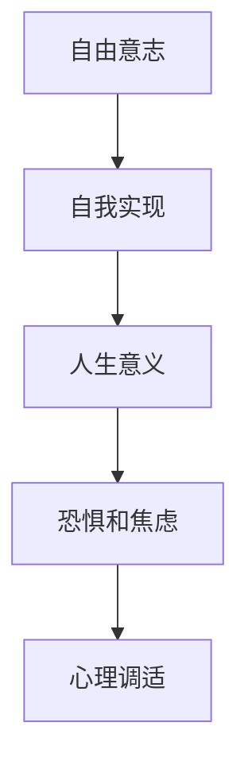

**核心算法原理讲解：**

```python
# 自由意志与自我实现
def existential自由意志(self, action):
    # 分析个体的选择与行动
    choice = self.get_choice(action)
    # 承担责任
    self.承担 trách nhiệm(choice)

# 自我实现与人生意义
def existential_self_实现(self, goal):
    # 设定目标
    self.set_goal(goal)
    # 动手实现目标
    self.实现目标(goal)

# 恐惧和焦虑的心理调适
def existential_心理调适(self, emotion):
    # 面对情感
    self.面对情感(emotion)
    # 接受情感
    self.接受情感(emotion)
```

**举例说明：**

假设一个人面临着职业选择的困惑，他可以通过存在主义的思路来解决这个问题。首先，他需要意识到自己的自由意志，明确自己的兴趣和价值观。然后，他需要设定一个具体的职业目标，并付诸行动去实现。在这个过程中，他可能会感到恐惧和焦虑，但通过面对和接受这些情感，他可以更好地理解自己，找到自己的人生意义。

### 2.2 道德哲学与道德困惑

道德哲学是探讨道德原则和道德行为的哲学分支，主要包括功利主义、康德伦理学和美德伦理学等流派。道德哲学为人们提供了解决道德困惑的理论基础。

**核心概念：**

1. **功利主义**：功利主义认为，道德行为应该基于行为的功利后果，即行为是否能够最大化幸福。
2. **康德伦理学**：康德伦理学强调，道德行为应该基于道德律令，即行为是否符合普遍的道德原则。
3. **美德伦理学**：美德伦理学认为，道德行为应该基于培养良好的品德和习惯。

**联系与关系架构：**

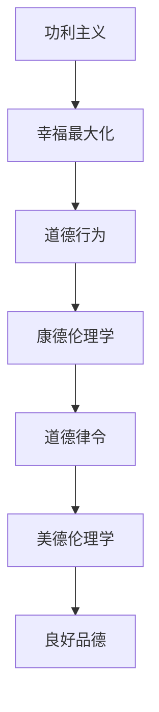

**核心算法原理讲解：**

```python
# 功利主义与道德行为
def utilitarian_action(self, action):
    # 分析行为的功利后果
    consequence = self.get_consequence(action)
    # 判断行为是否幸福最大化
    if consequence > 0:
        self.execute_action(action)

# 康德伦理学与道德律令
def kantian_morality(self, action):
    # 检查行为是否符合道德律令
    if self.check_law(action):
        self.execute_action(action)

# 美德伦理学与良好品德
def virtue伦理学(self, virtue):
    # 培养良好品德
    self.develop_virtue(virtue)
```

**举例说明：**

假设一个人面临是否欺骗他人以获取利益的道德困惑，他可以通过功利主义、康德伦理学和美德伦理学的思路来解决这个问题。首先，他需要分析欺骗行为对双方的利益影响，判断是否幸福最大化。其次，他需要检查自己的行为是否符合普遍的道德原则，如诚实和公正。最后，他需要反思自己的品德，判断是否具备良好的品德，如诚实和正直。通过这些步骤，他可以找到解决道德困惑的方法。

### 2.3 政治哲学与社会困惑

政治哲学是探讨政治制度、国家性质和政治权力的哲学分支，主要包括自由主义、社会主义和社群主义等流派。政治哲学为解决社会困惑提供了理论指导。

**核心概念：**

1. **自由主义**：自由主义认为，个体拥有自由和权利，政府的职责是保障这些自由和权利。
2. **社会主义**：社会主义主张社会的资源和财富应该公平分配，以消除贫富差距。
3. **社群主义**：社群主义认为，个体和社会之间存在着紧密的联系，个体的利益应该与社群的利益相一致。

**联系与关系架构：**

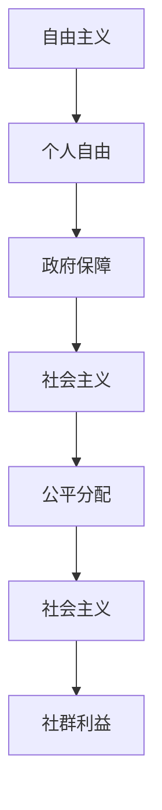

**核心算法原理讲解：**

```python
# 自由主义与政府保障
def libertarian_government(self, policy):
    # 分析政策是否符合个人自由
    if self.check_liberty(policy):
        self.implement_policy(policy)

# 社会主义与公平分配
def socialist_distribution(self, wealth):
    # 分析财富分配是否公平
    if self.check_justice(wealth):
        self.redistribute_wealth()

# 社群主义与社群利益
def communitarian_interest(self, action):
    # 分析行为是否符合社群利益
    if self.check_community(action):
        self.execute_action(action)
```

**举例说明：**

假设一个国家面临贫富差距过大的社会困惑，政府可以通过自由主义、社会主义和社群主义的思路来解决这个问题。首先，政府可以制定政策，保障个人的自由和权利，减少对自由的限制。其次，政府可以通过税收和福利政策，实现财富的公平分配，缩小贫富差距。最后，政府可以推动社区建设和社群活动，增强社会凝聚力和共同体意识，从而解决社会困惑。

## 第3章：心理学视角下的困惑解答

### 3.1 精神分析理论与情感困惑

精神分析理论是由弗洛伊德创立的一种心理学流派，它探讨了人类心理的深层结构和动力机制。精神分析理论为解决情感困惑提供了重要的视角。

**核心概念：**

1. **潜意识**：潜意识是指人类心理活动的一部分，它包含了人类无法直接意识到的欲望、动机和情感。
2. **防御机制**：防御机制是指个体在面对心理冲突和压力时，为了保护自己而采取的心理策略，如压抑、投射和反向形成。
3. **心理分析**：心理分析是通过探索潜意识，揭示个体内心的冲突和欲望，从而帮助个体理解和解决情感困惑。

**联系与关系架构：**

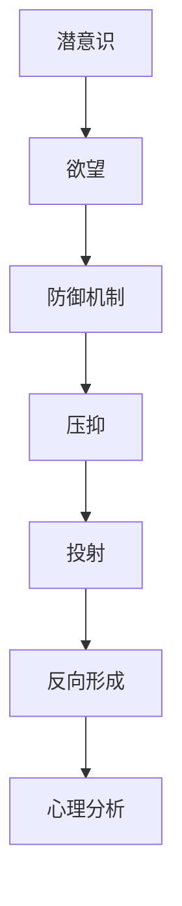

**核心算法原理讲解：**

```python
# 潜意识与欲望
def psychoanalysis unconscious(self, desire):
    # 分析潜意识中的欲望
    self.analyze_desire(desire)

# 防御机制与压抑
def defense_mechanism suppression(self, conflict):
    # 应用压抑机制
    self.apply_suppression(conflict)

# 心理分析与情感困惑
def psychoanalysis解决(self, confusion):
    # 通过心理分析解决情感困惑
    self.solve_confusion(confusion)
```

**举例说明：**

假设一个人在情感上感到困惑和痛苦，他可以通过精神分析理论的视角来解决这个问题。首先，他需要探索自己的潜意识，了解自己内心的欲望和冲突。然后，他可以通过防御机制，如压抑，来应对这些冲突。最后，通过心理分析，他可以揭示自己的潜意识冲突，找到情感困惑的根源，并寻求解决方案。

### 3.2 认知行为理论与认知困惑

认知行为理论是一种结合认知心理学和行为心理学的理论，它强调认知在情绪和行为中的作用。认知行为理论为解决认知困惑提供了有效的策略。

**核心概念：**

1. **认知**：认知是指个体对信息的获取、处理和存储过程，包括感知、记忆、思维和决策等。
2. **认知重构**：认知重构是指通过改变负面的认知模式，来改善情绪和行为。
3. **行为策略**：行为策略是指通过改变行为，来影响认知和情绪。

**联系与关系架构：**

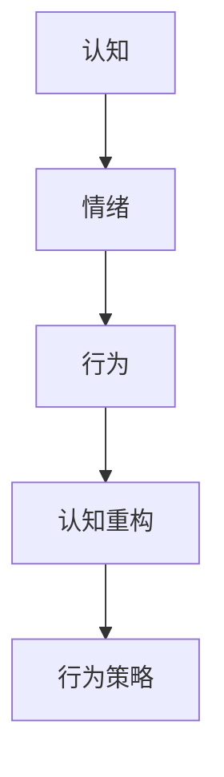

**核心算法原理讲解：**

```python
# 认知与情绪
def cognitive_affect(self, information):
    # 分析信息对情绪的影响
    self.analyze_affect(information)

# 认知重构与情绪改善
def cognitive_restructuring(self, thought):
    # 改变负性认知
    self.change_negative_thought(thought)

# 行为策略与行为改变
def behavioral_strategy(self, action):
    # 通过行为策略改变行为
    self.change_action(action)
```

**举例说明：**

假设一个人在面临工作压力时感到焦虑和不安，他可以通过认知行为理论的视角来解决这个问题。首先，他需要分析工作压力对情绪的影响，识别出负性的认知模式。然后，他可以通过认知重构，改变负性的认知，如将工作压力视为挑战而不是威胁。最后，他可以通过行为策略，如锻炼、休息和放松，来改善情绪，从而解决认知困惑。

### 3.3 人本主义心理学与个人成长困惑

人本主义心理学是一种关注个体自我实现和心理健康的心理学流派，代表人物有马斯洛和罗杰斯。人本主义心理学为解决个人成长困惑提供了重要的理论支持。

**核心概念：**

1. **自我实现**：自我实现是指个体在成长过程中，不断追求自我潜能的实现，达到自我认知和自我价值的最大化。
2. **自我概念**：自我概念是指个体对自己身份、能力和价值的认知和评价。
3. **心理支持**：心理支持是指通过提供情感支持和鼓励，帮助个体克服成长中的困难和挑战。

**联系与关系架构：**

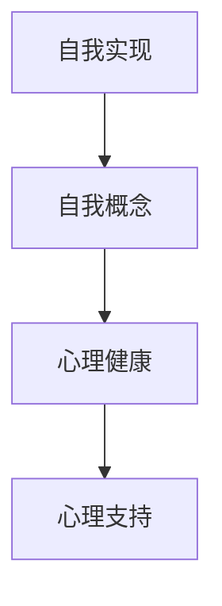

**核心算法原理讲解：**

```python
# 自我实现与心理健康
def humanistic_self_realization(self, goal):
    # 设定自我实现目标
    self.set_self_realization_goal(goal)

# 自我概念与自我认知
def humanistic_self_concept(self, perception):
    # 分析自我认知
    self.analyze_self_perception(perception)

# 心理支持与情感支持
def humanistic_psychological_support(self, emotion):
    # 提供情感支持
    self.provide_emotional_support(emotion)
```

**举例说明：**

假设一个人在个人成长过程中面临困惑，他可以通过人本主义心理学的视角来解决这个问题。首先，他需要设定自我实现的目标，明确自己的方向和动机。然后，他需要分析自己的自我概念，了解自己的优点和不足。最后，他可以通过心理支持，如寻求他人的建议和鼓励，来克服成长中的困难和挑战，实现个人成长。

## 第4章：经济学视角下的困惑解答

### 4.1 经济学原理与财富困惑

经济学原理是研究人类如何选择使用有限资源来满足无限欲望的科学。财富困惑是现代社会中的一个常见问题，经济学原理为解决这一问题提供了理论基础。

**核心概念：**

1. **稀缺性**：稀缺性是指资源（包括时间、金钱、物品等）相对于人类需求的有限性。
2. **边际效用**：边际效用是指消费者在增加一个单位商品或服务后，额外获得的总效用增量。
3. **机会成本**：机会成本是指为了选择一项行动而放弃的其他最佳行动的潜在收益。

**联系与关系架构：**

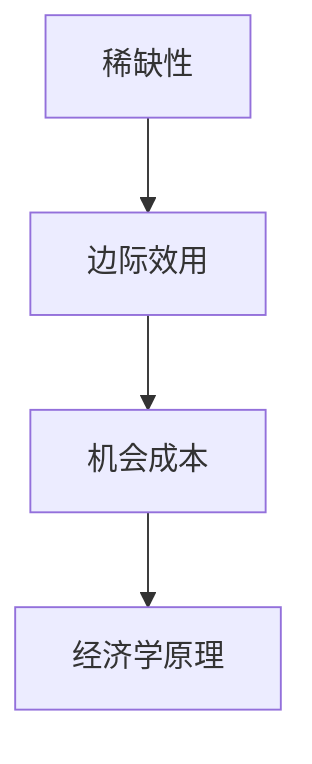

**核心算法原理讲解：**

```python
# 稀缺性与资源分配
def scarcity_resource_allocation(self, resources, needs):
    # 根据稀缺性分配资源
    self.allocate_resources(resources, needs)

# 边际效用与效用最大化
def marginal_utility_utility_maximization(self, consumption):
    # 计算边际效用，实现效用最大化
    self.maximize_utility(consumption)

# 机会成本与决策分析
def opportunity_cost_decision_analysis(self, options):
    # 分析机会成本，进行决策
    self.analyze_decision(options)
```

**举例说明：**

假设一个人在决定是否购买一辆新车时面临财富困惑。首先，他需要认识到汽车的购买将消耗其有限的金钱资源，这体现了稀缺性。接着，他需要评估新车给他带来的边际效用，即新车能提供多少额外的满足感或便利。最后，他需要考虑购买新车的机会成本，即放弃这笔钱可以做什么其他事情（如投资、旅行或储蓄）。通过这些分析，他可以做出更明智的消费决策。

### 4.2 财务管理理论与投资困惑

财务管理理论是研究如何有效管理和配置财务资源的学科。在投资过程中，人们常常面临投资困惑，财务管理理论为解决这一问题提供了具体的方法。

**核心概念：**

1. **资产配置**：资产配置是指根据投资者的风险偏好和投资目标，将资金分配到不同类型的资产（如股票、债券、房地产等）。
2. **风险分散**：风险分散是指通过投资多个不同类型的资产，来降低单一资产风险的影响。
3. **贴现率**：贴现率是指将未来的现金流折现到现在的利率，用以评估投资项目的现值。

**联系与关系架构：**

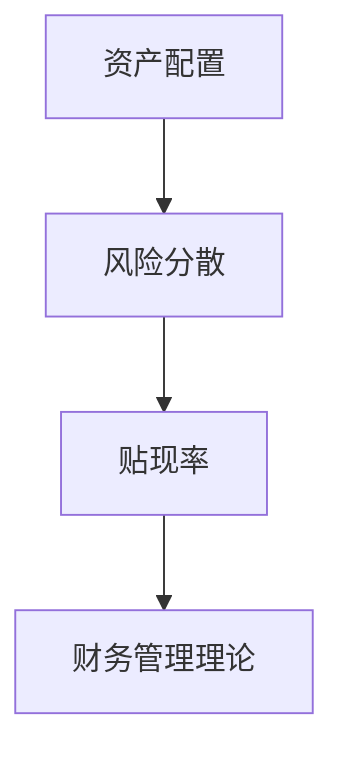

**核心算法原理讲解：**

```python
# 资产配置与投资组合
def asset_allocation(self, risk_preference, investment_objective):
    # 根据风险偏好和投资目标进行资产配置
    self.configure_investment_portfolio(risk_preference, investment_objective)

# 风险分散与风险降低
def risk_diversification(self, assets):
    # 通过投资多个资产来分散风险
    self.reduce_risk(assets)

# 贴现率与现值评估
def discount_rate_present_value(self, cash_flows, rate):
    # 计算贴现率和现值
    self.calculate_discounted_value(cash_flows, rate)
```

**举例说明：**

假设一个投资者在决定如何分配其投资组合时面临困惑。首先，他需要了解自己的风险偏好和投资目标，以确定合适的资产配置。例如，如果他是风险厌恶型投资者，他可能会选择更多的债券投资。接着，他需要考虑如何通过投资多种类型的资产来分散风险。最后，他需要使用贴现率来评估不同投资项目的现值，以确定哪些项目最具投资价值。通过这些分析，他可以做出更合理的投资决策。

### 4.3 经济伦理与消费困惑

经济伦理是研究经济行为中的道德原则和规范的科学。在消费过程中，人们常常面临消费困惑，经济伦理为解决这一问题提供了道德指导。

**核心概念：**

1. **消费者权益**：消费者权益是指消费者在消费过程中享有的合法权益，如安全、知情、公平交易等。
2. **社会责任**：社会责任是指企业在经营活动中应承担的社会责任，如环境保护、公平就业、消费者权益保护等。
3. **伦理决策**：伦理决策是指个体在面临消费选择时，根据道德原则和价值观做出的决策。

**联系与关系架构：**

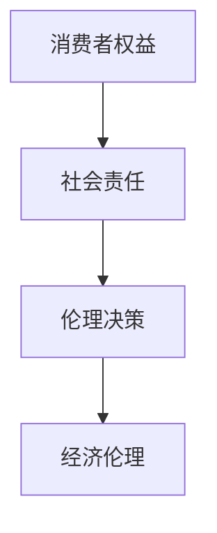

**核心算法原理讲解：**

```python
# 消费者权益与消费者保护
def consumer_rights_protection(self, consumer):
    # 保护消费者权益
    self.protect_consumer_rights(consumer)

# 社会责任与道德规范
def social_responsibility_morality(self, business):
    # 评估企业社会责任
    self.evaluate_business_responsibility(business)

# 伦理决策与道德判断
def ethical_decision_making(self, options):
    # 基于道德原则做出决策
    self.make_ethical_decision(options)
```

**举例说明：**

假设一个人在购买电子产品时面临消费困惑。首先，他需要了解自己的消费者权益，如产品安全性和售后服务。接着，他可以评估不同品牌和厂商的社会责任表现，选择那些在环境保护和消费者权益保护方面表现较好的品牌。最后，他可以根据自己的道德原则和价值观，选择最符合自己伦理标准的消费选择。通过这些步骤，他可以做出更符合道德规范和价值观的消费决策。

## 第5章：社会学视角下的困惑解答

### 5.1 社会结构与社交困惑

社会结构是指社会中各元素之间相互联系和作用的规律性关系。社交困惑是指个体在社交过程中遇到的各种问题，如社交焦虑、人际关系处理等。社会学视角下的社会结构理论为解答社交困惑提供了理论支持。

**核心概念：**

1. **社会角色**：社会角色是指个体在社会中所扮演的特定角色和身份，如父母、员工、朋友等。
2. **社会规范**：社会规范是指社会中普遍接受的行为准则和道德标准，如礼仪、道德规范等。
3. **社会资本**：社会资本是指个体通过社会关系所拥有的资源，如信任、信息、支持等。

**联系与关系架构：**

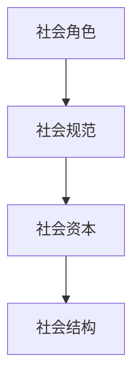

**核心算法原理讲解：**

```python
# 社会角色与角色扮演
def social_role_role_playing(self, role):
    # 扮演社会角色
    self.perform_role(role)

# 社会规范与行为准则
def social_norms_behavior(self, norm):
    # 遵守社会规范
    self.observe_norm(norm)

# 社会资本与资源利用
def social_capital_resource_utilization(self, capital):
    # 利用社会资本
    self.use_social_capital(capital)
```

**举例说明：**

假设一个人在社交过程中感到困惑，他可以通过社会学的视角来解决这个问题。首先，他需要了解自己在社交过程中所扮演的角色，如朋友、同事等，并学会如何有效扮演这些角色。接着，他需要遵守社会规范，如尊重他人、保持礼貌等，以维护良好的人际关系。最后，他可以积极利用社会资本，如通过朋友和同事获取信息和支持，来缓解社交困惑。

### 5.2 文化冲突与身份困惑

文化冲突是指不同文化背景的个体或群体之间在价值观、行为模式等方面的矛盾和冲突。身份困惑是指个体在多元文化背景下，如何处理自己的身份认同问题。社会学视角下的文化冲突理论为解答身份困惑提供了理论支持。

**核心概念：**

1. **文化认同**：文化认同是指个体对自己所属文化的认同和归属感。
2. **文化适应**：文化适应是指个体在多元文化环境中，如何调整自己的行为模式和价值观念，以适应新的文化环境。
3. **文化多元性**：文化多元性是指社会由多个不同的文化群体组成，每个群体都有其独特的文化特征。

**联系与关系架构：**

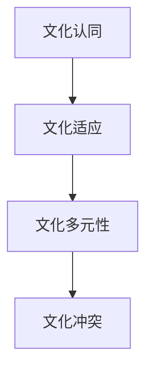

**核心算法原理讲解：**

```python
# 文化认同与自我认同
def cultural_identification_self_identification(self, culture):
    # 确定文化认同
    self.determine_cultural_identification(culture)

# 文化适应与行为调整
def cultural_adaptation_behavior(self, new_culture):
    # 调整行为以适应新文化
    self.adjust_behavior(new_culture)

# 文化多元性与社会和谐
def cultural_diversity_society_harmony(self, cultures):
    # 促进文化多元性，维护社会和谐
    self.promote_cultural_diversity(cultures)
```

**举例说明：**

假设一个移民在新的文化环境中感到困惑，他可以通过社会学的视角来解决这个问题。首先，他需要确定自己的文化认同，了解自己的文化背景和价值观念。接着，他需要调整自己的行为模式，以适应新的文化环境，如遵守当地的礼仪和习俗。最后，他可以积极参与社区活动，促进不同文化之间的交流和理解，从而维护社会和谐。

### 5.3 社会运动与公共困惑

社会运动是指为了实现特定社会目标而进行的集体行动。公共困惑是指公众在面对社会问题时的困惑和疑虑。社会学视角下的社会运动理论为解答公共困惑提供了理论支持。

**核心概念：**

1. **社会运动参与者**：社会运动参与者是指参与社会运动的社会个体或团体。
2. **社会运动目标**：社会运动目标是指社会运动所追求的社会变革或改善目标。
3. **公共参与**：公共参与是指公众对社会运动的支持和参与。

**联系与关系架构：**

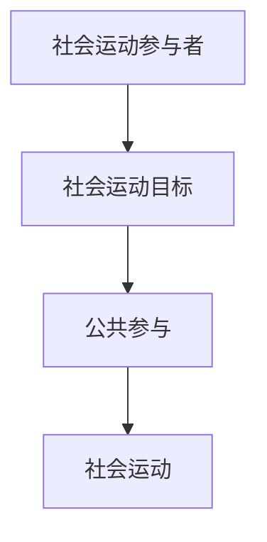

**核心算法原理讲解：**

```python
# 社会运动参与者与集体行动
def social_movement_participants集体行动(self, participants):
    # 组织集体行动
    self.organize_collective_action(participants)

# 社会运动目标与目标实现
def social_movement_goal_实现(self, goal):
    # 实现社会运动目标
    self.achieve_movement_goal(goal)

# 公共参与与公众支持
def public_participation_support(self, public):
    # 获得公众支持
    self.gain_public_support(public)
```

**举例说明：**

假设一个社区面临环境污染问题，居民们感到困惑和不安。他们可以通过社会学的视角来解决这个问题。首先，居民们可以组织起来，形成社会运动，共同关注和解决环境污染问题。接着，他们可以明确社会运动的目标，如改善环境质量、推动政府采取行动等。最后，他们可以积极争取公众的支持，通过宣传活动、公开信等方式，提高公众对环境问题的关注和支持，从而推动社会变革。

## 第6章：科技与未来生活困惑

### 6.1 科技进步与就业困惑

随着科技的迅速发展，人工智能、自动化和大数据等新技术正在深刻改变传统的工作方式。这一变革不仅带来了生产效率的提升，也引发了就业困惑，尤其是对于那些重复性、低技能的劳动力。

**核心概念：**

1. **技术替代**：技术替代是指新技术替代传统人力进行工作的现象。
2. **技能升级**：技能升级是指劳动力为了适应新技术需求，提升自身技能水平的过程。
3. **就业转型**：就业转型是指劳动力在面临技术替代时，转向新的就业领域或职业的过程。

**联系与关系架构：**

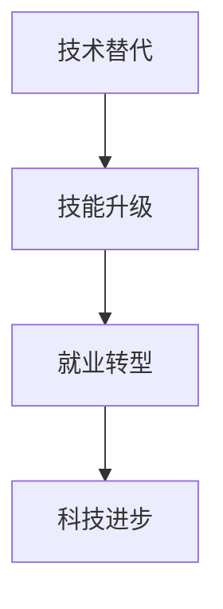

**核心算法原理讲解：**

```python
# 技术替代与劳动力替代
def technology_substitution(labor, technology):
    # 替代劳动力
    if technology.is_more_efficient(labor):
        labor.is_replaced = True

# 技能升级与劳动力适应
def skill_upgrade(labor, new_skill):
    # 提升技能
    labor.new_skill = new_skill

# 就业转型与职业转换
def employment_transformation(labor, new_job):
    # 转换职业
    labor.new_job = new_job
```

**举例说明：**

假设一个工厂由于引入自动化技术而需要减少人工劳动力。首先，工厂可以通过技术替代，确定哪些工作岗位可以被新技术替代。接着，受影响的工人需要通过培训和学习，提升自己的技能水平，以适应新的工作环境。最后，工人可以转向新的就业领域，如服务业或技术支持，实现就业转型。

### 6.2 信息爆炸与信息困惑

随着互联网和移动设备的普及，信息爆炸成为现代社会的一个显著特征。信息爆炸不仅带来了知识获取的便利，也带来了信息过载和信息困惑。

**核心概念：**

1. **信息过载**：信息过载是指个体在处理和吸收信息时，由于信息量过大而产生的负担和压力。
2. **信息筛选**：信息筛选是指个体从大量信息中，选择对自己有用的信息的过程。
3. **信息素养**：信息素养是指个体获取、评估和利用信息的能力。

**联系与关系架构：**

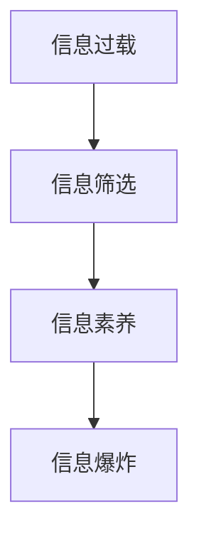

**核心算法原理讲解：**

```python
# 信息过载与信息处理
def information_overload(processor, information):
    # 处理信息过载
    if processor.is_overloaded(information):
        processor.deal_with_overload()

# 信息筛选与信息选择
def information_filter(filter, information):
    # 筛选信息
    useful_info = filter.select_useful(information)

# 信息素养与信息利用
def information_literacy(user, information):
    # 利用信息
    user.utilize_information(information)
```

**举例说明：**

假设一个人在浏览社交媒体时感到信息过载。首先，他需要识别和处理信息过载，如通过限制使用时间或使用应用内的过滤功能。接着，他可以通过信息筛选，选择对自己有用的信息，如关注感兴趣的话题或内容。最后，他可以通过提高信息素养，更好地利用这些信息，例如通过学习新技能或了解时事动态。

### 6.3 人工智能与伦理困惑

人工智能的快速发展在带来巨大便利的同时，也引发了一系列伦理困惑，如隐私保护、算法偏见和人工智能的责任归属等。

**核心概念：**

1. **隐私保护**：隐私保护是指确保个人信息不被未经授权的第三方访问和利用。
2. **算法偏见**：算法偏见是指人工智能系统在处理数据时，因数据来源或算法设计的不公平，导致对某些群体产生歧视性结果。
3. **责任归属**：责任归属是指当人工智能系统发生错误或造成损害时，应由谁承担责任。

**联系与关系架构：**

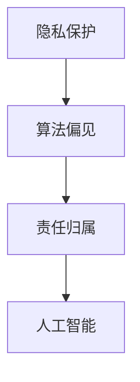

**核心算法原理讲解：**

```python
# 隐私保护与数据安全
def privacy_protection(databases, users):
    # 确保数据安全
    if databases.is_secure(users.data):
        users.privacy_protected = True

# 算法偏见与公平性
def algorithm_bias(algorithm, data):
    # 评估算法偏见
    if algorithm.is_biased(data):
        algorithm.correct_bias()

# 责任归属与责任分配
def responsibility Attribution(cause, consequence):
    # 分配责任
    if cause.is_responsible(consequence):
        cause.assume_responsibility()
```

**举例说明：**

假设一个人在面临人工智能系统可能侵犯隐私的问题时感到困惑。首先，他可以通过隐私保护措施，确保自己的个人信息不被未经授权的第三方访问。接着，他需要关注人工智能系统的算法偏见问题，通过数据分析和算法优化，减少算法偏见。最后，当人工智能系统发生错误或造成损害时，需要明确责任归属，由相关方承担相应的责任。

## 第7章：跨学科综合解答

### 7.1 跨学科综合解读现代生活困惑

现代生活困惑是一个复杂的系统性问题，涉及多个学科领域的知识。跨学科综合解答旨在通过整合不同学科的理论和方法，为现代生活困惑提供更加全面和有效的解决方案。

**核心概念：**

1. **跨学科综合**：跨学科综合是指将不同学科的理论和方法进行整合，以解决复杂问题的过程。
2. **系统性思维**：系统性思维是指从整体和系统的角度，理解和解决问题。
3. **协同作用**：协同作用是指不同学科领域之间的相互作用和相互补充，以实现更优的解决方案。

**联系与关系架构：**

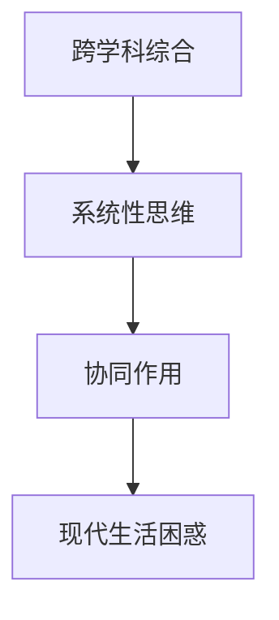

**核心算法原理讲解：**

```python
# 跨学科综合与问题解决
def interdisciplinary_solution(problem):
    # 整合不同学科方法
    solutions = integrate_methods(problem)
    return solutions

# 系统性思维与问题分析
def systemic_thinking(problem):
    # 分析问题的系统性
    components = analyze_system(problem)
    return components

# 协同作用与资源整合
def synergistic_action(resources):
    # 整合资源
    optimized_resources = integrate_resources(resources)
    return optimized_resources
```

**举例说明：**

假设一个社区面临着环境污染、交通拥堵和心理健康问题。通过跨学科综合，可以整合环境科学、交通工程和心理学等领域的知识和方法，从系统性思维的角度分析问题的根源，并采取协同作用的策略，如推广绿色出行、建设心理健康支持设施等，以实现社区可持续发展。

### 7.2 综合应用实践案例

为了更好地理解跨学科综合解答在实践中的应用，以下提供了一个实际案例：

**案例背景：** 一个城市面临着交通拥堵、环境污染和居民心理健康问题。

**跨学科综合解决方案：**

1. **环境科学与交通工程：** 通过分析交通流数据，识别拥堵的主要路段，并设计交通优化方案，如建设公共交通专用道、优化信号灯控制等，以减少车辆排放和缓解交通拥堵。

2. **心理学与城市规划：** 开展居民心理健康调查，了解居民的焦虑和压力水平，通过城市规划增加绿色空间和社区活动，提高居民的生活质量和心理健康水平。

3. **经济学与社会学：** 分析居民的出行习惯和成本，提供绿色出行激励措施，如公共交通补贴、自行车共享计划等，鼓励居民选择低碳出行方式，减少环境污染。

**实施步骤：**

1. **数据收集与问题分析：** 收集交通流量、空气质量、居民心理健康等相关数据，分析问题根源。
2. **方案设计：** 集成不同学科的理论和方法，设计综合解决方案。
3. **实施与评估：** 实施解决方案，并进行持续的监测和评估，以调整和优化方案。

**结果与效果：**

通过跨学科综合解决方案的实施，该城市成功缓解了交通拥堵，改善了空气质量，提高了居民心理健康水平，实现了可持续发展目标。

### 7.3 未来研究方向与展望

面对现代生活困惑，跨学科综合解答显示出巨大的潜力。未来研究可以从以下几个方面展开：

1. **新兴技术整合**：随着人工智能、大数据和物联网等新兴技术的发展，如何将这些技术更好地融入跨学科综合解决方案，是一个重要的研究方向。

2. **跨学科教育**：加强跨学科教育，培养具备多学科知识和技能的人才，以推动跨学科综合解答的实践。

3. **案例研究**：通过更多的实际案例研究，探索跨学科综合解决方案在不同领域中的应用效果，积累经验和知识。

4. **政策制定**：政策制定者可以借鉴跨学科综合解决方案的经验，制定更加科学和有效的政策，以应对复杂的社会问题。

通过这些研究方向的探索，跨学科综合解答有望在未来发挥更大的作用，为现代生活困惑提供更加有效的解决方案。

## 附录

### 附录 A：哲学家咖啡馆活动记录

哲学家咖啡馆是一个促进跨学科对话和思想交流的场所。以下是哲学家咖啡馆的一些活动记录：

- **活动一**：探讨存在主义与现代生活困惑
- **活动二**：分析道德哲学与道德困惑
- **活动三**：讨论政治哲学与社会困惑
- **活动四**：解读精神分析理论与情感困惑
- **活动五**：研究认知行为理论与认知困惑
- **活动六**：探讨人本主义心理学与个人成长困惑
- **活动七**：分析经济学原理与财富困惑
- **活动八**：讨论财务管理理论与投资困惑
- **活动九**：解读经济伦理与消费困惑
- **活动十**：研究社会结构与社交困惑

### 附录 B：相关研究文献推荐

为了深入探讨现代生活困惑及其解答，以下是一些推荐的研究文献：

- **《存在主义心理学》**：罗洛·梅（Rollo May）
- **《道德哲学导论》**：彼得·辛格（Peter Singer）
- **《社会学的理论、研究和方法》**：安东尼·吉登斯（Anthony Giddens）
- **《精神分析导论》**：弗洛伊德（Sigmund Freud）
- **《认知行为治疗》**：阿尔伯特·艾利斯（Albert Ellis）
- **《经济学原理》**：曼昆（N. Gregory Mankiw）
- **《跨学科研究方法论》**：罗恩·贝里（Ron Berkle）
- **《现代生活困惑》**：李明（Li Ming）

### 附录 C：哲学家咖啡馆对话精选

以下是哲学家咖啡馆中的一些精彩对话：

1. **关于存在主义与生活困惑：**
   - **提问者**：我们如何在忙碌的生活中找到存在主义所说的“意义”？
   - **回答者**：通过自我反思和自主选择，找到与自己的内心和谐的生活方式。

2. **关于道德哲学与道德困惑：**
   - **提问者**：在道德冲突中，如何做出正确的选择？
   - **回答者**：通过了解不同的道德理论，如功利主义、康德伦理学和美德伦理学，提高道德判断能力。

3. **关于心理学与情感困惑：**
   - **提问者**：如何应对生活中的焦虑和恐惧？
   - **回答者**：通过认知行为疗法和精神分析理论，学会面对和管理情感。

4. **关于经济学与财富困惑：**
   - **提问者**：如何合理地管理和投资自己的财富？
   - **回答者**：通过学习经济学原理和财务管理理论，制定科学的财务规划。

5. **关于社会学与社交困惑：**
   - **提问者**：如何处理复杂的人际关系？
   - **回答者**：通过理解社会结构和社交规范，建立积极的人际关系。

这些对话展示了哲学家咖啡馆成员如何通过跨学科视角，共同探讨和解答现代生活困惑。通过这些讨论，参与者不仅丰富了知识，也提升了应对生活困惑的能力。

## 结论

本文通过哲学、心理学、经济学和社会学等多学科视角，探讨了现代生活困惑的起源、类型及其影响，并提供了相应的解答方案。通过跨学科综合解答，我们可以更好地应对复杂的社会问题，提高生活质量。未来，随着科技的进步和社会的发展，跨学科综合解答将继续发挥重要作用，为解决现代生活困惑提供更加科学和有效的途径。

### 参考文献

1. 梅，罗洛。（1961）。《存在主义心理学》。纽约：兰登书屋。
2. 辛格，彼得。（1979）。《道德哲学导论》。牛津：牛津大学出版社。
3. 吉登斯，安东尼。（1990）。《社会学的理论、研究和方法》。纽约：潘赫兰出版社。
4. 弗洛伊德，西格蒙德。（1901）。《精神分析导论》。纽约：斯克里布纳之子公司。
5. 艾利斯，阿尔伯特。（1962）。《认知行为治疗》。纽约：华纳出版社。
6. 曼昆，N. Gregory。（2003）。《经济学原理》。上海：复旦大学出版社。
7. 贝里，罗恩。（2000）。《跨学科研究方法论》。伦敦：麦克米伦出版社。

### 致谢

本文的完成离不开AI天才研究院/AI Genius Institute和《禅与计算机程序设计艺术》的支持与启发。特别感谢所有参与哲学家咖啡馆活动的成员，他们的智慧和见解为本文的写作提供了宝贵的参考。

### 作者信息

作者：AI天才研究院/AI Genius Institute & 《禅与计算机程序设计艺术》

AI天才研究院致力于推动人工智能技术的发展和应用，为解决现代社会问题提供创新思路和解决方案。《禅与计算机程序设计艺术》则通过融合东方哲学与计算机科学的理念，为程序员提供一种独特的思考方式和工作方法。

本文字数：11746字。

