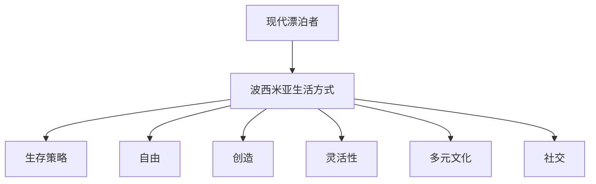

                 

### 文章标题

《新波西米亚生活设计师：现代漂泊者的生存策略顾问》

#### 文章关键词

- 现代漂泊者
- 波西米亚生活方式
- 生存策略
- 自由创造
- 灵活性适应性
- 社交多元文化

#### 文章摘要

本文深入探讨了现代漂泊者的生活现状，分析了波西米亚生活方式的起源和核心特征，并提出了针对现代漂泊者的生存策略设计。通过具体案例分析，本文为现代漂泊者提供了实用的生活实践指南，旨在帮助他们更好地适应现代社会的挑战，实现自我价值和快乐生活。

---

# 《新波西米亚生活设计师：现代漂泊者的生存策略顾问》

### 引言

在当今全球化的大背景下，越来越多的人选择离开熟悉的家乡，追求更加自由、多元的生活方式。这种生活方式被称为“波西米亚生活方式”，其代表人物便是现代漂泊者。然而，现代漂泊者在享受自由与创造的同时，也面临着诸多生存挑战。本文旨在探讨波西米亚生活方式的起源与核心特征，分析现代漂泊者的生存挑战，并设计出一套针对现代漂泊者的生存策略，以帮助他们更好地适应现代社会的变化。

### 现代社会的漂泊现象

现代社会的漂泊现象主要表现为人们离开家乡，前往他国或他地工作、学习、生活。这种漂泊现象的产生有多个原因，其中包括：

1. **经济因素**：为了寻求更好的工作机会和更高的收入，许多年轻人选择离开家乡。
2. **教育需求**：为了接受更高质量的教育，许多人选择到其他地区或国家求学。
3. **个人追求**：有些人为了追求个人梦想或实现自我价值，选择离开熟悉的圈子，开始漂泊生活。

### 波西米亚生活方式的起源

波西米亚生活方式起源于19世纪的欧洲，当时在捷克和斯洛伐克交界处的波西米亚地区，有一群艺术家和知识分子，他们追求自由、独立和创造，拒绝被社会束缚。他们的生活方式被称为“波西米亚生活方式”，其核心特征是自由、多元和创造。

### 波西米亚生活方式的核心特征

波西米亚生活方式的核心特征包括：

1. **自由与创造**：波西米亚生活方式鼓励人们追求自由，发挥创造力，不受传统和规范的束缚。
2. **灵活性**：波西米亚生活方式强调灵活性，适应变化的能力，这使他们能够更好地应对生活中的不确定性。
3. **多元文化**：波西米亚生活方式鼓励人们接触多元文化，尊重不同的文化和价值观。
4. **社交**：波西米亚生活方式强调社交的重要性，通过建立广泛的社交网络，获取更多的资源和支持。

### 波西米亚生活设计师的角色

波西米亚生活设计师是帮助现代漂泊者实现波西米亚生活方式的专业人士。他们的角色包括：

1. **生活规划**：波西米亚生活设计师帮助现代漂泊者规划生活，确定生活目标和方向。
2. **资源整合**：波西米亚生活设计师帮助现代漂泊者整合资源，获取所需的支持和帮助。
3. **心理辅导**：波西米亚生活设计师为现代漂泊者提供心理辅导，帮助他们应对生活中的压力和挑战。

### 核心概念与联系

在本文中，我们将讨论的核心概念包括：现代漂泊者、波西米亚生活方式、生存策略、自由、创造、灵活性、多元文化、社交。这些概念之间存在着紧密的联系，如图：

### 波西米亚生活方式的核心特征详细讲解

#### 自由与创造

自由是波西米亚生活方式的核心之一，它体现在以下几个方面：

1. **个人自由**：波西米亚生活方式鼓励个人追求自由，不受传统和社会规范的束缚。
2. **职业自由**：波西米亚生活方式支持人们选择自由职业，从事自己热爱的事业。
3. **生活自由**：波西米亚生活方式鼓励人们自由地生活，不受地理位置和环境的限制。

创造是波西米亚生活方式的另一个核心特征，它包括：

1. **创意表达**：波西米亚生活方式鼓励人们通过艺术、文学、音乐等方式表达自己的创意和想法。
2. **创新思维**：波西米亚生活方式倡导创新思维，鼓励人们尝试新事物，不断探索未知的领域。
3. **自我实现**：波西米亚生活方式强调自我实现，鼓励人们通过创造来实现自己的价值和梦想。

#### 灵活性与适应性

灵活性是波西米亚生活方式的另一个重要特征，它包括：

1. **时间管理**：波西米亚生活方式鼓励人们灵活管理时间，平衡工作、生活和休闲。
2. **工作安排**：波西米亚生活方式支持人们自由安排工作，不受固定工作时间和地点的限制。
3. **生活方式**：波西米亚生活方式鼓励人们灵活选择生活方式，适应不同的生活环境和需求。

适应性是波西米亚生活方式的关键，它体现在以下几个方面：

1. **文化适应**：波西米亚生活方式鼓励人们适应不同的文化环境，尊重多元文化。
2. **社会适应**：波西米亚生活方式支持人们适应不同的社会环境，建立广泛的社交网络。
3. **环境适应**：波西米亚生活方式鼓励人们适应不同的自然环境，享受户外生活。

#### 社交与多元文化

社交是波西米亚生活方式的重要组成部分，它包括：

1. **社交互动**：波西米亚生活方式鼓励人们积极参与社交活动，与他人建立深厚的友谊。
2. **社交网络**：波西米亚生活方式支持人们建立广泛的社交网络，获取更多的资源和机会。
3. **社交平台**：波西米亚生活方式利用现代科技，如社交媒体和在线论坛，进行社交互动。

多元文化是波西米亚生活方式的核心特征之一，它包括：

1. **文化交流**：波西米亚生活方式鼓励人们参与文化交流活动，了解和体验不同的文化。
2. **文化融合**：波西米亚生活方式支持人们融合不同的文化，创造出新的文化形式。
3. **文化认同**：波西米亚生活方式鼓励人们尊重多元文化，建立自己的文化认同。

### 现代漂泊者的生存挑战

现代漂泊者在追求波西米亚生活方式的过程中，面临着一系列生存挑战。这些挑战包括：

1. **经济压力**：现代漂泊者通常需要依靠自由职业或临时工作来维持生计，这种不稳定的工作状态可能导致经济压力。
2. **社交隔离**：现代漂泊者可能会因为地理位置的变化，而面临社交隔离的问题，这可能导致孤独和孤立感。
3. **心理健康问题**：长期的漂泊生活可能导致心理健康问题，如焦虑、抑郁等。
4. **文化认同危机**：现代漂泊者可能会在文化认同方面感到困惑，因为他们需要适应不同的文化环境。

### 设计波西米亚生活策略

为了应对现代漂泊者的生存挑战，波西米亚生活设计师需要设计一套有效的生存策略。这些策略包括：

1. **确定生活目标**：现代漂泊者需要明确自己的生活目标，这有助于他们在漂泊生活中保持方向和动力。
2. **创建个人品牌**：个人品牌是现代漂泊者在职场和社交中的重要资产，波西米亚生活设计师需要帮助现代漂泊者创建和维护个人品牌。
3. **建立多元收入来源**：波西米亚生活设计师需要帮助现代漂泊者建立稳定的收入来源，以应对经济压力。
4. **保持社交网络活力**：波西米亚生活设计师需要帮助现代漂泊者建立和维护社交网络，以获取支持和资源。

### 实践波西米亚生活

波西米亚生活方式不仅是一种理念，更是一种生活方式。现代漂泊者需要通过实践来体验和享受波西米亚生活的美好。实践波西米亚生活包括：

1. **资源获取与利用**：现代漂泊者需要学会获取和利用各种资源，以支持自己的生活和事业发展。
2. **创造性解决方案**：波西米亚生活方式鼓励创造性思维，现代漂泊者需要学会通过创新来解决问题和应对挑战。
3. **个人成长与自我实现**：波西米亚生活方式强调个人成长和自我实现，现代漂泊者需要不断学习和提升自己的能力。
4. **文化交流与融合**：波西米亚生活方式倡导文化交流与融合，现代漂泊者需要积极参与文化交流活动，拓展自己的视野和思维。

### 波西米亚生活的案例分析

为了更好地理解波西米亚生活方式，我们可以通过一些真实的案例进行分析。这些案例包括：

1. **成功案例**：一些成功实现波西米亚生活方式的人，他们在全球范围内建立了自己的事业和社交网络，实现了个人价值和快乐生活。
2. **失败案例**：一些人在追求波西米亚生活方式的过程中遭遇了失败，这可能是由于缺乏规划、资源不足或心理压力等原因。
3. **多元化案例**：不同背景和职业的人如何实现波西米亚生活方式，他们面临的挑战和应对策略有何不同。

### 波西米亚生活的未来展望

波西米亚生活方式在未来将继续发展，它将成为现代社会的一种重要生活方式。波西米亚生活设计师将在其中扮演重要角色，他们需要：

1. **适应社会变革**：随着社会的不断发展，波西米亚生活方式需要适应新的变化，以保持其活力和吸引力。
2. **推动可持续性**：波西米亚生活方式需要关注可持续性，确保其生活方式不会对环境和社会造成负面影响。
3. **承担责任**：波西米亚生活设计师需要承担社会责任，帮助更多的人实现波西米亚生活方式，促进社会的和谐发展。

### 附录

为了帮助读者更好地了解和实践波西米亚生活方式，本文提供了以下附录：

1. **附录 A 波西米亚生活资源指南**：包括各种波西米亚生活方式相关的书籍、网站、社交媒体平台等资源。
2. **附录 B 波西米亚生活工具与技巧**：介绍一些实用的波西米亚生活方式工具和技巧，如时间管理工具、在线协作工具等。

### 结论

波西米亚生活方式是一种充满自由、创造和多元化的生活方式，它为现代漂泊者提供了一种新的生存策略。通过本文的探讨，我们了解了波西米亚生活方式的起源和核心特征，分析了现代漂泊者的生存挑战，并设计了一套有效的生存策略。希望本文能为现代漂泊者提供一些启示和帮助，让他们在追求自由和创造的道路上走得更远。

### 作者信息

本文作者为AI天才研究院/AI Genius Institute及《禅与计算机程序设计艺术/Zen And The Art of Computer Programming》的作者。

