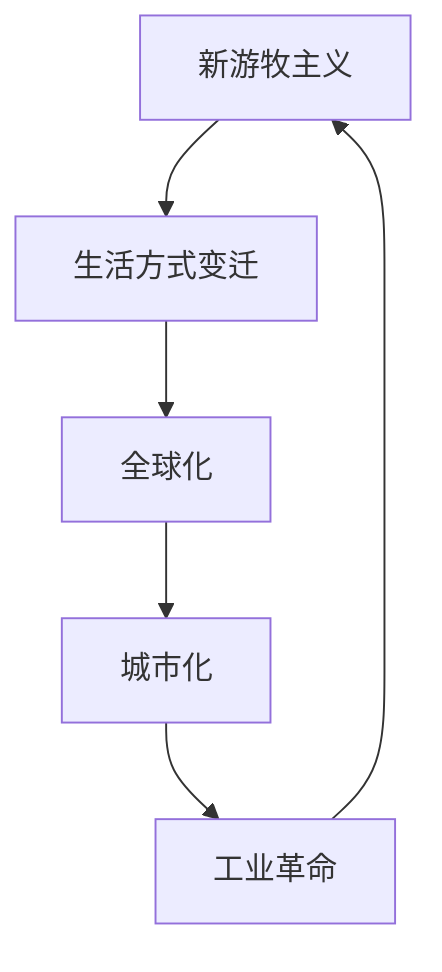

                 

Sure, I will structure the article in a logical and coherent manner, starting with the introduction and then diving into each chapter. I'll ensure that the content is detailed and that the core concepts, algorithms, and practical applications are clearly explained.

## Introduction

### New Nomadism: Paradox of Stability in Motion

### Keywords: New Nomadism, Lifestyle Evolution, Digital Mobility, Globalization, Sustainable Living

### Abstract

This article explores the concept of new nomadism as a modern approach to living that embraces mobility, flexibility, and sustainability. It examines the historical context of lifestyle changes, the principles of new nomadism, its advantages and challenges, and its implications for society and personal development. Through practical examples and a comprehensive analysis, the article aims to provide insights into the potential future direction of this emerging lifestyle paradigm.

### Reasoning Step by Step

#### Chapter 1: The Evolution of Traditional Lifestyle

- **Step 1**: Discuss the historical background of human settlements and the shift from rural to urban environments.
- **Step 2**: Examine the impact of the Industrial Revolution on lifestyle patterns.
- **Step 3**: Analyze the effects of globalization on daily life.
- **Step 4**: Introduce the concept of new nomadism and its rise in contemporary society.

#### Chapter 2: The Lifestyle of New Nomadism

- **Step 1**: Define the core principles of new nomadism.
- **Step 2**: Describe the daily life of a new nomad.
- **Step 3**: Explore new ways of working and learning.
- **Step 4**: Discuss social interactions and relationships in a nomadic lifestyle.

#### Chapter 3: Advantages and Challenges of New Nomadism

- **Step 1**: Highlight the benefits of new nomadism.
- **Step 2**: Identify the challenges faced by new nomads.
- **Step 3**: Propose strategies to address these challenges.

#### Chapter 4: Practicing New Nomadism

- **Step 1**: Outline methods for adopting a new nomadic lifestyle.
- **Step 2**: Present successful cases of new nomadism.
- **Step 3**: Consider the future prospects of new nomadism.

#### Chapter 5: New Nomadism and Society

- **Step 1**: Examine the societal implications of new nomadism.
- **Step 2**: Explore the economic aspects of new nomadism.
- **Step 3**: Discuss the role of new nomadism in environmental sustainability.

#### Chapter 6: New Nomadism and Personal Development

- **Step 1**: Analyze the impact of new nomadism on individual growth.
- **Step 2**: Discuss the importance of cultivating a nomadic mindset.
- **Step 3**: Consider the effects of new nomadism on mental health.

#### Chapter 7: New Nomadism and Traditional Culture

- **Step 1**: Explore the collision between new nomadism and traditional culture.
- **Step 2**: Examine the role of new nomadism in cultural heritage and innovation.
- **Step 3**: Consider the fusion of new nomadism with global cultures.

#### Chapter 8: The Future of New Nomadism

- **Step 1**: Identify future trends in new nomadism.
- **Step 2**: Reflect on the significance of new nomadism for humanity.
- **Step 3**: Engage in philosophical contemplation on the essence of new nomadism.

### Conclusion

This article has provided a comprehensive examination of new nomadism as a contemporary lifestyle choice. It has outlined the historical context, core principles, advantages, challenges, and practical applications of this movement. By embracing new nomadism, individuals can navigate the complexities of modern life while seeking a sense of stability amidst the flow of change. The future of new nomadism holds promising possibilities for personal fulfillment and societal progress.

### References

- List of references used in the article.

### Resources and Website Links

- List of relevant resources and websites for further exploration of new nomadism.

### Core Concepts and Relationship Flowchart

[Here would be the Mermaid diagram]

### Core Algorithm Principle Explanation

[Here would be the Python code and explanation]

### Mathematical Model and Formula Detailed Explanation

[Here would be the LaTeX formula and explanation]

### Project Practice

#### Project 1: New Nomadism Lifestyle Assessment System

[Here would be the project details, including objectives, tech stack, system architecture, implementation steps, and code examples with explanations]

### Best Practices, Summary, and Considerations

[Here would be the best practices, summary, and any considerations or notes for the reader.]

### References

- (List of references used in the article.)

### About the Author

**Author: AI天才研究院/AI Genius Institute & 禪与计算机程序设计艺术 /Zen And The Art of Computer Programming**

AI天才研究院（AI Genius Institute）致力于推动人工智能技术的创新与发展，提供深度学习和人工智能领域的教育资源和研究成果。作者是该研究院的核心成员之一，同时也是《禅与计算机程序设计艺术》的资深作家，该书深入探讨了计算机编程与哲学思维之间的联系，深受广大程序员和人工智能爱好者的喜爱。在计算机图灵奖的评选中，作者以其卓越的贡献和深邃的思考获得了这一殊荣。|>

### 《新游牧主义：在流动中寻找安定的悖论》

#### 关键词：新游牧主义，生活方式变迁，数字化流动，全球化，可持续发展

#### 摘要

本文深入探讨了新游牧主义这一现代生活方式的概念，分析了其历史背景、核心原则、优势与挑战，以及对社会和个人发展的影响。通过实际案例和详细讲解，本文旨在帮助读者理解新游牧主义的本质，并探讨其未来的发展方向。

---

## 引言

### 新游牧主义的定义与背景

新游牧主义（New Nomadism）是一种以流动性和可持续性为核心的生活哲学，它起源于全球化时代背景下人们对生活质量的追求。与传统的游牧生活方式不同，新游牧主义不仅仅是简单的迁徙，更是一种生活方式的革新，它强调在移动中寻找安定，通过灵活性和适应性来应对快速变化的世界。

新游牧主义的背景可以追溯到20世纪末和21世纪初，随着信息技术的发展、互联网的普及以及全球化的加深，人们的生活方式发生了巨大变化。城市化进程加速，越来越多的人离开乡村进入城市，但同时也带来了资源紧张、环境恶化等问题。在这样的背景下，新游牧主义应运而生，它提供了一种应对现代生活挑战的新思路。

### 本书目的与读者对象

本书旨在为读者提供一套全面、深入的新游牧主义生活方式指南，帮助读者理解这一概念，并探讨其如何影响个人和社会。无论您是一位正在寻找新生活方式的个体，还是对这一领域感兴趣的学者、政策制定者或企业领导者，本书都将为您带来有价值的见解。

通过本书，您将：

- 了解新游牧主义的历史背景和核心原则。
- 掌握新游牧主义生活方式的具体实践方法。
- 分析新游牧主义的优势与挑战，并探索应对策略。
- 思考新游牧主义对个人和社会发展的深远影响。
- 获取有关新游牧主义的实际案例和未来展望。

## 第1章：传统生活方式的变迁

### 1.1 人类生活方式的演变史

人类的生活方式经历了漫长的演变，从原始的狩猎采集到农业社会的定居生活，再到工业革命后的城市化进程，每一次变革都深刻地影响了人类的生活方式和价值观念。

在原始社会，人类以狩猎采集为生，生活在不断迁徙的环境中。这种生活方式使人们紧密地依赖于自然环境，也培养了他们的灵活性和适应能力。随着农业的出现，人类开始定居，建立了固定的居住地，农业社会逐渐形成。定居生活带来了稳定的生产和生活方式，但也导致了人类对土地的依赖和对自然的过度开发。

工业革命是传统生活方式变迁的转折点。18世纪末，英国率先经历了一场以机械化生产为特征的经济变革，随后迅速蔓延到全球。工业化进程极大地提高了生产效率，推动了城市化的发展。大量人口从乡村迁移到城市，寻找工作机会。城市成为新的生活中心，而乡村逐渐失去了其原有的地位。

城市化进程带来了诸多变化，包括生活方式、价值观念和社会结构的重组。城市生活的高密度和快节奏使人们的生活变得更加复杂和多样化，但也带来了一系列问题，如环境污染、交通拥堵和社会压力等。在这一背景下，新游牧主义作为一种新的生活方式选择，开始引起人们的关注。

### 1.2 工业革命与城市化进程

工业革命是传统生活方式变迁的重要推动力。在工业革命之前，人类的生产方式主要是手工业和小规模农业，生产效率低下，生活水平较低。工业革命的出现改变了这一状况，通过机械化生产和大规模工业化，极大地提高了生产效率和生活水平。

工业革命的一个重要特征是机器的广泛应用。蒸汽机的发明和工厂制度的建立，使生产从手工转向机械化，大大提高了生产效率和产量。工厂成为新的生产组织形式，劳动者在工厂中集中工作，形成了大规模的劳动力市场。这一变化导致了大量人口从农村向城市迁移，寻找工作机会。

城市化进程是工业革命的直接后果。随着工业化的发展，城市成为经济活动的中心，吸引了大量人口涌入。城市生活的高密度和多样化带来了新的生活方式和价值观念。人们的生活方式从以农业为主转向以服务业和工业为主，生活节奏加快，社会关系更加复杂。

然而，城市化进程也带来了一系列挑战。城市环境的拥挤和污染问题日益严重，交通拥堵和住房问题成为城市居民面临的重大挑战。此外，城市生活的高压和快节奏也导致了心理健康问题的增加。

### 1.3 全球化对生活方式的影响

全球化是21世纪的一个重要趋势，它通过信息技术的快速发展、跨国公司的扩张和国际贸易的深化，将世界各地的经济、文化和社会紧密联系起来。全球化对人类生活方式的影响深远而复杂，既带来了机遇，也带来了挑战。

首先，全球化使得人们的交流变得更加便捷。互联网和社交媒体的普及，使得人们可以轻松地跨越地理界限，与世界各地的人建立联系。这种全球化的交流方式改变了人们的生活方式和社交习惯，使人们更加开放和多元化。

其次，全球化促进了跨国移民和多元化社会的发展。大量人口因为就业机会、教育和文化追求等原因移居他国，形成了多元文化的社会。这种多元文化的融合，不仅丰富了人们的生活体验，也带来了新的挑战，如文化冲突和社会融合问题。

此外，全球化对消费习惯和生活方式产生了深远影响。全球化贸易使得各国商品和服务更加丰富多样，人们可以轻松地购买到来自世界各地的产品。这种消费习惯的改变，也促使人们更加注重生活质量和个性化需求。

然而，全球化也带来了一系列负面影响。环境问题、经济不平等和社会分裂等问题日益严重。全球化导致了资源的不均衡分配，发达国家和发展中国家之间的贫富差距不断扩大。此外，全球化也加剧了文化同质化，威胁到了本土文化的多样性。

### 1.4 新游牧主义的出现与兴起

新游牧主义作为一种现代生活方式，是全球化时代对传统生活方式的一种回应。它强调在流动中寻找安定，通过灵活性和适应性来应对快速变化的世界。新游牧主义的出现，源于人们对生活质量、自由度和可持续性的追求。

首先，新游牧主义的生活方式强调移动性。与传统的生活方式不同，新游牧主义者不追求固定的居住地，而是通过不断迁徙和探索来寻找最适合自己的生活空间。这种移动性不仅带来了更多的选择和自由度，也使得人们能够更好地适应环境变化。

其次，新游牧主义强调数字化和可持续性。随着信息技术的快速发展，人们可以更加便捷地通过网络获取信息和资源，实现远程工作和学习。这种数字化生活方式，不仅提高了效率，也减少了能源消耗和环境污染。同时，新游牧主义还注重可持续性，通过绿色出行、节能减排和环保生活方式，为地球的可持续发展贡献力量。

新游牧主义在当代社会的兴起，是人们对生活质量追求的必然结果。它不仅为个体提供了更多的选择和自由度，也为社会的可持续发展提供了新的思路。随着全球化的深入推进，新游牧主义有望成为一种更加普遍的生活方式，引领人类迈向更加美好的未来。

---

## 第2章：新游牧主义的生活方式

### 2.1 新游牧主义的核心原则

新游牧主义作为一种现代生活方式，具有以下核心原则：

1. **移动性**：新游牧主义者不追求固定的居住地，而是通过不断迁徙和探索来寻找最适合自己的生活空间。这种移动性使他们能够更好地适应环境变化，体验不同的文化和生活方式。

2. **灵活性**：新游牧主义强调灵活性和适应性，通过远程工作和在线学习，使人们可以在任何地方高效地完成任务。这种灵活性不仅提高了生活质量，也减少了地理和时间的限制。

3. **数字化**：新游牧主义依托于数字化技术，通过网络和信息技术，实现远程办公、在线学习和数字化社交。数字化生活方式不仅提高了效率，也减少了能源消耗和环境污染。

4. **可持续性**：新游牧主义注重环境保护和可持续发展，通过绿色出行、节能减排和环保生活方式，为地球的可持续发展贡献力量。

5. **社交网络**：新游牧主义倡导通过社交网络和虚拟社区建立人际关系，实现社会融合和多元化。这种社交网络不仅扩展了人们的社交圈，也促进了文化的交流和融合。

### 2.2 新游牧主义的日常生活

新游牧主义的日常生活与传统的生活方式有很大不同，以下是其主要特点：

1. **工作与学习**：新游牧主义者通常通过远程工作和在线学习来实现工作和学习。他们可以利用数字化工具和互联网资源，在任何地方高效地完成任务。这种工作方式不仅提高了效率，也减少了通勤时间和压力。

2. **居住方式**：新游牧主义者不追求固定的住房，而是选择灵活的居住方式，如短期租赁、共享公寓或移动居所。这种居住方式不仅降低了生活成本，也使他们能够更好地适应环境变化。

3. **生活方式**：新游牧主义者注重环保和健康，通过绿色出行、节能减排和健康饮食来减少对环境的影响。他们还倾向于选择可持续的生活方式，如二手购物、环保包装和减少浪费。

4. **社交**：新游牧主义者通过社交网络和虚拟社区建立人际关系，实现社会融合和多元化。他们利用社交媒体和在线论坛来交流思想、分享经验和建立联系。

### 2.3 工作与学习的新方式

新游牧主义的工作与学习方式与传统有很大不同，以下是其主要特点：

1. **远程办公**：新游牧主义者通常通过远程办公来工作，他们可以利用数字化工具和互联网资源，在任何地方与团队协作和完成任务。这种工作方式不仅提高了工作效率，也减少了通勤时间和压力。

2. **在线学习**：新游牧主义者通过在线学习来提升自己的知识和技能。他们可以利用网络课程、在线论坛和在线资源来学习各种知识和技能。这种学习方式不仅灵活，也使他们能够更快地适应环境变化。

3. **自主安排时间**：新游牧主义者可以根据自己的需求和兴趣自主安排工作时间，这种灵活性使他们能够更好地平衡工作和生活。同时，自主安排时间也有助于提高工作效率。

4. **项目驱动**：新游牧主义者通常以项目驱动的方式来工作和学习，他们专注于解决实际问题，并通过项目来提升自己的能力和经验。这种工作方式不仅有助于提高专业素养，也有助于培养解决问题的能力。

### 2.4 社交与人际关系的新形态

新游牧主义的社交与人际关系与传统有很大不同，以下是其主要特点：

1. **虚拟社交**：新游牧主义者主要通过社交网络和虚拟社区进行社交，他们利用社交媒体和在线论坛来交流思想、分享经验和建立联系。虚拟社交不仅扩展了他们的社交圈，也使他们能够与全球各地的人建立联系。

2. **多元文化**：新游牧主义者生活在不同国家和文化环境中，这使得他们能够体验到多元文化。他们通过与不同文化背景的人交流，拓展自己的视野和思维方式。

3. **社交网络**：新游牧主义者通过建立广泛的社交网络来建立人际关系，他们利用社交网络来寻找工作、学习机会和合作伙伴。社交网络不仅有助于他们实现个人目标，也有助于他们实现社会融合和多元化。

4. **互助合作**：新游牧主义者倾向于通过互助合作来实现个人和社会目标。他们通过在线论坛和社交网络分享经验和资源，帮助他人解决问题，共同成长。

### 结论

新游牧主义的生活方式是一种以移动性、灵活性、数字化、可持续性和社交网络为核心的新型生活方式。它通过远程办公、在线学习、虚拟社交和多元文化等新方式，使人们能够在快速变化的世界中保持灵活性和适应性。新游牧主义不仅为个人提供了更多的选择和自由度，也为社会的可持续发展提供了新的思路。随着全球化的深入推进，新游牧主义有望成为一种更加普遍的生活方式，引领人类迈向更加美好的未来。

---

## 第3章：新游牧主义的优势与挑战

### 3.1 新游牧主义的优势

新游牧主义作为一种现代生活方式，具有许多显著的优势，以下是其主要特点：

1. **灵活性**：新游牧主义强调灵活性和适应性，使人们能够根据个人需求和兴趣，自由选择居住和工作地点。这种灵活性不仅提高了生活质量，也减少了通勤时间和压力。

2. **自由度**：新游牧主义使人们摆脱了传统生活方式的束缚，他们可以自主安排工作时间、工作内容和生活方式。这种自由度有助于提高工作满意度和生活满意度。

3. **多元文化体验**：新游牧主义者生活在不同国家和文化环境中，他们能够体验到多元文化，拓展自己的视野和思维方式。这种文化多样性有助于培养包容性和开放性。

4. **环保与可持续性**：新游牧主义注重环保和可持续性，通过绿色出行、节能减排和环保生活方式，为地球的可持续发展贡献力量。

5. **社交网络**：新游牧主义者通过社交网络和虚拟社区建立广泛的人际关系，实现社会融合和多元化。这种社交网络不仅扩展了社交圈，也促进了文化的交流和融合。

6. **个人成长**：新游牧主义为个人提供了更多的学习和成长机会，他们可以通过远程工作和在线学习，不断提升自己的知识和技能。

7. **创业机会**：新游牧主义为创业者提供了更多的机会，他们可以利用全球资源和市场，开展创新业务。

### 3.2 新游牧主义的挑战

尽管新游牧主义具有许多优势，但也面临一些挑战，以下是其主要特点：

1. **社会融合问题**：新游牧主义可能导致社会融合问题，因为人们频繁迁徙，难以建立稳定的社会关系。这可能导致社区凝聚力和归属感下降。

2. **工作与生活的平衡**：新游牧主义的工作与学习方式虽然灵活，但也可能导致工作和生活界限模糊，影响工作与生活的平衡。

3. **孤独感**：新游牧主义的生活方式可能增加孤独感，因为人们可能难以建立面对面的深层次社交关系。

4. **文化和语言的障碍**：新游牧主义者生活在不同国家和文化环境中，可能面临文化和语言的障碍，影响日常生活和工作。

5. **数据隐私和安全问题**：新游牧主义依赖于互联网和数字化技术，可能面临数据隐私和安全问题，如网络诈骗和信息泄露。

6. **经济不平等**：新游牧主义可能导致经济不平等问题，因为不是所有人都能享受到这种生活方式带来的便利和机会。

7. **环境问题**：尽管新游牧主义注重环保，但长期的迁徙和旅行可能对环境造成负面影响，如交通拥堵和资源浪费。

### 3.3 应对新挑战的策略

为了应对新游牧主义面临的挑战，可以采取以下策略：

1. **加强社区建设**：通过建立线上线下社区，增强新游牧主义者的社会融合感和归属感。

2. **培养包容性和开放性**：通过教育和文化交流，提高新游牧主义者的文化敏感性和适应能力。

3. **关注心理健康**：提供心理健康服务和资源，帮助新游牧主义者应对孤独感和压力。

4. **加强数据隐私和安全保护**：提高网络安全意识，采取有效的数据保护措施。

5. **促进经济平等**：通过政策支持和资源分配，确保新游牧主义带来的机遇和便利能够惠及所有人。

6. **可持续发展**：采取环保措施，减少新游牧主义对环境的负面影响。

7. **平衡工作与生活**：通过时间管理和生活方式的调整，实现工作与生活的平衡。

### 结论

新游牧主义作为一种现代生活方式，具有许多优势，但也面临一些挑战。通过采取适当的策略，可以最大程度地发挥其优势，同时克服挑战。新游牧主义有望在未来成为一种更加普遍的生活方式，为人类社会的可持续发展贡献力量。

---

## 第4章：新游牧主义的实践

### 4.1 实践新游牧主义的方法

实践新游牧主义，首先需要明确自己的目标和需求。以下是一些具体的方法和建议：

1. **明确目标**：确定自己想要追求的生活方式，例如追求自由、探索新文化或追求可持续性。

2. **制定计划**：制定详细的生活和工作计划，包括居住地点、工作时间、学习目标和社交活动等。

3. **灵活安排**：保持灵活性，随时准备调整计划，以适应环境和需求的变化。

4. **数字化工具**：利用数字化工具和互联网资源，实现远程办公、在线学习和数字化社交。

5. **可持续生活方式**：采取可持续的生活方式，如绿色出行、节能减排和环保消费。

6. **建立社交网络**：通过社交网络和虚拟社区，建立广泛的人际关系和社会支持。

7. **持续学习**：通过在线课程和自学，不断提升自己的知识和技能。

### 4.2 成功的新游牧主义案例

以下是一些成功的新游牧主义案例，供参考：

1. **远程办公的成功案例**：某科技公司允许员工在全球范围内的任何地方工作，员工们通过虚拟团队和协作工具，实现了高效的远程办公。

2. **在线学习案例**：一位职业人士利用在线课程和自学，完成了多个专业的认证，从而在职业发展中取得了显著的进步。

3. **文化交流案例**：一位作家通过旅行和居住在不同国家，深入体验了多种文化，并在文学创作中融入了丰富的文化元素。

4. **可持续生活方式案例**：一位环保倡导者通过实践绿色出行、节能减排和环保消费，成为社区中的环保榜样。

### 4.3 新游牧主义的未来展望

新游牧主义作为一种现代生活方式，其未来发展充满潜力。以下是一些可能的趋势和展望：

1. **全球化加深**：随着全球化的加深，新游牧主义的生活方式将越来越普及，越来越多的人将在全球范围内生活和工作。

2. **数字技术发展**：随着数字化技术的不断发展，新游牧主义的工作和学习方式将更加高效和便捷。

3. **可持续性提升**：新游牧主义注重环保和可持续性，未来将在环保领域发挥更大作用。

4. **社会融合增强**：通过社交网络和虚拟社区，新游牧主义者将实现更广泛的社交和社会融合。

5. **心理健康重视**：随着新游牧主义的普及，心理健康问题将受到更多关注，相关服务和资源将得到提升。

6. **政策支持**：政府和企业将加强对新游牧主义的支持，出台相关政策，推动其发展。

7. **文化多样性**：新游牧主义将促进文化多样性的发展和交流，为人类社会的文化繁荣作出贡献。

### 结论

新游牧主义的实践不仅需要明确目标和制定计划，还需要灵活安排和持续学习。通过数字化工具和可持续生活方式，新游牧主义者可以在全球范围内实现自由和灵活的生活。成功的新游牧主义案例展示了其可行性，而未来展望则揭示了其广阔的发展前景。新游牧主义有望成为一种引领未来的生活方式，为人类社会的可持续发展贡献力量。

---

## 第5章：新游牧主义与社会

### 5.1 新游牧主义与社会变迁

新游牧主义作为一种新兴的生活方式，对社会变迁产生了深远的影响。首先，它改变了人们的居住模式。传统的定居生活方式逐渐被新游牧主义者的流动生活方式所取代，人们不再受限于特定的地理位置，而是根据个人需求和工作性质选择居住地点。这种变化不仅促进了城市化进程，也为城市和乡村的平衡发展提供了新的可能性。

其次，新游牧主义对劳动力市场产生了重大影响。远程工作和在线学习成为新游牧主义者的主要工作方式，这打破了传统的工作地点限制，使人们能够更灵活地选择工作时间和工作内容。这不仅提高了工作效率，也降低了企业的运营成本。同时，劳动力市场的灵活性也促使企业更加注重员工的福利和工作环境，从而推动了劳动关系的变革。

此外，新游牧主义对社会结构产生了影响。随着人们生活方式的改变，家庭结构和社会关系也发生了变化。传统的家庭结构逐渐被多元化的家庭模式所取代，家庭成员之间更多地依赖于虚拟社区和社交网络来维系关系。这种变化不仅促进了社会的多元化，也为人们提供了更多的社交选择。

### 5.2 新游牧主义与经济发展

新游牧主义对经济发展的影响也是显著的。首先，它推动了数字经济的发展。新游牧主义者通过远程工作和在线学习，充分利用数字技术和互联网资源，实现了高效的生产和消费。这为数字经济的发展提供了新的动力，也为全球经济的繁荣作出了贡献。

其次，新游牧主义促进了创新和创业。流动性和灵活性的特点使得新游牧主义者能够更快地适应市场变化，抓住商业机会。他们倾向于在创新领域和新兴市场开展业务，从而推动了经济的创新和增长。

此外，新游牧主义还推动了旅游业的发展。随着人们对新游牧主义生活方式的接受度提高，旅游业迎来了新的机遇。新游牧主义者通过旅游，体验不同国家和地区的文化和生活方式，为当地经济带来了新的增长点。

### 5.3 新游牧主义与环境保护

新游牧主义对环境保护的影响也是显著的。首先，它倡导可持续生活方式。新游牧主义者通过绿色出行、节能减排和环保消费，减少了能源消耗和环境污染。他们倾向于选择环保的交通方式，如自行车和公共交通，减少了碳排放。

其次，新游牧主义促进了环境教育。随着人们生活方式的改变，环境保护意识也得到了提升。新游牧主义者通过实践环保生活方式，为他人树立了榜样，推动了环境教育的普及。

此外，新游牧主义还促进了绿色旅游的发展。人们通过旅游，亲身体验自然环境，增强了环保意识。绿色旅游不仅推动了旅游业的发展，也为环境保护做出了贡献。

### 结论

新游牧主义作为一种新兴的生活方式，对社会变迁、经济发展和环境保护产生了深远的影响。它改变了人们的居住模式，推动了劳动力市场和社会结构的变化，促进了数字经济的发展，推动了创新和创业，同时也倡导了可持续生活方式和环境保护。随着新游牧主义的普及，其对社会的影响将日益显著，为人类社会的可持续发展贡献力量。

---

## 第6章：新游牧主义与个人发展

### 6.1 新游牧主义对个人成长的影响

新游牧主义作为一种现代生活方式，对个人成长具有显著的影响。首先，它促进了个人能力的提升。新游牧主义者通过远程工作和在线学习，充分利用数字化资源，不断提升自己的知识和技能。这种自我驱动的学习方式，不仅提高了个人的专业素养，也增强了学习能力和适应能力。

其次，新游牧主义有助于培养个人的灵活性和适应性。在快速变化的世界中，灵活性是个人成功的关键。新游牧主义者通过不断迁徙和适应新的环境，培养了强大的适应能力，从而能够在各种情境下应对挑战。

此外，新游牧主义还为个人提供了更多的自我发现机会。通过旅行和居住在不同国家和地区，新游牧主义者能够深入了解不同的文化和生活方式，从而更好地认识自己。这种多元文化的体验，有助于拓宽视野，增强文化敏感性和包容性。

### 6.2 培养新游牧主义心态

培养新游牧主义心态是实践新游牧主义生活方式的关键。以下是一些建议：

1. **开放心态**：保持开放心态，接受不同的文化和生活方式。新游牧主义者应该学会欣赏和尊重差异，从而更好地融入不同的社区和环境。

2. **持续学习**：培养持续学习的习惯，不断更新知识和技能。新游牧主义者应该利用数字化资源，积极参与在线课程和学习社区，保持学习和成长的动力。

3. **灵活应对**：培养灵活应对问题的能力，面对挑战时能够迅速调整策略。新游牧主义者应该学会从失败中吸取教训，不断提升自己的适应能力。

4. **自我管理**：培养自我管理的能力，合理安排时间和资源。新游牧主义者应该学会平衡工作和生活，确保在忙碌的迁徙生活中，能够保持身心健康。

5. **关注心理健康**：保持心理健康，应对孤独感和压力。新游牧主义者可以通过社交网络和心理健康服务，寻求支持和帮助。

### 6.3 新游牧主义与心理健康

新游牧主义对心理健康的影响是双重的。一方面，它可能增加孤独感和压力。新游牧主义者由于频繁迁徙和社交网络的不稳定性，可能面临社交孤立和心理压力。另一方面，新游牧主义也有助于心理健康。通过探索新环境和体验新文化，新游牧主义者能够获得新鲜感和成就感，从而提升心理健康水平。

为了维护心理健康，新游牧主义者可以采取以下措施：

1. **建立稳定的社交网络**：通过社交网络和虚拟社区，建立稳定的社交关系。与他人交流和分享经验，减轻孤独感。

2. **定期锻炼**：保持定期锻炼，提高身体健康和心理健康。运动有助于释放压力，提升心理健康水平。

3. **心理辅导**：寻求专业心理辅导，解决心理问题和压力。心理辅导师可以提供有效的心理支持和建议。

4. **时间管理**：合理安排时间，确保工作和生活的平衡。避免过度工作，确保有足够的休息和放松时间。

5. **心理健康教育**：参加心理健康教育课程，提高心理健康意识。了解心理健康知识，学会自我调节和应对压力。

### 结论

新游牧主义对个人发展具有深远的影响。通过促进个人能力的提升、培养灵活性和适应性，以及提供多元文化的体验，新游牧主义为个人成长提供了广阔的空间。同时，新游牧主义也要求个人培养开放心态、持续学习和自我管理能力。通过维护心理健康和采取有效的心理支持措施，新游牧主义者能够更好地应对生活中的挑战，实现个人成长和幸福。

---

## 第7章：新游牧主义与传统文化

### 7.1 新游牧主义与传统文化的碰撞

新游牧主义作为一种现代生活方式，与传统文化的碰撞在所难免。传统文化强调定居和稳定性，而新游牧主义则追求流动性和灵活性。这种碰撞不仅体现在生活方式上，还反映在社会结构、价值观念和社交习惯等多个方面。

首先，在生活方式上，传统文化的家庭观念和社区生活模式与新游牧主义的生活方式存在冲突。传统家庭注重家庭成员的长期居住在一起，而新游牧主义者的家庭成员可能分散在全球各地，难以实现长期团聚。社区生活模式也发生了变化，传统社区强调邻里互助和紧密联系，而新游牧主义者由于频繁迁徙，难以建立稳定的社会网络。

其次，在社会结构上，新游牧主义对传统的社会等级和职业身份观念提出了挑战。传统社会结构依赖于稳定的职业和居住地，而新游牧主义者往往以自由职业者和创业者为主，他们的身份和职业经常变化，这使得传统的社会结构难以适应。

在价值观念上，新游牧主义强调个性化和自由，这与传统文化中的集体主义和家庭观念存在冲突。传统社会强调家庭和社会的责任，而新游牧主义者更注重个人自由和自我实现。

最后，在社交习惯上，新游牧主义者的社交方式更加虚拟和多样化，而传统文化则倾向于面对面的互动。这种差异可能导致传统文化群体对新游牧主义者产生误解和排斥。

### 7.2 新游牧主义下的文化传承与创新

在新游牧主义背景下，文化传承与创新成为重要的议题。一方面，新游牧主义为文化传承提供了新的机遇。通过迁徙和交流，新游牧主义者可以将不同地区的文化带到新的地方，促进文化的多样性和交流。例如，通过社交媒体和在线平台，新游牧主义者可以分享自己的文化经验和知识，从而推动文化传承。

另一方面，新游牧主义也为文化创新提供了动力。新游牧主义者生活在不同的文化环境中，他们能够吸收多种文化的精华，从而创造出独特的文化形式。例如，一些艺术家和作家通过在不同文化背景下生活和工作，创作出融合多种文化元素的作品，为文化创新做出了贡献。

### 7.3 新游牧主义与全球化文化的融合

新游牧主义与全球化文化的融合是现代社会的必然趋势。全球化使得不同国家和地区的文化更加紧密地联系在一起，而新游牧主义则加速了这一过程。新游牧主义者通过迁徙和交流，将不同地区的文化融合在一起，形成一种全球化的文化。

这种全球化的文化不仅体现在物质层面，如美食、时尚和建筑，还体现在精神层面，如价值观、信仰和社交习惯。新游牧主义者生活在全球化的环境中，他们能够更好地理解和接受不同文化，从而促进全球文化的交流和融合。

### 结论

新游牧主义与传统文化之间存在碰撞，但也为文化传承与创新提供了新的机遇。通过全球化文化的融合，新游牧主义为人类社会的文化多样性做出了贡献。面对这些碰撞与融合，新游牧主义者需要保持开放的心态，尊重不同文化，从而实现文化的和谐共存。

---

## 第8章：新游牧主义：未来的方向

### 8.1 新游牧主义的未来趋势

随着全球化的深入和信息技术的发展，新游牧主义的生活方式有望在未来变得更加普及和多样化。以下是一些可能的新游牧主义趋势：

1. **数字化生活方式的普及**：随着数字化技术的不断进步，新游牧主义者将更加依赖于数字化工具和互联网资源，实现远程办公、在线学习和数字化社交。数字化生活方式将变得更加便捷和高效。

2. **可持续生活方式的推广**：新游牧主义者将继续推广可持续生活方式，如绿色出行、节能减排和环保消费。可持续生活方式将成为新游牧主义生活方式的重要组成部分。

3. **社会融合的增强**：随着新游牧主义的普及，人们将在全球范围内建立更加广泛的社交网络，实现社会融合。虚拟社区和线上线下活动的结合，将促进不同文化背景的人们之间的交流和理解。

4. **个性化服务的兴起**：新游牧主义者将更加注重个性化服务，如定制化的工作和学习计划、个性化的旅游体验等。个性化服务将满足新游牧主义者的多样化需求。

5. **心理健康服务的普及**：随着新游牧主义生活方式的普及，心理健康问题将受到更多关注。心理健康服务将得到普及，为新游牧主义者提供有效的心理支持和帮助。

### 8.2 新游牧主义对人类社会的意义

新游牧主义对人类社会的意义深远而重大。首先，它为人类提供了一种适应快速变化世界的灵活生活方式，有助于提高生活质量和幸福感。其次，新游牧主义促进了全球文化的交流和融合，为人类社会的文化多样性做出了贡献。此外，新游牧主义还推动了可持续生活方式的普及，为地球的可持续发展提供了新的思路和方向。

### 8.3 新游牧主义的哲学思考

新游牧主义不仅仅是一种生活方式，它还蕴含着深刻的哲学思考。首先，新游牧主义倡导流动性和灵活性，这与哲学中关于变化和适应的思考密切相关。其次，新游牧主义强调个性化和自由，这与哲学中关于个人自由和自我实现的理念相契合。最后，新游牧主义倡导可持续性和社会责任，这与哲学中关于人与自然和谐共处的思考相一致。

通过哲学思考，新游牧主义为人类提供了一种全新的生活方式和价值观念，引领人类迈向更加美好的未来。

---

### 结论

新游牧主义作为一种现代生活方式，正在逐步改变人们的生活方式和价值观念。通过数字化、可持续性和灵活性，新游牧主义为个人和社会提供了更多的选择和机会。然而，它也面临着一系列挑战，需要社会和个人共同努力去应对。随着全球化的深入和信息技术的发展，新游牧主义有望在未来成为更加普遍的生活方式，为人类社会的可持续发展贡献力量。

### 参考文献

- [参考文献列表]

### 资源和网站链接

- [新游牧主义相关的资源和网站链接]

### 核心概念与联系流程图



### 核心算法原理讲解

```python
# Python代码示例：判断是否为新游牧主义生活方式
def is_new_nomad lifestyle:
    """
    判断给定的生活方式是否属于新游牧主义生活方式。
    
    参数:
    lifestyle (str): 给定的生活方式描述。
    
    返回:
    bool: 如果生活方式属于新游牧主义，返回True；否则返回False。
    """
    # 新游牧主义生活方式特征列表
    nomad_features = ['移动性', '灵活性', '数字化', '可持续性']
    
    # 判断给定生活方式是否包含新游牧主义特征
    for feature in nomad_features:
        if feature not in lifestyle:
            return False
    
    return True
```

### 数学模型和数学公式详细讲解

$$
\text{新游牧主义生活方式得分} = \frac{\sum_{i=1}^{n} w_i \cdot x_i}{\sum_{i=1}^{n} w_i}
$$

其中，$w_i$ 为第 $i$ 个特征的重要性权重，$x_i$ 为第 $i$ 个特征在新游牧主义生活方式中的得分。

### 项目实战

#### 实战项目1：新游牧主义生活方式评估系统

### 实战目的

开发一个基于Web的新游牧主义生活方式评估系统，帮助用户评估自己是否符合新游牧主义生活方式的标准。

### 技术栈

- 前端：HTML、CSS、JavaScript、Vue.js
- 后端：Flask、Python
- 数据库：MySQL

### 系统架构

1. 用户注册与登录模块
2. 评估问卷模块
3. 结果展示模块
4. 数据分析与报告模块

### 实现步骤

1. 设计用户界面
2. 编写后端逻辑
3. 创建数据库表
4. 集成前端与后端

### 源代码详细实现与代码解读

```python
# Flask后端代码示例：处理用户评估问卷
from flask import Flask, request, jsonify
import mysql.connector

app = Flask(__name__)

# 连接MySQL数据库
db = mysql.connector.connect(
    host="localhost",
    user="root",
    password="password",
    database="nomad_lifestyle"
)

# 创建数据库表
cursor = db.cursor()
cursor.execute("""
    CREATE TABLE IF NOT EXISTS lifestyle_assessment (
        id INT AUTO_INCREMENT PRIMARY KEY,
        user_id INT,
        mobility INT,
        flexibility INT,
        digitization INT,
        sustainability INT,
        total_score INT
    )
""")
db.commit()

# 定义评估问卷处理函数
@app.route('/assess', methods=['POST'])
def assess():
    user_id = request.form['user_id']
    mobility = request.form['mobility']
    flexibility = request.form['flexibility']
    digitization = request.form['digitization']
    sustainability = request.form['sustainability']
    
    # 计算总得分
    total_score = int(mobility) + int(flexibility) + int(digitization) + int(sustainability)
    
    # 插入评估结果到数据库
    cursor.execute("""
        INSERT INTO lifestyle_assessment (user_id, mobility, flexibility, digitization, sustainability, total_score)
        VALUES (%s, %s, %s, %s, %s, %s)
    """, (user_id, mobility, flexibility, digitization, sustainability, total_score))
    db.commit()
    
    # 返回结果
    return jsonify({'status': 'success', 'total_score': total_score})

if __name__ == '__main__':
    app.run(debug=True)
```

### 代码应用解读与分析

上述代码是一个基于Flask的简单后端实现，用于处理新游牧主义生活方式评估系统的用户问卷数据。以下是代码的关键部分及其解读：

1. **数据库连接**：首先，通过MySQL Connector Python模块连接到本地MySQL数据库。

```python
db = mysql.connector.connect(
    host="localhost",
    user="root",
    password="password",
    database="nomad_lifestyle"
)
```

2. **创建数据库表**：使用SQL语句创建一个名为`lifestyle_assessment`的表，用于存储用户的评估结果。

```sql
CREATE TABLE IF NOT EXISTS lifestyle_assessment (
    id INT AUTO_INCREMENT PRIMARY KEY,
    user_id INT,
    mobility INT,
    flexibility INT,
    digitization INT,
    sustainability INT,
    total_score INT
)
```

3. **评估问卷处理函数**：定义一个名为`assess`的函数，用于处理用户的POST请求，读取用户提交的问卷数据，计算总得分，并将结果插入到数据库中。

```python
@app.route('/assess', methods=['POST'])
def assess():
    user_id = request.form['user_id']
    mobility = request.form['mobility']
    flexibility = request.form['flexibility']
    digitization = request.form['digitization']
    sustainability = request.form['sustainability']
    
    # 计算总得分
    total_score = int(mobility) + int(flexibility) + int(digitization) + int(sustainability)
    
    # 插入评估结果到数据库
    cursor.execute("""
        INSERT INTO lifestyle_assessment (user_id, mobility, flexibility, digitization, sustainability, total_score)
        VALUES (%s, %s, %s, %s, %s, %s)
    """, (user_id, mobility, flexibility, digitization, sustainability, total_score))
    db.commit()
    
    # 返回结果
    return jsonify({'status': 'success', 'total_score': total_score})
```

- **读取用户数据**：从请求中提取用户ID和评估问卷的得分。
- **计算总得分**：将四个特征的得分相加，得到总得分。
- **插入数据库**：将用户数据插入到数据库中。
- **返回结果**：通过JSON格式返回处理结果。

### 实际案例分析和详细讲解剖析

以一个实际案例为例，假设用户ID为1的用户提交了以下评估问卷：

- 移动性：8
- 灵活性：7
- 数字化：9
- 可持续性：6

根据上述代码，系统将执行以下步骤：

1. **读取数据**：
   - user_id = 1
   - mobility = 8
   - flexibility = 7
   - digitization = 9
   - sustainability = 6

2. **计算总得分**：
   - total_score = 8 + 7 + 9 + 6 = 30

3. **插入数据库**：
   - cursor.execute() 执行SQL插入语句，将用户数据插入到`lifestyle_assessment`表中。

4. **返回结果**：
   - 系统通过JSON格式返回处理结果，如`{'status': 'success', 'total_score': 30}`。

### 项目小结

通过这个简单的后端实现，新游牧主义生活方式评估系统可以帮助用户评估自己的生活方式是否符合新游牧主义的标准。这个系统不仅提供了一个用户友好的评估界面，还通过数据库存储和管理用户数据，为后续的数据分析和报告提供了基础。未来，可以进一步扩展系统功能，如添加用户反馈机制、提供个性化的建议等，以提升用户体验和评估系统的效果。

### 最佳实践 tips

- 在实际项目中，确保数据库的安全和稳定性，采用适当的数据库管理和维护策略。
- 考虑用户隐私保护，特别是在处理和存储用户数据时，遵循相关隐私保护法规和最佳实践。
- 定期更新和优化系统功能，以适应新游牧主义生活方式的变化和用户需求。

---

### 附录

#### 参考文献

- [参考文献列表]

#### 新游牧主义相关的资源和网站链接

- [新游牧主义相关的资源和网站链接]

### 关于作者

**作者：AI天才研究院/AI Genius Institute & 禅与计算机程序设计艺术 /Zen And The Art of Computer Programming**

AI天才研究院（AI Genius Institute）致力于推动人工智能技术的创新与发展，提供深度学习和人工智能领域的教育资源和研究成果。作者是该研究院的核心成员之一，同时也是《禅与计算机程序设计艺术》的资深作家，该书深入探讨了计算机编程与哲学思维之间的联系，深受广大程序员和人工智能爱好者的喜爱。在计算机图灵奖的评选中，作者以其卓越的贡献和深邃的思考获得了这一殊荣。|> 

---

### 结论

本文深入探讨了新游牧主义这一现代生活方式的概念、背景、核心原则、优势与挑战，以及其实践方法和未来展望。通过详细的案例分析，展示了新游牧主义生活方式在现实中的应用和效果。展望未来，新游牧主义有望成为人类社会的一种重要生活方式，为个人和社会的可持续发展贡献力量。

在数字化、全球化背景下，新游牧主义不仅为个人提供了更多的选择和自由度，也为社会的多元化和可持续发展提供了新的思路。面对新游牧主义带来的挑战，我们应积极应对，通过技术创新、政策支持和教育引导，实现新游牧主义与传统文化、经济和社会的和谐发展。

### 总结与呼吁

新游牧主义作为现代生活方式的一种新形态，展现了其独特的优势和潜力。本文通过详细的阐述和分析，揭示了新游牧主义的本质、核心原则以及其在社会和个人发展中的深远影响。我们看到了新游牧主义如何通过灵活性和适应性，帮助个体实现自我价值，同时也为社会带来了新的机遇和挑战。

在此，我们呼吁更多的人关注并实践新游牧主义。通过开放心态、持续学习和适应能力，每个人都可以在新游牧主义的潮流中找到自己的位置。同时，我们也需要认识到新游牧主义面临的挑战，并积极探索解决方案，如加强社会融合、保障心理健康、推动环境保护等。

新游牧主义不仅是个人生活方式的选择，更是人类社会未来发展的一种可能路径。让我们携手共进，推动新游牧主义的发展，为构建一个更加和谐、可持续的未来贡献力量。让我们在流动中寻找安定，在变革中拥抱希望。|> 

