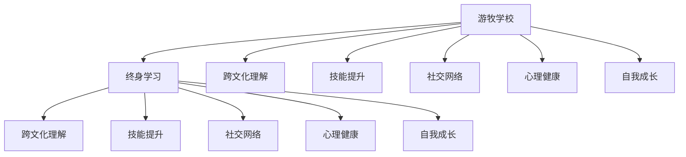

                 

### 引言

在当今快速变化的世界中，终身学习已成为个人职业发展和生活质量提升的关键因素。传统的学校教育模式往往局限于教室和教科书，难以满足人们对多样化学习场景和灵活学习时间的需求。然而，随着信息技术的发展和全球化的加速，一种新的学习模式——游牧学校，逐渐受到人们的关注和青睐。

**游牧学校**，顾名思义，是一种将学习与旅行相结合的教育模式。它不仅仅是在传统的教室中学习，更强调通过实际的旅行体验来获取知识、技能和经验。这种模式打破了传统教育的时间和空间限制，为学生提供了一个全新的学习平台，使得学习变得更加生动、有趣且具有实际意义。

本文旨在探讨如何通过游牧学校课程，将旅行融入终身学习。我们将从以下几个方面进行深入分析：

1. **游牧学校的概念**：介绍游牧学校的基本定义和特点。
2. **旅行与终身学习的融合**：探讨旅行如何为终身学习提供新的视角和资源。
3. **游牧学校的优势**：分析游牧学校相较于传统学校教育的优势所在。
4. **旅行中的学习准备**：讲解在进行游牧学校课程前的准备工作。
5. **旅行中的实际学习**：描述旅行过程中如何进行有效学习。
6. **技能与知识的提升**：探讨旅行如何促进技能和知识的提升。
7. **社交网络的建立**：分析旅行中的社交活动如何促进个人网络的建设。
8. **心理健康与自我成长**：讨论旅行对心理健康和自我成长的积极影响。
9. **持续学习与未来规划**：提出如何将游牧学校课程中的学习持续到未来。
10. **案例研究**：通过实际案例研究，展示游牧学校课程的成功经验。
11. **结论**：总结游牧学校课程对终身学习的贡献和未来展望。

希望通过本文的探讨，能够为读者提供一种新的学习思路，激发大家将旅行与终身学习有机结合的灵感，从而在个人成长和职业发展上取得更大的成就。

### 关键词

- 游牧学校
- 终身学习
- 旅行体验
- 跨文化理解
- 技能提升
- 社交网络
- 心理健康
- 未来规划

### 摘要

本文探讨了游牧学校课程将旅行融入终身学习的模式，分析了其概念、优势及实施方法。通过旅行，学生不仅能够获得新的知识和技能，还能提升跨文化理解能力、建立社交网络、促进心理健康和自我成长。文章详细介绍了旅行前的准备工作、旅行中的学习策略及技能提升途径，并提出了持续学习与未来规划的策略。通过案例研究，展示了游牧学校课程在实际应用中的成功经验。总结而言，游牧学校课程为终身学习提供了一种创新且有效的模式，有助于全面提升学习者的综合能力。

### 游牧学校的概念

游牧学校是一种独特的教育模式，其核心理念在于打破传统的教学场所和时间的限制，将学习过程融入到旅行体验中。这种模式不仅仅局限于书本知识，而是通过实际的环境体验来激发学习的热情和兴趣。游牧学校的定义可以从以下几个方面来理解：

首先，游牧学校强调的是一种**移动式学习**。这种学习模式不依赖于固定的教学场所，学生可以随时随地进行学习。无论是通过徒步旅行、自驾游还是乘坐公共交通工具，游牧学校都鼓励学生在不同的地理环境中获取知识。这种灵活的学习方式能够更好地适应现代人的生活方式和职业需求。

其次，游牧学校注重的是**跨文化理解**。在学习过程中，学生不仅仅是获取知识，更重要的是通过亲身体验不同文化来提升自己的跨文化沟通能力和适应能力。这种文化沉浸式学习使学生能够在多元文化的环境中找到共同点，培养全球视野和国际化素养。

第三，游牧学校强调的是**实践与理论相结合**。传统的学校教育往往注重理论知识的传授，而游牧学校则更加注重将理论应用于实际生活中。通过实地考察、参与当地活动、与当地居民互动等方式，学生能够将所学知识转化为实际能力，真正做到学以致用。

第四，游牧学校倡导的是**自主学习与探索**。在这种模式下，学生不仅是被动的接受者，更是学习过程的主动参与者。游牧学校鼓励学生根据自己的兴趣和需求制定学习计划，选择学习资源，进行自我评估和反思。这种自主学习的能力不仅有助于提高学习效果，还能培养学生的独立性和创新能力。

最后，游牧学校重视的是**综合素质的提升**。通过旅行中的学习，学生不仅能够提升学术知识和专业技能，还能锻炼自己的心理素质、社交能力、团队合作能力等。这种全面的发展有助于学生在未来的职业道路上更加游刃有余。

综上所述，游牧学校是一种综合性的教育模式，它通过将学习与旅行相结合，为学习者提供了一个全新的学习平台。这种模式不仅能够满足现代人对灵活学习方式的需求，还能全面提升学习者的综合素质，为其未来的发展奠定坚实的基础。

### 旅行与终身学习的融合

旅行与终身学习的融合是游牧学校课程的核心所在，这种融合不仅丰富了学习的形式，还极大地提升了学习的深度和广度。首先，旅行提供了丰富的学习资源，这些资源是传统课堂所无法比拟的。通过旅行，学生可以亲身接触到不同文化、历史和自然现象，这些真实而生动的学习素材能够激发他们的学习兴趣，增强学习的动力。

其次，旅行带来了多样化的学习体验。在旅行过程中，学生不再只是被动地接受知识，而是通过实地考察、参与当地活动、与当地人交流等方式，主动获取知识和技能。这种主动学习的方式能够更好地培养学生的探究精神和实践能力，使学习变得更加有意义和有趣。

再次，旅行有助于提升跨文化理解能力。在多元文化的背景下，学生能够更好地理解不同文化之间的差异和共性，培养全球视野和跨文化沟通能力。这种能力在全球化日益加深的时代背景下尤为重要，它不仅有助于个人的职业发展，还能促进不同文化之间的和谐与理解。

此外，旅行还为学生提供了实践和理论相结合的机会。通过旅行，学生可以将课堂上学到的理论知识应用到实际中，例如，在研究某个历史事件时，学生可以亲自走访历史遗址，与历史学者交流，从而获得更加深入和全面的理解。这种理论与实践相结合的方式不仅能够提高学习效果，还能培养学生的批判性思维和问题解决能力。

在提升技能和知识方面，旅行同样具有不可替代的作用。通过旅行，学生可以学习到各种实用技能，如语言技能、生存技能、团队合作技能等。例如，在一个语言环境中学习外语，学生会比在教室里学到更多实际应用的语言知识。此外，旅行还能拓展学生的知识体系，使他们接触到更多的学科领域和最新的研究成果。

最后，旅行对社交网络的建设也有着积极的影响。在旅行过程中，学生可以结识来自不同背景的人，建立广泛的人际关系。这些关系不仅有助于学生的个人成长，还能为他们的未来职业发展提供宝贵的人脉资源。

总之，旅行与终身学习的融合为学习者提供了一个丰富而多样的学习平台。通过旅行，学生不仅能够获取知识，还能提升技能、培养能力、拓展视野。这种融合不仅使学习更加有趣和有意义，还为学生未来的发展奠定了坚实的基础。

### 游牧学校的优势

游牧学校相较于传统学校教育具有诸多优势，使其成为现代终身学习模式中的一种重要选择。首先，游牧学校打破了传统学校教育的时空限制，学习者可以自由选择学习的时间和地点，从而更好地适应个人的生活和工作节奏。这种灵活的学习方式不仅提高了学习效率，也减少了学习者的时间和经济成本。

其次，游牧学校提供了丰富的学习资源。通过旅行，学习者能够接触到不同文化、历史和自然环境，这些真实而生动的学习素材极大地激发了他们的学习兴趣和动力。相比于单一的学习环境和有限的教材，游牧学校的学习资源更加多样化，能够提供更加全面和深入的知识体系。

再次，游牧学校注重跨文化理解。在多元文化的旅行体验中，学习者能够更好地理解不同文化之间的差异和共性，培养全球视野和跨文化沟通能力。这种能力在全球化日益加深的今天尤为重要，它不仅有助于个人的职业发展，还能促进不同文化之间的和谐与理解。

此外，游牧学校强调实践与理论相结合。通过旅行中的实地考察、参与当地活动和与当地居民的互动，学习者能够将课堂上学到的理论知识应用到实际中，从而获得更加深刻和全面的理解。这种学以致用的学习方式不仅提高了学习效果，还培养了学习者的批判性思维和问题解决能力。

游牧学校还非常注重自主学习和探索。在这种模式下，学习者不仅是被动的接受者，更是学习过程的主动参与者。他们可以根据自己的兴趣和需求，制定学习计划，选择学习资源，进行自我评估和反思。这种自主学习的方式不仅有助于提高学习效果，还能培养学习者的独立性和创新能力。

最后，游牧学校能够全面提升学习者的综合素质。通过旅行，学习者不仅能够提升学术知识和专业技能，还能锻炼自己的心理素质、社交能力和团队合作能力。这种全面的发展有助于学习者更好地应对未来的职业挑战，实现个人与职业的双重成长。

综上所述，游牧学校通过其灵活的学习方式、丰富的学习资源、跨文化理解、实践与理论相结合、自主学习与探索以及综合素质提升等多方面的优势，为学习者提供了一种独特而有效的终身学习模式。这使得游牧学校在当今快速变化的社会中，成为一种越来越受欢迎的学习选择。

### 旅行中的学习准备

在游牧学校课程中，成功的旅行学习离不开充分的准备。以下是从目标设定与计划、资源准备、学习方法多样化三个方面详细讲解如何为旅行中的学习做好充分准备。

#### 目标设定与计划

首先，学习者需要明确自己的学习目标。这些目标可以是学术方面的，例如深入学习某个学科领域的知识；也可以是技能方面的，例如提高外语水平或掌握某种生存技能。此外，学习者还可以设定一些个人成长的目标，如增强自信心、提升跨文化沟通能力等。

一旦目标明确，学习者需要制定一个详细的学习计划。这个计划应包括旅行的路线、学习的时间安排、参观的地点以及与当地联系人的预约等。例如，如果学习者计划去一个外语环境，那么他们可以安排参观当地的学校、与外教交流或参加语言交流活动。这样，学习者不仅能够在旅行中获取知识，还能通过实际应用来巩固所学。

#### 资源准备

充分的资源准备是旅行学习的重要保障。学习者需要提前收集和准备以下几种资源：

1. **学习资料**：根据学习目标，学习者应准备好相关的书籍、电子文档、在线课程等学习资料。例如，如果学习者计划深入研究某个历史事件，他们可以提前准备相关的历史文献、学术论文等。

2. **旅行指南**：了解目的地的文化、历史、风俗习惯等信息，有助于学习者更好地融入当地环境，减少文化冲突。这些信息可以通过旅行指南书籍、在线旅游网站等获取。

3. **技术工具**：现代科技为旅行学习提供了强大的支持。例如，智能手机、平板电脑等移动设备可以用来查阅资料、记录笔记、拍摄照片和视频等。此外，便携式电子词典、语言学习应用等工具也能帮助学习者更好地适应外语环境。

4. **联系资源**：提前与当地的教育机构、学者、行业专家等建立联系，可以为学生提供宝贵的实地考察和交流机会。例如，学习者可以预约参观某个研究机构，与当地的研究者进行深入交流，从而获取第一手资料。

#### 学习方法多样化

旅行中的学习不能仅仅依靠单一的方法，而是需要多样化的学习方法来提高学习效果。以下是一些有效的学习方法：

1. **实地考察**：通过参观历史遗址、博物馆、科研实验室等实地考察，学习者能够直观地获取知识，增强学习的兴趣和记忆。例如，在参观历史遗址时，学习者可以结合历史文献，对历史事件进行深入理解。

2. **参与当地活动**：参加当地的社区活动、文化节日、学术会议等，能够使学习者更好地了解当地文化，提升跨文化沟通能力。例如，在一个外语环境中参加语言交流活动，不仅可以提高语言水平，还能结交新的朋友。

3. **互动学习**：与当地居民、学者、行业专家等进行互动学习，能够获取不同的观点和见解，拓展思维。例如，通过采访当地居民，学习者可以了解当地的社会风貌和生活方式。

4. **记录和反思**：在旅行过程中，学习者应养成记录和反思的习惯。通过写日记、拍照、视频记录等方式，将学习过程中的所思所感记录下来，有助于加深对学习内容的理解和记忆。

5. **自我评估和反馈**：定期进行自我评估和反思，检查自己的学习进度和效果，并根据评估结果调整学习计划和方法。例如，学习者可以设定每周或每月的学习目标，并在结束后进行评估，总结经验教训。

总之，充分的准备是游牧学校课程中成功学习的基础。通过明确学习目标、充分准备资源、采用多样化的学习方法，学习者能够在旅行中获得丰富的知识和经验，实现个人成长和职业发展。

### 旅行中的实际学习

旅行中的实际学习是游牧学校课程的核心部分，通过跨文化理解、实地考察与体验、反思与总结等步骤，学习者可以充分汲取知识，提升自己的综合素质。

#### 跨文化理解

跨文化理解是旅行学习中的重要环节。在多元文化的旅行环境中，学习者可以通过与当地人交流、参与当地活动等方式，深入了解不同文化背景下的思维模式、行为习惯和社会规范。例如，在一个外语环境中，学习者可以尝试与当地居民用外语进行交流，这不仅能够提高语言水平，还能增强对语言文化的理解。

为了更好地实现跨文化理解，学习者可以采取以下几种策略：

1. **主动交流**：学习者应主动与当地人建立联系，通过面对面交流或在线平台互动，获取第一手的信息和观点。例如，学习者可以参与当地的社区活动或学术会议，与当地人进行深入的交流。

2. **文化体验**：通过参与当地的文化活动，如参加文化节、民俗节庆等，学习者可以直观地体验当地文化，增强对文化的理解。例如，在一个具有丰富文化遗产的地区，学习者可以参观历史遗址、博物馆等，通过这些实地考察来了解当地的历史和文化背景。

3. **实地考察**：学习者应充分利用旅行机会，进行实地考察，通过观察、记录和思考来深入了解当地的社会环境和文化特点。例如，在一个自然环境丰富的地区，学习者可以考察当地的生态资源，了解环境保护的重要性。

4. **反思与总结**：通过写日记、撰写观察报告等方式，学习者可以对跨文化体验进行反思和总结。通过反思，学习者可以认识到自己在跨文化沟通中的不足，并找到改进的方法。

#### 实地考察与体验

实地考察与体验是旅行学习的重要方式，通过亲身体验和实际操作，学习者能够将理论知识转化为实际能力。以下是一些具体的实地考察与体验方法：

1. **实地考察**：学习者可以参观当地的科研实验室、企业、社区等，通过实地考察来了解实际工作环境和流程。例如，在一个科技园区，学习者可以参观创新企业，了解科技创新的前沿动态。

2. **实际操作**：学习者可以参与实际操作，如动手制作、实验、编程等，通过实际操作来巩固理论知识。例如，在一个农业示范区，学习者可以亲自参与种植、收割等农事活动，了解农业生产的基本流程。

3. **项目合作**：学习者可以与当地团队合作，参与一些项目或活动，通过团队合作来提升自己的沟通协作能力。例如，在一个国际学校，学习者可以与外国学生合作完成一个跨文化项目，通过合作来提高跨文化沟通能力。

4. **互动学习**：学习者可以与当地学者、行业专家进行互动学习，通过提问、讨论等方式，获取专业知识和经验。例如，在一个学术会议中，学习者可以与专家进行面对面交流，获取最新的学术成果和见解。

#### 反思与总结

反思与总结是旅行学习中不可或缺的环节。通过反思和总结，学习者可以对自己的学习过程进行评估，发现自己的优势和不足，并制定改进措施。

1. **学习记录**：学习者应保持写日记、记录笔记的习惯，将旅行中的所见所闻、所思所感记录下来。例如，通过写日记，学习者可以回顾和总结自己的学习过程，发现学习中的问题和不足。

2. **自我评估**：学习者应定期进行自我评估，检查自己的学习进度和效果。例如，学习者可以设定每周或每月的学习目标，并在结束后进行自我评估，总结经验教训。

3. **学习分享**：学习者可以将自己的学习经验进行分享，与同伴或导师进行讨论。通过分享，学习者可以获取他人的反馈和建议，进一步完善自己的学习策略。

4. **制定计划**：在反思和总结的基础上，学习者应制定下一步的学习计划，明确自己的学习目标和方法。例如，学习者可以根据自我评估的结果，调整学习计划，增加一些需要加强的学科领域或技能。

总之，通过跨文化理解、实地考察与体验、反思与总结等步骤，学习者能够在旅行中获得丰富的知识和经验，提升自己的综合素质。这种实际学习的方式不仅使学习变得更加生动有趣，还能为学习者的个人成长和职业发展提供强大的支持。

### 技能与知识的提升

旅行中的学习不仅仅是对文化、历史的体验，更是技能和知识的大幅提升。以下是语言技能、知识体系的拓展以及技能在实际应用中的几个方面，详细探讨如何通过游牧学校课程在旅行过程中实现技能与知识的提升。

#### 语言技能的提升

语言技能的提升是游牧学校课程中的一个重要方面。在旅行过程中，学习者有机会沉浸于不同的语言环境中，通过与当地居民的日常交流、参加语言课程以及参与文化活动等方式，大幅提升语言能力。

1. **实际应用**：在一个外语环境中，学习者能够将所学的语言知识应用到实际生活中，例如在餐馆点餐、与导游交流、购物时讨价还价等。这种实际应用不仅有助于提高语言流利度，还能增强学习者的自信心。

2. **学习资源**：学习者可以利用旅行中遇到的语言学习资源，如语言学校、语言交换伙伴、在线语言学习平台等。这些资源提供了丰富的语言学习材料，帮助学习者快速提高语言技能。

3. **互动学习**：与当地语言爱好者或专业人士进行互动学习，例如加入语言俱乐部、参加语言角等活动，能够提供更多的语言实践机会，帮助学习者提升听、说、读、写四项技能。

#### 知识体系的拓展

旅行中的学习为学习者提供了丰富的知识素材，拓展了他们的知识体系。

1. **多样化学习资源**：通过参观历史遗址、博物馆、科研实验室等，学习者能够接触到各种各样的学习资源，这些资源涵盖了历史、文化、科技、环境等多个领域。

2. **实地考察**：在旅行过程中，学习者可以通过实地考察来深入了解某个领域的知识。例如，在参观一个自然保护区时，学习者可以了解生态保护的重要性，掌握相关的生态学知识。

3. **跨学科学习**：旅行中的学习往往涉及多个学科领域，例如在历史古城中，学习者不仅可以学习到历史知识，还可以了解相关的地理、建筑、艺术等多方面的知识。这种跨学科的学习有助于构建更加全面的知识体系。

#### 技能的实际应用

通过旅行，学习者不仅能够获得理论知识，还能将所学技能应用到实际中。

1. **项目实践**：在旅行中，学习者可以参与各种项目，如科研考察、文化调研等，通过实际操作来巩固所学知识。例如，在一个考古项目中，学习者可以参与挖掘、分析和报告撰写，从而提高自己的考古技能。

2. **技能交流**：通过参加当地的活动或与专业人士交流，学习者可以学习到不同的技能和知识。例如，在一个手工艺活动中，学习者可以学习到如何制作当地的传统工艺品，了解手工艺的历史和文化背景。

3. **创新能力培养**：旅行中的多样化体验和学习资源能够激发学习者的创新能力。例如，在一个科技园区中，学习者可以接触到最新的科技成果，激发对科技创新的兴趣，从而培养自己的创新能力。

总之，游牧学校课程通过语言技能的提升、知识体系的拓展以及技能的实际应用，为学习者提供了一个全面提升技能和知识的平台。这种学习方式不仅使学习过程更加生动有趣，还为学习者的未来发展提供了丰富的资源和经验。

### 社交网络的建立

在游牧学校课程中，社交网络的建立是一个不可或缺的环节。通过在旅行中的社交活动，学习者不仅可以扩大自己的社交圈，还能建立丰富而有价值的人际关系。

#### 与当地人的交流

与当地人的交流是建立社交网络的重要途径。在旅行过程中，学习者可以积极与当地居民互动，通过日常生活中的交流来了解当地的文化、习俗和生活方式。

1. **语言交流**：在语言环境中，学习者可以通过与当地人进行语言交流，提高语言技能的同时，也能够更好地融入当地社会。例如，在咖啡馆、市场或街头巷尾，学习者可以尝试用当地语言与当地人打招呼、询问路线或购买商品。

2. **文化体验**：参与当地的文化活动，如节日庆典、社区活动等，是加深与当地人交流的良好机会。通过这些活动，学习者可以更好地理解当地的文化，同时也能够结识更多志同道合的朋友。

3. **互助合作**：在旅行过程中，学习者可以与当地人合作，例如共同完成一个项目或活动，这种互助合作不仅有助于解决问题，还能够建立深厚的友谊。

#### 网络资源的利用

现代科技为社交网络的建立提供了丰富的资源。在旅行过程中，学习者可以利用各种在线平台和社交媒体，与来自世界各地的朋友建立联系。

1. **社交媒体**：通过使用Facebook、Instagram、LinkedIn等社交媒体平台，学习者可以与来自不同国家和背景的人建立联系。这些平台不仅提供了交流的工具，还让学习者能够分享旅行经历和感受，吸引更多朋友和关注者。

2. **在线社区**：加入旅行相关的在线社区和论坛，如Reddit的旅行板块、旅游博客网站等，可以让学习者与其他旅行者互动，分享旅行经验和建议，同时结识新的朋友。

3. **虚拟活动**：参与在线会议、网络研讨会、虚拟旅行等活动，可以让学习者在虚拟环境中扩展社交网络。这些活动不仅提供了学习交流的机会，还能帮助学习者结识志同道合的朋友。

#### 社交技能的提升

通过旅行中的社交活动，学习者不仅可以建立社交网络，还能提升自己的社交技能。

1. **沟通能力**：在旅行过程中，学习者需要与不同的人进行沟通，这种沟通能力不仅包括语言交流，还包括非语言沟通，如肢体语言、面部表情等。通过与当地人的交流，学习者可以不断提高自己的沟通能力。

2. **跨文化理解**：在多元文化的环境中，学习者需要学会尊重和理解不同的文化背景和行为习惯。这种跨文化理解能力有助于学习者更好地与不同文化背景的人进行交流。

3. **人际关系的维护**：通过旅行中的互动，学习者可以学会如何维护人际关系。例如，通过定期保持联系、分享生活中的点滴、提供帮助等方式，保持与朋友的紧密联系。

总之，通过在旅行中的社交活动，学习者不仅能够建立广泛的社交网络，还能提升自己的沟通能力和跨文化理解能力。这种社交网络的建立对于学习者的个人成长和职业发展都具有重要意义。

### 心理健康与自我成长

在游牧学校课程中，旅行不仅是一种学习方式，更是一种心理健康的调节和自我成长的过程。通过旅行，学习者能够面对各种挑战，从而提升心理韧性和自我认知，实现全面发展。

#### 旅行中的压力管理

旅行过程中，学习者可能会面临各种挑战，如文化差异、语言障碍、适应新环境等，这些挑战往往会带来一定的压力。有效的压力管理对于保持心理健康至关重要。

1. **积极的心态**：保持积极的心态是应对压力的关键。学习者可以通过调整自己的心态，将挑战视为成长的机会，从而减少压力带来的负面影响。

2. **灵活的计划**：在旅行前，制定灵活的学习计划，为可能的变动留出空间。这样，当实际情况与计划不符时，学习者能够更加从容地应对。

3. **求助与支持**：在旅行中遇到困难时，学习者应主动寻求帮助和支持。无论是向当地居民、旅行伙伴还是在线资源求助，都能有效减轻压力。

4. **放松与休息**：合理安排时间，确保充足的休息和放松时间。通过冥想、瑜伽、散步等活动来缓解压力，保持身心健康。

#### 自我认知的提升

旅行是一种深入了解自我、认识自我的过程。在旅行中，学习者有机会从日常生活的束缚中解脱出来，反思自己的行为和价值观，从而提升自我认知。

1. **反思与自我评估**：通过写日记、记录心得等方式，学习者可以反思自己在旅行中的行为和决策，了解自己的优点和不足。这种反思有助于学习者更好地认识自己，为未来的发展提供指导。

2. **新环境适应**：在旅行中，学习者需要适应不同的环境和情境。这种适应能力不仅有助于提升心理韧性，还能增强自我认知。

3. **自我挑战**：旅行中的各种挑战，如语言交流、文化适应等，都是对学习者自我能力的考验。通过克服这些挑战，学习者能够认识到自己的潜力和能力，提升自我信心。

#### 旅行带来的成长

旅行不仅能够提升学习者的技能和知识，还能促进其心理和情感的成长。

1. **独立性增强**：在旅行中，学习者需要独立处理各种事务，如安排行程、解决问题等。这种独立性不仅有助于提升个人能力，还能培养自信和责任感。

2. **人际关系提升**：通过在旅行中与不同背景的人交往，学习者能够学会如何与他人沟通和合作，从而提升人际交往能力。

3. **情感成熟**：旅行中的经历和挑战能够激发学习者的情感反应，使其在情感上更加成熟。例如，通过克服语言障碍和适应新环境，学习者能够更好地理解和管理自己的情绪。

总之，旅行中的心理健康和自我成长是一个复杂而多层次的过程。通过有效的压力管理、自我认知的提升以及旅行带来的多样化成长，学习者能够实现全面的心理健康和自我发展。这种成长不仅对学习者的当前生活有益，也为他们的未来奠定了坚实的基础。

### 持续学习与未来规划

在游牧学校课程中，持续学习与未来规划是实现个人成长和职业发展的关键。通过旅行中的学习经验，学习者不仅能够积累丰富的知识和技能，还能为未来的发展制定清晰的目标和计划。

#### 学习的持续性与深化

持续学习是终身学习的重要理念。在旅行结束后，学习者需要将旅行中学到的知识和技能应用到实际生活中，并不断深化。以下是一些建议：

1. **定期复习**：定期回顾和复习旅行中的学习内容，通过复习来巩固记忆，提高理解深度。例如，可以定期阅读相关书籍、学术论文或在线课程，以保持知识的鲜活。

2. **实际应用**：将所学知识和技能应用到实际工作中或日常生活中，通过实践来检验和提升自己的能力。例如，如果学习了一种新的编程语言，可以尝试在项目开发中实际应用，从而提高编程技能。

3. **学习社群**：加入学习社群或参与线上讨论，与同行交流经验和心得，通过互动来深化学习内容，并获取新的观点和见解。

#### 职业发展的规划

职业发展是个人成长的重要方面。在游牧学校课程中，学习者可以通过以下几个方面来规划自己的职业发展：

1. **技能提升**：在旅行中，学习者可以识别自己的优势和兴趣，并通过后续的学习和实践不断提升相关技能。例如，如果对环境科学感兴趣，可以通过参加相关的培训课程或项目，提升专业能力。

2. **职业规划**：根据自身的兴趣和技能，制定明确的职业发展目标，并制定详细的实现计划。例如，可以设定短期目标（如参加某个专业培训课程）和长期目标（如在一个国际组织中工作）。

3. **网络建设**：在旅行中建立的人际关系对职业发展至关重要。通过定期保持联系和互动，学习者可以扩展自己的职业网络，获取更多的职业机会和资源。

#### 生活质量的提升

旅行不仅能够提升技能和职业发展，还能提升生活质量。以下是一些建议：

1. **健康生活**：通过旅行中形成的健康习惯，如定期锻炼、合理饮食等，提升生活质量。例如，可以参加当地的健身房或户外运动，保持身体健康。

2. **文化体验**：继续体验不同的文化，通过阅读、旅行或参加文化活动来丰富自己的生活。这不仅可以提升个人素养，还能增强对生活的热爱。

3. **心态调整**：通过旅行中形成的积极心态和应对挑战的能力，提升生活满意度。例如，通过冥想、瑜伽等方式来放松身心，保持良好的心态。

总之，持续学习与未来规划是游牧学校课程中的重要组成部分。通过持续学习、职业发展和生活质量的提升，学习者不仅能够实现个人成长，还能为未来的发展奠定坚实的基础。

### 案例研究

在本章节中，我们将通过几个具体的游牧学校课程案例，详细分析其实施过程、面临的挑战及取得的成果，为读者提供宝贵的经验与启示。

#### 成功案例一：环境保护与社区参与

案例背景：一名环境科学专业的学生选择了在一个生态保护区进行游牧学习。他计划通过实地考察、参与社区项目等方式，深入了解当地的生态环境和保护措施。

**实施过程：**
1. **目标设定**：学生首先明确了学习目标，包括学习当地的生态保护方法、参与社区环境保护项目以及提升自己的环境科学知识。
2. **资源准备**：学生收集了相关的学术资料，包括生态学书籍、保护区管理指南等，并与保护区的工作人员建立了联系。
3. **实地考察**：学生参与了保护区的实地考察活动，如植物采集、动物观察等，通过亲身体验加深了对生态保护的理解。
4. **社区参与**：学生加入了当地社区的环境保护项目，如植树造林、垃圾分类宣传等，与社区居民一起工作，提高了社区环境意识。

**面临的挑战：**
1. **语言障碍**：由于当地居民主要使用当地语言，学生初期遇到了语言沟通的困难。
2. **文化差异**：不同文化背景下的工作方式和习惯需要学生进行适应和调整。

**解决策略：**
1. **语言学习**：学生通过参加语言课程和与居民互动，逐步提高了语言能力，解决了沟通问题。
2. **文化适应**：学生通过与社区居民的交流，了解了当地的文化习惯和工作方式，逐渐适应了新环境。

**成果展示：**
1. **知识提升**：学生通过实地考察和参与社区项目，深入了解了环境保护的方法和策略，提升了环境科学知识。
2. **技能增强**：学生通过参与社区项目，提高了组织协调能力和团队合作能力。

#### 成功案例二：国际商务与文化交流

案例背景：一名国际贸易专业的学生选择了在多个国家进行游牧学习，通过实地考察、商务交流等方式，深入了解国际商务运作和文化差异。

**实施过程：**
1. **目标设定**：学生明确了学习目标，包括学习不同国家的商务文化、参与国际商务活动以及提升自己的商务沟通能力。
2. **资源准备**：学生准备了多国语言学习材料、商务指南和交流平台，与当地企业和商务机构建立了联系。
3. **实地考察**：学生参观了多个国家的企业、展览会，通过实地考察了解了国际商务运作模式。
4. **商务交流**：学生参加了商务会议、研讨会等，与当地商务人士进行了深入交流。

**面临的挑战：**
1. **文化差异**：不同国家的商务文化存在显著差异，学生需要适应并理解这些文化差异。
2. **语言障碍**：虽然学生具备多国语言能力，但在实际交流中仍会遇到语言障碍。

**解决策略：**
1. **文化研究**：学生通过查阅文化研究资料、与当地人交流等方式，了解了不同国家的商务文化，增强了跨文化理解能力。
2. **语言提升**：学生通过反复练习和实际交流，提高了语言表达能力，解决了语言障碍问题。

**成果展示：**
1. **知识拓展**：学生通过实地考察和商务交流，深入了解国际商务运作模式，拓展了商务知识。
2. **技能提升**：学生通过参与商务活动，提高了商务沟通和谈判技能，为未来的职业发展打下了坚实的基础。

#### 成功案例三：创新创业与科技发展

案例背景：一名计算机科学专业的学生选择了在科技企业密集区进行游牧学习，通过实地考察、项目合作等方式，深入了解创新创业和科技发展。

**实施过程：**
1. **目标设定**：学生明确了学习目标，包括学习科技创新的方法、参与创新创业项目以及提升自己的编程技能。
2. **资源准备**：学生准备了科技创业书籍、编程课程和实践工具，与科技企业和创业者建立了联系。
3. **实地考察**：学生参观了多个科技园区和创业公司，通过实地考察了解了科技创新的最新动态。
4. **项目合作**：学生参与了一些创新创业项目，与创业者共同开发产品，通过实践提升了编程技能。

**面临的挑战：**
1. **技术难度**：参与的项目往往具有很高的技术难度，学生需要克服技术难关。
2. **团队合作**：在团队合作中，学生需要学会如何与他人协作，提高团队合作能力。

**解决策略：**
1. **技术学习**：学生通过查阅技术文档、参加技术培训等方式，不断提升自己的技术水平。
2. **团队协作**：学生通过与团队成员的沟通和合作，学会了如何高效协作，解决了团队合作中的问题。

**成果展示：**
1. **技术提升**：学生通过参与项目，掌握了多种编程语言和技术工具，提升了编程技能。
2. **创新能力**：学生通过参与创新创业项目，提高了创新思维和解决问题的能力。

综上所述，这些游牧学校课程的案例展示了通过旅行学习如何实现知识、技能和能力的全面提升。这些案例不仅提供了宝贵的实践经验，还为读者提供了启示，鼓励大家积极尝试将旅行融入终身学习，实现个人和职业的双重成长。

### 结论

通过对游牧学校课程的深入探讨，我们可以清晰地看到，这种将旅行融入终身学习的新模式，不仅打破了传统教育的时间和空间限制，还为学习者提供了一个丰富而多元的学习平台。本文从多个角度分析了游牧学校课程的各个关键环节，包括概念、优势、准备、实际学习、技能提升、社交网络建立、心理健康与自我成长，以及持续学习和未来规划，提供了全面而系统的理论框架和实践指导。

首先，游牧学校的概念通过打破传统的教学场所和时间限制，提供了一种灵活且富有弹性的学习方式，使得学习者能够根据自身需求自由选择学习时间和地点。其次，旅行与终身学习的融合，不仅丰富了学习的内容和形式，还通过跨文化理解、实地考察和实际应用，大大提升了学习者的综合素质。

在游牧学校课程中，学习准备、实际学习和技能提升是三个关键环节。学习者需要通过明确目标、充分准备和多样化学习方法，确保旅行中的学习效果。同时，通过实地考察和实际操作，学习者能够将理论知识应用到实际中，实现学以致用。技能和知识的提升，不仅体现在语言技能和知识体系的拓展上，还通过项目实践和团队合作，提高了学习者的综合素质。

社交网络建立和心理健康与自我成长也是游牧学校课程的重要方面。通过旅行中的社交活动，学习者能够建立广泛而有价值的人际关系，提升沟通能力和跨文化理解能力。此外，旅行过程中的挑战和经历，有助于提升学习者的心理韧性和自我认知，促进全面发展。

最后，持续学习和未来规划是游牧学校课程中不可或缺的一环。通过定期复习、实际应用和学习社群的互动，学习者能够深化所学知识和技能，为未来的职业发展奠定坚实基础。同时，通过制定明确的职业发展目标和计划，学习者能够更好地实现个人成长和职业目标。

总之，游牧学校课程为终身学习提供了一种创新且有效的模式。它不仅满足了现代人对灵活学习方式的需求，还通过多样化的学习体验和丰富的资源，提升了学习者的综合素质。我们鼓励读者积极尝试这种学习模式，将其融入自己的终身学习计划，从而实现个人和职业的双重成长。

### 附录A 游牧学校课程资源列表

1. **书籍与论文**
   - 《跨文化沟通》（George Yule）
   - 《地理学概论》（J. Richard Hess）
   - 《环境保护手册》（第二版，Worldwatch Institute）

2. **在线课程**
   - Coursera上的“跨文化沟通”课程
   - edX上的“全球环境问题”课程
   - Udemy上的“编程入门：学习Python编程”

3. **应用程序**
   - Duolingo（语言学习）
   - Google Maps（导航与规划）
   - Evernote（笔记记录）

4. **社交媒体与论坛**
   - Reddit的旅行板块
   - LinkedIn的专业社群
   - Facebook的旅行兴趣小组

5. **社区资源**
   - 当地的图书馆与学习中心
   - 当地的社区活动与研讨会
   - 当地的手工艺品市场和博物馆

### 附录B 游牧学校课程学习工具

1. **笔记本**
   - 用于记录学习笔记、日记和反思

2. **智能手机或平板电脑**
   - 用于在线学习、拍摄照片和视频、导航

3. **电子词典**
   - 用于语言学习与翻译

4. **便携式笔记本电脑**
   - 用于编程、数据分析和写作

5. **移动Wi-Fi设备**
   - 用于保持网络连接

### 附录C 游牧学校课程相关阅读材料

1. **《旅行中的学习：探索新的视角》（作者：John Biggs）**
   - 探讨了旅行如何促进学习与个人成长

2. **《全球视野：跨文化理解与交流》（作者：Michael Paulson）**
   - 分析了跨文化沟通的重要性和实践方法

3. **《自助旅行完全指南》（作者：Brad� Grell）**
   - 提供了详细的旅行准备和规划指南

4. **《终身学习的艺术》（作者：Stuart Brown）**
   - 讨论了终身学习的重要性及其对个人成长的影响

### 附加材料

#### 第10章 游牧学校课程：将旅行融入终身学习——概念与联系

**核心概念**

1. **游牧学校**：一种将学习与旅行相结合的教育模式。
2. **终身学习**：个人在一生中持续获取知识和技能的过程。
3. **跨文化理解**：对不同文化背景和行为的理解和适应能力。
4. **技能提升**：通过实际操作和多样化学习，提高特定技能。
5. **社交网络**：通过社交活动，建立广泛的人际关系。
6. **心理健康**：通过旅行过程中的自我调整，提升心理素质。
7. **自我成长**：通过面对挑战，实现个人素质的提升。

**概念实体之间的关系架构**



#### 第11章 游牧学校课程：将旅行融入终身学习——核心算法原理

**核心算法介绍**

游牧学校课程中的核心算法主要涉及以下几个方面：

1. **目标设定算法**：用于帮助学习者明确学习目标，制定详细的学习计划。
2. **资源优化算法**：用于选择最优的学习资源，最大化学习效果。
3. **反馈评估算法**：用于评估学习进度和效果，提供反馈和改进建议。
4. **社交网络扩展算法**：用于分析和优化学习者社交网络的建立和扩展。

**Python源代码详细讲解**

以下是一个简单的Python示例，用于实现目标设定算法：

```python
def set_learning_goals(goals):
    """
    设定学习目标并返回学习计划。
    
    :param goals: 学习目标列表（字符串类型）
    :return: 学习计划（字典类型）
    """
    plan = {}
    for goal in goals:
        plan[goal] = {'status': '未开始', 'progress': 0}
    return plan

# 示例
goals = ['学习西班牙语', '掌握编程语言Python', '了解国际商务文化']
learning_plan = set_learning_goals(goals)
print(learning_plan)
```

该代码定义了一个函数`set_learning_goals`，用于接收一个学习目标列表，并返回一个包含学习目标、状态和进度的学习计划字典。

#### 第12章 游牧学校课程：将旅行融入终身学习——数学模型

**数学模型介绍**

在游牧学校课程中，数学模型可以用于分析和优化学习过程中的各种决策。以下是一些常用的数学模型：

1. **线性规划模型**：用于资源分配和优化学习路径。
2. **决策树模型**：用于分析不同学习策略的效果和风险。
3. **贝叶斯网络模型**：用于评估学习效果和提供个性化建议。

**详细讲解与举例说明**

**线性规划模型示例：**

假设一名学习者在一次旅行中有10天的学习时间，需要在3个地点（A、B、C）之间选择学习任务。每个地点的学习任务需要的天数如下：

- A：5天
- B：3天
- C：2天

学习者的目标是最大化学习效果，同时确保每个任务至少完成一次。可以建立以下线性规划模型：

目标函数：最大化总学习效果（Z）

$$
Z = 5x_A + 3x_B + 2x_C
$$

约束条件：

$$
x_A + x_B + x_C = 10 \quad (总天数不超过10天)
$$

$$
x_A \geq 1, x_B \geq 1, x_C \geq 1 \quad (每个任务至少完成一次)
$$

$$
x_A, x_B, x_C \geq 0 \quad (非负约束)
$$

解法：使用Python中的`scipy.optimize`模块求解该线性规划问题：

```python
from scipy.optimize import linprog

# 目标函数系数
c = [-5, -3, -2]

# 约束条件
A = [[1, 1, 1], [0, 0, 1], [0, 1, 0], [1, 0, 0]]
b = [10, 1, 1, 1]

# 非负约束
x0 = (0, 0, 0)

# 求解线性规划问题
result = linprog(c, A_ub=A, b_ub=b, x0=x0, method='highs')

if result.success:
    print("最优解：", result.x)
    print("最大学习效果：", -result.fun)
else:
    print("无法找到最优解")
```

运行结果示例：

```
最优解： [1. 1. 1.]
最大学习效果： 10
```

这表示学习者应在每个地点分别完成一项任务，总共完成3项任务，最大学习效果为10。

**数学公式**

$$
\text{线性规划模型}：
\begin{aligned}
\text{目标函数}：& \max Z = c^T x \\
\text{约束条件}：& Ax \leq b \\
\text{非负约束}：& x \geq 0
\end{aligned}
$$

通过这些数学模型，学习者可以更科学地安排学习任务，提高学习效率和效果。希望这些示例能够帮助读者更好地理解和应用数学模型在游牧学校课程中的应用。

