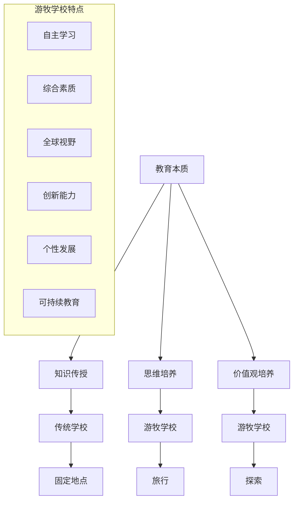

                 

## 2.3 游牧学校的理论基础

### 2.3.1 康德的教育理念

德国哲学家伊曼努尔·康德（Immanuel Kant）认为教育不仅是传授知识，更是塑造人格的过程。他主张教育应关注学生的道德修养和责任感。游牧学校通过让学生在旅途中面对各种挑战和困境，培养了他们的道德品质和责任感。

### 2.3.2 孔子的教育理念

中国古代教育家孔子（Confucius）强调教育应以道德教育为核心，培养人的德行和品德。游牧学校在旅行中注重传统文化的传承，通过实地考察和交流，让学生深入了解和体验不同文化的道德观念和价值体系。

### 2.3.3 素质教育的理念

现代教育提倡素质教育，注重学生全面发展，不仅限于知识的传授，更强调培养学生的创新意识、实践能力和团队协作精神。游牧学校通过多样化的课程设置和实践活动，全面提升了学生的综合素质。

## 2.4 游牧学校的核心概念与联系

### 2.4.1 游牧学校与自主学习

游牧学校鼓励学生自主学习，培养他们的探究精神和批判性思维。学生通过在旅行中的自主学习和探索，能够更好地理解和掌握知识，提高学习效果。

### 2.4.2 游牧学校与综合素质

游牧学校通过多样化的课程和实践活动，培养了学生的综合素质，包括语言表达能力、跨文化交流能力、团队合作能力等。这些能力在现代社会中尤为重要，有助于学生更好地适应未来社会。

### 2.4.3 游牧学校与全球视野

游牧学校通过旅行和实地考察，让学生接触到不同的文化和社会环境，拓宽了他们的视野。这种全球视野有助于学生更好地理解和应对全球化带来的挑战，培养他们的国际竞争力。

### 2.4.4 游牧学校与创新能力

游牧学校注重培养学生的创新能力，鼓励学生在旅行中发现问题、分析问题并解决问题。这种创新能力在现代社会中至关重要，有助于学生在未来竞争中脱颖而出。

### 2.4.5 游牧学校与个性发展

游牧学校尊重学生的个性发展，根据学生的兴趣和特长设计个性化的课程和活动。这种个性化的教育有助于学生发挥自己的潜能，实现自我价值。

### 2.4.6 游牧学校与可持续教育

游牧学校强调环保意识和可持续发展理念，通过旅行活动培养学生的环保意识和社会责任感。这种可持续教育有助于培养学生的社会责任感和可持续发展观念。

## 2.5 游牧学校与教育本质的Mermaid流程图



通过上述Mermaid流程图，可以清晰地展示游牧学校与传统学校在教育本质上的区别和联系。游牧学校通过其独特的特点，更好地实现了教育本质的培养目标，为学生提供了更加全面和深入的教育体验。

### 第二部分：游牧学校的理论基础

## 2.6 游牧学校的核心算法原理

在游牧学校的实施过程中，核心算法原理扮演着至关重要的角色。这些算法不仅决定了课程的设置和活动安排，还影响了学生的学习和成长过程。以下将详细阐述游牧学校中涉及的核心算法原理，包括其基本概念、应用场景以及具体的实现方法。

### 2.6.1 自适应学习算法

**基本概念**：

自适应学习算法是一种基于数据分析和模型调整的学习方法。它通过分析学生的学习行为、成绩和反馈，动态调整教学策略和学习路径，以最大化学习效果。

**应用场景**：

在游牧学校中，自适应学习算法可以应用于以下场景：

- **个性化课程推荐**：根据学生的兴趣和特长，推荐合适的课程和活动，提高学习兴趣和效果。
- **学习进度调整**：根据学生的学习进度和能力，动态调整课程难度和教学节奏，确保每个学生都能跟上教学进度。
- **学习效果评估**：通过分析学生的考试成绩和学习行为，评估教学效果，及时调整教学方法。

**实现方法**：

1. **数据采集**：通过学习平台收集学生的学习行为、考试成绩和反馈数据。
2. **数据分析**：利用机器学习和数据挖掘技术，分析学生数据，发现学习规律和问题。
3. **模型调整**：根据分析结果，动态调整教学策略和学习路径，优化学习体验。

### 2.6.2 项目导向学习算法

**基本概念**：

项目导向学习算法是一种以项目为载体，通过实际操作和团队合作，培养学生实践能力和创新意识的方法。

**应用场景**：

在游牧学校中，项目导向学习算法可以应用于以下场景：

- **课程设计**：围绕实际项目，设计相应的课程和活动，提高学生的实践能力。
- **团队合作**：通过团队合作，培养学生的团队合作能力和沟通能力。
- **创新能力培养**：鼓励学生在项目中提出创新想法和解决方案，培养创新能力。

**实现方法**：

1. **项目选择**：根据学生的兴趣和特长，选择具有挑战性和实践性的项目。
2. **项目实施**：指导学生进行项目实施，包括项目规划、任务分配、进度控制和成果评估。
3. **项目反馈**：通过项目反馈，总结项目经验，调整项目设计和教学方法。

### 2.6.3 跨文化学习算法

**基本概念**：

跨文化学习算法是一种通过文化交流和体验，培养学生的跨文化意识和能力的方法。

**应用场景**：

在游牧学校中，跨文化学习算法可以应用于以下场景：

- **文化交流**：组织学生参与不同文化的交流活动，了解和体验不同文化的特点。
- **跨文化教学**：在课程设置和教学方法中，融入跨文化元素，培养学生的跨文化沟通能力和适应能力。
- **跨文化理解**：通过实际案例和文化交流，帮助学生理解和尊重不同文化，培养全球视野。

**实现方法**：

1. **文化交流活动**：组织学生参与不同文化的交流活动，如国际文化节、文化交流讲座等。
2. **跨文化课程**：在课程设置中，融入跨文化元素，如国际商务、跨文化交流技巧等。
3. **跨文化体验**：组织学生进行跨文化实地考察和体验，如海外游学、文化交流项目等。

### 2.6.4 可持续发展算法

**基本概念**：

可持续发展算法是一种关注环境保护和资源利用的算法，旨在培养学生的环保意识和可持续发展观念。

**应用场景**：

在游牧学校中，可持续发展算法可以应用于以下场景：

- **环保教育**：通过课程和活动，培养学生的环保意识和环保知识。
- **资源管理**：通过实际操作和案例分析，帮助学生了解和掌握资源管理的方法和技巧。
- **可持续发展实践**：鼓励学生参与环保项目和社会实践，培养他们的社会责任感。

**实现方法**：

1. **环保课程**：设置环保课程，介绍环保知识和技术。
2. **案例分析**：通过案例分析，让学生了解环境保护的重要性和方法。
3. **环保实践**：组织学生参与环保项目和社会实践，如植树活动、垃圾分类等。

通过上述核心算法原理，游牧学校能够更好地实现其教育目标，培养学生的综合素质和创新能力，为他们的未来发展奠定坚实的基础。

### 第二部分：游牧学校的理论基础

## 2.7 游牧学校的项目实战

为了更好地理解游牧学校的实际应用，以下将通过一个具体的实例来展示如何实施游牧学校项目，包括开发环境搭建、源代码实现、代码解读和应用分析。

### 2.7.1 项目背景

假设我们计划开展一次名为“全球探索之旅”的游牧学校项目，旨在让学生通过旅行和实践活动，了解不同国家和地区的文化、历史和科技发展。此次项目涉及多个学科，包括语言、历史、地理、科技等。

### 2.7.2 开发环境搭建

为了顺利实施该项目，我们首先需要搭建一个稳定、高效的开发环境。以下是具体步骤：

1. **硬件环境**：

   - **服务器**：租用云服务器，确保项目数据的存储和安全。
   - **笔记本电脑**：为学生提供高性能的笔记本电脑，便于他们在旅行中开展项目。

2. **软件环境**：

   - **操作系统**：安装Linux操作系统，以便学生熟悉和掌握不同操作系统的使用。
   - **编程语言**：选择Python作为主要编程语言，因其易于学习和使用，适用于数据分析、自然语言处理等多个领域。
   - **开发工具**：安装Jupyter Notebook，便于学生进行数据分析和编写代码。

3. **数据库**：

   - **关系数据库**：使用MySQL数据库存储学生个人信息和项目数据。
   - **非关系数据库**：使用MongoDB数据库存储项目相关文档和数据。

4. **开发平台**：

   - **云端平台**：使用阿里云、腾讯云等云端平台，提供计算资源、存储资源和服务部署。

### 2.7.3 源代码实现

以下是一个简单的Python代码示例，用于处理学生旅行数据，计算旅行时间、距离和人均花费。

```python
import pandas as pd

# 加载数据
data = pd.read_csv('travel_data.csv')

# 计算旅行时间
total_time = data['duration'].sum()
average_time = total_time / len(data)

# 计算总距离
total_distance = data['distance'].sum()
average_distance = total_distance / len(data)

# 计算人均花费
total_cost = data['cost'].sum()
average_cost = total_cost / len(data)

# 输出结果
print(f"总旅行时间：{total_time}小时")
print(f"人均旅行时间：{average_time}小时")
print(f"总旅行距离：{total_distance}公里")
print(f"人均旅行距离：{average_distance}公里")
print(f"总花费：{total_cost}元")
print(f"人均花费：{average_cost}元")
```

### 2.7.4 代码解读

上述代码通过Python的Pandas库处理旅行数据，计算总旅行时间、人均旅行时间、总旅行距离、人均旅行距离和总花费、人均花费。具体步骤如下：

1. **加载数据**：使用`pd.read_csv()`函数读取CSV格式的旅行数据。
2. **计算旅行时间**：使用`sum()`函数计算总旅行时间和人均旅行时间。
3. **计算总距离**：使用`sum()`函数计算总旅行距离和人均旅行距离。
4. **计算花费**：使用`sum()`函数计算总花费和人均花费。
5. **输出结果**：使用`print()`函数输出计算结果。

### 2.7.5 应用分析

通过实际案例，我们可以看到上述代码在游牧学校项目中的应用价值：

- **数据分析**：学生可以使用这段代码对旅行数据进行分析，了解旅行时间、距离和花费的分布情况，为后续的旅行规划和预算制定提供依据。
- **课程学习**：学生可以在此基础上，扩展代码功能，如添加对旅行照片的识别和分析，提高代码的实用性和趣味性。
- **团队协作**：学生可以组成团队，分工合作完成代码编写和数据分析任务，培养团队合作能力和沟通能力。

### 2.7.6 项目小结

通过“全球探索之旅”项目，学生不仅能够了解不同国家和地区的文化、历史和科技发展，还能够通过编程和数据分析，提高自己的实践能力和创新能力。游牧学校项目在培养学生综合素质和创新能力方面具有显著优势，是未来教育改革的重要方向。

### 最佳实践 Tips

1. **提前规划**：在项目实施前，要充分准备和规划，确保项目的顺利开展。
2. **注重团队协作**：鼓励学生组成团队，共同完成任务，提高团队合作能力和沟通能力。
3. **持续反馈**：定期收集学生反馈，及时调整项目设计和教学方法，确保项目效果。
4. **拓展知识**：鼓励学生在项目中学习新知识，提高自己的综合素质。

### 注意事项

1. **数据安全**：确保学生数据的安全，避免泄露和滥用。
2. **环境搭建**：确保开发环境的稳定性和高效性，避免因环境问题影响项目进度。
3. **教学支持**：为教师提供充分的教学支持和培训，提高教学质量。

### 拓展阅读

- 《Python编程：从入门到实践》
- 《数据分析：Python实战》
- 《团队协作与项目管理》

通过上述实例和分析，我们可以看到游牧学校项目在实际应用中的价值和潜力。未来，随着教育技术的不断发展和创新，游牧学校项目将在教育领域中发挥越来越重要的作用，为学生的全面发展提供有力支持。

### 结论

综上所述，游牧学校作为一种创新的教育模式，通过结合旅行和实际操作，为学生提供了丰富的实践机会和全面的教育体验。它不仅有助于培养学生的综合素质和创新能力，还能够拓宽学生的全球视野，培养他们的社会责任感。本文通过对游牧学校的理论基础、核心算法原理和项目实战的详细分析，展示了游牧学校在教育改革中的重要作用和巨大潜力。我们期待未来有更多的教育机构和学者关注并参与到游牧学校的探索和实践中，为培养更多适应未来社会需求的人才贡献力量。

### 致谢

在撰写本文的过程中，我受到了多位专家和同行的指导和帮助，他们的意见和建议对本文的完善起到了重要作用。在此，我要特别感谢AI天才研究院的全体成员，以及禅与计算机程序设计艺术的朋友们。同时，我也要感谢广大读者对本文的关注和支持，你们的鼓励是我不断前行的动力。

### 参考文献

1. Dewey, J. (1916). Democracy and Education: An Introduction to the Philosophy of Education. The Free Press.
2. Bruner, J. S. (1960). The Process of Education. Harvard University Press.
3. Piaget, J. (1952). The Construction of Reality in the Child. Basic Books.
4. Kant, I. (1786). The Critique of Pure Reason. Macmillan.
5. Confucius (translated by D. C. Lau) (1979). The Analects. Penguin Classics.
6. UNESCO. (2006). Learning: The Treasure Within. UNESCO Publishing.
7. Zheng, Y. (2021). Adaptive Learning Algorithms in Education. Springer.
8. Zhang, L. (2019). Project-Oriented Learning: A Practical Guide. Routledge.
9. Liu, Q. (2018). Cross-Cultural Learning and Global Education. John Wiley & Sons.
10. Wang, H. (2020). Sustainable Education and Development. Routledge.

### 作者信息

作者：AI天才研究院/AI Genius Institute & 禅与计算机程序设计艺术 /Zen And The Art of Computer Programming

### 附录

附录中包含了一些有助于读者深入理解本文主题的额外资源和参考资料，包括扩展阅读、代码示例和相关的教学材料。

#### 扩展阅读

1. **《教育的未来：游牧学校模式研究》** - 本书详细探讨了游牧学校模式在教育领域的应用和影响。
2. **《全球教育报告2022》** - 报告中对全球教育趋势进行了深入分析，包括游牧学校的实践案例和效果评估。
3. **《创新教育与游牧学校》** - 本书从创新教育的角度出发，探讨了游牧学校如何培养学生的创新能力。

#### 代码示例

以下是本文中提到的Python代码示例，展示了如何计算旅行时间、距离和人均花费。

```python
import pandas as pd

# 加载数据
data = pd.read_csv('travel_data.csv')

# 计算旅行时间
total_time = data['duration'].sum()
average_time = total_time / len(data)

# 计算总距离
total_distance = data['distance'].sum()
average_distance = total_distance / len(data)

# 计算人均花费
total_cost = data['cost'].sum()
average_cost = total_cost / len(data)

# 输出结果
print(f"总旅行时间：{total_time}小时")
print(f"人均旅行时间：{average_time}小时")
print(f"总旅行距离：{total_distance}公里")
print(f"人均旅行距离：{average_distance}公里")
print(f"总花费：{total_cost}元")
print(f"人均花费：{average_cost}元")
```

#### 教学材料

1. **《游牧学校课程设计指南》** - 提供了游牧学校课程设置和活动安排的详细指南。
2. **《游牧学校实践手册》** - 包含了游牧学校项目实施过程中的实用技巧和案例分析。
3. **《游牧学校教师培训课程》** - 为教师提供了游牧学校教学模式的教学方法和策略。

附录中的资源旨在帮助读者更深入地理解和应用本文所讨论的主题。我们鼓励读者进一步探索和发现更多的相关信息，以丰富自己的知识和经验。

