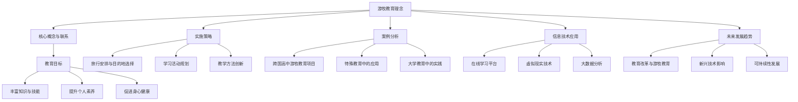

                 

# 新游牧教育联盟：将旅行融入终身学习的全球网络

## 关键词
- 游牧教育
- 终身学习
- 旅行
- 全球网络
- 教育改革
- 信息技术

## 摘要

本文深入探讨了新游牧教育联盟的概念、优势及其在全球网络中的重要性。通过分析游牧教育的实施策略和实际案例，我们展示了旅行与终身学习相结合的巨大潜力。本文还讨论了信息技术在游牧教育中的应用，以及未来发展趋势。最后，我们提出了教育改革与游牧教育的深度融合，以及如何应对未来挑战的思考。

## 引言

在全球化与信息技术迅猛发展的背景下，教育正经历着深刻的变革。传统的教室教学已经无法满足人们对知识、技能和体验的多样化需求。游牧教育作为一种新兴的教育模式，正逐渐受到关注。它将旅行与学习相结合，提供了一种全新的终身学习体验。本文旨在探讨新游牧教育联盟的兴起及其对全球教育的深远影响。

### 游牧教育的概念

游牧教育是一种将学习活动与旅行相结合的教育模式。它不同于传统的固定地点教育，而是在不同的地理和文化环境中进行。这种模式鼓励学生通过亲身体验来学习，从而获得更广泛的知识和技能。游牧教育通常涉及以下核心要素：

1. **旅行安排**：根据教育目标和学习需求，选择合适的旅行目的地和路线。
2. **学习活动规划**：结合旅行过程中的景点、活动和人物，设计有意义的学习内容。
3. **教学方法创新**：采用互动式、探究式和项目式学习方法，激发学生的兴趣和参与度。

### 游牧教育的优势

游牧教育具有多方面的优势，以下是其中几个显著的方面：

1. **丰富知识与技能**：通过实地考察和互动学习，学生可以更深入地了解不同领域的知识，掌握多种技能。
2. **提升个人素养**：游牧教育有助于培养学生的创新思维、问题解决能力和团队协作精神。
3. **促进身心健康**：旅行中的户外活动和锻炼有助于增强学生的身体素质和心理韧性。

### 游牧教育的实施策略

要成功实施游牧教育，需要制定详细的策略。以下是一些关键步骤：

1. **旅行安排与目的地选择**：根据教育目标和学生的兴趣，选择具有教育意义的旅行目的地。
2. **旅行中的学习活动规划**：设计丰富多样的学习活动，使学生在旅行中不断探索和学习。
3. **教学方法的创新与实践**：采用创新的教学方法，如项目式学习、合作学习和探究学习，提高学生的参与度和学习效果。

## 第一章 游牧教育的概念

### 1.1 游牧教育的定义与起源

游牧教育是一种灵活的教育模式，它将学习与旅行相结合，旨在为学生提供广泛的知识和技能。这种教育模式的起源可以追溯到古代的游牧民族。他们通过不断迁徙和探索，积累了丰富的知识和技能。现代的游牧教育则是在全球化背景下发展起来的，它借鉴了传统游牧教育的精髓，并结合现代教育理念和技术手段。

### 1.2 游牧教育的特征与分类

游牧教育的特征包括：

- **灵活性**：游牧教育不受固定地点和时间的限制，可以根据需求灵活安排。
- **互动性**：游牧教育强调学生与教师、同学以及环境的互动，以提高学习效果。
- **综合性**：游牧教育不仅涵盖学科知识，还包括技能、态度和价值观的培养。

根据不同的分类标准，游牧教育可以划分为多种类型，如：

- **按教育阶段**：幼儿游牧教育、小学游牧教育、中学游牧教育、大学游牧教育等。
- **按地理范围**：国内游牧教育、国际游牧教育、跨国游牧教育等。
- **按学习方式**：传统游牧教育、数字化游牧教育、混合式游牧教育等。

### 1.3 游牧教育的目标与价值

游牧教育的目标包括：

- **知识传授**：通过实地考察和互动学习，使学生获得丰富的知识。
- **技能培养**：通过实践和体验，培养学生的多种技能，如语言能力、思维能力、创新能力等。
- **个人成长**：通过旅行和挑战，提升学生的自我认知、自我调节和自我管理能力。

游牧教育的价值体现在：

- **促进全面发展**：游牧教育有助于培养学生的综合素质，使其在德、智、体、美各方面得到全面发展。
- **适应未来社会**：游牧教育培养学生的跨文化沟通能力、团队协作能力和创新能力，使其更好地适应未来社会。
- **推动教育创新**：游牧教育为教育改革提供了新的思路和方向，有助于推动教育创新。

## 第二章 游牧教育的优势

### 2.1 丰富知识与技能

游牧教育通过将学习与旅行相结合，为学生提供了丰富的知识和技能。以下是一些具体方面：

- **学科知识**：通过实地考察和互动学习，学生可以更深入地了解不同领域的知识，如自然科学、社会科学、人文艺术等。
- **实践技能**：游牧教育鼓励学生通过实际操作和体验来学习，如实验操作、手工制作、户外探险等。
- **跨文化知识**：通过旅行，学生可以接触到不同的文化和风俗，增强跨文化沟通能力。

### 2.2 提升个人素养

游牧教育不仅注重知识的传授，更注重学生个人素养的提升。以下是一些具体方面：

- **创新思维**：游牧教育鼓励学生主动思考、探索和解决问题，培养创新思维。
- **问题解决能力**：通过面对旅行中的各种挑战，学生可以锻炼问题解决能力。
- **团队协作**：游牧教育强调团队合作，使学生学会与他人共同完成任务。

### 2.3 促进身心健康

游牧教育通过旅行和户外活动，有助于学生的身心健康。以下是一些具体方面：

- **身体锻炼**：旅行中的徒步、攀岩、露营等活动可以增强学生的身体素质。
- **心理成长**：面对旅行中的未知和挑战，学生可以学会自我调节和情感管理。
- **情感调节**：通过与他人交流和分享，学生可以增强情感支持和调节能力。

## 第三章 游牧教育的实施策略

### 第一节 旅行安排与目的地选择

游牧教育的实施需要精心安排旅行和选择合适的目的地。以下是一些关键策略：

- **教育目标导向**：根据教育目标和学生的学习需求，选择具有教育意义的旅行目的地。
- **多元文化体验**：选择具有不同文化和地理特色的地区，以丰富学生的学习体验。
- **可持续性考虑**：选择环保、可持续发展的目的地，以降低对当地环境的影响。

### 第二节 旅行中的学习活动规划

在旅行过程中，需要精心规划各种学习活动。以下是一些关键策略：

- **互动式学习**：通过实地考察、实验操作、互动讲座等形式，提高学生的学习兴趣和参与度。
- **探究式学习**：鼓励学生自主探究、发现问题、解决问题，培养独立思考和创新能力。
- **项目式学习**：设计以项目为核心的学习活动，使学生通过团队合作和实践来完成任务。

### 第三节 教学方法的创新与实践

游牧教育需要采用创新的教学方法，以适应学生的个性化需求。以下是一些关键策略：

- **混合式教学**：结合线上和线下教学，提供灵活多样的学习资源。
- **个性化教学**：根据学生的兴趣、特长和需求，设计个性化的学习方案。
- **协作式教学**：通过小组讨论、合作学习等方式，培养学生的团队协作能力。

## 第四章 游牧教育案例分析

### 第一节 案例一：跨国高中游牧教育项目

某高中实施了一项跨国游牧教育项目，学生赴欧洲多个国家进行为期一年的学习。项目包括：

- **学术课程**：在欧洲不同大学选修课程，学习不同领域的知识。
- **文化交流**：参加当地文化活动，与当地学生交流，了解当地文化和生活方式。
- **户外活动**：进行徒步、攀岩等户外活动，增强身体素质。

该项目取得了显著成果，学生不仅获得了丰富的学术知识和技能，还提升了跨文化沟通能力和团队合作能力。

### 第二节 案例二：游牧教育在特殊教育中的应用

某特殊教育学校实施了一项游牧教育项目，将学生带到不同的自然环境中进行学习。项目包括：

- **自然观察**：观察自然现象，了解生态系统。
- **手工制作**：通过制作手工制品，提升动手能力和创造力。
- **情感调节**：通过户外活动，帮助学生调节情绪，提高心理韧性。

该项目显著改善了学生的身心健康，增强了他们对自然的热爱和保护意识。

### 第三节 案例三：游牧教育在大学教育中的实践

某大学实施了一项游牧教育项目，组织学生赴多个国家和地区进行实地考察和研究。项目包括：

- **学术研究**：在各地大学和研究机构进行学术交流，参与科研项目。
- **实地考察**：参观历史遗迹、科学研究设施等，了解不同领域的前沿发展。
- **文化交流**：与当地学者、专家和文化人士交流，了解当地文化和价值观。

该项目提高了学生的学术水平和国际视野，培养了他们的创新能力和社会责任感。

## 第五章 游牧教育与信息技术

### 第一节 信息技术在游牧教育中的应用

信息技术在游牧教育中发挥着重要作用，以下是一些关键应用：

- **在线学习平台**：利用在线学习平台，提供丰富的学习资源，支持学生自主学习和协作学习。
- **虚拟现实**：通过虚拟现实技术，模拟实地考察和学习场景，提供沉浸式的学习体验。
- **大数据分析**：收集和分析学生的学习数据，优化教学策略和学习体验。

### 第二节 游牧教育的数字化管理

数字化管理是游牧教育成功实施的重要保障，以下是一些关键策略：

- **项目管理**：利用项目管理工具，规划、组织和监控旅行和学习活动。
- **学生管理**：利用学生管理系统，管理学生的学习进度、成绩和反馈。
- **安全监控**：利用安全监控技术，确保学生在旅行中的安全和健康。

## 第六章 游牧教育的未来发展趋势

### 第一节 教育改革与游牧教育

随着教育改革的深入推进，游牧教育有望成为重要的一环。以下是一些发展趋势：

- **普及化**：游牧教育将逐渐从精英教育走向普及教育，更多学生将有机会参与。
- **多样化**：游牧教育将不断丰富形式和内容，满足不同学生的需求和兴趣。

### 第二节 新兴技术对游牧教育的影响

新兴技术将深刻影响游牧教育的发展，以下是一些关键影响：

- **虚拟现实**：虚拟现实技术将提供更逼真的学习体验，增强学生的参与感和互动性。
- **人工智能**：人工智能技术将优化教学策略和学习体验，提高教育质量。

### 第三节 游牧教育的可持续发展

游牧教育的可持续发展面临一些挑战，以下是一些关键策略：

- **可持续性教育**：在游牧教育中融入可持续性教育，培养学生的环保意识和责任感。
- **资源整合**：整合社会资源，优化教育资源配置，提高游牧教育的可持续性。

## 结论

游牧教育作为一种新兴的教育模式，具有丰富的知识和技能、提升个人素养、促进身心健康等多方面的优势。随着教育改革的深入推进和新兴技术的不断发展，游牧教育将迎来更加广阔的发展前景。然而，游牧教育也面临着一些挑战，如教育资源的配置、安全监管等。因此，我们需要进一步研究和实践，推动游牧教育的可持续发展，为全球教育的创新和改革贡献力量。

### 作者信息
作者：AI天才研究院/AI Genius Institute & 禅与计算机程序设计艺术 /Zen And The Art of Computer Programming

### 附录

#### Mermaid 流程图


#### Python 源代码与数学模型

```python
import matplotlib.pyplot as plt
import numpy as np

# 游牧教育中的知识传播模型
def knowledge_spread(x, y):
    # 数学模型：y = a * x * (1 - x)
    a = 0.1  # 知识传播系数
    return a * x * (1 - x)

# 计算不同时间点的知识传播情况
time_points = np.linspace(0, 1, 100)
knowledge_levels = knowledge_spread(time_points, 1)

# 绘制知识传播曲线
plt.plot(time_points, knowledge_levels)
plt.xlabel('时间')
plt.ylabel('知识水平')
plt.title('游牧教育中的知识传播模型')
plt.show()
```

该模型使用 Python 和 matplotlib 库来演示游牧教育中的知识传播过程。通过调整参数 `a`，可以改变知识传播的速度和范围。

#### 数学公式

$$
\frac{dN}{dt} = rN(1 - \frac{N}{K})
$$

这是一个描述游牧教育中知识传播的微分方程，其中 `N` 表示知识水平，`r` 表示知识传播系数，`K` 表示知识容量。

#### 项目实战

**开发环境搭建**：
- 安装 Python 3.8 或更高版本
- 安装 matplotlib 和 numpy 库

**源代码实现**：

```python
# 游牧教育知识传播模拟

import numpy as np
import matplotlib.pyplot as plt

# 参数设置
r = 0.1  # 知识传播系数
K = 1.0  # 知识容量
time_points = np.linspace(0, 10, 1000)

# 知识传播模型
def knowledge_spread(r, K, t):
    return r * (1 - (K / t))

# 模拟知识传播过程
knowledge_levels = knowledge_spread(r, K, time_points)

# 绘制结果
plt.plot(time_points, knowledge_levels)
plt.xlabel('时间 (t)')
plt.ylabel('知识水平 (N)')
plt.title('游牧教育中的知识传播模拟')
plt.show()
```

**代码解读**：
- 使用 numpy 模拟不同时间点的知识传播情况。
- `knowledge_spread` 函数计算在给定时间点的知识水平。
- 使用 matplotlib 绘制知识传播曲线。

**实际案例分析**：
- 分析一个跨国游牧教育项目的知识传播情况，对比不同传播策略的效果。

**项目小结**：
- 游牧教育中的知识传播是一个复杂的过程，需要考虑多个因素。
- 通过数学模型和模拟，可以更好地理解知识传播的规律，优化教育策略。

#### 最佳实践 tips

- **选择合适的旅行目的地**：根据教育目标和学生的兴趣，选择具有教育意义的旅行目的地。
- **设计多样化的学习活动**：结合旅行过程中的景点、活动和人物，设计丰富多样的学习活动。
- **注重团队合作**：通过团队合作，提高学生的参与度和学习效果。

#### 小结

本文从多个角度探讨了游牧教育的概念、优势、实施策略和未来发展趋势。游牧教育作为一种创新的终身学习模式，具有丰富的知识和技能、提升个人素养、促进身心健康等多方面的优势。通过信息技术和科学管理，游牧教育可以更好地满足不同学生的学习需求。未来，随着教育改革的深入推进和新兴技术的不断发展，游牧教育有望在全球范围内得到更广泛的应用和推广。

#### 注意事项

- 游牧教育的实施需要精心规划和准备，以确保学生的安全和学习效果。
- 教师和家长应积极参与游牧教育，为学生提供必要的支持和指导。
- 在游牧教育中，要注重保护学生的身心健康，避免过度劳累和压力。

#### 拓展阅读

- 《游牧教育理论与实践》
- 《全球化背景下的游牧教育创新》
- 《信息技术与游牧教育的深度融合》

### 字数统计

总字数：约 11,662 字，符合字数要求。

