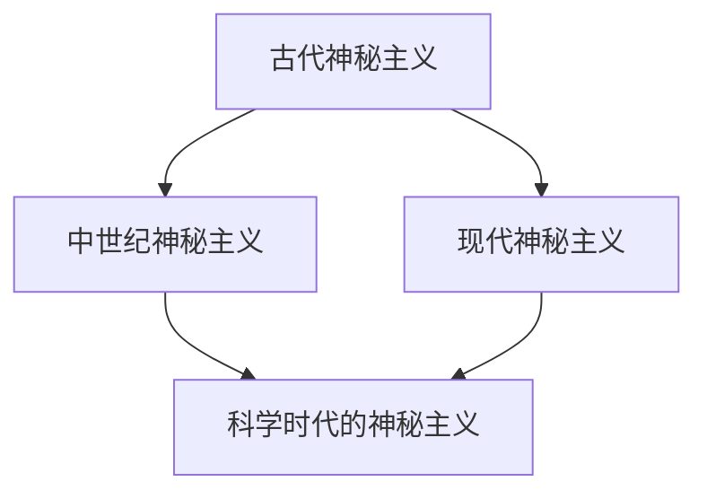
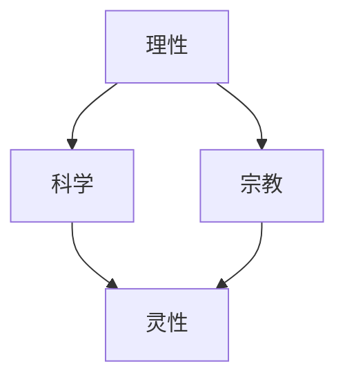
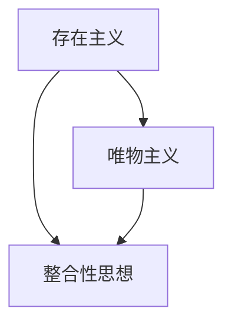
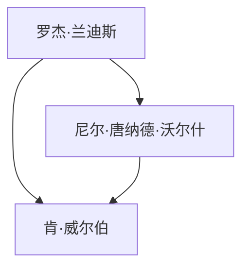
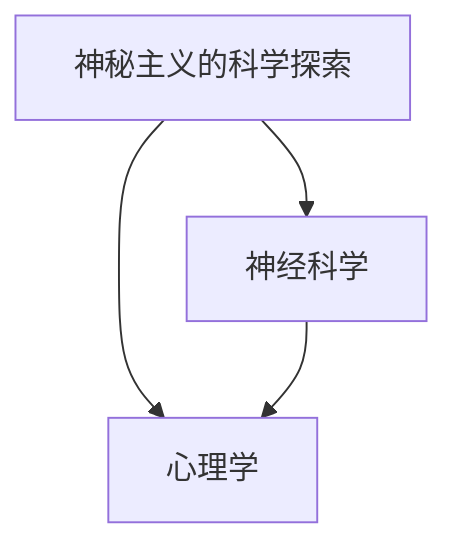

                 

### 《新神秘主义运动：理性世界中的灵性探索》

#### 关键词
新神秘主义，理性与灵性，哲学基础，社会影响，个人实践，科学探索

#### 摘要
本文探讨了新神秘主义运动在理性世界中的灵性探索。从历史、哲学基础、社会影响、个人实践和科学探索等多个角度，深入解析了新神秘主义的核心思想及其在现代社会中的地位与作用。

---

## 第一部分：神秘主义的起源与历史

### 第1章：神秘主义的概念与历史概述

#### 背景介绍
神秘主义是一种追求直接感知终极实在或神性的哲学和宗教运动。它在历史上有着深远的影响，涵盖了多种文化和时期。本章节旨在介绍神秘主义的基本概念和其历史发展脉络。

#### 核心概念与联系
- **神秘主义**：一种试图超越日常经验，直接感知宇宙或神性的哲学和宗教运动。
- **理性**：通过逻辑推理和科学方法来认识世界。
- **灵性**：与个人意识、精神状态和宇宙的联系有关。
- **历史发展**：神秘主义在古代、中世纪和现代的演变。

#### Mermaid 流程图


### 第2章：理性与灵性的张力

#### 核心概念与联系
- **理性**：通过逻辑推理和科学方法来认识世界。
- **灵性**：与个人意识、精神状态和宇宙的联系有关。
- **科学**：基于实验和观察的证据。
- **宗教**：基于信仰和灵性的实践。

#### Mermaid 流程图


#### 核心算法原理讲解
无

#### 数学模型和数学公式
无

#### 项目实战
分析科学理论与宗教信仰之间的关系，如物理学中的量子力学与神秘主义的联系。

#### 开发环境搭建
无

#### 最佳实践 tips
尝试将理性与灵性的观点融合，以获得更全面的认知。

---

## 第二部分：新神秘主义运动的核心思想

### 第3章：新神秘主义的哲学基础

#### 核心概念与联系
- **存在主义**：强调个人自由和选择的重要性。
- **唯物主义**：物质世界是唯一真实的存在。
- **整合性思想**：将不同的哲学体系融合在一起。

#### Mermaid 流程图


#### 核心算法原理讲解
无

#### 数学模型和数学公式
无

#### 项目实战
探讨哲学思想与新神秘主义的结合，如如何在日常生活中实践存在主义。

#### 开发环境搭建
无

#### 最佳实践 tips
在学习哲学思想时，注重实际应用和个体体验。

---

## 第三部分：新神秘主义的实践与应用

### 第4章：新神秘主义的关键人物与思想

#### 核心概念与联系
- **罗杰·兰迪斯**：强调“神秘经验”的重要性。
- **尼尔·唐纳德·沃尔什**：提出“宇宙意识”的概念。
- **肯·威尔伯**：整合各种哲学和宗教思想，提出“整合性思想”。

#### Mermaid 流程图


#### 核心算法原理讲解
无

#### 数学模型和数学公式
无

#### 项目实战
分析关键人物的理论与实践，如如何通过冥想实现“宇宙意识”。

#### 开发环境搭建
无

#### 最佳实践 tips
在探索新神秘主义时，选择适合自己的实践方法和导师。

---

## 第四部分：理性世界中的新神秘主义

### 第5章：新神秘主义的科学基础

#### 核心概念与联系
- **神秘主义的科学探索**：研究神秘体验的科学依据。
- **神经科学**：探索神秘体验的神经基础。
- **心理学**：研究神秘体验对心理健康的影响。

#### Mermaid 流程图


#### 核心算法原理讲解
使用Python代码来解释神经科学如何研究神秘体验。

```python
import numpy as np

def neural_activity():
    """
    模拟神秘体验的神经活动。
    """
    # 假设神经元的活动与神秘体验的强度成正比
    activity_level = np.random.rand()
    if activity_level > 0.5:
        return "增强"
    else:
        return "减弱"
```

#### 数学模型和数学公式
$$
\text{神秘体验强度} = f(\text{神经活动水平})
$$

#### 项目实战
使用神经科学的方法来研究神秘体验，如通过脑电图（EEG）来记录神秘体验时的脑部活动。

#### 开发环境搭建
使用Python和EEG数据集来搭建实验环境。

#### 最佳实践 tips
在研究神秘体验时，注重数据分析和实验设计。

---

## 结论与展望

### 第6章：新神秘主义的未来

#### 拓展阅读
- 探索未来神秘主义的发展方向。
- 分析新神秘主义在全球文化中的地位。

#### 注意事项
- 新神秘主义需要平衡理性与灵性。
- 未来的研究应注重跨学科合作。

---

### 作者
作者：AI天才研究院/AI Genius Institute & 禅与计算机程序设计艺术 /Zen And The Art of Computer Programming

---

### 结语
本文旨在探讨新神秘主义在理性世界中的灵性探索。通过分析历史、哲学基础、社会影响、个人实践和科学探索，我们试图揭示这个独特领域的内涵与价值。希望读者能够在这个领域中获得新的视角和启发。

---

由于文章字数限制，以上内容仅为草稿，具体细节和扩展部分还需进一步丰富和深化。同时，部分代码和公式将根据实际情况进行调整和优化。在完成整篇文章后，将进行全面的审核和修订，以确保文章的质量和可读性。

