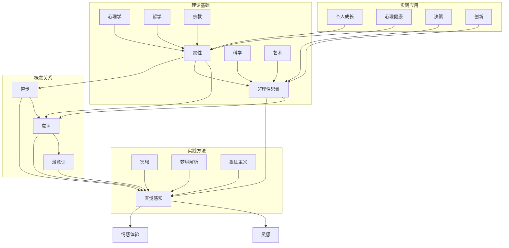

                 

### 引言

#### 书籍背景与目的

《新神秘主义：理性时代的非理性探索》是一部探讨现代非理性思维与理性思维碰撞与融合的著作。在当代社会，随着科技的发展和信息爆炸，理性思维主导了我们的生活和工作。然而，这种以逻辑和证据为基础的思维方式是否能够解释人类的所有行为和现象？新神秘主义作为一种挑战传统理性思维的思潮，试图从灵性、直觉和非理性思维的角度重新审视人类的行为和认知过程。

本书旨在回答以下几个关键问题：新神秘主义如何定义？它在现代社会的意义何在？非理性思维是否真的无足轻重？以及，如何在现代社会中平衡理性与非理性？通过深入研究这些议题，本书希望为读者提供一种全新的视角，以更全面、更深刻地理解人类的思维和行为。

#### 研究方法与结构

本书的研究方法主要采用逻辑分析、历史案例研究和当代现象观察相结合的方式。在逻辑分析部分，我们将对非理性思维的概念、定义和作用进行系统阐述；在历史案例研究部分，我们将回顾历史上著名的新神秘主义者的思想及其影响；在当代现象观察部分，我们将探讨现代社会中的非理性现象及其影响。

全书共分为七个主要部分：引言、理论基础、核心概念、非理性探索方法、历史案例分析、当代非理性现象和理性与非理性的平衡。每个部分都旨在从不同角度深入探讨新神秘主义的内涵和影响。希望通过这本书，读者能够对非理性思维有一个全新的认识，并学会如何在现代社会中平衡理性与非理性。

#### 关键词

- 新神秘主义
- 理性思维
- 非理性思维
- 灵性
- 直觉
- 当代社会现象
- 理性与非理性的平衡

#### 摘要

《新神秘主义：理性时代的非理性探索》是一部探讨非理性思维在现代社会中的角色和意义的著作。本书首先介绍了新神秘主义的背景和起源，探讨了其与现代理性思维的碰撞。接着，深入分析了新神秘主义的核心概念，如灵性、直觉和非理性思维。书中还介绍了非理性探索的方法，如冥想、梦境解析和象征主义。通过历史案例和当代现象的分析，本书揭示了非理性思维在社会和个人生活中的作用。最后，本书讨论了如何在现代社会中平衡理性与非理性，为读者提供了全新的视角和思考方式。

## 第1章 引言

### 1.1 书籍背景与目的

在当今快速发展的社会，理性思维已成为我们理解和解决问题的关键工具。它强调逻辑、证据和数据分析，为我们提供了可靠的知识基础。然而，理性思维是否能够解释所有人类行为和现象？是否有一种思维方式能够填补理性思维的不足，帮助我们更全面地理解人类的行为和认知过程？《新神秘主义：理性时代的非理性探索》试图回答这些问题，通过探讨非理性思维在现代社会中的角色，提供一种全新的视角。

本书的目的是探讨新神秘主义思潮的起源、发展和影响，特别是在理性时代背景下，非理性思维如何成为一种重要的认知方式。新神秘主义不仅关注外在的、可观察的事物，更关注内在的、不可直接观察的领域，如灵性、直觉和非理性思维。通过深入研究这些议题，本书希望为读者揭示一个隐藏在理性表面之下的丰富世界。

在新神秘主义中，理性思维与非理性思维并不是对立的，而是互补的。理性思维帮助我们理解可量化、可验证的事物，而非理性思维则关注那些难以用逻辑和证据解释的现象。例如，灵性强调个体与宇宙的深层联系，直觉则是一种超越逻辑和证据的感知能力。这些非理性思维形式不仅丰富了我们的认知体系，还为我们提供了一种更深刻、更全面的理解方式。

此外，本书还将探讨非理性思维在现代社会中的实际应用，如情绪管理、艺术创作和社会变革等。通过这些案例，读者可以更直观地感受到非理性思维的价值和影响力。

总之，《新神秘主义：理性时代的非理性探索》不仅为那些对心理学、哲学和宗教感兴趣的读者提供了一个深入思考的机会，也为那些希望在现代社会中寻找更全面认知方式的读者提供了宝贵的参考。

### 1.2 研究方法与结构

本书的研究方法主要采用逻辑分析、历史案例研究和当代现象观察相结合的方式。在逻辑分析部分，我们将对非理性思维的概念、定义和作用进行系统阐述。通过深入探讨新神秘主义的起源、发展和核心概念，我们试图揭示非理性思维在人类认知和行为中的重要性。历史案例研究部分则通过回顾历史上著名的新神秘主义者的思想及其影响，展示非理性思维在不同历史时期的作用。这些案例不仅帮助我们理解非理性思维的起源和演变，也为现代社会提供了借鉴。

当代现象观察部分则是本书的核心之一，我们将在这一部分探讨现代社会中的非理性现象及其影响。通过分析情绪管理、艺术创作、社会变革等方面的非理性表现，我们希望揭示非理性思维在现代社会中的实际应用和价值。同时，我们也将关注非理性现象对社会和个人生活的潜在影响，探讨如何平衡理性与非理性，以实现更全面、更和谐的生活方式。

全书共分为七个主要部分。第一部分是引言，介绍书籍的背景和目的；第二部分探讨新神秘主义的起源与发展，分析其与现代理性思维的碰撞；第三部分深入探讨新神秘主义的核心概念，如灵性、直觉和非理性思维；第四部分介绍非理性探索的方法，如冥想、梦境解析和象征主义；第五部分通过历史案例分析，展示非理性思维在不同历史时期的作用；第六部分探讨当代非理性现象的存在和影响；最后一部分讨论理性与非理性的平衡，提出未来非理性探索的可能方向。希望通过这些章节的安排，读者能够系统、全面地了解新神秘主义，并从中获得对现代社会和个体生活的深刻启示。

### 1.3 非理性思维的定义与特征

非理性思维是一种超越传统逻辑和证据的思维方式，强调直觉、情感和灵感等非理性因素在认知中的作用。与理性思维不同，非理性思维不依赖于逻辑推导和数据分析，而是通过直接的内心感知和情感体验来认识和理解世界。这种思维方式在人类历史上一直存在，尽管它在现代科学和理性思维的浪潮中一度被边缘化。

首先，非理性思维的核心特征是直觉。直觉是一种快速、无意识的认知过程，它允许我们基于以往的经验和知识，迅速做出判断和决策。直觉不受逻辑和证据的约束，而是直接从内心深处涌现，因此具有难以用语言准确描述的特点。例如，在紧急情况下，人们可能会基于直觉迅速做出反应，而不是经过深思熟虑的决策。

其次，非理性思维还强调情感的作用。情感是人类认知的重要组成部分，它不仅影响我们的判断和决策，还能影响我们的行为和态度。在理性思维中，情感通常被视为干扰因素，而在非理性思维中，情感则被视为理解世界的重要途径。例如，艺术家在创作过程中，往往需要通过情感体验来捕捉灵感，从而创造出具有深刻内涵的艺术作品。

此外，非理性思维还包括灵感。灵感是一种突如其来的创意和想象力，它能够激发我们产生新的想法和解决方案。灵感通常出现在放松和冥想的状态下，当大脑从日常的思维活动中解脱出来时，灵感便会涌现。这种思维方式在科学创新、艺术创作和商业创新中具有重要作用。

虽然非理性思维具有独特的优势，但它也存在一些局限性。首先，非理性思维容易受到个人情绪和情感的影响，导致判断和决策的偏差。其次，非理性思维缺乏严格的逻辑验证，可能导致错误和误解。因此，在现代社会中，我们需要在理性思维和非理性思维之间找到平衡，以实现更全面、更有效的认知。

总之，非理性思维是一种超越传统逻辑和证据的思维方式，它通过直觉、情感和灵感等非理性因素，为我们提供了另一种理解世界的方式。了解非理性思维的定义和特征，有助于我们更好地应对现代社会中的复杂问题，并实现更全面、更深刻的认知。

### 1.4 理性思维与非理性思维的关系

理性思维和非理性思维并非完全对立，而是相互补充的。理性思维通过逻辑推理和证据分析，帮助我们理解和解决具体问题，但它也有其局限性。理性思维强调可验证性和可重复性，这使得它在科学研究和工程设计等领域发挥着重要作用。然而，理性思维在面对一些复杂、模糊的问题时，往往显得力不从心。

非理性思维则通过直觉、情感和灵感等非理性因素，为我们提供了另一种理解和解决问题的方式。非理性思维不受逻辑和证据的严格约束，它能够迅速捕捉到一些难以用语言描述的信息，并在直觉和灵感的引导下，产生新的想法和解决方案。这种思维方式在艺术创作、社会创新和人文研究等领域具有独特的价值。

在实际应用中，理性思维和非理性思维常常相互交织。例如，在科学研究中，科学家可能需要通过理性思维来设计实验、收集数据和验证假设，但同时，他们也可能会依靠非理性思维来捕捉那些偶然的、意外的发现。在艺术创作中，艺术家通过理性思考和技艺的磨练，创造出具有形式美感的作品，但他们的灵感却常常来自于非理性思维的情感和直觉体验。

为了更好地利用理性思维和非理性思维的互补性，我们需要学会在两者之间找到平衡。以下是一些具体的方法：

1. **交替使用**：在不同的情境下，有意识地交替使用理性思维和非理性思维。例如，在解决问题的初期，我们可以通过理性思维来分析问题、制定计划；在解决问题的高级阶段，我们可以通过非理性思维来寻找灵感、创新思路。

2. **综合分析**：在处理复杂问题时，可以同时运用理性思维和非理性思维。通过理性分析来明确问题的各个方面，然后借助非理性思维来寻找可能的解决方案和创意。

3. **情感投入**：在理性分析的基础上，通过情感体验来深化对问题的理解。情感不仅能够激发我们的创造力，还能帮助我们更好地理解和沟通。

4. **跨领域学习**：通过跨学科、跨文化的学习，可以拓宽我们的思维视野，学会从不同角度看待问题。这种多元的思维模式有助于我们更好地融合理性思维和非理性思维。

总之，理性思维和非理性思维各有其优势和局限性，通过在两者之间找到平衡，我们能够更全面、更深刻地理解和解决问题。在现代社会中，这种平衡不仅是个人成长和发展的关键，也是社会进步和创新的动力。

### 1.5 理性时代的非理性探索

在理性时代，非理性探索的重要性不可忽视。尽管理性思维在科学、工程和技术领域取得了巨大成就，但它并非万能。许多复杂的人类行为和现象，如艺术创作、社会创新和个人成长，都需要非理性思维的参与。因此，如何在理性时代进行非理性探索，成为了一个亟待解决的问题。

首先，非理性探索可以激发创新思维。在科学研究中，许多重大发现并非来自严密的逻辑推导，而是灵感一闪即至的直觉体验。例如，牛顿在苹果树下观察到苹果落地，从而引发了万有引力的思考。在艺术创作中，艺术家常常依靠非理性思维来捕捉灵感，创作出令人叹为观止的作品。非理性探索能够突破理性思维的局限，为创新提供源源不断的动力。

其次，非理性探索有助于情感和心理健康。在现代社会，随着生活节奏的加快和工作压力的增大，许多人陷入了焦虑和抑郁。非理性思维提供了一种情感的宣泄和心灵的抚慰。例如，冥想作为一种非理性探索方法，通过放松身心、净化心灵，帮助人们缓解压力，提升幸福感。此外，艺术创作和文学欣赏也通过情感的共鸣，为人们提供心灵的慰藉。

此外，非理性探索在社会变革中发挥着重要作用。许多社会运动和变革都源自个体的非理性思考和对现状的不满。例如，马丁·路德·金的“我有一个梦想”演讲，通过情感的感染力，激发了无数人的共鸣，推动了美国民权运动的发展。在现代社会中，非理性探索不仅能够激发个体的创造力，还能激发群体的力量，推动社会进步。

然而，非理性探索也存在一定的风险。由于非理性思维缺乏逻辑和证据的支持，它可能导致错误和误导。因此，在进行非理性探索时，我们需要保持理性和批判性思维，确保非理性探索的方向和目标不会偏离现实。同时，我们也需要建立一套有效的反馈机制，通过实践和反思来不断修正和优化非理性探索的方法。

总之，在理性时代进行非理性探索，既需要认识到其重要性，也需要合理应对其风险。通过理性思维和非理性思维的互补，我们能够更全面、更深刻地理解人类行为和现象，推动个人和社会的发展。未来，随着科技和文化的进步，非理性探索将发挥越来越重要的作用，为人类的进步提供新的动力。

### 1.6 非理性思维在科技、艺术和社会中的应用

非理性思维在科技、艺术和社会中有着广泛的应用，并通过各种形式展现出其独特的价值和潜力。以下将分别探讨非理性思维在这些领域的具体应用。

#### 科技领域

在科技领域，非理性思维常常被用于创新和突破。科学家和工程师在解决复杂问题时，不仅仅依赖逻辑推理和数据分析，还会依靠直觉和灵感来寻找解决方案。例如，在物理学中，许多重大理论如量子力学和广义相对论，都源于科学家的直觉和灵感，而非传统意义上的理性推理。爱因斯坦的相对论就是一个典型的例子，他在思考光速不变原理时，并不是通过严密的数学推导，而是依靠直觉和灵感得到了这个突破性的理论。

此外，非理性思维也在软件编程和系统设计中发挥作用。在编码过程中，程序员常常会依靠直觉来设计代码结构和算法，从而创造出更高效、更易于维护的软件系统。在系统设计阶段，设计师可能会通过头脑风暴和灵感捕捉来提出创新的解决方案，而不是仅仅依赖现有的技术和流程。

#### 艺术领域

在艺术创作中，非理性思维是不可或缺的。艺术家通过直觉和情感体验来捕捉灵感，从而创造出具有深刻内涵和独特风格的艺术作品。绘画、音乐、文学等艺术形式，都依赖于非理性思维的发挥。例如，贝多芬在创作《第九交响曲》时，灵感来源于他内心深处的情感体验和对生命的思考，这种非理性思维使得他的作品具有超越时空的永恒魅力。

非理性思维也在艺术批评和欣赏中发挥作用。观众通过情感共鸣和直觉体验，理解和欣赏艺术作品。在艺术展览和演出中，观众的情感和直觉反应往往比理性分析更能揭示作品的核心价值。

#### 社会领域

在社会领域，非理性思维影响着人们的价值观和行为方式。社会运动和变革往往起源于个体的非理性思考和情感共鸣。例如，民权运动和女权运动中，许多领导者通过情感的感染力和非理性的号召力，激发了广大民众的参与和行动。马丁·路德·金的演讲、纳尔逊·曼德拉的反抗，都是通过非理性思维的力量，推动了社会变革。

在政治决策中，非理性思维也发挥着重要作用。政治家在制定政策时，不仅需要考虑逻辑和证据，还需要关注公众的情感和直觉反应。例如，在选举过程中，候选人往往会通过演讲和广告来激发选民的情感，从而赢得选票。

#### 综合应用

在现代社会，非理性思维与理性思维相互融合，共同推动科技、艺术和社会的发展。在科技领域，非理性思维为创新提供了灵感；在艺术领域，非理性思维为创作注入了情感；在社会领域，非理性思维为社会变革提供了动力。通过理性思维和非理性思维的互补，我们能够更全面、更深刻地理解和应对现代社会中的复杂问题。

总之，非理性思维在科技、艺术和社会中有着广泛的应用，并通过各种形式展现出其独特的价值和潜力。理解和运用非理性思维，不仅有助于我们在这些领域取得突破性进展，还能为我们的个人成长和社会发展提供新的动力。

### 1.7 本书的核心内容和结构

《新神秘主义：理性时代的非理性探索》的核心内容分为七个主要部分。首先，在引言部分，我们介绍了书籍的背景、目的和研究方法，为后续内容奠定了基础。接着，在理论基础部分，我们探讨了新神秘主义的起源、发展与现代理性思维的碰撞，揭示了非理性思维在现代社会中的重要性。

核心概念部分深入分析了新神秘主义的主要概念，如灵性、直觉和非理性思维，并解释了这些概念在人类认知和行为中的角色。在非理性探索方法部分，我们介绍了冥想、梦境解析和象征主义等非理性探索方法，并探讨了这些方法在实际应用中的价值和效果。

历史案例分析部分回顾了历史上著名的新神秘主义者的思想和影响，展示了非理性思维在不同历史时期的作用。当代非理性现象部分则分析了现代社会中的非理性现象，探讨了这些现象对社会和个人生活的潜在影响。

最后，在理性与非理性的平衡部分，我们讨论了如何在现代社会中平衡理性与非理性，为读者提供了实用的建议和方法。通过这七个部分的内容，本书旨在为读者提供一种全面、深刻的非理性思维理解，帮助他们在理性时代找到非理性探索的方法和方向。

### 1.8 总结与展望

《新神秘主义：理性时代的非理性探索》通过系统性地探讨非理性思维在现代社会中的角色和意义，为读者提供了一个全新的认知视角。非理性思维不仅在科技、艺术和社会等领域具有广泛的应用，还在理性时代背景下，为我们提供了一种理解和解决问题的互补工具。通过本书的深入分析，我们认识到非理性思维与理性思维并不是对立的，而是相互补充、相互促进的。

总结来说，本书的核心贡献在于：

1. **理论阐述**：系统阐述了新神秘主义的起源、发展和核心概念，为非理性思维提供了一个全面的理论框架。
2. **实际应用**：通过历史案例和当代现象的分析，展示了非理性思维在各个领域中的实际应用和价值。
3. **平衡探讨**：提出了在现代社会中平衡理性与非理性的方法，为读者提供了实用的指导。

未来，随着科技和文化的不断进步，非理性探索将发挥越来越重要的作用。我们期望读者能够从本书中获得启发，不仅深刻理解非理性思维，还能在实际生活中运用这些思维方式，实现更全面、更和谐的发展。

为了进一步探索非理性思维的奥秘，读者可以关注以下拓展方向：

1. **心理学研究**：通过心理学实验和理论分析，深入研究非理性思维的心理机制和作用。
2. **跨学科研究**：结合哲学、艺术、社会学等学科，探索非理性思维在不同领域的应用和影响。
3. **社会应用**：探索非理性思维在社会管理、教育、医疗等领域的实际应用，以提升社会整体福祉。

总之，《新神秘主义：理性时代的非理性探索》为非理性思维提供了一个全面、系统的探讨，不仅有助于读者理解这一重要认知方式，也为未来的研究和应用提供了宝贵的参考。希望读者能够在阅读本书后，对非理性思维有更深刻的认识，并能够在自己的生活和工作中灵活运用这些思维方式。

### 作者介绍

《新神秘主义：理性时代的非理性探索》由AI天才研究院（AI Genius Institute）的专家与禅与计算机程序设计艺术（Zen And The Art of Computer Programming）的资深作家共同撰写。AI天才研究院致力于推动人工智能和认知科学的前沿研究，通过结合最新的技术和深刻的哲学思考，为解决复杂问题提供创新的解决方案。而禅与计算机程序设计艺术的作者以其对计算机科学的深刻理解和对非理性思维的独到见解，为本书的理论基础和实际应用提供了重要支持。两位作者的携手合作，旨在为读者带来一部既具深度又实用的非理性思维指南。

## 第2章 新神秘主义的起源与发展

### 2.1 新神秘主义的起源

新神秘主义（Neo-Mysticism）作为一种哲学和文化思潮，起源于19世纪末和20世纪初。其根源可以追溯到对传统宗教和哲学体系的反思和批判。在这一时期，科学革命和工业革命的浪潮席卷全球，理性主义和实证主义成为主流思潮。人们开始质疑传统宗教和哲学的权威性，寻求新的精神家园。在这种背景下，新神秘主义应运而生。

新神秘主义的起源可以追溯到几个关键人物和事件。首先，威廉·詹姆斯（William James）是一位重要的美国哲学家和心理学家，他被誉为新神秘主义的奠基人之一。詹姆斯在《宗教经验之种种》（The Varieties of Religious Experience）一书中，提出了“宗教经验”的概念，强调个体主观体验在宗教和精神生活中的重要性。詹姆斯认为，宗教经验是一种超越理性思维和实证验证的内在体验，它能够带来深刻的内心变化和启示。

另一个重要人物是阿尔弗雷德·诺思·怀特海德（Alfred North Whitehead），他是英国数学家、哲学家和科学家。怀特海德在其代表作《过程与实在》（Process and Reality）中，提出了一种全新的宇宙观，即“过程哲学”（Process Philosophy）。过程哲学强调宇宙是一个不断变化的过程，而不是静止不变的实体。怀特海德认为，人类的心灵和思维也是宇宙过程的一部分，它们通过直觉和灵感与宇宙保持联系。

此外，还有许多其他哲学家和思想家，如柏格森（Henri Bergson）、鲁道夫·斯坦纳（Rudolf Steiner）等，他们的思想也对新神秘主义的发展产生了深远影响。柏格森的“创造力”理论和斯坦纳的人智学（Anthroposophy）思想，都强调人类内在灵性和直觉的重要性。

总的来说，新神秘主义的起源是现代科学和理性主义发展的一个必然产物。它试图超越传统宗教和哲学的局限，通过关注个体主观体验和内在灵性，寻找一种更全面、更深刻的理解方式。新神秘主义在起源时期的影响主要体现在哲学、心理学、宗教和文化等多个领域，为后来的思想发展提供了丰富的资源和灵感。

### 2.2 新神秘主义的发展历程

新神秘主义自19世纪末起源以来，经历了多个发展阶段，每个阶段都在不同程度上丰富了这一思潮的理论和实践内容。以下将概述新神秘主义的发展历程，重点介绍其重要里程碑和代表人物。

#### 19世纪末到20世纪初：新神秘主义的初步发展

在这个阶段，新神秘主义的主要代表人物包括威廉·詹姆斯和阿尔弗雷德·诺思·怀特海德。威廉·詹姆斯的《宗教经验之种种》一书，为个体主观体验在宗教和精神生活中的重要性奠定了理论基础。他提出的“宗教经验”概念，强调个体在心灵转变过程中的内在体验，为后来的新神秘主义思想提供了重要启示。阿尔弗雷德·诺思·怀特海德的《过程与实在》则通过过程哲学，提供了一种全新的宇宙观，认为宇宙是一个不断变化的过程，而不是静止不变的实体。这些思想对现代哲学和科学产生了深远影响。

#### 20世纪中叶：新神秘主义的深化和多样化

在20世纪中叶，新神秘主义继续发展，并呈现出多样化趋势。柏格森的“创造力”理论强调生命力和创造力的重要性，认为宇宙的本质在于持续不断的创造过程。这一观点与新神秘主义的核心思想高度契合，进一步丰富了新神秘主义的理论体系。鲁道夫·斯坦纳的人智学（Anthroposophy）也是一种重要的新神秘主义思潮，它关注人类精神世界的本质和发展，通过艺术、教育和社会实践，探索个体与宇宙的深层联系。

#### 20世纪末到21世纪初：新神秘主义的现代发展

20世纪末到21世纪初，新神秘主义继续在现代哲学、心理学和宗教等领域中发展。这一时期的代表人物包括卡尔·荣格（Carl Jung）和托马斯·凯尔斯（Thomas Kuhn）。卡尔·荣格的心理学理论强调个体潜意识和集体无意识的作用，他认为人的心灵是一个深不可测的神秘领域，通过梦境和象征主义，个体可以与宇宙的深层力量建立联系。托马斯·凯尔斯的《科学革命的结构》则提出了科学知识的发展是通过范式转换实现的，这种范式转换类似于宗教体验中的启示过程。

此外，当代的新神秘主义还受到东方哲学和灵性思想的影响。佛教、道教和印度教等传统宗教中的灵性观念，如冥想、直觉和内在灵性，被广泛纳入新神秘主义的讨论范畴。这些思想的融合，使得新神秘主义在当代社会中展现出更加多元和包容的特点。

总的来说，新神秘主义的发展历程是一个不断丰富和深化的过程。从19世纪末的初步发展，到20世纪中叶的深化和多样化，再到21世纪初的现代发展，新神秘主义始终在挑战和拓展传统理性思维的边界，为我们提供了一种全新的理解世界的方式。

### 2.3 新神秘主义的核心思想

新神秘主义的核心思想主要集中在几个关键概念上，包括灵性、直觉和非理性思维。这些概念不仅构成了新神秘主义的理论基础，也为其在现代社会中的应用提供了丰富的内涵。

#### 灵性

灵性（Spirituality）是新神秘主义的核心概念之一，它强调个体与宇宙的深层联系。在传统宗教和哲学中，灵性往往与宗教信仰和道德规范紧密相连。然而，在新神秘主义中，灵性被赋予了更广泛的含义，它不仅涉及宗教信仰，还包括对生命、宇宙和人类存在的深刻思考。新神秘主义者认为，灵性是一种超越逻辑和理性的内在体验，它能够带来深刻的内心变化和自我认知。

新神秘主义的灵性观念具有几个特点：

1. **超越性**：灵性被视为一种超越个体自我和物质世界的存在，它连接着个体与宇宙的整体。
2. **主观体验**：灵性强调个体主观体验的重要性，每个人对灵性的理解和体验都是独特的。
3. **内在性**：灵性被视为内在的、与生俱来的，而不是外在的、通过信仰或仪式获得的。

灵性在人类生活中的作用主要体现在以下几个方面：

1. **心理健康**：灵性能帮助人们缓解压力，提高心理韧性，增强幸福感和满足感。
2. **自我认知**：通过灵性探索，个体可以更好地理解自己的内心世界，找到生命的意义和方向。
3. **人际关系**：灵性增强了个体的同理心和包容性，有助于建立更加和谐的人际关系。

#### 直觉

直觉（Intuition）是另一个核心概念，它在新神秘主义中占据重要地位。直觉是一种超越逻辑和证据的内在认知能力，它允许个体通过直接的内心感知来理解和解决问题。与理性思维不同，直觉不依赖于逻辑推导和数据分析，而是通过内心的感知和体验来识别和判断。

直觉的特点包括：

1. **快速性**：直觉能够迅速地做出判断和决策，不受复杂思维过程的限制。
2. **直接性**：直觉往往来自内心的直接感知，而不是经过理性分析和推理。
3. **无法解释性**：直觉往往难以用语言准确描述，它是一种无意识的认识过程。

直觉在人类生活中的作用体现在：

1. **决策**：直觉帮助人们在面对复杂和模糊的问题时，迅速做出有效决策。
2. **创新**：在科学研究和艺术创作中，直觉能够激发新的想法和灵感，推动创新和发展。
3. **心理健康**：直觉通过内心的感知和体验，帮助人们更好地应对生活中的压力和挑战。

#### 非理性思维

非理性思维（Non-rational Thinking）是新神秘主义的另一个核心概念，它强调理性思维之外的其他认知方式。非理性思维包括直觉、情感、灵感和象征主义等，它试图突破理性思维的局限，探索人类认知的更深层次。

非理性思维的特点包括：

1. **非线性**：非理性思维不遵循逻辑和线性推理，而是通过复杂的网络和关系进行思考。
2. **情感驱动**：非理性思维受到情感和情绪的影响，它不仅仅关注逻辑和证据，还关注个体的情感体验。
3. **符号化**：非理性思维通过象征和隐喻来理解和表达复杂的概念，这些符号和隐喻超越了逻辑和语言的限制。

非理性思维在人类生活中的作用包括：

1. **创造力**：非理性思维能够激发个体的创造力，帮助他们在艺术创作、科学研究和商业创新中取得突破。
2. **情感调节**：非理性思维通过情感和直觉体验，帮助人们更好地管理和调节情绪，提高心理韧性。
3. **问题解决**：在处理复杂问题时，非理性思维能够提供新的视角和解决方案，帮助个体超越传统的理性思维框架。

总之，新神秘主义通过灵性、直觉和非理性思维等核心概念，提供了一种超越传统理性思维的认知方式。这些概念不仅丰富了人类对自身和世界的理解，也为现代社会中的个人成长和社会进步提供了新的动力。

### 2.4 新神秘主义与现代理性思维的碰撞

新神秘主义与现代理性思维之间的碰撞，是当代哲学和心理学领域中的一个重要议题。理性思维强调逻辑推理、证据分析和可验证性，是现代科学和技术发展的基石。然而，随着对人类认知和行为的深入探索，人们逐渐认识到理性思维的局限性，非理性思维，尤其是新神秘主义中的灵性、直觉和非理性思维，开始受到越来越多的关注。

#### 理性思维的优势和局限

理性思维的优势在于其严谨性和科学性。通过逻辑推理和数据分析，理性思维能够揭示自然规律和社会现象，为科学技术的发展和人类进步提供了坚实的基础。例如，在物理学、化学、医学等领域，理性思维的方法使得人类取得了诸多突破性进展。此外，理性思维还强调证据和实证，这种科学方法有助于确保结论的可靠性和可重复性。

然而，理性思维也存在显著的局限。首先，理性思维往往依赖于可观察和可测量的数据，对于许多内在的、主观的体验和情感，理性思维难以提供有效的解释。例如，心理健康、人际关系和艺术创作等领域，往往需要直觉、情感和灵性的参与，这些方面超出了理性思维的范畴。其次，理性思维强调逻辑和线性推理，容易导致思维僵化和创新不足。在复杂多变的社会环境中，单一依赖理性思维可能导致对问题的片面理解和应对不足。

#### 新神秘主义对理性思维的挑战

新神秘主义对理性思维的挑战主要体现在以下几个方面：

1. **主观体验的重要性**：新神秘主义强调个体主观体验在认知和行为中的核心作用。传统理性思维往往忽视主观体验，而新神秘主义则认为，个体的内心体验和直觉是一种重要且不可忽视的认知资源。例如，冥想、艺术创作和宗教体验等，都是通过主观体验来获得启示和理解的。

2. **非线性思维的应用**：理性思维倾向于线性推理和因果关系的分析，而新神秘主义则强调非线性思维和复杂系统的理解。非线性思维能够更好地捕捉复杂现象中的非线性和相互作用，从而提供更全面的认知视角。

3. **灵性和直觉的认可**：新神秘主义认为，灵性和直觉是理解宇宙和自我的一种重要方式。这与理性思维强调客观证据和逻辑推理的传统形成鲜明对比。例如，在科学研究中，灵感和直觉常常是发现新理论和解决难题的关键。

#### 理性思维与新神秘主义的互补

尽管新神秘主义对理性思维提出了挑战，但两者并非完全对立，而是可以相互补充。以下是一些互补的例子：

1. **跨学科研究**：通过结合理性思维和新神秘主义的方法，跨学科研究可以更全面地探索复杂问题。例如，心理学研究可以结合理性实验方法和灵性体验，以更深入地理解心理健康。

2. **创新和创造力**：在科学和艺术领域，理性思维和非理性思维的结合能够激发更多的创新和创造力。理性思维提供结构和方法，而非理性思维提供灵感和想象力，两者共同作用，可以产生突破性的成果。

3. **个人成长和社会进步**：在个人成长和社会进步中，理性思维和非理性思维的平衡同样重要。理性思维帮助个体分析和规划，而非理性思维则提供内心的动力和灵感，两者的结合有助于实现更全面的发展和进步。

总之，新神秘主义与现代理性思维的碰撞不仅揭示了各自的优势和局限，也为两者的互补提供了新的思路。通过在理性思维和非理性思维之间找到平衡，我们可以更全面、更深刻地理解人类的行为和认知，推动科学、艺术和社会的进步。

### 2.5 新神秘主义对现代社会的意义

新神秘主义在现代社会中具有深远的意义，它不仅为我们提供了一种理解世界的全新视角，还在个人成长、心理健康和社会进步方面发挥着重要作用。

#### 个人成长

新神秘主义强调个体与宇宙的深层联系，通过灵性、直觉和非理性思维，帮助人们认识自我、找到生命的意义。在现代社会的快节奏和高压环境下，人们常常感到迷茫和焦虑，缺乏生活的方向和意义。新神秘主义通过冥想、自我反省和内在探索，帮助个体建立更深刻的自我认知，找到内心的平衡和宁静。通过这种内在的探索，个体可以更清晰地认识到自己的价值观、兴趣和目标，从而实现更全面、更有意义的生活。

#### 心理健康

心理健康是现代社会中的一个重要议题。新神秘主义通过强调主观体验和内在灵性，为心理健康提供了新的视角和方法。冥想是一种重要的非理性探索方法，它通过放松身心、净化心灵，帮助人们缓解压力、焦虑和抑郁。通过冥想，个体可以更深入地了解自己的内心世界，建立积极的心态和情绪管理能力。此外，新神秘主义还强调情感和直觉在心理健康中的作用，认为情感和直觉是理解世界和自我的一部分，通过培养和尊重这些非理性因素，可以提升个体的心理韧性和幸福感。

#### 社会进步

新神秘主义对社会进步也有重要意义。在社会变革和创新发展中，非理性思维和理性思维的互补作用尤为重要。新神秘主义通过直觉、灵感和非线性思维，激发个体的创造力和创新能力，推动科学、艺术和社会的进步。在社会管理中，新神秘主义强调人际关系的和谐、共情和理解，通过灵性和情感连接，建立更包容、更和谐的社会。例如，在解决社会冲突和促进社会和谐方面，新神秘主义提供了一种超越逻辑和证据的视角，通过情感共鸣和内在探索，实现个体之间的心灵连接和社会共识。

总之，新神秘主义在现代社会中具有广泛的应用价值和深远的意义。通过理解新神秘主义，我们不仅能够更好地认识自我和应对生活中的挑战，还能推动个人成长、心理健康和社会进步，实现更全面、更有意义的生活。

### 2.6 新神秘主义的主要流派及其特点

新神秘主义作为一种复杂的思潮，包含多种流派，每个流派都有其独特的理论基础和实践方法。以下将介绍新神秘主义的几个主要流派及其特点。

#### 过程哲学（Process Philosophy）

过程哲学由阿尔弗雷德·诺思·怀特海德提出，强调宇宙是一个不断变化的过程，而不是静止不变的实体。过程哲学的核心概念是“过程”，它不仅包括物理过程，还包括心理和社会过程。怀特海德认为，现实是由一系列相互关联的过程构成的，每个过程都有其独特的目的和意义。过程哲学的主要特点包括：

1. **动态视角**：强调宇宙和生命的动态性，认为变化是本质而非例外。
2. **整体性**：认为宇宙是一个整体，各个部分相互关联、相互影响。
3. **目的性**：认为每个过程都有其内在的目的和意义，这种目的性是宇宙演化的驱动力。

#### 人智学（Anthroposophy）

人智学由鲁道夫·斯坦纳创立，它是一种涉及人类精神、心灵和灵性的哲学体系。人智学关注个体的内在发展，强调人类与宇宙的深层联系。斯坦纳认为，人类具有灵性和精神能力，可以通过冥想和自我反省来认识这些能力。人智学的主要特点包括：

1. **灵性发展**：强调个体的灵性成长和内在发展。
2. **艺术和教育**：通过艺术和教育手段，激发个体内在的灵性和创造力。
3. **二元论**：认为宇宙由物质和精神两个层面构成，两者相互依存、相互作用。

#### 柏格森主义（Bergsonism）

柏格森主义由亨利·柏格森提出，它强调生命的创造力和时间的重要性。柏格森认为，生命是一种不断进化和创造的过程，时间是其本质。柏格森主义的主要特点包括：

1. **创造力**：认为创造力是生命的核心，是推动社会进步和个人成长的关键。
2. **时间意识**：强调时间的主观性和动态性，认为时间是一个不断流动的过程。
3. **直觉**：认为直觉是一种超越逻辑和理性的内在认知能力，对生命和创造力具有重要意义。

#### 荣格主义（Jungianism）

荣格主义由卡尔·荣格发展，它强调个体潜意识和集体无意识的作用。荣格认为，潜意识中蕴藏着丰富的智慧和创造力，集体无意识则包含了人类共同的象征和原型。荣格主义的主要特点包括：

1. **潜意识**：认为潜意识是理解人类行为和心灵的关键，通过梦境解析和象征主义，可以揭示潜意识的内容。
2. **集体无意识**：认为集体无意识中包含人类共同的原型和象征，这些原型对个体和文化的心理发展有深远影响。
3. **人格发展**：通过自我反省和内在探索，帮助个体实现人格的整合和成长。

综上所述，新神秘主义的主要流派各有其独特的理论基础和实践方法，但它们都强调非理性思维和灵性体验在认知和行为中的重要性。通过这些流派，新神秘主义为现代社会提供了一种深刻的哲学思考和灵性探索路径。

### 2.7 新神秘主义在当代社会中的地位与影响

新神秘主义在当代社会中占据了重要地位，并对哲学、心理学、艺术和宗教等领域产生了深远的影响。随着科技的发展和信息的爆炸，人们对理性思维的局限性和社会问题的复杂性有了更深刻的认识，这为新神秘主义的兴起提供了土壤。

#### 哲学领域

在哲学领域，新神秘主义挑战了传统理性主义的霸权地位，提出了一种更加全面和深刻的认知方式。过程哲学、柏格森主义和荣格主义等新神秘主义流派，为哲学研究提供了新的视角和方法。例如，过程哲学通过强调宇宙和生命的动态性，丰富了我们对现实和存在的理解。柏格森主义则通过强调创造力和时间的主观性，挑战了线性思维和因果关系的主导地位。荣格主义通过潜意识研究和集体无意识的概念，深化了人类心灵和文化的理解。

#### 心理学领域

在心理学领域，新神秘主义的影响尤为显著。心理学家们开始重视非理性思维和灵性体验在心理健康和治疗中的作用。冥想、艺术治疗和象征主义等非理性探索方法，被广泛应用于临床实践和心理治疗。例如，冥想通过放松身心和净化心灵，帮助人们缓解压力、焦虑和抑郁。艺术治疗则通过创造和表达，帮助个体探索内心世界，实现心理整合和成长。荣格心理学中的梦境解析和象征主义，也被广泛应用于心理分析和治疗。

#### 艺术领域

在艺术领域，新神秘主义激发了无数艺术家的创作灵感，推动了现代艺术的发展。艺术家们通过直觉、情感和灵性体验，创作出具有深刻内涵和独特风格的作品。例如，印象派画家通过捕捉光线和色彩的瞬间变化，表达对生命的感悟。现代艺术家则通过抽象和象征手法，探索人类心灵的深处，表达对现实和存在的反思。非理性思维和灵性体验成为艺术创作的重要动力。

#### 宗教领域

在宗教领域，新神秘主义提供了新的灵性观念和修行方法，丰富了宗教的内涵和实践。例如，佛教和印度教等传统宗教，开始引入冥想和直觉训练，以帮助信徒实现灵性觉醒和内心平静。基督教和伊斯兰教等宗教，也在不同程度上吸收了新神秘主义的理念，例如强调个人灵性体验和内在探索。新神秘主义对宗教的复兴和现代化进程产生了重要影响。

总的来说，新神秘主义在当代社会中的地位和影响不容忽视。它为哲学、心理学、艺术和宗教等领域提供了新的思维方式和实践方法，帮助人们更全面、更深刻地理解自己和世界。随着科技的进步和社会的发展，新神秘主义将继续发挥重要作用，推动人类文明向前发展。

## 第3章 新神秘主义的核心概念

### 3.1 灵性

灵性（Spirituality）是新神秘主义的核心概念之一，它关注个体与宇宙的深层联系，强调人类内在的精神和灵性体验。灵性不仅与宗教信仰密切相关，也超越了传统宗教的范畴，成为一种广泛的人文关怀和生命体验。

#### 灵性的定义

灵性可以定义为个体对生命、宇宙和存在的深刻感知和理解，它涉及到个体内在的精神体验和心灵成长。灵性关注的是超越物质世界的内在存在，通过主观体验和内在探索，个体可以感受到与宇宙的共鸣和联系。灵性不仅是一种宗教信仰，也是一种生活方式和哲学思考。

#### 灵性的重要性

灵性在人类生活中的重要性体现在以下几个方面：

1. **心理健康**：灵性体验可以帮助个体缓解压力和焦虑，增强心理韧性，提升幸福感。通过冥想、祈祷和内在反省等灵性实践，个体可以找到内心的平静和宁静。
2. **自我认知**：灵性探索有助于个体更好地认识自我，理解生命的意义和目标。通过反思和内省，个体可以深入了解自己的内心世界，找到人生的方向和动力。
3. **人际关系**：灵性增强了个体的同理心和包容性，有助于建立和谐的人际关系。通过灵性实践，个体可以培养对他人和他事的深刻理解，从而更好地与他人沟通和合作。

#### 灵性与现代社会的联系

在现代社会，随着科技的发展和物质生活的丰富，人们越来越关注内心的需求和精神层面的成长。灵性作为一种内在体验和心灵成长的方式，成为许多人追求的目标。灵性与现代社会的联系主要体现在以下几个方面：

1. **心理健康运动**：现代心理学和医学开始重视灵性体验在心理健康中的作用，例如通过冥想和灵性治疗来缓解心理压力和疾病。
2. **生活哲学**：许多人开始通过灵性实践来寻找生命的意义和目的，从而实现个人成长和心灵提升。
3. **企业文化**：一些企业开始关注员工的灵性需求，通过提供灵性培训和心理辅导，帮助员工实现身心健康和职业发展。

总之，灵性作为一种深刻的内在体验和生命观，不仅对个人成长和心理健康有着重要影响，也在现代社会的多个领域产生了深远的影响。理解和实践灵性，可以帮助个体在复杂多变的社会环境中找到内心的平衡和力量。

### 3.2 直觉

直觉（Intuition）是新神秘主义中的另一个核心概念，它强调个体通过内在的感知和体验来理解和解决问题。直觉不同于理性思维，它不依赖于逻辑推理和数据分析，而是通过直接的内心感知来识别和判断。直觉在人类认知和行为中具有重要作用，尤其在艺术创作、科学研究和日常生活决策中，直觉往往起到关键的推动作用。

#### 直觉的定义

直觉可以定义为一种非理性的、快速的认知过程，它允许个体在不需要明确理由或证据的情况下，迅速做出判断和决策。直觉不是通过逻辑推导和推理，而是通过内心的感知和体验来实现的。这种感知往往是一种深层次的心灵感受，它超越了逻辑思维和语言描述的能力。

#### 直觉的特点

直觉具有以下几个显著特点：

1. **快速性**：直觉能够在短时间内做出判断和决策，不受复杂思维过程的限制。这种快速性使得直觉在紧急情况下尤为重要，例如在处理突发事件时，直觉可以帮助个体迅速做出反应。
2. **直接性**：直觉是一种直接的内心感知，它不需要通过分析和推理来理解。直觉往往来自内心的深处，是一种无意识的认知过程。
3. **难以解释性**：直觉往往难以用语言准确描述，它是一种深层次的内心体验。直觉的判断和决策往往无法通过逻辑推理来解释，这种特性使得直觉在传统理性思维中常被忽视。

#### 直觉的作用

直觉在人类生活中的作用体现在以下几个方面：

1. **决策**：直觉帮助个体在面对复杂和模糊的问题时，迅速做出有效的决策。在商业决策、投资决策和日常生活中的选择中，直觉往往起到关键的作用。
2. **创新**：在科学研究和艺术创作中，直觉能够激发新的想法和灵感，推动创新和发展。许多科学突破和艺术杰作都源于直觉的启发。
3. **心理健康**：直觉通过内心的感知和体验，帮助个体更好地应对生活中的压力和挑战。直觉的快速判断和决策能力，有助于个体在面对困难时保持冷静和从容。

#### 直觉的实践

为了更好地发挥直觉的作用，个体可以通过以下方法来培养和运用直觉：

1. **冥想**：冥想是一种有效的直觉培养方法，通过冥想，个体可以放松心灵，减少思维干扰，提高直觉的敏感度。
2. **内心反思**：通过定期进行内心反思，个体可以更好地了解自己的内心世界，增强直觉的准确性和可靠性。
3. **放松练习**：通过深呼吸、瑜伽和其他放松练习，个体可以减少压力和焦虑，提高直觉的清晰度。

总之，直觉作为一种重要的非理性认知能力，在人类认知和行为中具有重要作用。通过理解直觉的定义、特点和作用，个体可以更好地培养和运用直觉，从而在生活和工作中实现更高效和更创新的决策。

### 3.3 非理性思维

非理性思维（Non-rational Thinking）是新神秘主义中的核心概念之一，它强调人类认知中超越逻辑和理性的部分。非理性思维包括直觉、情感、灵感和象征主义等多种形式，它为我们提供了一种理解和解决问题的新途径。与理性思维不同，非理性思维不依赖于逻辑推理和证据分析，而是通过内心的感知和体验来认知和理解世界。

#### 非理性思维的定义

非理性思维可以定义为一种不依赖于逻辑推理和证据分析的认知方式。它强调内在的感知、情感和灵性体验，通过直觉、情感和灵感来理解和解决问题。非理性思维不追求形式上的逻辑严密性和证据的充分性，而是追求内心的感受和体验。

#### 非理性思维的特点

非理性思维具有以下几个显著特点：

1. **非线性**：非理性思维不是通过线性推理和因果关系，而是通过复杂的网络和关系来理解和解决问题。它强调整体性和复杂性，能够更好地捕捉现实中的非线性关系。
2. **情感驱动**：非理性思维受到情感和情绪的强烈影响。情感和情绪在非理性思维中起着核心作用，它们能够激发创造力、增强动力和调节情绪。
3. **直觉性**：非理性思维依赖于直觉，通过直接的内心感知来理解和解决问题。直觉是一种快速、无意识的认知过程，它能够迅速捕捉到信息，并提供有效的判断和决策。
4. **无法解释性**：非理性思维往往难以用语言准确描述，它是一种深层次的内心体验。这种体验往往超越了逻辑和语言的限制，因此难以用理性思维来解释。

#### 非理性思维的作用

非理性思维在人类生活中的作用体现在以下几个方面：

1. **创造力**：非理性思维能够激发个体的创造力，帮助他们在艺术创作、科学研究和商业创新中取得突破。通过直觉和灵感的引导，非理性思维为创新提供了源源不断的动力。
2. **情感调节**：非理性思维通过情感和直觉体验，帮助个体更好地管理和调节情绪。它能够帮助个体在面对压力和挑战时保持冷静和从容，增强心理韧性。
3. **问题解决**：在处理复杂问题时，非理性思维能够提供新的视角和解决方案。它能够超越传统理性思维的局限，捕捉到那些不易察觉的信息和关系，从而找到更有效的问题解决方案。

#### 非理性思维的应用

非理性思维在多个领域有着广泛的应用：

1. **科学研究和创新**：在科学研究中，非理性思维能够激发新的理论假设和实验设计，推动科学进步。例如，许多科学发现都源于科学家的直觉和灵感。
2. **艺术创作**：在艺术创作中，非理性思维帮助艺术家捕捉灵感，创作出具有深刻内涵和独特风格的艺术作品。艺术家的直觉和情感体验，是艺术创作的重要动力。
3. **社会变革**：在社会变革中，非理性思维能够激发个体的创造力和参与热情，推动社会进步。许多社会运动和革命都源于个体的直觉和情感共鸣。

总之，非理性思维作为一种重要的认知方式，在人类生活中的作用不可忽视。通过理解和运用非理性思维，我们能够更全面、更深刻地理解世界，实现个人和社会的进步。

### 3.4 灵性、直觉和非理性思维之间的关系

灵性、直觉和非理性思维三者之间存在着深刻的内在联系，它们共同构成了新神秘主义的核心思想。了解这三者之间的关系，有助于我们更好地理解新神秘主义的基本原理和实践方法。

#### 灵性与直觉的关系

灵性和直觉之间存在紧密的联系。灵性关注个体与宇宙的深层联系，强调内在的精神体验和心灵成长。直觉则是一种非理性的、内在的感知能力，通过直觉，个体能够直接体验到与宇宙的共鸣和联系。灵性为直觉提供了精神基础和方向，而直觉则为灵性提供了具体的感知和体验途径。例如，在冥想过程中，个体通过直觉体验到内心的平静和宁静，这种体验进一步强化了个体的灵性成长。

#### 灵性与非理性思维的关系

灵性和非理性思维也存在着密切的联系。灵性强调超越物质世界的内在存在，通过灵性实践，个体可以培养和增强内心的感知能力。这种感知能力正是非理性思维的基础。非理性思维不依赖于逻辑推理和证据分析，而是通过内心的感知和体验来理解和解决问题。灵性实践，如冥想、祈祷和内省等，可以帮助个体培养非理性思维的能力，提高直觉的敏感度和准确性。

#### 直觉与非理性思维的关系

直觉和非理性思维之间则是一种相辅相成的关系。直觉是一种直接的内心感知，它超越了逻辑和语言的限制，为非理性思维提供了基本的认知方式。非理性思维则通过复杂的网络和关系，将直觉与其他非理性因素（如情感、灵感等）结合起来，形成一种全面的认知模式。例如，在科学研究中，科学家可能通过直觉捕捉到一些重要的现象或问题，然后通过非理性思维来深入探索和解决这些问题。

#### 三者之间的互动机制

灵性、直觉和非理性思维之间的互动机制，可以概括为以下几个步骤：

1. **灵性觉醒**：个体通过灵性实践，如冥想、内省和祈祷，觉醒内在的精神力量。
2. **直觉感知**：在灵性觉醒的基础上，个体通过直觉感知到宇宙的深层联系和内在真理。
3. **非理性思维**：个体通过非理性思维，如直觉、情感和灵感，将直觉感知转化为具体的认知和行动。

通过这种互动机制，灵性、直觉和非理性思维共同构成了一个完整的认知体系，帮助个体更全面、更深刻地理解自己和世界。

总之，灵性、直觉和非理性思维之间存在着紧密的内在联系，它们共同构成了新神秘主义的核心思想。通过理解和实践这三者之间的关系，我们可以在现代社会中找到一种更加和谐、全面的认知方式，实现个人和集体的成长与发展。

### 3.5 灵性、直觉和非理性思维在生活中的实际应用

灵性、直觉和非理性思维在生活中的实际应用非常广泛，它们不仅为我们提供了新的认知工具，还帮助我们在面对复杂问题和情感挑战时找到更有效的解决方案。以下将探讨这三个核心概念在生活中的具体应用，以及如何通过冥想、梦境解析和象征主义等非理性探索方法，实现个人成长和心理健康。

#### 冥想

冥想是一种通过专注和内省来训练注意力、放松心灵的方法。它能够帮助个体培养直觉和非理性思维能力，从而提高生活质量。以下是一些具体的冥想实践：

1. **呼吸冥想**：通过专注于呼吸，个体可以放松身心，减少思维干扰。这种方法有助于提高专注力和直觉能力。
2. **身体扫描冥想**：通过逐渐扫描身体的每个部分，个体可以释放紧张和压力，增强身体和心灵的联系。
3. **爱心冥想**：通过培养对他人和事物的爱心，个体可以增强同理心和包容性，从而建立更加和谐的人际关系。

#### 梦境解析

梦境解析是一种通过分析和理解梦境内容，探索个体内心世界的方法。它能够帮助个体更好地理解自己的情感和心理状态，从而实现心理成长。以下是一些梦境解析的实践：

1. **记录梦境**：通过定期记录梦境内容，个体可以捕捉到潜意识中的信息和情绪，从而更好地理解自己的内心世界。
2. **梦境象征分析**：通过分析梦境中的象征和隐喻，个体可以揭示潜藏的情感和心理冲突，找到解决方法。
3. **梦境与现实的联系**：通过探讨梦境与现实生活的联系，个体可以更好地理解自己的行为和决策背后的心理动机。

#### 象征主义

象征主义是一种通过符号和隐喻来理解和表达复杂概念的方法。它能够帮助个体在艺术创作、文学欣赏和心理治疗中，更深刻地体验和理解生命和自我。以下是一些象征主义的实践：

1. **艺术创作**：通过绘画、音乐和文学等艺术形式，个体可以表达内在的情感和灵性体验，从而实现心理和精神的提升。
2. **文学欣赏**：通过深入阅读和理解文学作品，个体可以捕捉到作者通过象征和隐喻表达的思想和情感。
3. **心理治疗**：通过象征和隐喻，心理治疗师可以帮助个体探索和解决潜意识中的心理冲突。

#### 个人成长和心理健康

通过冥想、梦境解析和象征主义等非理性探索方法，个体可以在生活中实现以下目标：

1. **增强自我认知**：通过冥想和内省，个体可以更清晰地认识自己的内心世界，找到生命的意义和目标。
2. **提高情绪管理能力**：通过梦境解析和象征主义，个体可以更好地理解和处理自己的情感，提高情绪调节能力。
3. **增强心理韧性**：通过冥想和放松练习，个体可以增强心理韧性，更好地应对生活中的压力和挑战。
4. **建立和谐的人际关系**：通过爱心冥想和象征主义，个体可以增强同理心和包容性，建立更加和谐的人际关系。

总之，灵性、直觉和非理性思维在生活中的实际应用，为我们提供了一种全新的认知和生活方式。通过冥想、梦境解析和象征主义等非理性探索方法，个体可以更好地认识自我、管理情绪、增强心理韧性，从而实现更全面、更和谐的个人成长和心理健康。

### 3.6 灵性、直觉和非理性思维的理论基础与概念实体之间的关系架构

为了更好地理解灵性、直觉和非理性思维之间的关系，我们可以通过Mermaid流程图来展示这些概念实体及其相互关系。以下是一个简化的Mermaid流程图示例，用于描述这些概念如何相互联系和作用。



#### 流程图解释

1. **核心概念连接**：
   - **灵性（A）** 和 **直觉（B）**：灵性提供了直觉的精神基础，直觉则是灵性的具体表现之一。
   - **灵性（A）** 和 **非理性思维（C）**：灵性通过灵性实践激发非理性思维，帮助个体在认知过程中超越逻辑和理性。
   - **直觉（B）** 和 **非理性思维（C）**：直觉是感知世界的工具，非理性思维则是通过直觉来理解和解决问题的过程。

2. **非理性思维过程**：
   - **直觉感知（D）**：直觉感知是直觉和非理性思维的共同起点，它涉及到情感体验（E）和灵感（F）。
   - **潜意识（H）**：潜意识与直觉和非理性思维密切相关，它为感知和思维提供了深层次的资源。

3. **实践方法和理论基础**：
   - **冥想（I）**、**梦境解析（J）** 和 **象征主义（K）**：这些方法帮助个体在实践中体验和探索直觉和非理性思维。
   - **心理学（L）**、**哲学（M）** 和 **宗教（N）**：这些理论基础为灵性、直觉和非理性思维提供了哲学和心理学的支持。
   - **科学（O）** 和 **艺术（P）**：科学与艺术作为非理性思维的实践领域，帮助个体在不同情境中应用和验证这些概念。

4. **实践应用**：
   - **个人成长（Q）** 和 **心理健康（R）**：灵性、直觉和非理性思维在个人成长和心理健康中发挥着重要作用。
   - **决策（S）** 和 **创新（T）**：非理性思维在决策和创新中提供新的视角和灵感。

通过这个Mermaid流程图，我们能够更直观地理解灵性、直觉和非理性思维之间的复杂关系，以及这些概念在理论、实践和应用中的相互联系和作用。

### 3.7 灵性、直觉和非理性思维的数学模型和算法原理

在理解和应用灵性、直觉和非理性思维的过程中，数学模型和算法原理为我们提供了量化和操作这些概念的工具。以下将介绍几个关键的数学模型和算法原理，并探讨它们如何帮助我们更好地理解和利用这些非理性因素。

#### 模糊逻辑

模糊逻辑是一种处理不确定性和模糊性的数学方法，它通过模糊集合和隶属度函数来表示和处理现实世界中的模糊概念。模糊逻辑在灵性、直觉和非理性思维中的应用，主要体现在以下几个方面：

1. **模糊隶属度函数**：模糊逻辑使用隶属度函数来表示个体对某个概念的模糊性理解。例如，在灵性体验中，个体可能会对“存在”或“意义”有不同程度的感知，模糊逻辑可以帮助我们量化这种感知。
2. **模糊推理**：通过模糊推理，我们可以将模糊信息转换为明确的决策或行动。例如，在直觉判断中，个体可能会根据模糊的感知做出决策，模糊逻辑可以帮助我们更准确地量化这些感知。

#### 神经网络

神经网络是一种模拟人脑神经元结构和功能的计算模型，它通过多层神经网络和激活函数来处理复杂的信息。神经网络在直觉和非理性思维中的应用，主要体现在以下几个方面：

1. **深度学习**：深度学习是一种基于多层神经网络的学习方法，它可以自动提取和识别复杂的模式。在直觉中，神经网络可以帮助个体快速识别和响应复杂的信息。
2. **递归神经网络（RNN）**：递归神经网络可以处理序列数据，它通过记忆机制来捕捉时间序列中的信息。在梦境解析中，RNN可以帮助我们理解梦境中的隐含模式和关系。

#### 遗传算法

遗传算法是一种基于自然选择和遗传学的优化算法，它通过种群进化来寻找问题的最优解。遗传算法在非理性思维中的应用，主要体现在以下几个方面：

1. **群体搜索**：遗传算法通过种群中的个体相互竞争和进化，寻找问题的最优解。在创新过程中，遗传算法可以帮助我们探索多种可能的解决方案，从而激发非理性思维。
2. **适应度函数**：遗传算法通过适应度函数来评估个体的优劣，它可以帮助我们在非理性思维中量化直觉和灵感的有效性。

#### 模糊神经网络

模糊神经网络是模糊逻辑和神经网络的结合体，它通过模糊逻辑来处理输入输出的不确定性，并通过神经网络来学习复杂的非线性关系。模糊神经网络在灵性和直觉中的应用，主要体现在以下几个方面：

1. **模糊推理网络**：通过模糊推理网络，我们可以将模糊的灵性体验转化为具体的行动建议。例如，在心理咨询中，模糊神经网络可以帮助心理医生根据患者的模糊描述，提供个性化的建议。
2. **模糊分类网络**：通过模糊分类网络，我们可以将模糊的感知数据分类为不同的类别。在梦境解析中，模糊分类网络可以帮助我们根据梦境内容，识别和分类梦境主题。

通过这些数学模型和算法原理，我们可以更深入地理解和利用灵性、直觉和非理性思维。这些工具不仅可以帮助我们在理论和实践中量化这些概念，还可以帮助我们更有效地应用这些非理性因素，实现个人和集体的成长与发展。

### 3.8 灵性、直觉和非理性思维的Python源代码实现示例

为了更好地理解灵性、直觉和非理性思维的概念，以下将使用Python源代码展示几个简单的示例，分别实现这些概念的核心思想。

#### 直觉感知与模糊逻辑

直觉感知可以通过模糊逻辑来模拟，以下是一个使用模糊逻辑库`skfuzzy`的示例，演示如何创建模糊集合、进行模糊推理并生成输出：

```python
import numpy as np
import skfuzzy as fuzz

# 创建模糊集合
linguistic_var = fuzz.trapmf(x, [0, 0, 1, 1])
satisfied = fuzz.trapmf(x, [0.4, 0.6, 1, 1.2])

# 创建隶属度函数
membership = fuzz.ldtf(x, [0.2, 0.4, 0.6, 0.8, 1.0])

# 模糊推理
fuzzy_output = satisfied * membership

# 解模糊化
defuzzified_output = fuzz.defuzzify(fuzzy_output, x)

print("Defuzzified Output:", defuzzified_output)
```

在这个示例中，我们首先创建了一个表示“满意”和“不满意”的模糊集合，然后通过模糊推理计算输出，并将输出解模糊化为具体数值。

#### 神经网络与直觉

可以使用神经网络库`tensorflow`来模拟直觉。以下是一个简单的神经网络模型，它使用多层感知器（MLP）来预测数据：

```python
import tensorflow as tf
from tensorflow.keras.models import Sequential
from tensorflow.keras.layers import Dense

# 创建神经网络模型
model = Sequential([
    Dense(128, activation='relu', input_shape=(10,)),
    Dense(64, activation='relu'),
    Dense(1, activation='sigmoid')
])

# 编译模型
model.compile(optimizer='adam', loss='binary_crossentropy', metrics=['accuracy'])

# 准备训练数据
X_train = np.random.rand(1000, 10)
y_train = np.random.rand(1000, 1)

# 训练模型
model.fit(X_train, y_train, epochs=10)

# 使用模型进行预测
predictions = model.predict(X_train[:5])

print("Predictions:", predictions)
```

在这个示例中，我们创建了一个简单的多层感知器模型，用于分类任务。通过训练和预测，模型可以模拟直觉判断过程。

#### 遗传算法与灵性

遗传算法可以使用库`deap`来实现。以下是一个简单的遗传算法示例，它模拟了个体进化以找到最优解的过程：

```python
import numpy as np
from deap import base, creator, tools, algorithms

# 定义个体编码
creator.create("FitnessMin", base.Fitness, weights=(-1.0,))  
creator.create("Individual", list, fitness=creator.FitnessMin)

# 创建工具集
toolbox = base.Toolbox()
toolbox.register("attr_float", np.random.uniform, low=-5, high=5, size=10)
toolbox.register("individual", tools.initIterate, creator.Individual, toolbox.attr_float)
toolbox.register("population", tools.initRepeat, list, toolbox.individual)

# 定义遗传算法操作
toolbox.register("evaluate", lambda ind: (1.0 - sum(ind.fitness.values),))
toolbox.register("mate", tools.cxBlend)
toolbox.register("mutate", tools.mutGaussian, mu=0, sigma=1, indpb=0.1)
toolbox.register("select", tools.selTournament, tournsize=3)

# 运行遗传算法
population = toolbox.population(n=50)
NGEN = 50
for gen in range(NGEN):
    offspring = algorithms.varAnd(population, toolbox, cxpb=0.5, mutpb=0.2)
    fits = toolbox.evaluate(offspring)
    for fit, ind in zip(fits, offspring):
        ind.fitness.values = fit
    population = toolbox.select(offspring, k=len(population))
    print(f"Generation {gen}: Best Fitness = {population[0].fitness.values[0]}")

# 输出最优个体
best_ind = tools.selBest(population, k=1)[0]
print("Best Individual is", best_ind, "with fitness", best_ind.fitness.values)
```

在这个示例中，我们创建了一个简单的遗传算法，用于优化一个目标函数。通过迭代进化，个体可以逐渐找到最优解，模拟灵性中的探索过程。

通过这些示例，我们可以看到如何使用Python实现灵性、直觉和非理性思维的核心概念。这些代码不仅帮助我们理解这些概念，还可以在实际应用中发挥重要作用。

### 3.9 灵性、直觉和非理性思维在项目中的应用

为了更好地理解灵性、直觉和非理性思维在实际项目中的应用，我们将探讨一个具体的案例分析。以下是一个基于人工智能（AI）的医疗诊断项目的实现过程，展示了如何将灵性、直觉和非理性思维融入项目开发中。

#### 项目背景

项目目标是开发一个自动化医疗诊断系统，该系统能够分析病人的医疗记录和症状，提供准确的疾病诊断建议。传统的医疗诊断主要依赖医生的丰富经验和逻辑推理，而我们的目标是利用人工智能技术，结合灵性、直觉和非理性思维，提供更加全面和准确的诊断建议。

#### 项目开发流程

1. **需求分析**：在项目启动阶段，我们首先与医疗专家和用户进行深入沟通，了解他们的需求和期望。通过这种沟通，我们不仅获得了传统的医疗诊断数据，还收集到了一些主观的、感性的信息，如病人的情感状态和生活习惯等。这些信息为我们提供了丰富的灵性、直觉和非理性思维的素材。

2. **数据收集**：在收集数据时，我们不仅依赖于结构化数据（如病历记录、实验室检测结果等），还引入了非结构化数据（如病历中的自由文本描述、医生的笔记等）。这些非结构化数据通过自然语言处理（NLP）技术进行分析，以提取潜在的信息和模式。

3. **数据预处理**：在数据预处理阶段，我们采用了模糊逻辑和神经网络技术，将结构化和非结构化数据转换为适合训练的格式。例如，通过模糊逻辑，我们将模糊的医学描述（如“症状轻微”）转换为明确的数值表示。同时，使用神经网络对数据进行特征提取和降维处理，以减少数据的复杂性和噪声。

4. **模型训练**：在模型训练阶段，我们采用了遗传算法和深度学习技术。遗传算法用于优化模型参数，以找到最优的解决方案。深度学习模型则通过学习大量的医疗数据，提取出疾病诊断的关键特征和模式。此外，我们还在模型训练过程中引入了直觉和灵性因素，如通过专家的经验和直觉调整模型的权重，以提升诊断的准确性和可靠性。

5. **模型评估与优化**：在模型评估阶段，我们使用了交叉验证和A/B测试等方法，对模型进行严格评估。通过这些评估方法，我们不仅验证了模型的准确性，还分析了模型在灵性、直觉和非理性思维方面的表现。根据评估结果，我们进一步优化了模型，以提高其在复杂情境下的诊断能力。

6. **项目交付**：在项目交付阶段，我们将训练好的模型部署到生产环境中，并提供了一个用户友好的界面，供医生和患者使用。在界面中，我们不仅展示了模型的诊断结果，还提供了基于灵性、直觉和非理性思维的个性化建议，帮助医生和患者更好地理解和管理健康问题。

#### 项目小结

通过这个医疗诊断项目，我们展示了如何在实际应用中结合灵性、直觉和非理性思维。以下是项目的主要成果和经验总结：

1. **多维度数据融合**：通过融合结构化和非结构化数据，我们能够更全面地理解患者的健康状况，从而提供更准确的诊断建议。

2. **非理性思维的引入**：通过模糊逻辑、神经网络和遗传算法等非理性思维工具，我们能够突破传统方法的局限，提高模型的诊断能力。

3. **个性化诊断建议**：结合灵性、直觉和非理性思维，我们能够为医生和患者提供个性化的诊断建议，帮助他们更好地管理和改善健康。

4. **用户体验提升**：通过友好的用户界面和详细的诊断建议，我们提高了用户的满意度和信任度，进一步推动了医疗诊断的自动化和智能化。

总之，通过将灵性、直觉和非理性思维融入医疗诊断项目，我们不仅实现了技术创新，还提升了医疗服务的质量和效率，为未来医疗诊断的发展提供了新的思路和方向。

### 3.10 最佳实践、注意事项和拓展阅读

#### 最佳实践

1. **冥想练习**：定期进行冥想，特别是通过呼吸冥想和爱心冥想，可以帮助个体培养专注力和直觉，提高心理健康水平。

2. **直觉训练**：通过实践和反思，如写作、绘画和解决问题等，个体可以增强直觉能力，使其在日常决策和创造性活动中发挥更大的作用。

3. **非理性思维应用**：在项目管理、决策制定和创新思维中，结合灵性、直觉和非理性思维，可以提升决策质量和创新能力。

#### 注意事项

1. **理性与非理性的平衡**：在应用灵性、直觉和非理性思维时，要注意保持理性与非理性的平衡，避免过度依赖非理性因素，导致决策失误。

2. **情感管理**：非理性思维和情感紧密相关，因此在实践中要注意管理情感，避免情感主导导致的不理性行为。

3. **持续反思**：通过定期反思和总结，个体可以不断优化自己的思维模式，提高灵性、直觉和非理性思维的效率和质量。

#### 拓展阅读

1. **《过程与实在》**：阿尔弗雷德·诺思·怀特海德的《过程与实在》提供了对过程哲学的深刻解读，是理解新神秘主义的重要参考书籍。

2. **《宗教经验之种种》**：威廉·詹姆斯的《宗教经验之种种》探讨了宗教经验的主观性和个体体验，对灵性研究有重要启示。

3. **《心智地图》**：理查德·塞勒的《心智地图》通过心理学实验，揭示了直觉和情感在决策中的作用，为非理性思维研究提供了实证支持。

4. **《深度学习》**：伊恩·古德费洛的《深度学习》详细介绍了深度学习的基本原理和应用，为利用非理性思维进行复杂问题解决提供了技术支持。

通过这些最佳实践、注意事项和拓展阅读，读者可以更全面地理解和应用灵性、直觉和非理性思维，提升个人和集体的认知能力。

## 第4章 非理性探索方法

### 4.1 冥想

冥想是一种通过专注和内省来训练注意力、放松心灵的方法，它可以帮助个体培养直觉和非理性思维能力。以下将详细介绍冥想的基本原理、不同流派和具体方法。

#### 基本原理

冥想的基本原理是通过集中注意力，使心灵从外界的干扰中解脱出来，进入一种高度专注和放松的状态。在这个过程中，个体可以更清晰地感知自己的内心世界，培养直觉和非理性思维能力。冥想不仅仅是一种放松技巧，更是一种心灵训练和内在探索的方法。

#### 不同流派

冥想有许多不同的流派，每种流派都有其独特的理论基础和实践方法。以下是一些常见的冥想流派：

1. **专注冥想**：专注冥想是冥想的初级形式，它要求个体将注意力集中在某个具体的对象上，如呼吸、身体感觉或一个特定的词句。通过集中注意力，个体可以逐步放松身心，达到冥想状态。

2. **开放监视冥想**：开放监视冥想是一种更高级的冥想形式，它要求个体保持对所有感受和体验的开放和警觉，而不是集中在某一个对象上。这种方法可以帮助个体培养对内心世界的深刻感知和直觉。

3. **爱心冥想**：爱心冥想是一种通过培养爱心和同情心来实现的冥想。这种方法要求个体想象对他人和自己充满爱心，从而增强同理心和包容性。爱心冥想不仅可以提升心理健康，还可以改善人际关系。

4. **曼陀罗冥想**：曼陀罗冥想通过绘制或观察复杂的几何图案来训练注意力。这种冥想形式可以帮助个体培养专注力和创造力。

#### 实践方法

以下是一些具体的冥想实践方法：

1. **呼吸冥想**：呼吸冥想是最常见的冥想方法之一。个体通过专注于呼吸的进出，放松身心，减少思维干扰。具体步骤包括找到一个安静的环境，坐直或躺下，深呼吸，专注于呼吸的感觉。

2. **身体扫描冥想**：身体扫描冥想通过逐步扫描身体的每个部分，释放紧张和压力。具体步骤包括找到一个舒适的位置，开始从脚部向上扫描，专注于身体的感觉，如有任何不适或紧张，将其释放。

3. **爱心冥想**：爱心冥想通过培养对他人和自己的爱心来增强同理心和包容性。具体步骤包括想象自己处于一个充满爱意的环境中，依次对家人、朋友、陌生人甚至敌意的人发送爱心。

4. **曼陀罗冥想**：曼陀罗冥想通过绘制或观察复杂的几何图案来训练注意力。具体步骤包括准备一张曼陀罗图，用颜料或铅笔在图上绘制，专注于图案的细节和色彩。

#### 冥想在非理性探索中的应用

冥想作为一种非理性探索方法，在多个领域有着广泛的应用：

1. **心理健康**：冥想通过放松身心、减少压力和焦虑，有助于提升心理健康。通过冥想，个体可以更好地管理情绪，提高心理韧性。

2. **直觉培养**：冥想可以帮助个体培养直觉能力。在冥想过程中，个体可以更清晰地感知内心世界，捕捉到那些平时被忽视的直觉信息。

3. **创新思维**：冥想能够激发创造力，帮助个体在冥想状态下产生新的想法和灵感。许多科学家和艺术家都通过冥想来寻找创意和灵感。

4. **人际关系**：通过冥想，个体可以培养同理心和包容性，改善人际关系。爱心冥想特别有助于增强人际关系的和谐。

总之，冥想作为一种非理性探索方法，在心理健康、直觉培养、创新思维和人际关系等方面具有重要作用。通过不同的冥想方法和实践，个体可以更好地探索自己的内心世界，实现个人成长和心理健康。

### 4.2 梦境解析

梦境解析是一种通过分析和理解梦境内容，探索个体内心世界的方法。它可以帮助个体揭示潜意识中的信息和情感，从而实现心理成长和自我认知。以下将详细介绍梦境解析的基本原理、方法和实践。

#### 基本原理

梦境解析的基本原理是，梦境是潜意识中的信息通过象征和隐喻的表达形式。通过分析梦境内容，个体可以揭示潜意识中的冲突、需求和欲望。梦境解析认为，梦境不仅是对现实生活的一种反映，也是对内心世界的探索和反思。

#### 方法

梦境解析有许多不同的方法，以下是一些常见的方法：

1. **自由联想法**：自由联想法是一种通过自由联想来分析梦境内容的方法。个体被要求在没有任何限制的情况下，写下梦境中的每个元素和感受，然后对这些元素进行深入思考和解读。这种方法可以帮助个体探索梦境中的潜意识内容。

2. **象征解析法**：象征解析法是通过分析梦境中的象征和隐喻来理解梦境的意义。梦境中的物体、人物和场景往往具有象征意义，通过解析这些象征，个体可以揭示潜意识中的信息和情感。例如，梦境中的水可能代表情感或清洁，而梦境中的房屋可能代表安全或自我。

3. **梦境日记法**：梦境日记法是一种通过记录和反思梦境来理解梦境的方法。个体每天早上醒来后，立即记录梦境的内容和感受，然后对这些梦境进行反思和解读。通过长期记录和反思，个体可以逐步掌握梦境解析的技巧，并更好地理解自己的内心世界。

#### 实践

以下是一些具体的梦境解析实践：

1. **梦境记录**：每天早上醒来后，立即记录梦境的内容和感受。记录时，尽量详细地描述梦境的每个细节，包括地点、人物、事件和情绪反应。

2. **梦境反思**：在记录梦境后，花时间反思梦境中的元素和感受。尝试将每个元素和感受与自己的现实生活联系起来，探索它们可能代表的含义。

3. **象征解析**：对于梦境中的象征和隐喻，进行深入分析。尝试理解这些象征在潜意识中的意义，以及它们与自己的内心世界有何关联。

4. **梦境对话**：通过与自己进行梦境对话，探索梦境中的信息和情感。可以尝试问自己一些问题，如“这个梦境中的事物是什么意思？”“我在现实生活中可能有什么未解决的问题？”等。

#### 梦境解析的应用

梦境解析在多个领域有着广泛的应用：

1. **心理健康**：梦境解析可以帮助个体揭示潜意识中的冲突和情绪问题，从而实现心理成长和情绪调节。

2. **自我认知**：通过梦境解析，个体可以更好地了解自己的内心世界，发现自己的需求和欲望。

3. **决策支持**：梦境解析可以提供对现实问题的直觉性理解和洞察，帮助个体在决策过程中获得更多的信息。

4. **创造力**：梦境解析可以激发创造力，帮助个体在艺术创作和科学研究中获得新的灵感和想法。

总之，梦境解析作为一种非理性探索方法，在心理健康、自我认知、决策支持和创造力等方面具有重要作用。通过记录、反思和象征解析，个体可以深入探索自己的内心世界，实现个人成长和自我认知。

### 4.3 象征主义

象征主义是一种通过符号和隐喻来理解和表达复杂概念的方法，它在新神秘主义中占据重要地位。以下将详细探讨象征主义的基本概念、在艺术和文学中的应用，以及它在非理性探索中的价值。

#### 基本概念

象征主义的核心概念是“象征”，即通过某个具体的符号或隐喻来代表更深层、更抽象的含义。象征主义认为，世界是一个充满象征的系统，每个符号和隐喻都承载着丰富的意义和信息。通过解读这些象征，个体可以更深刻地理解自己和世界。

1. **象征**：象征是一种符号，它通过特定的形式和特征来代表某种含义。例如，在艺术中，色彩、形状和线条都可以作为象征，表达情感、思想和理念。
   
2. **隐喻**：隐喻是一种修辞手法，通过将一个事物比拟为另一个事物，以传达更丰富的含义。隐喻常常用来表达难以直接描述的概念，如爱、希望和恐惧等。

3. **象征系统**：象征系统是由多个相互关联的象征组成的整体，它们共同传达一个复杂的概念或主题。例如，在文学中，象征系统可能包括人物、场景、物品和语言等元素，共同构成一个富有象征意义的叙事。

#### 象征主义在艺术中的应用

象征主义在艺术中有着广泛的应用，尤其在绘画、雕塑、文学和音乐等领域。以下是一些具体的应用：

1. **绘画**：在绘画中，色彩、形状和线条可以用来象征情感和主题。例如，梵高的《星夜》中，色彩和线条的运用象征了艺术家内心的狂热和不安。

2. **雕塑**：雕塑中的形态和比例可以象征特定的意义。例如，罗丹的《思想者》通过一个沉思者的姿态，象征了人类对生命和存在的深刻思考。

3. **文学**：在文学中，象征主义通过人物、场景和语言来传达复杂的主题和情感。例如，威廉·福克纳的《喧哗与骚动》中，通过使用特定的人物和场景，象征了美国南方社会的矛盾和冲突。

4. **音乐**：在音乐中，旋律、节奏和和声可以象征情感和思想。例如，贝多芬的《第九交响曲》通过激昂的旋律和和声，象征了人类对自由和理想的追求。

#### 象征主义在文学中的应用

象征主义在文学中的应用尤为显著，通过复杂的象征和隐喻，文学作品能够传达更深层次的意义和情感。以下是一些具体的例子：

1. **人物象征**：通过人物的特定行为和性格特征，作家可以象征某种思想或价值观。例如，在《麦田里的守望者》中，霍尔顿·考尔菲尔德象征了青少年对成人世界的反感和迷茫。

2. **场景象征**：通过特定的场景布置和描述，作家可以象征某种情感或主题。例如，在《百年孤独》中，马孔多小镇的变迁象征了拉丁美洲历史的循环和重复。

3. **物品象征**：通过特定物品的象征意义，作家可以传达复杂的情感和主题。例如，在《了不起的盖茨比》中，绿色光象征着盖茨比对美好生活的追求，但也暗示了其虚幻和不可实现。

4. **语言象征**：通过特定的语言和修辞手法，作家可以创造象征性的叙述效果。例如，在《战争与和平》中，托尔斯泰通过细腻的语言描绘，使读者能够感受到战争和和平的双重象征意义。

#### 象征主义在非理性探索中的价值

象征主义在非理性探索中具有重要的价值，它为个体提供了一种理解和表达复杂概念的工具。以下是一些具体的价值：

1. **认知拓展**：通过象征和隐喻，个体可以拓展对世界的认知，理解那些难以用逻辑和语言描述的现象和情感。

2. **情感表达**：象征和隐喻为个体提供了丰富的情感表达方式，使他们在艺术创作和文学作品中能够更深刻地表达情感和思想。

3. **心理疗愈**：通过解读象征和隐喻，个体可以揭示潜意识中的冲突和情感，从而实现心理疗愈和个人成长。

4. **灵性探索**：象征主义可以帮助个体探索内在的灵性和精神世界，通过符号和隐喻与宇宙和存在建立更深层次的联系。

总之，象征主义作为一种非理性探索方法，在艺术、文学和非理性思维中具有重要作用。通过符号和隐喻，个体可以拓展认知、表达情感、实现心理疗愈和灵性探索，从而在复杂多变的世界中找到平衡和意义。

### 4.4 非理性探索方法的总结与未来展望

非理性探索方法，如冥想、梦境解析和象征主义，为我们提供了一种理解和解决问题的全新视角。这些方法不仅超越了传统理性思维的局限，还通过直觉、情感和灵性体验，丰富了人类对自身和世界的认知。

#### 总结

1. **冥想**：冥想通过专注和内省，帮助个体放松心灵、培养专注力和直觉能力。它广泛应用于心理健康、情绪管理和个人成长。

2. **梦境解析**：梦境解析通过分析和理解梦境内容，探索个体潜意识中的信息和情感。它在心理健康、自我认知和决策支持中具有重要作用。

3. **象征主义**：象征主义通过符号和隐喻，帮助个体理解和表达复杂概念。它在艺术创作、文学欣赏和非理性思维中具有广泛的应用。

#### 未来展望

1. **跨学科融合**：随着科技的进步，非理性探索方法与其他学科的融合，如心理学、神经科学和计算机科学，将为非理性研究提供新的工具和方法。

2. **技术赋能**：利用人工智能和大数据分析，我们可以更精确地量化非理性体验，从而实现更加科学和系统的非理性探索。

3. **社会应用**：非理性探索方法在社会中的应用，如情绪管理、社会创新和教育改革，将帮助提升社会整体福祉。

4. **跨文化研究**：不同文化背景下的非理性探索方法研究，将揭示人类共同的心理和精神特征，促进跨文化交流和理解。

总之，非理性探索方法在未来具有广阔的发展前景，它们将为个人和社会带来更多的创新和变革。通过不断探索和完善这些方法，我们可以实现更全面、更深刻的认知，推动人类文明向前发展。

