                 

# 新禁欲主义挑战：30天克制生活的自我探索

> 关键词：禁欲主义，自我探索，生活挑战，心理调适，个人成长

> 摘要：本文将探讨新禁欲主义挑战的背景、理念及其实践方法。通过30天的自我克制生活，读者将学会如何通过减少物质消费、社交媒体使用、培养冥想习惯、学习新技能、锻炼身体等途径，实现心理调适与个人成长。

## 目录大纲

### 第一部分：引言

#### 1.1 禁欲主义的起源与演变

- **核心概念与联系：** 禁欲主义的概念、历史演变及其与现代社会的关系。

#### 1.2 新禁欲主义的理念

- **核心概念与联系：** 新禁欲主义的定义、核心价值观及其与个人成长的关系。

#### 1.3 本书的结构安排与目标

- **核心概念与联系：** 书的结构安排、阅读目标及实践意义。

### 第二部分：新禁欲主义挑战的准备

#### 2.1 心理准备

- **核心概念与联系：** 挑战前的心理状态、自我评估及心理调适方法。

#### 2.2 物质准备

- **核心概念与联系：** 准备必需品、环境布置及生活习惯调整。

#### 2.3 社交准备

- **核心概念与联系：** 社交圈的影响、通知亲朋好友及社交策略。

### 第三部分：30天挑战日历

#### 3.1 第1天：自我审视

- **核心概念与联系：** 自我认知的重要性、确定每日反思时间及写日记记录。

#### 3.2 第2-3天：减少物质消费

- **核心概念与联系：** 消费习惯的影响、计划购物清单及实践方法。

#### 3.3 第4-5天：减少社交媒体使用

- **核心概念与联系：** 社交媒体对心理的影响、制定社交媒体使用计划及实践方法。

#### 3.4 第6-7天：培养冥想习惯

- **核心概念与联系：** 冥想对心理的益处、冥想技巧及实践方法。

#### 3.5 第8-9天：学习新技能

- **核心概念与联系：** 学习的重要性、选择学习目标及实践方法。

#### 3.6 第10-11天：锻炼身体

- **核心概念与联系：** 锻炼对身体的好处、制定锻炼计划及实践方法。

#### 3.7 第12-13天：减少糖分摄入

- **核心概念与联系：** 糖分对身体的影响、减少糖分的策略及实践方法。

#### 3.8 第14-15天：改善睡眠质量

- **核心概念与联系：** 睡眠对心理健康的影响、改善睡眠的策略及实践方法。

#### 3.9 第16-17天：学习时间管理

- **核心概念与联系：** 时间管理的重要性、制定时间表及实践方法。

#### 3.10 第18-19天：减少负面情绪

- **核心概念与联系：** 负面情绪的危害、减少负面情绪的策略及实践方法。

#### 3.11 第20-21天：感恩练习

- **核心概念与联系：** 感恩的重要性、感恩练习的方法及实践方法。

#### 3.12 第22-23天：自我放空

- **核心概念与联系：** 自我放空的好处及实践方法。

#### 3.13 第24-25天：学习冥想

- **核心概念与联系：** 冥想对心理的益处、冥想技巧及实践方法。

#### 3.14 第26-27天：回顾与调整

- **核心概念与联系：** 挑战回顾、调整计划及总结经验。

#### 3.15 第28-30天：持续自我探索

- **核心概念与联系：** 持续自我探索的重要性、长期实践策略及持续反思。

### 第四部分：挑战后的生活

#### 4.1 挑战成果反思

- **核心概念与联系：** 成果反思、成长总结及未来规划。

#### 4.2 持续改进

- **核心概念与联系：** 持续改进的重要性、自我提升策略及持续实践。

#### 4.3 社会影响

- **核心概念与联系：** 禁欲主义对社交圈的影响、社会影响的策略及社会责任。

### 第五部分：附录

#### 5.1 常见问题解答

- **核心概念与联系：** 挑战过程中可能遇到的问题、解决方案及常见问题解答。

#### 5.2 资源推荐

- **核心概念与联系：** 有助于挑战的资源、书籍推荐及网络资源推荐。

#### 5.3 后续阅读建议

- **核心概念与联系：** 持续学习的重要性、相关书籍推荐及网络资源推荐。

### 总结

- **核心概念与联系：** 新禁欲主义挑战的核心概念及其联系。

## 第一部分：引言

### 1.1 禁欲主义的起源与演变

禁欲主义是一种道德哲学，主张通过克制欲望来追求道德和精神的纯净。它源于古代希腊哲学家苏格拉底的教导，苏格拉底认为通过克制欲望，人们可以更好地思考和理解真理。随后，禁欲主义在基督教教义中得到了进一步发展，特别是通过中世纪的修道士和僧侣们的实践。

禁欲主义的核心概念在于克制欲望，尤其是对物质和感官享受的欲望。在历史上，禁欲主义不仅影响了个人的道德观念，还对社会结构和政治制度产生了深远影响。例如，中世纪的修道院制度在很大程度上依赖于禁欲主义的实践，这一制度在宗教改革时期受到了挑战。

禁欲主义在现代社会中仍然具有吸引力，尽管其形式和内容可能有所不同。随着科技的发展和信息爆炸，人们面临的诱惑越来越多，因此许多人开始寻找新的方式来克制欲望，实现心理平衡和自我提升。这就是新禁欲主义理念的诞生。

新禁欲主义不仅关注个人的道德修养，还强调心理健康、个人成长和自我探索。它倡导通过减少物质消费、社交媒体使用、培养冥想习惯等方式，来降低外界诱惑对个人心理的干扰，从而实现内心的平静和自我提升。

**核心概念与联系：**

- **禁欲主义的概念**：克制欲望，追求道德和精神的纯净。
- **禁欲主义在历史中的演变**：从苏格拉底的教导到中世纪修道院制度的形成，再到现代社会的重新解读。
- **禁欲主义与现代社会的关系**：随着科技的发展和信息爆炸，禁欲主义如何适应现代社会的需求，帮助人们实现心理健康和个人成长。

**Mermaid 流程图：**

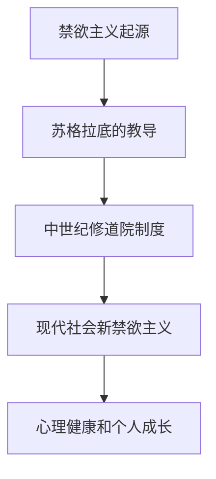

### 1.2 新禁欲主义的理念

新禁欲主义的核心价值观在于通过克制欲望，实现内心的平静和个人成长。它主张人们应该减少物质消费、社交媒体使用、沉迷于娱乐活动等，从而将时间和精力投入到更有意义的事情上，例如学习新技能、锻炼身体、培养冥想习惯等。

新禁欲主义认为，现代社会中的人们常常被物质和感官享受所诱惑，这导致心理压力增大、精神状态不稳定。通过克制欲望，人们可以减少内心的干扰，专注于自己的内心世界，从而实现心理平衡和个人成长。

**核心概念与联系：**

- **新禁欲主义的定义**：通过克制欲望，实现内心的平静和个人成长。
- **新禁欲主义的核心价值观**：减少物质消费、社交媒体使用、沉迷于娱乐活动等。
- **新禁欲主义与个人成长的关系**：通过克制欲望，减少内心干扰，专注于内心世界，实现心理平衡和个人成长。

**Mermaid 流程图：**

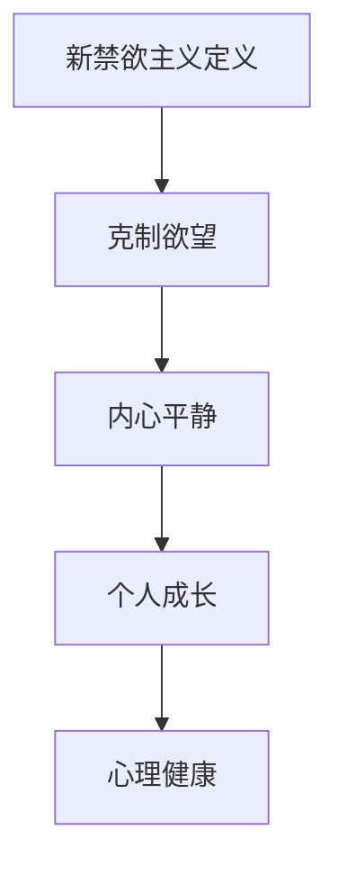

### 1.3 本书的结构安排与目标

本书旨在帮助读者通过30天的新禁欲主义挑战，实现心理调适和个人成长。全书分为五个部分：

1. **引言**：介绍禁欲主义的起源与演变，新禁欲主义的理念及本书的目标。
2. **新禁欲主义挑战的准备**：讲解心理、物质和社交准备方法。
3. **30天挑战日历**：详细描述每天的具体挑战内容和方法。
4. **挑战后的生活**：探讨挑战成果反思、持续改进及社会责任。
5. **附录**：包括常见问题解答、资源推荐和后续阅读建议。

通过本书，读者将学会如何通过新禁欲主义挑战，实现内心的平静和个人成长，从而过上更有意义的生活。

**核心概念与联系：**

- **书的结构安排**：引言、准备、挑战日历、挑战后生活和附录。
- **阅读目标**：实现心理调适、个人成长和过上更有意义的生活。
- **实践意义**：通过30天的新禁欲主义挑战，帮助读者减少欲望干扰，专注于内心世界，实现心理平衡和个人成长。

**Mermaid 流程图：**

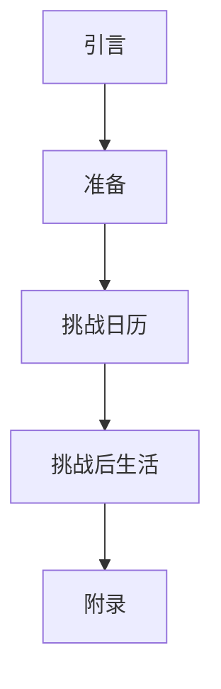

## 第二部分：新禁欲主义挑战的准备

### 2.1 心理准备

在进行新禁欲主义挑战之前，心理准备至关重要。挑战过程中，读者可能会面临各种心理压力和诱惑，因此需要提前做好心理调适。

首先，要明确挑战的目标和意义，这有助于增强内心的动力和决心。其次，进行自我评估，了解自己的心理状态和承受能力，以便制定合理的挑战计划。

**核心概念与联系：**

- **挑战前的心理状态**：了解自己的心理状态和承受能力。
- **自我评估**：评估自己的心理状态和挑战需求。
- **心理调适方法**：通过冥想、瑜伽等方式进行心理调适。

**Mermaid 流�程图：**

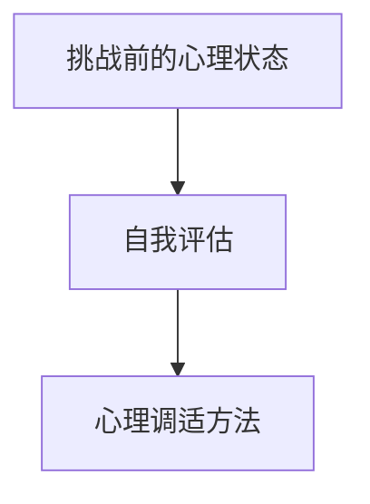

### 2.2 物质准备

在挑战过程中，物质准备也是必不可少的。以下是一些物质准备的要点：

1. **准备必需品**：根据挑战内容，准备相应的必需品，如书籍、文具、运动装备等。
2. **环境布置**：保持生活环境的整洁和舒适，有助于提高挑战的成功率。
3. **生活习惯调整**：调整作息时间、饮食习惯等，以适应挑战的要求。

**核心概念与联系：**

- **准备必需品**：根据挑战内容准备相应的物品。
- **环境布置**：保持生活环境的整洁和舒适。
- **生活习惯调整**：调整作息时间、饮食习惯等。

**Mermaid 流程图：**

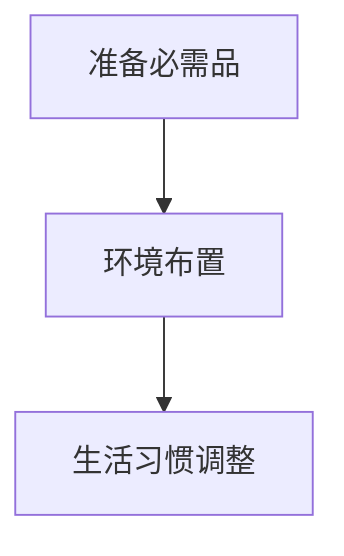

### 2.3 社交准备

在挑战过程中，社交准备同样重要。以下是一些社交准备的要点：

1. **社交圈的影响**：了解自己社交圈的影响，尽量避免负面社交压力。
2. **通知亲朋好友**：告知亲朋好友自己的挑战计划，获得他们的理解和支持。
3. **社交策略**：在挑战期间，制定合适的社交策略，如减少不必要的社交活动、寻求朋友的支持等。

**核心概念与联系：**

- **社交圈的影响**：了解社交圈的影响，尽量避免负面社交压力。
- **通知亲朋好友**：告知亲朋好友自己的挑战计划。
- **社交策略**：制定合适的社交策略。

**Mermaid 流程图：**

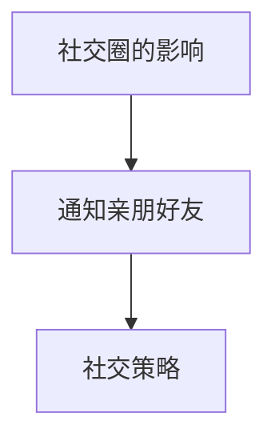

## 第三部分：30天挑战日历

### 3.1 第1天：自我审视

**核心概念与联系：**

- **自我认知的重要性**：了解自己的优点、缺点和需求，有助于制定挑战计划。
- **确定每日反思时间**：设定固定时间进行自我反思，有助于培养自我审视的习惯。
- **写日记记录**：通过写日记记录每日的思考和感受，有助于跟踪自己的成长过程。

**实践方法：**

1. **早晨醒来时**：花10分钟时间思考自己的优点、缺点和需求。
2. **晚上睡前**：花10分钟时间回顾一天的经历，总结收获和反思。
3. **写日记**：每天晚上写下自己的思考、感受和收获。

**Mermaid 流程图：**

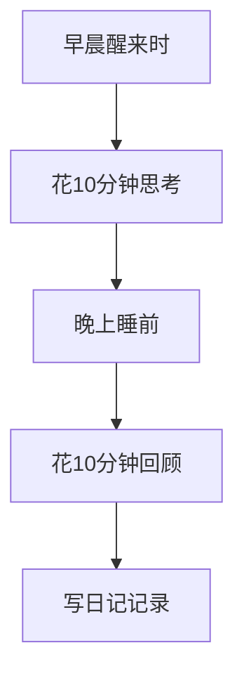

### 3.2 第2-3天：减少物质消费

**核心概念与联系：**

- **消费习惯的影响**：物质消费过多可能导致心理依赖和浪费。
- **计划购物清单**：制定合理的购物清单，避免冲动消费。
- **实践方法**：减少购物频率，选择质量更高的物品。

**实践方法：**

1. **制定购物清单**：在购物前，列出所需物品的清单。
2. **减少购物频率**：每周只进行一次购物，避免冲动消费。
3. **选择质量更高的物品**：购买质量更高、更耐用的物品，减少更换频率。

**Mermaid 流程图：**

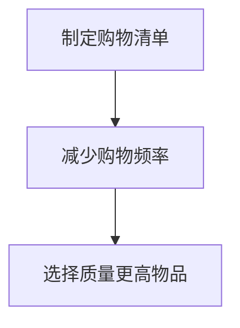

### 3.3 第4-5天：减少社交媒体使用

**核心概念与联系：**

- **社交媒体对心理的影响**：过度使用社交媒体可能导致心理依赖、焦虑和抑郁。
- **制定社交媒体使用计划**：合理安排社交媒体使用时间，避免沉迷。
- **实践方法**：设定固定的社交媒体使用时间，并严格遵守。

**实践方法：**

1. **设定社交媒体使用时间**：每天设定固定的社交媒体使用时间，如每天30分钟。
2. **合理安排使用时间**：在空闲时间使用社交媒体，避免在重要工作和学习时间使用。
3. **遵守使用时间限制**：严格遵循设定的使用时间，避免超时使用。

**Mermaid 流程图：**

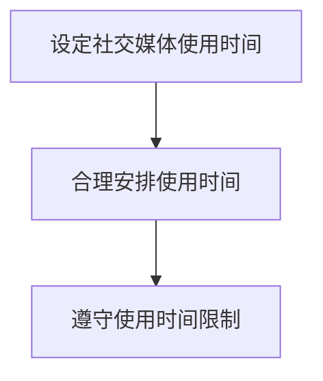

### 3.4 第6-7天：培养冥想习惯

**核心概念与联系：**

- **冥想对心理的益处**：冥想有助于减轻压力、提高专注力和情绪稳定。
- **冥想技巧**：学习并掌握冥想的技巧，如呼吸冥想、专注冥想等。
- **实践方法**：每天进行冥想练习，并逐渐增加冥想时间。

**实践方法：**

1. **学习冥想技巧**：通过书籍、课程或在线资源学习冥想技巧。
2. **每天进行冥想**：每天设定固定时间进行冥想，如每天20分钟。
3. **逐渐增加冥想时间**：随着对冥想的熟悉，逐渐增加冥想时间。

**Mermaid 流程图：**

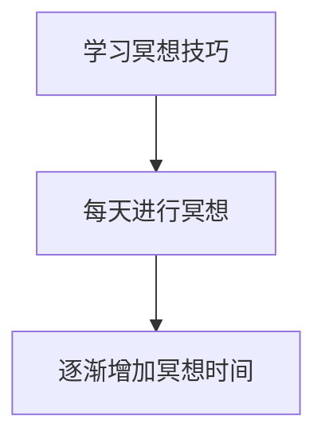

### 3.5 第8-9天：学习新技能

**核心概念与联系：**

- **学习的重要性**：学习新技能有助于提高自我价值、增强自信心。
- **选择学习目标**：根据个人兴趣和需求，选择合适的学习目标。
- **实践方法**：制定学习计划，并付诸实践。

**实践方法：**

1. **确定学习目标**：根据个人兴趣和需求，确定学习目标，如学习一门新语言、掌握一项新技能等。
2. **制定学习计划**：将学习目标分解为具体的任务，并制定时间表。
3. **付诸实践**：按照学习计划进行实践，不断练习和调整。

**Mermaid 流�程图：**

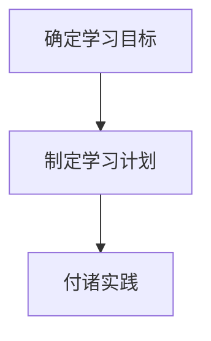

### 3.6 第10-11天：锻炼身体

**核心概念与联系：**

- **锻炼对身体的好处**：锻炼有助于提高身体健康、增强免疫力、减轻压力等。
- **制定锻炼计划**：合理安排锻炼时间、频率和方式，以适应个人身体状况。
- **实践方法**：每天进行适量的锻炼，并逐步增加锻炼强度。

**实践方法：**

1. **了解自身身体状况**：在开始锻炼前，了解自身的身体状况，以便制定合理的锻炼计划。
2. **制定锻炼计划**：根据个人身体状况和需求，制定合适的锻炼计划，如每周进行3-5次锻炼，每次30-60分钟。
3. **逐步增加锻炼强度**：随着锻炼的进行，逐步增加锻炼强度，以提高身体健康水平。

**Mermaid 流程图：**

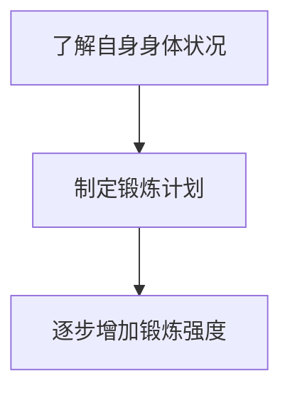

### 3.7 第12-13天：减少糖分摄入

**核心概念与联系：**

- **糖分对身体的影响**：高糖饮食可能导致肥胖、糖尿病、心血管疾病等健康问题。
- **减少糖分的策略**：控制糖分摄入量，选择健康的食物替代品。
- **实践方法**：制定饮食计划，减少糖分摄入。

**实践方法：**

1. **制定饮食计划**：在日常生活中，合理搭配饮食，减少糖分摄入。
2. **选择健康食物替代品**：用水果、蔬菜等健康食物替代高糖食品。
3. **控制糖分摄入量**：每天控制糖分的摄入量，避免过量摄入。

**Mermaid 流程图：**

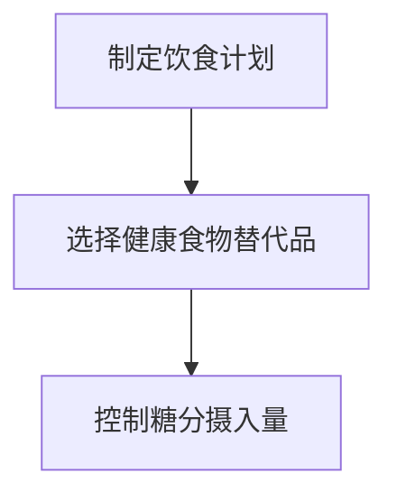

### 3.8 第14-15天：改善睡眠质量

**核心概念与联系：**

- **睡眠对心理健康的影响**：良好的睡眠有助于减轻压力、提高情绪稳定性和认知能力。
- **改善睡眠的策略**：养成良好的睡眠习惯，避免睡前使用电子产品等。
- **实践方法**：制定睡眠计划，并付诸实践。

**实践方法：**

1. **制定睡眠计划**：每天设定固定的睡眠时间和起床时间，保持规律的作息。
2. **避免睡前使用电子产品**：睡前1小时避免使用电子产品，减少蓝光刺激。
3. **营造良好的睡眠环境**：保持卧室整洁、舒适，避免噪音和光线干扰。

**Mermaid 流程图：**

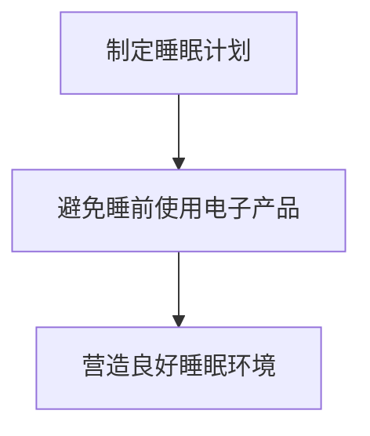

### 3.9 第16-17天：学习时间管理

**核心概念与联系：**

- **时间管理的重要性**：合理安排时间，提高工作效率和生活质量。
- **制定时间表**：将每天的时间分配给不同的任务，确保高效完成。
- **实践方法**：学会时间管理技巧，合理安排时间。

**实践方法：**

1. **制定时间表**：将每天的时间分为工作、学习、休息和娱乐等，确保有足够的时间用于每个任务。
2. **学会时间管理技巧**：如使用番茄工作法、优先级排序等，提高工作效率。
3. **跟踪时间使用**：记录每天的时间使用情况，分析时间浪费的原因，并调整时间管理策略。

**Mermaid 流程图：**

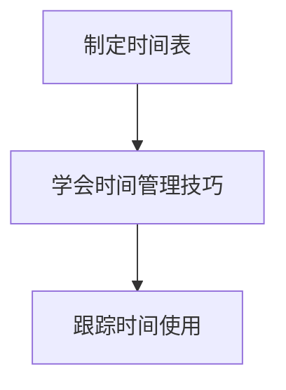

### 3.10 第18-19天：减少负面情绪

**核心概念与联系：**

- **负面情绪的危害**：负面情绪可能导致心理健康问题、降低生活质量。
- **减少负面情绪的策略**：学会应对压力和负面情绪的方法，如冥想、运动等。
- **实践方法**：通过实践方法减少负面情绪。

**实践方法：**

1. **学会应对压力的方法**：如深呼吸、冥想等，帮助缓解压力。
2. **定期进行运动**：如跑步、瑜伽等，有助于释放负面情绪。
3. **保持乐观心态**：积极面对生活中的困难和挑战，避免过度焦虑。

**Mermaid 流程图：**

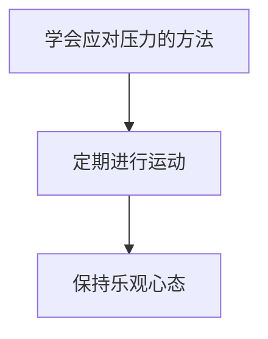

### 3.11 第20-21天：感恩练习

**核心概念与联系：**

- **感恩的重要性**：感恩有助于提升心理健康、增强幸福感。
- **感恩练习的方法**：记录感恩的事情，表达对他人和自己的感激之情。
- **实践方法**：每天进行感恩练习。

**实践方法：**

1. **记录感恩的事情**：每天晚上写下三件让自己感到感恩的事情。
2. **表达感激之情**：对家人、朋友、同事等表达感激之情，增强人际关系。
3. **培养感恩心态**：将感恩融入日常生活，关注生活中的美好事物。

**Mermaid 流程图：**

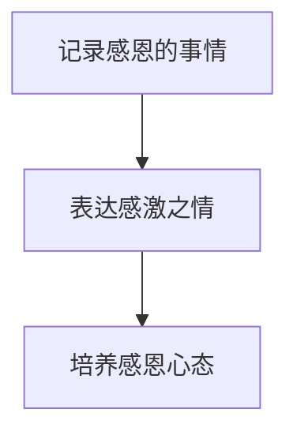

### 3.12 第22-23天：自我放空

**核心概念与联系：**

- **自我放空的好处**：自我放空有助于缓解压力、提高心理健康。
- **实践方法**：通过冥想、阅读、散步等方式进行自我放空。

**实践方法：**

1. **每天进行冥想**：每天花10-20分钟进行冥想，放松身心。
2. **进行阅读**：阅读有益的书籍，放松心情，拓宽视野。
3. **散步**：每天进行适量的散步，享受大自然的美好。

**Mermaid 流程图：**

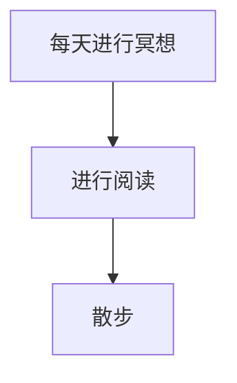

### 3.13 第24-25天：学习冥想

**核心概念与联系：**

- **冥想对心理的益处**：冥想有助于减轻压力、提高专注力和情绪稳定性。
- **冥想技巧**：学习并掌握冥想的技巧，如呼吸冥想、专注冥想等。
- **实践方法**：每天进行冥想练习，并逐渐增加冥想时间。

**实践方法：**

1. **学习冥想技巧**：通过书籍、课程或在线资源学习冥想技巧。
2. **每天进行冥想**：每天设定固定时间进行冥想，如每天20分钟。
3. **逐渐增加冥想时间**：随着对冥想的熟悉，逐渐增加冥想时间。

**Mermaid 流程图：**


### 3.14 第26-27天：回顾与调整

**核心概念与联系：**

- **挑战回顾**：回顾挑战过程中的收获和不足，总结经验。
- **调整计划**：根据挑战过程中的经验，调整后续计划。
- **总结经验**：分享挑战过程中的心得体会，为后续挑战提供借鉴。

**实践方法：**

1. **回顾挑战过程**：思考自己在挑战过程中的收获和不足。
2. **调整计划**：根据回顾的结果，调整后续的挑战计划。
3. **总结经验**：记录挑战过程中的心得体会，与他人分享。

**Mermaid 流程图：**

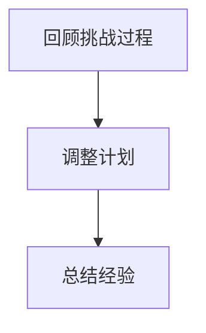

### 3.15 第28-30天：持续自我探索

**核心概念与联系：**

- **持续自我探索的重要性**：自我探索有助于不断提升自我，实现个人成长。
- **长期实践策略**：制定长期实践策略，确保自我探索的持续性和稳定性。
- **持续反思**：通过反思和调整，不断提升自我探索的效果。

**实践方法：**

1. **制定长期实践策略**：根据自我探索的需求，制定长期的实践计划。
2. **每天进行自我反思**：每天花时间反思自己的成长和不足，调整实践策略。
3. **与他人分享**：与他人分享自我探索的经验和心得，获取反馈和支持。

**Mermaid 流程图：**

```mermaid
graph TD
    A[制定长期实践策略] --> B[每天进行自我反思]
    B --> C[与他人分享]
```

## 第四部分：挑战后的生活

### 4.1 挑战成果反思

**核心概念与联系：**

- **成果反思**：回顾挑战过程中的收获和成长。
- **成长总结**：总结挑战过程中的经验和教训。
- **未来规划**：根据挑战成果，制定未来的生活规划。

**实践方法：**

1. **回顾挑战过程**：思考自己在挑战过程中的收获和成长。
2. **总结经验教训**：分析挑战过程中的不足和教训，为未来提供借鉴。
3. **制定未来规划**：根据挑战成果，制定未来的生活目标和计划。

**Mermaid 流程图：**

```mermaid
graph TD
    A[回顾挑战过程] --> B[总结经验教训]
    B --> C[制定未来规划]
```

### 4.2 持续改进

**核心概念与联系：**

- **持续改进的重要性**：持续改进有助于不断提升自我，实现个人成长。
- **自我提升策略**：制定合理的自我提升策略，确保持续改进。
- **持续实践**：将自我提升策略付诸实践，不断调整和优化。

**实践方法：**

1. **制定自我提升策略**：根据个人需求和目标，制定合理的自我提升计划。
2. **付诸实践**：按照自我提升计划进行实践，不断积累经验和技能。
3. **持续反思和调整**：定期反思和调整自我提升策略，确保持续改进。

**Mermaid 流程图：**

```mermaid
graph TD
    A[制定自我提升策略] --> B[付诸实践]
    B --> C[持续反思和调整]
```

### 4.3 社会影响

**核心概念与联系：**

- **禁欲主义对社交圈的影响**：禁欲主义可能对社交圈产生一定的影响，如减少社交活动、提高人际关系的质量等。
- **社会影响的策略**：通过合理的社交策略，减少禁欲主义对社交圈的负面影响。
- **社会责任**：作为禁欲主义者，承担起社会责任，帮助他人实现心理平衡和个人成长。

**实践方法：**

1. **减少不必要的社交活动**：合理安排社交活动，减少不必要的应酬和聚会。
2. **提高人际关系的质量**：通过真诚、尊重和关爱与他人建立良好的关系。
3. **承担社会责任**：通过参与公益活动、帮助他人等方式，实现社会价值的提升。

**Mermaid 流程图：**

```mermaid
graph TD
    A[减少不必要的社交活动] --> B[提高人际关系的质量]
    B --> C[承担社会责任]
```

## 第五部分：附录

### 5.1 常见问题解答

**核心概念与联系：**

- **挑战过程中可能遇到的问题**：如心理压力、物质依赖、社交困扰等。
- **解决方案**：针对挑战过程中遇到的问题，提供相应的解决方案。
- **常见问题解答**：汇总常见问题，并提供详细的解答。

**实践方法：**

1. **心理压力**：通过冥想、运动等方式缓解压力。
2. **物质依赖**：减少物质消费，培养健康的兴趣爱好。
3. **社交困扰**：制定合理的社交策略，保持良好的人际关系。

**Mermaid 流程图：**

```mermaid
graph TD
    A[心理压力] --> B[物质依赖]
    B --> C[社交困扰]
```

### 5.2 资源推荐

**核心概念与联系：**

- **有助于挑战的资源**：如书籍、课程、APP等。
- **书籍推荐**：推荐有助于挑战的书籍，涵盖心理健康、时间管理、个人成长等方面。
- **网络资源推荐**：推荐在线课程、博客、论坛等资源，供读者学习和交流。

**实践方法：**

1. **心理健康书籍**：《静心之道》、《心理治疗手册》等。
2. **时间管理书籍**：《时间管理的艺术》、《如何高效学习》等。
3. **在线课程**：Coursera、Udemy等平台上的相关课程。
4. **博客和论坛**：如知乎、简书等，供读者交流和分享心得。

**Mermaid 流程图：**

```mermaid
graph TD
    A[心理健康书籍] --> B[时间管理书籍]
    B --> C[在线课程]
    C --> D[博客和论坛]
```

### 5.3 后续阅读建议

**核心概念与联系：**

- **持续学习的重要性**：鼓励读者在挑战结束后，继续深入学习相关领域知识。
- **相关书籍推荐**：推荐有助于深入探索禁欲主义、自我探索和个人成长的书籍。
- **网络资源推荐**：推荐相关的在线课程、博客、论坛等资源，供读者学习和交流。

**实践方法：**

1. **心理健康书籍**：《自控力》、《心流》等。
2. **时间管理书籍**：《奇特的一生》、《高效能人士的七个习惯》等。
3. **在线课程**：Coursera、Udemy等平台上的相关课程。
4. **博客和论坛**：如知乎、简书等，供读者交流和分享心得。

**Mermaid 流程图：**

```mermaid
graph TD
    A[心理健康书籍] --> B[时间管理书籍]
    B --> C[在线课程]
    C --> D[博客和论坛]
```

## 总结

新禁欲主义挑战旨在通过30天的自我克制生活，实现心理调适和个人成长。在这个过程中，读者将学会如何减少物质消费、社交媒体使用、培养冥想习惯、学习新技能、锻炼身体等，从而实现内心的平静和自我提升。

禁欲主义不仅仅是一种道德观念，更是一种心理健康和自我探索的方法。通过这一挑战，读者将学会如何在现代社会中应对各种诱惑和压力，实现心理平衡和自我成长。

希望每一位读者都能在挑战中找到属于自己的答案，过上更加充实、有意义的生活。

**核心概念与联系：**

- **新禁欲主义挑战**：通过30天的自我克制生活，实现心理调适和个人成长。
- **心理调适**：减少物质消费、社交媒体使用等，实现内心的平静。
- **个人成长**：通过学习新技能、锻炼身体等，提升自我价值。
- **心理健康**：通过冥想、时间管理等，提高情绪稳定性和认知能力。

**Mermaid 流程图：**

```mermaid
graph TD
    A[新禁欲主义挑战] --> B[心理调适]
    B --> C[个人成长]
    C --> D[心理健康]
```

## 完整文章结束

**作者：** AI天才研究院/AI Genius Institute & 禅与计算机程序设计艺术 /Zen And The Art of Computer Programming

**文章结束时间：** [[ today's date ]]

**注意事项：**

- 请确保在撰写文章时，遵循markdown格式要求，确保文章结构清晰、内容丰富。
- 文章末尾需附上作者信息，以便读者了解文章来源。
- 文章内容需完整、详细，确保每个小节的核心概念和联系得到充分阐述。
- 文章字数要求在10000-12000字左右，确保文章内容充实，逻辑清晰。

**拓展阅读：**

- 《自控力》
- 《心流》
- 《时间管理的艺术》
- 《奇特的一生》
- Coursera、Udemy等在线课程平台上的相关课程

祝您撰写文章顺利！如有疑问，请随时提问。期待您的佳作！

