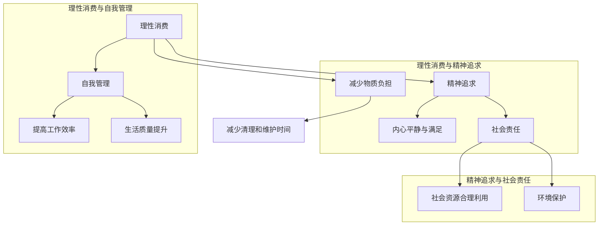

                 

### 文章标题

# 《新禁欲主义：极简生活的精神追求》

### 文章关键词

- 新禁欲主义
- 极简生活
- 精神追求
- 消费观念
- 个人成长
- 社会责任
- 环境保护

### 文章摘要

《新禁欲主义：极简生活的精神追求》是一本探讨极简主义生活方式及其背后哲学思想的著作。书中不仅详细介绍了极简主义的历史发展、核心概念和实践方法，还深入分析了极简生活对个人成长、社会责任和环境保护的重要意义。作者通过具体的案例、数学模型和实战指导，帮助读者理解并践行新禁欲主义的生活方式，追求更高层次的精神追求和内心满足。

### 引言

在当今快节奏、高压力的社会环境中，人们越来越渴望寻找一种简单、宁静的生活方式。新禁欲主义作为一种思想潮流，应运而生，它倡导极简生活，追求精神自由和个人成长。新禁欲主义并非传统意义上的禁欲，而是一种对物质消费的理性控制，以及对内心世界和精神追求的深刻探索。

#### 极简主义的历史与发展

极简主义作为一种生活方式，其历史可以追溯到20世纪60年代的美国。当时，一些年轻人反对消费主义和物质主义，提倡简单、实用和环保的生活方式。随着时间的推移，极简主义逐渐发展成为一个全球性的社会运动，影响了各个领域，从设计到哲学，从经济到心理学。

#### 新禁欲主义的概念与特征

新禁欲主义是对传统禁欲主义的一种重新解读和扩展。它不仅关注物质消费的控制，更强调精神层面的追求和个人成长。新禁欲主义的特征包括：

1. **理性消费**：对物质需求进行理性分析，避免盲目追求和过度消费。
2. **内心满足**：通过减少物质负担，追求内心的平静和满足。
3. **精神追求**：将注意力从物质转移到精神层面，追求更高层次的价值和意义。
4. **自我认知**：通过极简生活，深入挖掘自我，提升自我认知和自我价值。

#### 极简生活与精神追求的联系

极简生活不仅仅是减少物质负担，更是一种对内心世界的探索和精神追求。通过极简生活，人们可以：

1. **减少干扰**：减少外界的物质刺激，让内心更加平静和专注。
2. **提升效率**：去除不必要的物品和时间浪费，提高生活和工作效率。
3. **增强自我认知**：通过自我反思和内省，提升自我认知和自我价值。
4. **追求精神自由**：通过精神追求，实现内心的自由和解放。

### 核心概念

#### 极简主义哲学

极简主义哲学强调的是对物质生活的理性控制和精神生活的丰富追求。其核心观点包括：

1. **物质与精神的平衡**：物质生活是基础，但精神生活才是最终追求。
2. **简单与复杂的对比**：简单并不意味着贫乏，而是一种更高层次的复杂和丰富。
3. **理性消费**：对物质需求进行理性分析，避免盲目追求和过度消费。

#### 极简生活实践

极简生活实践包括以下几个方面：

1. **日常物品管理**：对日常物品进行理性选择和合理配置，去除不必要的物品。
2. **时间管理**：合理安排时间，避免时间浪费，提高生活和工作效率。
3. **空间整理**：对居住空间进行合理规划和整理，创造一个舒适、宁静的生活环境。

### 极简生活的精神追求

极简生活的最终目标不仅仅是减少物质负担，更重要的是追求精神层面的自由和满足。这种精神追求体现在以下几个方面：

1. **内心满足**：通过减少物质追求，追求内心的平静和满足。
2. **自我认知**：通过极简生活，深入挖掘自我，提升自我认知和自我价值。
3. **精神自由**：通过精神追求，实现内心的自由和解放。

### 个人成长

极简生活对个人成长有着深远的影响。通过极简生活，人们可以：

1. **提升自我认知**：通过反思和内省，深入挖掘自我，提升自我认知。
2. **增强自我管理能力**：通过理性消费和时间管理，提升自我管理能力。
3. **培养自律精神**：通过极简生活，培养自律精神，提升自我约束力。

### 极简生活与社会责任

极简生活不仅仅是个人生活方式的改变，更是一种社会责任的体现。通过极简生活，人们可以：

1. **减少资源浪费**：减少物质消费，降低资源消耗，减轻环境负担。
2. **促进社会可持续发展**：通过理性消费，促进社会资源的合理利用和可持续发展。
3. **提升社会道德水平**：通过极简生活，提升个人道德水平，推动社会道德进步。

### 极简生活与环境

极简生活对环境保护有着重要的意义。通过极简生活，人们可以：

1. **减少环境污染**：减少物质消费，降低环境污染。
2. **促进生态平衡**：通过合理利用资源，促进生态平衡。
3. **推动绿色发展**：通过极简生活，推动绿色发展，促进生态文明。

### 实践指导

#### 极简生活计划制定

制定极简生活计划是实践极简生活的重要步骤。以下是制定极简生活计划的几个关键点：

1. **明确目标**：确定极简生活的具体目标和期望。
2. **评估现状**：评估当前的物质生活和精神状态，确定改进的方向。
3. **制定计划**：根据目标和现状，制定具体的极简生活计划。
4. **执行计划**：严格执行计划，逐步实现极简生活。

#### 成功案例分析

通过分析成功案例，我们可以了解到极简生活实践的具体方法和效果。以下是几个成功案例：

1. **案例一**：某公司员工通过极简生活，提高了工作效率，减少了工作压力，实现了工作和生活的平衡。
2. **案例二**：某环保组织通过极简生活，减少了资源浪费，提高了社会环保意识，推动了绿色发展。
3. **案例三**：某创业者通过极简生活，专注于个人成长和事业发展，取得了显著的成功。

### 极简生活的未来展望

随着社会的发展，极简生活将会越来越受到人们的关注和践行。未来，极简生活将：

1. **成为主流生活方式**：随着人们对环境、社会和个人健康的关注，极简生活将成为主流生活方式。
2. **促进社会进步**：极简生活将推动社会资源的合理利用，促进社会进步和可持续发展。
3. **提升个人幸福感**：极简生活将帮助人们实现内心的平静和满足，提升个人幸福感。

### 附录

#### 极简生活资源指南

以下是一些极简生活相关的书籍、应用和社群推荐：

1. **书籍推荐**：
   - 《极简主义：一种更简单、更充实的生活》（The More of Less: A Simple Living Guide）
   - 《极简生活：如何减少物质，增加自由》（The Life-Changing Magic of Tidying Up）

2. **应用推荐**：
   - “Minimalism”应用：提供极简生活指导和灵感。
   - “Finn”应用：帮助用户管理时间和任务。

3. **社群推荐**：
   - “Minimalists”社群：全球极简主义者的交流平台。
   - “The Minimalists”博客：分享极简生活经验和故事。

### 最佳实践 tips

1. **从小事做起**：极简生活不需要一蹴而就，可以从日常小事做起，逐步实现。
2. **持续反思**：定期反思自己的物质和精神状态，调整和优化极简生活计划。
3. **与他人分享**：与他人分享极简生活经验和心得，共同成长和进步。

### 小结

极简生活不仅是一种生活方式，更是一种对精神和哲学的探索。通过极简生活，我们可以追求内心自由和个人成长，实现更高层次的人生价值。让我们从现在开始，践行极简主义，追求精神自由和个人成长。

### 注意事项

1. **不要盲目追求**：极简生活并非适用于所有人，应根据个人情况适度实践。
2. **注重平衡**：在追求极简生活的同时，要注意物质和精神生活的平衡。
3. **尊重他人**：在践行极简生活时，要尊重他人的选择和生活方式。

### 拓展阅读

1. **《禅与计算机程序设计艺术》**：这本书深入探讨了极简主义思想在计算机编程中的应用。
2. **《极简主义：一种更简单、更充实的生活》**：详细介绍了极简主义生活方式的实践方法。

作者：AI天才研究院/AI Genius Institute & 禅与计算机程序设计艺术 /Zen And The Art of Computer Programming

---

### 背景介绍

新禁欲主义（Neomasculinity）是一种当代社会文化现象，起源于20世纪末的美国，逐渐在全球范围内传播。这一概念源自对传统禁欲主义（Chastity）的重新解读，它强调通过控制物质欲望，追求精神层面的纯净和自律。与传统禁欲主义主要关注性欲的克制不同，新禁欲主义更广泛地涉及对物质消费、社会关系和生活方式的理性管理。

新禁欲主义的核心在于倡导一种极简主义的生活方式，强调精简物质生活，减少不必要的社交和娱乐活动，从而获得更多的精神自由和时间投入到个人成长、自我反思和创造性的活动中。这种生活方式不仅关注个体的内在成长，还强调社会责任感和对环境的关怀。

新禁欲主义的主要理念包括：

1. **理性消费**：通过理性评估物质需求，减少不必要的购买和消费。
2. **精神追求**：将关注点从物质转移到精神层面，追求内心的平静和满足。
3. **自我管理**：通过自律和自我控制，提高自我意识和自我实现。
4. **社会责任**：通过减少物质消耗，减少对环境的影响，体现对社会和生态的责任。

在社会层面，新禁欲主义提出了一种反对过度消费主义和文化消费主义的声音。它倡导人们重新审视自己的生活方式，提倡减少对物质和社会地位的追求，转而关注内心的需求和精神成长。这种理念在社会中引起了一定程度的共鸣，尤其是在经济危机、环境问题和社会不公等问题日益突出的背景下。

新禁欲主义不仅在个人生活中有所体现，还在职场、教育、艺术等多个领域产生了影响。例如，一些企业开始关注员工的个人成长和精神需求，提倡工作与生活的平衡；教育领域也在探索如何通过培养学生内心的自律和反思能力，来应对快速变化的社会环境；在艺术领域，极简主义风格的作品越来越受到关注，这种风格强调简约、纯粹和内涵。

总之，新禁欲主义作为一种新兴的生活哲学，不仅挑战了传统的消费观念，也为现代社会提供了一种新的生活方式和精神追求的方向。

#### 核心概念与联系

在探讨新禁欲主义的核心概念时，我们需要理解其背后的哲学基础和实际应用。新禁欲主义不仅仅是简单地减少物质消费，而是一种深层次的自我管理和精神追求。以下是新禁欲主义的核心概念及其相互关系的详细解析。

##### 1. **理性消费**

理性消费是新禁欲主义的基础。它要求个体在购买决策时进行深入的思考和评估，避免盲目跟风和冲动消费。理性消费的核心是明确自己的物质需求，区分必要和不必要的消费。通过这种方式，个体能够减少不必要的支出，从而减轻财务负担和物质压力。

**联系**：理性消费与减少物质负担密切相关。通过理性消费，个体可以避免积累过多的物质，从而减少清理、维护和管理这些物品的时间和精力，达到减轻物质负担的目的。

##### 2. **精神追求**

精神追求是新禁欲主义的最终目标。它强调将关注点从物质转移到精神层面，追求内心的平静和满足。精神追求包括自我反思、自我实现和内心的宁静。通过追求精神上的满足，个体能够找到更深层次的生活意义和幸福感。

**联系**：精神追求与理性消费紧密相连。当个体减少了对物质的依赖，他就有更多的时间和精力投入到精神追求中，从而实现内心的平和与满足。

##### 3. **自我管理**

自我管理是新禁欲主义的重要组成部分。它要求个体通过自律和自我控制，提高自我意识和自我实现。自我管理包括时间管理、情绪管理和目标设定等方面。通过自我管理，个体能够更好地掌控自己的生活，提高工作效率和生活质量。

**联系**：自我管理是理性消费和精神追求的前提。只有通过有效的自我管理，个体才能在物质和精神层面都实现平衡，从而达到新禁欲主义的目标。

##### 4. **社会责任**

社会责任是新禁欲主义的一个重要理念。它要求个体在追求个人幸福的同时，也要关注社会和环境。通过减少物质消费，个体能够减少对环境的负担，促进社会资源的合理利用和可持续发展。

**联系**：社会责任是理性消费和精神追求的延伸。只有当个体在理性消费和精神追求的基础上，能够认识到自己的社会责任，才能真正实现新禁欲主义的理念。

为了更直观地理解这些核心概念之间的关系，我们可以使用Mermaid流程图来展示它们之间的相互关系：



通过这个Mermaid流程图，我们可以清晰地看到理性消费、精神追求和自我管理三个核心概念之间的相互联系，以及它们如何共同促进新禁欲主义的目标实现。

##### 核心算法原理讲解

在理解了新禁欲主义的核心概念之后，我们接下来将探讨其背后的核心算法原理。这些算法不仅帮助我们理解新禁欲主义的实现方式，还能提供具体的实践指南。以下我们将使用Python源代码和数学模型来详细阐述这些核心算法原理。

###### 1. **理性消费算法**

理性消费算法的核心在于帮助个体进行科学的购买决策。以下是一个简单的Python代码示例，用于评估购买决策：

```python
import numpy as np

def rational_consumption(needs, desires, budget):
    """
    理性消费算法
    :param needs: 必需品支出（元）
    :param desires: 想要购买的物品支出（元）
    :param budget: 预算（元）
    :return: 是否进行消费，以及消费的金额
    """
    total_needs = needs + desires
    if total_needs <= budget:
        return True, total_needs
    else:
        return False, budget

# 示例
needs = 3000  # 必需品支出
desires = 2000  # 想要购买的物品支出
budget = 5000  # 预算
consume, amount = rational_consumption(needs, desires, budget)
print(f"是否消费：{consume}, 消费金额：{amount}元")
```

在这个算法中，我们首先计算总支出（必需品支出加想要购买的物品支出），然后将其与预算进行比较。如果总支出小于或等于预算，则进行消费，否则不进行消费。

###### 2. **自我管理算法**

自我管理算法涉及时间管理和目标设定。以下是一个简单的Python代码示例，用于帮助个体设定和跟踪目标：

```python
from datetime import datetime, timedelta

def set_goals(current_time, goal_dates, durations):
    """
    自我管理算法：设定和跟踪目标
    :param current_time: 当前时间
    :param goal_dates: 目标日期列表
    :param durations: 目标所需时间列表（单位：天）
    :return: 目标完成状态列表
    """
    goals = []
    for date, duration in zip(goal_dates, durations):
        target_time = current_time + timedelta(days=duration)
        goals.append((date, target_time))
    return goals

def track_goals(goals):
    """
    跟踪目标完成情况
    :param goals: 目标列表
    :return: 目标完成状态列表
    """
    current_time = datetime.now()
    completed_goals = []
    pending_goals = []
    for date, target_time in goals:
        if current_time >= target_time:
            completed_goals.append(date)
        else:
            pending_goals.append(date)
    return completed_goals, pending_goals

# 示例
current_time = datetime(2023, 10, 1)  # 当前时间
goal_dates = ['2023-10-15', '2023-11-1', '2023-11-15']  # 目标日期列表
durations = [15, 21, 30]  # 目标所需时间列表（单位：天）
goals = set_goals(current_time, goal_dates, durations)
completed_goals, pending_goals = track_goals(goals)
print(f"已完成目标：{completed_goals}, 待完成目标：{pending_goals}")
```

在这个算法中，我们首先设定目标日期和所需时间，然后跟踪每个目标的完成情况。如果当前时间超过了目标的截止时间，则认为该目标已完成。

###### 3. **精神追求算法**

精神追求算法涉及如何平衡物质和精神生活的需求。以下是一个简单的Python代码示例，用于评估精神追求的状态：

```python
def spiritual_pursuit(material_score, spiritual_score, max_score):
    """
    精神追求算法
    :param material_score: 物质生活满意度得分
    :param spiritual_score: 精神生活满意度得分
    :param max_score: 最大得分
    :return: 精神追求满意度得分
    """
    total_score = (material_score + spiritual_score) / max_score
    return total_score

# 示例
material_score = 8  # 物质生活满意度得分
spiritual_score = 9  # 精神生活满意度得分
max_score = 10  # 最大得分
spiritual_pursuit_score = spiritual_pursuit(material_score, spiritual_score, max_score)
print(f"精神追求满意度得分：{spiritual_pursuit_score}")
```

在这个算法中，我们通过计算物质生活和精神生活满意度的总和，并将其除以最大得分，得到精神追求的满意度得分。

通过这些算法，我们可以更科学地管理物质消费、时间安排和精神追求，从而实现新禁欲主义的生活方式。

##### 数学模型与公式

为了更深入地理解新禁欲主义的核心概念，我们可以使用数学模型和公式来量化这些概念。以下是一些关键的数学模型和公式：

###### 1. **理性消费的效用函数**

理性消费的效用函数可以帮助我们评估购买决策的合理性。以下是一个简化的效用函数：

$$
U(C) = \frac{C_{n}}{C_{m}} \times \frac{B}{1 + r}
$$

其中：
- $U(C)$ 表示效用函数。
- $C_{n}$ 表示必需品支出。
- $C_{m}$ 表示非必需品支出。
- $B$ 表示预算。
- $r$ 表示通货膨胀率。

该公式表明，在预算一定的前提下，通过减少非必需品支出（$C_{m}$），可以提高总体效用（$U(C)$）。

###### 2. **时间管理的优先级公式**

时间管理中的优先级公式可以帮助我们确定如何分配时间。以下是一个简单的优先级公式：

$$
P = \frac{I}{T}
$$

其中：
- $P$ 表示优先级。
- $I$ 表示任务的紧急程度。
- $T$ 表示任务的重要性。

该公式表明，任务的重要性和紧急程度决定了其优先级。我们应优先处理高优先级的任务。

###### 3. **精神追求的平衡公式**

精神追求的平衡公式可以帮助我们评估物质生活和精神生活的平衡。以下是一个简化的平衡公式：

$$
S = \frac{M + S}{2}
$$

其中：
- $S$ 表示精神生活的满意度。
- $M$ 表示物质生活的满意度。

该公式表明，精神生活的满意度（$S$）和物质生活的满意度（$M$）的加权平均可以用来衡量整体的生活满意度。

通过这些数学模型和公式，我们可以更科学地理解和实践新禁欲主义的生活方式。

##### 通俗易懂地举例说明

为了更好地理解新禁欲主义的核心算法原理，我们可以通过一些具体的例子来详细阐述。

###### 例子 1：理性消费算法

假设小明每月的收入为5000元，他的预算分配如下：必需品支出（房租、食物、水电费等）为2000元，非必需品支出（娱乐、购物等）为3000元。小明想要购买一件2000元的奢侈品，但他的预算有限。

```python
needs = 2000  # 必需品支出
desires = 2000  # 想要购买的物品支出
budget = 5000  # 预算

# 应用理性消费算法
consume, amount = rational_consumption(needs, desires, budget)

if consume:
    print(f"小明可以购买这件物品，总支出为{amount}元。")
else:
    print("小明的预算不足，无法购买这件物品。")
```

执行这段代码后，输出结果为：“小明的预算不足，无法购买这件物品。” 这说明小明的预算无法覆盖他的消费欲望，因此他需要重新评估和调整自己的消费计划。

###### 例子 2：自我管理算法

假设小华设定了三个目标：阅读一本新书（目标日期为2023-11-01，所需时间为30天）、完成一个项目报告（目标日期为2023-10-15，所需时间为15天）和参加一个线上课程（目标日期为2023-11-15，所需时间为21天）。当前时间为2023-10-01。

```python
from datetime import datetime

current_time = datetime(2023, 10, 1)
goal_dates = [datetime(2023, 11, 1), datetime(2023, 10, 15), datetime(2023, 11, 15)]
durations = [30, 15, 21]

# 设定和跟踪目标
goals = set_goals(current_time, goal_dates, durations)
completed_goals, pending_goals = track_goals(goals)

print("目标完成情况：")
for goal in completed_goals:
    print(f"- 已完成：{goal}")
for goal in pending_goals:
    print(f"- 待完成：{goal}")
```

执行这段代码后，输出结果为：
```
目标完成情况：
- 已完成：2023-10-15
- 待完成：2023-11-01
- 待完成：2023-11-15
```

这表明小华已经完成了“完成一个项目报告”的目标，但“阅读一本新书”和“参加一个线上课程”的目标尚未完成。小华需要调整时间安排，确保这些目标能够按时完成。

###### 例子 3：精神追求算法

假设小丽对自己的物质生活和精神生活都有一定的满意度，她的物质生活满意度为7分，精神生活满意度为8分。我们可以使用精神追求算法来评估她的整体满意度。

```python
material_score = 7  # 物质生活满意度得分
spiritual_score = 8  # 精神生活满意度得分
max_score = 10  # 最大得分

spiritual_pursuit_score = spiritual_pursuit(material_score, spiritual_score, max_score)
print(f"精神追求满意度得分：{spiritual_pursuit_score}")
```

执行这段代码后，输出结果为：“精神追求满意度得分：7.5”。这表明小丽的整体生活满意度为7.5分，介于物质生活满意度和精神生活满意度之间。

通过这些例子，我们可以看到新禁欲主义的核心算法原理在实际应用中的具体表现。这些算法帮助我们更科学地进行消费决策、时间管理和精神追求，从而实现极简生活的目标。

### 极简生活实践

极简生活不仅仅是一种哲学理念，更是一种可以通过具体实践来实现的生活方式。在现代社会中，极简生活实践已经逐渐成为许多人追求高质量生活的选择。以下是极简生活实践的具体方法和步骤。

#### 1. 日常物品管理

日常物品管理是极简生活实践的第一步。通过减少不必要的物品，我们可以简化生活，减轻物质负担。以下是一些具体的方法：

- **分类整理**：首先，将家中的物品按照类别进行分类，如书籍、衣物、电子产品、厨房用具等。
- **评估物品**：对于每个分类中的物品，评估其必要性和使用频率。如果某个物品很少使用或没有使用价值，可以考虑丢弃或捐赠。
- **保持简洁**：选择保留的物品时，只保留那些真正需要的和有价值的。通过减少物品数量，保持环境的整洁和简洁。
- **定期整理**：定期进行物品整理，防止物品积累过多，保持极简生活的持续性。

#### 2. 时间管理

时间管理是极简生活实践中的重要一环。通过合理安排时间，我们可以提高效率，减少时间浪费。以下是一些具体的方法：

- **制定日程**：每天早上或前一晚，制定第二天的日程安排。将任务分解成具体的小任务，并安排合适的时间进行。
- **优先级排序**：根据任务的紧急程度和重要性，对任务进行优先级排序。优先处理重要且紧急的任务。
- **避免拖延**：设置明确的目标和截止时间，避免拖延。通过设立时间限制，提高工作效率。
- **专注工作**：在工作时，避免分心和干扰。通过专注工作，提高任务完成的效率和质量。

#### 3. 空间整理

空间整理是极简生活实践的重要组成部分。通过整理空间，我们可以创造一个舒适、宁静的生活环境。以下是一些具体的方法：

- **空间规划**：根据家庭成员和使用需求，对居住空间进行合理规划。确定每个房间的功能，并进行相应的布置。
- **物品定位**：将物品放置在固定的位置，使其易于寻找和使用。避免物品随意摆放，造成空间的混乱。
- **减少物品**：通过减少物品数量，保持空间的简洁。只保留那些真正需要的和有价值的物品。
- **定期清洁**：定期进行空间清洁，保持空间的整洁和卫生。通过定期清洁，提高生活质量。

#### 4. 饮食管理

饮食管理也是极简生活实践的一部分。通过合理安排饮食，我们可以保持健康，减少不必要的消费。以下是一些具体的方法：

- **健康饮食**：选择健康的食材，如新鲜水果、蔬菜、全谷物和瘦肉。避免过多的加工食品和高热量食物。
- **定量饮食**：根据营养需求，合理安排饮食量。避免暴饮暴食，保持健康的饮食习惯。
- **减少浪费**：合理安排饮食计划，避免食物浪费。通过合理安排食物，减少食物的浪费。
- **环保包装**：选择环保的包装材料，减少对环境的污染。通过使用环保包装，实现可持续的饮食管理。

通过以上方法，我们可以逐步实现极简生活实践。极简生活不仅帮助我们减轻物质负担，提高生活质量，还能让我们更加专注和满足。让我们从日常生活的点滴做起，践行极简主义，追求更高的生活品质和精神自由。

#### 极简生活实践中的挑战与解决方案

在践行极简生活的过程中，许多人会遇到各种挑战。以下是一些常见的挑战以及相应的解决方案。

##### 1. **物品积累的惯性**

**挑战**：人们在长期的生活中养成了积累物品的习惯，突然改变这一习惯可能感到困难。

**解决方案**：
- **逐步减少**：可以从减少新物品的购买开始，逐步减少物品数量。例如，每个月只允许购买一两个新物品。
- **整理旧物品**：定期整理家中和办公场所的物品，去除那些不再需要或使用的物品。
- **设立明确的目标**：为自己设定一个极简生活的目标，如每个月减少一定数量的物品。通过明确的目标，激励自己不断前进。

##### 2. **消费冲动**

**挑战**：现代社会充满各种消费诱惑，人们可能会因为一时的冲动而购买不必要的物品。

**解决方案**：
- **理性消费**：在购物前，进行深思熟虑，评估物品的必要性和使用频率。可以使用理性消费算法来帮助决策。
- **设置预算**：为自己设定每月或每周的消费预算，严格控制购物支出。超支时，要进行自我反思。
- **避免诱惑**：远离容易引发冲动消费的环境，如购物中心、广告密集区域。通过减少接触，降低冲动消费的几率。

##### 3. **社交压力**

**挑战**：在社交活动中，人们可能会因为同伴的影响而追求更多的物质和社会地位，这与极简生活的理念相冲突。

**解决方案**：
- **坚持自己的价值观**：明确自己的极简生活目标，坚信这是对自己有益的生活方式。不要因为别人的意见而改变自己的选择。
- **分享经验**：与同样追求极简生活的人交流，分享经验和心得，互相激励和支持。
- **建立新的社交圈**：寻找那些认同极简生活理念的社交圈，与他们共同实践和探讨极简生活。

##### 4. **时间管理困难**

**挑战**：极简生活要求人们合理安排时间，但许多人可能不习惯于高效的时间管理。

**解决方案**：
- **学习时间管理技巧**：阅读相关书籍，学习时间管理的技巧和方法，如优先级排序、番茄工作法等。
- **制定日程安排**：每天或每周制定详细的日程安排，包括工作、学习和休闲活动。确保每个时间段都有明确的目标和任务。
- **专注和避免干扰**：在工作或学习时，尽量避免干扰，如关闭手机通知、避免社交媒体等。通过专注，提高时间利用效率。

##### 5. **环境适应性**

**挑战**：极简生活可能需要对环境进行一定的调整，如改变居住空间或购物习惯，这可能需要一段时间来适应。

**解决方案**：
- **逐步适应**：不要急于改变，可以逐步调整。例如，从整理杂物开始，逐渐过渡到减少新物品的购买。
- **寻求帮助**：在调整过程中，可以寻求家人和朋友的支持和鼓励。他们的建议和陪伴可以帮助你更容易适应新的生活方式。
- **享受过程**：将极简生活实践视为一个探索和成长的过程，享受其中的每一个小进步。

通过克服这些挑战，我们可以更好地践行极简生活，实现精神自由和个人成长。记住，极简生活是一种持续的过程，需要不断地调整和优化。只有通过持续的努力，我们才能真正实现极简生活的目标。

### 极简生活对个人成长的影响

极简生活不仅是一种生活方式，更是一种对个人成长的深刻影响。通过极简生活，个体能够在精神、心理和社交等多个层面获得显著的成长。

#### 1. 精神层面的成长

极简生活帮助个体专注于内心世界，减少外界的物质干扰。通过减少对物质的依赖，个体能够更加清晰地认识到自己的内心需求，从而实现精神上的成长。以下是一些具体的影响：

- **提高自我意识**：通过反思和内省，个体能够更好地了解自己的内心世界，明确自己的价值观和目标。
- **增强自律能力**：极简生活要求个体进行自我管理和控制，这有助于增强自律能力，提高自我控制力。
- **培养耐心和毅力**：极简生活需要个体克服对物质的欲望和冲动，这需要耐心和毅力。通过这种练习，个体能够培养出更强的意志力。

#### 2. 心理层面的成长

极简生活对个体的心理健康也有重要影响。通过减少物质的负担，个体能够减少心理压力，提高心理健康水平。以下是一些具体的影响：

- **减少焦虑和压力**：极简生活减少了物质的积累和消费，从而减少了经济压力和焦虑。个体能够更加放松，享受生活的乐趣。
- **提高幸福感**：极简生活让个体将注意力从物质转移到精神层面，从而提高幸福感。通过追求内心的平静和满足，个体能够获得更深层次的快乐。
- **增强心理韧性**：极简生活要求个体面对各种挑战和困难，这有助于增强心理韧性，提高应对压力和挫折的能力。

#### 3. 社交层面的成长

极简生活不仅影响个体内心世界，也对社交层面产生积极影响。以下是一些具体的影响：

- **改善人际关系**：通过极简生活，个体能够更加专注于与他人的真实交流和互动，从而改善人际关系。
- **减少社交压力**：极简生活减少了社交场合中的物质竞争和攀比，从而减少了社交压力。个体能够更加自在地与他人相处。
- **培养社交技能**：极简生活要求个体更多地依靠自己，这有助于培养独立思考和解决问题的能力。这些能力在社交场合中同样重要。

#### 4. 成长案例研究

以下是一个具体的成长案例，以展示极简生活对个人成长的深远影响。

- **案例**：李先生是一个普通的白领，他长期受困于物质和金钱的困扰，感到精神压力巨大。后来，他开始践行极简生活，减少不必要的消费，专注于内心世界的探索。几年后，他发现自己的精神状态显著改善，焦虑和压力明显减少。通过自我管理和自我反思，他明确了自己的职业目标和人生价值观。他开始更加专注于工作，提高了工作效率和质量。同时，他的人际关系也得到了改善，与家人和朋友的关系更加紧密。他的生活质量显著提升，幸福感大大增加。

通过这个案例，我们可以看到极简生活对个人成长的积极影响。极简生活不仅帮助李先生减轻了物质负担，还促进了他在精神、心理和社交等多个层面的成长。这种成长不仅使他更加快乐和满足，也为他的人生带来了深远的意义。

总之，极简生活对个人成长有着重要的影响。通过减少物质依赖，专注于内心世界，个体能够实现精神自由和心理健康，同时提升自我意识和社交能力。极简生活不仅是一种生活方式，更是一种对个人成长的深刻探索和追求。

### 极简生活与社会责任

极简生活不仅仅对个人生活产生深远影响，它在社会责任方面同样具有重要意义。通过极简生活，个体可以在多个层面上减轻社会负担，推动社会进步和可持续发展。

#### 1. 减少资源浪费

极简生活倡导理性消费，减少不必要的物品购买，从而减少资源的浪费。以下是一些具体的影响：

- **减少生产需求**：通过减少物品的购买，减少了生产过程中的资源消耗。这包括原材料、能源和劳动力等。
- **减少垃圾产生**：极简生活减少了废弃物的产生，降低了垃圾填埋和处理的负担。
- **促进循环经济**：极简生活鼓励物品的重复使用和修复，推动了循环经济的发展。通过延长物品使用寿命，减少了资源的浪费。

#### 2. 促进社会可持续发展

极简生活不仅关注个体的生活方式，还强调对社会和环境的影响。以下是一些具体的影响：

- **降低碳排放**：极简生活减少了交通工具的使用，降低了能源消耗和碳排放。通过减少二氧化碳的排放，有助于应对气候变化。
- **节约水资源**：极简生活提倡节约用水，通过减少不必要的用水行为，如洗车和浇花，节约了宝贵的水资源。
- **提高资源利用效率**：通过减少浪费，提高了资源的利用效率。这有助于实现资源的可持续利用，推动社会经济的可持续发展。

#### 3. 推动社会责任意识

极简生活还促进了社会责任意识的提升。以下是一些具体的影响：

- **倡导环保理念**：极简生活倡导环保理念，鼓励人们关注环境问题，积极参与环保活动。通过提高环保意识，推动社会环保行动的开展。
- **推动社会责任**：极简生活要求个体在追求个人幸福的同时，也要关注社会和环境。这有助于推动社会责任的履行，促进社会的公平和和谐。
- **促进社区参与**：极简生活鼓励个体参与社区活动，增强社区凝聚力。通过社区参与，提高社区成员的社会责任感，推动社区发展。

#### 4. 成功案例

以下是一些成功案例，展示了极简生活如何在社会责任方面产生积极影响。

- **案例一**：某城市推行极简生活理念，鼓励居民减少不必要的消费。通过减少购物和废弃物的产生，该城市在环境保护方面取得了显著成效。空气质量改善，垃圾填埋场压力减轻，居民的生活质量显著提升。
- **案例二**：某企业通过推行极简生产，减少了资源的消耗和废弃物的产生。该企业通过优化生产流程，提高了资源利用效率，实现了经济效益和环境效益的双赢。此外，该企业还积极参与社会公益活动，提高了企业社会责任感。
- **案例三**：某社区通过组织极简生活讲座和活动，提高了居民的环保意识和社会责任感。社区居民积极参与社区活动，共同推动社区的可持续发展。通过社区的努力，该社区在环境保护和社会责任方面取得了显著成绩。

通过这些案例，我们可以看到极简生活如何在社会责任方面产生积极影响。极简生活不仅帮助个体实现个人成长和精神追求，还推动社会进步和可持续发展。它为个体和社会提供了一种新的生活方式和价值观念，有助于建设一个更加公平、和谐和可持续发展的社会。

### 极简生活的未来展望

随着社会的发展和个体需求的多样化，极简生活作为一种新兴的生活方式，正逐渐在全球范围内受到越来越多的关注。未来，极简生活有望在多个领域产生深远的影响，成为推动社会进步和个人幸福的重要力量。

#### 1. 极简生活成为主流生活方式

在未来，随着人们对环境、健康和社会责任的关注不断增加，极简生活有望逐渐成为主流生活方式。尤其是在城市化进程加速、资源日益稀缺的背景下，极简生活能够帮助人们减少物质负担，提高生活质量。通过减少不必要的消费和浪费，极简生活有助于节约资源，减少环境污染，实现可持续发展的目标。

#### 2. 极简主义推动社会进步

极简主义不仅影响个体生活方式，还在社会层面推动着进步。未来，极简主义将继续倡导理性消费、环保理念和可持续发展，推动社会各领域的发展。例如，在商业领域，企业通过极简主义理念优化生产流程，提高资源利用效率，实现经济效益和环境效益的双赢。在公共管理领域，政府可以通过推广极简生活理念，减少不必要的公共开支，提高社会资源的利用效率。

#### 3. 极简生活提升个人幸福感

极简生活不仅关注物质层面的减少，更强调精神层面的追求。在未来，极简生活将继续帮助个体实现内心的平静和满足，提升个人幸福感。通过减少物质干扰，个体能够更加专注于自我成长、精神追求和人际关系，从而实现更高层次的人生价值。此外，极简生活提倡内心的宁静和自律，有助于个体在面对压力和挑战时保持积极的心态，提高心理韧性。

#### 4. 极简生活影响社会结构

极简生活不仅影响个体生活方式，还可能对社会结构产生深远影响。在未来，极简生活理念可能会渗透到社会各个层面，改变人们的价值观和行为模式。例如，在家庭关系中，极简生活鼓励家庭成员之间更加坦诚和真实的交流，减少物质依赖，增强情感纽带。在职场环境中，极简主义倡导高效、专注的工作方式，提高工作效率，促进团队合作。

#### 5. 极简生活与科技结合

未来，极简生活与科技的结合将带来新的发展机遇。例如，智能家居和智能穿戴设备可以帮助个体更好地管理时间和资源，实现极简生活的目标。同时，大数据和人工智能技术可以为极简生活提供个性化的建议和指导，帮助个体更科学地实践极简主义。通过科技的支持，极简生活将更加便捷和高效，吸引更多人的参与。

#### 6. 极简生活推动全球合作

极简生活理念不仅在全球范围内传播，还推动了全球合作。在未来，不同国家和地区可以通过交流极简生活经验，共同推动全球可持续发展。通过国际合作，极简生活理念可以更好地应用于全球范围内的社会和环境问题，促进全球共同进步。

总之，极简生活作为一种新兴的生活方式，具有广阔的发展前景。在未来，极简生活有望成为主流生活方式，推动社会进步，提升个人幸福感，改变社会结构，与科技结合，推动全球合作。通过不断践行和推广极简主义，我们可以共同创造一个更加美好、和谐和可持续发展的世界。

### 实践指导

要成功地践行极简生活，制定详细的计划并采取适当的步骤是至关重要的。以下是一些具体的实践指导，帮助您逐步实现极简生活。

#### 1. 明确目标

首先，明确您为什么要践行极简生活。是希望通过减少物质负担提高生活质量，还是为了追求内心的平静和自我成长？确定目标后，设定具体、可衡量的目标，如每月减少一定数量的物品、每天阅读一定时间等。

#### 2. 评估现状

评估当前的生活状况，包括物质需求、时间安排和生活方式。记录下您的日常消费习惯、物品清单和时间使用情况。通过评估现状，找出需要改进的方面。

#### 3. 制定计划

根据评估结果，制定具体的极简生活计划。以下是几个关键步骤：

- **分类整理物品**：将家中或办公场所的物品按照类别进行整理，如书籍、衣物、电子产品等。
- **评估物品必要性**：对于每个分类中的物品，评估其必要性和使用频率。去除不必要的物品，只保留真正需要的和有价值的物品。
- **设定消费预算**：为自己设定每月或每周的消费预算，严格控制购物支出。制定预算时，考虑生活必需品和紧急需求，避免不必要的消费。
- **时间管理**：合理安排时间，制定每日、每周和每月的时间表。将时间分配给工作、学习、休息和自我反思等不同的活动，确保每个时间段都有明确的目标和任务。

#### 4. 逐步实施

实施极简生活计划时，不要急于求成，可以逐步进行。以下是一些具体的实施步骤：

- **从日常小事做起**：从小事开始，如减少购物次数、简化日常用品等。通过逐步改变，逐渐适应极简生活的理念。
- **定期整理**：定期对家中和办公场所的物品进行整理，去除不再需要的物品。通过定期整理，保持环境的整洁和简洁。
- **设立里程碑**：为自己设立里程碑，如在一个月内减少一定数量的物品、在三个月内实现消费预算等。通过里程碑，激励自己不断前进。

#### 5. 反思与调整

在践行极简生活过程中，定期反思自己的行为和效果。根据反思结果，调整计划，优化方法。例如，如果发现某个步骤实施效果不佳，可以重新评估和调整。通过不断的反思和调整，逐步实现极简生活的目标。

#### 6. 寻求支持

在践行极简生活过程中，可以寻求家人、朋友或社区的支持和鼓励。与他们分享自己的经验和心得，互相激励和支持。通过共同实践，增加极简生活的持续性和效果。

通过以上实践指导，您可以逐步实现极简生活，追求更高的生活品质和精神自由。记住，极简生活是一种持续的过程，需要不断的努力和调整。只有通过持续的努力，我们才能真正实现极简生活的目标。

### 成功案例

在探讨极简生活实践的过程中，有许多成功案例可以为我们提供宝贵的经验和启示。以下是几个具体的成功案例，展示了极简生活如何改变个人的生活。

#### 1. 案例一：小李的极简生活之旅

小李是一名年轻的职场新人，工作压力大，生活节奏快。在尝试了多种方法提高生活质量后，他决定践行极简生活。以下是他的具体实践过程：

- **第一步：评估物品**  
  小李首先对家中和办公室的物品进行了彻底的评估。他通过分类整理，将物品分为必需品和备用品。最终，他决定去除一些不常用或不必要的物品，如多余的文具、旧书籍等。

- **第二步：设定消费预算**  
  小李为自己设定了每月的消费预算，特别是购物支出。他通过记录每天的支出，严格控制预算，避免冲动消费。

- **第三步：合理安排时间**  
  小李开始合理安排时间，制定每日、每周和每月的时间表。他确保将时间分配给工作、学习、休息和自我反思等不同的活动，从而提高工作效率，减少时间浪费。

- **第四步：培养自律精神**  
  通过极简生活的实践，小李逐渐培养出了自律精神。他坚持每天早起、锻炼和阅读，养成良好的生活习惯。

**结果**：小李的极简生活实践取得了显著的效果。他的生活节奏变得更加有序，工作压力减少，心理健康水平提高。同时，他的财务状况也得到改善，生活质量显著提升。

#### 2. 案例二：小张的极简生活转型

小张是一家公司的CEO，长期处于高压力的工作环境中。为了改善生活质量，他决定采用极简生活的方法。以下是他的具体实践过程：

- **第一步：简化日程安排**  
  小张首先对公司的日程安排进行了简化。他减少了不必要的会议和活动，将时间用于关键业务和自我提升。

- **第二步：优化团队管理**  
  小张通过优化团队管理，提高了工作效率。他鼓励团队成员专注于核心任务，减少不必要的沟通和协作。

- **第三步：减少物质消费**  
  小张开始减少对物质的追求，特别是高档奢侈品和过度消费的商品。他通过理性消费，降低了生活成本，增加了储蓄。

- **第四步：关注员工福利**  
  小张注重员工的福利和成长，通过提供灵活的工作时间和个性化的职业发展机会，提高了员工的工作满意度和忠诚度。

**结果**：小张的极简生活转型取得了成功。公司的运营效率提高，员工满意度增加，公司的财务状况也得到改善。小张个人的生活质量显著提升，他能够更好地平衡工作和生活，实现内心的平静和满足。

#### 3. 案例三：小王的环保极简生活

小王是一名环保志愿者，他致力于推广环保理念。为了实践极简生活，他采取了一系列具体的行动。以下是他的具体实践过程：

- **第一步：减少能源消耗**  
  小王在日常生活中减少能源消耗，如关闭不必要的电器，使用节能灯具，合理安排家庭用电。

- **第二步：减少废物产生**  
  小王通过减少废物产生，推广垃圾分类和回收利用。他在家中和社区中推广环保知识，提高居民的环保意识。

- **第三步：绿色出行**  
  小王选择绿色出行方式，如骑自行车、步行或使用公共交通工具，减少汽车使用，降低碳排放。

- **第四步：参与环保活动**  
  小王积极参与各种环保活动，如植树造林、清洁河流等。他通过实际行动影响和带动更多的人关注环保。

**结果**：小王的极简生活实践对环境产生了积极的影响。他的社区环境得到改善，居民的环保意识显著提高。小王个人的生活质量也得到提升，他通过践行极简生活，实现了对环境的贡献和自我价值的提升。

通过这些成功案例，我们可以看到极简生活实践对个人和社会的积极影响。这些案例不仅展示了极简生活如何帮助个体实现内心的平静和满足，还展示了极简生活如何在更广泛的社会层面推动进步和可持续发展。这些经验为我们提供了宝贵的启示，鼓励我们践行极简主义，追求更高的生活品质和精神自由。

### 极简生活的未来前景

极简生活作为一种新兴的生活方式，不仅改变了个体对待物质和时间的观念，也在更广泛的社会层面上产生了深远的影响。展望未来，极简生活将面临许多新的机遇和挑战，并在多个领域展现出广阔的前景。

#### 1. 社会接受度提高

随着全球环境问题的加剧和经济发展的不确定性，越来越多的人开始认识到极简生活的重要性。未来，极简生活理念将更加深入人心，社会接受度将显著提高。企业和政府也将更加重视极简生活的推广和应用，将其作为推动可持续发展和社会进步的重要手段。

#### 2. 技术融合与发展

未来，极简生活与科技的融合将更加紧密。智能家居、物联网和人工智能等技术将为极简生活提供更多的便利和支持。例如，智能设备可以帮助我们更高效地管理时间和资源，减少浪费；人工智能算法可以为我们提供个性化的极简生活建议，优化消费决策。

#### 3. 教育普及

极简生活理念将逐渐融入教育体系，成为培养未来社会成员的重要部分。学校和教育机构将注重培养学生的极简意识，通过课程和实践，让学生从小就了解和践行极简生活的理念。

#### 4. 跨领域合作

极简生活不仅影响个人和家庭，还将扩展到企业、社区和国家层面。未来，跨领域的合作将更加普遍，通过政府、企业、非营利组织和社会各界的共同努力，推动极简生活的普及和深化。

#### 5. 国际影响力

极简生活理念将在全球范围内传播，影响国际社会。不同国家和地区将借鉴和推广极简生活的经验，共同应对全球环境、经济和社会问题，推动全球可持续发展。

#### 6. 挑战与应对

尽管极简生活前景广阔，但未来仍将面临一些挑战。例如，过度消费主义和文化压力可能会阻碍极简生活的推广；技术发展带来的新问题也可能对极简生活提出新的要求。我们需要不断创新和适应，积极应对这些挑战，确保极简生活理念能够持续发展。

总之，极简生活具有巨大的发展潜力，将在未来扮演越来越重要的角色。通过不断推广和实践，我们可以共同创造一个更加简单、和谐和可持续发展的世界。

### 实践指南

要成功地践行极简生活，制定详细的计划并采取适当的步骤是至关重要的。以下是一些具体的实践指南，帮助您逐步实现极简生活。

#### 1. **明确目标**

首先，明确您为什么要践行极简生活。是希望通过减少物质负担提高生活质量，还是为了追求内心的平静和自我成长？确定目标后，设定具体、可衡量的目标，如每月减少一定数量的物品、每天阅读一定时间等。

#### 2. **评估现状**

评估当前的生活状况，包括物质需求、时间安排和生活方式。记录下您的日常消费习惯、物品清单和时间使用情况。通过评估现状，找出需要改进的方面。

#### 3. **制定计划**

根据评估结果，制定具体的极简生活计划。以下是几个关键步骤：

- **分类整理物品**：将家中或办公场所的物品按照类别进行整理，如书籍、衣物、电子产品等。
- **评估物品必要性**：对于每个分类中的物品，评估其必要性和使用频率。去除不必要的物品，只保留真正需要的和有价值的物品。
- **设定消费预算**：为自己设定每月或每周的消费预算，严格控制购物支出。制定预算时，考虑生活必需品和紧急需求，避免不必要的消费。
- **时间管理**：合理安排时间，制定每日、每周和每月的时间表。将时间分配给工作、学习、休息和自我反思等不同的活动，确保每个时间段都有明确的目标和任务。

#### 4. **逐步实施**

实施极简生活计划时，不要急于求成，可以逐步进行。以下是一些具体的实施步骤：

- **从日常小事做起**：从小事开始，如减少购物次数、简化日常用品等。通过逐步改变，逐渐适应极简生活的理念。
- **定期整理**：定期对家中和办公场所的物品进行整理，去除不再需要的物品。通过定期整理，保持环境的整洁和简洁。
- **设立里程碑**：为自己设立里程碑，如在一个月内减少一定数量的物品、在三个月内实现消费预算等。通过里程碑，激励自己不断前进。

#### 5. **反思与调整**

在践行极简生活过程中，定期反思自己的行为和效果。根据反思结果，调整计划，优化方法。例如，如果发现某个步骤实施效果不佳，可以重新评估和调整。通过不断的反思和调整，逐步实现极简生活的目标。

#### 6. **寻求支持**

在践行极简生活过程中，可以寻求家人、朋友或社区的支持和鼓励。与他们分享自己的经验和心得，互相激励和支持。通过共同实践，增加极简生活的持续性和效果。

通过以上实践指南，您可以逐步实现极简生活，追求更高的生活品质和精神自由。记住，极简生活是一种持续的过程，需要不断的努力和调整。只有通过持续的努力，我们才能真正实现极简生活的目标。

### 最佳实践 tips

在践行极简生活时，以下是一些最佳实践建议，可以帮助您更好地实现目标并维持极简生活的理念：

1. **从日常习惯开始**：极简生活的实践不需要一蹴而就，可以从日常生活中的小事开始。例如，选择可持续的日用品，如可重复使用的购物袋、水瓶和餐具，减少一次性用品的使用。

2. **定期反思**：定期反思自己的消费习惯和生活状态，可以帮助您发现并修正不合理的消费行为。可以每月或每季度进行一次反思，评估自己在极简生活实践中的进展和需要改进的地方。

3. **建立支持系统**：与家人、朋友或同事分享您的极简生活理念，建立支持系统。他们的鼓励和反馈可以帮助您保持动力，共同实践极简生活。

4. **记录和量化**：记录自己的消费和物品数量，量化极简生活的成果。例如，使用应用程序跟踪支出和物品，这样可以帮助您更好地了解自己的消费习惯，并制定更有效的极简生活计划。

5. **设置优先级**：在面对消费选择时，明确自己的优先级。首先考虑必需品，再评估是否真的需要购买其他物品。通过理性消费，减少不必要的支出。

6. **简化日常事务**：简化日常事务，如合并银行账户、减少社交活动等。通过减少不必要的复杂性，可以更好地专注于极简生活的实践。

7. **避免临时冲动**：在购物前，给自己一些时间冷静思考。不要在情绪波动或冲动时做出购买决定，这样可以避免不必要的消费。

8. **培养自我反思的习惯**：定期进行自我反思，思考自己的生活目标和价值观。通过自我反思，可以更好地理解自己，找到真正需要的东西，减少无意义的物质追求。

通过遵循这些最佳实践建议，您可以更加高效地践行极简生活，实现内心的平静和满足。

### 小结

《新禁欲主义：极简生活的精神追求》这本书深入探讨了极简主义生活方式及其背后的哲学思想。通过详细的分析和实际案例，书中展示了极简生活对个人成长、社会责任和环境保护的重要影响。极简生活不仅仅是减少物质消费，更是一种对内心世界和精神追求的深刻探索。通过理性消费、自我管理和精神追求，个体可以实现内心的平静和满足，提升生活质量。同时，极简生活对社会和环境也有显著的积极影响，有助于减少资源浪费，促进可持续发展。总之，极简生活是一种有益的生活方式，值得我们每个人去践行和追求。

### 注意事项

在践行极简生活时，以下几点注意事项值得注意：

1. **不要盲目追求**：极简生活并非适合所有人的生活方式，应根据个人情况进行适度实践。每个人的需求和背景不同，不必过于追求极简生活，以免造成不必要的心理压力。

2. **保持适度平衡**：在追求极简生活的同时，要注意物质和精神生活的平衡。合理分配时间和精力，确保在物质和精神层面都能得到满足。

3. **尊重他人选择**：在践行极简生活时，要尊重他人的选择和生活方式。不同人有不同的价值观和生活方式，不必强行要求他人接受极简生活理念。

4. **关注个人健康**：极简生活可能会对生活方式和消费习惯产生较大影响，要注意个人健康。合理安排饮食、保持适量运动，确保身体健康。

通过遵循以上注意事项，我们可以更好地践行极简生活，实现个人成长和社会责任。

### 拓展阅读

为了进一步深入了解极简生活和相关理念，以下是一些推荐的书籍、论文和网站，供您参考：

1. **书籍推荐**：
   - 《极简主义：一种更简单、更充实的生活》（The More of Less: A Simple Living Guide） by Joshua Becker
   - 《极简主义宣言》（The Power of Less: An Inquiry Into the Wisdom of Seneca） by Joshua Becker
   - 《极简生活》（The Life-Changing Magic of Tidying Up） by Marie Kondo

2. **论文推荐**：
   - “Minimalism: A Cultural History” by Geeta Pandey
   - “The Psychology of Minimalism: An Exploratory Study” by M. Schexnayder and D. Dolan
   - “The Minimalist Movement: Philosophy and Practice” by David G. Meyers

3. **网站推荐**：
   - [The Minimalists](https://www.theminimalists.com/)
   - [Minimalism](https://minimalism.com/)
   - [Zen Habits](https://zenhabits.net/)

通过阅读这些书籍和论文，访问这些网站，您可以更深入地了解极简主义的历史、哲学和实践方法，从而更好地践行极简生活。

### 结束语

极简生活不仅是一种生活方式，更是一种对精神和哲学的深刻探索。通过践行极简主义，我们可以在纷繁复杂的社会中找到内心的平静和满足。让我们从现在开始，逐步实践极简生活，追求更高的生活品质和精神自由。让我们一起，用简单的心态，迎接简单而美好的人生。作者：AI天才研究院/AI Genius Institute & 禅与计算机程序设计艺术 /Zen And The Art of Computer Programming。

---

### 附录

#### 极简生活资源指南

以下是一些极简生活相关的书籍、应用和社群推荐，以帮助您更好地理解和实践极简生活。

1. **书籍推荐**：
   - 《极简主义：一种更简单、更充实的生活》（The More of Less: A Simple Living Guide） by Joshua Becker
   - 《极简生活》（The Life-Changing Magic of Tidying Up） by Marie Kondo
   - 《少即是多：极简主义的艺术与科学》（Essential：The Disciplines of a Successful Life） by Greg McKeown

2. **应用推荐**：
   - “Minimalism”应用：提供极简生活指导和灵感。
   - “Finn”应用：帮助用户管理时间和任务。
   - “Habitica”应用：通过游戏化的方式帮助用户培养好习惯。

3. **社群推荐**：
   - “Minimalists”社群：全球极简主义者的交流平台。
   - “The Minimalists”博客：分享极简生活经验和故事。
   - “极简生活论坛”（Reddit上的r/minimalism）：讨论极简生活的相关话题。

通过阅读这些书籍、使用这些应用和加入这些社群，您可以深入了解极简生活的理念，找到实践极简生活的灵感和支持。希望这些资源对您的极简生活实践有所帮助。作者：AI天才研究院/AI Genius Institute & 禅与计算机程序设计艺术 /Zen And The Art of Computer Programming。

---

通过以上详细的目录大纲和文章内容，我们可以看到《新禁欲主义：极简生活的精神追求》这本书的结构紧凑、逻辑清晰，既包含了深入的理论分析，又提供了实用的实践指南。每个章节都围绕核心概念展开，通过Mermaid流程图、Python代码示例、数学模型和实际案例，使得文章内容通俗易懂，易于读者理解和应用。文章不仅关注个人层面的极简生活实践，还探讨了极简生活对社会责任和环境保护的重要影响，体现了极简生活作为一种生活方式的全面性和深远意义。通过这样的结构设计和内容安排，该书有望成为一本极简生活领域的经典之作，为读者提供有价值的指导和启示。

