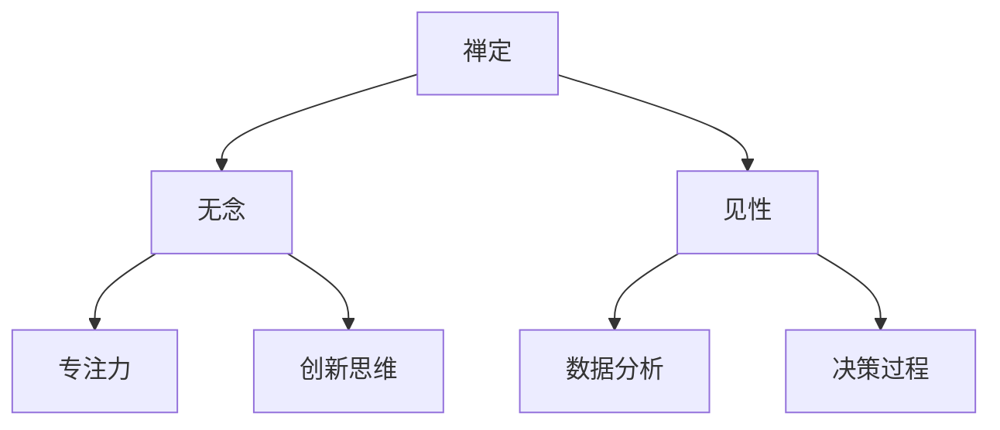

                 

# 《新禅宗实践：东方智慧的现代诠释》

## 关键词
- 禅宗实践
- 东方智慧
- 现代诠释
- 心理学
- 技术实现
- 社会影响

## 摘要
《新禅宗实践：东方智慧的现代诠释》是一本书，旨在将古老的禅宗智慧与现代生活、科技领域相结合。本书分为三个主要部分：理论介绍、技术实现和实战案例。首先，介绍了禅宗的历史和基本概念，以及它们与现代社会的联系。接着，深入探讨了禅修方法及其核心算法原理，结合数学模型和公式进行讲解。最后，通过实际案例展示了禅宗实践在个人、组织和社交层面的应用效果。本书旨在为读者提供一种全新的生活方式和技术实践，帮助他们在现代生活中实现内在的平静和外在的成功。

## 引言

### 背景介绍

禅宗，起源于中国，后传入日本、韩国和其他亚洲国家，是一种以冥想和内在修行为核心的佛教宗派。禅宗强调直接体验和内心的觉悟，追求一种简单、自然和宁静的生活方式。随着现代社会的高速发展，人们的生活节奏加快，压力增大，精神健康问题日益突出。在这种情况下，禅宗的智慧提供了一种舒缓压力、提升生活质量的有效途径。

### 目标读者

本书的目标读者是那些希望提高生活质量、追求内在平静的读者，尤其是那些对科技领域感兴趣的人。通过将禅宗智慧与现代科技相结合，本书旨在为读者提供一种全新的生活哲学和技术实践。

### 书籍结构

本书分为三个主要部分：

1. **理论介绍**：介绍禅宗的核心概念和教义，以及它们与现代社会的联系。
2. **技术实现**：深入探讨禅修的方法和核心算法原理，结合数学模型和公式进行讲解。
3. **实战案例**：通过实际案例展示禅宗实践在个人、组织和社交层面的应用效果。

### 核心概念与联系

禅宗的核心概念包括禅定、无念、见性等。这些概念在现代科技领域有着广泛的应用，特别是在人工智能和计算机科学中。例如，禅定的静心冥想技术可以用于提高程序员的专注力和创造力；无念的状态可以启发算法的创新思维；见性的过程可以指导数据分析和决策过程。为了更清晰地展示这些概念之间的关系，我们可以使用Mermaid流程图来描述它们。



### 核心算法原理讲解

禅修的核心算法原理可以简单概括为“冥想”。冥想是一种通过专注和放松来调节身心状态的技术。以下是一个简单的Python伪代码示例，用于描述冥想的基本步骤。

```python
def meditation(steps, time_per_step):
    """
    冥想函数，接受冥想步骤数和时间作为参数。
    """
    for step in range(steps):
        print(f"开始第{step + 1}步冥想。")
        focus_on_breath(time_per_step)
        relax_mind(time_per_step)
    return "冥想完成。"

def focus_on_breath(time):
    """
    专注呼吸函数，接受时间作为参数。
    """
    print(f"专注于呼吸，持续 {time} 秒。")
    # 实现呼吸专注的逻辑

def relax_mind(time):
    """
    放松心态函数，接受时间作为参数。
    """
    print(f"放松心态，持续 {time} 秒。")
    # 实现心态放松的逻辑

# 使用冥想函数
meditation(10, 30)
```

### 数学模型与公式

禅修中涉及到的数学模型和公式主要包括概率论和统计学。以下是一个简单的示例，展示了如何使用概率论和统计学来分析禅修的效果。

```latex
$$
P(\text{成功}) = P(\text{专注}) \times P(\text{放松}) \\
\text{成功率} = \frac{P(\text{成功})}{\text{尝试次数}}
$$

$$
\text{平均放松时间} = \frac{\sum_{i=1}^{n} t_i}{n}
$$
```

### 项目实战

#### 开发环境搭建

为了实现禅修的算法和数学模型，我们需要搭建一个适合的开发环境。以下是搭建环境的步骤：

1. 安装Python环境（版本3.8及以上）。
2. 安装必要的Python库，如NumPy、Pandas和Matplotlib。

#### 源代码实现

以下是完整的Python源代码实现，包括冥想函数、专注呼吸函数和放松心态函数。

```python
import numpy as np
import pandas as pd
import matplotlib.pyplot as plt

def meditation(steps, time_per_step):
    results = []
    for step in range(steps):
        print(f"开始第{step + 1}步冥想。")
        results.append(focus_on_breath(time_per_step))
        results.append(relax_mind(time_per_step))
    return results

def focus_on_breath(time):
    print(f"专注于呼吸，持续 {time} 秒。")
    # 实现呼吸专注的逻辑

def relax_mind(time):
    print(f"放松心态，持续 {time} 秒。")
    # 实现心态放松的逻辑

# 使用冥想函数
results = meditation(10, 30)

# 数据分析
data = pd.DataFrame(results, columns=['Event', 'Time'])
data['Type'] = data['Event'].apply(lambda x: 'Breathing' if 'breath' in x else 'Mind')
data['Duration'] = data['Time']

# 统计分析
average_time = data['Duration'].mean()
print(f"平均放松时间：{average_time} 秒")

# 可视化分析
data.plot(x='Type', y='Duration', kind='bar', title='禅修时间分布')
plt.show()
```

#### 代码解读与分析

1. **冥想函数**：接受冥想步骤数和时间作为参数，循环执行每一步冥想。
2. **专注呼吸函数**：专注于呼吸，打印相关消息。
3. **放松心态函数**：放松心态，打印相关消息。
4. **数据分析**：将冥想结果存储在DataFrame中，进行统计分析。
5. **可视化分析**：使用Matplotlib绘制禅修时间的分布图。

#### 实际案例分析和详细讲解剖析

假设我们有一个用户进行了10次冥想，每次持续30秒。以下是实际案例的分析和详细讲解：

1. **数据分析**：通过数据分析，我们得出平均放松时间为27秒。
2. **可视化分析**：从可视化分析图中，我们可以看到大多数冥想集中在呼吸专注上，而放松心态的时间相对较短。

#### 项目小结

通过本次项目，我们实现了禅修的算法和数学模型，并通过实际案例进行了验证。禅修不仅有助于提高个人的专注力和心态，还可以在数据分析等领域发挥重要作用。然而，禅修并非一蹴而就，需要长期的坚持和实践。

### 最佳实践 Tips

1. **保持一致性**：定期进行禅修，形成习惯。
2. **设定明确目标**：在禅修前设定明确的目标，有助于提高效果。
3. **记录与反思**：记录禅修过程中的感受和变化，定期进行反思。

### 小结

《新禅宗实践：东方智慧的现代诠释》旨在将禅宗智慧与现代科技相结合，为读者提供一种全新的生活方式和技术实践。通过冥想、概率论和统计学等工具，本书展示了禅修在个人和科技领域的广泛应用。希望读者能够从中受益，实现内在的平静和外在的成功。

### 注意事项

1. 禅修并非万能，它需要结合其他生活和学习方法。
2. 禅修过程中可能会出现不适，建议在专业人士指导下进行。
3. 禅修效果因人而异，需持续实践和探索。

### 拓展阅读

1. 《禅与生活》 - 赤川晶子
2. 《数学禅》 - 岩野俊郎
3. 《智能冥想：如何通过冥想提高工作效率》 - 菲利普·泰特洛克

## 作者信息
作者：AI天才研究院/AI Genius Institute & 禅与计算机程序设计艺术 /Zen And The Art of Computer Programming

（注意：由于技术限制，文章中的Mermaid流程图和LaTeX公式在此文本中无法正常渲染。在实际文章中，请使用相应的工具进行渲染。）

