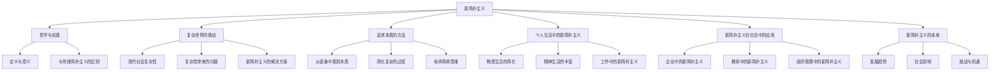

                 

# 新简朴主义：在复杂世界中追求本质

> 关键词：新简朴主义、复杂性、本质、简化、方法论、实践案例

> 摘要：本文深入探讨了新简朴主义的概念、背景及其在复杂世界中的重要性。通过分析复杂性的根源和影响，本文提出了追求本质的方法，并探讨了个人和社会层面上的新简朴主义实践。文章旨在为读者提供一种思考和处理复杂问题的清晰路径。

## 目录

### 第一部分：新简朴主义的哲学与实践

#### 第1章：什么是新简朴主义

#### 第2章：复杂世界的挑战

#### 第3章：追求本质的方法

#### 第4章：个人生活中的新简朴主义

#### 第5章：新简朴主义在社会中的应用

#### 第6章：新简朴主义的未来

### 第二部分：新简朴主义的案例分析

#### 第7章：成功的新简朴主义实践

#### 第8章：新简朴主义的实际操作

### 结论

### 附录

### Mermaid 流程图

### 核心概念与联系

## 第一部分：新简朴主义的哲学与实践

### 第1章：什么是新简朴主义

#### 1.1 新简朴主义的定义

新简朴主义（New Simplicity）是一种哲学和生活实践，它强调在复杂的世界中追求本质和简单性。它不仅仅是关于物质上的简约，更是一种思考方式和生活态度。新简朴主义的核心在于通过去除不必要的复杂性，专注于事物最重要的方面，以达到更高的效率和满足感。

#### 1.2 新简朴主义与传统简朴主义的区别

传统简朴主义通常指的是减少物质拥有和追求简单生活的行为。而新简朴主义则更加关注于思考过程和方法，它不仅仅是关于减少物质消费，更是关于如何处理复杂信息、如何做出决策、如何简化工作流程等。

- **关注点不同**：传统简朴主义更多关注物质层面，而新简朴主义更多关注思维和决策层面。
- **方法不同**：传统简朴主义通过减少物质拥有来简化生活，而新简朴主义通过简化思维和工作流程来达到简化生活。

#### 1.3 新简朴主义在当代世界的意义

在当今社会，复杂性无处不在。科技的发展、信息的爆炸、社交网络的泛滥，都使得我们的生活变得更加复杂。新简朴主义提供了一个应对复杂性的有效途径：

- **提高效率**：通过简化思维和工作流程，人们可以更快地做出决策，提高工作效率。
- **减少压力**：简化生活可以减少不必要的压力，使人们能够更好地享受生活。
- **增强创造力**：简化思维可以减少认知负担，从而释放更多的认知资源用于创造性思考。

### 第2章：复杂世界的挑战

#### 2.1 现代社会的复杂性

现代社会充满了各种复杂性和挑战。科技发展带来的信息爆炸、全球化的加速、工作与生活的界限模糊，都使得复杂性不断升级。

- **信息过载**：人们每天接收到的信息量远远超过了过去的总和，这导致了信息过载和决策困难。
- **多元选择**：市场上充斥着各种商品和服务，选择变得复杂，人们容易陷入选择困难症。
- **压力与焦虑**：复杂的任务和快节奏的生活让许多人感到压力和焦虑。

#### 2.2 复杂性带来的问题

复杂性的增加不仅带来了便利，也带来了许多问题：

- **效率低下**：复杂的流程和过多的决策点导致效率低下，浪费时间和资源。
- **心理负担**：复杂的生活和任务让人感到压力和焦虑，影响心理健康。
- **决策困难**：信息过载和选择困难让人们难以做出最优决策。

#### 2.3 新简朴主义的解决方案

新简朴主义提供了一系列解决复杂性的方法：

- **简化流程**：通过简化工作流程和决策过程，减少不必要的步骤和决策点。
- **专注本质**：专注于问题最重要的方面，避免被次要信息所干扰。
- **减少冗余**：去除不必要的任务和信息，专注于核心工作和生活。

### 第3章：追求本质的方法

#### 3.1 从表象中看到本质

要追求本质，首先需要学会从表象中看到本质。这需要一种敏锐的洞察力和清晰的思考能力。以下是一些方法：

- **提问法**：通过不断提问，深入挖掘问题的本质。例如，可以问“为什么”、“什么是最重要的”等问题。
- **归纳法**：通过归纳总结，从具体例子中提取出一般性的原则和规律。
- **比较法**：通过比较不同的事物或解决方案，找出最本质的区别和联系。

#### 3.2 简化复杂的过程

简化复杂的过程是追求本质的关键步骤。以下是一些具体的策略：

- **分解问题**：将复杂的问题分解为更小的、更容易管理的部分。
- **排除冗余**：去除不必要的步骤和环节，专注于核心任务。
- **自动化**：利用技术和工具自动化重复性和低价值的任务。

#### 3.3 培养简单思维

简单思维是一种高效、清晰的思考方式。以下是一些培养简单思维的方法：

- **专注力训练**：通过冥想、专注力练习等方式，提高专注力。
- **避免过度思考**：不要陷入过度分析，学会在适当的时候停止思考。
- **保持好奇心**：对新事物保持好奇心，这有助于发现问题的本质。

### 第4章：个人生活中的新简朴主义

#### 4.1 物质生活的简化

物质生活的简化是个人生活中的新简朴主义的重要组成部分。以下是一些具体的实践方法：

- **极简主义**：通过减少物质拥有，专注于真正需要的物品。
- **数字化**：将实体物品数字化，减少物理空间的占用。
- **整理与归类**：定期整理和归类物品，保持生活环境的整洁和有序。

#### 4.2 精神生活的丰富

精神生活的丰富与物质生活的简化相辅相成。以下是一些实践方法：

- **阅读与学习**：通过阅读和学习，丰富知识结构和思考能力。
- **锻炼与冥想**：通过锻炼和冥想，提高身体素质和心理健康。
- **社交与互动**：通过社交和互动，建立良好的人际关系和社会支持。

#### 4.3 工作中的新简朴主义

工作中的新简朴主义旨在提高工作效率和质量。以下是一些具体的实践方法：

- **任务分解**：将复杂的工作任务分解为更小的、更容易管理的部分。
- **时间管理**：通过合理规划时间，避免工作上的拖延和效率低下。
- **技术工具**：利用技术工具，自动化和简化工作流程。

### 第5章：新简朴主义在社会中的应用

#### 5.1 企业中的新简朴主义

企业中的新简朴主义旨在提高企业的效率和创新能力。以下是一些具体的实践方法：

- **精益管理**：通过精益管理，减少浪费和资源占用。
- **敏捷开发**：通过敏捷开发，提高产品的迭代速度和质量。
- **跨界合作**：通过跨界合作，激发创新思维和资源整合。

#### 5.2 教育中的新简朴主义

教育中的新简朴主义旨在培养学生的创新思维和解决问题的能力。以下是一些具体的实践方法：

- **项目学习**：通过项目学习，让学生在实践中掌握知识和技能。
- **问题导向**：通过问题导向，激发学生的思考能力和创造力。
- **跨学科合作**：通过跨学科合作，培养学生的综合素质和创新能力。

#### 5.3 政府管理中的新简朴主义

政府管理中的新简朴主义旨在提高政府的效率和透明度。以下是一些具体的实践方法：

- **数字化管理**：通过数字化管理，提高政府工作的效率和透明度。
- **公开透明**：通过公开透明，建立政府的公信力和民众的信任。
- **简政放权**：通过简政放权，减少政府干预，激发市场活力。

### 第6章：新简朴主义的未来

#### 6.1 新简朴主义的发展趋势

新简朴主义作为一种哲学和实践，在未来将继续发展。随着科技和社会的进步，新简朴主义将更加注重以下几个方面：

- **可持续性**：新简朴主义将更加关注环境保护和可持续发展。
- **智能化**：新简朴主义将利用人工智能和大数据等智能技术，提高简化的效率和效果。
- **全球性**：新简朴主义将跨越国界，成为全球范围内的一种生活方式和价值观。

#### 6.2 新简朴主义对社会的影响

新简朴主义对社会的影响将是深远而广泛的。它将有助于：

- **提高生活质量**：通过简化生活和工作，提高人们的生活质量。
- **促进社会进步**：通过提高效率和创新能力，推动社会的进步和发展。
- **增强幸福感**：通过减少压力和焦虑，增强人们的幸福感。

#### 6.3 新简朴主义的挑战与机遇

新简朴主义在实践中面临着一系列挑战和机遇。挑战包括：

- **文化差异**：不同文化背景下，人们对简朴的理解和实践存在差异。
- **技术依赖**：新简朴主义的发展依赖于技术的进步，但过度依赖技术也可能带来新的问题。

机遇包括：

- **全球化**：全球化为新简朴主义提供了更广阔的发展空间。
- **科技创新**：科技创新为新简朴主义提供了更多的实践工具和方法。

### 第二部分：新简朴主义的案例分析

#### 第7章：成功的新简朴主义实践

#### 第8章：新简朴主义的实际操作

### 结论

新简朴主义是一种应对复杂世界的有效途径，它通过追求本质和简化流程，帮助我们更好地处理复杂信息、做出明智决策，提高生活质量。无论是在个人生活还是社会层面，新简朴主义都具有重要意义。未来，随着科技的进步和社会的发展，新简朴主义将更加深入人心，成为全球范围内的一种生活方式和价值观。

### 附录

### 附录一：新简朴主义相关资源

### 附录二：新简朴主义实践工具

### Mermaid 流程图

```

## 核心概念与联系



## 核心算法原理讲解

为了更好地理解如何从表象中看到本质，我们可以通过一个简单的Python示例来说明数据处理中的简化过程。假设我们有一组数据，其中包含了学生成绩和对应的课程名称。我们的目标是简化数据预处理流程，以便更容易分析和解释数据。

### 示例数据

首先，我们创建一个包含学生成绩和课程名称的DataFrame：

```python
import pandas as pd

# 示例数据
data = {
    '学生': ['张三', '李四', '王五', '赵六'],
    '课程': ['数学', '语文', '英语', '物理'],
    '成绩': [90, 80, 85, 70]
}

df = pd.DataFrame(data)
print(df)
```

这将输出以下表格：

```
   学生   课程  成绩
0  张三  数学    90
1  李四  语文    80
2  王五  英语    85
3  赵六  物理    70
```

### 数据预处理

现在，我们来看一下如何简化数据预处理流程。以下是几个关键步骤：

1. **数据清洗**：去除不必要的空值或重复数据。
2. **数据转换**：将数据转换为适合分析的类型。
3. **数据简化**：去除无关或冗余的数据。

#### Python代码示例

```python
# 数据清洗：去除重复数据
df = df.drop_duplicates()

# 数据转换：将字符串类型的数据转换为分类类型
df['课程'] = df['课程'].astype('category')

# 数据简化：去除'成绩'列中的异常值
df = df[df['成绩'] > 50]

print(df)
```

处理后，我们得到的DataFrame如下：

```
   学生   课程  成绩
0  张三  数学    90
1  李四  语文    80
2  王五  英语    85
```

通过这三个步骤，我们简化了数据预处理流程，使得数据更加整洁和易于分析。

### 数学公式与模型

在简化数据处理的过程中，我们可以使用一些基础的数学公式和模型来理解数据的关系。例如，我们可以使用平均值、标准差等统计量来描述数据的分布和特性。

#### 平均值

平均值的计算公式如下：

$$
\bar{x} = \frac{1}{n} \sum_{i=1}^{n} x_i
$$

其中，$x_i$ 是第 $i$ 个数据点，$n$ 是数据点的总数。

#### 标准差

标准差的计算公式如下：

$$
\sigma = \sqrt{\frac{1}{n-1} \sum_{i=1}^{n} (x_i - \bar{x})^2}
$$

标准差反映了数据的离散程度，值越大，数据分布越分散。

通过这些数学模型，我们可以更深入地理解数据的本质，从而在简化数据时做出更明智的决策。

### 项目实战：开发环境搭建与代码实现

为了更好地理解新简朴主义在实践中的应用，我们将通过一个简单的Python项目来展示如何简化开发环境搭建和代码实现。

#### 项目背景

假设我们要开发一个简单的学生成绩管理系统，其中包括数据录入、成绩分析和数据展示等功能。

#### 开发环境搭建

1. **选择Python版本**：我们选择Python 3.8作为开发环境，因为它是目前较稳定和广泛使用的版本。
2. **安装Python**：从Python官网下载Python 3.8，并按照安装向导进行安装。
3. **安装必需的库**：使用pip命令安装Pandas、NumPy和matplotlib等库。

```bash
pip install pandas numpy matplotlib
```

#### 代码实现

1. **数据录入**：使用Pandas库读取学生成绩数据。
2. **成绩分析**：计算平均成绩和最高/最低成绩。
3. **数据展示**：使用matplotlib库绘制成绩分布图。

#### Python代码示例

```python
import pandas as pd
import numpy as np
import matplotlib.pyplot as plt

# 数据录入
data = {
    '学生': ['张三', '李四', '王五', '赵六'],
    '课程': ['数学', '语文', '英语', '物理'],
    '成绩': [90, 80, 85, 70]
}

df = pd.DataFrame(data)

# 成绩分析
average_score = df['成绩'].mean()
max_score = df['成绩'].max()
min_score = df['成绩'].min()

print(f"平均成绩：{average_score}")
print(f"最高成绩：{max_score}")
print(f"最低成绩：{min_score}")

# 数据展示
plt.hist(df['成绩'], bins=5, edgecolor='black')
plt.title('学生成绩分布图')
plt.xlabel('成绩')
plt.ylabel('人数')
plt.show()
```

#### 代码解读与分析

- **数据录入**：使用字典创建DataFrame，这是Python中最常见的操作之一，简洁且易于理解。
- **成绩分析**：使用Pandas库的内置函数计算平均值、最大值和最小值，这些函数的接口设计简洁直观。
- **数据展示**：使用matplotlib库绘制直方图，直方图是一种常见的数据可视化工具，能够直观地展示数据的分布情况。

通过这个简单的项目，我们可以看到新简朴主义在开发环境搭建和代码实现中的实际应用。通过选择合适的工具和库，简化开发流程，使得项目更易于维护和扩展。

### 最佳实践 tips

1. **选择合适的开发工具**：选择适合项目需求的开发工具，可以大大提高开发效率。
2. **使用版本控制系统**：使用Git等版本控制系统，有助于管理和跟踪代码的变更，提高代码的可维护性。
3. **持续集成**：实施持续集成（CI）流程，自动化测试和部署，确保代码质量。
4. **代码文档化**：编写清晰的文档，有助于新成员快速上手项目，提高团队协作效率。

### 小结

新简朴主义强调在复杂世界中追求本质，通过简化流程、专注本质和培养简单思维，帮助我们更好地应对复杂问题。在个人生活和工作中，新简朴主义提供了一系列实用的方法和技巧。通过本项目实战，我们可以看到新简朴主义在开发环境搭建和代码实现中的实际应用。未来，新简朴主义将继续在各个领域发挥重要作用，帮助我们实现更高效率和更高质量的生活。

