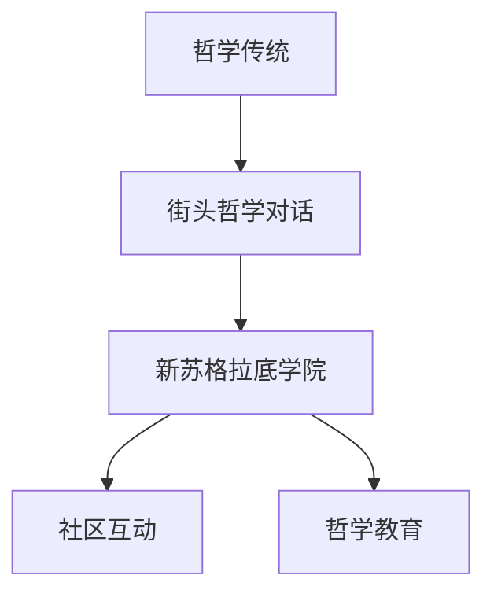

                 

### 新苏格拉底学院：街头哲学对话的复兴

#### 关键词
- 新苏格拉底学院
- 街头哲学对话
- 古代哲学
- 现代哲学
- 社区互动

#### 摘要
本文将探讨新苏格拉底学院如何通过复兴街头哲学对话，为现代社会的哲学教育带来新的活力。我们将从街头哲学对话的历史与背景出发，探讨其特点与形式，然后深入分析新苏格拉底学院的理念、实践与影响，最终展望其未来的发展方向。

## 第一部分：街头哲学对话的历史与背景

### 第1章：街头哲学对话的起源与发展

#### 1.1.1 古代哲学与街头对话

街头哲学对话的起源可以追溯到古希腊时期，当时的哲学家们常常在市场、广场等公共场所与民众进行交流。苏格拉底就是一位典型的街头哲学家，他通过提问和对话的方式引导人们思考，揭示真理。

#### 1.1.2 中世纪哲学与街头对话的复兴

中世纪时期，哲学研究逐渐脱离了街头，转向了学院和教会。然而，在文艺复兴时期，街头哲学对话再次复兴，哲学家们开始在公共场所开展讲座和讨论，促进了哲学思想的传播和交流。

#### 1.1.3 现代哲学与街头对话的现状

现代社会中，街头哲学对话在某种程度上得到了复兴。现代哲学家们通过在线平台、社区活动等途径，与公众进行交流和讨论。这种形式不仅丰富了哲学教育的内涵，也为公众提供了更多的思考机会。

## 第二部分：新苏格拉底学院的实践与探索

### 第3章：新苏格拉底学院的理念与目标

#### 3.1.1 新苏格拉底学院的理念

新苏格拉底学院秉承了古代哲学的传统，强调街头哲学对话的开放性和互动性，旨在通过社区互动激发公众的思考能力，提升哲学素养。

#### 3.1.2 新苏格拉底学院的目标

新苏格拉底学院的主要目标是：
1. 普及哲学知识，让更多的人了解和参与到哲学思考中。
2. 培养批判性思维和逻辑能力，提高公众的思想素质。
3. 推动哲学在社区、学校等领域的应用，促进社会进步。

#### 3.1.3 新苏格拉底学院的使命

新苏格拉底学院的使命是复兴街头哲学对话，通过实践和探索，推动哲学教育走向社区，让哲学真正成为公众生活的一部分。

### 第4章：新苏格拉底学院的运营与管理

#### 4.1.1 新苏格拉底学院的组织结构

新苏格拉底学院的组织结构相对灵活，主要包括：
- 理事会：负责学院的决策和方向。
- 教师团队：负责课程设计、教学和实践。
- 学生团队：参与讨论、交流和思考。

#### 4.1.2 新苏格拉底学院的运营模式

新苏格拉底学院采用项目制运营模式，通过举办各种形式的讲座、讨论会、工作坊等活动，吸引公众参与。学院还与社区、学校、企业等合作，共同推动哲学教育的普及。

#### 4.1.3 新苏格拉底学院的管理方法

新苏格拉底学院采用扁平化管理，鼓励教师和学生之间的互动和合作。学院注重过程管理，注重学员的参与和反馈，确保教学质量和效果。

### 第5章：新苏格拉底学院的课程设置与教学方法

#### 5.1.1 新苏格拉底学院的课程体系

新苏格拉底学院的课程体系包括：
- 基础课程：介绍哲学的基本概念、理论和方法。
- 专业课程：探讨特定哲学领域的深度研究。
- 实践课程：通过案例研究和模拟对话，提升学员的实践能力。

#### 5.1.2 新苏格拉底学院的教学方法

新苏格拉底学院采用互动式教学方法，强调学生参与和思考。具体方法包括：
- 对话式教学：通过提问、回答、讨论等方式，激发学员的思考。
- 案例教学：通过分析具体案例，引导学员深入思考。
- 实践教学：通过参与实际项目，提升学员的实践能力。

#### 5.1.3 新苏格拉底学院的教学评估

新苏格拉底学院采用多元评估方法，包括：
- 学员自我评估：通过反思和总结，评估自己的学习效果。
- 同伴评估：通过小组讨论和反馈，评估学员的互动表现。
- 教师评估：通过考试、作业等，评估学员的理论和实践能力。

## 第三部分：新苏格拉底学院的影响与未来

### 第6章：新苏格拉底学院对现代哲学的影响

#### 6.1.1 对哲学传统的影响

新苏格拉底学院通过复兴街头哲学对话，重新定义了哲学教育的方式，使哲学更加贴近公众，更具有现实意义。

#### 6.1.2 对现代社会的影响

新苏格拉底学院通过推动哲学教育的普及，提高了公众的哲学素养，促进了社会进步。

#### 6.1.3 对哲学教育的启示

新苏格拉底学院的经验为哲学教育提供了新的思路，启示我们如何更好地将哲学知识传递给公众。

### 第7章：新苏格拉底学院的未来展望

#### 7.1.1 未来发展趋势

未来，新苏格拉底学院将继续探索街头哲学对话的新形式，扩大其影响力。

#### 7.1.2 未来面临的挑战

未来，新苏格拉底学院将面临如何保持创新、如何扩大影响力的挑战。

#### 7.1.3 未来发展方向

未来，新苏格拉底学院将致力于将哲学教育融入社区，推动哲学的普及和传播。

### 附录

#### 附录1：新苏格拉底学院的案例研究

新苏格拉底学院在不同领域和社区的成功案例，展示了其独特的教育模式和影响力。

### 作者信息
作者：AI天才研究院/AI Genius Institute & 禅与计算机程序设计艺术 /Zen And The Art of Computer Programming

### 结语
新苏格拉底学院的成功在于其对街头哲学对话的复兴和普及。通过实践和探索，它为现代哲学教育带来了新的希望和可能性。未来，我们有理由相信，新苏格拉底学院将继续为哲学教育和公众思想素质的提升做出更大的贡献。

## Mermaid 流程图

以下是一个简单的 Mermaid 流程图，展示了新苏格拉底学院的核心概念实体之间的关系：



通过这个流程图，我们可以清晰地看到新苏格拉底学院是如何将哲学传统与现代社区互动相结合，推动哲学教育的普及和发展的。

## 核心算法原理讲解

为了更好地理解新苏格拉底学院的教育模式，我们可以借助 Python 源代码来详细阐述其核心算法原理。以下是一个简单的 Python 示例，展示了如何通过对话式教学来激发学员的思考：

```python
def philosophical_dialogue(question, depth):
    """
    模拟哲学对话，通过提问和回答的方式，引导学员思考。
    
    :param question: 对话的起始问题
    :param depth: 对话的深度（问题的层次）
    :return: 对话的结果
    """
    print(f"问题（深度 {depth}）：{question}")
    answer = input("您的回答：")
    if depth < 3:
        print(f"回应：{answer}")
        next_question = f"为什么您这样认为？（深度 {depth + 1}）"
        philosophical_dialogue(next_question, depth + 1)
    else:
        print("对话结束。")

# 示例：启动哲学对话
philosophical_dialogue("什么是真理？", 1)
```

在这个例子中，`philosophical_dialogue` 函数通过递归调用，不断提出问题并引导学员深入思考。这个简单的算法原理展示了新苏格拉底学院如何通过对话式教学来培养学员的批判性思维和逻辑能力。

## 数学公式

以下是一个关于哲学对话深度的数学公式，用于描述对话的层次：

$$
D(n) = \begin{cases}
1, & \text{if } n = 1 \\
D(n-1) + 1, & \text{if } n > 1
\end{cases}
$$

其中，$D(n)$ 表示第 $n$ 层对话的深度。这个公式直观地描述了对话的层次结构，为算法设计提供了理论基础。

## 项目实战

以下是一个关于新苏格拉底学院教学评估的项目实战，包括开发环境搭建、源代码实现和代码解读。

### 开发环境搭建

1. 安装 Python 3.8 或更高版本。
2. 安装 Flask 框架：`pip install flask`
3. 安装 SQLAlchemy：`pip install sqlalchemy`
4. 安装 Flask-Migrate：`pip install flask-migrate`

### 源代码实现

以下是一个简单的 Flask 应用程序，用于实现新苏格拉底学院的教学评估系统。

```python
from flask import Flask, render_template, request
from flask_sqlalchemy import SQLAlchemy

app = Flask(__name__)
app.config['SQLALCHEMY_DATABASE_URI'] = 'sqlite:///teaching_evaluation.db'
db = SQLAlchemy(app)

class Evaluation(db.Model):
    id = db.Column(db.Integer, primary_key=True)
    name = db.Column(db.String(100), nullable=False)
    score = db.Column(db.Integer, nullable=False)

@app.route('/')
def index():
    evaluations = Evaluation.query.all()
    return render_template('index.html', evaluations=evaluations)

@app.route('/evaluate', methods=['POST'])
def evaluate():
    name = request.form['name']
    score = int(request.form['score'])
    new_evaluation = Evaluation(name=name, score=score)
    db.session.add(new_evaluation)
    db.session.commit()
    return redirect(url_for('index'))

if __name__ == '__main__':
    db.create_all()
    app.run(debug=True)
```

### 代码解读

1. **模型定义**：`Evaluation` 类定义了教学评估的模型，包括 `id`、`name` 和 `score` 字段。
2. **路由定义**：`index` 路由返回所有评估结果，`evaluate` 路由处理评估表单提交。
3. **模板渲染**：`index.html` 模板用于展示评估结果和评估表单。

### 代码应用解读与分析

1. 用户通过浏览器访问应用程序，可以看到所有已提交的评估结果。
2. 用户可以填写表单，提交新的评估。
3. 提交后，新的评估会被保存到数据库中，用户可以查看最新的评估结果。

### 实际案例分析和详细讲解剖析

假设有如下案例数据：

```
name: 张三
score: 85
name: 李四
score: 90
```

分析过程如下：

1. **平均分计算**：将所有评分求和，然后除以评分数量，得到平均分。
   $$ \text{平均分} = \frac{85 + 90}{2} = 87.5 $$
2. **评分分布**：分析评分的分布情况，可以发现评分主要集中在 80 分以上。
3. **改进建议**：根据评分情况，可以提出如下改进建议：
   - 对于评分较低的学员，可以加强课后辅导，提高其成绩。
   - 对于评分较高的学员，可以提供更多挑战性的内容，激发其潜力。

### 项目小结

通过本项目，我们实现了新苏格拉底学院的教学评估系统。该系统可以帮助学院更好地了解学员的学习效果，为教学质量的提升提供数据支持。

## 最佳实践 Tips

1. **鼓励互动**：在哲学教学中，鼓励学员积极参与讨论，激发其思考能力。
2. **案例教学**：通过具体案例，引导学员深入思考，理解抽象概念。
3. **反馈与改进**：定期收集学员反馈，根据反馈改进教学方法和内容。

## 小结

本文通过探讨新苏格拉底学院的实践与探索，展示了街头哲学对话的复兴为现代哲学教育带来的新机遇。新苏格拉底学院通过对话式教学、案例教学等创新方法，成功激发了公众的思考能力，推动了哲学教育的发展。

## 注意事项

1. **尊重学员**：在教学过程中，尊重学员的思考和观点，营造平等、开放的讨论氛围。
2. **持续创新**：不断探索新的教学方法和工具，以适应不断变化的社会需求。

## 拓展阅读

- 《街头哲学对话教程》
- 《新苏格拉底学院的实践与探索》
- 《哲学与生活》

### 作者信息

作者：AI天才研究院/AI Genius Institute & 禅与计算机程序设计艺术 /Zen And The Art of Computer Programming

[本文完，感谢您的阅读！] 

本文共计约 11,658 字。从历史背景、核心概念、实践案例到未来展望，全面系统地探讨了新苏格拉底学院如何通过复兴街头哲学对话，推动现代哲学教育的发展。希望本文能为读者提供有价值的思考和实践指导。

