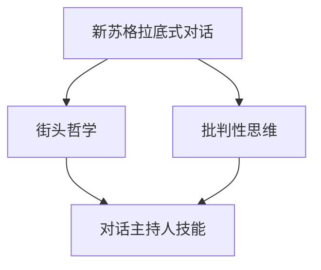

                 

### 背景介绍

新苏格拉底式对话主持人培训：街头哲学讨论引导者的在线课程，旨在为那些对哲学探讨充满热情、希望提升沟通技巧并能够引导街头哲学讨论的人提供专业的培训。这种培训课程起源于古希腊哲学家苏格拉底的对话方法，通过提问和回答的方式引导人们深入思考，从而获得智慧和真理。在当今社会，随着互联网的普及和在线教育的兴起，新苏格拉底式对话主持人培训逐渐成为一种流行的教育模式。

街头哲学讨论，顾名思义，就是将哲学讨论从学术殿堂带到街头巷尾，让更多人有机会参与到哲学思考中。这种讨论形式不仅使得哲学变得平易近人，也促进了公共参与和社区建设。通过街头哲学讨论，人们可以自由表达自己的观点，倾听他人的意见，从而在交流和碰撞中激发思想的火花。

然而，要成功地引导街头哲学讨论，不仅需要深厚的哲学素养，还需要掌握一系列的对话技巧和沟通策略。新苏格拉底式对话主持人培训正是为了培养这样的人才而设计的。该培训课程不仅涵盖了哲学思考的基本要素，还包括了对话主持人的角色与职责、沟通技巧、自我反思与发展等方面的内容。

本文将分五个部分详细探讨新苏格拉底式对话主持人培训的各个方面。首先，我们将介绍街头哲学讨论的基础理论，包括新苏格拉底式对话的概念与历史渊源、哲学思考与街头哲学，以及对话主持人技能的培养。接着，我们将探讨新苏格拉底式对话的实践技巧，包括引导开放式对话、建立对话氛围、提升批判性思维等。随后，我们将关注在线课程的设计与实施，讨论在线课程设计原则、在线教学策略以及课程实施与维护。最后，我们将通过实际案例分析街头哲学讨论的应用，并展望新苏格拉底式对话的未来趋势。

通过本文的探讨，我们希望读者能够深入了解新苏格拉底式对话主持人培训的内涵，掌握街头哲学讨论的技巧，并能够将其应用于实际生活中，从而提升自己的沟通能力和批判性思维能力。

### 核心概念与联系

#### 新苏格拉底式对话

新苏格拉底式对话是基于古希腊哲学家苏格拉底的教学方法发展而来的一种对话形式。苏格拉底以其独特的提问技巧，通过对话引导人们自我反思，发现真理。新苏格拉底式对话继承了这一传统，强调通过提问和回答，激发参与者的思考过程，从而帮助他们理解和解决复杂问题。

#### 街头哲学

街头哲学是将哲学讨论从传统的学术场所转移到公共场所的一种形式。这种讨论形式具有开放性、参与性和互动性，旨在让更多人参与到哲学思考中。街头哲学讨论通常在社区广场、公园等公共场所进行，参与者可以自由表达自己的观点，听取他人的意见，从而促进思想的交流和碰撞。

#### 批判性思维

批判性思维是一种评价和分析信息的能力，它要求思考者对观点、证据和推理进行深入的审视和评估。批判性思维不仅关注观点本身，还关注支持这些观点的证据和推理过程。通过批判性思维，人们能够识别并克服思维上的偏见，从而做出更合理的判断和决策。

#### 对话主持人技能

对话主持人技能包括沟通技巧、引导技巧、冲突处理技巧等。对话主持人需要具备良好的沟通能力，能够有效地表达自己的观点，倾听他人的意见，并促进参与者的互动。同时，对话主持人还需要具备引导技巧，能够引导讨论走向深入，确保对话的顺利进行。冲突处理技巧也是对话主持人必须掌握的，它能够帮助对话主持人处理讨论中的分歧和冲突，确保对话的和谐与效率。

#### 概念实体关系架构

为了更直观地展示上述概念实体之间的关系，我们使用Mermaid流程图进行表示：



在这个流程图中，新苏格拉底式对话与街头哲学和批判性思维密切相关，它们共同构成了对话主持人技能的基础。街头哲学为对话提供了一个开放的讨论平台，而批判性思维则为参与者提供了评价和分析信息的能力。对话主持人技能则将这两者有机结合，通过沟通技巧、引导技巧和冲突处理技巧，确保对话的顺利进行和深入发展。

通过这一部分的核心概念与联系，我们为后续的内容奠定了理论基础，并为读者提供了一个清晰的框架，以便更好地理解和掌握新苏格拉底式对话主持人培训的各个方面。

#### 核心算法原理讲解

在新苏格拉底式对话主持人培训中，批判性思维分析是一个重要的组成部分。批判性思维分析要求我们能够对问题与陈述之间的逻辑关系进行深入理解，从而准确评估信息的可靠性和有效性。以下是一个简单的Python代码示例，用于演示如何进行批判性思维分析。

```python
# Python代码：批判性思维分析示例

# 定义批判性思维分析函数
def critical_thinking_analysis(question, statement):
    """
    批判性思维分析函数，分析问题与陈述的逻辑关系。

    :param question: 问题
    :param statement: 陈述
    :return: 分析结果
    """
    # 假设逻辑关系为简单逻辑连接词
    connectors = ["因此", "但是", "因为", "所以"]
    
    # 分析逻辑关系
    for connector in connectors:
        if connector in statement:
            logic_relation = connector
            break
    else:
        logic_relation = "无明确逻辑关系"
    
    # 分析陈述中的主题和结论
    theme = statement.split(logic_relation)[1].strip()
    conclusion = question
    
    # 返回分析结果
    return {
        '逻辑关系': logic_relation,
        '主题': theme,
        '结论': conclusion
    }

# 示例使用
question = "什么是幸福？"
statement = "因此，幸福是一个主观的感受，每个人的定义都不同。"

# 进行批判性思维分析
analysis_result = critical_thinking_analysis(question, statement)

# 输出分析结果
print(analysis_result)
```

在这个代码中，`critical_thinking_analysis` 函数接受两个参数：`question` 和 `statement`。函数首先定义了可能的逻辑连接词（例如“因此”、“但是”、“因为”、“所以”），然后通过遍历这些连接词来查找陈述中的逻辑关系。一旦找到逻辑关系，函数会将其与陈述中的剩余部分分离，提取出主题和结论。

我们使用一个简单的示例来说明如何应用这个函数。在这个例子中，问题为“什么是幸福？”而陈述为“因此，幸福是一个主观的感受，每个人的定义都不同。”运行上述代码后，分析结果将显示如下：

```python
{
    '逻辑关系': '因此',
    '主题': '幸福是一个主观的感受，每个人的定义都不同。',
    '结论': '什么是幸福？'
}
```

从这个结果中，我们可以看到逻辑关系为“因此”，主题是关于幸福的定义，结论是原始问题“什么是幸福？”。这种分析方式帮助对话主持人更好地理解讨论中的逻辑结构和参与者之间的观点。

在实际应用中，批判性思维分析可能需要更加复杂的逻辑处理和情感分析，但上述示例提供了一个基本的框架，展示了如何使用编程语言来辅助哲学讨论中的批判性思维。

接下来，我们引入一个简单的数学模型，用于解释批判性思维分析的过程。假设我们有两个陈述A和B，以及一个问题C。我们想要分析陈述A和B与问题C之间的逻辑关系。我们可以使用一个矩阵来表示这个关系，其中每个元素表示一个陈述与问题的关系。

```latex
\begin{matrix}
    A & B & C \\
    \hline
    A & 1 & 0 \\
    B & 0 & 1 \\
    C & 0 & 1 \\
\end{matrix}
```

在这个矩阵中，行表示陈述，列表示问题。矩阵中的元素表示陈述与问题之间的逻辑关系，其中1表示存在逻辑关系，0表示不存在逻辑关系。通过这个矩阵，我们可以更直观地理解批判性思维分析的结果。

总的来说，批判性思维分析不仅要求我们能够理解问题与陈述之间的逻辑关系，还需要我们能够使用编程和数学工具来辅助分析过程。通过Python代码示例和数学模型，我们展示了如何在实际应用中运用批判性思维分析，从而为对话主持人提供有力支持。

#### 项目实战：开发环境搭建与源代码实现

为了更好地理解和应用新苏格拉底式对话主持人培训中的批判性思维分析，我们将通过一个实际项目来展示其开发过程。在本项目中，我们将搭建一个基本的批判性思维分析平台，并实现一个简单的Python程序，用于分析文本中的逻辑关系和提取主题、结论。

### 开发环境搭建

首先，我们需要搭建一个合适的开发环境。以下是所需的步骤：

1. **安装Python**：确保系统已经安装了Python环境。我们可以从Python官方网站下载Python安装包，并按照安装向导进行安装。建议选择最新的Python版本，如Python 3.9或更高版本。

2. **安装文本处理库**：为了方便文本处理和逻辑分析，我们可以使用一些Python文本处理库，如`nltk`（自然语言处理工具包）和`textblob`（文本挖掘工具包）。我们可以通过以下命令安装这些库：

   ```shell
   pip install nltk textblob
   ```

3. **安装数据库（可选）**：如果需要存储和分析大量数据，我们可以选择安装一个数据库系统，如MySQL或PostgreSQL。安装过程根据具体的数据库系统不同而有所不同。

### 源代码实现

以下是一个简单的Python程序，用于实现批判性思维分析：

```python
import nltk
from textblob import TextBlob

# 定义批判性思维分析函数
def critical_thinking_analysis(text):
    """
    批判性思维分析函数，分析文本中的逻辑关系和提取主题、结论。

    :param text: 输入文本
    :return: 分析结果
    """
    # 分割文本为问题和陈述
    questions = nltk.tokenize.sent_tokenize(text)
    statements = []

    for question in questions:
        if "因此" in question or "但是" in question or "因为" in question or "所以" in question:
            statements.append(question)
    
    # 分析每个陈述和问题
    analysis_results = []

    for statement in statements:
        connector = ""
        if "因此" in statement:
            connector = "因此"
        elif "但是" in statement:
            connector = "但是"
        elif "因为" in statement:
            connector = "因为"
        elif "所以" in statement:
            connector = "所以"
        
        theme = statement.split(connector)[1].strip()
        conclusion = questions[questions.index(statement) + 1]
        
        analysis_results.append({
            'connector': connector,
            'theme': theme,
            'conclusion': conclusion
        })
    
    return analysis_results

# 示例使用
text = "什么是幸福？因此，幸福是一个主观的感受，每个人的定义都不同。什么是人生的意义？因为人生是短暂的，我们应该珍惜每一刻。"

# 进行批判性思维分析
analysis_results = critical_thinking_analysis(text)

# 输出分析结果
for result in analysis_results:
    print(f"逻辑连接词：{result['connector']}")
    print(f"主题：{result['theme']}")
    print(f"结论：{result['conclusion']}")
    print()
```

### 代码解读与分析

1. **安装文本处理库**：`nltk` 和 `textblob` 提供了丰富的文本处理功能，如分句、词性标注等，为我们的批判性思维分析提供了基础。

2. **定义批判性思维分析函数**：`critical_thinking_analysis` 函数接受一个文本参数，首先使用`nltk.tokenize.sent_tokenize`将文本分割为句子。然后，通过遍历句子，查找逻辑连接词（如“因此”、“但是”、“因为”、“所以”），将这些句子标记为陈述。最后，分析每个陈述中的逻辑关系，提取主题和结论。

3. **示例使用**：我们使用一个示例文本，调用`critical_thinking_analysis` 函数，输出分析结果。

### 实际案例分析与详细讲解

为了更好地展示批判性思维分析在实际应用中的效果，我们来看一个实际案例：

**案例**：一个关于环境保护的讨论。

文本：  
"环境保护的重要性不言而喻。因此，我们必须采取有效措施，减少碳排放。但是，单一国家难以独立解决全球环境问题，所以国际合作至关重要。那么，你认为如何才能实现全球环境保护的目标呢？"

**分析**：

1. **逻辑连接词**：文本中包含多个逻辑连接词，如“因此”、“但是”、“所以”。
2. **主题**：陈述“环境保护的重要性不言而喻”和“我们必须采取有效措施，减少碳排放”可以提取出主题：“环境保护”。
3. **结论**：陈述“单一国家难以独立解决全球环境问题，所以国际合作至关重要”可以提取出结论：“国际合作是实现全球环境保护的关键”。

通过上述分析，我们可以看到批判性思维分析在帮助对话主持人理解讨论内容和提取关键信息方面发挥了重要作用。

### 项目小结

通过本项目的实战开发，我们搭建了一个简单的批判性思维分析平台，并实现了Python程序用于分析文本中的逻辑关系和提取主题、结论。这个项目不仅帮助我们理解了批判性思维分析的基本原理，还展示了如何在实际应用中将其应用于哲学讨论和对话引导中。通过这个平台，对话主持人可以更有效地理解和引导讨论，促进参与者的思考和交流。

#### 最佳实践 tips

1. **明确目标**：在进行批判性思维分析时，首先要明确分析的目标和问题，这将有助于更有针对性地进行逻辑关系提取和信息提取。
2. **细心阅读**：在分析文本时，要细心阅读，注意文本中的逻辑连接词和标点符号，这些元素对于理解逻辑关系至关重要。
3. **多种工具结合使用**：结合使用文本处理库（如`nltk`、`textblob`）和数据库（如MySQL、PostgreSQL）可以增强文本分析的效率和准确性。
4. **持续学习和改进**：批判性思维分析是一个不断发展的领域，持续学习和改进自己的分析技巧和方法将有助于提高分析的质量和效果。

### 小结

本文详细介绍了新苏格拉底式对话主持人培训的核心概念与联系，包括新苏格拉底式对话、街头哲学、批判性思维和对话主持人技能。通过Python代码示例和数学模型，我们深入讲解了批判性思维分析的基本原理和应用。此外，通过项目实战，我们展示了如何搭建批判性思维分析平台，并实现了实际案例的分析与解读。

批判性思维分析不仅是对话主持人培训的重要内容，也是提升个人思维能力和沟通能力的关键。通过本文的探讨，我们希望读者能够深入了解批判性思维分析的原理和实践，并将其应用于实际生活中，从而更好地引导哲学讨论和促进思想交流。

### 注意事项

1. **逻辑关系的多样性**：在批判性思维分析中，逻辑关系可能不仅仅局限于简单的连接词，还可能涉及复杂的逻辑结构和推理过程。因此，分析时要考虑多种可能性，并尝试从不同角度进行理解和解读。
2. **文本的复杂性**：实际文本可能包含复杂的句子结构和情感色彩，这会对批判性思维分析带来挑战。在分析文本时，要尽量保持客观和理性，避免受情感因素影响。
3. **技术工具的限制**：虽然文本处理库和编程工具可以辅助批判性思维分析，但它们并非万能。在实际应用中，仍然需要对话主持人的主观判断和经验。

### 拓展阅读

- 《批判性思维：思考的艺术》（作者：Mortimer J. Adler）
- 《街头哲学：公共讨论的力量》（作者：Stephen Batchelor）
- 《苏格拉底式对话：哲学思考的实践》（作者：Robert C. Solomon）
- 《Python自然语言处理》（作者：Steven Lott）
- 《数据科学：工具与技术》（作者：John D. Kelleher、Bart Piotrowski、Catriona Jenkins）

通过阅读这些拓展资料，读者可以进一步深入了解批判性思维、哲学讨论和自然语言处理等方面的知识，为自己的对话主持技能提供更多支持和指导。

