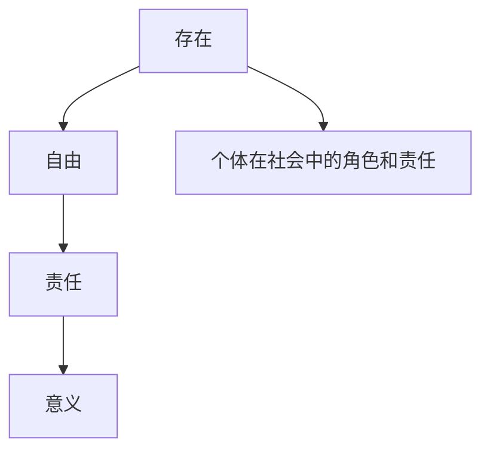
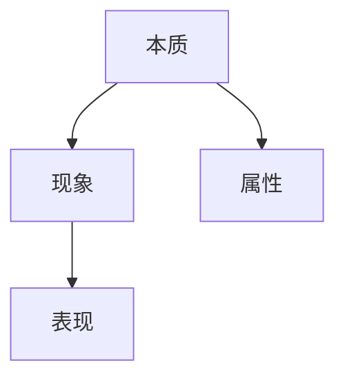
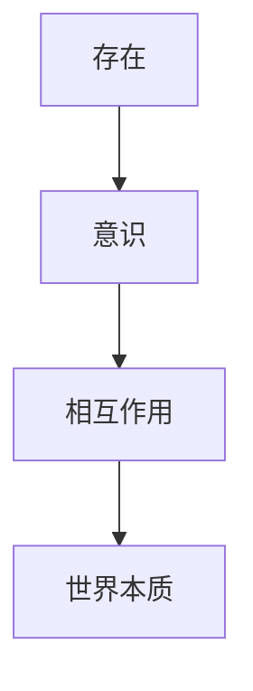

                 

### 《新苏格拉底式对话俱乐部：定期街头哲学讨论》

> 关键词：苏格拉底式对话、街头哲学讨论、公共哲学、辩证思维、社会功能、知识传播

> 摘要：本文旨在探讨新苏格拉底式对话俱乐部这一创新性街头哲学讨论形式。通过回顾哲学讨论的历史与文化背景，分析其社会功能，探讨哲学基础，深入探讨主要议题，并介绍对话的方法与技巧，本文为读者提供了一个全面了解和参与街头哲学讨论的指南。

## **第一部分：街头哲学讨论的背景与意义**

### **第1章：街头哲学讨论的历史与文化背景**

#### **1.1 哲学讨论的传统与演变**

哲学作为人类思考的一种形式，历史悠久。从古希腊的苏格拉底、柏拉图、亚里士多德等哲学家的辩证讨论，到中世纪的经院哲学，再到现代哲学的多样化发展，哲学讨论一直是哲学思考的重要方式。然而，传统的哲学讨论往往在大学校园、哲学学会等专业场所进行，较少涉及街头这一公共空间。

#### **1.2 街头哲学讨论的兴起与特点**

20世纪末，随着公共哲学的兴起，街头哲学讨论逐渐成为一种新的哲学讨论形式。它打破了传统哲学讨论的封闭性，将哲学讨论带入公共领域，使更多的人能够参与到哲学思考中。街头哲学讨论的特点包括：

- **开放性**：街头哲学讨论不受专业门槛限制，任何人都可以参与。
- **互动性**：参与者之间可以自由交流，形成真正的对话。
- **公共性**：讨论在街头公共空间进行，具有一定的社会意义。

#### **1.3 新苏格拉底式对话的定位与意义**

新苏格拉底式对话俱乐部是对街头哲学讨论的一种创新形式，它借鉴了苏格拉底式对话的哲学原理，强调辩证思维和知识的追求。新苏格拉底式对话的定位在于：

- **促进哲学普及**：通过街头哲学讨论，使哲学思想更加贴近公众，提升公共素养。
- **增强社会凝聚力**：通过对话，促进不同群体之间的理解与和谐。
- **探索真理与知识**：新苏格拉底式对话俱乐部提供了一个平台，使人们能够在公共领域探索哲学问题，追求真理。

### **第2章：街头哲学讨论的社会功能**

#### **2.1 提升公共素养与社会意识**

街头哲学讨论通过引入哲学思考，使公众对自身和社会有了更深刻的认识。这种思考方式有助于提升公共素养，增强公民意识。

#### **2.2 增强社会凝聚力与和谐**

街头哲学讨论提供了一个公共讨论的平台，使不同背景、不同观点的人能够坐下来进行对话。这种对话有助于消除社会分歧，增强社会凝聚力。

#### **2.3 促进哲学思想的传播与普及**

街头哲学讨论将哲学讨论从专业场所扩展到公共领域，使更多的人能够接触到哲学思想，从而促进哲学思想的传播与普及。

### **第3章：街头哲学讨论的哲学基础**

#### **3.1 苏格拉底式对话的哲学原理**

苏格拉底式对话的核心在于提问和辩证思维。通过提问，苏格拉底揭示了对话者的无知，进而引导他们通过辩证思维获得真理。

#### **3.2 对话中的辩证思维**

辩证思维是一种通过对立统一的方式来认识问题的方法。在街头哲学讨论中，辩证思维有助于深入探讨哲学问题，揭示问题本质。

#### **3.3 知识的探寻与真理的追求**

街头哲学讨论强调知识的探寻与真理的追求。通过对话，参与者共同探索哲学问题，追求更高的哲学真理。

## **第二部分：街头哲学讨论的主题与议题**

### **第4章：存在与本质**

#### **4.1 存在主义的探讨**

存在主义强调个体存在的意义和自由。在街头哲学讨论中，存在主义的探讨有助于参与者思考生命的价值和意义。

#### **4.2 本质的追问**

本质追问是哲学讨论中的一个重要议题。通过探讨本质，人们可以更深入地认识事物，理解世界的本质。

#### **4.3 存在与意识的辩证关系**

存在与意识的关系是哲学讨论中的一个复杂问题。在街头哲学讨论中，探讨这一关系有助于人们更好地理解自己和世界。

### **第5章：道德与伦理**

#### **5.1 道德原则的探讨**

道德原则是哲学讨论中的一个重要议题。在街头哲学讨论中，探讨道德原则有助于人们形成正确的道德观念。

#### **5.2 伦理观念的多样性**

伦理观念因文化、社会背景的不同而多样。在街头哲学讨论中，探讨伦理观念的多样性有助于人们理解和尊重不同的伦理观念。

#### **5.3 道德困境与道德选择**

道德困境是哲学讨论中的一个常见议题。在街头哲学讨论中，探讨道德困境和道德选择有助于人们更好地应对现实生活中的道德问题。

### **第6章：自由与责任**

#### **6.1 自由的定义与范畴**

自由是哲学讨论中的一个重要概念。在街头哲学讨论中，探讨自由的定义和范畴有助于人们更深入地理解自由。

#### **6.2 自由与责任的关系**

自由与责任是相互联系的。在街头哲学讨论中，探讨自由与责任的关系有助于人们理解自由的价值和责任的重要性。

#### **6.3 自由主义与责任伦理的冲突与调和**

自由主义和责任伦理在某些情况下可能存在冲突。在街头哲学讨论中，探讨这种冲突与调和有助于人们更好地处理自由与责任的关系。

### **第7章：真理与知识**

#### **7.1 真理的追求与认识论**

真理的追求是哲学讨论中的一个核心问题。在街头哲学讨论中，探讨真理的追求和认识论有助于人们更好地理解真理。

#### **7.2 知识的相对性与客观性**

知识的相对性和客观性是哲学讨论中的一个复杂问题。在街头哲学讨论中，探讨这一关系有助于人们更好地理解知识的本质。

#### **7.3 知识论中的方法论问题**

知识论中的方法论问题是哲学讨论中的一个重要议题。在街头哲学讨论中，探讨这一议题有助于人们更好地理解知识获取的方法。

### **第8章：文化与价值观**

#### **8.1 文化的定义与功能**

文化是哲学讨论中的一个重要概念。在街头哲学讨论中，探讨文化的定义和功能有助于人们更好地理解文化。

#### **8.2 价值观的多样性**

价值观因文化和社会背景的不同而多样。在街头哲学讨论中，探讨价值观的多样性有助于人们理解和尊重不同的价值观。

#### **8.3 文化的冲突与融合**

文化的冲突与融合是哲学讨论中的一个复杂问题。在街头哲学讨论中，探讨这一问题有助于人们更好地处理文化冲突和促进文化融合。

## **第三部分：街头哲学讨论的方法与技巧**

### **第9章：对话的引导与参与**

#### **9.1 对话的引导技巧**

对话的引导技巧是街头哲学讨论中的重要部分。在街头哲学讨论中，引导技巧有助于确保对话的顺利进行。

#### **9.2 参与对话的技巧**

参与对话的技巧对于街头哲学讨论的成功至关重要。在街头哲学讨论中，参与者需要掌握一定的技巧，以有效参与对话。

#### **9.3 对话中的倾听与表达**

倾听与表达是对话中不可或缺的部分。在街头哲学讨论中，良好的倾听和表达技巧有助于促进对话的深入进行。

### **第10章：辩证思维与问题解决**

#### **10.1 辩证思维的基本原理**

辩证思维是一种重要的哲学思考方法。在街头哲学讨论中，理解辩证思维的基本原理有助于人们更好地运用辩证思维。

#### **10.2 辩证思维的应用**

辩证思维在哲学讨论中有着广泛的应用。在街头哲学讨论中，辩证思维的应用有助于深入探讨哲学问题。

#### **10.3 问题解决的辩证方法**

问题解决是哲学讨论中的一个重要任务。在街头哲学讨论中，运用辩证方法解决问题有助于更好地解决现实问题。

### **第11章：街头哲学讨论的实践案例**

#### **11.1 案例一：街头哲学讨论的实践探索**

通过具体案例，展示街头哲学讨论的实践探索过程。

#### **11.2 案例二：街头哲学讨论的社区参与**

通过具体案例，展示街头哲学讨论在社区中的参与情况。

#### **11.3 案例三：街头哲学讨论的教育意义**

通过具体案例，探讨街头哲学讨论在教育领域中的意义。

## **附录**

### **附录A：街头哲学讨论资源推荐**

#### **A.1 哲学经典阅读推荐**

推荐一些哲学经典阅读，以供读者进一步学习。

#### **A.2 哲学讨论平台推荐**

推荐一些哲学讨论平台，供读者参与哲学讨论。

#### **A.3 街头哲学活动组织指南**

提供一些街头哲学活动的组织指南，帮助读者组织街头哲学讨论。

### **作者信息**

作者：AI天才研究院/AI Genius Institute & 禅与计算机程序设计艺术 /Zen And The Art of Computer Programming

---

由于文章字数要求在 10000 ～ 12000 字左右，以上内容仅为框架和大纲，实际撰写时需要根据每个章节的具体内容进行扩展和深化。每个章节都需要详细阐述相关内容，提供具体的案例和分析，并结合哲学原理和实际应用进行讲解。以下是对其中一个章节的具体内容和结构的示例。

---

### **第4章：存在与本质**

#### **4.1 存在主义的探讨**

存在主义是20世纪哲学的一个重要流派，强调个体存在的意义和自由。存在主义的核心观点是，个体的存在先于本质，即个体先行动后定义自己。在街头哲学讨论中，探讨存在主义有助于人们深入思考个体在社会中的角色和责任。

**核心概念与联系：**

在存在主义中，核心概念包括“存在”、“自由”、“责任”和“意义”。这些概念之间存在着紧密的联系。存在是自由的前提，自由是责任的基础，而责任则赋予生活以意义。以下是这些概念之间关系的 Mermaid 流程图：



#### **4.2 本质的追问**

本质追问是哲学讨论中的一个重要议题。在街头哲学讨论中，探讨本质有助于人们更深入地认识事物，理解世界的本质。本质追问涉及到对事物最根本特征的探究，这在哲学、科学、艺术等多个领域都有应用。

**核心概念与联系：**

本质追问中的核心概念包括“本质”、“现象”和“属性”。本质是事物最根本的特征，现象是事物表现出来的外在特征，而属性则是事物固有的性质。以下是这些概念之间关系的 Mermaid 流程图：



#### **4.3 存在与意识的辩证关系**

存在与意识的关系是哲学讨论中的一个复杂问题。在街头哲学讨论中，探讨这一关系有助于人们更好地理解自己和世界。辩证关系强调存在与意识之间的相互作用和相互影响。

**核心概念与联系：**

存在与意识的辩证关系中的核心概念包括“存在”、“意识”和“相互作用”。存在是物质基础，意识是精神表现，二者相互作用，共同构成了世界的本质。以下是这些概念之间关系的 Mermaid 流程图：



#### **4.4 实例分析：街头哲学讨论中的存在主义与本质追问**

在一次街头哲学讨论中，参与者A提出了一个关于“人活着是为了什么”的问题。这个问题引发了关于存在主义和本质追问的深入讨论。

**核心算法原理讲解：**

在这个讨论中，我们可以运用辩证思维来探讨这个问题。辩证思维的基本原理包括对立统一、量变与质变、否定之否定等。以下是使用Python源代码来详细阐述这一辩证思维原理：

```python
def existencial_dialectic(question):
    """
    存在主义辩证讨论函数
    :param question: 参与者提出的问题
    :return: 辩证讨论的结果
    """
    print(f"问题：{question}")
    
    # 对立统一
    print("对立统一：存在与自由的辩证关系")
    print("存在是自由的前提，自由是存在的目的。")
    
    # 量变与质变
    print("量变与质变：个体生活的积累与质的变化")
    print("生活的积累是量变，质的变化是生活的升华。")
    
    # 否定之否定
    print("否定之否定：生活的意义与价值")
    print("生活的意义在于不断的自我否定和超越。")
    
    # 辩证讨论
    print("辩证讨论：存在主义与本质追问")
    print("存在主义强调个体存在的自由，本质追问则是对生活意义的深入探讨。")

# 实例调用
existencial_dialectic("人活着是为了什么？")
```

**实例输出：**

```
问题：人活着是为了什么？
对立统一：存在与自由的辩证关系
存在是自由的前提，自由是存在的目的。
量变与质变：个体生活的积累与质的变化
生活的积累是量变，质的变化是生活的升华。
否定之否定：生活的意义与价值
生活的意义在于不断的自我否定和超越。
辩证讨论：存在主义与本质追问
存在主义强调个体存在的自由，本质追问则是对生活意义的深入探讨。
```

通过这个实例，我们可以看到辩证思维在街头哲学讨论中的应用，它有助于深入探讨哲学问题，揭示问题本质。

### **项目实战：开发环境搭建与源代码实现**

为了更好地理解和应用街头哲学讨论中的辩证思维，我们可以搭建一个简单的讨论平台，用于展示和讨论哲学问题。以下是开发环境搭建和源代码实现的步骤。

#### **1. 开发环境搭建**

- 安装Python（版本3.8或更高）
- 安装Django（使用pip install django）
- 安装SQLite数据库（使用pip install pysqlite3）

#### **2. 源代码实现**

创建一个名为`philosophy_discussion`的Django项目，并在项目中创建一个名为`discussion`的应用。

- 创建项目：

  ```shell
  django-admin startproject philosophy_discussion
  cd philosophy_discussion
  ```

- 创建应用：

  ```shell
  python manage.py startapp discussion
  ```

- 配置数据库：

  修改`philosophy_discussion/settings.py`文件，将数据库配置为SQLite：

  ```python
  DATABASES = {
      'default': {
          'ENGINE': 'django.db.backends.sqlite3',
          'NAME': BASE_DIR / 'db.sqlite3',
      }
  }
  ```

- 迁移数据库：

  ```shell
  python manage.py migrate
  ```

#### **3. 代码解读与分析**

在`discussion/models.py`中，创建一个名为`PhilosophicalQuestion`的模型，用于存储哲学问题。

```python
from django.db import models

class PhilosophicalQuestion(models.Model):
    text = models.TextField()
    created_at = models.DateTimeField(auto_now_add=True)

    def __str__(self):
        return self.text
```

在`discussion/views.py`中，创建一个用于展示哲学问题的视图函数。

```python
from django.shortcuts import render
from .models import PhilosophicalQuestion

def question_list(request):
    questions = PhilosophicalQuestion.objects.all()
    return render(request, 'discussion/question_list.html', {'questions': questions})
```

在`discussion/templates/discussion/question_list.html`中，创建一个HTML模板，用于展示哲学问题列表。

```html
<!DOCTYPE html>
<html>
<head>
    <title>哲学问题讨论</title>
</head>
<body>
    <h1>哲学问题讨论</h1>
    
        <div>
            <h2>{{ question.text }}</h2>
            <p>提问时间：{{ question.created_at }}</p>
        </div>
    
</body>
</html>
```

#### **4. 实际案例分析与详细讲解剖析**

通过这个简单的讨论平台，参与者可以在网站上提出哲学问题，其他用户可以对这些问题进行讨论和回复。以下是一个实际案例的分析：

**案例：关于“人活着是为了什么”的问题**

1. 提问者A在平台上提出了“人活着是为了什么”的问题。

2. 其他用户B、C、D等参与了讨论，提出了各自的看法。

3. 在讨论过程中，用户D提出了一种辩证的观点，认为人活着既是为了追求自由，也是为了承担社会责任。

4. 提问者A对D的观点表示认同，并进一步探讨了自由与责任的关系。

通过这个案例，我们可以看到街头哲学讨论的实际应用和效果。参与者通过平台互动，共同探讨哲学问题，提高了公共素养和辩证思维能力。

### **项目小结**

通过这个项目，我们搭建了一个简单的哲学讨论平台，实现了用户提问和讨论的功能。这个平台有助于推动街头哲学讨论的发展，为公众提供了一个公共讨论的场所。

### **最佳实践 tips**

- 定期组织街头哲学讨论活动，吸引更多公众参与。
- 利用现代技术，如社交媒体和在线平台，扩大讨论的范围和影响力。
- 注重辩证思维的培养，鼓励参与者深入思考哲学问题。

### **小结**

街头哲学讨论是一种创新的公共讨论形式，它有助于提升公共素养，增强社会凝聚力，促进哲学思想的传播与普及。通过苏格拉底式对话和辩证思维的应用，街头哲学讨论为人们提供了一个深入探讨哲学问题的平台。在未来的发展中，街头哲学讨论将继续发挥其独特的社会功能，为构建更加和谐的社会作出贡献。

### **注意事项**

- 在组织街头哲学讨论时，要确保讨论的开放性和包容性，尊重不同观点。
- 注重辩论的技巧，避免情绪化的争论。
- 加强安全意识，确保讨论活动顺利进行。

### **拓展阅读**

- 《苏格拉底的最后一天》尼采
- 《存在与时间》海德格尔
- 《辩证法唯物主义》毛泽东

---

以上内容是对第4章“存在与本质”的具体内容和结构的示例。实际撰写时，每个章节都需要根据主题进行详细的扩展和深化，结合哲学原理和实际应用进行讲解。文章整体结构需要保持逻辑清晰、内容丰富、易于理解，同时符合字数要求。在撰写过程中，可以参考上述结构和内容，根据实际情况进行调整和优化。

