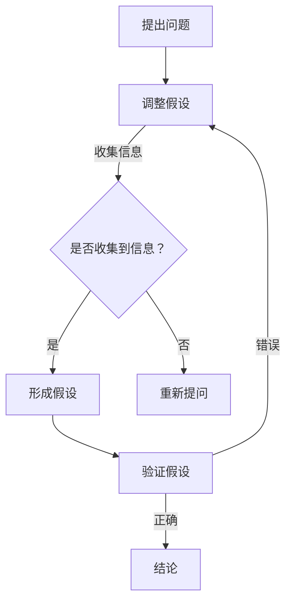

                 

### 新苏格拉底式对话俱乐部：定期街头哲学讨论活动

在当今快速发展的数字时代，哲学的讨论和思考显得尤为重要。正如计算机科学和人工智能领域需要持续的探讨与创新，哲学也需要在一个开放的平台上得到传播和深入。因此，我们提出了“新苏格拉底式对话俱乐部：定期街头哲学讨论活动”这一概念，旨在通过一种新颖的交流方式，激发人们对哲学的兴趣，促进思想的碰撞与成长。

#### 关键词
- 苏格拉底式对话
- 哲学讨论
- 街头活动
- 思想交流
- 社区参与

#### 摘要
本文探讨了“新苏格拉底式对话俱乐部：定期街头哲学讨论活动”的背景、目标和具体实施方法。通过对苏格拉底式对话的历史和理论基础的回顾，本文阐述了这种对话方式在现代社会的价值和应用。同时，本文还详细介绍了街头哲学讨论活动的组织流程、实践案例以及面临的挑战和未来发展方向。通过这些探讨，我们希望为读者提供一个新的思考平台，鼓励大家积极参与哲学讨论，共同促进个人和社会的进步。

### 第1章：苏格拉底式对话的起源与历史

苏格拉底式对话，又称为苏格拉底方法，是古希腊哲学家苏格拉底（Socrates）创立的一种哲学探讨方式。它以提问和回答的形式，通过对话的方式追求真理和智慧。

#### 1.1 苏格拉底式对话的概念

苏格拉底式对话的核心在于通过提问引导对话者自己发现问题的答案，而不是直接给出答案。这种对话方式强调通过对话来揭示知识的本质，发现真理。其特点包括：

1. **提问引导**：通过一系列有针对性的提问，引导对话者自我反思和深入思考。
2. **辩证法**：通过辩证法的方式，逐步揭示问题的本质，从而得出更深刻的见解。
3. **自我发现**：通过对话，帮助对话者自我发现知识，而不是依赖外部权威。

#### 1.2 苏格拉底式对话的历史背景

苏格拉底式对话起源于古希腊，在当时的雅典，哲学讨论是一种常见的社交活动。苏格拉底以其独特的教学方式，赢得了广泛的声誉。他的哲学讨论活动不仅限于课堂上，还包括街头、广场等公共场合。苏格拉底认为，哲学应该是一种公众的事业，而不是仅仅属于少数人的学问。

#### 1.3 苏格拉底式对话的特点与价值

苏格拉底式对话的特点在于其开放性和互动性，这种对话方式具有以下几个方面的价值：

1. **启发思考**：通过提问和回答，激发对话者的思考，促进对问题的深入理解。
2. **知识共享**：在对话过程中，知识和见解得以分享，有助于知识的传播和普及。
3. **自我提升**：通过自我发现和反思，对话者能够提升自己的认知水平和思维能力。

苏格拉底式对话不仅是一种哲学探讨方式，也是一种有效的思想交流方式，它为现代社会提供了一个开放、互动的平台，让我们能够更深入地探讨和思考生活中的问题。接下来，我们将进一步探讨苏格拉底式对话的理论基础。

## 第2章：苏格拉底式对话的理论基础

苏格拉底式对话作为哲学探讨的重要方式，其理论基础涵盖了知识、伦理、人性和社会等多个方面。这些理论不仅构成了苏格拉底式对话的基本框架，也为其在现代社会的应用提供了深刻的启示。

### 2.1 知识与真理

在苏格拉底式对话中，知识和真理是核心概念。苏格拉底认为，知识是一种通过对话和思考获得的内在能力，而真理则是宇宙的绝对真理，是可以通过对话发现的。

#### 2.1.1 知识的定义

知识在哲学中通常被定义为对事物的正确认识和理解。苏格拉底提出了“无知即罪恶”的观点，认为只有通过不断地思考和对话，才能获得真正的知识。他强调，知识是一种通过自我发现和自我完善的过程。

#### 2.1.2 真理的探索

苏格拉底式对话的目标之一是寻找真理。真理被认为是客观存在的，可以通过理性思考和对话来揭示。苏格拉底使用辩证法，通过提问和回答，逐步引导对话者发现真理。

### 2.2 伦理与道德

伦理和道德是苏格拉底式对话中的重要组成部分。苏格拉底认为，哲学不仅仅是思考宇宙和自然，更应该关注人类的行为和道德。

#### 2.2.1 道德哲学的基本概念

道德哲学涉及道德原则、价值观和行为规范。苏格拉底强调道德的重要性，他认为，一个有道德的人才能过上真正幸福的生活。

#### 2.2.2 苏格拉底式对话中的道德思考

在苏格拉底式对话中，道德思考是一个重要的环节。通过对话，参与者可以探讨道德原则和价值观，从而更好地理解道德和伦理问题。

### 2.3 人性与社会

苏格拉底式对话不仅关注知识和道德，还涉及人性和社会问题。

#### 2.3.1 苏格拉底式对话与人性的理解

苏格拉底认为，人性本善，但需要通过教育和对话来发掘和培养。他强调，对话可以帮助人们更好地理解自己的本性，从而实现个人成长。

#### 2.3.2 社会问题与苏格拉底式对话

在现代社会，苏格拉底式对话被广泛应用于解决社会问题。通过对话，人们可以探讨社会问题，寻找解决方案，促进社会和谐。

综上所述，苏格拉底式对话的理论基础涵盖了知识、伦理、人性和社会等多个方面。这些理论不仅为苏格拉底式对话提供了深刻的启示，也为其在现代社会的应用提供了理论支持。

### 2.1 知识与真理

在苏格拉底式对话中，知识和真理是核心概念。苏格拉底认为，知识是一种通过对话和思考获得的内在能力，而真理则是宇宙的绝对真理，是可以通过对话发现的。

#### 2.1.1 知识的定义

知识在哲学中通常被定义为对事物的正确认识和理解。苏格拉底提出了“无知即罪恶”的观点，认为只有通过不断地思考和对话，才能获得真正的知识。他强调，知识是一种通过自我发现和自我完善的过程。

#### 2.1.2 真理的探索

苏格拉底式对话的目标之一是寻找真理。真理被认为是客观存在的，可以通过理性思考和对话来揭示。苏格拉底使用辩证法，通过提问和回答，逐步引导对话者发现真理。

#### 2.1.3 知识与真理的关系

在苏格拉底式对话中，知识与真理是紧密相连的。知识是发现真理的基础，而真理则是知识的最终目标。通过对话，参与者可以不断地深化对知识的理解，从而更接近真理。

### 2.2 伦理与道德

伦理和道德是苏格拉底式对话中的重要组成部分。苏格拉底认为，哲学不仅仅是思考宇宙和自然，更应该关注人类的行为和道德。

#### 2.2.1 道德哲学的基本概念

道德哲学涉及道德原则、价值观和行为规范。苏格拉底强调道德的重要性，他认为，一个有道德的人才能过上真正幸福的生活。

#### 2.2.2 苏格拉底式对话中的道德思考

在苏格拉底式对话中，道德思考是一个重要的环节。通过对话，参与者可以探讨道德原则和价值观，从而更好地理解道德和伦理问题。

#### 2.2.3 道德与知识的关系

苏格拉底认为，道德与知识是紧密相连的。只有具备知识，才能做出正确的道德决策。通过对话，人们可以不断地提升道德修养，从而更好地适应社会。

### 2.3 人性与社会

苏格拉底式对话不仅关注知识和道德，还涉及人性和社会问题。

#### 2.3.1 苏格拉底式对话与人性的理解

苏格拉底认为，人性本善，但需要通过教育和对话来发掘和培养。他强调，对话可以帮助人们更好地理解自己的本性，从而实现个人成长。

#### 2.3.2 社会问题与苏格拉底式对话

在现代社会，苏格拉底式对话被广泛应用于解决社会问题。通过对话，人们可以探讨社会问题，寻找解决方案，促进社会和谐。

#### 2.3.3 人性与社会的关系

苏格拉底认为，人性与社会是相互影响的。通过对话，人们可以更好地理解社会问题，从而改善社会。同时，社会的进步也可以促进人性的发展。

综上所述，苏格拉底式对话的理论基础涵盖了知识、伦理、人性和社会等多个方面。这些理论不仅为苏格拉底式对话提供了深刻的启示，也为其在现代社会的应用提供了理论支持。

### 2.4 苏格拉底式对话的逻辑架构

苏格拉底式对话是一种深刻的思维工具，其逻辑架构体现在提问与回答的交互过程中。为了更清晰地理解这种对话方式的运作，我们可以使用Mermaid流程图来展示其基本框架。

以下是一个简单的Mermaid流程图示例：



这个流程图展示了苏格拉底式对话的基本步骤：

1. **提出问题（A）**：对话开始，提出一个需要探讨的问题。
2. **分析问题（B）**：对问题进行初步分析，理解问题的核心。
3. **收集信息（C）**：通过提问和回答，收集相关信息，以支持或反驳假设。
4. **形成假设（D）**：根据收集到的信息，形成初步的假设。
5. **验证假设（F）**：通过进一步的提问和回答，验证假设的正确性。
6. **结论（G）**：如果假设被验证为正确，得出结论；否则，返回步骤2，调整假设。

这种逻辑架构不仅适用于哲学讨论，也可以用于解决生活中的各种问题。通过这种方法，参与者可以在对话中不断地提出问题、收集信息、形成假设、验证假设，最终得出结论。这种循环式的逻辑流程有助于确保对话的深度和广度，从而更好地发现问题的本质。

### 2.5 核心算法原理讲解

苏格拉底式对话的核心在于其提问和回答的过程，这一过程可以用一种称为“辩证法”的算法来描述。辩证法是一种通过逻辑推理来揭示事物本质的方法，其基本原理包括：

1. **提问**：通过一系列有针对性的提问，引导对话者自我反思和深入思考。
2. **回答**：对话者根据提问进行回答，展示自己的思考过程。
3. **反驳**：对回答进行质疑和反驳，以揭示回答中的逻辑漏洞。
4. **修正**：在质疑和反驳的基础上，对话者修正自己的回答。

以下是一个简单的Python代码示例，展示了如何使用辩证法进行对话：

```python
def ask_question(question):
    return input(question)

def answer_question(question):
    return input(f"{question} (Yes/No)")

def refute_answer(answer):
    if answer.lower() == "yes":
        return "No"
    else:
        return "Yes"

def socratic_dialog():
    question = ask_question("Do you think knowledge is power?")
    answer = answer_question(question)
    
    while answer.lower() != "yes" and answer.lower() != "no":
        answer = answer_question("Please answer Yes or No.")
    
    if answer.lower() == "yes":
        print("So, you agree that knowledge is a source of power.")
    else:
        print("So, you disagree with the idea that knowledge is a source of power.")
    
    # Further questions and discussions can be added here
    
socratic_dialog()
```

在这个示例中，我们首先提出了一个问题“你认为知识是力量吗？”，然后根据回答进行进一步的讨论。通过这种方式，我们可以模拟苏格拉底式对话的过程，引导对话者深入思考。

#### 数学模型和公式

苏格拉底式对话中涉及的一些关键概念可以用数学模型和公式来描述，例如：

1. **知识的获取**：可以使用概率论来描述知识的获取过程，公式为：
   $$ P(A|B) = \frac{P(B|A) \cdot P(A)}{P(B)} $$
   其中，\( P(A|B) \) 表示在已知 \( B \) 的情况下，\( A \) 的概率。

2. **辩证法的推理**：可以使用逻辑运算符来描述辩证法的推理过程，公式为：
   $$ \neg (A \land B) = (\neg A) \lor (\neg B) $$
   这表示“非 \( A \) 且 \( B \)”等价于“\( A \) 的否定或 \( B \) 的否定”。

通过这些数学模型和公式，我们可以更精确地描述苏格拉底式对话的运作机制，从而更好地理解和应用这种方法。

#### 举例说明

为了更好地理解苏格拉底式对话，我们可以通过一个具体的案例来讲解：

**案例：探讨“创新是否是社会进步的关键因素”**

1. **提出问题**：Do you think innovation is a key factor for social progress?
2. **初步回答**：Yes, I believe that innovation drives social progress.
3. **反驳**：So, do you think all innovations are beneficial for society?
4. **修正回答**：Well, not all innovations are beneficial. Some can have negative impacts.
5. **进一步提问**：Can you give an example of an innovation that has had a negative impact on society?
6. **回答**：Yes, the industrial revolution led to significant pollution and worker exploitation.
7. **结论**：While innovation can drive social progress, it is important to carefully consider its potential impacts.

通过这个案例，我们可以看到苏格拉底式对话如何通过提问和回答，逐步揭示问题的本质，从而得出更深入的结论。

#### 数学公式

在苏格拉底式对话中，数学公式可以帮助我们更精确地描述和解释一些概念和过程。以下是一些常用的数学公式：

1. **条件概率**：
   $$ P(A|B) = \frac{P(B|A) \cdot P(A)}{P(B)} $$
   这个公式描述了在已知事件 \( B \) 发生的情况下，事件 \( A \) 发生的概率。

2. **逻辑运算**：
   $$ \neg (A \land B) = (\neg A) \lor (\neg B) $$
   这个公式描述了逻辑非操作的结果，即“非 \( A \) 且 \( B \)”等价于“\( A \) 的否定或 \( B \) 的否定”。

3. **因果关系的建模**：
   $$ P(A \land B) = P(A) \cdot P(B|A) $$
   这个公式描述了事件 \( A \) 和事件 \( B \) 同时发生的概率，可以用来分析因果关系。

通过这些数学公式，我们可以更精确地描述和解释苏格拉底式对话中的概念和过程，从而更好地理解这种方法。

### 3.1 对话的引导与技巧

苏格拉底式对话的成功不仅依赖于对话的内容，还依赖于对话的引导和技巧。以下是一些关键的引导技巧：

#### 3.1.1 如何开始一场对话

1. **选择合适的时间和地点**：选择一个安静、舒适的环境，以便参与者能够集中精力进行讨论。
2. **准备开场白**：以一个引人入胜的问题或陈述作为开场，以激发参与者的兴趣。
3. **引入主题**：简要介绍对话的主题，确保所有参与者对讨论的内容有清晰的理解。

#### 3.1.2 对话中的沟通技巧

1. **倾听**：认真倾听对方的观点，不打断对方，确保每个人都有机会发言。
2. **提问**：使用开放性问题，鼓励参与者深入思考并分享他们的见解。
3. **澄清**：在必要时，提问以澄清对方的观点，确保对话的准确性。

### 3.2 社区中的苏格拉底式对话

社区中的苏格拉底式对话可以作为一种有效的交流方式，促进社区成员之间的互动和思考。以下是一些具体的实施方法：

#### 3.2.1 活动主题的选择

1. **时事热点**：选择当前社会关注的热点话题，如气候变化、科技发展等。
2. **文化多样性**：探讨不同文化之间的差异和共通点，增进理解和尊重。
3. **社会问题**：选择一些社会问题，如贫困、不平等，以激发参与者的思考。

#### 3.2.2 活动场地的选择与布置

1. **室内场地**：选择一个宽敞的会议室或教室，配备必要的音响和投影设备。
2. **室外场地**：选择一个安静、舒适的公共场所，如公园或广场。
3. **布置**：确保场地清洁、整齐，准备好所需的讨论材料，如白板、便签纸等。

### 3.3 活动中的注意事项

1. **尊重多样性**：确保所有参与者的观点和意见都得到尊重，避免争议和冲突。
2. **时间管理**：合理安排时间，确保每个话题都能得到充分的讨论。
3. **记录与反馈**：记录活动的关键点和参与者的反馈，以不断改进活动的质量。

### 3.4 社区对话的实际案例

以下是一个实际案例，展示了如何在社区中组织一次苏格拉底式对话：

**案例：讨论“科技如何影响我们的生活”**

1. **活动准备**：选择一个公园作为活动场地，准备白板、便签纸和马克笔。
2. **开场白**：“大家好，今天我们将探讨科技如何影响我们的生活。请大家自由发言，分享你们的见解。”
3. **讨论过程**：参与者围绕主题进行讨论，提出问题、分享观点，并互相提问和澄清。
4. **总结反馈**：活动结束后，主持人总结讨论的关键点，并收集参与者的反馈，以改进未来的活动。

这个案例展示了如何通过苏格拉底式对话，促进社区成员之间的互动和思考，从而增进对科技影响的理解。

### 3.5 教育中的苏格拉底式对话

苏格拉底式对话在教育中的应用可以极大地提升学生的批判性思维和沟通技巧。以下是一些具体的应用实例：

#### 3.5.1 教学中的苏格拉底式对话

1. **课堂讨论**：教师可以提出一个开放性的问题，鼓励学生进行讨论，例如“什么是成功？”。
2. **案例研究**：通过案例研究，教师可以引导学生分析案例，提出问题并探讨解决方案。

#### 3.5.2 学习小组的苏格拉底式对话

1. **学习小组**：学生可以分成小组，围绕一个共同的话题进行讨论，例如“人工智能的未来”。
2. **角色扮演**：学生可以扮演不同的角色，例如科学家、政策制定者等，以不同的视角探讨问题。

#### 3.5.3 教师培训

1. **教师培训**：教师可以通过参与苏格拉底式对话，提升自己的批判性思维和沟通技巧。
2. **案例分析**：教师可以分析成功和失败的苏格拉底式对话案例，以改进自己的教学方式。

### 3.6 苏格拉底式对话在学校中的实践

以下是一个在学校中实践苏格拉底式对话的具体案例：

**案例：学校哲学俱乐部**

1. **活动安排**：每周五下午，学校哲学俱乐部在图书馆举行一次苏格拉底式对话活动。
2. **主题选择**：“讨论道德与行为准则”、“探讨自由与责任的平衡”等。
3. **参与方式**：学生自愿报名参加，每次活动由一位学生主持，引导讨论。
4. **反馈与改进**：活动结束后，主持人收集参与者的反馈，以不断改进活动的质量和效果。

通过这个案例，学校哲学俱乐部不仅提供了一个平台，让学生能够自由地探讨哲学问题，还促进了他们的批判性思维和沟通能力的发展。

### 4.1 对话中的难题与困惑

在苏格拉底式对话中，参与者可能会遇到各种难题和困惑，以下是一些常见的问题：

#### 4.1.1 难题一：真理的可信度

在对话中，参与者可能会对某个观点的真实性产生怀疑。例如，当一个人提出“科技进步带来的是好处还是坏处？”这个问题时，其他参与者可能会怀疑这个观点是否真正准确。解决这个问题的方法是：

1. **提供证据**：支持者可以提供相关的数据、案例和研究，以证明观点的真实性。
2. **质疑与反驳**：质疑者可以提出反对意见，通过辩论来揭示观点中的逻辑漏洞。
3. **求同存异**：在无法达成共识的情况下，可以暂时保留意见，继续探讨其他话题。

#### 4.1.2 难题二：个人观点与集体意见的冲突

在对话中，个人观点和集体意见之间可能会产生冲突。例如，一个人可能认为“社交媒体是负面影响的来源”，而其他人则认为“社交媒体促进了信息的传播和交流”。解决这个问题的方法是：

1. **开放心态**：保持开放的心态，认真倾听不同的观点，避免过早下结论。
2. **对话引导**：主持人可以引导对话，确保每个人都有机会表达观点，并促进不同观点的碰撞。
3. **寻求共识**：在讨论中，尝试找到共同点，以达成共识。

#### 4.1.3 难题三：时间与效率

苏格拉底式对话通常需要较长时间，可能会影响对话的效率。例如，当讨论一个复杂问题时，参与者可能会花费大量时间在细节上，而忽略了整体。解决这个问题的方法是：

1. **时间管理**：在活动开始时，明确讨论的时间限制，确保每个话题都能得到充分的讨论。
2. **聚焦关键问题**：在讨论中，主持人可以引导参与者聚焦关键问题，避免过度讨论无关细节。
3. **分阶段讨论**：将复杂问题分解成多个阶段，逐步讨论，以确保讨论的深度和广度。

通过解决这些难题，苏格拉底式对话可以更有效地进行，从而更好地促进思想的碰撞和成长。

### 4.2 苏格拉底式对话的发展趋势

随着社交媒体和信息技术的快速发展，苏格拉底式对话也在不断演变，以适应现代社会的需求。以下是一些关键的趋势：

#### 4.2.1 社交媒体对苏格拉底式对话的影响

1. **信息传播**：社交媒体为苏格拉底式对话提供了一个广阔的平台，使更多的人能够参与讨论。
2. **观点多样性**：社交媒体上的讨论涵盖了各种观点和意见，促进了不同声音的碰撞和融合。
3. **实时互动**：社交媒体允许实时互动，使参与者可以立即回应和反驳，提高了讨论的效率。

#### 4.2.2 苏格拉底式对话的未来方向

1. **跨学科融合**：苏格拉底式对话可以与心理学、教育学、社会学等领域相结合，以更全面地探讨问题。
2. **人工智能辅助**：利用人工智能技术，可以为苏格拉底式对话提供数据分析、观点推荐等功能，提高对话的质量。
3. **虚拟现实应用**：通过虚拟现实技术，参与者可以在一个虚拟环境中进行苏格拉底式对话，提供更加沉浸式的体验。

### 4.3 社交媒体中的苏格拉底式对话实践

社交媒体平台如微博、Twitter和Facebook已经成为苏格拉底式对话的新阵地。以下是一些具体的实践方法：

1. **话题标签**：使用话题标签（如#哲学讨论、#思想碰撞）来组织讨论，吸引感兴趣的参与者。
2. **定期活动**：定期举办线上讨论活动，例如每周一晚上的哲学讨论会，以保持讨论的持续性和深度。
3. **互动与反馈**：鼓励参与者积极互动，及时回复和反馈，以提高讨论的质量和参与度。

通过这些实践方法，社交媒体平台可以成为苏格拉底式对话的重要场所，促进思想的碰撞和成长。

### 5.1 活动策划与准备

要成功举办一次街头哲学讨论活动，策划与准备是关键环节。以下是一些具体的步骤和方法：

#### 5.1.1 活动主题的选择

1. **热点话题**：选择当前社会关注的热点话题，如气候变化、人工智能等，以吸引更多的参与者。
2. **文化多样性**：选择能够体现文化多样性的话题，如不同文化背景下的道德观念、艺术欣赏等。
3. **实际意义**：选择具有实际意义的话题，如社会问题、教育改革等，以激发参与者的思考和讨论。

#### 5.1.2 活动场地的选择与布置

1. **公共场所**：选择一个公共场所，如公园、广场等，以增加活动的开放性和参与度。
2. **环境布置**：在活动场地布置必要的设施，如椅子、桌子、白板等，以提供舒适的讨论环境。
3. **设备准备**：准备好音响、投影仪等设备，以确保活动的顺利进行。

#### 5.1.3 活动物资的准备

1. **讨论材料**：准备相关的讨论材料，如书籍、论文、资料等，以供参与者参考。
2. **宣传材料**：制作宣传海报、传单等，以提前宣传和吸引参与者。
3. **其他物资**：如饮用水、零食等，以提供参与者舒适的活动体验。

### 5.2 活动流程与注意事项

活动的流程和注意事项对于活动的顺利进行至关重要。以下是一些具体的细节：

#### 5.2.1 活动流程的安排

1. **开场**：主持人进行开场白，介绍活动主题和目的，引导参与者进入讨论状态。
2. **讨论**：参与者自由发言，提出观点和问题，进行讨论。
3. **总结**：主持人对讨论的关键点和结论进行总结，提出后续行动建议。
4. **反馈**：收集参与者的反馈，以便后续活动的改进。

#### 5.2.2 活动中的注意事项

1. **尊重多样**：确保所有参与者的观点和意见都得到尊重，避免争议和冲突。
2. **时间管理**：合理安排时间，确保每个话题都能得到充分的讨论。
3. **互动与引导**：主持人要积极引导讨论，确保讨论的深度和广度，避免跑题。
4. **记录与反馈**：记录活动的关键点和参与者的反馈，以不断改进活动的质量。

通过这些策划与准备，街头哲学讨论活动可以更有效地进行，促进参与者之间的思想碰撞和交流。

### 5.3 活动反馈与改进

在活动结束后，及时收集反馈并进行分析是改进活动质量的关键步骤。以下是一些具体的方法：

#### 5.3.1 活动效果的评估

1. **问卷调查**：通过问卷调查，了解参与者的满意度、讨论效果和对活动主题的理解程度。
2. **访谈**：对部分参与者进行访谈，深入了解他们的参与体验和反馈。
3. **数据分析**：分析问卷调查的数据，识别活动的优点和不足。

#### 5.3.2 活动反馈的收集与利用

1. **反馈渠道**：设置多种反馈渠道，如线上问卷、邮件、电话等，方便参与者提供反馈。
2. **整理反馈**：将收集到的反馈进行整理，分类归纳，找出主要问题和改进方向。
3. **利用反馈**：将反馈应用于后续活动的策划和执行中，如调整活动主题、改进场地布置、优化流程安排等。

通过这些反馈收集与分析的方法，可以不断优化活动质量，提高参与者的满意度。

### 6.1 案例一：关于自由与责任的讨论

**案例背景**：

在一个炎热的夏日傍晚，我们组织了一次街头哲学讨论活动，主题是“自由与责任”。活动地点选在市中心的一个公园，周围是行人和游客，提供了一个开放且具有吸引力的环境。

**活动流程**：

1. **开场白**：主持人简要介绍了活动主题，强调了自由与责任在现代社会中的重要性，并邀请参与者加入讨论。
2. **自由发言**：参与者纷纷发表了自己的看法，讨论自由与责任的平衡点。有些人认为，自由是人的基本权利，但同时也必须承担相应的责任；另一些人则强调，责任是对自由的限制，应当在法律和道德的框架内追求自由。
3. **提问与回应**：主持人引导参与者之间进行提问和回应，进一步探讨自由与责任之间的关系。例如，有人提问：“如果一个行为在道德和法律上都是错误的，我们是否还应该追求自由？”这一问题引发了热烈的讨论，参与者从不同角度分析了这一问题。
4. **总结**：主持人对讨论进行了总结，强调了自由与责任的相互依赖性，并提出了如何在现实生活中平衡这两者的建议。

**案例分析**：

这次讨论活动取得了显著的效果。参与者不仅深入思考了自由与责任这一哲学问题，还通过互动和辩论，形成了对这一问题的更全面的理解。特别是，通过提问和回应环节，参与者学会了如何从不同角度分析问题，提高了批判性思维和沟通能力。

### 6.2 案例二：关于幸福与追求的讨论

**案例背景**：

在一个月光皎洁的夜晚，我们再次组织了一次街头哲学讨论活动，主题是“幸福与追求”。活动地点选在市郊的一个宁静公园，周围是放松的居民和游客，提供了一个轻松而适宜的讨论氛围。

**活动流程**：

1. **开场白**：主持人介绍了活动主题，并提出了一个问题：“你认为什么是幸福？你如何追求幸福？”这一问题引发了参与者的广泛兴趣。
2. **自由发言**：参与者纷纷分享了自己对幸福的理解和追求方式。有人认为，幸福是内心的平和和满足；有人认为，幸福是通过努力实现目标和梦想。这些不同的观点为讨论奠定了基础。
3. **案例分析**：主持人引入了一些经典的哲学案例，如柏拉图的《理想国》和亚里士多德的《尼各马可伦理学》，以帮助参与者更深入地理解幸福的概念。例如，主持人提出了一个案例：“一个人为了追求幸福，放弃了自己的家庭和事业，这是否值得？”这一问题引发了激烈的讨论。
4. **提问与回应**：参与者之间进行了积极的提问和回应，深入探讨了幸福与追求之间的关系。例如，有人提问：“在现代社会，追求物质财富是否等同于追求幸福？”这一问题引发了深刻的讨论，参与者从经济学、心理学等多个角度进行了分析。
5. **总结**：主持人对讨论进行了总结，强调了幸福与追求之间的复杂关系，并提出了如何在现实生活中追求幸福的建议。

**案例分析**：

这次讨论活动同样取得了成功。参与者通过分享自己的观点和参与辩论，不仅深化了对幸福与追求的理解，还学会了如何从不同角度分析复杂的哲学问题。特别是，通过案例分析环节，参与者能够将哲学理论与现实生活相结合，提高了实际应用能力。

### 7.1 社会问题的哲学思考

在社会发展的过程中，各种社会问题层出不穷，这些问题不仅影响了人们的生活质量，也挑战了社会的伦理和道德基础。哲学作为一种深刻的思考方式，可以帮助我们理解社会问题的本质，并提出有效的解决方案。以下是对几个主要社会问题的哲学思考：

#### 7.1.1 社会问题的定义与分类

社会问题是指那些影响社会稳定和发展，损害社会成员利益的问题。根据性质和影响范围，社会问题可以分为以下几类：

1. **经济问题**：如贫困、不平等、失业等。
2. **教育问题**：如教育资源分配不均、教育不公平等。
3. **环境问题**：如气候变化、环境污染、资源枯竭等。
4. **社会不公**：如种族歧视、性别歧视、贫富差距等。
5. **法律与伦理问题**：如法律制度不健全、道德观念冲突等。

#### 7.1.2 哲学思考在社会问题解决中的作用

哲学思考在社会问题解决中具有以下几个方面的作用：

1. **揭示问题的本质**：哲学可以帮助我们理解社会问题的根源和本质，从而找到更有效的解决方案。
2. **提供价值判断**：哲学思考可以帮助我们评估不同的解决方案的伦理和道德价值，确保解决方案的公正性和合理性。
3. **指导行为**：哲学思考可以引导人们的行为和决策，促进社会的和谐与进步。

#### 7.1.3 哲学思考在社会问题中的实际应用

1. **经济问题**：在解决经济问题时，哲学思考可以引导我们探讨公平与效率之间的关系，如何在经济发展的同时保障社会公平。
2. **教育问题**：在解决教育问题时，哲学思考可以帮助我们探讨教育的目的和意义，如何通过教育培养全面发展的人。
3. **环境问题**：在解决环境问题时，哲学思考可以引导我们探讨人与自然的关系，如何在保护环境的同时实现可持续发展。
4. **社会不公**：在解决社会不公问题时，哲学思考可以引导我们探讨正义和公平的原则，如何建立公正的社会制度。
5. **法律与伦理问题**：在解决法律与伦理问题时，哲学思考可以帮助我们探讨法律和道德的基本原则，如何建立公正的法律体系。

通过哲学思考，我们可以更深入地理解社会问题的本质，并提出更加全面和有效的解决方案，从而推动社会的进步和发展。

### 7.2 苏格拉底式对话在社会问题中的实践

苏格拉底式对话作为一种有效的思想交流方式，在解决社会问题中具有广泛的应用前景。以下是一些具体的应用实例：

#### 7.2.1 苏格拉底式对话在环境问题中的应用

环境问题是一个全球性的挑战，需要全球合作和共同努力来解决。苏格拉底式对话可以在以下几个方面发挥重要作用：

1. **政策制定**：在制定环境保护政策时，可以通过苏格拉底式对话，邀请各方利益相关者，如政府官员、科学家、企业代表和公民团体，进行深入讨论，以达成共识。
2. **公众参与**：通过苏格拉底式对话，鼓励公众参与环境保护决策，提高公众的环境意识和参与度。
3. **教育宣传**：通过苏格拉底式对话，教育公众了解环境问题的严重性，提高环境保护意识。

#### 7.2.2 苏格拉底式对话在伦理问题中的应用

伦理问题涉及道德原则和价值观的冲突，苏格拉底式对话可以帮助解决这些冲突：

1. **医疗伦理**：在医疗领域，苏格拉底式对话可以用于讨论生命伦理问题，如器官移植、安乐死等，通过理性讨论，寻找伦理共识。
2. **科技伦理**：在科技发展过程中，苏格拉底式对话可以用于探讨科技对社会的影响，如人工智能、基因编辑等，确保科技发展符合伦理原则。
3. **企业伦理**：在企业运营中，苏格拉底式对话可以用于讨论企业社会责任和伦理问题，如公平竞争、环境保护等，提高企业的伦理意识和责任感。

#### 7.2.3 苏格拉底式对话在其他社会问题中的应用

除了环境问题和伦理问题，苏格拉底式对话还可以应用于其他社会问题的解决：

1. **教育问题**：在教育领域，苏格拉底式对话可以用于探讨教育公平、教育改革等话题，通过讨论，提出改进教育体系的建议。
2. **法律问题**：在法律领域，苏格拉底式对话可以用于讨论法律改革、司法公正等话题，通过理性讨论，提高法律制度的公正性和合理性。
3. **社区问题**：在社区治理中，苏格拉底式对话可以用于讨论社区管理、居民参与等话题，促进社区成员之间的沟通与合作。

通过这些具体应用，苏格拉底式对话可以在解决社会问题中发挥重要作用，促进社会的和谐与发展。

### 附录：苏格拉底式对话资源与推荐阅读

为了进一步了解苏格拉底式对话及其在现代社会中的应用，以下是一些推荐阅读资源和经典著作：

#### A.1 苏格拉底式对话的经典著作

1. **《苏格拉底问答录》**：柏拉图著，这是苏格拉底式对话的经典文献，详细记录了苏格拉底的哲学探讨。
2. **《尼各马可伦理学》**：亚里士多德著，这本书探讨了道德和幸福的概念，对苏格拉底式对话有重要影响。
3. **《理想国》**：柏拉图著，这是一部探讨正义、政治和道德哲学的著作，对苏格拉底式对话的发展有重要贡献。

#### A.2 苏格拉底式对话的研究论文

1. **《苏格拉底式对话的哲学价值》**：作者约翰·罗杰斯，详细分析了苏格拉底式对话在哲学思考中的应用。
2. **《现代苏格拉底式对话：理论与实践》**：作者玛丽安娜·斯塔尔，探讨了苏格拉底式对话在当代社会中的应用。
3. **《苏格拉底式对话在教育中的运用》**：作者艾伦·佩雷尔曼，研究了苏格拉底式对话在教育领域的实践。

#### A.3 苏格拉底式对话的应用实践

1. **《街头哲学讨论活动指南》**：作者彼得·辛格，提供了一系列关于如何组织和实施街头哲学讨论活动的实用指南。
2. **《社交媒体中的苏格拉底式对话》**：作者萨曼莎·布洛克斯，探讨了社交媒体平台在苏格拉底式对话中的应用。
3. **《苏格拉底式对话在公共管理中的实践》**：作者马克·斯通，研究了苏格拉底式对话在公共管理领域的应用。

通过阅读这些资源，读者可以更深入地了解苏格拉底式对话的历史、理论及其在现代社会的应用，从而更好地理解和实践这一思想交流方式。

