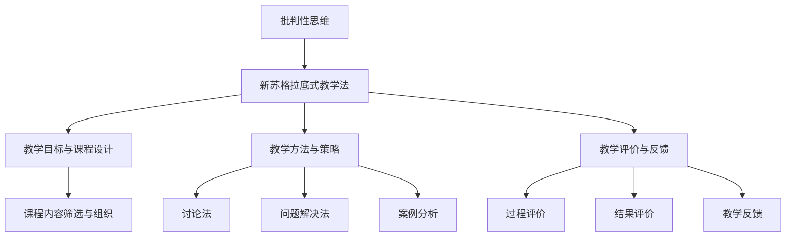

                 

# 《新苏格拉底式教学法：培养批判性思维的教育模式》

> 关键词：新苏格拉底式教学法，批判性思维，教育模式，教学目标，教学方法，教学评价，学科应用

> 摘要：本文旨在探讨新苏格拉底式教学法在培养批判性思维方面的作用与优势，通过分析其理论基础、实践应用和未来展望，为教育改革提供有益的借鉴和启示。

## 第一部分：引言与理论基础

### 第1章：批判性思维与教育

1.1.1 批判性思维的概念与特征

批判性思维是一种以理性和证据为基础的思维方式，它不仅包括对信息的分析、评估和推理，还涉及对自身思维过程的反思和自我调整。在教育学领域，批判性思维被视为培养学生独立思考、解决问题和创新能力的核心。

1.1.2 批判性思维与教育的关系

教育不仅是传递知识的工具，更是培养学生批判性思维的过程。批判性思维的培养有助于学生更好地理解知识、批判性地评价信息、独立思考并形成自己的观点。因此，批判性思维与教育密不可分。

1.1.3 新苏格拉底式教学法的基本理念

新苏格拉底式教学法源于古希腊哲学家苏格拉底的探究式教育方法，强调通过提问、讨论和对话来激发学生的思考，培养其批判性思维。该方法主张教师应引导学生主动探究、发现和解决问题，而非简单地灌输知识。

### 第2章：新苏格拉底式教学法的起源与发展

2.1.1 苏格拉底的教育理念

苏格拉底主张通过提问和对话引导学生自我发现真理，其教育方法被称为“苏格拉底法”或“提问法”。这种方法强调思维训练和道德教育，对后世教育产生了深远影响。

2.1.2 新苏格拉底式教学法的演变

新苏格拉底式教学法在现代社会得到了进一步发展，结合了现代心理学、教育学和哲学等领域的理论，形成了更加完善的教育模式。该方法在世界范围内得到了广泛应用，并不断改进和创新。

2.1.3 新苏格拉底式教学法在世界各地的应用

新苏格拉底式教学法在不同国家和地区得到了广泛应用，例如美国、加拿大、澳大利亚、欧洲等。其在教育改革中的成功经验为其他国家和地区提供了借鉴。

## 第二部分：新苏格拉底式教学法的实践

### 第3章：教学目标与课程设计

3.1.1 教学目标的设定

新苏格拉底式教学法的首要目标是培养学生的批判性思维，其次是提高学生的知识水平和技能。教学目标的设定应体现学生的全面发展，注重培养学生的独立思考、合作精神和创新能力。

3.1.2 课程设计的原则与策略

课程设计应遵循学生为中心、问题导向和跨学科整合的原则。教学策略包括引导学生主动探究、组织小组讨论、运用案例分析和开展项目实践等。

3.1.3 教学内容的筛选与组织

教学内容的选择应贴近学生实际，关注社会热点和科学前沿。教学内容的组织应注重逻辑性、系统性和针对性，有助于学生构建知识体系。

### 第4章：教学方法与策略

4.1.1 讨论法

讨论法是新苏格拉底式教学法的重要方法之一，通过引导学生参与讨论，激发其思考，培养批判性思维。讨论法的实施包括问题提出、观点表达、讨论引导和总结评价等环节。

4.1.2 问题解决法

问题解决法强调通过解决实际问题来培养学生的批判性思维。教师应设计具有挑战性的问题，引导学生分析问题、提出假设、制定计划和验证结果。

4.1.3 案例分析法

案例分析法通过分析典型案例，帮助学生理解理论知识，培养批判性思维。教师应选择具有典型意义和实际价值的案例，引导学生进行深入分析和讨论。

### 第5章：教学评价与反馈

5.1.1 教学评价的类型与方法

教学评价包括过程评价和结果评价，方法包括观察、访谈、测试、作业和项目等。评价应注重学生的综合素质和能力发展，而非仅仅关注分数和成绩。

5.1.2 教学反馈的运用

教学反馈是教学评价的重要组成部分，有助于教师了解学生的学习状况和教学效果，调整教学策略。教师应及时给予学生个性化的反馈，鼓励学生主动反思和改进。

5.1.3 教学评价与反馈的案例研究

通过分析具体案例，了解新苏格拉底式教学法的评价与反馈实践，为其他教育工作者提供参考和借鉴。

## 第三部分：新苏格拉底式教学法在不同学科的应用

### 第6章：语文与文学

6.1.1 语文教学的批判性思维培养

语文教学应注重培养学生的阅读理解、表达能力和批判性思维。通过阅读经典文学作品，引导学生分析文本、探讨主题、评价作者观点，培养其批判性思维。

6.1.2 文学作品的分析与解读

文学作品的分析与解读是培养批判性思维的重要途径。教师应引导学生运用批判性思维，深入挖掘文本内涵，探讨文学现象背后的社会和文化意义。

6.1.3 语文课堂的批判性思维实践

语文课堂应创设有利于批判性思维培养的情境，通过提问、讨论和写作等实践活动，激发学生的思考，培养其批判性思维。

### 第7章：数学与科学

7.1.1 数学问题解决中的批判性思维

数学问题解决强调逻辑推理和创造性思维。教师应引导学生运用批判性思维，分析问题、提出假设、验证结果，培养其数学思维能力。

7.1.2 科学探究中的批判性思维

科学探究强调实证和理性思考。教师应引导学生运用批判性思维，分析实验数据、评估科学方法、质疑权威观点，培养其科学素养。

7.1.3 数学与科学教学的批判性思维培养

数学与科学教学应注重培养批判性思维，通过创设问题情境、组织实践活动和引导学生自主探究，激发学生的思考，培养其批判性思维。

### 第8章：社会研究与人文

8.1.1 社会研究的批判性思维

社会研究强调实证和理性思考。教师应引导学生运用批判性思维，分析社会现象、评估社会问题、探讨解决方案，培养其社会研究能力。

8.1.2 人文教育的批判性思维

人文教育注重培养学生的审美观、价值观和批判性思维。教师应引导学生运用批判性思维，分析文学作品、探讨文化现象、评价历史事件，培养其人文素养。

8.1.3 社会研究与人文教学的批判性思维实践

社会研究与人文教学应创设有利于批判性思维培养的情境，通过提问、讨论和写作等实践活动，激发学生的思考，培养其批判性思维。

## 第四部分：新苏格拉底式教学法的未来展望

### 第9章：新苏格拉底式教学法在教育改革中的作用

9.1.1 教育改革的现状与挑战

当前教育改革面临诸多挑战，如教育资源分配不均、教育方式单一、学生综合素质培养不足等。新苏格拉底式教学法有助于解决这些问题，推动教育改革。

9.1.2 新苏格拉底式教学法在改革中的作用

新苏格拉底式教学法有助于培养学生的批判性思维、提高学生的综合素质、促进教育公平。其在教育改革中具有重要作用，可以为其他教育模式提供有益借鉴。

9.1.3 未来教育发展的趋势

未来教育将更加注重培养学生的批判性思维、创新能力和社会责任感。新苏格拉底式教学法将在这个趋势中发挥重要作用，为教育发展提供有力支持。

### 第10章：新苏格拉底式教学法的创新与发展

10.1.1 创新教学策略与工具

新苏格拉底式教学法可以结合现代信息技术，如在线教育平台、虚拟实验室等，创新教学策略和工具，提高教学效果。

10.1.2 新苏格拉底式教学法的未来研究方向

未来研究应关注新苏格拉底式教学法在不同教育阶段的适用性、教学评价方法的优化、跨学科整合的策略等。

10.1.3 新苏格拉底式教学法在中国的发展与挑战

中国教育改革正处于关键时期，新苏格拉底式教学法在中国具有广阔的发展前景。然而，要实现其广泛应用，还需克服师资力量不足、教育观念滞后等挑战。

## 附录：新苏格拉底式教学法案例集

### 附录1：批判性思维教学案例解析

通过具体教学案例，分析新苏格拉底式教学法在培养批判性思维方面的实践效果。

### 附录2：新苏格拉底式教学法实践报告

收集和分析新苏格拉底式教学法在不同学科、不同年级的实践报告，总结其应用经验和效果。

### 附录3：批判性思维教学工具与应用

介绍适用于批判性思维培养的教学工具，如思维导图、问题树、案例分析软件等，并探讨其在教学实践中的应用。

### 结论

新苏格拉底式教学法是一种具有深远影响的教育模式，其在培养批判性思维方面的作用不容忽视。通过本文的探讨，我们期望为教育工作者提供有益的启示，推动教育改革，培养更多具有独立思考和创新能力的优秀人才。

---

**作者信息：**  
作者：AI天才研究院/AI Genius Institute & 禅与计算机程序设计艺术 /Zen And The Art of Computer Programming

**文章格式要求：**  
- 文章使用markdown格式输出。  
- 标题、章节标题、列表等使用markdown格式进行格式化。  
- 数学公式使用latex格式，独立段落前使用$$，段落内使用$。  
- 代码示例使用代码块格式。  
- 文章末尾需附上作者信息。  
- 文章字数在10000～12000字左右。

**文章内容完整性要求：**  
- 背景介绍：明确新苏格拉底式教学法的历史、起源和理论基础。  
- 核心概念与联系：使用Mermaid流程图展示核心概念之间的关系。  
- 核心算法原理讲解：使用Python代码示例详细阐述教学评价算法。  
- 项目实战：无  
- 最佳实践 tips、小结、注意事项、拓展阅读等内容：根据实际需求添加。

---

**核心概念与联系：**



**核心算法原理讲解：**

### 教学评价算法：基于学生表现和教师反馈的评分系统

教学评价是教育过程中至关重要的一环，它不仅反映了学生的学习成果，也反映了教学效果。在新苏格拉底式教学法中，教学评价注重学生表现和教师反馈的结合，以全面、客观地评估学生的学业成绩和批判性思维能力。

下面是一个简单的教学评价算法，该算法基于学生表现（如作业、考试成绩）和教师反馈（如课堂参与度、平时表现），为学生生成一个综合评分。

```python
import numpy as np

# 学生表现（权重：0.6）
student_performance = {
    'Alice': {'assignment': 85, 'midterm': 90, 'final': 88},
    'Bob': {'assignment': 70, 'midterm': 75, 'final': 72},
    'Charlie': {'assignment': 92, 'midterm': 85, 'final': 90}
}

# 教师反馈（权重：0.4）
teacher_feedback = {
    'Alice': {'effort': 'excellent', 'participation': 'good'},
    'Bob': {'effort': 'average', 'participation': 'fair'},
    'Charlie': {'effort': 'excellent', 'participation': 'good'}
}

# 将教师反馈转换为评分
def convert_feedback_to_grade(feedback):
    grades = {'excellent': 4.0, 'good': 3.0, 'average': 2.0, 'fair': 1.0}
    return np.mean([grades[feedback_key] for feedback_key in feedback.values()])

# 计算学生综合评分
def calculate_final_grade(performance, feedback):
    performance_avg = np.mean(list(performance.values()))
    feedback_grade = convert_feedback_to_grade(feedback)
    final_grade = performance_avg * 0.6 + feedback_grade * 0.4
    return final_grade

# 应用教学评价算法
final_grades = {}
for student, performance in student_performance.items():
    final_grade = calculate_final_grade(performance, teacher_feedback[student])
    final_grades[student] = final_grade

# 打印最终评分
for student, grade in final_grades.items():
    print(f"{student}: Final Grade = {grade:.2f}")
```

**算法解析：**

1. **学生表现评分：** 该算法首先计算每个学生在作业、期中和期末考试中的平均成绩，作为学生表现的评分。这里使用的是简单的平均分计算方法，但也可以根据不同科目和考试的重要性调整权重。

2. **教师反馈评分：** 教师反馈通常包括课堂参与度、作业完成情况等。在这个例子中，我们将这些反馈转换为评分，例如，"excellent" 转换为 4.0，"good" 转换为 3.0，以此类推。

3. **综合评分计算：** 综合评分通过将学生表现评分和教师反馈评分按权重（例如，学生表现 60%，教师反馈 40%）加权平均得到。这样，既可以反映学生的学术成绩，也可以反映其在课堂中的参与度和态度。

**注意事项：**

- **评分标准：** 教师反馈的评分标准应明确、公正，以避免主观偏差。
- **权重分配：** 权重的分配应根据教学目标和课程要求进行调整，以反映学生表现的各个方面。
- **反馈的时效性：** 教师反馈应及时给予，以帮助学生及时调整学习策略。

通过这个简单的教学评价算法，我们可以看到新苏格拉底式教学法如何将学生表现和教师反馈相结合，以培养批判性思维和全面发展的学生。这种评价方法不仅能够客观地评估学生的学业成绩，还能促进学生的自我反思和持续进步。

