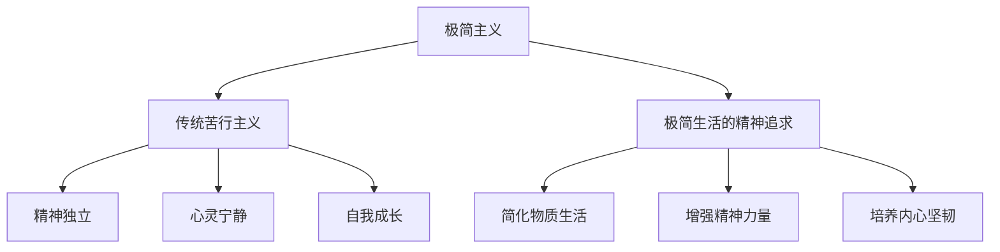

                 

### 引言：探索新苦行主义的核心精神

新苦行主义，这个源自古老修行传统的现代哲学，正在悄然兴起并影响着我们的生活。它不仅仅是对物质的简化，更是对精神层面的深刻追求。在快节奏、高压力的现代生活中，新苦行主义为我们提供了一种回归内心、追求内心平静和自我提升的生活方式。

#### 关键词

- 新苦行主义
- 极简生活
- 精神追求
- 内心平静
- 自我成长

#### 摘要

本文将深入探讨新苦行主义的核心精神，分析其起源和发展，阐述其与传统苦行主义的区别，以及如何在日常生活中实践这种生活方式。通过具体的生活实践和工作中的应用，本文将帮助读者理解新苦行主义的价值和意义，并为其提供可行的实施策略。

### 《新苦行主义：极简生活的精神追求》目录大纲

#### 引言：探索新苦行主义的核心精神

- 关键词
- 摘要

#### 第1章：新苦行主义的起源与发展

1.1 新苦行主义的起源
1.2 新苦行主义的发展历程
1.3 新苦行主义与极简生活的联系

#### 第2章：新苦行主义的核心概念

2.1 极简主义与传统苦行主义的区别
2.2 极简生活的精神追求
2.3 新苦行主义的实践原则

#### 第3章：新苦行主义的生活实践

3.1 实践一：简化生活方式
3.2 实践二：提升精神境界
3.3 实践三：培养健康习惯

#### 第4章：新苦行主义在工作中的应用

4.1 工作与生活的平衡
4.2 职场极简主义

#### 第5章：新苦行主义的挑战与应对策略

5.1 挑战一：物质依赖的困扰
5.2 挑战二：精神压力的处理

#### 第6章：新苦行主义与人际关系

6.1 新苦行主义对人际关系的影响
6.2 构建和谐的社交圈

#### 第7章：新苦行主义与人生意义

7.1 新苦行主义与人生意义的探索
7.2 新苦行主义对人生的影响

#### 第8章：新苦行主义的未来展望

8.1 新苦行主义的社会影响
8.2 新苦行主义的全球趋势
8.3 新苦行主义的未来发展方向

#### 参考文献

#### 附录：极简生活的实用技巧

- 精简物品的技巧
- 管理时间的方法
- 提高工作效率的技巧

### Mermaid 流程图：新苦行主义的核心概念关系



### 代码示例：新苦行主义的工作与生活平衡

```python
def work_life_balance():
    # 制定合理的工作计划
    plan = "制定每日工作计划，明确工作重点和优先级"
    # 提高工作效率
    efficiency = "采用有效的工作方法和工具，减少无效劳动"
    # 适当放松与休息
    relaxation = "定期休息，保持身心健康"
    print(f"实现工作与生活平衡的策略：{plan}, {efficiency}, {relaxation}")
```

### 结论

新苦行主义不仅是对物质的简化，更是对内心世界的深刻探索。通过极简生活的实践，我们可以在忙碌的现代生活中找到内心的平静和自我成长的动力。希望本文能为您的新苦行主义之路提供一些启示和帮助。

#### 作者信息

- 作者：AI天才研究院/AI Genius Institute & 禅与计算机程序设计艺术 /Zen And The Art of Computer Programming

本文将逐步深入探讨新苦行主义的核心精神，分析其起源和发展，阐述其与传统苦行主义的区别，以及如何在日常生活中实践这种生活方式。通过具体的生活实践和工作中的应用，本文将帮助读者理解新苦行主义的价值和意义，并为其提供可行的实施策略。接下来，我们将分章节进行详细探讨。

