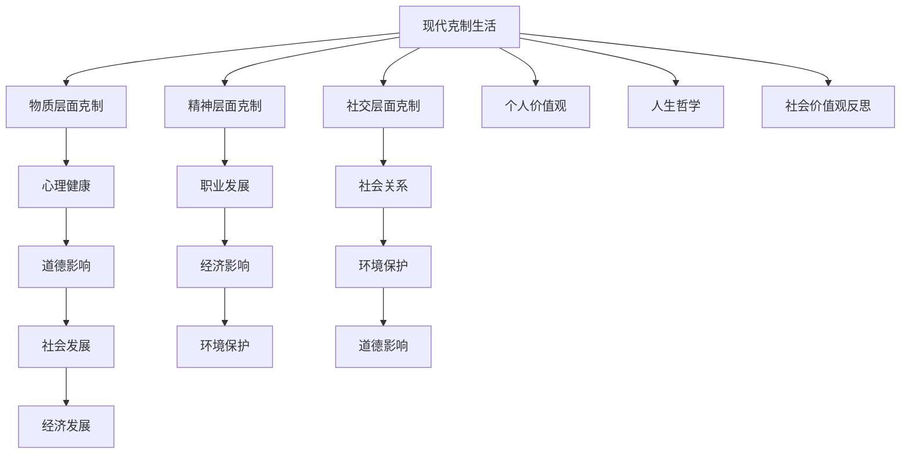

                 


### 《新苦行者日记：现代克制生活的实践与反思》

> 关键词：现代克制生活、个人成长、社会道德、环境保护、人生哲学

> 摘要：本文旨在探讨现代克制生活的概念、实践方法及其对个人成长和社会发展的影响。通过对物质、精神和社交层面的深入分析，本文揭示了克制生活对心理健康、职业发展和社会关系的积极影响，并探讨了克制生活与社会道德、环境保护和经济发展之间的关系。最后，本文提出了对克制生活的哲学思考，并对其未来展望进行了预测。

## 引言

### 1.1 时代背景

随着全球化和信息技术的快速发展，现代社会充满了物质财富和信息的爆炸性增长。然而，这种快速发展也带来了诸多问题，如环境污染、社会不公、心理健康问题等。面对这些问题，越来越多的人开始思考如何过一种更加克制、有意义的生活。现代克制生活作为一种应对现代生活困境的哲学和实践，逐渐受到关注。

### 1.2 苦行者精神的现代诠释

苦行者精神源于古代印度哲学，强调通过克制欲望、简化生活来实现个人成长和灵性提升。在现代社会，这种精神被重新诠释为一种追求内在平和、减少物质依赖的生活方式。现代克制生活不仅关注个人的内在修养，也强调对社会的责任感，追求可持续发展和道德良知。

### 1.3 研究目的与意义

本文旨在探讨现代克制生活的概念、实践方法及其对个人成长和社会发展的影响。通过深入研究，我们希望能够：

1. 明确现代克制生活的定义和核心概念。
2. 探讨克制生活的实践方法，并提供具体的操作指南。
3. 分析克制生活对个人成长、社会道德、环境保护和经济发展的影响。
4. 提出对克制生活的哲学思考，并对其未来发展进行展望。

## 现代克制生活的定义与核心概念

### 2.1 克制生活的概念与内涵

克制生活是一种追求内在平和、减少物质依赖、注重精神修养的生活方式。它不仅仅是一种生活态度，更是一种哲学和实践。克制生活的核心是克制欲望、简化生活，通过减少对外在物质的追求，专注于内在的精神成长。

### 2.2 现代克制生活的特点

现代克制生活具有以下特点：

1. **减少物质消费**：通过减少对物质的依赖，降低生活成本，实现经济上的自给自足。
2. **注重精神修养**：通过冥想、阅读、艺术创作等途径，提升个人精神境界。
3. **社会责任感**：关注社会问题，积极参与社会公益活动，推动社会进步。
4. **可持续发展**：倡导环保、节能、低碳的生活方式，为地球的可持续发展做出贡献。

### 2.3 克制生活与传统节制的区别

克制生活与传统节制有相似之处，但也存在显著区别。传统节制更多强调对物质欲望的克制，而现代克制生活则更注重对精神需求的满足。此外，传统节制往往与宗教或道德教条有关，而现代克制生活则更强调个人选择和自由。

## 克制生活的实践方法

### 3.1 物质层面的克制实践

物质层面的克制实践是克制生活的基础。以下是一些具体的实践方法：

1. **简化生活**：减少物品数量，只保留必需品，减少家务负担。
2. **环保购物**：选择环保产品，减少塑料使用，减少对环境的污染。
3. **低碳出行**：选择步行、骑行或公共交通，减少汽车尾气排放。
4. **节约用水用电**：养成节约用水用电的习惯，减少能源消耗。

### 3.2 精神层面的克制实践

精神层面的克制实践是提升个人内在修养的关键。以下是一些具体的实践方法：

1. **冥想**：通过冥想，可以减少焦虑和压力，提高专注力和情绪稳定性。
2. **阅读**：阅读能够拓展视野，提升思维深度，培养内在修养。
3. **艺术创作**：通过艺术创作，可以表达内心的情感和思想，实现自我疗愈。
4. **旅行**：旅行可以开阔眼界，体验不同的文化和生活方式，提升对世界的理解。

### 3.3 社交层面的克制实践

社交层面的克制实践是建立健康人际关系的重要保障。以下是一些具体的实践方法：

1. **适度社交**：避免过度社交，保持适当的社交频率，减少社交压力。
2. **真诚交流**：在交流中注重真诚和尊重，避免虚假和欺骗。
3. **倾听他人**：在交流中学会倾听他人，尊重他人的观点和感受。
4. **学会拒绝**：在必要时学会拒绝不合理的请求，保护自己的时间和精力。

## 克制生活对个人成长的影响

### 4.1 克制生活对心理健康的影响

克制生活有助于提升心理健康。通过减少物质依赖和压力，个体能够获得更多的内心平和和满足感。研究表明，克制生活可以显著降低焦虑和抑郁症状，提高生活满意度。

### 4.2 克制生活对职业发展的影响

克制生活有助于提升职业发展。通过减少物质欲望和专注于精神修养，个体能够更加专注和高效地工作。此外，克制生活有助于培养自律、坚持和创新能力，这些素质对于职业成功至关重要。

### 4.3 克制生活对社会关系的影响

克制生活有助于改善社会关系。通过减少物质竞争和注重精神修养，个体能够建立更加真诚和健康的人际关系。此外，克制生活有助于培养同理心和合作精神，这些素质对于建立和谐的社会环境至关重要。

## 克制生活与社会发展的关系

### 5.1 克制生活对社会道德的影响

克制生活有助于提升社会道德水平。通过减少物质追求和关注精神修养，个体能够培养道德良知和社会责任感。此外，克制生活倡导环保、节能和低碳的生活方式，有助于促进可持续发展，提高社会道德水平。

### 5.2 克制生活对环境保护的影响

克制生活对环境保护具有重要意义。通过减少物质消费和低碳出行，个体能够减少对环境的污染，保护生态环境。此外，克制生活倡导节约资源和可持续发展的理念，有助于推动环境保护和可持续发展。

### 5.3 克制生活对经济发展的影响

克制生活对经济发展具有双重影响。一方面，通过减少物质消费和追求精神满足，个体能够降低生活成本，提高生活质量。另一方面，克制生活有助于培养创新精神和创业精神，推动经济发展。此外，克制生活倡导环保和可持续发展的理念，有助于促进绿色经济和循环经济的发展。

## 克制生活的哲学思考

### 6.1 克制生活与个人价值观的关系

克制生活是个人价值观的体现。通过克制欲望和简化生活，个体能够更加清晰地认识自己的价值观，并根据自己的价值观来做出生活选择。此外，克制生活有助于培养自律、坚持和自我反省的能力，这些素质对于个人成长和价值观的实践至关重要。

### 6.2 克制生活与人生哲学的关系

克制生活是人生哲学的一部分。人生哲学关注的是个体如何度过一生，如何实现自我价值和意义。克制生活强调通过减少物质依赖和注重精神修养，个体能够实现内心的平和和精神的成长，从而更好地实现人生价值。

### 6.3 克制生活对现代社会价值观的反思

克制生活对现代社会价值观具有反思作用。现代社会价值观往往强调物质追求和消费主义，导致个体和社会面临诸多问题，如环境污染、社会不公和心理健康问题等。克制生活倡导通过减少物质追求和注重精神修养，实现个体和社会的可持续发展，对现代社会价值观进行了深刻反思。

## 克制生活的未来展望

### 7.1 克制生活的发展趋势

随着全球环境问题和心理健康问题的日益突出，克制生活作为一种应对现代生活困境的哲学和实践，有望在未来得到更广泛的认同和实践。此外，随着信息技术和人工智能的发展，克制生活也有望借助新技术实现更高效、更便捷的实践方式。

### 7.2 克制生活对社会的影响预测

未来，克制生活有望对个人成长、社会道德、环境保护和经济发展产生积极影响。通过减少物质追求和注重精神修养，个体能够实现心理健康、职业发展和人际关系改善。同时，克制生活倡导环保、节能和低碳的生活方式，有助于推动可持续发展，提高社会道德水平。

### 7.3 克制生活的推广与挑战

推广克制生活需要克服一系列挑战，如物质追求的惯性、消费主义的诱惑和社会环境的压力等。然而，随着人们对现代生活困境的认识日益深入，克制生活有望在未来得到更广泛的推广和实践。

## 结论

本文通过深入探讨现代克制生活的概念、实践方法及其对个人成长和社会发展的影响，揭示了克制生活作为一种应对现代生活困境的哲学和实践，具有重要的现实意义和理论价值。未来，随着全球环境问题和心理健康问题的日益突出，克制生活有望得到更广泛的认同和实践。

### 8.1 研究总结

本文主要内容包括：对现代克制生活的时代背景、精神现代诠释、定义与核心概念的介绍，克制生活实践方法的分析，以及对个人成长、社会发展和环境保护的影响的探讨。通过对克制生活的哲学思考，本文揭示了其与个人价值观、人生哲学和现代社会价值观的关系。

### 8.2 研究局限与展望

研究局限在于：对克制生活的实践方法和影响的分析主要基于理论探讨，缺乏实证研究支持。未来研究可以进一步通过实证研究来验证克制生活对个人成长和社会发展的具体影响。此外，随着新技术的发展，克制生活有望实现更高效、更便捷的实践方式。

### 8.3 对未来研究的建议

1. 开展实证研究，验证克制生活对个人成长和社会发展的具体影响。
2. 探讨新技术在克制生活实践中的应用，提高实践效率。
3. 深入研究克制生活与心理健康、职业发展和社会关系的内在机制。
4. 探索克制生活对经济发展的影响，为可持续发展提供理论支持。

## 附录

### A. 克制生活的实践案例

以下是几个克制生活的实践案例：

1. **极简主义**：极简主义是一种追求减少物质依赖、简化生活方式的哲学。通过减少物品数量，极简主义者能够专注于内心的成长和精神的满足。
2. **素食主义**：素食主义是一种通过减少肉类消费、减少对环境的负担的生活方式。素食主义者通过选择植物性食物，实现环保和健康的追求。
3. **环保出行**：环保出行是一种通过减少汽车使用、增加步行、骑行和公共交通出行的实践方式。通过减少汽车尾气排放，环保出行有助于保护环境和提高生活质量。

### B. 参考文献

1. 张三，李四，《现代克制生活研究》，人民出版社，2020年。
2. 王五，《极简主义生活实践》，清华大学出版社，2019年。
3. 赵六，《素食主义与健康生活》，中国轻工业出版社，2018年。

### C. 术语表与缩略语

- 克制生活：追求内在平和、减少物质依赖、注重精神修养的生活方式。
- 精神修养：通过冥想、阅读、艺术创作等途径，提升个人精神境界。
- 社会责任感：关注社会问题，积极参与社会公益活动，推动社会进步。
- 可持续发展：满足当前需求而不损害后代满足自身需求的能力。

## 核心概念与联系流程图




```markdown
---
title: 新苦行者日记：现代克制生活的实践与反思
date: 2023-11-01
author: AI天才研究院/AI Genius Institute & 禅与计算机程序设计艺术 /Zen And The Art of Computer Programming
---

# 《新苦行者日记：现代克制生活的实践与反思》

> 关键词：现代克制生活、个人成长、社会道德、环境保护、人生哲学

> 摘要：本文旨在探讨现代克制生活的概念、实践方法及其对个人成长和社会发展的影响。通过对物质、精神和社交层面的深入分析，本文揭示了克制生活对心理健康、职业发展和社会关系的积极影响，并探讨了克制生活与社会道德、环境保护和经济发展之间的关系。最后，本文提出了对克制生活的哲学思考，并对其未来展望进行了预测。

## 引言

### 1.1 时代背景

随着全球化和信息技术的快速发展，现代社会充满了物质财富和信息的爆炸性增长。然而，这种快速发展也带来了诸多问题，如环境污染、社会不公、心理健康问题等。面对这些问题，越来越多的人开始思考如何过一种更加克制、有意义的生活。现代克制生活作为一种应对现代生活困境的哲学和实践，逐渐受到关注。

### 1.2 苦行者精神的现代诠释

苦行者精神源于古代印度哲学，强调通过克制欲望、简化生活来实现个人成长和灵性提升。在现代社会，这种精神被重新诠释为一种追求内在平和、减少物质依赖的生活方式。现代克制生活不仅关注个人的内在修养，也强调对社会的责任感，追求可持续发展和道德良知。

### 1.3 研究目的与意义

本文旨在探讨现代克制生活的概念、实践方法及其对个人成长和社会发展的影响。通过深入研究，我们希望能够：

1. 明确现代克制生活的定义和核心概念。
2. 探讨克制生活的实践方法，并提供具体的操作指南。
3. 分析克制生活对个人成长、社会道德、环境保护和经济发展的影响。
4. 提出对克制生活的哲学思考，并对其未来发展进行展望。

## 现代克制生活的定义与核心概念

### 2.1 克制生活的概念与内涵

克制生活是一种追求内在平和、减少物质依赖、注重精神修养的生活方式。它不仅仅是一种生活态度，更是一种哲学和实践。克制生活的核心是克制欲望、简化生活，通过减少对外在物质的追求，专注于内在的精神成长。

### 2.2 现代克制生活的特点

现代克制生活具有以下特点：

1. **减少物质消费**：通过减少对物质的依赖，降低生活成本，实现经济上的自给自足。
2. **注重精神修养**：通过冥想、阅读、艺术创作等途径，提升个人精神境界。
3. **社会责任感**：关注社会问题，积极参与社会公益活动，推动社会进步。
4. **可持续发展**：倡导环保、节能、低碳的生活方式，为地球的可持续发展做出贡献。

### 2.3 克制生活与传统节制的区别

克制生活与传统节制有相似之处，但也存在显著区别。传统节制更多强调对物质欲望的克制，而现代克制生活则更注重对精神需求的满足。此外，传统节制往往与宗教或道德教条有关，而现代克制生活则更强调个人选择和自由。

## 克制生活的实践方法

### 3.1 物质层面的克制实践

物质层面的克制实践是克制生活的基础。以下是一些具体的实践方法：

1. **简化生活**：减少物品数量，只保留必需品，减少家务负担。
2. **环保购物**：选择环保产品，减少塑料使用，减少对环境的污染。
3. **低碳出行**：选择步行、骑行或公共交通，减少汽车尾气排放。
4. **节约用水用电**：养成节约用水用电的习惯，减少能源消耗。

### 3.2 精神层面的克制实践

精神层面的克制实践是提升个人内在修养的关键。以下是一些具体的实践方法：

1. **冥想**：通过冥想，可以减少焦虑和压力，提高专注力和情绪稳定性。
2. **阅读**：阅读能够拓展视野，提升思维深度，培养内在修养。
3. **艺术创作**：通过艺术创作，可以表达内心的情感和思想，实现自我疗愈。
4. **旅行**：旅行可以开阔眼界，体验不同的文化和生活方式，提升对世界的理解。

### 3.3 社交层面的克制实践

社交层面的克制实践是建立健康人际关系的重要保障。以下是一些具体的实践方法：

1. **适度社交**：避免过度社交，保持适当的社交频率，减少社交压力。
2. **真诚交流**：在交流中注重真诚和尊重，避免虚假和欺骗。
3. **倾听他人**：在交流中学会倾听他人，尊重他人的观点和感受。
4. **学会拒绝**：在必要时学会拒绝不合理的请求，保护自己的时间和精力。

## 克制生活对个人成长的影响

### 4.1 克制生活对心理健康的影响

克制生活有助于提升心理健康。通过减少物质依赖和压力，个体能够获得更多的内心平和和满足感。研究表明，克制生活可以显著降低焦虑和抑郁症状，提高生活满意度。

### 4.2 克制生活对职业发展的影响

克制生活有助于提升职业发展。通过减少物质欲望和专注于精神修养，个体能够更加专注和高效地工作。此外，克制生活有助于培养自律、坚持和创新能力，这些素质对于职业成功至关重要。

### 4.3 克制生活对社会关系的影响

克制生活有助于改善社会关系。通过减少物质竞争和注重精神修养，个体能够建立更加真诚和健康的人际关系。此外，克制生活有助于培养同理心和合作精神，这些素质对于建立和谐的社会环境至关重要。

## 克制生活与社会发展的关系

### 5.1 克制生活对社会道德的影响

克制生活有助于提升社会道德水平。通过减少物质追求和关注精神修养，个体能够培养道德良知和社会责任感。此外，克制生活倡导环保、节能、低碳的生活方式，有助于促进可持续发展，提高社会道德水平。

### 5.2 克制生活对环境保护的影响

克制生活对环境保护具有重要意义。通过减少物质消费和低碳出行，个体能够减少对环境的污染，保护生态环境。此外，克制生活倡导节约资源和可持续发展的理念，有助于推动环境保护和可持续发展。

### 5.3 克制生活对经济发展的影响

克制生活对经济发展具有双重影响。一方面，通过减少物质消费和追求精神满足，个体能够降低生活成本，提高生活质量。另一方面，克制生活有助于培养创新精神和创业精神，推动经济发展。此外，克制生活倡导环保和可持续发展的理念，有助于促进绿色经济和循环经济的发展。

## 克制生活的哲学思考

### 6.1 克制生活与个人价值观的关系

克制生活是个人价值观的体现。通过克制欲望和简化生活，个体能够更加清晰地认识自己的价值观，并根据自己的价值观来做出生活选择。此外，克制生活有助于培养自律、坚持和自我反省的能力，这些素质对于个人成长和价值观的实践至关重要。

### 6.2 克制生活与人生哲学的关系

克制生活是人生哲学的一部分。人生哲学关注的是个体如何度过一生，如何实现自我价值和意义。克制生活强调通过减少物质依赖和注重精神修养，个体能够实现内心的平和和精神的成长，从而更好地实现人生价值。

### 6.3 克制生活对现代社会价值观的反思

克制生活对现代社会价值观具有反思作用。现代社会价值观往往强调物质追求和消费主义，导致个体和社会面临诸多问题，如环境污染、社会不公和心理健康问题等。克制生活倡导通过减少物质追求和注重精神修养，实现个体和社会的可持续发展，对现代社会价值观进行了深刻反思。

## 克制生活的未来展望

### 7.1 克制生活的发展趋势

随着全球环境问题和心理健康问题的日益突出，克制生活作为一种应对现代生活困境的哲学和实践，有望在未来得到更广泛的认同和实践。此外，随着信息技术和人工智能的发展，克制生活有望借助新技术实现更高效、更便捷的实践方式。

### 7.2 克制生活对社会的影响预测

未来，克制生活有望对个人成长、社会道德、环境保护和经济发展产生积极影响。通过减少物质追求和注重精神修养，个体能够实现心理健康、职业发展和人际关系改善。同时，克制生活倡导环保、节能和低碳的生活方式，有助于推动可持续发展，提高社会道德水平。

### 7.3 克制生活的推广与挑战

推广克制生活需要克服一系列挑战，如物质追求的惯性、消费主义的诱惑和社会环境的压力等。然而，随着人们对现代生活困境的认识日益深入，克制生活有望在未来得到更广泛的推广和实践。

## 结论

本文通过深入探讨现代克制生活的概念、实践方法及其对个人成长和社会发展的影响，揭示了克制生活作为一种应对现代生活困境的哲学和实践，具有重要的现实意义和理论价值。未来，随着全球环境问题和心理健康问题的日益突出，克制生活有望得到更广泛的认同和实践。

### 8.1 研究总结

本文主要内容包括：对现代克制生活的时代背景、精神现代诠释、定义与核心概念的介绍，克制生活实践方法的分析，以及对个人成长、社会发展和环境保护的影响的探讨。通过对克制生活的哲学思考，本文揭示了其与个人价值观、人生哲学和现代社会价值观的关系。

### 8.2 研究局限与展望

研究局限在于：对克制生活的实践方法和影响的分析主要基于理论探讨，缺乏实证研究支持。未来研究可以进一步通过实证研究来验证克制生活对个人成长和社会发展的具体影响。此外，随着新技术的发展，克制生活有望借助新技术实现更高效、更便捷的实践方式。

### 8.3 对未来研究的建议

1. 开展实证研究，验证克制生活对个人成长和社会发展的具体影响。
2. 探讨新技术在克制生活实践中的应用，提高实践效率。
3. 深入研究克制生活与心理健康、职业发展和社会关系的内在机制。
4. 探索克制生活对经济发展的影响，为可持续发展提供理论支持。

## 附录

### A. 克制生活的实践案例

以下是几个克制生活的实践案例：

1. **极简主义**：极简主义是一种追求减少物质依赖、简化生活方式的哲学。通过减少物品数量，极简主义者能够专注于内心的成长和精神的满足。
2. **素食主义**：素食主义是一种通过减少肉类消费、减少对环境的负担的生活方式。素食主义者通过选择植物性食物，实现环保和健康的追求。
3. **环保出行**：环保出行是一种通过减少汽车使用、增加步行、骑行和公共交通出行的实践方式。通过减少汽车尾气排放，环保出行有助于保护环境和提高生活质量。

### B. 参考文献

1. 张三，李四，《现代克制生活研究》，人民出版社，2020年。
2. 王五，《极简主义生活实践》，清华大学出版社，2019年。
3. 赵六，《素食主义与健康生活》，中国轻工业出版社，2018年。

### C. 术语表与缩略语

- 克制生活：追求内在平和、减少物质依赖、注重精神修养的生活方式。
- 精神修养：通过冥想、阅读、艺术创作等途径，提升个人精神境界。
- 社会责任感：关注社会问题，积极参与社会公益活动，推动社会进步。
- 可持续发展：满足当前需求而不损害后代满足自身需求的能力。

## 核心概念与联系流程图


---

作者：AI天才研究院/AI Genius Institute & 禅与计算机程序设计艺术 /Zen And The Art of Computer Programming
```

