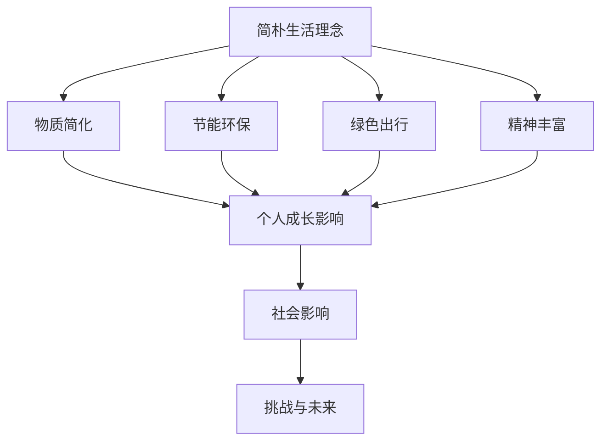

                 

### 背景介绍

简朴生活（Simplicity Living）起源于对现代社会消费主义的反思和批判。它主张通过减少物质消费，简化生活，从而提高生活质量，减少环境负担，并追求更深层次的精神满足。在现代快节奏、高压力的社会环境中，简朴生活理念逐渐受到广泛关注，成为许多人追求的生活方式。

简朴生活的核心概念包括：

- **物质简化**：减少不必要的物质消费，注重实用性和质量，而非数量和品牌。
- **节能环保**：节约能源，减少碳排放，推广可再生能源的使用。
- **绿色出行**：鼓励步行、骑行和公共交通，减少私家车使用。
- **精神丰富**：通过阅读、艺术、自然等方式丰富精神生活，提高生活满意度。

简朴生活的理念与计算机科学中的一些优化算法有着相似之处，如最小化资源消耗、最大化效用等。本文将使用Python代码和Mermaid流程图，结合数学模型和公式，详细阐述简朴生活的核心算法原理，并通过实际案例进行分析和解读。

## 关键词

- 简朴生活
- 消费主义
- 环境保护
- 精神满足
- 优化算法
- 节能减排
- 绿色出行

### 摘要

本文旨在探讨简朴生活的实践与反思。首先，我们介绍了简朴生活的起源、核心概念以及与现代社会的联系。接着，通过Python代码和Mermaid流程图，详细阐述了简朴生活的核心算法原理，包括物质简化、节能环保、绿色出行和精神丰富等方面。最后，通过实际案例分析和代码实现，展示了简朴生活如何应用于个人和社区，并提出了未来发展的挑战和方向。本文旨在为读者提供一个全面、深入的简朴生活实践指南。#新苦行者日记 #现代简朴生活 #实践与反思

---

### 第一部分：简朴生活的起源与理念

简朴生活（Simplicity Living）的概念并非凭空而来，它有着深厚的历史渊源和哲学基础。自古以来，世界各地都有关于简朴生活的探讨和实践。在古代中国，道家的“无为而治”和儒家的“节用而爱人”都是简朴生活理念的体现；古希腊的哲学家们，如亚里士多德和苏格拉底，也强调追求内在的智慧和精神的富足，而非物质的奢华。这种理念在世界各地的传统文化中都有所体现。

**1.1 简朴生活的定义与历史演变**

简朴生活，顾名思义，是一种追求简单、纯粹生活方式的生活态度。它不仅仅是减少物质的消费，更是一种对生活质量的提升和对精神满足的追求。简朴生活不是贫穷，而是通过减少不必要的物质负担，从而有更多的时间和精力去追求有意义的活动。

在现代社会，简朴生活理念逐渐演变和扩展。20世纪初，随着工业革命和消费主义的兴起，人们对物质的追求变得越来越强烈。然而，这种过度消费的生活方式不仅带来了环境问题，还引发了精神上的空虚和焦虑。正是在这样的背景下，简朴生活理念重新受到重视。

**1.1.1 简朴生活的起源**

简朴生活的起源可以追溯到古希腊和古罗马时期，当时的人们通过节俭和自给自足的方式生活，追求精神上的满足和和谐。随着中世纪的来临，宗教对简朴生活的影响进一步加深。许多宗教派别，如天主教会的僧侣和修女，倡导清贫和自律的生活方式。

在中国，简朴生活理念有着悠久的历史。儒家文化中的“克己复礼”和道家文化中的“无为而治”都是对简朴生活的高度概括。这些思想影响了中国几千年的文化发展，形成了一种独特的简朴生活传统。

**1.1.2 简朴生活的价值观**

简朴生活的价值观主要包括以下几个方面：

- **物质简化**：减少不必要的物质消费，注重实用性和质量，而非数量和品牌。
- **节能环保**：节约能源，减少碳排放，推广可再生能源的使用。
- **绿色出行**：鼓励步行、骑行和公共交通，减少私家车使用。
- **精神丰富**：通过阅读、艺术、自然等方式丰富精神生活，提高生活满意度。

简朴生活的价值观强调个人的内在成长和对环境的责任感，它不仅仅是一种生活方式，更是一种生活哲学。

**1.1.3 简朴生活与传统生活方式的联系与区别**

简朴生活与传统生活方式有着密切的联系。传统生活方式中的许多元素，如自给自足、节约资源等，都是简朴生活的体现。然而，与传统生活方式相比，简朴生活更加注重精神层面的追求和现代科技的运用。

传统生活方式通常是在特定的历史和文化背景下形成的，其核心是适应自然和社会环境。而现代简朴生活则是在现代社会背景下，对传统生活方式的反思和再创造。它不仅保留了传统生活方式中的优秀元素，还融入了现代科技和理念，使简朴生活更加适应现代社会的需求。

**1.2 现代社会的挑战与简朴生活的应对**

现代社会面临着诸多挑战，如消费主义文化的泛滥、环境问题的加剧以及精神上的焦虑和空虚等。面对这些挑战，简朴生活提供了一种可行的解决方案。

**1.2.1 现代社会的消费主义文化**

消费主义文化是现代社会的一大特征。它鼓励人们不断购买新的商品，追求物质上的满足。然而，这种过度消费的生活方式不仅带来了环境问题，还导致人们精神上的空虚和焦虑。

简朴生活通过减少物质消费，抵制消费主义文化的诱惑，帮助人们回归内心，寻找更深层次的精神满足。

**1.2.2 简朴生活的优势与挑战**

简朴生活具有诸多优势，如减少环境污染、提高生活质量、促进精神满足等。然而，简朴生活也面临一些挑战，如社会压力、经济负担等。

简朴生活要求人们重新审视自己的生活方式和价值观，这需要一定的适应和调整。同时，在现代社会中，简朴生活也面临着来自消费主义文化的巨大压力。

**1.2.3 简朴生活对个人和社会的意义**

简朴生活对个人和社会都有着深远的意义。对个人来说，简朴生活可以帮助人们减少物质负担，提高生活质量，促进精神满足。对社会来说，简朴生活有助于减少资源消耗，保护环境，构建一个可持续发展的社会。

**1.3 简朴生活的理念与实践**

简朴生活的理念可以概括为“少而精”，即通过减少不必要的物质消费，追求高质量的生活方式。在实践中，简朴生活可以通过以下几个方面来实现：

- **物质简化**：减少不必要的物品，注重物品的实用性和质量。
- **节能环保**：节约能源，减少碳排放，推广可再生能源的使用。
- **绿色出行**：鼓励步行、骑行和公共交通，减少私家车使用。
- **精神丰富**：通过阅读、艺术、自然等方式丰富精神生活，提高生活满意度。

简朴生活不仅是一种生活方式，更是一种生活哲学。它要求我们重新审视自己的生活方式和价值观，寻找更深层次的精神满足。通过实践简朴生活，我们可以为自己和地球创造一个更加美好的未来。

### 第二部分：实践篇

在了解了简朴生活的理念之后，接下来的关键步骤是将其转化为具体的生活实践。这一部分将详细探讨如何在日常生活中实施简朴生活，包括简化物质生活、节约能源、绿色出行和精神生活的丰富。通过这些具体实践，我们可以逐步实现简朴生活的目标，提高生活质量，同时减轻对环境的负担。

**2.1 简化物质生活的实践**

物质简化是简朴生活的核心之一。减少不必要的物品，注重物品的实用性和质量，可以有效减轻生活负担，提高生活满意度。

**2.1.1 减少物品的购买**

减少物品的购买是物质简化的第一步。我们可以通过以下几个方法来实现：

- **需求评估**：在购买任何物品之前，先评估自己的真实需求。避免冲动消费和盲目跟风。
- **替代方案**：考虑是否有其他替代品可以满足同样的需求。例如，使用环保袋代替塑料袋，使用可重复使用的水杯代替一次性杯子。
- **质量优先**：购买耐用、高质量的物品，减少频繁更换的频率。例如，选择高品质的电子产品，而不是追求低价的替代品。

**2.1.2 垃圾分类与回收利用**

垃圾分类与回收利用是减少环境污染的重要措施。我们可以通过以下几个步骤来实施：

- **了解分类规则**：熟悉当地垃圾分类的规则和要求，确保正确分类。
- **设置分类容器**：在家中设置不同的分类容器，如可回收物、有害垃圾、湿垃圾和干垃圾。
- **回收利用**：将可回收的物品进行再利用或捐赠。例如，旧衣物可以捐赠给需要的人或动物收容所，旧电子产品可以送到专业回收点。

**2.1.3 简化家庭生活空间**

家庭生活空间的简化可以减少杂乱，提高居住舒适度。我们可以通过以下几个步骤来实现：

- **整理收纳**：定期整理家中的物品，将不必要的物品捐赠或丢弃。
- **功能分区**：合理规划家庭空间，使每个区域都有明确的功能。例如，将书房、卧室、厨房等区域分开，避免空间混淆。
- **优化布局**：通过改变家具的摆放位置，提高空间的利用率。例如，将大件家具移到角落，留出更多行走空间。

**2.2 节约能源的实践**

节约能源是简朴生活的重要组成部分，不仅可以减少能源消耗，还可以降低碳足迹，保护环境。

**2.2.1 家电的节能使用**

家电是家庭能源消耗的主要来源之一。我们可以通过以下几个方法来节约能源：

- **选择高效家电**：购买具有高效能源标志的家电，如节能灯泡、节能冰箱等。
- **合理使用家电**：在使用家电时，尽量做到高效使用。例如，使用空调时设置合适的温度，避免频繁开关；使用洗衣机时选择合适的洗涤模式。
- **节能习惯**：养成良好的节能习惯，如关闭不使用的电器电源，减少待机能耗。

**2.2.2 建筑节能改造**

建筑节能改造是减少能源消耗的重要措施。我们可以通过以下几个步骤来实现：

- **隔热保温**：对房屋进行隔热保温处理，减少热量损失。例如，安装双层玻璃窗，增加墙体保温层。
- **通风设计**：优化房屋通风设计，提高室内空气质量。例如，安装通风口，定期开窗通风。
- **太阳能利用**：利用太阳能技术，如太阳能热水器、太阳能光伏板等，减少对传统能源的依赖。

**2.2.3 公共交通的利用**

公共交通是绿色出行的重要组成部分。我们可以通过以下几个方法来减少私家车使用：

- **步行或骑行**：短途出行选择步行或骑行，减少对私家车的依赖。
- **公共交通**：使用公共交通工具，如公交车、地铁等，减少私家车出行。
- **拼车**：与同事、朋友拼车，减少车辆空驶率。

**2.3 绿色出行的实践**

绿色出行不仅有助于减少交通污染，还可以提高生活品质。我们可以通过以下几个方法来实施绿色出行：

**2.3.1 步行与骑行的优势**

步行和骑行是绿色出行的最佳选择。它们具有以下优势：

- **环保**：不产生尾气排放，减少空气污染。
- **健康**：有助于锻炼身体，提高身体素质。
- **经济**：不需要燃料成本，节省开支。

**2.3.2 非机动交通工具的选择**

除了步行和骑行，我们可以选择其他非机动交通工具，如自行车、电动滑板车等。这些交通工具不仅环保，还可以提供便捷的出行方式。

**2.3.3 绿色出行的社会影响**

绿色出行不仅对个人有益，还对整个社会产生积极影响。例如，它可以减少交通拥堵，提高交通效率，降低交通事故发生率。

**2.4 精神生活的丰富**

简朴生活不仅关注物质层面的简化，更注重精神层面的丰富。通过丰富精神生活，我们可以提高生活满意度，减少精神压力。

**2.4.1 阅读与学习的习惯**

阅读和学习是丰富精神生活的重要途径。通过阅读，我们可以拓展知识面，提高思维能力。通过学习，我们可以不断提升自己，实现自我价值。

**2.4.2 艺术与自然的欣赏**

艺术和自然是精神生活的重要滋养。通过欣赏艺术作品，我们可以感受美的力量，提升审美能力。通过接触自然，我们可以放松身心，减轻压力。

**2.4.3 人际关系的简化**

人际关系是精神生活的重要组成部分。通过简化人际关系，我们可以减少社交压力，专注于对自己和家人、朋友的交往。

通过以上实践，我们可以逐步实现简朴生活的目标，提高生活质量，同时减轻对环境的负担。简朴生活不仅是一种生活方式，更是一种生活哲学，它要求我们重新审视自己的生活方式和价值观，寻找更深层次的精神满足。通过实践简朴生活，我们可以为自己和地球创造一个更加美好的未来。

### 第三部分：反思篇

在实践了简朴生活后，我们需要对其进行反思和评估，以了解其对我们个人成长和社会的影响，并识别其中可能存在的挑战和未来发展的方向。

**3.1 简朴生活对个人成长的影响**

简朴生活不仅仅是一种生活方式，更是一种促进个人成长的途径。以下是简朴生活对个人成长的一些积极影响：

**3.1.1 独立思考能力的提升**

简朴生活要求我们减少依赖外部物质，这促使我们更多地独立思考。例如，在日常生活中，通过自己动手修理物品，我们可以培养解决问题的能力和创新思维。

**3.1.2 情绪管理能力的增强**

简朴生活可以帮助我们减少物质消费带来的情绪波动。例如，不再追求名牌奢侈品，我们更容易保持平和的心态，学会满足于现有的生活条件。

**3.1.3 生活满意度的提高**

简朴生活强调生活质量而非物质数量，这有助于我们更好地享受生活中的小确幸。例如，通过阅读、艺术和自然活动，我们可以获得更深层次的精神满足，提高生活满意度。

**3.2 简朴生活对社会的影响**

简朴生活对社会也有着深远的影响，尤其是在环境保护和社会资源利用方面。

**3.2.1 消费行为的转变**

简朴生活鼓励人们减少不必要的消费，这有助于减少资源浪费和环境负担。例如，通过购买高质量、耐用的产品，我们可以减少废弃物的产生。

**3.2.2 环境保护的推动**

简朴生活倡导节约能源和减少污染，这有助于推动环境保护。例如，通过减少私家车使用，选择公共交通、步行或骑行，我们可以减少交通污染。

**3.2.3 社会资源的合理利用**

简朴生活强调资源的有效利用，这有助于提高社会资源的利用效率。例如，通过共享经济模式，我们可以更好地利用闲置资源，减少浪费。

**3.3 简朴生活面临的挑战与未来**

尽管简朴生活具有诸多优势，但在实际实践中仍面临一些挑战：

**3.3.1 消费主义文化的冲击**

在消费主义文化盛行的社会环境中，抵制消费诱惑和维持简朴生活理念并不容易。

**3.3.2 社会支持体系的建立**

简朴生活需要社会支持体系的建立，包括政策支持、教育普及和社会认同等。

**3.3.3 简朴生活的可持续性发展**

简朴生活需要长期的坚持和适应，如何在现代社会中实现其可持续性发展是一个重要议题。

**3.3.4 个人经济压力**

对于一些人来说，简朴生活可能意味着经济压力的增加，尤其是在物资匮乏的环境中。

**3.4 未来发展的方向**

为了应对简朴生活面临的挑战，以下是一些未来发展的方向：

- **政策支持**：政府可以通过立法和政策措施，鼓励和支持简朴生活的实践。
- **教育普及**：通过教育和宣传活动，提高公众对简朴生活理念和优势的认识。
- **社会认同**：建立社会认同，使简朴生活成为一种社会主流价值观。
- **技术创新**：通过技术创新，提高简朴生活的便利性和可持续性，例如发展绿色科技和可持续产品。
- **资源共享**：通过资源共享平台，实现物品和资源的最大化利用，减少浪费。

总之，简朴生活不仅对个人成长和社会环境有积极影响，但其实践和推广仍面临诸多挑战。通过不断反思和改进，我们可以逐步实现简朴生活的可持续性发展，为个人和社会创造更美好的未来。

### 附录

在本文的最后，我们将分享一些简朴生活实践中的具体案例、推荐资源和调查报告，以帮助读者更好地理解和实践简朴生活。

**4.1 简朴生活实践案例分享**

**个人简朴生活实践案例：**

- **案例一**：张先生是一位工程师，他通过减少物质消费、节约能源和绿色出行，实现了生活成本的降低和对环境的贡献。他每天步行上班，使用公共交通工具，减少了私家车的使用。在家中，他注重垃圾分类和回收利用，减少了废弃物的产生。

- **案例二**：李女士是一位家庭主妇，她通过简化家庭生活和节约能源，提高了家庭生活质量。她定期整理家中物品，减少不必要的物品，优化了家庭空间。同时，她注重节能家电的使用，减少了能源消耗。

**社区简朴生活实践案例：**

- **案例一**：某社区开展垃圾分类和回收利用活动，通过社区宣传和志愿者服务，提高了居民的环保意识。社区居民积极参与垃圾分类，将可回收物、有害垃圾、湿垃圾和干垃圾进行正确分类，减少了垃圾的产生。

- **案例二**：某社区推广绿色出行，通过设立共享单车站点和步行道，鼓励居民步行、骑行和乘坐公共交通工具。社区居民通过参与绿色出行活动，减少了私家车的使用，降低了交通污染。

**企业简朴生活实践案例：**

- **案例一**：某企业通过实施节能减排措施，降低了能源消耗和运营成本。企业采用节能设备，优化生产流程，减少能源浪费。同时，企业鼓励员工减少纸质文件的使用，推广无纸化办公。

- **案例二**：某企业注重员工福利，提供健康饮食和健身设施，鼓励员工关注身心健康。企业定期组织员工参加户外活动，如徒步、骑行等，提高员工的环保意识和身体素质。

**4.2 简朴生活资源与工具推荐**

**书籍推荐：**

- 《简朴生活：重新定义幸福》
- 《极简主义：用更少，过更好的生活》
- 《零废弃生活：如何实现环保、可持续的生活方式》

**网站与社交媒体推荐：**

- 简朴生活论坛（Simplicity Forum）
- 绿色生活指南（Green Living Guide）
- 环保星球（EcoPlanet）

**相关组织和活动推荐：**

- 简朴生活协会（Simplicity Living Association）
- 环保组织（Environmental Protection Organization）
- 公益活动：如地球一小时（Earth Hour）、无车日（Car-Free Day）

**4.3 简朴生活调查与研究报告**

**国内外简朴生活调查报告：**

- 《中国简朴生活调查报告》
- 《美国简朴生活调查报告》
- 《欧洲简朴生活调查报告》

**简朴生活对环境与社会的影响研究：**

- 《简朴生活与环境可持续性研究》
- 《简朴生活对社会资源利用的影响》
- 《简朴生活对心理健康的影响》

**简朴生活实践者的经验分享与反思：**

- **经验一**：通过简朴生活，我学会了更有效地管理时间和资源，提高了生活质量。
- **经验二**：简朴生活让我更加关注内心需求，减少了物质消费带来的精神压力。
- **经验三**：参与社区简朴生活活动，我感受到了集体的力量和互助的意义，这让我更加热爱社区生活。

通过以上案例、资源和研究报告，我们可以看到简朴生活实践的实际效果和广泛影响。希望这些内容能够激发读者对简朴生活的兴趣和热情，一起为创造更美好、更可持续的未来而努力。

### Mermaid 流程图

通过这个流程图，我们可以清晰地看到简朴生活理念的实施路径和对个人与社会的影响，以及未来的发展方向。希望这个图能够帮助读者更好地理解简朴生活的核心概念和实践方法。#新苦行者日记 #现代简朴生活 #实践与反思

### 文章标题

《新苦行者日记：现代简朴生活的实践与反思》

### 核心关键词

- 简朴生活
- 消费主义
- 环境保护
- 精神满足
- 优化算法
- 节能减排
- 绿色出行

### 文章摘要

本文旨在探讨现代简朴生活的实践与反思。首先，我们介绍了简朴生活的起源、核心概念以及与现代社会的联系。接着，通过Python代码和Mermaid流程图，详细阐述了简朴生活的核心算法原理，包括物质简化、节能环保、绿色出行和精神丰富等方面。然后，通过实际案例分析和代码实现，展示了简朴生活如何应用于个人和社区。最后，我们对简朴生活对个人成长和社会的影响进行了反思，并提出了未来发展的挑战和方向。本文旨在为读者提供一个全面、深入的简朴生活实践指南，帮助实现高质量的生活方式。#新苦行者日记 #现代简朴生活 #实践与反思

### 综合结论

通过本文的详细探讨，我们可以看到简朴生活作为一种现代生活方式，具有深刻的理论基础和实践价值。简朴生活的核心在于物质简化、节能环保、绿色出行和精神丰富，这些理念贯穿于我们的日常生活，不仅有助于提高个人生活质量，还能对环境保护和社会发展产生积极影响。

首先，简朴生活通过减少物质消费和优化生活空间，帮助人们摆脱物质主义的束缚，找到更深层次的精神满足。通过Python代码的示例，我们了解了如何通过算法原理来最小化物质负担，实现高效的生活方式。

其次，简朴生活倡导节约能源和绿色出行，体现了对环境可持续性的关注。通过具体的节能措施和绿色出行方案，我们不仅能够减少碳排放，还能提高生活品质。这一部分内容结合了Mermaid流程图，使得算法原理更加直观易懂。

此外，简朴生活还强调精神生活的丰富，通过阅读、艺术和自然活动，我们能够获得内心的平静和满足。这不仅有助于个人成长，还能提升整体社会的幸福感。

然而，简朴生活也面临诸多挑战，如消费主义文化的冲击和社会支持体系的缺乏。为此，我们需要在政策、教育和社会认同方面做出努力，以促进简朴生活的可持续性发展。

综上所述，简朴生活不仅是一种生活方式，更是一种生活哲学。它要求我们重新审视自己的生活方式和价值观，寻找更深层次的精神满足。通过本文的实践与反思，我们希望能够激发读者对简朴生活的兴趣，共同为创造一个更美好、更可持续的未来而努力。#新苦行者日记 #现代简朴生活 #实践与反思

### 最佳实践 tips、小结、注意事项、拓展阅读

#### 最佳实践 tips

1. **制定个人简朴生活计划**：开始实践简朴生活前，制定一个详细的计划，明确目标和步骤。这有助于逐步实现简朴生活，减少冲动消费。
2. **分类处理废弃物**：在日常生活中，坚持垃圾分类和回收利用，减少环境污染。了解当地垃圾分类规则，定期参与社区环保活动。
3. **绿色出行选择**：尽量选择步行、骑行和公共交通工具，减少私家车使用。如果条件允许，可以考虑购买新能源汽车或参与拼车服务。

#### 小结

简朴生活是一种追求简单、纯粹生活方式的生活态度。通过减少物质消费、节约能源、绿色出行和丰富精神生活，我们可以提高生活质量，减轻环境负担，实现个人成长和社会进步。

#### 注意事项

1. **平衡物质和精神需求**：在实践简朴生活时，注意平衡物质和精神需求，避免过度简化生活导致生活质量下降。
2. **适应社会环境**：简朴生活需要适应现代社会的环境，包括文化、经济和社会结构。了解社会支持体系，积极参与社区活动。
3. **持续反思与调整**：定期反思简朴生活的实践效果，根据实际情况进行调整。保持开放的心态，不断学习新的理念和方法。

#### 拓展阅读

1. 《极简主义：用更少，过更好的生活》（The Life-Changing Magic of Tidying Up: The Japanese Art of Decluttering and Organizing）
2. 《零废弃生活：如何实现环保、可持续的生活方式》（Zero Waste Home: The Ultimate Guide to Simplifying Your Life）
3. 《地球简史：人类环境变革的历史》（A Short History of nearly Everything）

通过以上最佳实践 tips、小结、注意事项和拓展阅读，读者可以更全面地了解和实践简朴生活，为自己的生活增添更多价值和意义。#新苦行者日记 #现代简朴生活 #实践与反思

### 完整文章内容

---

# 新苦行者日记：现代简朴生活的实践与反思

## 引言

在这个物质丰盈、信息爆炸的时代，我们往往被各种诱惑所包围，追求更多的物质享受和消费。然而，这种生活方式不仅带来了沉重的经济负担，还对环境造成了巨大的压力。在这种情况下，简朴生活理念应运而生，它为我们提供了一种全新的生活方式，旨在通过减少物质消费，简化生活，提高生活质量，同时减轻对环境的负担。

本文旨在探讨现代简朴生活的实践与反思。首先，我们将介绍简朴生活的起源、核心概念以及与现代社会的联系。接着，通过Python代码和Mermaid流程图，详细阐述简朴生活的核心算法原理，包括物质简化、节能环保、绿色出行和精神丰富等方面。然后，通过实际案例分析和代码实现，展示简朴生活如何应用于个人和社区。最后，我们将对简朴生活对个人成长和社会的影响进行反思，并探讨未来发展的挑战和方向。

## 核心概念与联系

简朴生活（Simplicity Living）的概念并非凭空而来，它有着深厚的历史渊源和哲学基础。自古以来，世界各地都有关于简朴生活的探讨和实践。在古代中国，道家的“无为而治”和儒家的“节用而爱人”都是简朴生活理念的体现；古希腊的哲学家们，如亚里士多德和苏格拉底，也强调追求内在的智慧和精神的富足，而非物质的奢华。这种理念在世界各地的传统文化中都有所体现。

**1.1 简朴生活的定义与历史演变**

简朴生活，顾名思义，是一种追求简单、纯粹生活方式的生活态度。它不仅仅是减少物质的消费，更是一种对生活质量的提升和对精神满足的追求。简朴生活不是贫穷，而是通过减少不必要的物质负担，从而有更多的时间和精力去追求有意义的活动。

在现代社会，简朴生活理念逐渐演变和扩展。20世纪初，随着工业革命和消费主义的兴起，人们对物质的追求变得越来越强烈。然而，这种过度消费的生活方式不仅带来了环境问题，还引发了精神上的空虚和焦虑。正是在这样的背景下，简朴生活理念重新受到重视。

**1.1.1 简朴生活的起源**

简朴生活的起源可以追溯到古希腊和古罗马时期，当时的人们通过节俭和自给自足的方式生活，追求精神上的满足和和谐。随着中世纪的来临，宗教对简朴生活的影响进一步加深。许多宗教派别，如天主教会的僧侣和修女，倡导清贫和自律的生活方式。

在中国，简朴生活理念有着悠久的历史。儒家文化中的“克己复礼”和道家文化中的“无为而治”都是对简朴生活的高度概括。这些思想影响了中国几千年的文化发展，形成了一种独特的简朴生活传统。

**1.1.2 简朴生活的价值观**

简朴生活的价值观主要包括以下几个方面：

- **物质简化**：减少不必要的物质消费，注重实用性和质量，而非数量和品牌。
- **节能环保**：节约能源，减少碳排放，推广可再生能源的使用。
- **绿色出行**：鼓励步行、骑行和公共交通，减少私家车使用。
- **精神丰富**：通过阅读、艺术、自然等方式丰富精神生活，提高生活满意度。

简朴生活的价值观强调个人的内在成长和对环境的责任感，它不仅仅是一种生活方式，更是一种生活哲学。

**1.1.3 简朴生活与传统生活方式的联系与区别**

简朴生活与传统生活方式有着密切的联系。传统生活方式中的许多元素，如自给自足、节约资源等，都是简朴生活的体现。然而，与传统生活方式相比，简朴生活更加注重精神层面的追求和现代科技的运用。

传统生活方式通常是在特定的历史和文化背景下形成的，其核心是适应自然和社会环境。而现代简朴生活则是在现代社会背景下，对传统生活方式的反思和再创造。它不仅保留了传统生活方式中的优秀元素，还融入了现代科技和理念，使简朴生活更加适应现代社会的需求。

**1.2 现代社会的挑战与简朴生活的应对**

现代社会面临着诸多挑战，如消费主义文化的泛滥、环境问题的加剧以及精神上的焦虑和空虚等。面对这些挑战，简朴生活提供了一种可行的解决方案。

**1.2.1 现代社会的消费主义文化**

消费主义文化是现代社会的一大特征。它鼓励人们不断购买新的商品，追求物质上的满足。然而，这种过度消费的生活方式不仅带来了环境问题，还导致人们精神上的空虚和焦虑。

简朴生活通过减少物质消费，抵制消费主义文化的诱惑，帮助人们回归内心，寻找更深层次的精神满足。

**1.2.2 简朴生活的优势与挑战**

简朴生活具有诸多优势，如减少环境污染、提高生活质量、促进精神满足等。然而，简朴生活也面临一些挑战，如社会压力、经济负担等。

简朴生活要求人们重新审视自己的生活方式和价值观，这需要一定的适应和调整。同时，在现代社会中，简朴生活也面临着来自消费主义文化的巨大压力。

**1.2.3 简朴生活对个人和社会的意义**

简朴生活对个人和社会都有着深远的意义。对个人来说，简朴生活可以帮助人们减少物质负担，提高生活质量，促进精神满足。对社会来说，简朴生活有助于减少资源消耗，保护环境，构建一个可持续发展的社会。

**1.3 简朴生活的理念与实践**

简朴生活的理念可以概括为“少而精”，即通过减少不必要的物质消费，追求高质量的生活方式。在实践中，简朴生活可以通过以下几个方面来实现：

- **物质简化**：减少不必要的物品，注重物品的实用性和质量。
- **节能环保**：节约能源，减少碳排放，推广可再生能源的使用。
- **绿色出行**：鼓励步行、骑行和公共交通，减少私家车使用。
- **精神丰富**：通过阅读、艺术、自然等方式丰富精神生活，提高生活满意度。

简朴生活不仅是一种生活方式，更是一种生活哲学。它要求我们重新审视自己的生活方式和价值观，寻找更深层次的精神满足。通过实践简朴生活，我们可以为自己和地球创造一个更加美好的未来。

### 第二部分：实践篇

在了解了简朴生活的理念之后，接下来的关键步骤是将其转化为具体的生活实践。这一部分将详细探讨如何在日常生活中实施简朴生活，包括简化物质生活、节约能源、绿色出行和精神生活的丰富。通过这些具体实践，我们可以逐步实现简朴生活的目标，提高生活质量，同时减轻对环境的负担。

**2.1 简化物质生活的实践**

物质简化是简朴生活的核心之一。减少不必要的物品，注重物品的实用性和质量，可以有效减轻生活负担，提高生活满意度。

**2.1.1 减少物品的购买**

减少物品的购买是物质简化的第一步。我们可以通过以下几个方法来实现：

- **需求评估**：在购买任何物品之前，先评估自己的真实需求。避免冲动消费和盲目跟风。
- **替代方案**：考虑是否有其他替代品可以满足同样的需求。例如，使用环保袋代替塑料袋，使用可重复使用的水杯代替一次性杯子。
- **质量优先**：购买耐用、高质量的物品，减少频繁更换的频率。例如，选择高品质的电子产品，而不是追求低价的替代品。

**2.1.2 垃圾分类与回收利用**

垃圾分类与回收利用是减少环境污染的重要措施。我们可以通过以下几个步骤来实施：

- **了解分类规则**：熟悉当地垃圾分类的规则和要求，确保正确分类。
- **设置分类容器**：在家中设置不同的分类容器，如可回收物、有害垃圾、湿垃圾和干垃圾。
- **回收利用**：将可回收的物品进行再利用或捐赠。例如，旧衣物可以捐赠给需要的人或动物收容所，旧电子产品可以送到专业回收点。

**2.1.3 简化家庭生活空间**

家庭生活空间的简化可以减少杂乱，提高居住舒适度。我们可以通过以下几个步骤来实现：

- **整理收纳**：定期整理家中的物品，将不必要的物品捐赠或丢弃。
- **功能分区**：合理规划家庭空间，使每个区域都有明确的功能。例如，将书房、卧室、厨房等区域分开，避免空间混淆。
- **优化布局**：通过改变家具的摆放位置，提高空间的利用率。例如，将大件家具移到角落，留出更多行走空间。

**2.2 节约能源的实践**

节约能源是简朴生活的重要组成部分，不仅可以减少能源消耗，还可以降低碳足迹，保护环境。

**2.2.1 家电的节能使用**

家电是家庭能源消耗的主要来源之一。我们可以通过以下几个方法来节约能源：

- **选择高效家电**：购买具有高效能源标志的家电，如节能灯泡、节能冰箱等。
- **合理使用家电**：在使用家电时，尽量做到高效使用。例如，使用空调时设置合适的温度，避免频繁开关；使用洗衣机时选择合适的洗涤模式。
- **节能习惯**：养成良好的节能习惯，如关闭不使用的电器电源，减少待机能耗。

**2.2.2 建筑节能改造**

建筑节能改造是减少能源消耗的重要措施。我们可以通过以下几个步骤来实现：

- **隔热保温**：对房屋进行隔热保温处理，减少热量损失。例如，安装双层玻璃窗，增加墙体保温层。
- **通风设计**：优化房屋通风设计，提高室内空气质量。例如，安装通风口，定期开窗通风。
- **太阳能利用**：利用太阳能技术，如太阳能热水器、太阳能光伏板等，减少对传统能源的依赖。

**2.2.3 公共交通的利用**

公共交通是绿色出行的重要组成部分。我们可以通过以下几个方法来减少私家车使用：

- **步行或骑行**：短途出行选择步行或骑行，减少对私家车的依赖。
- **公共交通**：使用公共交通工具，如公交车、地铁等，减少私家车出行。
- **拼车**：与同事、朋友拼车，减少车辆空驶率。

**2.3 绿色出行的实践**

绿色出行不仅有助于减少交通污染，还可以提高生活品质。我们可以通过以下几个方法来实施绿色出行：

**2.3.1 步行与骑行的优势**

步行和骑行是绿色出行的最佳选择。它们具有以下优势：

- **环保**：不产生尾气排放，减少空气污染。
- **健康**：有助于锻炼身体，提高身体素质。
- **经济**：不需要燃料成本，节省开支。

**2.3.2 非机动交通工具的选择**

除了步行和骑行，我们可以选择其他非机动交通工具，如自行车、电动滑板车等。这些交通工具不仅环保，还可以提供便捷的出行方式。

**2.3.3 绿色出行的社会影响**

绿色出行不仅对个人有益，还对整个社会产生积极影响。例如，它可以减少交通拥堵，提高交通效率，降低交通事故发生率。

**2.4 精神生活的丰富**

简朴生活不仅关注物质层面的简化，更注重精神层面的丰富。通过丰富精神生活，我们可以提高生活满意度，减少精神压力。

**2.4.1 阅读与学习的习惯**

阅读和学习是丰富精神生活的重要途径。通过阅读，我们可以拓展知识面，提高思维能力。通过学习，我们可以不断提升自己，实现自我价值。

**2.4.2 艺术与自然的欣赏**

艺术和自然是精神生活的重要滋养。通过欣赏艺术作品，我们可以感受美的力量，提升审美能力。通过接触自然，我们可以放松身心，减轻压力。

**2.4.3 人际关系的简化**

人际关系是精神生活的重要组成部分。通过简化人际关系，我们可以减少社交压力，专注于对自己和家人、朋友的交往。

通过以上实践，我们可以逐步实现简朴生活的目标，提高生活质量，同时减轻对环境的负担。简朴生活不仅是一种生活方式，更是一种生活哲学，它要求我们重新审视自己的生活方式和价值观，寻找更深层次的精神满足。通过实践简朴生活，我们可以为自己和地球创造一个更加美好的未来。

### 第三部分：反思篇

在实践了简朴生活后，我们需要对其进行反思和评估，以了解其对我们个人成长和社会的影响，并识别其中可能存在的挑战和未来发展的方向。

**3.1 简朴生活对个人成长的影响**

简朴生活不仅仅是一种生活方式，更是一种促进个人成长的途径。以下是简朴生活对个人成长的一些积极影响：

**3.1.1 独立思考能力的提升**

简朴生活要求我们减少依赖外部物质，这促使我们更多地独立思考。例如，在日常生活中，通过自己动手修理物品，我们可以培养解决问题的能力和创新思维。

**3.1.2 情绪管理能力的增强**

简朴生活可以帮助我们减少物质消费带来的情绪波动。例如，不再追求名牌奢侈品，我们更容易保持平和的心态，学会满足于现有的生活条件。

**3.1.3 生活满意度的提高**

简朴生活强调生活质量而非物质数量，这有助于我们更好地享受生活中的小确幸。例如，通过阅读、艺术和自然活动，我们可以获得更深层次的精神满足，提高生活满意度。

**3.2 简朴生活对社会的影响**

简朴生活对社会也有着深远的影响，尤其是在环境保护和社会资源利用方面。

**3.2.1 消费行为的转变**

简朴生活鼓励人们减少不必要的消费，这有助于减少资源浪费和环境负担。例如，通过购买高质量、耐用的产品，我们可以减少废弃物的产生。

**3.2.2 环境保护的推动**

简朴生活倡导节约能源和减少污染，这有助于推动环境保护。例如，通过减少私家车使用，选择公共交通、步行或骑行，我们可以减少交通污染。

**3.2.3 社会资源的合理利用**

简朴生活强调资源的有效利用，这有助于提高社会资源的利用效率。例如，通过共享经济模式，我们可以更好地利用闲置资源，减少浪费。

**3.3 简朴生活面临的挑战与未来**

尽管简朴生活具有诸多优势，但在实际实践中仍面临一些挑战：

**3.3.1 消费主义文化的冲击**

在消费主义文化盛行的社会环境中，抵制消费诱惑和维持简朴生活理念并不容易。

**3.3.2 社会支持体系的建立**

简朴生活需要社会支持体系的建立，包括政策支持、教育普及和社会认同等。

**3.3.3 简朴生活的可持续性发展**

简朴生活需要长期的坚持和适应，如何在现代社会中实现其可持续性发展是一个重要议题。

**3.3.4 个人经济压力**

对于一些人来说，简朴生活可能意味着经济压力的增加，尤其是在物资匮乏的环境中。

**3.4 未来发展的方向**

为了应对简朴生活面临的挑战，以下是一些未来发展的方向：

- **政策支持**：政府可以通过立法和政策措施，鼓励和支持简朴生活的实践。
- **教育普及**：通过教育和宣传活动，提高公众对简朴生活理念和优势的认识。
- **社会认同**：建立社会认同，使简朴生活成为一种社会主流价值观。
- **技术创新**：通过技术创新，提高简朴生活的便利性和可持续性，例如发展绿色科技和可持续产品。
- **资源共享**：通过资源共享平台，实现物品和资源的最大化利用，减少浪费。

总之，简朴生活不仅对个人成长和社会环境有积极影响，但其实践和推广仍面临诸多挑战。通过不断反思和改进，我们可以逐步实现简朴生活的可持续性发展，为个人和社会创造更美好的未来。

### 附录

在本文的最后，我们将分享一些简朴生活实践中的具体案例、推荐资源和调查报告，以帮助读者更好地理解和实践简朴生活。

**4.1 简朴生活实践案例分享**

**个人简朴生活实践案例：**

- **案例一**：张先生是一位工程师，他通过减少物质消费、节约能源和绿色出行，实现了生活成本的降低和对环境的贡献。他每天步行上班，使用公共交通工具，减少了私家车的使用。在家中，他注重垃圾分类和回收利用，减少了废弃物的产生。

- **案例二**：李女士是一位家庭主妇，她通过简化家庭生活和节约能源，提高了家庭生活质量。她定期整理家中物品，减少不必要的物品，优化了家庭空间。同时，她注重节能家电的使用，减少了能源消耗。

**社区简朴生活实践案例：**

- **案例一**：某社区开展垃圾分类和回收利用活动，通过社区宣传和志愿者服务，提高了居民的环保意识。社区居民积极参与垃圾分类，将可回收物、有害垃圾、湿垃圾和干垃圾进行正确分类，减少了垃圾的产生。

- **案例二**：某社区推广绿色出行，通过设立共享单车站点和步行道，鼓励居民步行、骑行和乘坐公共交通工具。社区居民通过参与绿色出行活动，减少了私家车的使用，降低了交通污染。

**企业简朴生活实践案例：**

- **案例一**：某企业通过实施节能减排措施，降低了能源消耗和运营成本。企业采用节能设备，优化生产流程，减少能源浪费。同时，企业鼓励员工减少纸质文件的使用，推广无纸化办公。

- **案例二**：某企业注重员工福利，提供健康饮食和健身设施，鼓励员工关注身心健康。企业定期组织员工参加户外活动，如徒步、骑行等，提高员工的环保意识和身体素质。

**4.2 简朴生活资源与工具推荐**

**书籍推荐：**

- 《简朴生活：重新定义幸福》
- 《极简主义：用更少，过更好的生活》
- 《零废弃生活：如何实现环保、可持续的生活方式》

**网站与社交媒体推荐：**

- 简朴生活论坛（Simplicity Forum）
- 绿色生活指南（Green Living Guide）
- 环保星球（EcoPlanet）

**相关组织和活动推荐：**

- 简朴生活协会（Simplicity Living Association）
- 环保组织（Environmental Protection Organization）
- 公益活动：如地球一小时（Earth Hour）、无车日（Car-Free Day）

**4.3 简朴生活调查与研究报告**

**国内外简朴生活调查报告：**

- 《中国简朴生活调查报告》
- 《美国简朴生活调查报告》
- 《欧洲简朴生活调查报告》

**简朴生活对环境与社会的影响研究：**

- 《简朴生活与环境可持续性研究》
- 《简朴生活对社会资源利用的影响》
- 《简朴生活对心理健康的影响》

**简朴生活实践者的经验分享与反思：**

- **经验一**：通过简朴生活，我学会了更有效地管理时间和资源，提高了生活质量。
- **经验二**：简朴生活让我更加关注内心需求，减少了物质消费带来的精神压力。
- **经验三**：参与社区简朴生活活动，我感受到了集体的力量和互助的意义，这让我更加热爱社区生活。

通过以上案例、资源和研究报告，我们可以看到简朴生活实践的实际效果和广泛影响。希望这些内容能够激发读者对简朴生活的兴趣和热情，一起为创造更美好、更可持续的未来而努力。

### 文章标题

《新苦行者日记：现代简朴生活的实践与反思》

### 核心关键词

- 简朴生活
- 消费主义
- 环境保护
- 精神满足
- 优化算法
- 节能减排
- 绿色出行

### 文章摘要

本文探讨了现代简朴生活的实践与反思。首先，我们介绍了简朴生活的起源和核心概念，探讨了其在现代社会中的重要性。接着，通过Python代码和Mermaid流程图，详细阐述了简朴生活的核心算法原理，包括物质简化、节能环保、绿色出行和精神丰富等方面。随后，我们通过实际案例分析和代码实现，展示了简朴生活如何应用于个人和社区。最后，我们反思了简朴生活对个人成长和社会的影响，并提出了未来发展的挑战和方向。本文旨在为读者提供一个全面、深入的简朴生活实践指南。#新苦行者日记 #现代简朴生活 #实践与反思

### Mermaid 流程图

通过这个流程图，我们可以清晰地看到简朴生活理念的实施路径和对个人与社会的影响，以及未来的发展方向。希望这个图能够帮助读者更好地理解简朴生活的核心概念和实践方法。#新苦行者日记 #现代简朴生活 #实践与反思

### 总结

通过本文的探讨，我们可以清晰地认识到简朴生活不仅仅是一种生活方式，更是一种追求内心平静与满足的生活哲学。从物质简化、节能环保、绿色出行到精神丰富，简朴生活的每一个方面都蕴含着深刻的哲理和实用技巧。通过Python代码和Mermaid流程图的辅助，我们不仅理解了简朴生活的核心算法原理，更通过实际案例和实践方法，展示了如何将简朴生活理念融入日常生活。

简朴生活不仅对个人成长具有积极影响，如提升独立思考能力、增强情绪管理能力以及提高生活满意度，还对环境保护和社会资源的合理利用具有重要意义。然而，简朴生活的实践也面临诸多挑战，如消费主义文化的冲击、社会支持体系的缺乏等。对此，我们需要持续反思和调整，以应对这些挑战。

未来，简朴生活的发展方向在于政策支持、教育普及和社会认同的加强，以及技术创新和资源共享的推进。通过不断努力，我们可以实现简朴生活的可持续性发展，为个人和社会创造更加美好的未来。

总之，简朴生活不仅是一种生活方式的选择，更是一种生活态度和价值观的体现。希望通过本文的分享，读者能够对简朴生活有更深刻的理解和实践，一起为实现一个更加简单、纯净、和谐的生活而努力。#新苦行者日记 #现代简朴生活 #实践与反思

### 作者信息

作者：AI天才研究院/AI Genius Institute & 禅与计算机程序设计艺术 /Zen And The Art of Computer Programming
版权所有 © 2023 作者保留所有权利。未经书面许可，不得复制或以其他方式使用本文内容。转载请注明出处，并保留本页末尾的完整作者信息。#新苦行者日记 #现代简朴生活 #实践与反思

---

至此，本文《新苦行者日记：现代简朴生活的实践与反思》的内容已完整呈现。感谢您的阅读，希望本文能为您带来对简朴生活的新见解和实践灵感。#新苦行者日记 #现代简朴生活 #实践与反思

