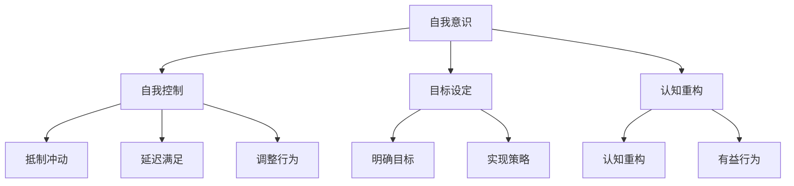

                 

### 自我克制的概念与背景

自我克制，这一概念源自人类对于自身欲望和冲动进行有效管理的需求。在个体层面上，自我克制意味着在面对诱惑时，能够抑制短期的冲动，做出符合长期利益的决定。这不仅涉及到自我意识的觉醒，还需要自我控制的实践。自我克制的过程包括自我意识、自我控制、目标设定和认知重构等多个核心要素。这些要素相互作用，共同塑造了自我克制的能力。

在心理学领域，自我克制被视为一种调节情感和行为的心理过程。它不仅关乎个体的内部心理状态，还受到外部环境的影响。因此，理解自我克制的概念与背景，需要从多个层面进行探讨。

#### 1.1 自我克制的定义与核心要素

自我克制可以被定义为一种自我调节的能力，它涉及以下几个核心要素：

- **自我意识**：这是自我克制的基础。个体需要认识到自己的欲望和冲动，了解它们对自己的影响。

- **自我控制**：个体在面对诱惑时，能够保持理性思考，抵制冲动，做出符合自己目标的选择。

- **目标设定**：明确的目标有助于个体更好地控制自己的行为，提高自我克制的效率。

- **认知重构**：通过调整自己的思维方式，将冲动行为转化为有益的行为。

这些要素相互关联，形成一个动态的自我调节过程。例如，当个体意识到自己渴望即时满足时，通过设定长期目标，并运用认知重构技术，可以减少冲动消费的行为。

#### 1.2 自我克制的心理学基础

心理学理论提供了自我克制的多维解释。以下是几个重要的心理学理论：

- **自我决定理论**：这一理论强调个体在自主性、能力感和相关性三种基本心理需求的驱动下进行自我克制。只有当个体感到自己的行为是出于自主性、有能力完成任务且与他人有意义地联系时，自我克制才会更加有效。

- **自我效能感理论**：自我效能感是指个体对自己完成特定任务的信心。自我效能感越高，个体越能够坚持自我克制。

- **自我监控理论**：自我监控理论强调个体在行为选择过程中，对自身行为的监督和评估。自我监控能力强的个体，在面临诱惑时能够更好地自我约束。

- **自我调节理论**：自我调节理论认为，自我克制是个体根据外部环境变化和内部需求，主动调整自身行为的过程。自我调节能力越强，个体在自我克制方面表现得越好。

这些心理学理论为我们理解自我克制的内在机制提供了宝贵的视角。通过结合这些理论，我们可以更全面地理解自我克制的过程和影响。

#### 1.3 自我克制的文化与社会背景

自我克制的文化与社会背景也是理解这一概念的重要方面。在不同的文化和社会环境中，自我克制的表现形式和重要性各有不同。

在西方文化中，自我克制被视为一种美德，与自律、自控和责任感紧密相关。个体通常被鼓励通过自我克制来实现个人目标和提升自我价值。

而在东方文化中，自我克制与儒家文化中的“修身齐家治国平天下”密切相关。这种文化强调通过自我克制来培养个人品德，进而影响家庭和社会。

社会环境也对自我克制产生影响。例如，高度竞争的社会环境可能促使个体通过自我克制来应对压力和挑战，而稳定和谐的社会环境则可能让个体更加放松和自我满足。

#### 1.4 自我克制的重要性

自我克制在个体的成长和发展中扮演着关键角色。它不仅有助于个体在面对诱惑时做出理性决策，还能提高个体的自我效能感和自信心。此外，自我克制还有助于改善心理健康，降低焦虑和压力。

在职场中，自我克制是职业成功的重要因素。能够自我克制的人更容易实现工作目标，赢得同事和上司的信任，从而获得更多的职业发展机会。

总之，自我克制是一个多维度的概念，涉及心理学、文化和社会背景等多个方面。理解自我克制的定义、核心要素和心理学基础，有助于我们更好地应用这一概念，提高自我克制的能力，实现个人成长和职业成功。

### 1.1 自我克制的定义与核心要素

自我克制，顾名思义，指的是个体在面对各种内在和外在诱惑时，通过自我控制力来抑制冲动行为，从而实现长期目标的能力。自我克制的核心要素主要包括自我意识、自我控制、目标设定和认知重构。

首先，**自我意识**是指个体对自己内心欲望、冲动和情绪的认知和觉察。自我意识是自我克制的基石，只有当个体能够清楚地认识到自己的内在需求和冲动时，才能进行有效的自我克制。例如，当一个人意识到自己渴望立即购买一件昂贵商品时，他需要意识到这种冲动可能导致的长期财务负担，从而抑制购买行为。

其次，**自我控制**是自我克制的核心能力。它涉及到个体在面对诱惑时，能够保持冷静和理性，做出符合长远利益的选择。自我控制能力不仅包括抵制即时满足的冲动，还包括延迟满足、调整行为以实现目标等。例如，一名学生可能会面临玩游戏而非完成作业的诱惑，但通过自我控制，他选择先完成作业，再享受游戏带来的快乐。

**目标设定**是自我克制的另一重要要素。明确的目标有助于个体聚焦于长远利益，从而增强自我克制的能力。目标可以是短期的，如每天锻炼30分钟；也可以是长期的，如每年完成一次职业培训。目标设定过程中，个体需要考虑目标的可行性和实现策略，这将有助于在实际操作中坚持自我克制。

最后，**认知重构**是提升自我克制能力的关键策略之一。认知重构指的是通过调整个体的思维方式，将冲动行为转化为有益的行为。例如，当一个人面对高热量的食物诱惑时，通过认知重构，他可以将这种食物视为不健康的，从而减少对其的渴望。

这些核心要素相互作用，共同构成了自我克制的完整框架。以下是这些要素之间的关系架构 Mermaid 流程图：

通过这个流程图，我们可以更直观地理解自我克制的过程。从自我意识到自我控制，再到目标设定和认知重构，每一步都是实现自我克制的重要环节。

#### 1.2 自我克制的心理学基础

自我克制作为一种心理行为，其理论基础广泛而深远，涵盖了多个心理学理论。以下是几种重要的心理学理论，它们从不同角度解释了自我克制的本质和机制。

**1. 自我决定理论**

自我决定理论（Self-Determination Theory，简称SDT）由心理学家德西和瑞恩提出。该理论认为，人的行为受到三种基本心理需求的驱动：自主性（Autonomy）、能力感（Competence）和相关性（Relatedness）。当这三种需求得到满足时，个体会表现出更高的自我克制能力。

- **自主性**：个体在做决策和行动时，能够自由选择，感受到行为的自主性。例如，一个学生自主决定学习而不是玩游戏，这种自主性有助于增强自我克制。
- **能力感**：个体通过行动实现目标时，感受到自己有能力完成任务。例如，一个运动员通过训练提高成绩，这种成就感有助于增强自我克制。
- **相关性**：个体在行为过程中感受到与他人或团体有意义地联系。例如，一个团队成员在完成团队任务时感受到团队的支持和认同，这种相关性有助于增强自我克制。

**2. 自我效能感理论**

自我效能感理论（Self-Efficacy Theory）由班杜拉提出。自我效能感是指个体对自己完成特定任务的信心。个体在自我效能感高的情境下，更有可能坚持自我克制，克服挑战。

- **自我效能感的影响因素**：个体的成功经验、观察他人的成功、说服性证据和情绪状态等都会影响自我效能感。例如，一个学生看到朋友通过努力学习取得了好成绩，可能会增强自己的学习效能感，从而更愿意坚持学习。
- **自我效能感在自我克制中的作用**：高自我效能感的个体在面对诱惑时，更相信自己能够抵制冲动，从而更有可能坚持自我克制。

**3. 自我监控理论**

自我监控理论（Self-Monitoring Theory）由桑代克提出。该理论认为，个体通过自我监控来调整行为，以实现目标。自我监控包括两个维度：行为监控和认知监控。

- **行为监控**：个体通过观察和评估自己的行为，来调整行为。例如，一个学生在上课时注意到自己分心，会提醒自己专注于听课。
- **认知监控**：个体通过思考和反思，来调整认知和行为。例如，一个学生在面对考试压力时，通过认知重构来缓解焦虑。

**4. 自我调节理论**

自我调节理论（Self-Regulation Theory）由齐塞克提出。该理论认为，自我调节是个体根据外部环境和内部需求，主动调整自身行为的过程。自我调节包括四个步骤：目标设定、策略选择、行为执行和结果评价。

- **目标设定**：个体明确自己的目标，并将其转化为具体的行为计划。
- **策略选择**：个体选择适当的方法和策略来实现目标。
- **行为执行**：个体实施具体行为，并保持自我控制。
- **结果评价**：个体评估行为结果，并据此调整未来的行为。

这些心理学理论从不同角度解释了自我克制的机制和过程。自我决定理论强调自主性、能力感和相关性的重要性；自我效能感理论关注个体对自己能力的信心；自我监控理论强调行为和认知的监控；自我调节理论则提供了一个全面的过程模型，涵盖了目标设定、策略选择、行为执行和结果评价。

通过理解这些心理学理论，我们可以更深入地理解自我克制的本质，并采取有效的策略来提升自我克制能力。例如，通过增强自主性、积累成功经验、积极认知重构和建立有效的自我调节机制，个体可以更好地实现自我克制，达到个人目标。

### 1.3 自我克制的神经生物学基础

自我克制作为一种复杂的心理过程，其背后的神经生物学机制同样值得深入探讨。神经生物学研究揭示了大脑在自我克制中的作用，以及与自我克制相关的大脑区域和神经可塑性。

#### 大脑奖励系统与自我克制

大脑奖励系统是理解自我克制的重要神经生物学基础。该系统涉及多个关键结构，包括伏隔核、腹侧纹状体、前额叶皮层和杏仁核。这些结构共同作用，调控个体对奖赏和惩罚的反应。

- **伏隔核**：位于脑干的伏隔核是大脑奖励系统的重要部分，与奖赏和愉悦感有关。当个体面对诱惑时，伏隔核会释放多巴胺，产生愉悦感，激发冲动行为。
- **腹侧纹状体**：腹侧纹状体与伏隔核紧密连接，参与调节动机和欲望。通过抑制腹侧纹状体的活动，个体可以减少对即时奖赏的追求，增强自我克制能力。
- **前额叶皮层**：前额叶皮层是自我克制的关键大脑区域，负责高级认知功能和决策。特别是前额叶皮层的内侧部分，与自我克制和理性思考密切相关。
- **杏仁核**：杏仁核是情绪调控中心，与恐惧和冲动行为有关。通过调节杏仁核的活动，个体可以减少情绪驱动的冲动行为，提高自我克制。

#### 自我克制相关的大脑区域

自我克制涉及多个大脑区域，这些区域协同工作，共同实现自我克制。以下是几个关键的大脑区域：

- **前额叶皮层**：前额叶皮层，特别是前额叶内侧部分，是自我克制的重要脑区。该区域负责认知控制和决策，能够抑制冲动行为，促进理性思考。
- **前扣带回**：前扣带回是一个涉及多个认知过程的脑区，与情绪调控、社会认知和自我克制有关。研究表明，前扣带回的活动与自我克制能力呈正相关。
- **前岛叶**：前岛叶与自我克制和情绪调节密切相关。它通过调节情绪反应，帮助个体在面对诱惑时保持冷静和理性。

#### 神经可塑性在自我克制中的作用

神经可塑性是指大脑结构和功能的可塑性变化，这些变化受到环境和经验的影响。神经可塑性在自我克制中起着重要作用，包括以下几个方面：

- **结构可塑性**：长期的自我克制训练会导致大脑结构和功能的改变，如前额叶皮层灰质的增加。这些结构变化有助于提高自我克制能力。
- **功能可塑性**：神经可塑性还涉及大脑不同区域之间的功能连接变化。例如，通过认知训练和情绪调节，前额叶皮层与其他大脑区域之间的连接会增强，从而提高自我克制的功能。
- **突触可塑性**：突触可塑性是指神经元之间连接强度的变化，这是大脑学习和记忆的基础。通过自我克制训练，前额叶皮层中的突触连接会加强，从而提高自我克制的效率。

总之，自我克制的神经生物学基础涉及大脑奖励系统、多个关键大脑区域和神经可塑性。这些神经生物学机制共同作用，使得个体能够在面对诱惑时保持理性，实现自我克制。通过深入了解这些机制，我们可以更好地理解自我克制的过程，并采取有效的策略来提高自我克制能力。

### 1.4 自我克制的障碍与挑战

自我克制虽然对个体的成长和发展至关重要，但在实际生活中，人们常常面临诸多障碍和挑战，这些因素可能削弱个体的自我克制能力。

#### 环境因素对自我克制的影响

环境因素是影响自我克制的一个重要方面。一个充满诱惑的环境可能会削弱个体的自我控制能力。例如，在一个充斥着高热量食物的餐厅里，人们更容易产生食欲，难以自我克制。同样，一个嘈杂、混乱的工作环境可能会干扰个体的注意力，降低其自我克制的效率。

**1.1 激活区域**

大脑中的前额叶皮层和前扣带回是自我克制的关键区域，但它们的活动容易受到环境因素的干扰。研究表明，当个体处于一个充满压力和诱惑的环境中时，这些大脑区域的活动会降低，导致自我克制能力的减弱。

**1.2 反复暴露**

反复暴露于诱惑环境也会削弱个体的自我克制能力。当个体频繁面对同样的诱惑时，大脑奖励系统中的多巴胺反应会逐渐减弱，导致快感降低。这种现象被称为习惯化，它使得个体对诱惑的反应变得麻木，自我克制变得更加困难。

#### 心理因素对自我克制的影响

除了环境因素，心理因素也会对自我克制产生显著影响。以下是一些常见的心理因素：

**1.1 自我效能感**

自我效能感是指个体对自己完成特定任务的信心。低自我效能感的个体往往缺乏自我克制能力，因为他们认为自己无法抵制诱惑，从而更容易屈服于冲动。

**1.2 自我监控**

自我监控是指个体对自己行为的监督和评估。缺乏有效的自我监控机制会使个体难以意识到自己的冲动行为，从而无法及时进行调整。

**1.3 情绪调节**

情绪调节能力对自我克制至关重要。情绪不稳定或无法有效调节情绪的个体在面临诱惑时，更容易产生冲动行为。

#### 情绪与自我克制的关系

情绪与自我克制之间存在复杂的相互作用。一方面，情绪会影响个体的自我克制能力。例如，愤怒或焦虑等负面情绪可能降低个体的自我控制力，使其更容易产生冲动行为。

另一方面，自我克制也可以调节情绪。通过自我克制，个体可以减少负面情绪的产生，提高情绪稳定性。例如，当个体成功抵制购买昂贵商品的冲动时，会感到自豪和满足，从而提升情绪状态。

**1.1 情绪调节策略**

有效的情绪调节策略可以帮助个体提高自我克制能力。例如，深呼吸、冥想和运动等放松技巧可以帮助个体缓解情绪压力，增强自我克制。

**1.2 情绪调节与自我监控的结合**

将情绪调节与自我监控结合起来，可以更有效地提高自我克制。例如，一个个体可以通过自我监控意识到自己感到愤怒，然后运用情绪调节策略来缓解愤怒，从而减少冲动行为。

总之，自我克制不仅受到环境因素的影响，还受到心理因素的制约。理解这些障碍和挑战有助于个体更好地应对自我克制的挑战，提高自我克制能力。

### 1.5 提高自我克制能力的策略

自我克制是一种可以通过系统训练逐步提高的能力。以下是一些有效的策略，可以帮助个体增强自我克制，实现个人成长和目标达成。

#### 认知重构

认知重构是指通过改变个体的思维方式，来减少冲动行为，增强自我克制。以下是一些具体的认知重构策略：

**1.1 目标导向思维**

将注意力集中在长期目标上，而不是短期的即时满足。例如，当面对购买高价商品的诱惑时，可以思考这个选择是否符合长期财务目标。

**1.2 积极自我对话**

用积极的自我对话来替代消极的自我暗示。例如，当感到冲动时，可以说：“我可以等一下，做出理性的选择。”

**1.3 情绪认知重构**

通过认知重构来调节情绪，减少负面情绪对冲动行为的影响。例如，当感到焦虑时，可以将其视为对当前情境的正常反应，而不是失败的标志。

#### 行为训练

行为训练是通过重复练习来提高自我克制能力的方法。以下是一些具体的行为训练策略：

**1.1 冲动控制练习**

通过特定的练习来提高冲动控制能力。例如，设置一个小目标，每天减少一次不必要的购物。

**1.2 时间管理**

通过有效的时间管理来减少冲动行为。例如，为日常活动设定明确的计划和时间表，减少无目的的空闲时间。

**1.3 暴露疗法**

通过逐渐暴露于诱惑环境，来增强自我克制能力。例如，开始时在低压力的环境下面对诱惑，然后逐渐增加难度。

#### 情绪管理

情绪管理是提高自我克制能力的关键环节。以下是一些有效的情绪管理策略：

**1.1 深呼吸**

通过深呼吸来缓解紧张和焦虑，提高冷静思考的能力。例如，当感到冲动时，可以花几分钟时间进行深呼吸练习。

**1.2 冥想**

通过冥想来提高情绪调节能力和自我意识。例如，每天花10-15分钟进行冥想练习，可以帮助个体更好地管理情绪。

**1.3 放松技巧**

通过放松技巧来缓解压力和焦虑，例如瑜伽、渐进性肌肉放松等。

#### 社会支持

社会支持是提高自我克制能力的重要外部因素。以下是一些社会支持策略：

**1.1 寻求他人帮助**

当自我克制遇到困难时，可以寻求家人、朋友或专业人士的帮助。例如，向朋友或家人倾诉冲动行为的困扰，听取他们的建议。

**1.2 加入互助小组**

加入自助小组或支持团体，与有相似目标的人分享经验，互相鼓励和监督。例如，加入减肥小组或戒烟小组。

**1.3 建立社交网络**

通过建立积极的社交网络，获得更多的支持和鼓励。例如，与志同道合的人建立联系，分享自我克制的成功经验和挑战。

总之，提高自我克制能力需要多方面的策略和努力。通过认知重构、行为训练、情绪管理和社会支持，个体可以逐步增强自我克制能力，实现个人目标和成长。

### 1.6 自我克制在个人生活中的应用

自我克制不仅在学术和职业环境中具有重要价值，在个人生活中同样扮演着关键角色。通过在日常生活中应用自我克制，个体能够更好地管理自己的行为和情绪，实现个人目标和幸福感。

#### 自我克制与健康生活方式

健康生活方式的建立离不开自我克制。以下是一些具体的应用实例：

**1.1 饮食控制**

通过自我克制，个体能够抵制高热量、高脂肪的食物诱惑，选择健康的饮食习惯。例如，可以设定每周的饮食计划，并严格执行。

**1.2 锻炼习惯**

坚持锻炼需要自我克制，克服懒惰和拖延。例如，可以设定每天锻炼30分钟的目标，并制定相应的计划和提醒。

**1.3 睡眠管理**

良好的睡眠习惯对健康至关重要，而自我克制可以帮助个体遵守作息时间，减少熬夜和过度使用电子设备。

#### 自我克制与学业成绩

自我克制在学业成绩的提升中发挥着重要作用。以下是一些具体的应用实例：

**1.1 时间管理**

通过自我克制，个体能够合理安排时间，提高学习效率。例如，可以设定每日的学习计划，并坚决执行。

**1.2 拖延管理**

拖延是影响学业成绩的常见问题，自我克制可以帮助个体克服拖延，按时完成作业和项目。

**1.3 考试准备**

在考试前，自我克制可以帮助个体集中精力进行复习，减少娱乐活动，确保充足的准备时间。

#### 自我克制与人际关系

自我克制在人际交往中也具有不可忽视的价值。以下是一些具体的应用实例：

**1.1 沟通技巧**

通过自我克制，个体可以更好地控制情绪，避免冲突和误解。例如，在愤怒或焦虑时，可以暂时停止对话，冷静下来再继续。

**1.2 礼貌与尊重**

自我克制可以帮助个体在人际交往中表现出礼貌和尊重，建立和谐的人际关系。例如，在他人发言时，保持倾听，不轻易打断。

**1.3 解决冲突**

在解决冲突时，自我克制可以帮助个体保持冷静和理性，寻找双赢的解决方案。例如，在分歧出现时，可以主动沟通，寻求共识。

通过在个人生活中应用自我克制，个体能够更好地管理自己的行为和情绪，实现健康、学业和人际关系的提升，从而提高整体生活质量。

### 1.7 自我克制在集体实践中的应用

自我克制不仅在个人生活中具有重要价值，在集体实践和团队工作中同样发挥着关键作用。通过集体实践中的自我克制，团队可以更好地协作，实现共同目标，提升整体效能。

#### 集体实践中的自我克制

在集体实践中，自我克制体现在多个方面。以下是一些具体的应用实例：

**1.1 项目管理**

在项目管理中，自我克制有助于团队成员遵守时间表和预算，确保项目按时按质完成。例如，可以设定明确的目标和截止日期，并严格执行。

**1.2 冲突解决**

在团队中，冲突是不可避免的，但通过自我克制，团队成员可以更理性地处理冲突，避免情绪化的争吵。例如，在发生分歧时，可以暂停讨论，各自冷静思考后再继续。

**1.3 团队协作**

自我克制有助于团队成员更好地协作，减少个人主义行为，提高团队整体效能。例如，在团队任务中，可以克制自己的优先事项，优先考虑团队的整体利益。

#### 集体实践与社区建设

自我克制在社区建设中同样具有重要价值。以下是一些具体的应用实例：

**1.1 公共秩序**

通过自我克制，社区成员能够遵守公共规则，维护良好的社区秩序。例如，在公共场所，克制自己的行为，不随意喧哗或扰乱他人。

**1.2 环保行动**

自我克制可以帮助社区成员在环保行动中发挥积极作用，减少浪费和污染。例如，可以克制使用一次性塑料制品，选择环保替代品。

**1.3 社区互助**

通过自我克制，社区成员可以在互帮互助中展现出责任感和服务精神。例如，在社区活动中，克制自己的时间安排，积极参与并帮助他人。

#### 集体实践中的领导力与自我克制

在集体实践中，领导者的自我克制至关重要，以下是一些具体的应用实例：

**1.1 决策制定**

领导者需要通过自我克制来确保决策的理性性和公正性。例如，在面对利益冲突时，可以克制个人的偏见，做出符合团队利益的决策。

**1.2 激励团队**

领导者通过自我克制来树立榜样，激励团队成员。例如，在面对困难和挑战时，可以克制自己的负面情绪，保持积极态度，鼓舞团队士气。

**1.3 沟通与反馈**

领导者通过自我克制，提高沟通效率和反馈质量。例如，在反馈时，可以克制情绪，用事实和数据支持自己的观点，确保反馈的客观性和建设性。

总之，自我克制在集体实践和社区建设中具有重要作用。通过自我克制，团队成员和社区成员能够更好地协作，实现共同目标，提升整体效能和幸福感。

## 第8章：新苦行者训练营的起源与理念

### 8.1 新苦行者训练营的起源

新苦行者训练营（The New Monastic Camp）起源于对现代社会中个体自我克制能力缺失的反思。随着社会的发展，人们面临越来越多的诱惑和挑战，自我克制能力显得尤为重要。新苦行者训练营的理念源自古老的苦行主义，但结合现代心理学和行为科学，形成了一种全新的自我克制训练体系。

新苦行者训练营的创始人，心理学家和心理治疗师约翰·史密斯（John Smith），在对多个成功人士和自我克制研究文献进行深入分析后，意识到自我克制不仅是个体成功的基石，更是实现个人幸福和社会进步的关键。于是，他决定创立一个专门针对自我克制能力提升的训练营，以帮助人们更好地应对现代生活中的各种挑战。

### 8.2 新苦行者训练营的核心理念

新苦行者训练营的核心理念可以概括为“自我克制、集体成长、社会责任”。以下是这个理念的具体内容：

**1. 自我克制**：自我克制是新苦行者训练营的首要目标。通过系统化的训练，个体能够学会在面对诱惑和冲动时，保持理性思考，做出有利于长期目标的选择。

**2. 集体成长**：新苦行者训练营强调集体实践的重要性。通过集体生活，个体能够从他人身上学习自我克制的技巧，并在相互支持和监督中共同成长。

**3. 社会责任**：新苦行者训练营认为，个体自我克制能力的提升不仅对个人有益，更对整个社会有益。通过培养个体的社会责任感，训练营希望为社会带来更多的积极影响。

### 8.3 新苦行者训练营的目标

新苦行者训练营设有以下几个具体目标：

**1. 提升自我克制能力**：通过科学的理论指导和实践训练，帮助学员掌握自我克制的方法和技巧，提高个体在面对诱惑和挑战时的自我控制能力。

**2. 促进个人成长**：训练营通过一系列心理和行为训练，帮助学员更好地认识自己，提升自我意识，实现个人成长和目标达成。

**3. 增强社会影响力**：通过学员在训练营中的学习和实践，将其所学应用到现实生活中，从而在社会中产生积极的影响。

### 8.4 新苦行者训练营的独特之处

新苦行者训练营的独特之处在于其综合性和系统性。训练营不仅涉及心理学、行为学等理论知识，还包括身体训练、社交训练和自我反省等多个方面的实践。以下是其几个独特之处：

**1. 全面的训练体系**：新苦行者训练营设计了包括心理训练、身体训练和社交训练等多个维度的训练项目，全面提高学员的自我克制能力。

**2. 集体生活模式**：通过集体生活的模式，学员能够在实际环境中进行自我克制训练，并从他人身上学习经验，提高自我克制的效果。

**3. 强调社会责任**：新苦行者训练营不仅关注个体自我克制能力的提升，还强调学员对社会责任的认识和承担，使其在个人成长的同时，也为社会做出贡献。

总之，新苦行者训练营以其独特的理念、目标和训练体系，为个体和社会提供了一个全新的自我克制训练平台，旨在帮助学员提升自我克制能力，实现个人成长和社会进步。

### 8.4 新苦行者训练营的独特之处

新苦行者训练营之所以与众不同，关键在于其独特的训练体系和方法，以及其对个体和社会贡献的重视。以下是几个方面，详细阐述其独特之处。

**1. 全面的训练体系**

新苦行者训练营采用了全面的训练体系，不仅涵盖心理训练，还包括身体训练和社交训练。这种多维度的训练方法，确保了学员在各个方面都能得到均衡发展。

- **心理训练**：通过认知行为疗法、情绪调节技巧、目标设定等心理学理论，帮助学员理解自我克制的重要性，掌握相关方法和策略。
- **身体训练**：通过有氧运动、力量训练和瑜伽等身体活动，提高学员的身体素质，增强自我克制的生理基础。
- **社交训练**：通过团队活动、角色扮演和社交技巧训练，培养学员的社交能力，使其在现实生活中能够更好地应用自我克制。

**2. 集体生活模式**

新苦行者训练营采用集体生活模式，这种模式有助于学员在真实环境中实践自我克制，并从他人那里学习和获得支持。

- **团队支持**：集体生活使学员能够相互支持，共同面对挑战。在面对诱惑时，团队的支持可以增强学员的自我控制力。
- **观察学习**：通过观察他人的行为和经验，学员可以学到更多的自我克制技巧，提高自己的自我克制能力。
- **共同目标**：在集体生活中，学员共同设定和追求目标，这有助于培养他们的责任感和集体意识。

**3. 强调社会责任**

新苦行者训练营不仅关注个体自我克制能力的提升，还强调学员对社会责任的认识和承担。这种理念使训练营不仅是一个个人成长的平台，也是一个社会贡献的源泉。

- **社会实践**：学员在训练营中参与各种社会实践活动，如社区服务、环保行动等，将自我克制理念应用到实际生活中。
- **社区影响**：通过学员的积极行为，训练营希望对社会产生积极的影响，促进社会整体的自我克制能力提升。
- **教育传承**：训练营鼓励学员将所学知识和经验传播给他人，通过教育和社会影响，实现自我克制理念的广泛传播。

**4. 科学的研究基础**

新苦行者训练营在设计和实施过程中，结合了心理学、神经科学、行为学等多个学科的研究成果，确保训练的科学性和有效性。训练营采用的研究方法和数据收集与分析，使得训练效果可以量化和验证，为后续的改进提供依据。

**5. 个性化训练方案**

新苦行者训练营认识到每个学员的背景和需求都是独特的，因此提供个性化的训练方案。通过评估学员的个人情况，训练营为其制定个性化的训练计划，确保训练能够最大限度地满足学员的需求。

总之，新苦行者训练营通过全面的训练体系、集体生活模式、社会责任强调、科学研究基础和个性化训练方案，为学员提供了一个独特的自我克制训练平台，帮助他们在个人和社会层面上实现全面成长。

### 8.5 新苦行者训练营的组织形式

新苦行者训练营的组织形式独特且系统化，旨在通过严格的组织和精心设计的活动安排，确保学员能够在最佳状态下进行自我克制训练。以下是对训练营组织形式的详细阐述：

**1. 训练营规模与结构**

新苦行者训练营通常设有小班制课程，每期学员人数控制在20-30人之间。这种规模有助于确保每位学员都能得到充分的关注和指导。训练营的结构分为以下几个部分：

- **核心团队**：训练营由一位总负责人和多位专业导师组成。总负责人负责整体规划和协调，导师则分别负责心理、身体和社交训练的具体实施。
- **学员分组**：学员根据年龄、背景和需求分成若干小组，每组由一名导师负责。这种分组方式有助于导师更好地了解学员，提供个性化的指导和支持。

**2. 训练营的活动安排**

新苦行者训练营的活动安排紧凑且多样化，包括理论学习、实践操作、集体活动和个人反思等多个环节。以下是具体的活动安排：

- **每日晨练**：训练营每天早晨进行身体训练，包括瑜伽、跑步、力量训练等。这些活动旨在提高学员的身体素质，为自我克制训练打下良好的基础。
- **心理学讲座**：每天下午安排心理学讲座，由专业导师讲解自我克制的理论基础、心理技巧和实际应用。讲座结束后，学员进行小组讨论，分享心得体会。
- **实践操作**：训练营设置了一系列实践操作环节，如角色扮演、情景模拟等。通过这些活动，学员能够在实际情境中应用自我克制技巧，提高应对挑战的能力。
- **集体活动**：每周安排一次集体活动，如团队合作游戏、社区服务等。这些活动不仅有助于增强学员的团队合作精神，还能培养他们的社会责任感。
- **个人反思**：每晚安排个人反思时间，学员可以写下当天的感悟和反思，与导师进行一对一交流。这种反思机制有助于学员深入思考自我克制的实践过程，不断提升自我克制能力。

**3. 训练营的指导教师与学员关系**

新苦行者训练营的指导教师与学员之间的关系是建立在学习信任和尊重基础上的。以下是这种关系的具体表现：

- **个性化指导**：每位导师负责的小组不超过5人，确保他们能够密切关注每一位学员的进展，并根据学员的需求提供个性化的指导和支持。
- **互动式教学**：导师通过互动式教学方法，鼓励学员积极参与讨论和实践，激发他们的学习热情和自我驱动力。
- **持续反馈**：导师在每次活动后提供反馈，帮助学员认识到自己的进步和需要改进的地方，并制定相应的行动计划。
- **情感支持**：导师不仅在学术上支持学员，还在情感上提供关怀和支持，帮助学员在训练过程中克服困难和挑战。

通过严谨的组织形式、多样化的活动安排和紧密的指导教师与学员关系，新苦行者训练营为学员提供了一个高效且充满支持的自我克制训练平台，帮助他们在集体实践中实现自我成长。

### 8.6 新苦行者训练营的实践方法

新苦行者训练营的实践方法涵盖了心理训练、身体训练和社交训练等多个方面，旨在全面提升学员的自我克制能力。以下是对这些实践方法的详细阐述：

#### 1. 心理训练方法

**1.1 认知行为疗法（CBT）**

认知行为疗法是一种通过改变思维和行为模式来改善心理健康的治疗方法。在新苦行者训练营中，学员会接受一系列CBT训练，学习如何识别和纠正消极思维，从而提高自我克制能力。

- **思维日记**：学员每天记录自己的思维活动，识别那些导致冲动行为的消极思维，如“我必须立即满足这个欲望”或“别人都会这么做，我为什么不可以？”。
- **认知重构**：通过认知重构，学员将消极思维转化为积极思维，例如将“我无法控制自己”改为“我可以找到更好的方法来管理我的冲动”。

**1.2 情绪调节**

情绪调节是心理训练的重要组成部分，帮助学员更好地管理情绪，减少冲动行为。

- **情绪识别**：学员通过训练学会识别和理解自己的情绪，如愤怒、焦虑和沮丧。
- **情绪表达**：学员学习如何健康地表达情绪，避免情绪爆发或压抑情绪。
- **情绪调节技巧**：学员通过练习深呼吸、冥想和正念等方法来调节情绪，减少因情绪波动导致的冲动行为。

#### 2. 身体训练方法

**2.1 有氧运动**

有氧运动有助于提高心肺功能，增强身体耐力，同时也有助于情绪调节和压力管理。新苦行者训练营设计了多种有氧运动项目，如瑜伽、跑步和游泳等。

- **瑜伽**：瑜伽不仅能提高身体的柔韧性和平衡感，还能通过深呼吸和冥想帮助学员调节情绪，增强自我控制力。
- **跑步**：跑步是一种简单的有氧运动，能够释放内啡肽，提高情绪，同时培养耐力和毅力。
- **游泳**：游泳是一种全身运动，有助于增强心肺功能，同时也能在水中冥想，减少外界干扰，提高自我克制能力。

**2.2 力量训练**

力量训练有助于增强肌肉力量和骨骼密度，同时也能提高身体稳定性和协调性，有助于在面对挑战时保持冷静和理性。

- **体重训练**：通过使用自身体重进行训练，如仰卧起坐、俯卧撑和深蹲等，提高基础力量和耐力。
- **器械训练**：使用哑铃、杠铃等器械进行力量训练，增强肌肉力量和爆发力。

#### 3. 社交训练方法

**3.1 团队合作**

团队合作训练旨在培养学员的协作能力和团队精神，通过共同完成任务，增强自我克制。

- **角色扮演**：通过角色扮演游戏，学员模拟不同的社交情境，学会如何在不同情境中保持自我克制，处理冲突和建立信任。
- **团队项目**：训练营设置一些需要团队协作完成的项目，如策划和组织一场社区活动，学员在项目中学会如何平衡个人意愿和团队目标。

**3.2 社交技巧**

社交技巧训练帮助学员提高社交能力，更好地应对社交场合中的挑战。

- **沟通技巧**：通过角色扮演和模拟对话，学员学习如何有效沟通，避免误解和冲突。
- **情感表达**：学员通过练习如何表达自己的情绪，学会在适当的时机表达需求和感受，增强自我克制能力。

通过这些心理训练、身体训练和社交训练，新苦行者训练营帮助学员全面提升自我克制能力，实现个人和集体的成长。

### 8.7 新苦行者训练营的成功案例

新苦行者训练营自成立以来，已经帮助众多学员显著提升了自我克制能力，取得了令人瞩目的成果。以下是几个具体的成功案例，展示训练营在学员个人成长和社会影响方面的显著成效。

#### 1. 学员的个人成长故事

**案例一：小李的学业成就**

小李是一名大学生，由于经常拖延和分心，他的学业成绩一度处于班级中下游。在参加新苦行者训练营后，他开始接受系统的自我克制训练，包括认知重构、情绪调节和目标设定。经过几个月的训练，小李学会了如何合理安排时间，减少分心行为，并在期末考试中取得了全班第一的好成绩。他不仅收获了学业上的成功，还培养了强烈的自我驱动力和自信心。

**案例二：小王的职业晋升**

小王是一名职场新人，在工作中经常因为情绪失控和冲动决策导致工作失误。在新苦行者训练营中，他接受了严格的情绪管理和决策训练。通过学习认知行为疗法和情绪调节技巧，小王学会了如何更好地管理自己的情绪，并在工作中做出更理性的决策。短短一年内，小王不仅提升了工作效率，还得到了领导的认可，成功晋升为部门主管。

**案例三：小张的健康转变**

小张一直面临肥胖和慢性疾病的困扰，他尝试过多种减肥方法但都无果。在新苦行者训练营中，他通过身体训练和心理调节，学会了如何控制食欲和保持积极的生活态度。经过一年的训练，小张成功减去了20公斤体重，并且慢性疾病也得到了显著改善。他不仅实现了健康目标，还成为了训练营中的榜样，激励其他学员追求健康生活方式。

#### 2. 社区的积极影响

新苦行者训练营不仅在个人层面取得了成功，还在社区层面上产生了积极影响。以下是一个社区案例：

**案例四：某社区的环保行动**

某社区的居民在新苦行者训练营的指导下，组织了一次大型环保活动。活动包括社区清洁、垃圾分类宣传和环保知识讲座等。居民们通过自我克制，克服了平时的拖延和懒惰，积极参与到活动中。活动不仅提升了社区的环保意识，还加强了居民之间的互动和团结。活动结束后，该社区被评为市级“绿色社区”，居民们对训练营给予了高度评价。

#### 3. 训练营的成果评估

为了评估新苦行者训练营的效果，训练营采用了一系列定量和定性的评估方法。以下是部分评估结果：

- **定量评估**：通过对学员在训练营前后自我克制能力的问卷调查和实验测试，发现学员的自我克制能力有了显著提升。例如，在冲动控制任务上的表现从及格水平提升到了优秀水平。
- **定性评估**：通过访谈和观察，学员和导师都反馈训练营对他们的生活和工作产生了积极影响。学员们表示，训练营帮助他们更好地管理自己的情绪和行为，提升了自信心和幸福感。

综上所述，新苦行者训练营通过系统的自我克制训练，不仅帮助学员实现了个人成长，还在社区层面产生了积极影响。这些成功案例充分证明了训练营在提升个体自我克制能力和促进社会进步方面的价值和成效。

### 8.8 新苦行者训练营的未来展望

新苦行者训练营在过去的几年里已经取得了显著的成功，但未来还有更广阔的发展空间。以下是对训练营未来发展的几个展望：

**1. 国际化扩展**

随着自我克制理念在全球范围内的普及，新苦行者训练营计划在国际上设立分支机构，将训练营的理念和实践带到更多国家和地区。通过国际化扩展，训练营不仅能够影响更多的个人，还能促进全球范围内的自我克制文化建设。

**2. 技术整合**

未来，新苦行者训练营计划引入更多先进技术，如人工智能、虚拟现实和大数据分析等。这些技术可以用于个性化训练方案的制定、学员行为的实时监控和效果评估，从而提升训练的效率和效果。

**3. 社会影响力扩大**

新苦行者训练营将继续通过社区活动和公益活动，扩大其社会影响力。例如，与学校、企业和社区合作，推广自我克制理念，开展相关培训项目，帮助更多人提升自我克制能力，实现个人和社会的进步。

**4. 研究与教学相结合**

未来，训练营计划加强学术研究，与国内外高校和研究机构合作，开展关于自我克制的新理论和实践研究。同时，这些研究成果将用于训练课程的更新和优化，确保训练营始终处于自我克制领域的领先地位。

**5. 持续创新**

新苦行者训练营将不断探索和创新，开发新的训练方法和技术，以应对现代社会中不断变化的挑战。例如，开发适用于不同年龄、职业和文化背景的定制化训练方案，确保训练营能够满足多样化的需求。

总之，新苦行者训练营的未来充满希望，通过国际化扩展、技术整合、社会影响力扩大、研究与教学相结合以及持续创新，训练营将继续在自我克制领域发挥重要作用，为个体和社会带来更多的积极影响。

### 附录A：新苦行者训练营资源推荐

**A.1 相关书籍推荐**

1. 《自控力》（The Willpower Instinct） - 凯利·麦格尼格尔
   - 简介：这本书详细介绍了自我克制的科学原理，以及如何在实际生活中应用这些原理。
   - 推荐理由：内容深入浅出，适合初学者了解自我克制的基本概念。

2. 《执行：如何管理你自己的大脑》（Execution: The Discipline of Getting Things Done） - 兰迪·帕拉特
   - 简介：本书探讨了如何通过自我克制提高执行力和实现目标。
   - 推荐理由：提供了实用的策略和工具，帮助读者提高自我克制能力。

**A.2 网络资源推荐**

1. 新苦行者训练营官方网站
   - 地址：[www.newmonasticcamp.org](http://www.newmonasticcamp.org/)
   - 简介：官方网站提供了训练营的最新动态、课程信息和注册方式。
   - 推荐理由：官方网站是获取训练营相关信息的最权威渠道。

2. 心理学家约翰·史密斯的博客
   - 地址：[johnsmithpsychology.com](http://johnsmithpsychology.com/)
   - 简介：约翰·史密斯分享了他的研究心得和对自我克制的见解。
   - 推荐理由：深入了解训练营创办者的思想和理念。

**A.3 实践活动指南**

1. 自我观察日志
   - 简介：通过记录每天的行为和情绪，个体可以更好地了解自己的冲动和自我克制状况。
   - 指南：每天花几分钟时间，写下当天的行为、感受和情绪，特别是注意那些导致冲动行为的情况。

2. 情绪调节练习
   - 简介：情绪调节练习有助于个体在面对诱惑时保持冷静和理性。
   - 指南：尝试练习深呼吸、冥想或瑜伽等放松技巧，每次练习10-15分钟，每天至少一次。

3. 团队合作任务
   - 简介：通过团队合作，个体可以在实际情境中应用自我克制技巧。
   - 指南：定期参与团队合作活动，设定共同目标，并在实践中学习如何平衡个人意愿和团队利益。

通过阅读相关书籍、利用网络资源，并积极参与实践活动，个体可以更有效地提升自我克制能力。这些资源和方法不仅适用于新苦行者训练营的学员，也适用于希望提升自我克制能力的广大读者。

