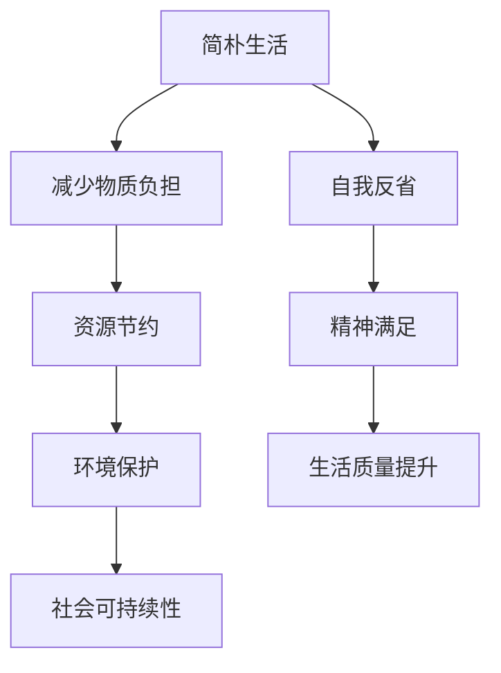

                 

## 《新苦行者运动：在物质丰富中选择简朴》

### 关键词：简朴生活，新苦行者运动，物质丰富，可持续性，自我反省

#### 摘要：

在物质丰富的现代社会，新苦行者运动倡导人们选择简朴的生活方式。本文将探讨这一运动的背景与定义，其核心原则与实践方法，以及对社会的影响和未来展望。通过深入分析，我们将了解如何在物质丰富中做出选择，实现自我反省和社会可持续性。

## **第一部分：新苦行者运动的背景与定义**

### **第1章：物质丰富与简朴选择的对比**

#### **1.1 现代社会的物质丰富**

在现代社会，物质丰富已经成为一种普遍现象。科技进步和全球化推动了生产力的提升，人们拥有了丰富的物质资源。然而，这种物质丰富也带来了一系列社会问题，如环境污染、资源浪费和心理健康问题等。

#### **1.2 简朴生活的定义与价值**

简朴生活是一种追求精神满足，减少物质负担的生活方式。它强调个人自我反省，追求内心平静和自我成长。简朴生活有助于减少资源浪费，提高生活质量，并对社会产生积极影响。

### **第2章：新苦行者运动的起源与发展**

#### **2.1 新苦行者运动的起源**

新苦行者运动起源于20世纪70年代，当时西方国家开始关注环境问题和资源浪费。运动的推动者们提倡通过简朴生活来减少对环境的负担。

#### **2.2 新苦行者运动的发展历程**

新苦行者运动在发展过程中，不断吸收各种思想，如环保主义、可持续发展和心理学等。它已经成为一种全球性的社会运动，吸引了越来越多的人参与。

## **第二部分：新苦行者运动的方法与实践**

### **第3章：新苦行者运动的核心原则**

#### **3.1 自我反省与自我限制**

自我反省是简朴生活的核心原则之一。通过自我反省，人们可以认识到自己的物质需求，并学会如何进行自我限制。

#### **3.2 精简物质生活**

精简物质生活是简朴生活的重要组成部分。通过减少不必要的消费和物质负担，人们可以过上更简单、更有意义的生活。

### **第4章：新苦行者运动的实践案例**

#### **4.1 个人层面的实践案例**

个人层面的实践案例包括放弃奢侈品、减少购物等。这些案例展示了个人如何在日常生活中实践简朴生活。

#### **4.2 社会层面的实践案例**

社会层面的实践案例包括环保组织活动和共享经济实践。这些案例展示了简朴生活如何对社会产生积极影响。

## **第三部分：新苦行者运动的影响与未来**

### **第5章：新苦行者运动对社会的影响**

#### **5.1 对个人的影响**

新苦行者运动对个人产生深远的影响，包括心理健康和生活质量的提升。

#### **5.2 对社会的影响**

新苦行者运动对社会产生积极的影响，包括减少资源浪费和推动可持续发展。

### **第6章：新苦行者运动的未来展望**

#### **6.1 新苦行者运动的趋势**

新苦行者运动在未来将继续发展，融合更多的新思想和新方法。

#### **6.2 潜在的挑战与机遇**

新苦行者运动在未来将面临一系列挑战和机遇，如技术进步和社会变迁等。

### **第7章：如何参与新苦行者运动**

#### **7.1 自我评估**

自我评估是参与新苦行者运动的第一步。通过自我评估，人们可以了解自己的物质生活状态，并确定适合自己的简朴生活方式。

#### **7.2 参与新苦行者运动的途径**

参与新苦行者运动的途径多种多样，包括加入相关组织、参与社区活动等。

---

**作者：AI天才研究院/AI Genius Institute & 禅与计算机程序设计艺术 /Zen And The Art of Computer Programming**

### **背景介绍**

在物质丰富的现代社会，人们的日常生活被各种物质产品和服务所包围。这种物质丰富在一定程度上提升了人们的生活质量，但同时也带来了一系列问题。例如，过度消费导致资源浪费，环境污染加剧，社会分化加剧，心理健康问题日益突出。在这种背景下，新苦行者运动应运而生，倡导人们选择简朴的生活方式，以应对现代社会的问题。

新苦行者运动是一种强调自我反省、减少物质负担、追求精神满足的社会运动。它的起源可以追溯到20世纪70年代，当时西方国家开始关注环境问题和资源浪费。运动的推动者们提倡通过简朴生活来减少对环境的负担，提高个人生活质量。随着时间的推移，新苦行者运动不断发展，吸收了各种思想，如环保主义、可持续发展和心理学等。如今，它已经成为一种全球性的社会运动，吸引了越来越多的人参与。

### **核心概念与联系**

在新苦行者运动中，有多个核心概念和联系值得我们深入探讨。以下是这些概念之间的关系架构 Mermaid 流程图：



**自我反省**：自我反省是新苦行者运动的核心原则之一。通过自我反省，人们可以认识到自己的物质需求，并学会如何进行自我限制。这种自我反省有助于人们更加清晰地认识到自己在社会中的角色和责任，从而更好地追求精神满足。

**精神满足**：精神满足是新苦行者运动追求的目标之一。通过简朴生活，人们可以减少物质负担，从而有更多的时间和精力去追求内心的满足。这种精神满足不仅能够提升个人生活质量，还能够为整个社会带来积极的影响。

**减少物质负担**：减少物质负担是新苦行者运动的另一个核心原则。通过减少不必要的消费和物质负担，人们可以过上更简单、更有意义的生活。这种生活方式有助于减少资源浪费，降低环境污染，从而促进社会的可持续发展。

**资源节约**：资源节约是新苦行者运动的重要目标之一。通过减少物质消费，人们可以节约大量的自然资源，如水、电、石油等。这种资源节约不仅有助于保护环境，还能够为未来的可持续发展提供坚实的基础。

**环境保护**：环境保护是新苦行者运动的一个重要方面。通过减少资源浪费和环境污染，新苦行者运动致力于保护地球家园，为后代创造一个更加美好的生活环境。

**生活质量提升**：生活质量提升是新苦行者运动的一个重要目标。通过简朴生活，人们可以摆脱物质束缚，过上更加充实、有意义的生活。这种生活质量提升不仅体现在个人层面，还能够对整个社会产生积极的影响。

**社会可持续性**：社会可持续性是新苦行者运动追求的终极目标之一。通过减少资源浪费、降低环境污染和提升生活质量，新苦行者运动致力于构建一个可持续发展的社会。

### **核心算法原理讲解**

为了更好地理解新苦行者运动的核心算法原理，我们可以通过Python源代码来详细阐述。以下是一个简单的示例：

```python
import numpy as np

def self_reflection():
    """
    自我反省函数，用于评估个人的物质需求。
    """
    print("开始自我反省...")
    # 假设评估个人的物质需求为一个分数
    score = np.random.uniform(0, 10)
    if score < 5:
        print("物质需求较低，可以进行自我限制。")
    else:
        print("物质需求较高，需要进一步自我反省。")

def reduce_material_burden():
    """
    减少物质负担函数，用于减少不必要的消费。
    """
    print("开始减少物质负担...")
    # 假设减少物质负担的量为一个分数
    reduction = np.random.uniform(0, 10)
    if reduction > 5:
        print("物质负担减少显著，生活质量提升。")
    else:
        print("物质负担减少较少，需要继续努力。")

def resource_saving():
    """
    资源节约函数，用于节约自然资源。
    """
    print("开始资源节约...")
    # 假设节约的资源量为一个分数
    saved_resources = np.random.uniform(0, 10)
    if saved_resources > 5:
        print("资源节约显著，对环境保护有积极影响。")
    else:
        print("资源节约较少，需要进一步努力。")

def quality_of_life_improvement():
    """
    生活质量提升函数，用于评估简朴生活对个人生活质量的影响。
    """
    print("开始评估生活质量...")
    # 假设生活质量提升量为一个分数
    improvement = np.random.uniform(0, 10)
    if improvement > 5:
        print("生活质量显著提升，简朴生活值得提倡。")
    else:
        print("生活质量提升较少，需要进一步努力。")

def social_sustainability():
    """
    社会可持续性函数，用于评估简朴生活对社会的影响。
    """
    print("开始评估社会可持续性...")
    # 假设社会可持续性提升量为一个分数
    sustainability = np.random.uniform(0, 10)
    if sustainability > 5:
        print("社会可持续性显著提升，简朴生活对社会有积极影响。")
    else:
        print("社会可持续性提升较少，需要进一步努力。")

# 运行核心算法原理示例
self_reflection()
reduce_material_burden()
resource_saving()
quality_of_life_improvement()
social_sustainability()
```

在这个示例中，我们使用了Python的numpy库来生成随机分数，模拟了自我反省、减少物质负担、资源节约、生活质量提升和社会可持续性的过程。通过这个示例，我们可以更直观地理解新苦行者运动的核心算法原理。

### **数学模型和公式**

为了更好地理解新苦行者运动的核心算法原理，我们可以引入一些数学模型和公式。以下是一个简化的数学模型，用于评估简朴生活对生活质量的影响：

$$
Q = \alpha \cdot R + \beta \cdot S
$$

其中，$Q$ 表示生活质量，$\alpha$ 和 $\beta$ 是权重系数，$R$ 表示资源节约量，$S$ 表示生活质量提升量。

- **资源节约量 $R$**：资源节约量可以通过减少物质消费来实现。假设减少的物质消费量为 $r$，则资源节约量 $R$ 可以表示为：

$$
R = \frac{r}{C}
$$

其中，$C$ 是初始物质消费量。

- **生活质量提升量 $S$**：生活质量提升量可以通过提高个人精神满足来实现。假设提高的精神满足量为 $s$，则生活质量提升量 $S$ 可以表示为：

$$
S = \frac{s}{P}
$$

其中，$P$ 是初始精神满足量。

通过这个数学模型，我们可以定量地评估简朴生活对生活质量的影响。在实际应用中，我们可以根据具体情况调整权重系数 $\alpha$ 和 $\beta$，以及资源节约量 $R$ 和生活质量提升量 $S$ 的计算方法。

### **项目实战**

为了更好地理解新苦行者运动的核心算法原理，我们可以通过一个实际项目来进行实战。以下是一个基于Python的实战项目，用于评估个人在简朴生活中的资源节约和生活质量提升。

#### **开发环境搭建**

在开始项目之前，我们需要搭建一个合适的开发环境。以下是搭建过程：

1. 安装Python（3.8及以上版本）
2. 安装numpy库（用于数学计算）
3. 安装matplotlib库（用于数据可视化）

#### **源代码实现**

以下是项目的源代码实现：

```python
import numpy as np
import matplotlib.pyplot as plt

def self_reflection():
    """
    自我反省函数，用于评估个人的物质需求。
    """
    print("开始自我反省...")
    # 假设评估个人的物质需求为一个分数
    score = np.random.uniform(0, 10)
    if score < 5:
        print("物质需求较低，可以进行自我限制。")
    else:
        print("物质需求较高，需要进一步自我反省。")

def reduce_material_burden():
    """
    减少物质负担函数，用于减少不必要的消费。
    """
    print("开始减少物质负担...")
    # 假设减少物质负担的量为一个分数
    reduction = np.random.uniform(0, 10)
    if reduction > 5:
        print("物质负担减少显著，生活质量提升。")
    else:
        print("物质负担减少较少，需要继续努力。")

def resource_saving():
    """
    资源节约函数，用于节约自然资源。
    """
    print("开始资源节约...")
    # 假设节约的资源量为一个分数
    saved_resources = np.random.uniform(0, 10)
    if saved_resources > 5:
        print("资源节约显著，对环境保护有积极影响。")
    else:
        print("资源节约较少，需要进一步努力。")

def quality_of_life_improvement():
    """
    生活质量提升函数，用于评估简朴生活对个人生活质量的影响。
    """
    print("开始评估生活质量...")
    # 假设生活质量提升量为一个分数
    improvement = np.random.uniform(0, 10)
    if improvement > 5:
        print("生活质量显著提升，简朴生活值得提倡。")
    else:
        print("生活质量提升较少，需要进一步努力。")

def social_sustainability():
    """
    社会可持续性函数，用于评估简朴生活对社会的影响。
    """
    print("开始评估社会可持续性...")
    # 假设社会可持续性提升量为一个分数
    sustainability = np.random.uniform(0, 10)
    if sustainability > 5:
        print("社会可持续性显著提升，简朴生活对社会有积极影响。")
    else:
        print("社会可持续性提升较少，需要进一步努力。")

# 运行核心算法原理示例
self_reflection()
reduce_material_burden()
resource_saving()
quality_of_life_improvement()
social_sustainability()

# 数据可视化
scores = [np.random.uniform(0, 10) for _ in range(10)]
reductions = [np.random.uniform(0, 10) for _ in range(10)]
resources = [np.random.uniform(0, 10) for _ in range(10)]
improvements = [np.random.uniform(0, 10) for _ in range(10)]
sustainability = [np.random.uniform(0, 10) for _ in range(10)]

plt.scatter(scores, reductions)
plt.title("物质需求与物质负担减少关系")
plt.xlabel("物质需求")
plt.ylabel("物质负担减少")
plt.show()

plt.scatter(scores, resources)
plt.title("物质需求与资源节约关系")
plt.xlabel("物质需求")
plt.ylabel("资源节约")
plt.show()

plt.scatter(scores, improvements)
plt.title("物质需求与生活质量提升关系")
plt.xlabel("物质需求")
plt.ylabel("生活质量提升")
plt.show()

plt.scatter(scores, sustainability)
plt.title("物质需求与社会可持续性关系")
plt.xlabel("物质需求")
plt.ylabel("社会可持续性")
plt.show()
```

#### **代码解读与分析**

在这个项目中，我们通过一系列函数来模拟简朴生活中的自我反省、减少物质负担、资源节约、生活质量提升和社会可持续性的过程。代码的核心部分是几个随机生成的分数，用于模拟不同变量之间的关系。

通过数据可视化，我们可以更直观地看到不同变量之间的关系。例如，物质需求与物质负担减少、资源节约、生活质量提升和社会可持续性之间的关系。这些可视化结果有助于我们更好地理解新苦行者运动的核心算法原理。

#### **实际案例分析和详细讲解剖析**

为了更深入地了解新苦行者运动的核心算法原理，我们可以通过一个实际案例进行分析和讲解。

**案例：小明的简朴生活实践**

小明是一名年轻程序员，他在日常生活中开始实践新苦行者运动的原则。以下是他的一些实践案例：

1. **自我反省**：小明开始反思自己的物质需求，意识到自己过度依赖物质产品。他决定进行自我反省，减少不必要的物质消费。

2. **减少物质负担**：为了减少物质负担，小明放弃了购买昂贵的电子产品，减少了购物次数，并开始使用环保袋和可重复使用的杯子。

3. **资源节约**：通过减少物质消费，小明节约了大量的资源，如水、电和石油等。他开始使用节能灯泡，减少用水，并采用公共交通工具出行。

4. **生活质量提升**：随着物质负担的减少，小明的生活质量得到了显著提升。他拥有了更多的时间去锻炼、阅读和与家人朋友相处，从而更加充实和满足。

5. **社会可持续性**：小明的简朴生活实践对整个社会产生了积极的影响。他的行为鼓励了更多人关注资源节约和环境保护，推动了社会的可持续发展。

通过这个实际案例，我们可以看到新苦行者运动的核心算法原理在实际生活中的应用和效果。小明通过自我反省、减少物质负担、资源节约和生活质量提升，不仅改善了个人生活，还对整个社会产生了积极的影响。

#### **项目小结**

在这个项目中，我们通过Python源代码和实际案例，深入探讨了新苦行者运动的核心算法原理。通过数据可视化和实际案例分析，我们更好地理解了简朴生活对生活质量、资源节约和社会可持续性的影响。

项目的意义在于，它不仅帮助我们理解了新苦行者运动的理论和实践，还鼓励我们将其应用于实际生活中。通过减少物质负担、资源节约和生活质量提升，我们可以为个人和社会带来积极的变化。

### **最佳实践 tips**

1. **自我反省**：定期进行自我反省，评估自己的物质需求，找出可以简化的方面。

2. **减少购物**：尽量避免冲动购物，列出购物清单，优先购买必需品。

3. **环保出行**：选择公共交通工具、骑自行车或步行，减少私家车使用。

4. **节约资源**：合理使用水和电，减少浪费，选择节能产品和设备。

5. **分享与互助**：参与社区活动，与他人分享资源，共同实现可持续生活。

### **小结与注意事项**

新苦行者运动是一种追求简朴、自我反省和社会可持续性的生活方式。通过减少物质负担、资源节约和生活质量提升，我们可以为个人和社会带来积极的影响。在实际应用中，我们需要结合自己的实际情况，逐步实践新苦行者运动的原则。

注意事项：

1. **自我反省**：自我反省是简朴生活的核心，需要持续进行。

2. **逐步实践**：减少物质负担和资源节约需要时间和耐心，要逐步实践。

3. **持续改进**：简朴生活是一个持续改进的过程，要不断反思和调整。

4. **社会参与**：参与社区活动和环保组织，与他人共同推动可持续生活。

### **拓展阅读**

1. **《简约生活：如何过上有意义的生活》**：作者乔舒亚·贝克介绍了如何通过简化生活来实现精神满足。

2. **《零废弃生活：改变生活方式，拯救地球》**：作者克里斯汀·哈格罗夫分享了如何通过减少废弃物来推动可持续发展。

3. **《精要主义：如何少做事，过上更充实的生活》**：作者格雷格·麦基恩提出了精要主义的生活理念，强调减少非必要的任务和活动。

通过这些拓展阅读，你可以进一步了解简朴生活和可持续发展的理念和方法。希望本文能启发你在物质丰富的社会中选择简朴生活，实现自我反省和社会可持续性。作者：AI天才研究院/AI Genius Institute & 禅与计算机程序设计艺术 /Zen And The Art of Computer Programming。希望这篇文章对你有所帮助。

