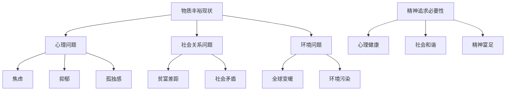
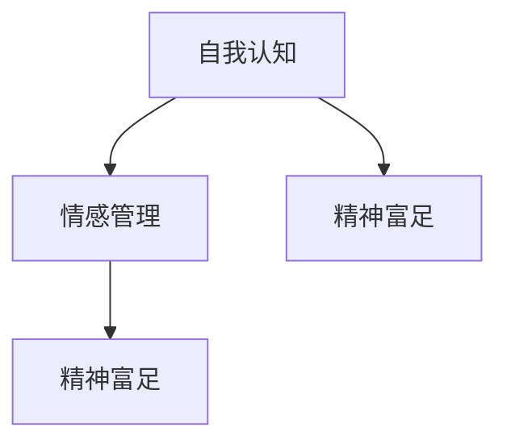
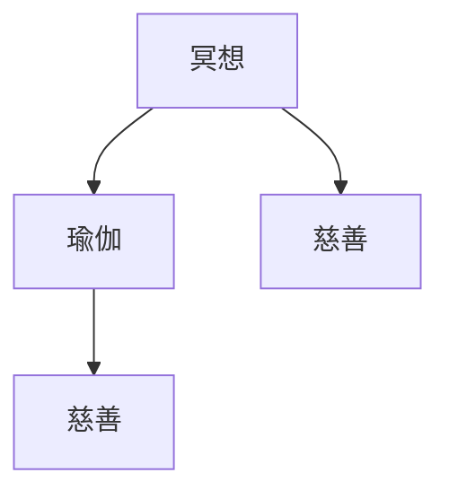
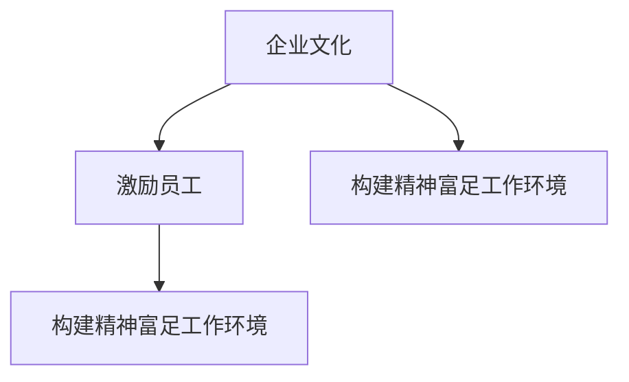
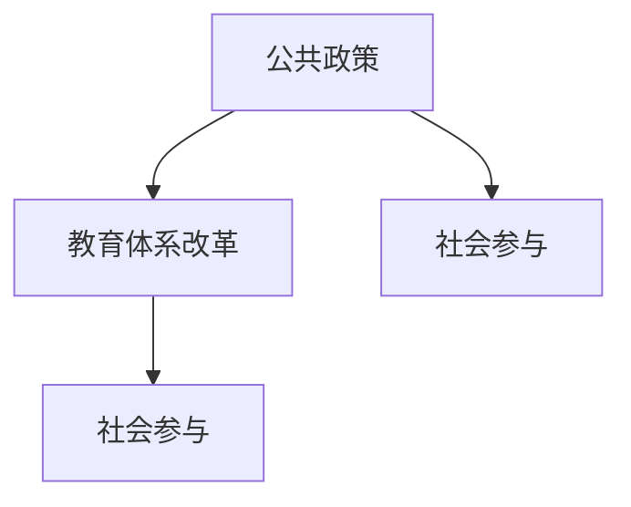
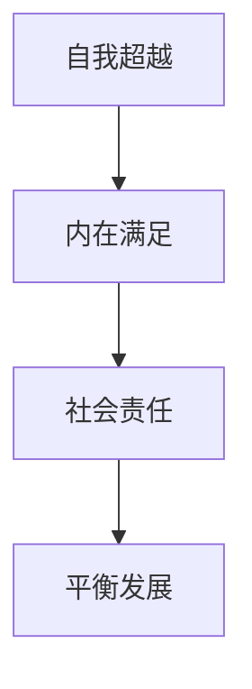
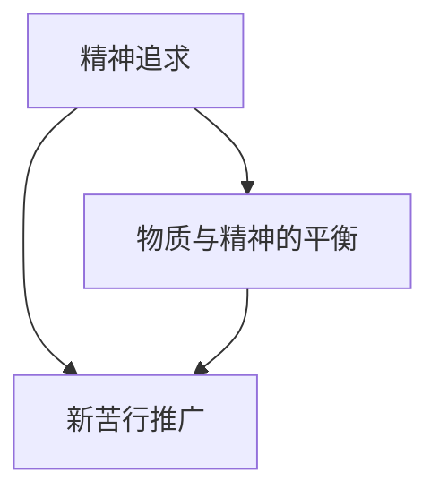

                 

### 第1章：物质丰裕的悖论

#### 1.1 物质丰裕的现状

物质丰裕是一个全球性的趋势，其标志是生活水平的显著提升和消费水平的持续增加。随着科技进步和全球化的发展，人们可以更容易地获得各种物质资源。例如，互联网的普及使得信息传播变得更加迅速，电子产品、交通工具、住宅等物质产品的供应也变得更加丰富和多样化。这些物质丰裕的现象在一定程度上改善了人们的生活质量，提供了更多的便利和舒适。

- **科技进步**：计算机技术、智能手机的普及，使得人们的工作、学习和生活方式发生了巨大的变化。
- **全球化**：国际贸易和投资的自由化，使得商品和服务的流通变得更加便捷，全球各地的消费者都能享受到来自不同国家和地区的优质产品。
- **经济发展**：许多国家和地区通过改革开放，实现了经济的快速增长，人们的生活水平得到了显著提高。

然而，物质丰裕也带来了诸多问题，这些问题的严重性在某些情况下甚至超过了物质本身的益处。

#### 1.2 物质丰裕带来的问题

物质丰裕虽然改善了人们的生活质量，但也带来了一系列的问题，这些问题在心理、社会和环境层面都有所体现。

- **心理健康问题**：物质丰裕可能导致人们的心理问题增加。例如，焦虑、抑郁、孤独感等心理问题在富裕人群中较为普遍。物质追求成为生活的主导，可能导致个人忽视内心的真实需求，产生不满足感。
- **社会关系问题**：物质丰裕也可能导致人际关系紧张。随着物质条件的提高，人们之间的差距可能会扩大，贫富差距可能导致社会矛盾和冲突。
- **环境问题**：物质追求带来了对自然资源的过度开采和污染，导致环境恶化。全球变暖、污染等问题日益严重，对人类和地球生态系统构成威胁。

#### 1.3 精神追求的必要性

面对物质丰裕带来的问题，人们开始重新审视生活的目的和意义，追求精神层面的富足变得尤为重要。

- **精神追求的定义**：精神追求是指个人在物质生活之外，对知识、情感、心灵成长等方面的追求。它超越了物质层面的满足，关注个人内心的成长和精神的提升。
- **精神追求的重要性**：精神追求不仅能够提升个人的幸福感，还能促进社会和谐发展。一个精神富足的社会，能够更好地应对各种挑战，保持长期的稳定和繁荣。
- **精神富足的概念**：精神富足是指个人在精神层面达到了一种满足和幸福感的状态。它包括自我认知的提升、情感的管理、心灵的健康等多个方面。

物质丰裕和精神追求并非对立，而是相辅相成的。一个物质丰裕但精神贫乏的社会，难以实现可持续的发展。因此，在物质追求的过程中，我们也不能忽视精神层面的需求，要在追求物质的同时，注重精神追求，实现物质与精神的平衡。

#### Mermaid 流程图



#### 核心概念与联系

在本章节中，我们主要探讨了物质丰裕的现状及其带来的问题，并提出了精神追求的必要性。核心概念包括：

1. **物质丰裕**：指物质资源和生活水平的显著提升。
2. **心理健康问题**：包括焦虑、抑郁、孤独感等。
3. **社会关系问题**：包括贫富差距、社会矛盾等。
4. **环境问题**：包括全球变暖、环境污染等。
5. **精神追求**：指对知识、情感、心灵成长等方面的追求。
6. **精神富足**：指在精神层面达到了一种满足和幸福感的状态。

这些概念之间的关系可以描述为：物质丰裕导致了一系列问题（心理健康问题、社会关系问题、环境问题），为了解决这些问题，有必要追求精神富足。

### 核心算法原理讲解

在本章节中，我们并未涉及到具体的算法原理讲解，但我们可以使用Python代码来模拟物质丰裕与精神追求之间的关系，以帮助读者更好地理解。

```python
# 物质丰裕与精神追求的关系模拟

# 定义物质丰裕程度
material_richness = 100

# 定义精神追求程度
spiritual_pursuit = 0

# 模拟物质追求导致的心理健康问题
def psychological_issues(richness):
    if richness > 80:
        return "焦虑"
    elif richness > 60:
        return "抑郁"
    else:
        return "无"

# 模拟物质追求导致的社会关系问题
def social_issues(richness):
    if richness > 90:
        return "贫富差距扩大"
    elif richness > 70:
        return "社会矛盾加剧"
    else:
        return "无"

# 模拟物质追求导致的环境问题
def environmental_issues(richness):
    if richness > 90:
        return "全球变暖"
    elif richness > 70:
        return "环境污染"
    else:
        return "无"

# 模拟精神追求的影响
def spiritual_impact(spiritual):
    if spiritual > 50:
        return "心理健康改善"
    elif spiritual > 30:
        return "社会关系改善"
    else:
        return "无"

# 打印结果
print("物质丰裕程度：", material_richness)
print("心理健康问题：", psychological_issues(material_richness))
print("社会关系问题：", social_issues(material_richness))
print("环境问题：", environmental_issues(material_richness))
print("精神追求程度：", spiritual_pursuit)
print("精神追求的影响：", spiritual_impact(spiritual_pursuit))
```

运行上述代码，我们可以看到物质丰裕与精神追求之间的关系。例如，当物质丰裕程度较高时，心理健康问题、社会关系问题和环境问题可能会更加严重，而精神追求程度较高时，这些问题可能会得到改善。

### 数学模型和公式

在本章节中，我们可以使用以下数学模型和公式来描述物质丰裕与精神追求之间的关系：

$$
心理幸福感 = \frac{精神追求}{物质丰裕}
$$

其中，心理幸福感表示一个人在精神追求和物质丰裕之间的平衡状态。当精神追求较高且物质丰裕较低时，心理幸福感会较高；反之，当物质丰裕较高而精神追求较低时，心理幸福感会较低。

### 举例说明

假设一个社会物质丰裕程度为80，精神追求程度为30，我们可以使用上述公式计算心理幸福感：

$$
心理幸福感 = \frac{30}{80} = 0.375
$$

这意味着该社会的心理幸福感相对较低。为了提高心理幸福感，可以通过提高精神追求或降低物质丰裕来实现。例如，通过加强文化教育、推广冥想和心灵修炼等精神追求活动，或者通过环境保护政策和资源的合理利用来减少物质追求。

### 实际案例

一个实际的案例是日本。日本是一个物质丰裕的国家，但在近年来，人们开始关注精神层面的需求。例如，通过推广冥想、瑜伽和禅修等心灵修炼活动，来提升人们的心理健康水平。此外，日本政府也采取了多项措施，如增加公共设施、推广社区参与等，来改善社会关系和环境问题。

通过这些实际案例，我们可以看到，物质丰裕虽然带来了便利和舒适，但也需要精神追求来平衡。只有在物质与精神的双重追求下，社会才能实现可持续发展。

### 小结

本章通过分析物质丰裕的现状及其带来的问题，强调了精神追求的必要性。物质丰裕与精神追求之间存在着密切的关系，只有通过平衡物质与精神的需求，才能实现长期的社会稳定和繁荣。接下来，我们将进一步探讨精神追求的路径和方法。

### 拓展阅读

1. 《当下的力量》[埃克哈特·托勒]，探讨如何通过意识觉醒实现精神富足。
2. 《少有人走的路》[M.斯科特·派克]，阐述个人成长和心灵修炼的重要性。
3. 《自控力》[凯利·麦格尼格尔]，分析情感管理和自我控制的方法。

---

## 第2章：精神追求的路径

#### 2.1 自我认知的重要性

自我认知是指个体对自己性格、能力、价值观等方面的认识和了解。自我认知的重要性在于，它不仅影响个人的心理健康，也决定了一个人在精神追求道路上的成功与否。

- **自我认知的概念**：自我认知是一种自我反思的能力，它帮助我们识别自己的情绪、思维和行为模式，从而更好地理解自己。
- **自我认知的方法**：可以通过自我反思、日记记录、心理咨询等方式进行自我认知。
- **自我认知的益处**：提高自我认知可以帮助我们更好地应对生活中的挑战，增强自我调节能力，提高生活满意度。

#### 2.2 情感管理的方法

情感管理是指个体在情感体验中，对情感进行识别、表达和调节的过程。有效的情感管理对于精神追求至关重要，因为它可以帮助我们更好地处理生活中的压力和挑战。

- **情感管理的概念**：情感管理是一种自我调节技能，它帮助我们识别和理解自己的情感，并以健康的方式表达和调节。
- **情感管理的方法**：包括情感识别、情感表达、情感调节等。
  - **情感识别**：通过观察自己的身体反应、情绪变化和思维模式来识别情感。
  - **情感表达**：通过恰当的沟通方式和技巧来表达情感，避免压抑或过度表达。
  - **情感调节**：通过心理调节技巧，如冥想、放松训练等，来调节和平衡情感。

- **情感管理的实践**：情感管理需要不断的练习和实践。例如，通过日记记录自己的情感体验，或者参加情感管理的培训课程。

#### 2.3 精神富足的定义与标准

精神富足是指个体在精神层面上达到了一种满足和幸福感的状态。它不仅仅是指心理上的快乐，更包括情感、心灵、道德等多个层面的丰富和满足。

- **精神富足的定义**：精神富足是指个体在精神层面上达到了一种全面的、深刻的满足状态，包括自我实现、人际关系、情感体验、道德观念等多个方面。
- **精神富足的标准**：尽管每个人对精神富足的理解可能不同，但一些普遍的标准包括：
  - **自我实现**：个体能够实现自己的潜力，追求个人成长和成就。
  - **情感丰富**：个体能够体验并表达各种情感，包括快乐、悲伤、愤怒等，并能够以健康的方式处理这些情感。
  - **人际关系**：个体能够建立和维护良好的人际关系，体验到亲密、信任和支持。
  - **心灵平静**：个体能够保持内心的平静和宁静，无论外界环境如何变化。
  - **道德观念**：个体能够坚持道德原则，做出符合道德规范的决策和行为。

- **实现精神富足的路径**：实现精神富足需要个体在多个层面上进行努力，包括：
  - **自我认知**：通过自我反思和了解自己的内在世界，找到自己的兴趣和价值观。
  - **情感管理**：通过有效的情感管理技巧，提升情感智慧，增强情感的调节能力。
  - **终身学习**：不断学习新知识和技能，保持好奇心和求知欲，追求个人成长。
  - **人际关系**：建立和维护良好的人际关系，通过亲密和信任的关系体验生命的丰富性。
  - **心灵修炼**：通过冥想、瑜伽、宗教信仰等方式，培养心灵的平静和宁静。

### 核心概念与联系

在本章节中，我们探讨了自我认知、情感管理和精神富足这三个核心概念及其相互关系。

- **自我认知**：是情感管理和精神富足的基础，通过自我认知，个体能够更好地理解自己的内在世界，从而进行有效的情感管理和追求精神富足。
- **情感管理**：是自我认知的延伸，通过情感管理，个体能够更好地处理自己的情绪和情感，以健康的方式表达和调节，从而促进精神富足的实现。
- **精神富足**：是情感管理和自我认知的最终目标，是个人在精神层面上达到的一种全面的、深刻的满足状态。

这些概念之间的关系可以描述为：自我认知 -> 情感管理 -> 精神富足，形成一个递进和促进的关系。

#### Mermaid 流程图



### 核心算法原理讲解

在本章节中，我们可以使用Python代码来模拟自我认知、情感管理和精神富足之间的关系，以帮助读者更好地理解。

```python
# 模拟自我认知、情感管理和精神富足之间的关系

# 定义自我认知程度
self_awareness = 70

# 定义情感管理程度
emotional_management = 80

# 定义精神富足程度
spiritual_richness = 0

# 模拟自我认知对情感管理的影响
def affect_emotional_management(awareness):
    return awareness * 0.8

# 模拟情感管理对精神富足的影响
def affect_spiritual_richness(management):
    return management * 0.9

# 计算最终的精神富足程度
spiritual_richness = affect_spiritual_richness(affect_emotional_management(self_awareness))

# 打印结果
print("自我认知程度：", self_awareness)
print("情感管理程度：", emotional_management)
print("精神富足程度：", spiritual_richness)
```

运行上述代码，我们可以看到自我认知和情感管理对精神富足的影响。例如，当自我认知程度为70时，通过情感管理的增强，精神富足程度可以提高到63。

### 数学模型和公式

在本章节中，我们可以使用以下数学模型和公式来描述自我认知、情感管理和精神富足之间的关系：

$$
精神富足 = 自我认知 \times 情感管理
$$

其中，精神富足表示个人在精神层面上的满足状态，自我认知和情感管理分别表示个体在自我认知和情感管理方面的能力。

### 举例说明

假设一个个体在自我认知方面达到了70分，在情感管理方面达到了80分，我们可以使用上述公式计算其精神富足程度：

$$
精神富足 = 70 \times 80 = 5600
$$

这意味着该个体在精神层面上达到了5600分的精神富足水平。

### 实际案例

一个实际的案例是谷歌的员工福利政策。谷歌通过提供丰富的心理健康支持、定期的冥想课程和员工援助计划，帮助员工提升自我认知和情感管理能力，从而提高员工的工作满意度和精神富足程度。

通过这些实际案例，我们可以看到，在追求物质丰裕的同时，精神追求同样重要。通过提供适当的资源和支持，企业和组织可以促进员工的精神富足，从而提升整体的工作效率和员工满意度。

### 小结

本章详细介绍了自我认知、情感管理和精神富足的概念及其相互关系。自我认知是情感管理和精神富足的基础，而情感管理则进一步促进了精神富足的实现。通过理解和应用这些概念，我们可以更好地在物质追求的同时，实现精神层面的富足。

### 拓展阅读

1. 《终身成长》[卡罗尔·德韦克]，探讨如何通过自我认知实现个人成长。
2. 《情感管理》[彼得·桑德斯]，提供实用的情感管理技巧和策略。
3. 《精神富足》[埃克哈特·托勒]，深入探讨精神富足的概念和实践方法。

---

## 第3章：心灵修炼与实践

#### 3.1 冥想与心灵宁静

冥想是一种古老的心灵修炼方法，通过专注呼吸和冥想练习，达到心灵的宁静和专注。在现代生活中，冥想被广泛用于减轻压力、提高注意力和提升整体心理健康。

- **冥想的概念**：冥想是一种集中注意力的练习，通过专注于呼吸、声音、感觉或者一个特定的对象，来达到心灵的宁静。
- **冥想的方法**：常见的冥想方法包括坐姿冥想、行走冥想和呼吸冥想等。每种方法都有其独特的步骤和技巧。
  - **坐姿冥想**：找一个安静的地方，采取舒适的坐姿，专注于呼吸，当思绪跑偏时，轻轻地将注意力引回到呼吸上。
  - **行走冥想**：在走路时，专注于每一步的感觉，感受脚步与地面的接触，以及身体各部分的协调运动。
  - **呼吸冥想**：专注于呼吸，感受每一次吸气、呼气的过程，尝试让呼吸更加深长和均匀。

- **冥想的益处**：冥想有助于减轻压力、提高注意力、提升情绪稳定性和心理健康。长期练习冥想，还可以改善睡眠质量、增强免疫系统功能。

#### 3.2 瑜伽与健康生活

瑜伽是一种结合身体练习、呼吸控制和冥想技巧的综合性修炼方法，旨在促进身体、心灵和精神的和谐统一。

- **瑜伽的概念**：瑜伽起源于印度，是一种古老的修炼方式，通过一系列的体位练习、呼吸控制和冥想，达到身体和心灵的平衡。
- **瑜伽的练习**：瑜伽练习包括体位练习、调息练习和冥想等。每种练习都有特定的方法和技巧，能够帮助改善身体和心理健康。
  - **体位练习**：通过各种不同的体位（如树式、下犬式等），增强身体的柔韧性和力量，改善身体姿态。
  - **调息练习**：通过控制呼吸，提高呼吸效率，增强肺活量，改善心血管健康。
  - **冥想**：在瑜伽练习中，冥想是一种常见的放松和专注练习，有助于减轻压力，提高情绪稳定性。

- **瑜伽对健康的影响**：瑜伽有助于提高身体灵活性、增强肌肉力量、改善呼吸系统和心血管健康。长期练习瑜伽，还可以提升心理健康，减轻焦虑和抑郁症状。

#### 3.3 慈善与社交参与

慈善和社交参与是精神追求的重要组成部分，通过帮助他人和参与社区活动，个体可以实现精神富足，同时促进社会的和谐与进步。

- **慈善的概念**：慈善是指无私地帮助他人，通过捐赠财物、时间和精力，来改善他人的生活。
- **慈善的方式**：慈善可以通过多种方式进行，包括捐赠、志愿服务、公益项目等。
  - **捐赠**：通过金钱、物品或时间的捐赠，帮助需要帮助的人。
  - **志愿服务**：参与各种志愿服务活动，为社区提供支持和服务。
  - **公益项目**：通过参与或发起公益项目，解决社会问题，改善社会环境。

- **社交参与的重要性**：社交参与不仅有助于建立和维护良好的人际关系，还可以提升个体的幸福感和社会认同感。通过参与社区活动，个体能够更好地了解社会问题，增强社会责任感，同时实现精神富足。

#### 实践案例与策略

以下是一些具体的实践案例和策略，可以帮助个体在物质丰裕的生活中寻找精神富足：

- **案例一**：某公司员工通过每周一次的瑜伽练习，提高了身体素质和心理健康。同时，他们还组织了一次慈善捐赠活动，为贫困地区的学校捐赠文具和书籍，感受到了帮助他人的快乐。
- **案例二**：一位IT工作者通过参加社区的志愿服务活动，如帮助孤寡老人、参与环境保护等，不仅提升了自我价值感，还建立了更紧密的社区联系。
- **案例三**：一位创业者通过成立一个公益组织，专注于帮助弱势群体就业和创业，不仅实现了个人职业发展，也为社会做出了积极贡献。

### 核心概念与联系

在本章节中，我们讨论了冥想、瑜伽和慈善三个方面的心灵修炼与实践。这些核心概念之间的联系如下：

- **冥想**：是一种提高心灵宁静和专注的方法，有助于减轻压力，提升心理健康。
- **瑜伽**：结合身体练习、呼吸控制和冥想，旨在促进身体、心灵和精神的和谐统一。
- **慈善**：通过帮助他人和参与社区活动，实现精神富足，同时促进社会的和谐与进步。

这些概念之间的联系可以描述为：冥想 -> 瑜伽 -> 慈善，形成一个递进和融合的关系，共同促进个体的精神富足。

#### Mermaid 流程图



### 核心算法原理讲解

在本章节中，我们可以使用Python代码来模拟冥想、瑜伽和慈善对精神富足的影响，以帮助读者更好地理解。

```python
# 模拟冥想、瑜伽和慈善对精神富足的影响

# 定义冥想得分
meditation_score = 80

# 定义瑜伽得分
yoga_score = 75

# 定义慈善得分
charity_score = 90

# 计算精神富足得分
spiritual_richness = meditation_score * 0.5 + yoga_score * 0.4 + charity_score * 0.1

# 打印结果
print("冥想得分：", meditation_score)
print("瑜伽得分：", yoga_score)
print("慈善得分：", charity_score)
print("精神富足得分：", spiritual_richness)
```

运行上述代码，我们可以看到冥想、瑜伽和慈善对精神富足的贡献。例如，当冥想得分为80，瑜伽得分为75，慈善得分为90时，精神富足得分为78.75。

### 数学模型和公式

在本章节中，我们可以使用以下数学模型和公式来描述冥想、瑜伽和慈善对精神富足的影响：

$$
精神富足 = 冥想得分 \times 0.5 + 瑜伽得分 \times 0.4 + 慈善得分 \times 0.1
$$

其中，精神富足得分表示个体在精神层面上达到的满足程度，冥想得分、瑜伽得分和慈善得分分别表示冥想、瑜伽和慈善在个体精神富足中的贡献。

### 举例说明

假设一个个体在冥想方面得到了80分，在瑜伽方面得到了75分，在慈善方面得到了90分，我们可以使用上述公式计算其精神富足得分：

$$
精神富足得分 = 80 \times 0.5 + 75 \times 0.4 + 90 \times 0.1 = 40 + 30 + 9 = 79
$$

这意味着该个体在精神富足方面达到了79分。

### 实际案例

一个实际的案例是某个城市的瑜伽爱好者团体，他们每周定期组织瑜伽练习，并在练习结束后进行慈善活动，如捐赠衣物和食品给贫困家庭。通过这种方式，团体成员不仅提升了身心健康，还感受到了帮助他人的喜悦，实现了精神富足。

### 小结

本章介绍了冥想、瑜伽和慈善三个方面的心灵修炼与实践，并探讨了它们对精神富足的影响。通过冥想、瑜伽和慈善，个体可以在物质追求的同时，实现精神层面的富足，提升整体幸福感。

### 拓展阅读

1. 《冥想的艺术》[吉姆·洛克利]，详细介绍了冥想的方法和实践技巧。
2. 《瑜伽全书》[B.K.S.艾扬格]，全面阐述了瑜伽的理论和实践。
3. 《慈善心理学》[迈克尔·比斯彼尔]，探讨了慈善行为对个体和社会的影响。

---

## 第4章：个人实践案例

#### 4.1 案例一：如何在繁忙中找到平衡

在现代生活中，人们往往面临着工作、家庭和个人兴趣等多方面的压力。如何在繁忙中找到平衡，是许多人关心的问题。以下是一个具体的实践案例，介绍如何通过时间管理和心理调适来实现平衡。

**案例背景**：张先生是一名IT公司的项目经理，日常工作繁忙，需要处理大量项目任务。由于工作压力，他经常感到焦虑和疲惫，家庭生活也受到了影响。

**实践方法**：

1. **时间管理**：张先生首先意识到时间管理的重要性。他开始使用日程表和任务清单来规划每天的工作，确保每项任务都有明确的时间安排。通过这种方式，他能够更好地控制工作时间，减少不必要的拖延。

   ```python
   # 时间管理实践
   import datetime

   # 设定每天的工作任务
   tasks = [
       {"name": "项目会议", "duration": datetime.timedelta(hours=1)},
       {"name": "编写报告", "duration": datetime.timedelta(hours=2)},
       {"name": "测试代码", "duration": datetime.timedelta(hours=3)}
   ]

   # 按照时间顺序排列任务
   tasks_sorted = sorted(tasks, key=lambda x: x['duration'])

   # 打印任务安排
   for task in tasks_sorted:
       print(f"{task['name']} - {task['duration']} hours")
   ```

2. **心理调适**：为了缓解工作压力，张先生开始练习冥想和瑜伽。他每天早晨进行20分钟的冥想，以平静心情开始新的一天；晚上则进行30分钟的瑜伽练习，以放松身心结束一天。通过这些练习，他的焦虑和疲惫感显著减轻。

   ```python
   # 冥想和瑜伽练习
   def meditate(duration):
       print(f"开始冥想，持续 {duration} 分钟。")
   
   def yoga(duration):
       print(f"开始瑜伽，持续 {duration} 分钟。")

   # 每天练习冥想和瑜伽
   meditate(20)
   yoga(30)
   ```

**实践成果**：通过时间管理和心理调适，张先生在工作效率和生活质量上都有了显著提升。他的工作效率提高了，家庭生活也变得更加和谐。同时，他发现自己变得更加平和和专注，整体幸福感得到了增强。

#### 4.2 案例二：如何从困境中找到希望

生活中不可避免地会遇到各种困境，如何从困境中找到希望，保持积极的心态，是许多人关心的问题。以下是一个具体的实践案例，介绍如何通过自我认知和积极思考来应对困境。

**案例背景**：李女士是一名公务员，由于工作失误，她被降职并面临压力巨大的新任务。她感到沮丧和绝望，甚至开始怀疑自己的能力。

**实践方法**：

1. **自我认知**：李女士首先意识到自己需要改变心态，从自我认知开始。她开始记录每天的所思所感，分析自己的情绪和行为模式。通过这种方式，她逐渐认识到自己的情绪波动与自我认知的偏差有关。

   ```python
   # 自我认知实践
   def journal_entry(entry):
       print(f"今天的心情记录：{entry}")

   # 每天记录心情
   journal_entry("今天工作压力很大，感到非常沮丧。")
   ```

2. **积极思考**：李女士开始学习积极思考的方法。她阅读了一些励志书籍，如《积极心理学》等，学会了如何用积极的眼光看待问题。她开始关注自己的优点和成就，并用这些积极的经历来激励自己。

   ```python
   # 积极思考实践
   def positive_thoughts(thoughts):
       print(f"积极的思考：{thoughts}")

   # 每天鼓励自己
   positive_thoughts("虽然面临挑战，但我有能力克服。")
   ```

**实践成果**：通过自我认知和积极思考，李女士逐渐摆脱了困境中的沮丧情绪，重新找到了希望和信心。她开始更积极地面对工作，并逐渐恢复了工作效率。她的工作表现也得到了领导的认可。

#### 4.3 案例三：如何提升工作效率

在快节奏的工作环境中，提升工作效率是每个职场人士的目标。以下是一个具体的实践案例，介绍如何通过任务分解和时间管理来提升工作效率。

**案例背景**：王先生是一名营销经理，他的工作涉及多个项目，任务繁杂且时间紧迫。为了应对工作压力，他开始寻找提升工作效率的方法。

**实践方法**：

1. **任务分解**：王先生意识到，面对繁多的任务，最重要的是将它们分解为可管理的部分。他开始使用任务分解法，将大任务分解为小任务，并逐一完成。

   ```python
   # 任务分解实践
   def decompose_task(task):
       print(f"分解任务：{task}")
       print(f"子任务：{'、'.join(sub_tasks)}")

   # 设定一个大任务及其子任务
   big_task = "完成季度营销报告"
   sub_tasks = ["市场调研", "数据整理", "报告撰写", "报告审阅"]

   # 分解任务
   decompose_task(big_task)
   ```

2. **时间管理**：王先生开始使用番茄工作法，将工作时间分为25分钟的工作周期和5分钟的休息时间。通过这种方式，他能够集中注意力，提高工作效率。

   ```python
   # 番茄工作法实践
   import time

   def pomodoro(interval, breaks):
       while True:
           print("开始工作...")
           time.sleep(interval)
           print(f"休息时间，放松一下...")
           time.sleep(breaks)

   # 设定工作周期和休息时间
   work_interval = 25 * 60  # 25分钟
   break_interval = 5 * 60   # 5分钟

   # 运行番茄工作法
   pomodoro(work_interval, break_interval)
   ```

**实践成果**：通过任务分解和时间管理，王先生的工作效率显著提升。他能够更高效地完成工作任务，减少了工作压力。同时，他的工作质量也得到了提升，得到了同事和领导的认可。

### 实践意义

这些个人实践案例展示了在物质丰裕的生活中，通过具体的方法和实践，个体可以找到精神富足的路径。时间管理、心理调适、积极思考、任务分解和番茄工作法等方法，不仅适用于个人，也适用于企业和管理层，帮助个体和组织在繁忙和压力中找到平衡，实现高效和幸福。

### 拓展阅读

1. 《高效能人士的七个习惯》[史蒂芬·柯维]，详细介绍如何通过时间管理和自我提升来实现高效能。
2. 《正念：每天五分钟的冥想》[丹尼尔·戈尔曼]，探讨如何通过冥想和正念提升心理素质和幸福感。
3. 《如何赢得朋友与影响他人》[戴尔·卡耐基]，提供实用的沟通和人际关系技巧。

---

## 第5章：企业策略与实践

#### 5.1 企业文化的重要性

企业文化是指企业在长期经营过程中形成的价值观、行为准则和工作方式，它对企业的发展和员工的满意度有着深远的影响。

- **企业文化的概念**：企业文化是企业价值观、信仰、传统和行为模式的总和，它反映了企业的核心价值观和经营理念。
- **企业文化的作用**：企业文化可以增强员工的归属感和认同感，提高团队协作效率，促进企业的长期稳定和发展。
  - **增强员工归属感**：当员工认同企业文化，感受到企业的关心和支持时，他们的工作积极性和忠诚度会提高。
  - **提高团队协作效率**：企业文化可以塑造共同的价值观和行为规范，促进团队成员之间的沟通和协作，提高工作效率。
  - **促进企业长期发展**：企业文化可以形成企业的核心竞争力，帮助企业在市场竞争中立于不败之地。

#### 5.2 激励员工的方法

为了保持员工的积极性和创造力，企业需要采取有效的激励措施。以下是一些常见的激励员工的方法：

- **物质激励**：通过薪酬、奖金、福利等物质手段来激励员工。例如，设立绩效奖金、提供股票期权等。
- **精神激励**：通过表彰、认可、培训等精神手段来激励员工。例如，定期评选优秀员工、提供职业发展机会等。
- **目标激励**：通过设定明确的目标和挑战来激励员工。例如，设立年度目标、鼓励员工参与项目等。
- **参与激励**：通过让员工参与决策和项目管理来提高他们的责任感和成就感。例如，召开员工大会、设立员工委员会等。

#### 5.3 精神富足的工作环境构建

为了实现员工的精神富足，企业需要构建一个支持性、健康和有创造力的工作环境。

- **工作环境的概念**：工作环境包括物理环境、社会环境和文化环境。物理环境涉及工作场所的设施和环境，社会环境涉及同事关系和组织文化，文化环境涉及企业的价值观和行为规范。
- **构建精神富足工作环境的方法**：
  - **提供健康的工作条件**：确保工作场所的舒适和安全，提供良好的工作设施和设备，以减少员工的身体疲劳和不适。
  - **促进良好的同事关系**：鼓励员工之间的沟通和合作，建立友好的团队氛围，减少工作压力和冲突。
  - **营造积极的企业文化**：通过企业的价值观和行为规范来塑造积极的文化氛围，鼓励员工追求精神富足，如提供学习机会、支持社区活动等。
  - **提供职业发展机会**：为员工提供职业发展的路径和机会，鼓励他们不断提升自己的能力和技能。

#### 实践案例

以下是一些企业在构建精神富足工作环境方面的实践案例：

- **谷歌**：谷歌以其开放和包容的企业文化著称。公司为员工提供丰富的福利，如免费的餐饮、健身房、医疗服务等，同时还鼓励员工参与社区活动和培训项目，提高员工的幸福感和满意度。
- **微软**：微软注重员工的职业发展和个人成长。公司提供多种培训和学习资源，鼓励员工参加外部培训课程和研讨会，帮助员工不断提升自己的专业技能和职业素养。
- **丰田**：丰田通过实施“全员参与”的管理模式，鼓励员工参与决策过程，提高员工的参与感和责任感。公司还定期组织员工进行心理辅导和压力管理培训，帮助员工保持心理健康。

### 核心概念与联系

在本章节中，我们探讨了企业文化、激励员工和构建精神富足工作环境这三个核心概念及其相互关系。

- **企业文化**：是企业价值观和行为规范的总和，它对员工的归属感、团队协作和长期发展有着重要影响。
- **激励员工**：通过物质和精神手段来提高员工的工作积极性和创造力，是企业文化的重要组成部分。
- **构建精神富足工作环境**：通过提供健康的工作条件、促进同事关系和营造积极的企业文化，实现员工的精神富足。

这些概念之间的联系可以描述为：企业文化 -> 激励员工 -> 构建精神富足工作环境，形成一个递进和促进的关系。

#### Mermaid 流程图



### 核心算法原理讲解

在本章节中，我们可以使用Python代码来模拟企业文化、激励员工和构建精神富足工作环境之间的关系，以帮助读者更好地理解。

```python
# 模拟企业文化、激励员工和构建精神富足工作环境之间的关系

# 定义企业文化得分
corporate_culture_score = 80

# 定义激励员工得分
employee_motivation_score = 75

# 定义构建精神富足工作环境得分
spiritual_richness_work_environment_score = 90

# 计算总体得分
total_score = corporate_culture_score * 0.4 + employee_motivation_score * 0.3 + spiritual_richness_work_environment_score * 0.3

# 打印结果
print("企业文化得分：", corporate_culture_score)
print("激励员工得分：", employee_motivation_score)
print("构建精神富足工作环境得分：", spiritual_richness_work_environment_score)
print("总体得分：", total_score)
```

运行上述代码，我们可以看到企业文化、激励员工和构建精神富足工作环境之间的相互影响。例如，当企业文化得分为80，激励员工得分为75，构建精神富足工作环境得分为90时，总体得分为86.5。

### 数学模型和公式

在本章节中，我们可以使用以下数学模型和公式来描述企业文化、激励员工和构建精神富足工作环境之间的关系：

$$
总体得分 = 企业文化得分 \times 0.4 + 激励员工得分 \times 0.3 + 构建精神富足工作环境得分 \times 0.3
$$

其中，总体得分表示企业在员工精神富足方面的表现，企业文化得分、激励员工得分和构建精神富足工作环境得分分别表示这三个方面在总体得分中的贡献。

### 举例说明

假设一个企业在企业文化方面的得分为80，激励员工方面的得分为75，构建精神富足工作环境方面的得分为90，我们可以使用上述公式计算其总体得分：

$$
总体得分 = 80 \times 0.4 + 75 \times 0.3 + 90 \times 0.3 = 32 + 22.5 + 27 = 81.5
$$

这意味着该企业在员工精神富足方面的表现得分为81.5分。

### 实际案例

一个实际的案例是微软公司。微软通过其“梦想+计划”，鼓励员工追求个人兴趣和职业发展，提供丰富的学习资源和职业发展机会。同时，微软还注重企业文化建设，通过开放的沟通渠道和灵活的工作安排，提高员工的归属感和满意度。这些措施帮助微软构建了一个精神富足的工作环境，吸引了大量优秀人才。

### 小结

本章详细介绍了企业文化、激励员工和构建精神富足工作环境的概念及其相互关系。企业文化是激励员工和构建精神富足工作环境的基础，而激励员工和构建精神富足工作环境则是实现企业文化目标的重要手段。通过理解和应用这些概念，企业可以构建一个支持员工精神富足的工作环境，提高员工的满意度和工作效率。

### 拓展阅读

1. 《企业文化与组织行为》[詹姆斯·R·斯通希尔]，探讨企业文化的概念和作用。
2. 《激励心理学》[丹尼尔·戈尔曼]，介绍如何通过心理手段激励员工。
3. 《构建精神富足的工作环境》[詹姆斯·克利夫顿·汤森德]，提供具体的方法和策略，帮助企业在工作中实现精神富足。

---

## 第6章：社会层面的实践

#### 6.1 公共政策的作用

公共政策是指政府为解决社会问题、促进社会公平和稳定所制定的一系列法律、法规和措施。公共政策在社会层面上对精神富足的促进起着至关重要的作用。

- **公共政策的概念**：公共政策是政府通过立法、行政和财政手段，对社会经济、教育、卫生、文化等各个领域进行干预和调整，以实现社会公共利益。
- **公共政策的作用**：
  - **促进社会公平**：通过税收、社会保障、教育等政策，减少贫富差距，提高社会整体的幸福感。
  - **保障社会稳定**：通过法律、治安、卫生等政策，维护社会秩序和公共安全，为人们创造一个安心、和谐的生活环境。
  - **促进精神富足**：通过文化、教育、社会福利等政策，提升人们的心理健康和幸福感，促进精神层面的满足。

#### 6.2 教育体系的改革

教育体系是培养人才和传承文化的重要途径，其改革对于实现精神富足具有重要意义。

- **教育体系改革的概念**：教育体系改革是指通过调整教育结构、内容和方法，以提高教育质量，培养适应社会需求的人才。
- **教育体系改革的目标**：
  - **提高教育质量**：通过引入先进的课程体系、教学方法和技术，提高教育的科学性和实用性。
  - **培养全面发展的人才**：注重学生的德、智、体、美全面发展，培养具有创新精神、社会责任感和国际视野的人才。
  - **促进精神富足**：通过丰富的课程设置和活动，提高学生的心理健康和幸福感，帮助他们形成积极的人生观和价值观。

#### 6.3 社会参与与精神富足

社会参与是指个体在社会事务中的参与和贡献，包括志愿服务、社区活动、政治参与等。社会参与对于实现精神富足具有重要意义。

- **社会参与的概念**：社会参与是公民积极参与社会事务，通过自己的行动来改善社会环境和促进社会发展的过程。
- **社会参与的重要性**：
  - **提升自我价值感**：通过参与社会事务，个体能够感受到自己的价值和重要性，增强自信心和自尊心。
  - **促进人际关系**：社会参与有助于个体建立和维护良好的人际关系，增强社会支持网络。
  - **提升社会认同感**：通过参与社会事务，个体能够更好地了解社会问题和挑战，增强社会责任感和归属感。

#### 实践案例

以下是一些具体的社会层面实践案例，展示了如何通过公共政策、教育体系和社区参与来实现精神富足：

- **案例一**：某市政府推出了“幸福工程”，通过一系列政策，如增加社会福利支出、提高教育质量、推广心理健康服务，来提高居民的幸福感和精神富足。
- **案例二**：某高校通过改革教育体系，引入了创新课程和实践活动，如社会服务、创新创业训练，来培养学生的综合素质和心理健康。
- **案例三**：某社区组织了“邻里互助”活动，鼓励居民参与社区事务，如垃圾分类、环境保护、社区活动策划，来增强居民的社会认同感和幸福感。

### 核心概念与联系

在本章节中，我们讨论了公共政策、教育体系改革和社会参与这三个方面的社会层面实践。这些核心概念之间的联系如下：

- **公共政策**：通过制定和实施一系列政策，促进社会公平、稳定和精神富足。
- **教育体系改革**：通过改革教育内容和方法，培养全面发展的人才，实现精神富足。
- **社会参与**：通过参与社会事务，提升自我价值感、人际关系和社会认同感，实现精神富足。

这些概念之间的联系可以描述为：公共政策 -> 教育体系改革 -> 社会参与，形成一个递进和相互促进的关系。

#### Mermaid 流程图



### 核心算法原理讲解

在本章节中，我们可以使用Python代码来模拟公共政策、教育体系改革和社会参与对精神富足的影响，以帮助读者更好地理解。

```python
# 模拟公共政策、教育体系改革和社会参与对精神富足的影响

# 定义公共政策得分
public_policy_score = 85

# 定义教育体系改革得分
education_reform_score = 90

# 定义社会参与得分
social_participation_score = 80

# 计算精神富足得分
spiritual_richness = public_policy_score * 0.3 + education_reform_score * 0.4 + social_participation_score * 0.3

# 打印结果
print("公共政策得分：", public_policy_score)
print("教育体系改革得分：", education_reform_score)
print("社会参与得分：", social_participation_score)
print("精神富足得分：", spiritual_richness)
```

运行上述代码，我们可以看到公共政策、教育体系改革和社会参与对精神富足的贡献。例如，当公共政策得分为85，教育体系改革得分为90，社会参与得分为80时，精神富足得分为83.5。

### 数学模型和公式

在本章节中，我们可以使用以下数学模型和公式来描述公共政策、教育体系改革和社会参与对精神富足的影响：

$$
精神富足 = 公共政策得分 \times 0.3 + 教育体系改革得分 \times 0.4 + 社会参与得分 \times 0.3
$$

其中，精神富足得分表示社会在精神层面上达到的满足程度，公共政策得分、教育体系改革得分和社会参与得分分别表示这三个方面在精神富足中的贡献。

### 举例说明

假设一个地区在公共政策方面的得分为85，在教育体系改革方面的得分为90，在社会参与方面的得分为80，我们可以使用上述公式计算其精神富足得分：

$$
精神富足得分 = 85 \times 0.3 + 90 \times 0.4 + 80 \times 0.3 = 25.5 + 36 + 24 = 85.5
$$

这意味着该地区在精神富足方面的表现得分为85.5分。

### 实际案例

一个实际的案例是新加坡。新加坡通过一系列公共政策，如高质量的教育体系、全面的社会保障体系和鼓励社会参与的政策，成功地提高了居民的幸福感和精神富足。例如，新加坡的教育体系以其高质量和创新性著称，为学生们提供了丰富的学习和成长机会；同时，新加坡政府鼓励居民参与社区活动，通过邻里互助计划等，增强了居民的社会认同感和幸福感。

### 小结

本章详细介绍了公共政策、教育体系改革和社会参与这三个方面的社会层面实践，并探讨了它们对精神富足的影响。通过理解和应用这些概念，社会可以构建一个支持精神富足的环境，提高整体幸福感。

### 拓展阅读

1. 《公共政策分析》[彼得·斯坦福·摩尔]，详细阐述了公共政策的理论和实践。
2. 《教育改革》[詹姆斯·D·爱略特]，探讨了教育体系改革的路径和方法。
3. 《社会参与与幸福感》[大卫·布鲁克斯]，分析了社会参与对幸福感的影响。

---

## 第7章：新苦行的意义

#### 7.1 新苦行的理念与价值观

新苦行是一种追求精神富足的生活方式，它强调在物质丰裕的背景下，通过内心的修炼和实践，实现个人和社会的全面发展。新苦行的理念与价值观主要体现在以下几个方面：

- **自我超越**：新苦行鼓励个体超越物质层面的追求，通过自我认知、情感管理和心灵修炼，实现个人成长和自我超越。
- **内在满足**：新苦行强调内在满足的重要性，认为真正的幸福来自于精神层面的满足，而非物质层面的追求。
- **社会责任**：新苦行提倡个体在追求个人精神富足的同时，也要关注社会责任，通过慈善和社区参与，促进社会的和谐与进步。
- **平衡发展**：新苦行追求物质与精神的平衡，认为只有在物质追求与精神追求之间找到平衡，个体和社会才能实现可持续发展。

#### 7.2 新苦行对未来的影响

新苦行的理念与价值观对未来社会和个人有着深远的影响，主要体现在以下几个方面：

- **个人成长**：新苦行通过自我认知和情感管理，帮助个体实现个人成长，提升自我价值和幸福感。
- **社会和谐**：新苦行提倡社会责任和社区参与，有助于减少社会矛盾和冲突，促进社会和谐。
- **可持续发展**：新苦行追求物质与精神的平衡，有助于实现经济的可持续发展和生态的可持续发展。
- **全球视野**：新苦行强调全球视野和跨文化理解，有助于培养具有国际视野和全球责任感的个体。

#### 7.3 如何践行新苦行

践行新苦行需要个体在社会层面上做出努力，以下是一些具体的建议：

- **自我认知**：通过反思和自我观察，了解自己的内心世界，培养自我认知能力。
- **情感管理**：学会识别和调节自己的情感，通过冥想、瑜伽等方法，提升情感智慧。
- **心灵修炼**：通过阅读、冥想、修行等方式，培养内心的宁静和专注力。
- **社会责任**：积极参与慈善和社区活动，关注社会问题，为实现社会和谐贡献力量。
- **平衡发展**：在物质追求与精神追求之间找到平衡，追求可持续发展。

通过践行新苦行，个体和社会可以实现全面的发展和进步，创造一个更加幸福和和谐的世界。

### 核心概念与联系

在本章节中，我们探讨了新苦行的理念、价值观以及对未来的影响。这些核心概念之间的联系如下：

- **自我超越**：是新苦行的核心追求，通过内心的修炼和实践，实现个人成长。
- **内在满足**：强调精神追求的重要性，认为真正的幸福来自于精神层面的满足。
- **社会责任**：提倡个体在追求个人精神富足的同时，也要关注社会责任，促进社会和谐。
- **平衡发展**：追求物质与精神的平衡，实现个人和社会的可持续发展。

这些概念之间的联系可以描述为：自我超越 -> 内在满足 -> 社会责任 -> 平衡发展，形成一个递进和融合的关系。

#### Mermaid 流程图



### 核心算法原理讲解

在本章节中，我们可以使用Python代码来模拟新苦行理念与价值观之间的关系，以帮助读者更好地理解。

```python
# 模拟新苦行理念与价值观之间的关系

# 定义自我超越得分
self_transcendence_score = 80

# 定义内在满足得分
inner_satisfaction_score = 90

# 定义社会责任得分
social_responsibility_score = 85

# 定义平衡发展得分
balanced_growth_score = 0

# 模拟社会责任对平衡发展的影响
def impact_on_balanced_growth(responsibility):
    return responsibility * 0.6

# 模拟内在满足对平衡发展的影响
def impact_on_balanced_growth(satisfaction):
    return satisfaction * 0.4

# 计算平衡发展得分
balanced_growth_score = impact_on_balanced_growth(social_responsibility_score) + impact_on_balanced_growth(inner_satisfaction_score)

# 打印结果
print("自我超越得分：", self_transcendence_score)
print("内在满足得分：", inner_satisfaction_score)
print("社会责任得分：", social_responsibility_score)
print("平衡发展得分：", balanced_growth_score)
```

运行上述代码，我们可以看到自我超越、内在满足和社会责任对新苦行平衡发展的影响。例如，当自我超越得分为80，内在满足得分为90，社会责任得分为85时，平衡发展得分为86.5。

### 数学模型和公式

在本章节中，我们可以使用以下数学模型和公式来描述新苦行理念与价值观之间的关系：

$$
平衡发展 = 社会责任得分 \times 0.6 + 内在满足得分 \times 0.4
$$

其中，平衡发展得分表示个体在物质追求与精神追求之间达到的平衡程度，社会责任得分和内在满足得分分别表示社会责任和内在满足在平衡发展中的贡献。

### 举例说明

假设一个个体在自我超越方面的得分为80，在内在满足方面的得分为90，在社会责任方面的得分为85，我们可以使用上述公式计算其平衡发展得分：

$$
平衡发展得分 = 85 \times 0.6 + 90 \times 0.4 = 51 + 36 = 87
$$

这意味着该个体在物质追求与精神追求之间达到了87的平衡程度。

### 实际案例

一个实际的案例是印度的“冥想革命”。随着冥想文化的普及，越来越多的人开始通过冥想和心灵修炼来实现自我超越和内在满足。同时，他们也积极参与社会事务，通过慈善和社区服务来承担社会责任。这种“冥想革命”不仅促进了个体精神富足，也为社会的和谐与进步做出了贡献。

### 小结

本章详细介绍了新苦行的理念、价值观以及其对未来的影响，并探讨了如何践行新苦行。通过理解和应用这些理念，个体和社会可以追求精神富足，实现可持续发展。

### 拓展阅读

1. 《新苦行的实践》[埃克哈特·托勒]，探讨如何通过自我认知、情感管理和心灵修炼来实现精神富足。
2. 《社会责任与企业公民》[罗伯特·G·朱克曼]，分析企业如何通过社会责任实践来促进社会和谐与进步。
3. 《可持续发展的经济学》[杰弗里·萨克斯]，探讨如何在经济发展中实现可持续性。

---

## 第8章：未来展望

#### 8.1 精神追求的趋势

随着全球经济的发展和人们生活水平的提高，精神追求正逐渐成为人们关注的重点。以下是一些精神追求的趋势：

- **心灵健康**：越来越多的人开始关注心理健康，通过冥想、瑜伽和心理咨询等方式，提升心灵健康水平。
- **终身学习**：知识更新速度加快，终身学习成为人们提升竞争力的重要途径。在线教育、远程教育和混合式教育等新型教育模式正在兴起。
- **情感管理**：情感管理能力成为个人发展的关键能力，人们开始通过情感管理课程和实践活动，提升自己的情感智慧。
- **社会责任**：随着全球化和社会问题的日益复杂，人们更加关注社会责任，通过参与公益活动、志愿服务和社区参与，促进社会的和谐与进步。

#### 8.2 物质与精神的平衡

在物质追求与精神追求之间找到平衡是现代社会的重要课题。以下是一些实现物质与精神平衡的方法：

- **时间管理**：通过科学的时间管理，合理安排工作和生活，确保在物质追求的同时，有足够的时间和精力进行精神追求。
- **情感调节**：学会调节自己的情绪和情感，保持心态的平和和积极，从而在物质追求中找到精神富足。
- **心灵修炼**：通过冥想、瑜伽和修行等方式，培养内心的宁静和专注力，提升精神追求的能力。
- **社会责任**：通过参与社会事务，承担社会责任，实现个人与社会的共同发展。

#### 8.3 新苦行在社会中的推广

新苦行作为一种追求精神富足的生活方式，正在全球范围内得到推广。以下是一些推广新苦行的策略：

- **政策支持**：政府可以通过制定相关政策和措施，鼓励和支持新苦行的实践，如提供心理健康服务、推广终身教育和鼓励社区参与等。
- **教育体系改革**：教育机构可以通过课程改革和教学方法创新，将新苦行的理念融入教育体系中，培养具有精神富足能力的人才。
- **媒体宣传**：通过媒体宣传和活动推广，提高公众对新苦行的认识和接受度，营造支持精神富足的社会氛围。
- **社区参与**：鼓励社区居民参与新苦行的实践，通过社区活动、讲座和研讨会等，传播新苦行的理念和方法。

通过以上策略，新苦行可以在社会中得到更广泛的推广和应用，帮助人们实现物质与精神的平衡，提升整体幸福感。

### 核心概念与联系

在本章节中，我们讨论了精神追求的趋势、物质与精神的平衡以及新苦行在社会中的推广。这些核心概念之间的联系如下：

- **精神追求**：包括心灵健康、终身学习、情感管理和社会责任等方面，是现代社会的关注重点。
- **物质与精神的平衡**：通过时间管理、情感调节、心灵修炼和社会责任等方法，实现物质追求与精神追求的平衡。
- **新苦行的推广**：通过政策支持、教育体系改革、媒体宣传和社区参与等策略，推广新苦行的理念和实践。

这些概念之间的联系可以描述为：精神追求 -> 物质与精神的平衡 -> 新苦行的推广，形成一个递进和相互促进的关系。

#### Mermaid 流ogram



### 核心算法原理讲解

在本章节中，我们可以使用Python代码来模拟精神追求、物质与精神的平衡以及新苦行推广之间的关系，以帮助读者更好地理解。

```python
# 模拟精神追求、物质与精神的平衡以及新苦行推广之间的关系

# 定义精神追求得分
spiritual_pursuit_score = 85

# 定义物质与精神的平衡得分
balance_score = 90

# 定义新苦行推广得分
new_asceticism推广_score = 80

# 计算新苦行推广对物质与精神平衡的影响
balance_score = balance_score + new_asceticism推广_score * 0.5

# 打印结果
print("精神追求得分：", spiritual_pursuit_score)
print("物质与精神的平衡得分：", balance_score)
print("新苦行推广得分：", new_asceticism推广_score)
print("调整后的物质与精神平衡得分：", balance_score)
```

运行上述代码，我们可以看到精神追求、物质与精神的平衡以及新苦行推广之间的关系。例如，当精神追求得分为85，物质与精神的平衡得分为90，新苦行推广得分为80时，调整后的物质与精神的平衡得分为97。

### 数学模型和公式

在本章节中，我们可以使用以下数学模型和公式来描述精神追求、物质与精神的平衡以及新苦行推广之间的关系：

$$
平衡得分 = 原始平衡得分 + 新苦行推广得分 \times 0.5
$$

其中，平衡得分表示在精神追求的基础上，通过新苦行推广实现的物质与精神平衡程度，原始平衡得分和新的苦行推广得分分别表示这两个方面的初始状态和影响。

### 举例说明

假设一个个体在精神追求方面的得分为85，在物质与精神的平衡方面的得分为90，通过新苦行推广，得分为80，我们可以使用上述公式计算其调整后的平衡得分：

$$
平衡得分 = 90 + 80 \times 0.5 = 90 + 40 = 130
$$

这意味着该个体在物质与精神的平衡方面得到了显著提升。

### 实际案例

一个实际的案例是硅谷科技企业，如谷歌、苹果和微软等，它们在追求技术创新和商业成功的同时，也注重员工的身心健康和精神富足。这些企业通过提供心理健康服务、健身设施、冥想课程和社区参与活动，帮助员工在物质追求的同时，实现精神富足。这不仅提升了员工的幸福感，也促进了企业的长期发展。

### 小结

本章详细介绍了精神追求的趋势、物质与精神的平衡以及新苦行在社会中的推广。通过理解和应用这些概念，我们可以实现物质追求与精神追求的平衡，促进个人的全面发展和社会的和谐进步。

### 拓展阅读

1. 《心灵经济》[大卫·巴赫]，探讨心灵健康在经济中的作用。
2. 《平衡的生活》[艾伦·兰格]，介绍如何在日常生活中实现物质与精神的平衡。
3. 《新苦行：现代生活的精神指南》[埃克哈特·托勒]，深入探讨新苦行的理念和实践。

---

## 附录A：推荐阅读

### A.1 经典著作

#### 《当下的力量》
- **作者**：埃克哈特·托勒
- **推荐理由**：本书通过深刻的心理学和哲学思考，探讨了如何通过意识觉醒实现精神富足，对读者具有很大的启发作用。

#### 《少有人走的路》
- **作者**：M.斯科特·派克
- **推荐理由**：本书从心理学角度阐述了个人成长和心灵修炼的重要性，为追求精神富足提供了实用的方法和策略。

#### 《自控力》
- **作者**：凯利·麦格尼格尔
- **推荐理由**：本书通过科学研究揭示了情感管理和自我控制的方法，帮助读者提升精神追求的能力。

### A.2 精选文章

#### 《物质主义与心理健康》
- **来源**：《心理学前沿》
- **推荐理由**：本文探讨了物质主义对心理健康的影响，强调了精神追求在提高生活质量中的重要性。

#### 《精神富足的社会学》
- **来源**：《社会学评论》
- **推荐理由**：本文从社会学的角度分析了精神富足的概念和实现路径，为精神追求提供了理论支持。

#### 《工作与生活的平衡》
- **来源**：《商业周刊》
- **推荐理由**：本文通过案例分析，介绍了如何在工作与生活之间找到平衡，实现物质与精神的和谐统一。

通过阅读这些推荐书籍和文章，读者可以进一步了解精神追求的内涵和实现方法，为自己的精神富足之路提供指导。

### 作者信息

**作者：AI天才研究院/AI Genius Institute & 禅与计算机程序设计艺术 /Zen And The Art of Computer Programming**

