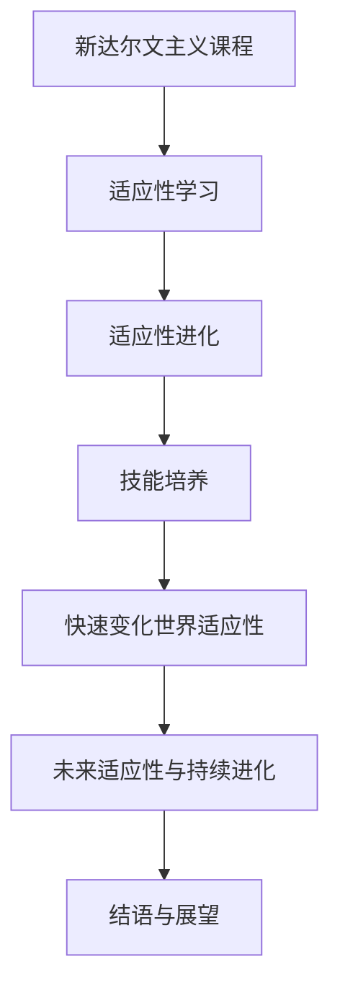
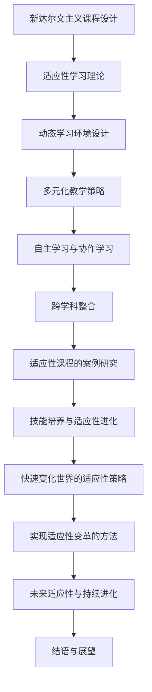

                 

# 新达尔文主义课程：适应快速变化世界的技能

> 关键词：新达尔文主义、适应性进化、快速变化世界、技能培养、复杂性科学

> 摘要：本文旨在探讨新达尔文主义在快速变化世界的适应性和技能培养中的应用。通过分析新达尔文主义的核心概念和复杂性科学的基本原理，本文将阐述适应性进化的机制和人类适应性的实例，并提出适应快速变化世界的技能培养策略。最后，本文将对未来适应性和持续进化进行展望，并提出相关资源和延伸阅读，以帮助读者进一步深入了解和探索这一领域。

### 前言

#### 引言

新达尔文主义是20世纪末以来在生物学、社会学和复杂性科学等领域兴起的一种哲学思潮。它继承了达尔文进化论的基本思想，但对其进行了现代化和扩展，形成了适应快速变化世界的新视角。新达尔文主义的核心观点是：进化是复杂系统中适应性变化的自然过程，它不仅发生在生物学领域，也适用于社会、技术和文化等领域。

在生物学中，新达尔文主义强调适应性进化在物种生存和发展中的重要性。它关注环境变化对物种的影响，以及物种如何通过基因变异、自然选择和遗传机制适应这些变化。在社会学和复杂性科学中，新达尔文主义则将适应性进化概念应用于社会行为、组织结构和文化演变等方面，探讨人类如何在社会变迁中适应和演化。

新达尔文主义的哲学背景与意义

新达尔文主义的哲学背景源于对达尔文进化论的深入反思和拓展。达尔文进化论在19世纪提出，揭示了物种在自然选择和遗传机制作用下的演变过程。然而，随着科学技术的进步和复杂性科学的兴起，人们逐渐意识到，进化不仅限于生物学领域，而是普遍存在于各种复杂系统中。

新达尔文主义在这一背景下产生，它试图回答以下问题：什么是适应性进化？如何在复杂环境中实现适应性进化？如何将进化概念应用于社会和技术领域？这些问题不仅具有科学意义，也对人类社会的未来具有深远影响。

本文将围绕这些问题展开讨论，通过分析新达尔文主义的核心概念和复杂性科学的基本原理，探讨适应性进化的机制和人类适应性的实例。同时，本文将提出适应快速变化世界的技能培养策略，以帮助读者更好地理解和应对这一挑战。

#### 目标

本书的目标是为读者提供一套全面、系统的适应性进化理论框架，以及实际应用策略。通过阅读本书，读者将：

1. 了解新达尔文主义的核心概念和哲学背景。
2. 掌握适应性进化的机制和复杂性科学的基本原理。
3. 分析人类适应性的实例，了解人类如何在不同环境中实现进化。
4. 掌握适应快速变化世界的技能培养策略。
5. 探讨未来适应性和持续进化的挑战和机遇。

本书将分为两部分：第一部分为基础理论部分，主要介绍新达尔文主义的核心概念和适应性进化的机制；第二部分为应用策略部分，主要探讨适应快速变化世界的技能培养策略。通过这两部分的学习，读者将能够深入理解适应性进化理论，并将其应用于实际生活和工作中。

### 第一部分：新达尔文主义基础

#### 第1章：新达尔文主义概述

##### 1.1 新达尔文主义的起源与核心思想

新达尔文主义起源于20世纪末，是对达尔文进化论的现代化和扩展。达尔文进化论在19世纪提出了物种通过自然选择和遗传机制演化的观点，这一理论在当时具有革命性意义。然而，随着科学技术的进步和复杂性科学的兴起，人们逐渐认识到，进化不仅限于生物学领域，而是普遍存在于各种复杂系统中。

新达尔文主义的起源可以追溯到生物学家理查德·道金斯（Richard Dawkins）的《自私的基因》一书。在这本书中，道金斯提出了“基因是进化的基本单位”的观点，强调了基因在进化过程中的主导作用。这一观点为新达尔文主义的兴起提供了理论基础。

新达尔文主义的核心思想是：进化是复杂系统中适应性变化的自然过程。这一过程不仅发生在生物学领域，也适用于社会、技术和文化等领域。新达尔文主义强调，进化是一个动态的、不断适应和变化的过程，它取决于环境的变化和系统的适应性。

##### 1.2 新达尔文主义的生物学基础

新达尔文主义在生物学中的基础主要涉及适应性进化、基因多样性和自然选择等概念。

适应性进化是生物在长期演化过程中通过自然选择和遗传机制逐渐适应环境的过程。适应性进化强调，生物在环境变化面前会经历一系列的遗传变异和选择，最终形成适应新环境的物种。这一过程不仅体现在生物个体的生存和繁殖中，也体现在整个物种的进化历程中。

基因多样性是适应性进化的基础。基因多样性指的是一个物种内部基因组的多样性，它包括基因的不同变异形式和组合。基因多样性使得物种在面对环境变化时具有更大的适应能力。通过基因变异和遗传机制，物种可以产生新的特征和功能，从而适应不断变化的环境。

自然选择是适应性进化的关键机制。自然选择指的是在特定环境中，具有有利变异的个体更可能生存和繁殖，从而将有利基因传递给后代。这一过程导致有利基因在物种中的频率逐渐增加，而不利基因则逐渐减少。通过自然选择，物种可以不断适应环境变化，实现进化。

##### 1.3 新达尔文主义在社会学中的应用

新达尔文主义在社会学中的应用主要体现在社会进化、群体行为和文化演变等方面。

社会进化是指人类社会在长期发展过程中通过适应性变化实现进步和发展的过程。新达尔文主义认为，社会进化是一个动态的、不断适应和变化的过程，它取决于环境的变化和社会结构的适应性。社会进化不仅包括经济、政治和科技等领域的变革，还包括社会价值观、文化习俗和行为规范等方面的演变。

群体行为是新达尔文主义在社会学中的另一个重要应用。群体行为指的是个体在群体中相互作用和适应的过程。新达尔文主义认为，群体行为是由个体的适应性进化驱动的，它反映了个体在特定环境下的最佳策略。通过群体行为，个体可以更好地适应环境，实现共同的目标。

文化演变是新达尔文主义在社会学中的另一个重要领域。文化演变指的是人类文化在长期发展过程中通过适应性变化实现创新和传承的过程。新达尔文主义认为，文化演变是一个动态的、不断适应和变化的过程，它取决于环境的变化和文化结构的适应性。通过文化演变，人类社会可以不断适应新的挑战和机遇，实现持续发展。

#### 第2章：适应性进化论

##### 2.1 适应性进化的机制

适应性进化的机制主要包括自然选择、基因流和突变等过程。

自然选择是适应性进化的核心机制。自然选择指的是在特定环境中，具有有利变异的个体更可能生存和繁殖，从而将有利基因传递给后代。这一过程导致有利基因在物种中的频率逐渐增加，而不利基因则逐渐减少。通过自然选择，物种可以不断适应环境变化，实现进化。

基因流是适应性进化的另一个重要机制。基因流指的是基因在不同种群之间的传递和交流。基因流可以增加种群之间的基因多样性，从而提高物种的适应能力。通过基因流，物种可以更好地适应不同的环境，实现进化。

突变是适应性进化的基础。突变指的是基因序列的突然变化。突变可以导致新的基因型和表型的出现，从而为适应性进化提供原材料。突变在物种进化过程中起到重要作用，它使得物种能够更好地适应环境变化。

##### 2.2 环境变化与适应性响应

环境变化是适应性进化的重要驱动力。环境变化包括自然环境的改变和人类活动的干扰。环境变化对物种的生存和繁殖产生直接影响，迫使物种进行适应性响应。

生态位是指一个物种在生态系统中所占据的位置，包括该物种利用资源的方式和与其他物种的相互关系。环境变化可能导致生态位的改变，从而影响物种的生存和繁殖。物种需要通过适应性进化来调整其生态位，以适应新的环境。

资源竞争是环境变化对物种适应性响应的一个重要方面。资源竞争指的是不同物种之间为了获取有限资源而产生的竞争关系。环境变化可能导致资源分布和利用方式的改变，从而加剧资源竞争。物种需要通过适应性进化来提高资源利用效率，以适应竞争压力。

生态系统稳定性是适应性进化的重要保障。生态系统稳定性指的是生态系统在面对外部干扰时保持结构和功能稳定的能力。环境变化可能导致生态系统的不稳定，从而影响物种的生存和繁殖。物种需要通过适应性进化来提高生态系统的稳定性，以适应环境变化。

##### 2.3 人类适应性的实例

人类适应性的实例广泛存在于各个领域，包括生理、行为和文化等方面。

人类生理适应性的实例包括皮肤颜色的变化。人类皮肤颜色从非洲的黑色到欧洲的白色，是长期适应不同环境的结果。在非洲，黑色皮肤可以有效防止紫外线伤害；而在欧洲，白色皮肤可以提高对紫外线的吸收，促进维生素D的合成。

人类行为适应性的实例包括狩猎和采集。人类在漫长的进化过程中，通过狩猎和采集获取食物，适应了不同的生态环境。狩猎和采集不仅提供了生存所需的食物，还促进了人类社会的分工和合作。

人类文化适应性的实例包括语言和宗教。语言是人类沟通和传递信息的重要工具，不同的语言反映了人类对不同环境的适应。宗教则是人类在面对自然和社会不确定性时的适应性策略，它提供了精神慰藉和社会团结的力量。

#### 第3章：复杂性科学视角下的进化

##### 3.1 复杂性科学的基本概念

复杂性科学是研究复杂系统的学科，它关注复杂系统中涌现、适应和进化的现象。复杂性科学的基本概念包括复杂适应系统（CAS）、适应性学习和非线性动力学等。

复杂适应系统（CAS）是复杂性科学的核心概念。CAS指的是由多个具有适应性和自主性的个体组成的系统，这些个体可以通过相互作用和适应环境来改变自身的结构和行为。CAS的特点包括动态性、复杂性和适应性，它反映了自然界和社会中广泛存在的复杂现象。

适应性学习是复杂性科学中的另一个重要概念。适应性学习指的是个体或系统在面对环境变化时通过调整自身行为和策略来提高适应能力的过程。适应性学习不仅涉及个体层面，还包括群体和生态系统层面，它反映了适应性进化的本质。

非线性动力学是复杂性科学中的基础理论。非线性动力学研究复杂系统中变量之间的非线性关系和动态行为。非线性动力学揭示了复杂系统的复杂性和适应性，为理解适应性进化的机制提供了理论基础。

##### 3.2 复杂适应性系统的特征

复杂适应性系统具有以下特征：

1. 模式识别：复杂适应性系统具有识别和理解复杂模式的能力。通过模式识别，系统可以快速适应和响应环境变化。

2. 动态平衡：复杂适应性系统在适应环境变化时，会通过调整自身行为和策略来实现动态平衡。动态平衡使得系统在变化中保持稳定。

3. 自组织：复杂适应性系统可以通过自我组织和自我调整来适应环境变化。自组织是复杂系统中的基本特征，它反映了系统的自主性和适应性。

4. 涌现：复杂适应性系统中的个体通过相互作用和适应，可以产生新的结构和功能。涌现是复杂系统中的关键现象，它体现了复杂性的本质。

##### 3.3 复杂性科学在进化的应用

复杂性科学在进化中的应用主要体现在以下几个方面：

1. 跨学科方法的进化论：复杂性科学通过引入跨学科的方法和理论，丰富了进化论的研究内容。例如，将生物学、社会学和计算机科学的方法相结合，研究物种和社会的进化过程。

2. 适应性策略的研究：复杂性科学关注个体和群体在复杂环境中的适应性策略。通过研究适应性策略，可以揭示物种和个体如何适应环境变化，实现进化。

3. 复杂适应性系统的模拟：复杂性科学通过建立数学模型和计算机模拟，研究复杂适应性系统的行为和演化过程。这些模拟为理解进化提供了新的视角和工具。

### 第二部分：新达尔文主义课程设计

#### 第4章：课程设计与适应性学习

##### 4.1 适应性学习理论

适应性学习理论是复杂性科学和认知科学中的重要分支，它关注个体在动态环境中通过调整自身认知和行为策略来提高适应能力的过程。适应性学习不仅涉及知识的学习和技能的培养，还包括认知过程的调整和行为的优化。

适应性学习的核心概念包括：

1. **动态环境感知**：个体需要感知和理解不断变化的环境，以便及时调整自身的认知和行为策略。

2. **适应性策略调整**：个体在面对环境变化时，需要根据新的信息调整自身的认知和行为策略，以提高适应能力。

3. **持续学习与进化**：适应性学习是一个持续的过程，个体需要不断学习和进化，以应对不断变化的环境。

4. **跨领域迁移能力**：适应性学习强调个体在不同领域和情境中迁移和应用所学知识和技能的能力。

##### 4.2 课程设计的适应性原则

课程设计是适应性学习的关键环节，需要遵循以下适应性原则：

1. **动态学习环境设计**：课程设计应构建一个动态的学习环境，使学生在面对不同环境和情境时能够灵活调整学习策略。这包括多样化的教学资源、情境模拟和实时反馈机制。

2. **多元化教学策略**：课程设计应采用多元化教学策略，以满足不同学习者的需求和适应能力。这包括讲授、讨论、实验、项目和实践等多种教学方式。

3. **自主学习与协作学习**：课程设计应鼓励学生自主学习，培养他们的独立思考和解决问题的能力。同时，通过协作学习，学生可以相互交流和分享知识，提高整体学习效果。

4. **跨学科整合**：课程设计应整合不同学科的知识和技能，培养学生的跨学科思维能力和综合素质。通过跨学科整合，学生可以更好地理解和应对复杂问题。

##### 4.3 适应性课程的案例研究

适应性课程在实践中的应用已经取得了一定的成功。以下是一些成功的适应性课程案例研究：

1. **案例一：信息技术适应性课程**  
   信息技术领域发展迅速，课程设计需要不断更新教学内容和方法。一个成功的案例是某高校的信息技术课程，它采用动态学习环境设计，通过在线课程平台和虚拟实验室提供多样化的教学资源。同时，课程采用项目驱动教学策略，让学生在实际项目中学习和应用信息技术知识。

2. **案例二：医学适应性课程**  
   医学是一个复杂且动态变化的领域，课程设计需要不断更新医学知识和技能。某医学院的医学课程采用多元化教学策略，包括讲座、讨论、实验和临床实践等多种方式。同时，课程设计注重跨学科整合，将医学与其他学科（如生物信息学、心理学）相结合，提高学生的综合素质。

3. **案例三：商业适应性课程**  
   商业环境变化迅速，课程设计需要培养学生的适应能力和创新能力。某商学院的商业课程采用自主学习与协作学习相结合的方式，鼓励学生通过团队合作解决实际问题。同时，课程设计引入了案例分析和模拟经营等实践环节，提高学生的实际操作能力。

这些案例表明，适应性课程设计在培养个体适应能力、提升学习效果和应对快速变化的环境方面具有重要作用。通过动态学习环境设计、多元化教学策略和跨学科整合，适应性课程可以更好地满足学生的需求，提高他们的适应能力和综合素质。

#### 第5章：技能培养与适应性进化

##### 5.1 技能培养的重要性

技能培养在个体适应性和进化过程中起着至关重要的作用。技能是指个体在特定领域内通过学习和实践所掌握的知识和操作能力。在快速变化的世界中，技能培养不仅有助于个体适应环境变化，还能提升其竞争力和生存能力。

技能培养的重要性体现在以下几个方面：

1. **提高适应能力**：技能培养使个体能够更好地适应新的环境和情境。通过掌握不同领域的知识和技能，个体可以快速适应新环境，应对各种挑战。

2. **增强竞争力**：技能培养使个体在就业市场中具备竞争优势。具备高技能的个体往往更受雇主的青睐，能够在职场中脱颖而出。

3. **促进终身学习**：技能培养激发个体的学习兴趣和动力，使其具备持续学习和自我提升的能力。这有助于个体在不断变化的世界中保持竞争力。

4. **推动社会进步**：技能培养不仅对个体有益，还能推动整个社会的进步。具备高技能的人才为社会发展和创新提供了强大动力。

##### 5.2 适应性技能的类型

适应性技能可以分为通用技能和特定技能两类。

1. **通用技能**：通用技能是指适用于各个领域的普遍技能，如沟通能力、团队合作、解决问题的能力等。这些技能在个体适应不同环境和情境时具有重要作用，是适应性的基础。

2. **特定技能**：特定技能是指针对某一特定领域的专业知识和操作能力，如编程技能、数据分析能力、工程技能等。特定技能在个体应对特定领域挑战时具有关键作用。

适应性技能的组合和多样性在个体适应性和进化过程中具有重要意义。通过掌握多种技能，个体可以更好地应对复杂多变的环境，实现跨领域的适应和进化。

##### 5.3 适应性技能的培养策略

培养适应性技能需要采取一系列策略，包括实践导向的学习方法、适应性行为的塑造与培养等。

1. **实践导向的学习方法**：实践导向的学习方法强调通过实际操作和项目实践来培养技能。这种方法不仅有助于加深对知识点的理解，还能提高实际操作能力。例如，编程课程可以通过编写实际代码和开发项目来培养编程技能。

2. **适应性行为的塑造与培养**：适应性行为是指个体在面对挑战和变化时表现出的行为特征。培养适应性行为需要通过持续的训练和实践。例如，通过设定挑战性目标和不断调整策略，个体可以培养出应对变化和压力的能力。

3. **跨学科学习与整合**：跨学科学习与整合有助于培养个体的综合素质和适应性。通过跨学科的学习和实践，个体可以掌握多个领域的知识和技能，从而在应对复杂问题时具有更强的适应能力。

4. **终身学习与自我提升**：终身学习是适应快速变化世界的关键。个体需要保持学习的动力和热情，不断更新知识和技能。通过参加在线课程、阅读专业书籍和参与学术交流，个体可以不断提升自我，实现持续进化。

### 第6章：快速变化世界的适应性策略

##### 6.1 快速变化世界的特点

快速变化世界的特点主要体现在以下几个方面：

1. **技术进步**：随着信息技术的飞速发展，人工智能、大数据、云计算等新兴技术不断涌现，改变了人类生活和工作的方式。

2. **社会变迁**：全球化、城市化、人口老龄化等社会变迁现象对个体和社会产生了深远影响，要求人们具备更高的适应能力和综合素质。

3. **不确定性**：快速变化的世界充满不确定性，各种突发事件和意外事件频发，要求个体具备快速应对和适应变化的能力。

4. **多样性**：快速变化的世界充满多样性，个体和群体之间在文化、价值观、生活方式等方面存在巨大差异，要求个体具备跨文化和跨领域的适应能力。

##### 6.2 适应性策略的选择

在快速变化的世界中，个体和组织需要采取适应性策略来应对挑战。以下是一些常见的适应性策略：

1. **灵活性**：灵活性是指个体或组织在面对不确定性时能够迅速调整策略和行动的能力。灵活性有助于个体和组织快速适应环境变化，抓住机遇。

2. **敏捷性**：敏捷性是指个体或组织在应对变化时能够快速响应和调整的能力。敏捷性有助于个体和组织在复杂多变的环境中保持竞争优势。

3. **创新性**：创新性是指个体或组织在应对挑战时能够提出新的想法和解决方案的能力。创新性有助于个体和组织在快速变化的世界中实现持续发展。

4. **跨学科合作**：跨学科合作是指不同学科领域的个体或组织通过合作解决复杂问题。跨学科合作有助于个体和组织拓展视野，提高创新能力。

##### 6.3 实现适应性变革的方法

实现适应性变革需要采取一系列方法，包括领导力、组织文化和持续学习等。

1. **领导力**：领导力是实现适应性变革的关键。领导者需要具备远见和洞察力，能够预见未来趋势和变化，并制定相应的战略和规划。

2. **组织文化**：组织文化是实现适应性变革的基础。一个积极向上、鼓励创新和适应性的组织文化有助于激发员工的创造力和创新能力。

3. **持续学习**：持续学习是实现适应性变革的保障。个体和组织需要保持学习的动力和热情，不断更新知识和技能，以应对快速变化的世界。

4. **创新机制**：建立创新机制是实现适应性变革的重要手段。创新机制包括鼓励创新、保护知识产权和提供资金支持等，有助于激发个体的创新潜力。

### 第7章：未来适应性与持续进化

##### 7.1 未来适应性的挑战

未来适应性面临的挑战主要包括以下几个方面：

1. **全球竞争**：随着全球化的发展，个体和组织需要在全球范围内竞争，这要求他们具备更高的适应能力和创新能力。

2. **环境危机**：环境问题日益严重，如气候变化、资源短缺等，对个体和组织的生存和发展构成威胁，要求他们具备更强的适应能力和可持续发展意识。

3. **技术变革**：技术的飞速发展不断改变人类的生活和工作方式，个体和组织需要不断适应新技术，以保持竞争力。

4. **社会变革**：社会变革带来的不确定性，如人口老龄化、文化冲突等，对个体和组织的适应能力提出更高要求。

##### 7.2 进化思维的实践应用

进化思维是一种基于适应性进化的思维模式，它强调在复杂和不确定的环境中通过不断试错和适应来实现进步和成功。进化思维的实践应用主要包括以下几个方面：

1. **创新管理**：进化思维可以帮助企业建立创新管理体系，鼓励员工不断尝试和探索新的想法和解决方案，以提高企业的适应能力和竞争力。

2. **组织学习**：进化思维强调组织内部的知识共享和协作学习，通过不断学习和适应，提高组织的整体适应能力。

3. **社会创新**：进化思维可以应用于社会创新领域，通过创新政策和机制，推动社会变革和可持续发展。

4. **个人成长**：进化思维可以帮助个体在面对挑战和变化时保持积极心态，不断适应和成长。

##### 7.3 进化的未来展望

未来，进化思维和适应性进化将在多个领域发挥重要作用：

1. **人工智能与进化**：人工智能的发展将带来新的进化机遇和挑战，人类需要通过进化思维来适应和利用人工智能技术。

2. **生物技术与社会进化**：生物技术的发展将推动人类社会进化的新阶段，个体和组织需要具备更强的适应能力，以应对生物技术带来的变化。

3. **跨学科合作与进化**：跨学科合作将成为未来进化的重要趋势，通过跨学科的知识整合和创新，人类将更好地应对复杂问题。

4. **可持续发展与进化**：在可持续发展领域，进化思维可以帮助个体和组织实现可持续发展和生态平衡。

### 结语

新达尔文主义课程为我们提供了一种全新的视角，帮助我们理解快速变化世界的适应性和进化机制。通过学习新达尔文主义，我们可以掌握适应快速变化世界的技能，提高自己的竞争力，实现持续进化。未来，进化思维和适应性进化将在人类社会的各个方面发挥重要作用，推动我们迈向更加美好的未来。

### 附录

#### 附录A：适应性学习资源指南

1. **学术文献与在线资源**  
   - 《自私的基因》（理查德·道金斯著）  
   - 《复杂适应系统：一个进化方法论》（约翰·霍兰著）  
   - 《适应性进化：复杂系统中的进化过程》（爱德华·O. 威尔逊著）

2. **专业组织与社区**  
   - 国际复杂性科学学会（ICSA）  
   - 国际进化心理学学会（IEP）  
   - 新达尔文主义研究协会（NDRA）

#### 附录B：适应性技能评估工具

1. **自我评估量表**  
   - 适应性技能自我评估表：包括灵活性、敏捷性、创新性和跨学科能力等方面的评估。

2. **实际应用案例**  
   - 案例一：某企业在数字化转型过程中，通过灵活性和敏捷性策略，成功应对了市场变化，实现了业务增长。  
   - 案例二：某高校通过跨学科课程设计，培养了学生的综合素质和创新能力，提升了教育质量。

### Mermaid 流程图：新达尔文主义课程的核心概念关系

### Mermaid 流程图：新达尔文主义课程的核心概念关系

### 作者信息

作者：AI天才研究院/AI Genius Institute & 禅与计算机程序设计艺术 /Zen And The Art of Computer Programming

### 文章结束

本文旨在探讨新达尔文主义在快速变化世界的适应性和技能培养中的应用。通过分析新达尔文主义的核心概念和复杂性科学的基本原理，本文阐述了适应性进化的机制和人类适应性的实例，并提出了适应快速变化世界的技能培养策略。未来，随着全球化和技术进步的不断推进，新达尔文主义将继续为我们理解和应对快速变化的世界提供重要启示。希望本文能够帮助读者深入理解新达尔文主义，并在实际生活中运用这些理论，实现个人和组织的持续进化。

