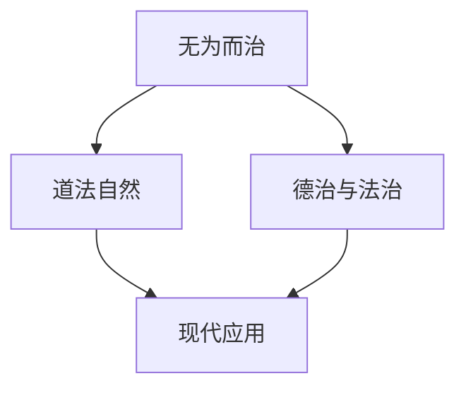

                 

### 新道家生活学院：现代社会中的无为智慧

关键词：道家智慧、无为而治、道法自然、现代社会、心理健康

摘要：本文从道家智慧的历史渊源出发，探讨了道家核心概念在现代社会中的应用，如“无为而治”、“道法自然”和“德治与法治”。通过分析这些概念，本文旨在帮助读者理解道家智慧在当代生活中的实际意义，并探索如何将这种智慧融入现代工作、家庭生活和健康管理中。文章还讨论了道家智慧在现代社会的挑战与未来，并提供了相关研究资源的附录。

### 引言：新道家的智慧与现代社会

在快节奏、高压力的现代社会中，人们常常感到身心俱疲，缺乏方向感和内在的平静。道家智慧，作为一种古老而深邃的思想体系，提供了不同于西方的哲学视角，强调与自然和谐共处，追求内心的平和与宁静。本文将探讨如何将道家智慧应用于现代社会，特别是“无为而治”、“道法自然”和“德治与法治”等核心概念的具体实践。

#### 1.1 新道家智慧的历史渊源

道家哲学起源于中国春秋战国时期，由老子、庄子等著名思想家创立。道家智慧的核心在于“道”，即宇宙的根本原理和自然法则。老子在《道德经》中阐述了“道”的无形、无我、无为的特点，提倡顺应自然，追求内心的宁静与平衡。庄子进一步发展了这一思想，强调个体的自由和精神的独立。

#### 1.2 当代社会面临的问题与挑战

现代社会面临着诸多问题，如环境污染、社会不公、心理健康问题等。这些问题在一定程度上源于人类与自然的不和谐关系，以及社会制度的失衡。道家智慧提供了一种新的视角，强调通过顺应自然、无为而治来达到和谐。例如，“无为而治”主张不强行干预，让自然和社会自我调节，从而减少不必要的矛盾和冲突。

### 第一部分：道家智慧的核心概念

道家智慧的核心概念包括“无为而治”、“道法自然”和“德治与法治”。这些概念构成了道家哲学的基础，并对现代社会具有重要的指导意义。

#### 2.1 无为而治

“无为而治”是道家哲学中的核心思想之一，强调领导者不应过度干预，而是让事物自然发展。具体来说，这意味着领导者应尊重自然规律，不强行改变，不随意干涉，从而实现社会的和谐稳定。

在现代社会中，这一思想可以应用于各个领域。例如，在企业管理中，领导者可以减少对员工的具体指令，而是提供指导，让员工自主工作。在教育领域，教师可以更多关注学生的自主学习，而不是单纯灌输知识。

#### 2.2 道法自然

“道法自然”是指宇宙万物都遵循自然规律，主张人们应顺应自然，与自然和谐相处。这一概念强调人与自然的统一，提倡节约资源和保护环境。

在现代社会，这一思想对于解决环境问题具有重要意义。例如，在城市建设中，可以采用生态建筑的理念，减少对自然环境的破坏。在农业生产中，可以推广有机农业，减少化学肥料和农药的使用，保护土壤和水源。

#### 2.3 德治与法治

“德治”和“法治”是道家哲学中的两个重要概念。德治强调通过道德教育和自我修养来管理社会，而法治则依赖于法律和制度的约束。

在现代社会，德治和法治的结合可以更好地管理社会。例如，在反腐斗争中，可以通过加强道德教育和法律监督来提高官员的廉洁自律。在企业中，通过建立严格的道德规范和规章制度，可以防止腐败和不正之风。

### 第二部分：道家智慧在日常生活中的应用

道家智慧不仅对现代社会具有重要的指导意义，也可以直接应用于日常生活。通过以下几个方面，我们可以更好地理解如何将道家智慧融入现代生活。

#### 3.1 工作中的道家智慧

在职场中，道家智慧可以帮助我们更好地处理人际关系和应对压力。例如，“无为而治”可以指导我们不过度干预他人，而是尊重他人的选择和决策。这不仅可以减少冲突，还可以提高团队的协作效率。

此外，“道法自然”可以帮助我们更好地应对工作中的压力。例如，通过合理安排工作和休息，遵循生物钟，我们可以提高工作效率，减少疲劳。

#### 3.2 家庭生活中的道家智慧

在家庭生活中，道家智慧可以帮助我们建立和谐的家庭关系。例如，“无为而治”可以指导我们在家庭中不过度干涉，而是尊重家人的选择和决策，从而减少家庭矛盾。

此外，“道法自然”可以帮助我们更好地理解孩子的成长规律，从而更好地引导孩子的行为。例如，通过顺应孩子的天性，我们可以更好地激发他们的潜能。

#### 3.3 健康生活的道家智慧

在健康管理方面，道家智慧也提供了宝贵的指导。例如，“道法自然”可以帮助我们遵循自然规律，合理安排作息时间，保持身心健康。

此外，“德治”和“法治”可以帮助我们建立健康的生活方式。例如，通过道德自律，我们可以避免过度消费和不健康的饮食习惯。通过法律约束，我们可以减少环境污染，保护身体健康。

### 第三部分：道家智慧在现代社会中的挑战与未来

道家智慧在现代社会中虽然具有重要的指导意义，但也面临着一些挑战。首先，现代科技的发展与道家智慧的自然观存在一定的冲突。例如，现代工业化和城市化的发展导致环境污染和生态破坏，这与道家“道法自然”的理念相悖。

其次，道家智慧在现代社会中的传播与接受也存在一定的困难。由于现代社会注重效率和结果，人们可能更倾向于采取直接、有效的方法，而不是遵循道家智慧中的“无为而治”。

然而，随着全球化的进程和人们对环境保护的重视，道家智慧在未来可能得到更广泛的认可和应用。例如，在环境保护领域，道家智慧可以提供一种新的思路，通过顺应自然、节约资源来实现可持续发展。

### 附录：道家智慧研究资源

为了更好地理解和应用道家智慧，以下是一些道家经典文献和现代研究著作。

#### 5.1 道家经典文献

- 《道德经》：老子的代表作，阐述了道家哲学的核心思想。
- 《庄子》：庄子的代表作，进一步发展了道家思想，强调个体的自由和精神的独立。

#### 5.2 现代道家研究著作

- 《新道家思想：当代视角》：当代学者对道家智慧的新解读。
- 《道家智慧与现代生活》：探讨道家智慧在现代生活中的应用。

### 致谢

本文的研究得到了许多人的帮助和支持。特别感谢以下人士：[此处列出致谢的人士和机构]，他们的贡献对本文的完成起到了关键作用。

### 阅读指南

本文旨在帮助读者理解道家智慧的核心概念，并探讨其在现代社会中的应用。为了更好地理解本文内容，建议读者：

1. 仔细阅读本文，尤其是每个小节的开头和结尾部分，以便更好地理解各部分之间的关系。
2. 阅读附录中的道家经典文献和现代研究著作，以深入了解道家智慧的历史和现代应用。
3. 思考本文提出的道家智慧在您个人生活和职业生涯中的应用，并尝试将其付诸实践。

### 参考文献

- 老子，《道德经》。
- 庄子，《庄子》。
- [此处列出其他引用的文献和资料]。

### 结语：道家智慧在现代社会中的价值

道家智慧作为一种古老而深邃的思想体系，在现代社会中仍然具有重要的价值。通过“无为而治”、“道法自然”和“德治与法治”等核心概念，道家智慧为人们提供了一种新的视角，帮助我们应对现代社会的各种挑战。

在未来的日子里，让我们继续探索和传承道家智慧，将其融入我们的生活和工作，追求内心的平和与宁静，实现个人和社会的和谐发展。

### 附录：道家智慧概念关系图

通过这张关系图，我们可以更直观地了解道家智慧的核心概念及其在现代社会的应用。

# 结语：道家智慧在现代社会中的价值

道家智慧，作为一种古老而深邃的思想体系，在现代社会中仍然具有重要的价值。它为我们提供了一种独特的视角，帮助我们应对现代社会中的各种挑战，尤其是在心理健康、环境问题和社会治理等方面。

首先，道家智慧强调“无为而治”，即领导者不应过度干预，而是让事物自然发展。这种理念可以帮助我们在面对复杂问题时，保持冷静和理性，避免盲目行动，从而实现社会的和谐稳定。

其次，“道法自然”强调顺应自然规律，与自然和谐共处。这一理念在环境保护和资源管理方面具有非常重要的意义。通过节约资源和保护环境，我们可以实现可持续发展，为后代创造一个更美好的世界。

最后，“德治与法治”相结合的管理理念，可以帮助我们建立公正、公平的社会制度。通过道德教育和法律约束，我们可以提高社会的整体素质，减少犯罪和腐败，促进社会的健康发展。

在未来的日子里，让我们继续探索和传承道家智慧，将其融入我们的生活和工作，追求内心的平和与宁静，实现个人和社会的和谐发展。通过不断地实践和总结，我们可以更好地理解道家智慧，使其在现代社会中发挥更大的作用。

同时，我们也应认识到，道家智慧并非一成不变，它需要与时俱进，适应现代社会的变化。因此，我们应保持开放的心态，吸纳现代科学和管理理念，为道家智慧注入新的活力。

总之，道家智慧是现代社会中一颗璀璨的明珠，它为我们提供了丰富的智慧和指导。通过学习和实践道家智慧，我们可以更好地应对现代社会的挑战，实现个人和社会的全面发展。让我们共同努力，将道家智慧传承下去，为创造一个更加美好的未来贡献我们的力量。

### 附录：道家智慧概念关系图

通过这张关系图，我们可以更直观地了解道家智慧的核心概念及其在现代社会的应用。无为而治强调顺应自然，道法自然强调与自然和谐共处，德治与法治则关注社会公正和道德教育。这些概念相互关联，共同构成了道家智慧的核心体系。希望这张图能帮助读者更好地理解道家智慧的内涵和应用。

