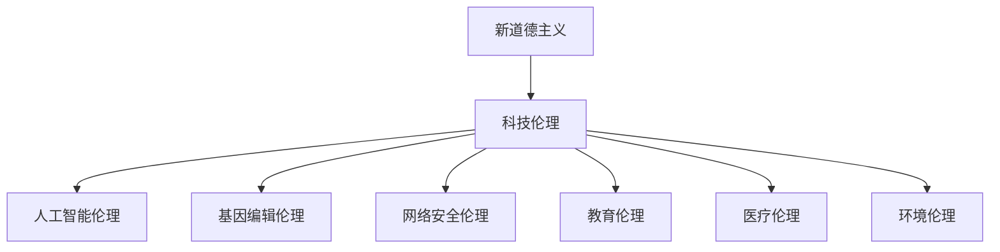

                 


# 新道德主义宣言：科技发展中的伦理重建

## 摘要

### 新道德主义宣言：科技发展中的伦理重建

随着科技的迅猛发展，人工智能、基因编辑、网络安全等领域不断涌现，科技在改变我们生活方式的同时，也带来了前所未有的伦理挑战。本文旨在探讨新道德主义在科技发展中的重要性，并提出伦理重建的方法与实践。新道德主义不仅是对传统伦理观的挑战，更是对未来社会伦理体系的重塑。本文将围绕新道德主义的起源、基本原则、与传统伦理观的对比、伦理重建的方法论、案例分析及未来展望等方面展开论述，以期在科技与伦理的交汇处，找到一条可持续发展的道路。

## 第一部分：背景与核心概念

### 1.1 科技发展与伦理困境

#### 1.1.1 科技带来的伦理挑战

科技的发展为我们带来了前所未有的便利和进步，但同时也引发了诸多伦理问题。例如，人工智能的广泛应用使得人类面临失业、隐私泄露等风险；基因编辑技术的出现引发了关于人类基因改造、生物多样性的伦理争议；网络安全的挑战则涉及个人隐私、国家安全的保护。这些问题不仅关乎个体的权益，更关乎整个社会的发展方向。

#### 1.1.2 伦理重建的必要性

面对科技带来的伦理困境，传统伦理观念显得力不从心。传统伦理观念往往基于宗教、文化等传统观念，难以适应科技发展的新形势。因此，有必要构建一种新的道德伦理体系，以适应科技发展的需求。新道德主义正是这样一种伦理观，它强调科技与伦理的紧密结合，倡导在科技发展中坚持道德原则，推动社会进步。

### 1.2 新道德主义的起源与概念

#### 1.2.1 新道德主义的起源

新道德主义并非一蹴而就，而是伴随着科技的发展和社会变革逐渐形成的。20世纪中叶以来，随着人工智能、生物工程等新兴科技的兴起，伦理学家们开始反思传统伦理观念的适用性，并尝试构建一种适应科技发展的新伦理观。这一过程可以追溯到20世纪60年代的科技伦理运动，以及随后的计算机伦理学、生物伦理学等学科的发展。

#### 1.2.2 新道德主义的基本原则

新道德主义的基本原则主要包括以下几个方面：

1. **技术中立**：新道德主义认为，科技本身并无好坏之分，关键在于如何使用。因此，在科技发展中，应坚持技术中立原则，避免将科技用于不当目的。

2. **利益最大化**：新道德主义强调在科技应用中，应追求最大化的社会利益。这要求在决策过程中，综合考虑个体权益、公共利益等因素，实现社会整体效益的最大化。

3. **公平正义**：新道德主义主张在科技发展中坚持公平正义原则，确保科技带来的利益能够公平分配，避免加剧社会不平等现象。

4. **可持续性**：新道德主义强调科技发展的可持续性，倡导在科技应用中考虑环境、社会等因素，实现经济、社会、环境的协调发展。

### 1.3 新道德主义与传统伦理观的对比

#### 1.3.1 传统伦理观的局限

传统伦理观念往往基于宗教、文化等传统观念，难以适应科技发展的新形势。例如，宗教伦理强调个体信仰和道德规范，但在科技面前显得束手无策；文化伦理强调社会习俗和传统价值观，但在面对新兴科技时，往往难以给出明确指导。因此，传统伦理观念在应对科技带来的伦理挑战时，存在明显的局限性。

#### 1.3.2 新道德主义的优势

新道德主义在应对科技伦理挑战方面具有明显优势。首先，新道德主义强调科技与伦理的紧密结合，能够更好地适应科技发展的需求。其次，新道德主义注重公平正义、可持续性等原则，有助于解决科技应用中的不平等、环境问题等。最后，新道德主义具有开放性和包容性，能够容纳不同文化、价值观的科技发展路径，实现全球科技伦理的共同进步。

## 第二部分：科技伦理重建的实践

### 2.1 伦理重建的方法论

#### 2.1.1 伦理分析的框架

伦理重建需要建立一套完整的分析框架，以指导科技伦理决策。这个框架应包括以下几个方面：

1. **价值观念分析**：明确科技发展所涉及的价值观念，包括人类的基本需求、社会的发展目标等。

2. **利益相关者分析**：识别科技发展中的利益相关者，包括个体、组织、社会等，分析他们的利益诉求和影响力。

3. **伦理原则应用**：将新道德主义的基本原则应用于科技伦理决策，如技术中立、利益最大化、公平正义、可持续性等。

4. **风险评估**：评估科技应用可能带来的风险和利益，包括个体风险、社会风险、环境风险等。

#### 2.1.2 伦理决策的流程

伦理决策的流程应包括以下几个步骤：

1. **问题识别**：明确科技发展中的伦理问题，分析问题的性质和影响。

2. **价值观念确定**：根据科技发展的需求和利益相关者的利益诉求，确定价值观念。

3. **伦理原则应用**：将新道德主义的基本原则应用于具体问题，分析不同原则的适用性和优先级。

4. **风险评估**：对科技应用可能带来的风险和利益进行评估，分析风险的影响范围和程度。

5. **决策制定**：根据伦理原则和风险评估结果，制定相应的伦理决策。

6. **决策实施**：将伦理决策付诸实践，监督决策的实施过程，确保决策的有效性和公正性。

### 2.2 科技伦理重建的案例分析

#### 2.2.1 案例一：人工智能伦理

人工智能（AI）技术的发展引发了广泛的伦理争议。以下是一个关于人工智能伦理的案例分析：

**案例背景**：某公司开发了一款人工智能系统，用于招聘求职者。然而，该系统在数据处理过程中存在性别和种族偏见，导致某些群体被不公平对待。

**伦理问题**：这个案例涉及多个伦理问题，包括公平正义、隐私保护、算法透明度等。

**伦理决策**：

1. **价值观念确定**：确定公平正义和隐私保护作为核心价值观念。

2. **伦理原则应用**：应用新道德主义的原则，如技术中立、利益最大化、公平正义、可持续性等。

3. **风险评估**：评估算法偏见对求职者的不公平影响，分析风险的影响范围和程度。

4. **决策制定**：决定改进算法，确保公平性和隐私保护。

5. **决策实施**：实施改进措施，监督算法的公平性和透明度。

#### 2.2.2 案例二：基因编辑伦理

基因编辑技术的发展引发了关于人类基因改造、生物多样性的伦理争议。以下是一个关于基因编辑伦理的案例分析：

**案例背景**：某科学家试图通过基因编辑技术，治疗一种遗传性疾病，但这一行为引发了关于人类基因改造的伦理争议。

**伦理问题**：这个案例涉及人类基因改造、生物多样性保护、科学家的道德责任等伦理问题。

**伦理决策**：

1. **价值观念确定**：确定人类基因改造、生物多样性保护、科学家的道德责任作为核心价值观念。

2. **伦理原则应用**：应用新道德主义的原则，如技术中立、利益最大化、公平正义、可持续性等。

3. **风险评估**：评估基因编辑可能带来的风险，包括人类基因改造的潜在后果、生物多样性影响等。

4. **决策制定**：决定暂停实验，进行进一步的风险评估和伦理审查。

5. **决策实施**：实施暂停措施，监督实验的合规性和伦理审查结果。

#### 2.2.3 案例三：网络安全伦理

网络安全技术的发展引发了关于个人隐私、国家安全等伦理争议。以下是一个关于网络安全伦理的案例分析：

**案例背景**：某公司开发了一款网络安全软件，用于监控员工的网络行为，但这一行为引发了关于个人隐私的争议。

**伦理问题**：这个案例涉及个人隐私、员工权益、公司道德责任等伦理问题。

**伦理决策**：

1. **价值观念确定**：确定个人隐私、员工权益、公司道德责任作为核心价值观念。

2. **伦理原则应用**：应用新道德主义的原则，如技术中立、利益最大化、公平正义、可持续性等。

3. **风险评估**：评估网络安全软件对员工隐私的影响，分析风险的影响范围和程度。

4. **决策制定**：决定调整监控措施，确保员工隐私和权益。

5. **决策实施**：实施调整措施，监督监控措施的合规性和员工反馈。

### 2.3 伦理重建在具体领域的应用

#### 2.3.1 教育伦理重建

随着互联网和人工智能技术的发展，教育领域也面临着伦理重建的挑战。以下是一个关于教育伦理重建的案例分析：

**案例背景**：某学校引入了人工智能教学系统，用于个性化教学和学生学习评价。然而，这一举措引发了关于学生隐私、教育公平等伦理争议。

**伦理问题**：这个案例涉及学生隐私、教育公平、教育资源分配等伦理问题。

**伦理决策**：

1. **价值观念确定**：确定学生隐私、教育公平、教育资源分配作为核心价值观念。

2. **伦理原则应用**：应用新道德主义的原则，如技术中立、利益最大化、公平正义、可持续性等。

3. **风险评估**：评估人工智能教学系统对学生隐私和教育公平的影响。

4. **决策制定**：决定制定相关政策，确保学生隐私和教育公平。

5. **决策实施**：实施相关措施，监督教学系统的合规性和学生反馈。

#### 2.3.2 医疗伦理重建

医疗领域的科技发展也对伦理重建提出了挑战。以下是一个关于医疗伦理重建的案例分析：

**案例背景**：某医院引进了一种新型基因编辑技术，用于治疗严重遗传性疾病。然而，这一技术引发了关于人类基因改造、医疗资源分配等伦理争议。

**伦理问题**：这个案例涉及人类基因改造、医疗资源分配、医生道德责任等伦理问题。

**伦理决策**：

1. **价值观念确定**：确定人类基因改造、医疗资源分配、医生道德责任作为核心价值观念。

2. **伦理原则应用**：应用新道德主义的原则，如技术中立、利益最大化、公平正义、可持续性等。

3. **风险评估**：评估基因编辑技术对人类基因改造和医疗资源分配的影响。

4. **决策制定**：决定制定相关政策，确保人类基因改造和医疗资源的公平分配。

5. **决策实施**：实施相关措施，监督技术的合规性和医生反馈。

#### 2.3.3 环境伦理重建

随着环境问题的日益严重，环境伦理重建也成为了一个紧迫的任务。以下是一个关于环境伦理重建的案例分析：

**案例背景**：某企业计划在森林地区建设一座大型工厂，这一计划引发了关于环境保护、生态平衡等伦理争议。

**伦理问题**：这个案例涉及环境保护、生态平衡、可持续发展等伦理问题。

**伦理决策**：

1. **价值观念确定**：确定环境保护、生态平衡、可持续发展作为核心价值观念。

2. **伦理原则应用**：应用新道德主义的原则，如技术中立、利益最大化、公平正义、可持续性等。

3. **风险评估**：评估工厂建设对环境保护和生态平衡的影响。

4. **决策制定**：决定调整工厂建设方案，确保环境保护和生态平衡。

5. **决策实施**：实施调整措施，监督建设方案的合规性和生态环境反馈。

## 第三部分：新道德主义的未来展望

### 3.1 新道德主义的社会影响

#### 3.1.1 社会变革的预期

新道德主义的崛起将深刻影响社会变革。首先，它将促使人们重新审视科技与伦理的关系，推动科技发展更加符合人类价值观念。其次，新道德主义将促进全球范围内的科技伦理合作，形成共同的伦理规范，减少科技滥用和伦理冲突。最后，新道德主义将引导科技企业在发展中更加注重社会责任，实现经济效益与社会效益的统一。

#### 3.1.2 新道德主义面临的挑战

尽管新道德主义具有巨大的社会潜力，但其在实践中仍面临诸多挑战。首先，科技发展的速度远超伦理观念的更新，导致伦理重建滞后。其次，不同文化背景下的伦理观念差异，使得新道德主义的推广面临困境。此外，新道德主义在具体实施过程中，如何平衡科技利益与伦理原则，也是一个亟待解决的问题。

### 3.2 新道德主义的国际视野

#### 3.2.1 全球伦理重建的趋势

随着科技全球化的发展，全球伦理重建已成为国际社会关注的焦点。各国纷纷制定科技伦理法规，推动科技与伦理的协调发展。例如，欧盟发布了《人工智能伦理准则》，中国发布了《人工智能发展伦理规范》，这些政策文件为新道德主义在全球范围内的实践提供了指导。

#### 3.2.2 国际合作与伦理重建

国际合作在新道德主义的实践中具有重要意义。首先，国际社会应加强科技伦理领域的交流与合作，共享经验和资源，推动全球科技伦理的共同进步。其次，各国应共同参与国际科技伦理规则的制定，确保科技发展符合全球伦理标准。最后，国际社会应建立有效的监管机制，监督科技应用中的伦理问题，确保新道德主义在全球范围内的有效实施。

### 3.3 新道德主义在中国的发展

#### 3.3.1 中国的科技伦理建设现状

中国高度重视科技伦理建设，已发布了一系列相关政策文件。例如，《中国人工智能发展报告》提出了人工智能伦理十大原则，《科技伦理审查指南》明确了科技伦理审查的程序和要求。此外，中国还设立了科技伦理委员会，负责对重大科技项目进行伦理审查。

#### 3.3.2 新道德主义在中国的实践

新道德主义在中国的发展已取得一定成果。首先，科技企业在发展中更加注重社会责任，推动科技与伦理的有机结合。例如，阿里巴巴、腾讯等企业成立了科技伦理委员会，制定了一系列科技伦理政策。其次，高校和研究机构积极推动科技伦理教育，培养具有科技伦理素养的人才。最后，中国积极参与国际科技伦理合作，推动全球科技伦理的共同进步。

## 附录

### 附录 A：相关法律法规与政策文件

#### A.1 国际相关法律法规

- 《欧盟一般数据保护条例》（GDPR）
- 《联合国生物多样性公约》
- 《国际人工智能伦理准则》

#### A.2 中国相关法律法规

- 《中华人民共和国数据安全法》
- 《中华人民共和国生物安全法》
- 《中华人民共和国网络安全法》

#### A.3 重要政策文件

- 《中国人工智能发展报告》
- 《科技伦理审查指南》
- 《人工智能发展伦理规范》

### 附录 B：参考资料

- 《人工智能伦理学》（周涛）
- 《科技伦理与伦理学》（刘大钧）
- 《科技伦理与可持续发展》（赵林）
- 《科技伦理学导论》（艾伦·M·梅尔文）

# 核心概念与联系

## 新道德主义与科技伦理

### 核心概念与联系流程图



### 核心算法原理讲解

**伦理决策算法示例：基于效用理论的伦理决策模型**

```python
# 伦理决策算法示例：基于效用理论的伦理决策模型

import numpy as np

# 定义伦理决策模型
class EthicalDecisionModel:
    def __init__(self, utilitarianism=True):
        self.utilitarianism = utilitarianism

    def make_decision(self, options, outcomes, weights):
        if self.utilitarianism:
            # 最大幸福原则
            total_utility = sum([option * weight for option, weight in zip(outcomes, weights)])
            best_option = np.argmax(total_utility)
        else:
            # 公平优先原则
            total_utility = sum([option ** 2 * weight for option, weight in zip(outcomes, weights)])
            best_option = np.argmax(total_utility)
        return best_option

# 定义选项和结果
options = ['行动A', '行动B', '行动C']
outcomes = [1, 2, 3]
weights = [0.3, 0.5, 0.2]

# 创建伦理决策模型实例
model = EthicalDecisionModel(utilitarianism=True)

# 做出决策
best_option = model.make_decision(options, outcomes, weights)
print(f"最佳决策选项为：{options[best_option]}")
```

### 数学模型和数学公式

**最大幸福原则与公平优先原则**

#### 最大幸福原则

$$
\text{总效用} = \sum_{i=1}^{n} (\text{选项}_i \times \text{权重}_i)
$$

#### 公平优先原则

$$
\text{总效用} = \sum_{i=1}^{n} (\text{选项}_i^2 \times \text{权重}_i)
$$

# 核心概念与联系

## 新道德主义与科技伦理

### 核心概念与联系流程图


### 核心算法原理讲解

**伦理决策算法示例：基于效用理论的伦理决策模型**

```python
# 伦理决策算法示例：基于效用理论的伦理决策模型

import numpy as np

# 定义伦理决策模型
class EthicalDecisionModel:
    def __init__(self, utilitarianism=True):
        self.utilitarianism = utilitarianism

    def make_decision(self, options, outcomes, weights):
        if self.utilitarianism:
            # 最大幸福原则
            total_utility = sum([option * weight for option, weight in zip(outcomes, weights)])
            best_option = np.argmax(total_utility)
        else:
            # 公平优先原则
            total_utility = sum([option ** 2 * weight for option, weight in zip(outcomes, weights)])
            best_option = np.argmax(total_utility)
        return best_option

# 定义选项和结果
options = ['行动A', '行动B', '行动C']
outcomes = [1, 2, 3]
weights = [0.3, 0.5, 0.2]

# 创建伦理决策模型实例
model = EthicalDecisionModel(utilitarianism=True)

# 做出决策
best_option = model.make_decision(options, outcomes, weights)
print(f"最佳决策选项为：{options[best_option]}")
```

### 数学模型和数学公式 & 详细讲解 & 举例说明

**最大幸福原则与公平优先原则**

**最大幸福原则**：

$$
\text{总效用} = \sum_{i=1}^{n} (\text{选项}_i \times \text{权重}_i)
$$

**公平优先原则**：

$$
\text{总效用} = \sum_{i=1}^{n} (\text{选项}_i^2 \times \text{权重}_i)
$$

**详细讲解与举例说明**：

假设有三种行动选项：A、B、C，每种行动可能带来的效用分别为1、2、3，权重分别为0.3、0.5、0.2。按照最大幸福原则，我们需要计算每种行动的总效用，并选择总效用最大的行动。按照公平优先原则，我们需要计算每种行动的平方效用，并选择平方效用最大的行动。

**最大幸福原则示例**：

$$
\text{总效用} = (1 \times 0.3) + (2 \times 0.5) + (3 \times 0.2) = 0.3 + 1 + 0.6 = 2.0
$$

**公平优先原则示例**：

$$
\text{总效用} = (1^2 \times 0.3) + (2^2 \times 0.5) + (3^2 \times 0.2) = 0.3 + 2 + 1.8 = 3.0
$$

在这个例子中，按照最大幸福原则，最佳行动选项是B；按照公平优先原则，最佳行动选项是C。这表明，在伦理决策中，选择不同的原则可能会得到不同的决策结果，因此需要根据具体情况和价值观选择合适的决策原则。

