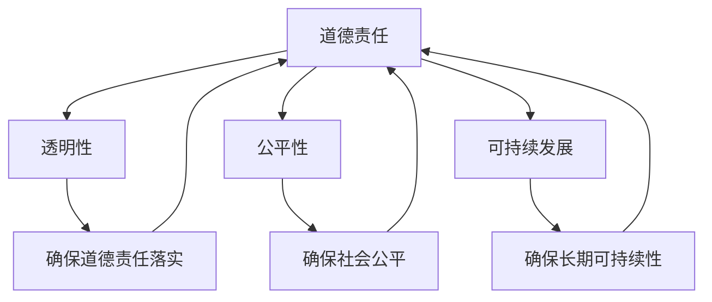

                 

### 引言

《新道德主义：科技发展中的伦理重建》这本书的主题是探讨在科技迅猛发展的今天，如何构建一种新的道德框架，以应对科技带来的伦理挑战。随着人工智能、生物科技、信息技术的飞速进步，我们的社会生活正经历着前所未有的变革。然而，这些科技进步带来的不仅仅是便利和效率，同时也引发了诸如隐私泄露、算法歧视、数据滥用等伦理问题。这些问题的严重性不容忽视，因为它们不仅影响到个人的生活，还可能对社会的稳定和公平性造成威胁。

**新道德主义**，作为一种新兴的伦理理念，主张在科技发展的过程中，必须将伦理价值作为核心考量因素。它不仅仅是对传统道德观念的简单延续，而是一种更为复杂和全面的伦理思考方式。新道德主义认为，科技的发展应当服务于人类福祉，而不是单纯追求技术上的突破。在这种理念下，伦理重建成为了一个迫切需要解决的问题。

本书的核心目标是探讨如何通过伦理重建，使科技发展更加符合人类的价值观和道德准则。伦理重建不仅需要理论上的探讨，更需要在实践中落实。因此，本书将从多个角度出发，包括理论基础、实施方法、实际案例等，全面剖析新道德主义的内涵和意义。

### 1.1 新道德主义的概念

新道德主义（Neo-Moralism）是一个源自西方伦理学领域的新兴概念，它强调在科技飞速发展的背景下，伦理观念必须与时俱进，适应新的社会环境和技术挑战。传统的道德观念往往基于人类生活的特定历史阶段和社会结构，而科技的迅猛发展打破了这些传统框架，要求我们重新审视和定义道德准则。

新道德主义主张，道德不仅是个人行为规范，更是社会行为的指导原则。在科技时代，道德的重要性更加突出，因为科技的应用不仅影响到个人的行为，还涉及到社会整体的福祉。例如，人工智能的普及和应用引发了关于隐私、公平性和透明性的深刻讨论，这些问题的解决需要基于新的道德框架。

首先，新道德主义强调伦理价值的普适性。它认为，道德准则应当超越特定文化和社会的界限，具有全球性的适用性。这要求我们在制定伦理规范时，必须考虑不同文化和社会背景下的多样性，避免单一文化的偏见。

其次，新道德主义关注科技应用中的道德责任。它主张，科技研发者和应用者必须承担道德责任，确保科技发展不损害人类的利益和社会的公平性。例如，在开发人工智能算法时，必须确保算法的公平性和透明性，避免因算法偏见导致的社会不公。

最后，新道德主义强调道德实践的可持续性。它认为，道德规范不仅需要在具体的技术应用中得以落实，还需要在长期的社会发展中持续发挥作用。这要求我们在制定伦理规范时，必须考虑其可操作性和可执行性，确保规范能够真正落地并产生实际效果。

### 1.2 科技发展中的伦理挑战

科技的发展给社会带来了前所未有的便利和进步，但同时也引发了诸多伦理挑战，这些挑战在不同领域表现得尤为突出。

首先，人工智能（AI）的发展引发了关于隐私和公平性的深刻担忧。随着AI技术的普及，越来越多的个人信息被收集、分析和利用。然而，这些数据的滥用可能导致隐私泄露，侵害个人权益。同时，AI算法可能存在偏见，导致不公平的决策结果，例如在招聘、贷款审批和司法判决等场合。这种算法偏见不仅影响个体的权益，还可能加剧社会不平等。

其次，生物科技的发展带来了医学和生物工程领域的突破，但也引发了伦理争议。基因编辑技术，如CRISPR-Cas9，使得人类有能力直接修改基因序列。这一技术的潜力巨大，可以治疗某些遗传疾病，但同时也引发了对人类基因编辑的伦理担忧，特别是在非治疗性基因编辑和“设计婴儿”方面。如何平衡科学进步和伦理限制，成为生物科技领域亟待解决的问题。

再次，信息技术的快速发展，特别是在社交媒体和大数据领域，引发了关于信息传播和舆论控制的伦理挑战。虚假信息的快速传播、网络暴力和信息操纵等问题日益严重，威胁社会稳定和民主制度。如何在保障信息自由传播的同时，防止信息滥用和恶意传播，成为科技伦理的重要议题。

此外，科技发展还带来了对环境和资源的挑战。高能耗的技术设备、电子垃圾的污染等问题，不仅影响环境质量，还可能威胁人类生存。如何在科技发展中实现可持续发展，是科技伦理必须面对的问题。

面对这些伦理挑战，新道德主义提供了理论上的指导，强调科技发展必须以伦理价值为核心，通过伦理重建来应对这些挑战。接下来，我们将进一步探讨新道德主义的理论基础和伦理重建的具体方法，以期为解决科技发展中的伦理问题提供可行的路径。

### 2.1 新道德主义的理论基础

新道德主义的理论基础主要来源于几个重要的伦理学流派，包括功利主义、义务论和德性伦理学。这些流派为新道德主义提供了不同的视角和工具，帮助我们在面对科技发展中的伦理挑战时，能够做出更明智和全面的决策。

**功利主义**，由边沁和密尔等人提出，主张行为的道德性取决于其带来的功利或幸福。在新道德主义中，功利主义被用来评估科技发展对社会整体福祉的影响。例如，在评估一项新的技术或产品时，我们需要考虑它是否能够最大化地带来幸福和减少痛苦，以及是否会对社会中的弱势群体造成负面影响。功利主义的工具性方法有助于我们衡量科技应用带来的道德后果，确保科技发展符合社会的最大利益。

**义务论**，由康德等人提出，强调行为本身的道德属性，而非其结果。在新道德主义中，义务论被用来确定科技研发和应用中的道德责任。康德的“道德律令”强调，个体在行为选择中必须遵循普遍的道德原则，而不仅仅是追求功利或结果。例如，在数据隐私和保护方面，即使收集和使用个人数据可以带来巨大经济利益，我们也必须遵守保护隐私的道德义务，确保不侵犯个体的基本权利。

**德性伦理学**，由亚里士多德等人提出，强调个体品德的培养和道德行为的实践。在新道德主义中，德性伦理学被用来指导科技从业者在日常工作和决策中的道德行为。德性伦理学认为，道德不仅仅是遵守规则或追求功利，更是一种内在的品质和习惯。例如，科技从业者在开发人工智能系统时，不仅需要遵守技术规范和伦理准则，还需要培养责任感和公正感，以确保技术应用的道德性和社会责任。

除了这些传统的伦理学流派，新道德主义还借鉴了当代的一些伦理理论，如**能力论**和**公正理论**。**能力论**，由诺齐克等人提出，强调个体在科技应用中的自主性和能力发展。在新道德主义中，能力论被用来评估科技发展是否能够促进个体的自主性和全面发展。例如，教育技术的应用应当确保每个学生都有平等的学习机会，而不是仅仅追求成绩的提高。

**公正理论**，由罗尔斯等人提出，强调社会资源的公平分配和社会正义。在新道德主义中，公正理论被用来指导科技资源分配和政策制定，确保科技发展不加剧社会不平等。例如，在制定数据隐私政策时，我们需要确保不同社会群体在数据保护和使用方面的公平待遇。

总之，新道德主义的理论基础涵盖了多种伦理学流派，这些流派相互补充，共同为新道德主义提供了丰富的理论资源。通过综合运用这些理论，我们可以更全面和深入地评估科技发展中的伦理问题，为伦理重建提供坚实的理论基础。

#### 2.2 伦理重建的核心概念

伦理重建的核心概念包括道德责任、透明性、公平性和可持续发展。这些概念不仅是新道德主义的重要组成部分，也是我们在科技发展中需要认真考量的关键因素。

**道德责任**：在科技领域中，道德责任是指研发者、应用者和监管者必须承担的对社会和个体的伦理义务。道德责任要求科技从业者在开发和推广新技术时，必须考虑到技术的潜在风险和可能对人类生活造成的影响。例如，在开发人工智能算法时，必须确保算法的公平性和透明性，避免因偏见导致的不公正决策。

**透明性**：透明性是指科技应用中的过程和结果应当对公众开放，以便接受监督和评估。在信息时代，透明性尤为重要，因为大量的数据和信息流通，需要确保其来源、处理方式和用途都是清晰可见的。例如，社交媒体平台必须公开其算法的运作机制，以防止信息操纵和虚假信息的传播。

**公平性**：公平性是指科技发展应当确保所有社会成员，特别是弱势群体，都能公平地享受科技进步带来的好处。科技应用中的公平性不仅体现在技术本身的开发上，还体现在政策的制定和执行上。例如，在制定互联网接入政策时，必须确保偏远地区和贫困群体也能享受到高速互联网服务。

**可持续发展**：可持续发展是指科技发展不仅要满足当前的需求，还要考虑未来世代的利益。这要求我们在技术开发和应用过程中，必须考虑到环境、经济和社会的长期影响。例如，开发可再生能源技术，减少电子垃圾的产生，都是实现科技可持续发展的具体举措。

**道德责任、透明性、公平性和可持续发展** 这些核心概念之间存在着密切的联系。道德责任是确保科技发展符合伦理价值的基础，而透明性和公平性则是实现道德责任的必要手段。可持续发展则将道德责任和透明性、公平性扩展到更长远的时间维度，确保科技发展不会损害未来世代的利益。

为了更好地理解这些概念之间的关系，我们可以借助以下Mermaid流程图：

在这个流程图中，我们可以看到，道德责任是整个伦理重建过程的起点，透明性、公平性和可持续发展都是实现道德责任的手段和目标。通过这些核心概念的相互作用，我们可以构建一个更加符合伦理价值的科技发展框架。

### 3.1 伦理重建的步骤

伦理重建是一个复杂且系统的过程，涉及多个步骤和环节。以下是伦理重建的基本步骤，每个步骤都需要仔细规划和执行，以确保科技发展能够真正符合伦理价值。

**步骤一：问题识别和诊断**

首先，我们需要明确科技发展过程中存在的伦理问题。这可以通过定性和定量研究方法实现，例如问卷调查、访谈、案例研究等。通过对问题的识别和诊断，我们可以确定需要优先解决的伦理挑战。

**步骤二：伦理规范制定**

在问题识别后，下一步是制定具体的伦理规范。这些规范应当基于前文提到的核心概念（道德责任、透明性、公平性和可持续发展），并充分考虑不同领域的具体需求。例如，在人工智能领域，可能需要制定关于算法公平性和透明性的具体准则。

**步骤三：伦理审查和评估**

制定规范后，我们需要对这些规范进行伦理审查和评估。这可以通过建立专门的伦理审查委员会，或委托第三方机构进行。审查和评估的目的是确保规范的科学性、合理性和可操作性，并发现可能存在的问题。

**步骤四：教育培训和宣传**

伦理重建不仅需要制定规范，还需要广泛的教育培训和宣传。通过教育和培训，可以提高科技从业者和公众对伦理问题的认识和重视。例如，可以组织专题讲座、研讨会和在线课程，普及伦理知识。

**步骤五：实施和监督**

在制定规范并进行教育培训后，我们需要将这些规范真正落实到实践中。实施过程需要建立有效的监督机制，确保规范得到有效执行。监督可以通过定期审计、公众反馈和投诉处理等手段实现。

**步骤六：持续改进和更新**

伦理重建是一个动态的过程，需要不断改进和更新。随着科技的发展和新的伦理挑战的出现，我们需要持续地评估现有规范的有效性，并根据需要进行调整和改进。

**具体案例：人工智能伦理规范**

以人工智能（AI）为例，我们可以更具体地展示伦理重建的步骤。以下是针对AI领域的伦理重建步骤：

1. **问题识别和诊断**：识别AI技术可能带来的伦理问题，如算法偏见、隐私侵犯、就业替代等。

2. **伦理规范制定**：制定关于AI技术的伦理准则，例如算法公平性、透明性、隐私保护和责任归属。

3. **伦理审查和评估**：组建伦理审查委员会，对制定的准则进行审查和评估，确保其科学性和可操作性。

4. **教育培训和宣传**：组织AI伦理培训课程，提高研发者和应用者对伦理问题的认识和重视。

5. **实施和监督**：在AI项目开发过程中，实施伦理准则，并建立监督机制，确保规范得到有效执行。

6. **持续改进和更新**：定期评估AI伦理准则的有效性，根据科技发展和新的伦理挑战进行更新和改进。

通过以上步骤，我们可以确保AI技术的发展符合伦理价值，从而减少潜在的社会风险，促进科技与社会的和谐发展。

### 3.2 伦理重建的策略

伦理重建不仅需要明确的步骤，还需要有效的策略来确保这些步骤能够成功实施。以下是几种常见的伦理重建策略，包括伦理设计、透明度和参与度。

**伦理设计**：伦理设计是一种将伦理价值嵌入到产品或服务开发过程中的方法。这种方法强调在项目初期就考虑伦理问题，而不是在后期进行补救。通过伦理设计，研发团队可以在设计阶段就识别和解决潜在的伦理挑战。例如，在开发医疗设备时，设计者需要确保设备不会造成不必要的患者伤害或隐私泄露。具体策略包括：
- **伦理影响评估**：在项目启动时，进行全面的伦理影响评估，识别可能的风险和挑战。
- **伦理咨询**：邀请伦理专家参与项目，提供专业的指导和反馈。
- **伦理培训**：为研发团队提供伦理培训，提高他们对伦理问题的认识和应对能力。

**透明度**：透明度是指科技应用中的过程和结果对公众开放，以便接受监督和评估。透明度有助于提高公众对科技应用的信任度，减少信息不对称和误解。提高透明度的具体策略包括：
- **信息披露**：公开技术设计和运行机制，使公众了解科技应用的具体情况。
- **用户反馈**：建立用户反馈机制，收集公众对科技应用的看法和建议。
- **审计和审查**：定期进行内部和外部审计，确保科技应用符合伦理规范。

**参与度**：参与度是指公众在科技发展和决策过程中的参与程度。通过提高参与度，可以确保科技应用更符合公众的需求和价值观。提高参与度的具体策略包括：
- **公众咨询**：在项目规划和决策过程中，邀请公众参与讨论和决策。
- **多利益相关者合作**：与政府、企业、学术机构和非政府组织等不同利益相关者合作，共同制定和实施伦理规范。
- **社区参与**：在社区层面开展教育活动，提高公众对科技伦理问题的认识和参与意愿。

通过这些策略，我们可以确保伦理重建不仅停留在理论层面，还能在实际操作中发挥作用。例如，在开发自动驾驶汽车时，通过伦理设计确保车辆的安全性；通过透明度提高公众对自动驾驶技术的信任；通过参与度确保自动驾驶技术符合公众的需求和价值观。

总之，伦理重建是一个复杂且多维的过程，需要综合运用多种策略。通过伦理设计、透明度和参与度，我们可以构建一个更加符合伦理价值的科技发展框架，为社会的可持续发展提供保障。

### 4.1 科技行业的伦理重建实践

在科技行业，伦理重建已经成为一个不可忽视的重要议题。随着人工智能、大数据和生物科技等领域的迅速发展，科技企业需要承担更多的社会责任，确保技术应用的道德性和可持续性。以下是一些具体的伦理重建实践案例，展示了科技企业在伦理重建方面的努力和成果。

#### 4.1.1 人工智能伦理指南

人工智能（AI）技术的发展带来了巨大的社会变革，但同时也引发了关于隐私、公平性和透明性的深刻担忧。为了应对这些挑战，许多科技企业开始制定AI伦理指南，规范AI技术的开发和应用。

**案例：谷歌的AI伦理指南**

谷歌是率先推出AI伦理指南的科技巨头之一。谷歌的AI伦理指南包括以下关键原则：

1. **公平性和无偏见**：AI系统应当避免偏见和歧视，确保对所有用户公平对待。
2. **透明性**：AI系统的决策过程应当透明，便于用户理解和监督。
3. **责任性**：AI系统的设计和应用应当确保责任明确，能够追溯和纠正错误。
4. **安全性和隐私**：AI系统应当保护用户数据的安全和隐私。

谷歌的AI伦理指南不仅在公司内部推广，还被广泛应用于合作伙伴和客户，以促进整个行业在AI伦理方面的提升。

**案例：微软的AI伦理指南**

微软的AI伦理指南强调了以下原则：

1. **隐私保护**：确保用户数据的安全和隐私，避免数据滥用。
2. **公平性和无偏见**：确保AI系统对所有用户公平，避免因算法偏见导致的不公正结果。
3. **透明性和可解释性**：提高AI系统的透明度和可解释性，使决策过程易于理解。
4. **合作与透明**：与监管机构、学术界和公众合作，共同推动AI伦理发展。

微软的AI伦理指南不仅应用于内部产品，还通过外部合作和标准制定，推动整个行业在AI伦理方面的进步。

#### 4.1.2 数据隐私保护

数据隐私保护是科技行业伦理重建的重要组成部分。随着大数据技术的普及，个人数据的安全和隐私成为公众关注的焦点。以下是一些数据隐私保护的具体实践：

**案例：苹果的隐私保护措施**

苹果公司在数据隐私保护方面采取了严格的措施。例如：

1. **隐私设置**：苹果为用户提供全面的隐私设置，允许用户选择哪些数据可以共享。
2. **数据加密**：苹果采用端到端加密技术，确保用户数据在传输和存储过程中安全。
3. **透明度报告**：苹果定期发布透明度报告，告知用户其数据的使用情况。

这些措施显著提高了用户对苹果产品的信任度，也推动了整个行业在数据隐私保护方面的提升。

**案例：Facebook的数据隐私改革**

Facebook在数据隐私方面曾受到广泛批评。为了改善声誉，Facebook采取了一系列数据隐私改革措施：

1. **隐私政策更新**：Facebook更新隐私政策，明确告知用户其数据的使用方式。
2. **隐私控制选项**：增加用户隐私控制选项，使用户更容易管理其数据。
3. **数据安全审计**：定期进行数据安全审计，确保数据安全。

这些改革措施提高了用户对Facebook的信任度，也推动了行业在数据隐私保护方面的进步。

#### 4.1.3 生物科技伦理审查

生物科技的发展带来了许多伦理挑战，特别是在基因编辑、基因测序和基因治疗方面。为了确保生物科技的应用符合伦理标准，许多生物科技公司建立了伦理审查机制。

**案例：CRISPR-Cas9基因编辑的伦理审查**

CRISPR-Cas9基因编辑技术具有巨大的治疗潜力，但也引发了对人类基因编辑的伦理担忧。为了确保这项技术的伦理应用，许多生物科技公司建立了伦理审查委员会，对相关项目进行审查。

1. **风险与收益评估**：审查委员会对基因编辑项目的风险和收益进行评估，确保技术应用的安全性和有效性。
2. **伦理咨询**：邀请伦理学家和社会学家参与审查，提供专业的伦理指导。
3. **公众参与**：通过公众咨询，确保技术应用符合社会价值观和伦理标准。

通过这些伦理审查机制，生物科技公司能够在推进科技进步的同时，确保技术应用符合伦理要求。

#### 4.1.4 可持续发展实践

可持续发展是科技行业伦理重建的重要方面。许多科技企业通过实施可持续发展战略，减少对环境的负面影响，推动社会的可持续发展。

**案例：亚马逊的可持续发展计划**

亚马逊实施了多项可持续发展计划，包括：

1. **可再生能源**：亚马逊承诺到2030年实现100%使用可再生能源。
2. **碳排放减少**：通过优化物流和数据中心运营，减少碳排放。
3. **环境教育**：开展环境教育活动，提高员工的环保意识。

这些计划不仅有助于减少对环境的负面影响，也提高了企业的社会声誉。

**案例：微软的可持续发展战略**

微软的可持续发展战略包括：

1. **碳负排放**：微软承诺到2050年实现碳负排放，并通过“负碳技术”抵消历史排放。
2. **环保产品**：开发环保产品，减少产品对环境的影响。
3. **供应链可持续**：确保供应链的可持续发展，推动合作伙伴实施环保措施。

这些战略不仅推动了公司的可持续发展，也为行业树立了榜样。

总之，科技行业的伦理重建实践在多个领域取得了显著成果。通过制定伦理指南、加强数据隐私保护、实施伦理审查和推动可持续发展，科技企业不仅能够确保技术的道德应用，还能为社会带来积极的影响。这些实践不仅为企业自身的发展提供了保障，也为整个行业在伦理重建方面树立了典范。

### 4.2 社会伦理的重建实践

科技发展不仅对行业内部产生深远影响，也对整个社会的伦理体系提出了新的挑战。为了应对这些挑战，社会各界在伦理重建方面进行了广泛的实践，包括教育改革、法律修订和社会运动。以下是一些具体的案例和举措，展示了社会伦理重建的实践过程及其成果。

#### 4.2.1 教育改革

教育是培养公民道德意识和伦理观念的重要途径。为了使教育体系能够更好地应对科技带来的伦理挑战，各国纷纷进行了教育改革，加强伦理教育。

**案例：美国中学的科技伦理课程**

在美国，许多中学开始开设科技伦理课程，帮助学生了解科技对社会的影响，并培养其批判性思维和道德判断能力。这些课程内容包括：

- **隐私伦理**：讨论数字时代个人隐私的重要性，以及如何保护个人数据。
- **算法偏见**：探讨人工智能和算法在决策中的偏见问题，以及如何减少算法歧视。
- **人工智能应用**：分析人工智能在不同领域的应用，如医疗、金融和交通，讨论其伦理影响。

通过这些课程，学生不仅能够了解科技伦理的基本概念，还能学会如何在生活中运用这些知识，做出符合伦理标准的决策。

**案例：中国的“人工智能+”教育**

在中国，教育部推动了“人工智能+”教育计划，将人工智能教育纳入中小学课程体系。这一计划包括：

- **基础知识教育**：教授学生人工智能的基本概念和应用。
- **伦理观念培养**：引导学生思考人工智能对人类社会的影响，以及如何确保人工智能技术的道德应用。
- **创新能力培养**：通过实际项目和实践，培养学生的创新能力和解决问题的能力。

通过这些举措，中国旨在培养具备全面素质的人工智能人才，为科技伦理的重建奠定基础。

#### 4.2.2 法律修订

法律是维护社会秩序和公平的重要工具。随着科技的发展，许多现行的法律无法充分应对新的伦理挑战，因此，各国政府纷纷修订相关法律，以适应科技时代的伦理需求。

**案例：欧盟的《通用数据保护条例》（GDPR）**

欧盟的《通用数据保护条例》（GDPR）是应对数据隐私和伦理问题的重要法律。GDPR的主要内容包括：

- **数据控制者和处理者的责任**：明确数据控制者和处理者的责任，确保他们能够保护个人数据。
- **用户隐私权利**：赋予用户更多控制其数据的权利，如访问权、删除权和数据可携权。
- **违规处罚**：对违反数据保护规定的行为进行严厉处罚，以提高法律执行的威慑力。

GDPR的实施显著提高了个人数据的安全性和隐私保护水平，为全球数据隐私立法提供了重要参考。

**案例：美国的《加州消费者隐私法案》（CCPA）**

美国的《加州消费者隐私法案》（CCPA）旨在保护加州居民的隐私权。CCPA的主要内容包括：

- **数据披露要求**：要求企业披露其收集、使用和共享消费者数据的方式。
- **消费者选择权**：赋予消费者选择是否允许企业使用其数据用于广告和其他商业目的的权利。
- **违规处罚**：对违反隐私保护规定的企业进行罚款，以保护消费者权益。

CCPA的实施提高了企业对隐私保护的重视程度，推动了整体社会对数据隐私的关注。

#### 4.2.3 社会运动

社会运动是推动伦理重建的重要力量。在全球范围内，许多社会运动通过倡导和行动，呼吁政府和企业采取措施，应对科技发展带来的伦理挑战。

**案例：反对面部识别技术的运动**

面部识别技术的广泛应用引发了关于隐私和安全性的担忧。在全球范围内，许多组织和个人发起了反对面部识别技术的运动。这些运动的主要行动包括：

- **公众教育**：通过宣传活动和研讨会，提高公众对面部识别技术潜在风险的认知。
- **法律诉讼**：通过法律手段，挑战政府和企业使用面部识别技术的合法性。
- **政策倡导**：向政府施压，要求制定更严格的隐私保护政策。

这些运动在一定程度上推动了政府对隐私保护政策的重视，也为相关立法提供了支持。

**案例：绿色和平组织的环保行动**

绿色和平组织通过一系列环保行动，呼吁企业和政府采取措施，减少对环境的负面影响。这些行动包括：

- **抗议活动**：在大型企业的总部和活动场所举行抗议，呼吁采取环保措施。
- **科研支持**：支持环保科研项目，推动可持续发展技术的研发和应用。
- **国际合作**：与其他环保组织和政府合作，共同推动全球环保行动。

这些行动不仅提高了公众对环境问题的关注，也推动了政策制定者和企业采取更多环保措施。

通过教育改革、法律修订和社会运动，社会各界在伦理重建方面取得了显著成果。这些实践不仅为科技发展提供了伦理指导，也为社会的可持续发展奠定了基础。未来，我们需要继续推动这些实践，确保科技发展能够真正符合人类的道德和伦理要求。

### 5.1 伦理重建面临的挑战

伦理重建是一项复杂且具有挑战性的任务，面临着诸多困难和障碍。以下是伦理重建过程中可能遇到的几个主要挑战及其影响。

**1. 法律和政策的滞后**

法律和政策的滞后是伦理重建过程中最明显的挑战之一。随着科技的迅猛发展，许多现行法律和政策无法充分应对新兴的伦理问题。例如，隐私保护、数据安全和算法公平性等领域，现有法律框架可能不足以应对新出现的挑战。这种法律和政策滞后不仅影响了伦理规范的制定和实施，还可能导致科技企业和社会在应对伦理问题时缺乏明确的法律指导，从而增加伦理风险。

**2. 利益冲突**

伦理重建过程中，不同利益相关者之间存在明显的利益冲突。例如，科技企业在追求商业利益时，可能会忽视伦理责任，导致技术应用的不公正和侵犯用户隐私等问题。此外，企业和政府之间的利益冲突也可能影响伦理规范的有效实施。政府在制定和执行伦理政策时，需要平衡不同利益相关者的需求，这增加了政策制定和执行的复杂性。

**3. 技术复杂性**

科技的复杂性是伦理重建的另一个重要挑战。现代科技，特别是人工智能和生物科技，具有高度复杂性和不确定性。这种复杂性使得伦理规范难以具体化和操作化，也增加了评估和监管的难度。例如，人工智能系统的算法复杂，可能包含大量的潜在偏见和不公平因素，但如何具体检测和纠正这些偏见，目前尚无明确的方法和标准。

**4. 公众参与不足**

伦理重建需要广泛的公众参与，但现实中，公众对伦理问题的认识和理解往往不足。这导致公众在科技决策过程中参与度较低，影响了伦理规范的有效性和公平性。例如，在涉及大数据和人工智能技术的决策中，公众可能缺乏足够的信息和知识，无法有效参与讨论和决策，这可能导致技术应用偏离公众的利益和价值观。

**5. 伦理观念的多样性**

全球范围内，不同文化和社会背景下存在多样化的伦理观念。这种多样性在伦理重建过程中带来了挑战，因为不同文化和社会对伦理问题的看法和重视程度可能不同。例如，某些文化可能更加重视个人隐私，而另一些文化可能更加重视集体利益。这种多样性要求我们在制定和推广伦理规范时，必须考虑到不同文化和社会背景的多样性，以确保规范能够得到广泛接受和有效执行。

**6. 资源和能力的限制**

伦理重建需要大量的资源和支持，包括资金、人力和技术等。然而，许多组织和机构可能面临资源和能力的限制，难以有效推进伦理重建工作。例如，小型企业和非营利组织可能缺乏足够的资金和人力资源来制定和实施伦理规范。此外，监管机构和学术界也需要投入大量资源进行研究和评估，以确保伦理规范的科学性和可操作性。

总之，伦理重建面临的挑战是多种多样的，包括法律和政策的滞后、利益冲突、技术复杂性、公众参与不足、伦理观念的多样性和资源和能力的限制等。这些挑战不仅影响了伦理重建的进程，也制约了其效果。为了克服这些挑战，我们需要采取综合性的策略，包括加强法律和政策的制定和执行、平衡不同利益相关者的需求、提高公众的伦理意识和参与度、尊重多元文化背景以及提供足够的资源和支持等。只有通过全社会的共同努力，我们才能实现有效的伦理重建，确保科技发展真正符合人类的道德和伦理要求。

### 5.2 伦理重建的未来趋势

展望未来，伦理重建将在多个方面展现出新的发展趋势，进一步推动科技与伦理的融合。

**1. 伦理算法的发展**

随着人工智能技术的不断进步，伦理算法将成为未来伦理重建的关键工具。这些算法旨在确保AI系统在决策过程中考虑到伦理因素，减少偏见和不公正。例如，研究人员正在开发基于伦理原则的算法，用于优化医疗诊断、招聘和贷款审批等场景。这些算法不仅需要具备高度的计算能力，还需要具备深刻的伦理洞察力，以便在复杂情境中做出符合道德标准的决策。

**2. 伦理法律的完善**

未来，各国将加强伦理法律的制定和完善，以应对科技带来的新伦理挑战。例如，针对数据隐私和算法偏见等问题，可能会有更多的法律法规出台，规范企业和机构的行为。此外，全球性的伦理法律合作也将进一步加强，以建立统一的伦理标准，推动科技在全球范围内的公正应用。

**3. 伦理教育与培训的普及**

随着公众对伦理问题的关注度不断提高，伦理教育和培训将在未来得到更广泛的普及。从学校教育到职场培训，各类机构和组织将更加注重培养公民的伦理素养，使每个人都能在日常生活中自觉遵守伦理规范。例如，编程课程中将增加伦理教育内容，帮助开发者在编写代码时考虑潜在的社会影响。

**4. 伦理监管的强化**

随着科技的发展，伦理监管的角色将更加重要。政府和国际组织将建立专门的伦理监管机构，负责监督和评估科技项目的伦理影响。这些监管机构将有权调查和处理违反伦理规范的行为，确保科技发展符合道德标准。此外，第三方评估机构也将被广泛引入，为科技项目提供独立的伦理评估。

**5. 伦理协作的深化**

未来，不同领域和利益相关者之间的伦理协作将进一步加强。企业、学术机构、政府和非政府组织将共同参与伦理讨论和规范制定，确保科技发展的伦理维度得到充分关注。例如，全球科技巨头将加强与其他机构的合作，共同推动AI伦理标准的研究和实施。

**6. 伦理技术的创新**

随着伦理学理论的深化，伦理技术也将不断创新。例如，基于区块链技术的隐私保护方案将得到更广泛的应用，确保用户数据的安全和隐私。同时，虚拟现实（VR）和增强现实（AR）技术将被用于伦理教育和培训，使参与者能够身临其境地体验伦理决策的影响。

总之，伦理重建的未来趋势表明，科技与伦理的融合将是一个持续不断的过程。通过技术创新、法律完善、教育培训和协作深化，我们有望构建一个更加公正、透明和可持续的科技发展框架，确保科技进步真正服务于人类福祉。

### 附录

#### A.1 相关概念与术语

**新道德主义**：一种新兴的伦理理念，强调在科技发展过程中，伦理价值必须作为核心考量因素。

**伦理责任**：科技研发者、应用者和监管者必须承担的对社会和个体的伦理义务。

**透明度**：科技应用中的过程和结果应当对公众开放，以便接受监督和评估。

**公平性**：科技发展应当确保所有社会成员，特别是弱势群体，都能公平地享受科技进步带来的好处。

**可持续发展**：科技发展不仅要满足当前的需求，还要考虑未来世代的利益。

**伦理审查**：对科技项目的伦理影响进行评估和监督的过程。

#### A.2 参考文献

1. Rawls, J. (1971). *A Theory of Justice*. Harvard University Press.
2. Nozick, R. (1974). *Anarchy, State, and Utopia*. Basic Books.
3. Kant, I. (1785). *Groundwork of the Metaphysics of Morals*. Hackett Publishing Company.
4. Bentham, J. (1789). *An Introduction to the Principles of Morals and Legislation*. Clarendon Press.
5. Mill, J. S. (1861). *Utilitarianism*. Longmans, Green, and Co.

#### A.3 相关资源与工具

1. **伦理影响评估工具**：如**SAMA**（Software and Autonomy Impact Assessment Methodology）和**ADAPT**（Algorithmic Decision-making Assessment Process and Tool）。
2. **隐私保护工具**：如**Privacy Impact Assessment**（PIA）和**Data Protection Impact Assessment**（DPIA）。
3. **开源伦理框架**：如**AI Ethics**（AI Ethics for Humanity）和**Smart ethics**。
4. **在线教育和培训平台**：如**Coursera**、**edX**和**FutureLearn**。

通过上述概念、参考文献和工具，读者可以更深入地了解新道德主义和伦理重建的相关知识，并能够利用这些资源在实践中推动伦理重建的进程。

### 结语

《新道德主义：科技发展中的伦理重建》这本书不仅提出了新道德主义这一概念，还详细探讨了伦理重建的方法和策略。通过对科技行业和社会伦理重建的实践分析，我们看到了伦理重建在应对科技发展带来的伦理挑战中的重要作用。然而，伦理重建仍然面临诸多挑战，包括法律滞后、利益冲突、技术复杂性等。未来，我们需要进一步加强伦理教育和培训，完善法律和政策框架，推动技术创新，深化各方协作，以实现科技与伦理的和谐发展。

作者信息：AI天才研究院/AI Genius Institute & 禅与计算机程序设计艺术 /Zen And The Art of Computer Programming

在这篇文章中，我们不仅探讨了新道德主义的理念和伦理重建的方法，还通过具体案例和实践展示了其重要性。希望读者能够认识到伦理重建不仅是科技企业的责任，更是全社会共同关注的议题。让我们共同努力，推动科技发展真正服务于人类的福祉。谢谢大家的阅读！

