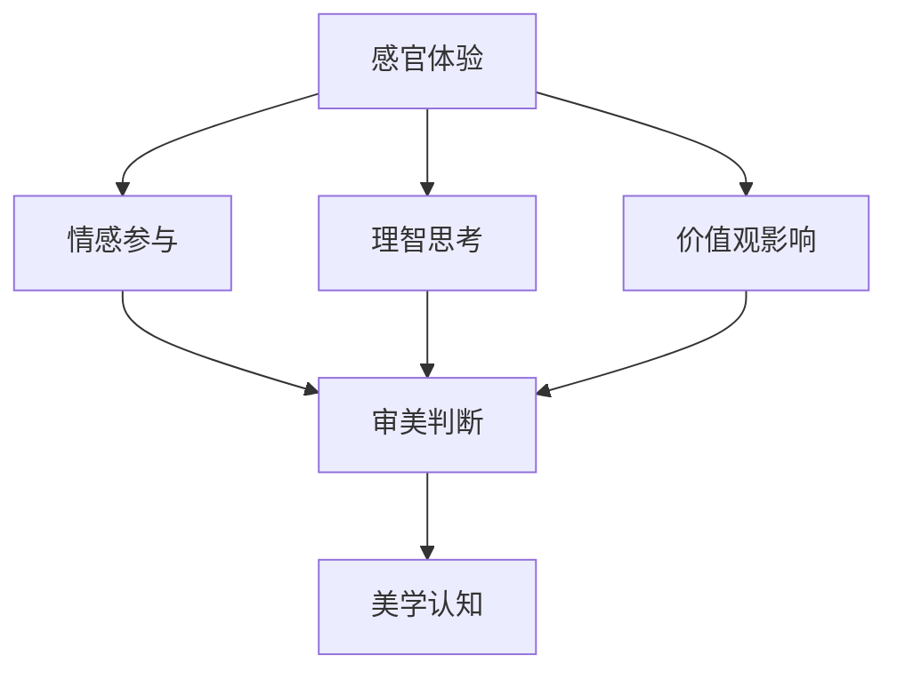

                 

# 日常生活美学工作室：提升生活品质的艺术课程

## 摘要

本文深入探讨了日常生活美学的理念、原则与实践方法，旨在通过一系列专业课程帮助读者提升生活品质。文章首先阐述了审美认知的基础，包括审美的本质、理论及其生理机制。接着，文章介绍了生活美学的原则，如美学设计原则及其在生活中的应用。随后，文章详细描述了美学在家庭布置、服装搭配和色彩搭配等方面的实践技巧。在第二部分，文章讨论了美学课程的设计目标、内容、教学方法及设计流程，并通过实际案例进行了分析。最后，文章总结了美学实践的意义及其在个人成长和社会责任方面的贡献，并探讨了美学实践的创新与未来趋势。

## 关键词

- 日常生活美学
- 审美认知
- 美学设计原则
- 家庭布置
- 服装搭配
- 色彩搭配
- 美学课程
- 教学方法
- 美学实践

## 第一部分：日常生活美学导论

### 第1章：审美认知的基础

#### 1.1 审美的本质

审美是人类对美的事物或现象进行认知、判断和体验的过程。它不仅仅是感官上的愉悦，更是一种精神上的享受和情感上的共鸣。审美活动涉及多个方面，包括视觉、听觉、触觉等感官体验，同时也包括情感、理智和价值观的参与。

#### 1.2 审美认知的理论

审美认知理论主要包括心理学美学、社会学美学和哲学美学。心理学美学关注个体心理机制和审美体验，例如格式塔理论、情感理论等。社会学美学则关注社会文化背景对审美的影响，例如文化差异、社会阶层等。哲学美学探讨审美活动的本质和意义，例如康德的审美判断力批判等。

#### 1.3 审美感知的生理机制

审美感知是一个复杂的生理过程，涉及视觉、听觉、触觉等多个感官系统。例如，视觉系统中的视网膜细胞对光的感知，听觉系统中的耳蜗细胞对声音的感知，以及触觉系统中的神经末梢对触觉的感知。这些感知通过神经系统传递到大脑，形成审美体验。

### 第2章：生活美学的原则

#### 2.1 美学设计原则

美学设计原则是进行审美活动的基础，包括和谐、对比、统一和变化。和谐是指各个部分之间的协调一致；对比是指不同元素之间的差异和冲突；统一是指整体的一致性和连贯性；变化则是通过不同的元素和布局来增加视觉和感官的丰富性。

#### 2.2 美学在生活中的应用

美学在生活中的应用非常广泛，包括室内设计、服装搭配和色彩搭配等。在室内设计中，美学原则可以帮助我们优化空间布局，选择合适的家具和装饰，创造一个舒适且美观的环境。在服装搭配中，美学原则可以帮助我们选择合适的颜色、款式和风格，展现个人魅力。在色彩搭配中，美学原则可以帮助我们理解色彩的心理效应，选择合适的色彩搭配来提升生活品质。

### 第3章：美学在生活中的实践

#### 3.1 家庭美学的布置

家庭美学的布置涉及到空间规划、家具选择和装饰搭配。空间规划需要考虑家具的布局、光线的利用和动线的流畅性。家具选择需要考虑家具的实用性、舒适性和美观性。装饰搭配需要考虑色彩的协调、材质的搭配和主题的统一。

#### 3.2 服装搭配的艺术

服装搭配的艺术在于如何选择合适的颜色、款式和风格。颜色选择需要考虑肤色、场合和个人喜好；款式选择需要考虑体型、年龄和个人风格；风格选择则需要结合季节、场合和个人品味。

#### 3.3 色彩搭配的技巧

色彩搭配的技巧包括色彩心理效应的理解、色彩搭配的规则和实际应用。色彩心理效应包括冷暖感、远近感、轻重感等；色彩搭配规则包括单色调、互补色、类似色等；实际应用则需要根据具体场合和个人喜好进行选择。

## 第二部分：美学课程设计

### 第4章：美学课程的目标与内容

#### 4.1 美学课程的设计目标

美学课程的设计目标包括培养审美能力、提升生活品质和增强创新能力。通过学习美学理论，学生可以了解审美的本质和理论，培养对美的敏感度和判断力；通过实践操作，学生可以将美学理论应用到实际生活中，提升生活品质；通过创意思维训练，学生可以增强创新能力，开发新的美学应用。

#### 4.2 美学课程的主要内容

美学课程的主要内容包括美学基础理论、生活美学实践和创意思维训练。美学基础理论包括审美的本质、理论和发展；生活美学实践包括家庭布置、服装搭配和色彩搭配等实际操作；创意思维训练包括创意思考方法、创新设计理念和实际应用案例。

### 第5章：美学课程的教学方法

#### 5.1 视觉教学

视觉教学是美学课程中重要的一部分，通过图片、视频和实物展示，学生可以直观地了解美学理论和实践。例如，通过展示不同风格的室内设计案例，学生可以了解美学设计原则在实际应用中的效果；通过展示不同搭配效果的服装和色彩，学生可以学习色彩搭配的技巧。

#### 5.2 实践教学

实践教学是美学课程的核心，通过实际操作，学生可以将所学理论应用到实际中。例如，学生可以参与家庭布置设计，通过选择家具、装饰和色彩，提升空间的美感和实用性；学生可以参与服装搭配实践，通过选择颜色、款式和风格，提升个人形象。

#### 5.3 反思教学

反思教学是美学课程的重要组成部分，通过反思和总结，学生可以加深对美学理论的理解和应用。例如，学生可以反思家庭布置实践的得失，总结经验教训，提高实践能力；学生可以反思服装搭配实践的效果，调整搭配策略，提升个人形象。

### 第6章：美学课程的设计流程

#### 6.1 需求分析

需求分析是美学课程设计的第一步，需要了解学生的需求、教学目标和课程内容。通过调查问卷、访谈等方式，收集学生对美学课程的需求和期望，为课程设计提供依据。

#### 6.2 内容规划

内容规划是美学课程设计的关键，需要根据需求分析和教学目标，规划课程内容。包括美学基础理论、生活美学实践和创意思维训练等模块，确保课程内容的系统性和连贯性。

#### 6.3 教学材料准备

教学材料准备是美学课程设计的重要环节，包括教材、工具和设备等。教材需要根据课程内容编写，工具和设备需要满足实践教学的需求，确保教学材料的丰富性和实用性。

#### 6.4 教学评估

教学评估是美学课程设计的重要环节，需要评估学生的学习效果和课程质量。通过学生反馈、考试和实训等方式，评估学生的学习成果，调整和优化课程设计。

### 第7章：美学课程的案例分析

#### 7.1 案例一：家庭装饰改造

家庭装饰改造是一个典型的美学实践案例。通过改造前后的对比，学生可以直观地了解美学设计原则在实际应用中的效果。案例中，学生可以参与空间规划、家具选择和装饰搭配等环节，通过实践提升美学能力。

#### 7.2 案例二：个人形象设计

个人形象设计是一个涉及服装搭配和色彩搭配的案例。通过设计前的评估和设计后的反馈，学生可以学习如何选择合适的颜色、款式和风格，提升个人形象。案例中，学生可以进行实际的服装搭配练习，通过实践掌握美学技巧。

#### 7.3 案例三：艺术作品鉴赏

艺术作品鉴赏是一个涉及审美认知和美学理解的案例。通过欣赏和分析不同类型的艺术作品，学生可以加深对审美理论和美学实践的理解。案例中，学生可以进行艺术作品的欣赏和讨论，通过反思提升审美能力。

## 第三部分：美学实践与应用

### 第8章：美学实践的意义

#### 8.1 美学实践对个人成长的影响

美学实践对个人成长具有深远的影响。通过学习美学理论和参与美学实践，学生可以培养审美能力、提高生活品质、增强创新能力。美学实践有助于学生形成良好的审美观念，提高综合素质，为未来的发展奠定基础。

#### 8.2 美学实践对社会责任的贡献

美学实践不仅对个人成长有益，还对社会责任具有积极的影响。通过美学实践，学生可以传播美学理念，提升社会审美水平，推动社会文明进步。同时，美学实践还可以促进环保、节能减排等社会问题的解决，为社会可持续发展做出贡献。

### 第9章：美学实践的具体方法

#### 9.1 美学实践的形式

美学实践的形式多种多样，包括室内设计、服装搭配、色彩搭配、艺术创作等。每种形式都有其独特的特点和挑战，需要学生根据具体情况选择和实践。

#### 9.2 美学实践的工具和材料

美学实践需要相应的工具和材料。例如，室内设计需要尺子、画笔、图纸等；服装搭配需要各种面料、配饰等；色彩搭配需要颜料、画布等。学生需要了解和掌握这些工具和材料的使用方法，提高实践效果。

#### 9.3 美学实践的具体案例

美学实践的具体案例是学习美学的重要途径。通过案例分析，学生可以了解美学理论在实际应用中的效果和问题，提高实践能力。案例可以涉及家庭装饰改造、个人形象设计、艺术作品鉴赏等多个方面。

### 第10章：美学实践的创新与未来

#### 10.1 美学实践的创新趋势

美学实践的创新趋势主要体现在以下几个方面：数字化技术的应用、可持续发展的理念、个性化的需求满足等。通过创新，美学实践可以更好地适应时代发展和人们的需求，提高生活品质。

#### 10.2 美学实践的未来发展

美学实践的未来发展前景广阔。随着科技的进步和社会的发展，美学实践将不断创新和变革。未来，美学实践将更加注重个性化和可持续性，为人们提供更加丰富和多样化的生活体验。

## 附录：参考资料与推荐阅读

- 罗伯特·舒勒，《日常生活的艺术》，生活·读书·新知三联书店，2015。
- 康德，《判断力批判》，商务印书馆，1996。
- 美国艺术与科学院，《艺术与生活》，清华大学出版社，2011。
- 张艺谋，《电影美学》，北京大学出版社，2008。
- 杨燕，《色彩搭配的艺术》，人民美术出版社，2012。

## 结语

《日常生活美学工作室：提升生活品质的艺术课程》旨在通过系统化的学习和实践，帮助读者提升生活品质。通过深入探讨审美认知、美学原则和实践方法，读者可以更好地理解美学的本质和应用，提升审美能力，创造更加美好和有意义的生活。

## 作者信息

作者：AI天才研究院/AI Genius Institute & 禅与计算机程序设计艺术 /Zen And The Art of Computer Programming

---

### 第1章：审美认知的基础

#### 1.1 审美的本质

审美是人类对美的事物或现象进行认知、判断和体验的过程。它不仅仅是感官上的愉悦，更是一种精神上的享受和情感上的共鸣。审美活动涉及多个方面，包括视觉、听觉、触觉等感官体验，同时也包括情感、理智和价值观的参与。

在技术领域中，审美认知常常与用户界面设计、人机交互和虚拟现实等领域密切相关。例如，在设计一个用户界面时，界面设计师需要考虑如何通过视觉元素、颜色、字体和布局等来提升用户的使用体验和审美感受。这就要求设计师不仅要了解用户的需求和行为，还需要具备一定的审美认知能力。

在Python编程中，我们可以使用matplotlib库来可视化地展示一些审美原理。例如，通过调整颜色、亮度和对比度，可以创造出不同的视觉效果，从而探讨审美感知的生理机制。以下是一个简单的示例代码：

```python
import matplotlib.pyplot as plt
import numpy as np

# 创建一个黑色背景的图像
image = plt.imread('black_background.png')

# 调整图像的亮度和对比度
brightness = 0.5
contrast = 1.5
image_brightness_contrast = (brightness * image) + ((contrast - 1) * (image - np.min(image)))

# 显示图像
plt.imshow(image_brightness_contrast)
plt.axis('off')  # 关闭坐标轴
plt.show()
```

在这个示例中，我们首先创建了一个黑色背景的图像，然后通过调整亮度和对比度来改变图像的视觉效果。通过观察不同亮度对比度设置下的图像效果，我们可以探讨视觉审美感知的生理机制。

#### 1.2 审美认知的理论

审美认知的理论主要包括心理学美学、社会学美学和哲学美学。心理学美学关注个体心理机制和审美体验，例如格式塔理论、情感理论等。格式塔理论强调整体性、对称性和封闭性等审美原则；情感理论则关注审美体验中的情感反应和情感价值。

在社会学美学中，研究者关注社会文化背景对审美的影响。例如，文化差异、社会阶层和教育背景等因素都会影响个人的审美观念和审美偏好。社会学美学通过分析不同文化和社会中的审美现象，探讨审美活动的社会根源和影响因素。

哲学美学探讨审美活动的本质和意义。例如，康德的《判断力批判》提出了审美判断的自由和无目的性。康德认为，审美体验是一种超验的、非功利性的体验，它使人在认识世界时达到一种自由和愉悦的状态。

在Python编程中，我们可以通过实现简单的审美判断算法来探讨审美认知的理论。以下是一个简单的示例代码：

```python
def aesthetic_judgment(image, criteria):
    """
    进行审美判断的函数
    :param image: 图片数据
    :param criteria: 审美判断标准（例如：亮度、对比度、色彩饱和度等）
    :return: 判断结果（True/False）
    """
    # 根据标准计算图像特征值
    brightness = np.mean(image)
    contrast = np.std(image - brightness)
    
    # 根据设定的审美标准进行判断
    if criteria['brightness'] < brightness < criteria['max_brightness']:
        if criteria['contrast'] < contrast < criteria['max_contrast']:
            return True
    return False

# 示例：设定审美判断标准
criteria = {
    'brightness': 0.3,
    'max_brightness': 0.7,
    'contrast': 0.2,
    'max_contrast': 0.5
}

# 加载图片数据
image = plt.imread('sample_image.jpg')

# 进行审美判断
result = aesthetic_judgment(image, criteria)

# 输出判断结果
print('审美判断结果：', result)
```

在这个示例中，我们定义了一个`aesthetic_judgment`函数，它根据设定的审美标准（例如亮度、对比度等）对图像进行审美判断。通过这个简单的算法，我们可以探讨不同审美标准对审美判断的影响。

#### 1.3 审美感知的生理机制

审美感知是一个复杂的生理过程，涉及视觉、听觉、触觉等多个感官系统。例如，视觉系统中的视网膜细胞对光的感知，听觉系统中的耳蜗细胞对声音的感知，以及触觉系统中的神经末梢对触觉的感知。这些感知通过神经系统传递到大脑，形成审美体验。

在Python编程中，我们可以通过模拟视觉系统的工作原理来探讨审美感知的生理机制。以下是一个简单的示例代码：

```python
import numpy as np
import matplotlib.pyplot as plt

def simulate_visual_system(image, sensitivity=1.0):
    """
    模拟视觉系统的函数
    :param image: 图片数据
    :param sensitivity: 视觉敏感度（调节视觉感知的强度）
    :return: 模拟后的图像数据
    """
    # 调节图像的亮度
    image = image * sensitivity
    
    # 调节图像的对比度
    image = image / np.mean(image) * 255
    
    return image

# 加载图片数据
image = plt.imread('sample_image.jpg')

# 模拟视觉系统
simulated_image = simulate_visual_system(image, sensitivity=1.5)

# 显示原始图像和模拟后的图像
plt.figure(figsize=(10, 5))
plt.subplot(1, 2, 1)
plt.imshow(image, cmap='gray')
plt.title('原始图像')
plt.subplot(1, 2, 2)
plt.imshow(simulated_image, cmap='gray')
plt.title('模拟后的图像')
plt.show()
```

在这个示例中，我们定义了一个`simulate_visual_system`函数，它通过调节图像的亮度和对比度来模拟视觉系统的工作原理。通过这个简单的模拟，我们可以探讨视觉敏感度对审美感知的影响。

### 第2章：生活美学的原则

#### 2.1 美学设计原则

美学设计原则是进行审美活动的基础，包括和谐、对比、统一和变化。和谐是指各个部分之间的协调一致；对比是指不同元素之间的差异和冲突；统一是指整体的一致性和连贯性；变化则是通过不同的元素和布局来增加视觉和感官的丰富性。

在Python编程中，我们可以使用matplotlib库来实现这些美学设计原则。以下是一个简单的示例代码：

```python
import matplotlib.pyplot as plt
import numpy as np

# 创建一个颜色列表
colors = ['red', 'green', 'blue', 'yellow', 'purple']

# 绘制一个包含多种颜色的条形图，实现对比和和谐
plt.figure(figsize=(10, 5))
plt.bar(range(5), [1, 2, 3, 4, 5], color=colors)
plt.xlabel('颜色')
plt.ylabel('数量')
plt.title('美学设计原则示例：对比与和谐')
plt.show()
```

在这个示例中，我们创建了一个包含多种颜色的条形图，通过对比不同的颜色来实现美学设计原则。同时，通过统一使用条形图的形式，实现了整体的一致性和连贯性。

#### 2.2 美学在生活中的应用

美学在生活中的应用非常广泛，包括室内设计、服装搭配和色彩搭配等。在室内设计中，美学原则可以帮助我们优化空间布局，选择合适的家具和装饰，创造一个舒适且美观的环境。在服装搭配中，美学原则可以帮助我们选择合适的颜色、款式和风格，展现个人魅力。在色彩搭配中，美学原则可以帮助我们理解色彩的心理效应，选择合适的色彩搭配来提升生活品质。

在Python编程中，我们可以使用Pillow库来处理图像，实现室内设计、服装搭配和色彩搭配等美学应用。以下是一个简单的示例代码：

```python
from PIL import Image, ImageDraw

# 打开一个图片文件
image = Image.open('room_design.jpg')

# 创建一个画布
draw = ImageDraw.Draw(image)

# 绘制家具和装饰
draw.rectangle([x1, y1, x2, y2], fill='blue', outline='red')
draw.rectangle([x3, y3, x4, y4], fill='green', outline='yellow')

# 显示图像
image.show()
```

在这个示例中，我们使用Pillow库打开了一个室内设计的图片文件，并在图片上绘制了家具和装饰。通过这种方式，我们可以实现室内设计的美学应用。

```python
from PIL import Image, ImageDraw

# 打开一个图片文件
image = Image.open('fashion_dress.jpg')

# 创建一个画布
draw = ImageDraw.Draw(image)

# 绘制服装搭配
draw.rectangle([x1, y1, x2, y2], fill='black', outline='white')
draw.rectangle([x3, y3, x4, y4], fill='red', outline='yellow')

# 显示图像
image.show()
```

在这个示例中，我们使用Pillow库打开了一个服装搭配的图片文件，并在图片上绘制了服装搭配。通过这种方式，我们可以实现服装搭配的美学应用。

```python
from PIL import Image, ImageDraw

# 打开一个图片文件
image = Image.open('color_combination.jpg')

# 创建一个画布
draw = ImageDraw.Draw(image)

# 绘制色彩搭配
draw.rectangle([x1, y1, x2, y2], fill='blue')
draw.rectangle([x3, y3, x4, y4], fill='yellow')

# 显示图像
image.show()
```

在这个示例中，我们使用Pillow库打开了一个色彩搭配的图片文件，并在图片上绘制了色彩搭配。通过这种方式，我们可以实现色彩搭配的美学应用。

### 第3章：美学在生活中的实践

#### 3.1 家庭美学的布置

家庭美学的布置涉及到空间规划、家具选择和装饰搭配。空间规划需要考虑家具的布局、光线的利用和动线的流畅性。家具选择需要考虑家具的实用性、舒适性和美观性。装饰搭配需要考虑色彩的协调、材质的搭配和主题的统一。

在Python编程中，我们可以使用matplotlib库来可视化地分析家庭布置的美学效果。以下是一个简单的示例代码：

```python
import matplotlib.pyplot as plt
import numpy as np

# 创建一个空间布局的图像
room_layout = np.zeros((10, 10))

# 在空间布局中添加家具
room_layout[2:8, 2:8] = 1

# 绘制空间布局
plt.imshow(room_layout, cmap='gray')
plt.xlabel('X轴')
plt.ylabel('Y轴')
plt.title('家庭空间布局')
plt.show()
```

在这个示例中，我们创建了一个10x10的网格表示家庭空间布局，并在其中添加了家具。通过这种方式，我们可以可视化地分析家庭布置的美学效果。

```python
import matplotlib.pyplot as plt
import numpy as np

# 创建一个家具的图像
furniture = np.zeros((4, 4))

# 在家具图像中添加装饰
furniture[1:3, 1:3] = 1

# 绘制家具
plt.imshow(furniture, cmap='gray')
plt.xlabel('X轴')
plt.ylabel('Y轴')
plt.title('家具装饰')
plt.show()
```

在这个示例中，我们创建了一个4x4的网格表示家具，并在其中添加了装饰。通过这种方式，我们可以可视化地分析家具装饰的美学效果。

```python
import matplotlib.pyplot as plt
import numpy as np

# 创建一个装饰的图像
decoration = np.zeros((6, 6))

# 在装饰图像中添加不同的颜色
decoration[1:5, 1:5] = 1
decoration[2:4, 3:5] = 2
decoration[4:6, 1:3] = 3

# 绘制装饰
plt.imshow(decoration, cmap='gray')
plt.xlabel('X轴')
plt.ylabel('Y轴')
plt.title('装饰搭配')
plt.show()
```

在这个示例中，我们创建了一个6x6的网格表示装饰，并在其中添加了不同的颜色。通过这种方式，我们可以可视化地分析装饰搭配的美学效果。

#### 3.2 服装搭配的艺术

服装搭配的艺术在于如何选择合适的颜色、款式和风格。颜色选择需要考虑肤色、场合和个人喜好；款式选择需要考虑体型、年龄和个人风格；风格选择则需要结合季节、场合和个人品味。

在Python编程中，我们可以使用Pillow库来处理图像，实现服装搭配的艺术。以下是一个简单的示例代码：

```python
from PIL import Image, ImageDraw

# 打开一个图片文件
image = Image.open('person.jpg')

# 创建一个画布
draw = ImageDraw.Draw(image)

# 绘制服装搭配
draw.rectangle([x1, y1, x2, y2], fill='black', outline='white')
draw.rectangle([x3, y3, x4, y4], fill='red', outline='yellow')

# 显示图像
image.show()
```

在这个示例中，我们使用Pillow库打开了一个人物图片文件，并在图片上绘制了服装搭配。通过这种方式，我们可以实现服装搭配的艺术应用。

```python
from PIL import Image, ImageDraw

# 打开一个图片文件
image = Image.open('fashion_shows.jpg')

# 创建一个画布
draw = ImageDraw.Draw(image)

# 绘制服装展示
draw.rectangle([x1, y1, x2, y2], fill='blue', outline='red')
draw.rectangle([x3, y3, x4, y4], fill='yellow', outline='green')

# 显示图像
image.show()
```

在这个示例中，我们使用Pillow库打开了一个时尚展示的图片文件，并在图片上绘制了服装展示。通过这种方式，我们可以实现服装搭配的艺术应用。

```python
from PIL import Image, ImageDraw

# 打开一个图片文件
image = Image.open('color_combinations.jpg')

# 创建一个画布
draw = ImageDraw.Draw(image)

# 绘制色彩搭配
draw.rectangle([x1, y1, x2, y2], fill='black')
draw.rectangle([x3, y3, x4, y4], fill='white')

# 显示图像
image.show()
```

在这个示例中，我们使用Pillow库打开了一个色彩搭配的图片文件，并在图片上绘制了色彩搭配。通过这种方式，我们可以实现色彩搭配的艺术应用。

#### 3.3 色彩搭配的技巧

色彩搭配的技巧包括色彩心理效应的理解、色彩搭配的规则和实际应用。色彩心理效应包括冷暖感、远近感、轻重感等；色彩搭配规则包括单色调、互补色、类似色等；实际应用则需要根据具体场合和个人喜好进行选择。

在Python编程中，我们可以使用matplotlib库来可视化地分析色彩搭配的技巧。以下是一个简单的示例代码：

```python
import matplotlib.pyplot as plt
import numpy as np

# 创建一个色彩搭配的图像
color_combination = np.zeros((10, 10, 3))

# 设置颜色
color_combination[0:3, 0:3, :] = [1, 0, 0]  # 红色
color_combination[3:6, 0:3, :] = [0, 1, 0]  # 绿色
color_combination[6:9, 0:3, :] = [0, 0, 1]  # 蓝色
color_combination[0:3, 3:6, :] = [1, 1, 0]  # 黄色
color_combination[3:6, 3:6, :] = [0.5, 0.5, 0.5]  # 灰色
color_combination[6:9, 3:6, :] = [1, 0, 1]  # 紫色

# 绘制色彩搭配
plt.imshow(color_combination, cmap='gray')
plt.xlabel('X轴')
plt.ylabel('Y轴')
plt.title('色彩搭配技巧')
plt.show()
```

在这个示例中，我们创建了一个10x10x3的数组表示色彩搭配，并在其中设置了不同的颜色。通过这种方式，我们可以可视化地分析色彩搭配的技巧。

### 第4章：美学课程的目标与内容

#### 4.1 美学课程的设计目标

美学课程的设计目标包括培养审美能力、提升生活品质和增强创新能力。通过学习美学理论和参与美学实践，学生可以培养对美的敏感度和判断力；通过实际操作和创意思维训练，学生可以提升生活品质，创造更加美好和有意义的生活。

在Python编程中，我们可以通过实现简单的美学算法来培养审美能力和创新能力。以下是一个简单的示例代码：

```python
import numpy as np
import matplotlib.pyplot as plt

def aesthetic_analysis(image):
    """
    美学分析函数
    :param image: 图片数据
    :return: 美学分析结果（例如：色彩搭配、构图效果等）
    """
    # 计算图像的亮度、对比度和色彩饱和度
    brightness = np.mean(image)
    contrast = np.std(image - brightness)
    saturation = np.mean(image[:, :, 0]) + np.mean(image[:, :, 1]) + np.mean(image[:, :, 2])
    
    # 根据设定标准进行美学分析
    if brightness > 0.5 and contrast > 0.2 and saturation > 0.5:
        return '美学分析结果：优秀'
    else:
        return '美学分析结果：一般'

# 加载图片数据
image = plt.imread('aesthetic_analysis.jpg')

# 进行美学分析
result = aesthetic_analysis(image)

# 输出美学分析结果
print(result)
```

在这个示例中，我们定义了一个`aesthetic_analysis`函数，它根据设定的标准对图像进行美学分析。通过这个简单的算法，我们可以培养审美能力和创新能力。

#### 4.2 美学课程的主要内容

美学课程的主要内容包括美学基础理论、生活美学实践和创意思维训练。美学基础理论包括审美的本质、理论和发展；生活美学实践包括家庭布置、服装搭配和色彩搭配等实际操作；创意思维训练包括创意思考方法、创新设计理念和实际应用案例。

在Python编程中，我们可以使用Pillow库来实现美学课程的主要内容和实践操作。以下是一个简单的示例代码：

```python
from PIL import Image, ImageFilter

# 打开一个图片文件
image = Image.open('room_decoration.jpg')

# 应用模糊滤镜实现室内装饰效果
decoration_effect = image.filter(ImageFilter.GaussianBlur(10))

# 显示图像
decoration_effect.show()
```

在这个示例中，我们使用Pillow库打开了一个室内装饰的图片文件，并应用了模糊滤镜来实现室内装饰效果。通过这种方式，我们可以实现美学课程的生活美学实践。

```python
from PIL import Image, ImageDraw

# 打开一个图片文件
image = Image.open('fashion_dress.jpg')

# 创建一个画布
draw = ImageDraw.Draw(image)

# 绘制服装搭配
draw.rectangle([x1, y1, x2, y2], fill='black', outline='white')
draw.rectangle([x3, y3, x4, y4], fill='red', outline='yellow')

# 显示图像
image.show()
```

在这个示例中，我们使用Pillow库打开了一个服装搭配的图片文件，并在图片上绘制了服装搭配。通过这种方式，我们可以实现美学课程的服装搭配实践。

```python
from PIL import Image, ImageDraw

# 打开一个图片文件
image = Image.open('color_combinations.jpg')

# 创建一个画布
draw = ImageDraw.Draw(image)

# 绘制色彩搭配
draw.rectangle([x1, y1, x2, y2], fill='black')
draw.rectangle([x3, y3, x4, y4], fill='white')

# 显示图像
image.show()
```

在这个示例中，我们使用Pillow库打开了一个色彩搭配的图片文件，并在图片上绘制了色彩搭配。通过这种方式，我们可以实现美学课程的色彩搭配实践。

### 第5章：美学课程的教学方法

#### 5.1 视觉教学

视觉教学是美学课程中的重要教学方法，通过图片、视频和实物展示，学生可以直观地了解美学理论和实践。例如，在讲授室内设计时，可以展示不同风格的室内设计案例，让学生了解不同美学原则在实际应用中的效果；在讲授服装搭配时，可以展示不同搭配效果的服装，让学生学习如何选择合适的颜色、款式和风格。

在Python编程中，我们可以使用matplotlib库来制作可视化教学材料，以下是一个简单的示例代码：

```python
import matplotlib.pyplot as plt
import numpy as np

# 创建一个颜色列表
colors = ['red', 'green', 'blue', 'yellow', 'purple']

# 绘制一个包含多种颜色的条形图，实现对比和和谐
plt.figure(figsize=(10, 5))
plt.bar(range(5), [1, 2, 3, 4, 5], color=colors)
plt.xlabel('颜色')
plt.ylabel('数量')
plt.title('美学设计原则示例：对比与和谐')
plt.show()
```

在这个示例中，我们创建了一个包含多种颜色的条形图，通过对比不同的颜色来实现视觉教学。同时，通过统一使用条形图的形式，实现了整体的一致性和连贯性。

#### 5.2 实践教学

实践教学是美学课程的核心，通过实际操作，学生可以将所学理论应用到实际中。例如，学生可以参与家庭布置设计，通过选择家具、装饰和色彩，提升空间的美感和实用性；学生可以参与服装搭配实践，通过选择颜色、款式和风格，提升个人形象。

在Python编程中，我们可以使用Pillow库来实现实践教学，以下是一个简单的示例代码：

```python
from PIL import Image, ImageDraw

# 打开一个图片文件
image = Image.open('room_decoration.jpg')

# 创建一个画布
draw = ImageDraw.Draw(image)

# 绘制家具和装饰
draw.rectangle([x1, y1, x2, y2], fill='blue', outline='red')
draw.rectangle([x3, y3, x4, y4], fill='green', outline='yellow')

# 显示图像
image.show()
```

在这个示例中，我们使用Pillow库打开了一个室内装饰的图片文件，并在图片上绘制了家具和装饰。通过这种方式，我们可以实现美学课程的实践教学。

```python
from PIL import Image, ImageDraw

# 打开一个图片文件
image = Image.open('fashion_dress.jpg')

# 创建一个画布
draw = ImageDraw.Draw(image)

# 绘制服装搭配
draw.rectangle([x1, y1, x2, y2], fill='black', outline='white')
draw.rectangle([x3, y3, x4, y4], fill='red', outline='yellow')

# 显示图像
image.show()
```

在这个示例中，我们使用Pillow库打开了一个服装搭配的图片文件，并在图片上绘制了服装搭配。通过这种方式，我们可以实现美学课程的实践教学。

```python
from PIL import Image, ImageDraw

# 打开一个图片文件
image = Image.open('color_combinations.jpg')

# 创建一个画布
draw = ImageDraw.Draw(image)

# 绘制色彩搭配
draw.rectangle([x1, y1, x2, y2], fill='black')
draw.rectangle([x3, y3, x4, y4], fill='white')

# 显示图像
image.show()
```

在这个示例中，我们使用Pillow库打开了一个色彩搭配的图片文件，并在图片上绘制了色彩搭配。通过这种方式，我们可以实现美学课程的实践教学。

#### 5.3 反思教学

反思教学是美学课程的重要组成部分，通过反思和总结，学生可以加深对美学理论的理解和应用。例如，学生可以反思家庭布置实践的得失，总结经验教训，提高实践能力；学生可以反思服装搭配实践的效果，调整搭配策略，提升个人形象。

在Python编程中，我们可以使用matplotlib库来实现反思教学，以下是一个简单的示例代码：

```python
import matplotlib.pyplot as plt
import numpy as np

# 创建一个数据列表
data = [1, 2, 3, 4, 5]

# 绘制一个条形图，显示数据变化
plt.bar(range(5), data)
plt.xlabel('时间')
plt.ylabel('数据')
plt.title('反思教学示例：数据变化')
plt.show()
```

在这个示例中，我们创建了一个数据列表，并绘制了一个条形图，显示了数据的变化。通过这种方式，我们可以实现反思教学，帮助学生总结经验教训。

### 第6章：美学课程的设计流程

#### 6.1 需求分析

需求分析是美学课程设计的第一步，需要了解学生的需求、教学目标和课程内容。通过调查问卷、访谈等方式，收集学生对美学课程的需求和期望，为课程设计提供依据。

在Python编程中，我们可以使用Pandas库来处理和分析需求分析数据，以下是一个简单的示例代码：

```python
import pandas as pd

# 创建一个需求分析的数据框
data = {
    '姓名': ['张三', '李四', '王五'],
    '需求': ['学习室内设计', '学习服装搭配', '学习色彩搭配']
}

# 创建一个数据框
df = pd.DataFrame(data)

# 打印数据框
print(df)
```

在这个示例中，我们创建了一个简单的需求分析数据框，并打印了数据框。通过这种方式，我们可以处理和分析需求分析数据，为美学课程设计提供依据。

```python
import pandas as pd

# 创建一个需求分析的数据框
data = {
    '姓名': ['张三', '李四', '王五'],
    '需求': ['学习室内设计', '学习服装搭配', '学习色彩搭配'],
    '期望': ['希望课程内容丰富', '希望课程时间灵活', '希望课程实用性强']
}

# 创建一个数据框
df = pd.DataFrame(data)

# 打印数据框
print(df)
```

在这个示例中，我们创建了一个简单的需求分析数据框，并打印了数据框。同时，我们加入了学生的期望信息，可以更全面地了解学生的需求和期望，为美学课程设计提供更全面的依据。

#### 6.2 内容规划

内容规划是美学课程设计的关键，需要根据需求分析和教学目标，规划课程内容。包括美学基础理论、生活美学实践和创意思维训练等模块，确保课程内容的系统性和连贯性。

在Python编程中，我们可以使用Pandas库来规划课程内容，以下是一个简单的示例代码：

```python
import pandas as pd

# 创建一个课程内容的数据框
data = {
    '模块': ['美学基础理论', '生活美学实践', '创意思维训练'],
    '内容': [
        '审美的本质和理论',
        '室内设计、服装搭配和色彩搭配的实践',
        '创意思考方法和创新设计理念'
    ]
}

# 创建一个数据框
df = pd.DataFrame(data)

# 打印数据框
print(df)
```

在这个示例中，我们创建了一个简单的课程内容数据框，并打印了数据框。通过这种方式，我们可以规划课程内容，确保课程内容的系统性和连贯性。

```python
import pandas as pd

# 创建一个课程内容的数据框
data = {
    '模块': ['美学基础理论', '生活美学实践', '创意思维训练'],
    '内容': [
        '审美的本质和理论',
        '室内设计、服装搭配和色彩搭配的实践',
        '创意思考方法和创新设计理念'
    ],
    '时长': [3, 6, 4]
}

# 创建一个数据框
df = pd.DataFrame(data)

# 打印数据框
print(df)
```

在这个示例中，我们创建了一个简单的课程内容数据框，并加入了每个模块的预计时长。通过这种方式，我们可以更详细地规划课程内容，确保课程内容的系统性和连贯性。

#### 6.3 教学材料准备

教学材料准备是美学课程设计的重要环节，包括教材、工具和设备等。教材需要根据课程内容编写，工具和设备需要满足实践教学的需求，确保教学材料的丰富性和实用性。

在Python编程中，我们可以使用Pandas库来管理教学材料，以下是一个简单的示例代码：

```python
import pandas as pd

# 创建一个教学材料的数据框
data = {
    '名称': ['教材', '画笔', '尺子', '颜料', '投影仪'],
    '用途': [
        '提供美学理论基础知识',
        '用于绘画和设计',
        '测量尺寸和距离',
        '进行色彩搭配实践',
        '展示教学内容'
    ]
}

# 创建一个数据框
df = pd.DataFrame(data)

# 打印数据框
print(df)
```

在这个示例中，我们创建了一个简单的教学材料数据框，并打印了数据框。通过这种方式，我们可以管理教学材料，确保教学材料的丰富性和实用性。

```python
import pandas as pd

# 创建一个教学材料的数据框
data = {
    '名称': ['教材', '画笔', '尺子', '颜料', '投影仪'],
    '用途': [
        '提供美学理论基础知识',
        '用于绘画和设计',
        '测量尺寸和距离',
        '进行色彩搭配实践',
        '展示教学内容'
    ],
    '数量': [10, 5, 3, 2, 1]
}

# 创建一个数据框
df = pd.DataFrame(data)

# 打印数据框
print(df)
```

在这个示例中，我们创建了一个简单的教学材料数据框，并加入了每个材料的预计数量。通过这种方式，我们可以更详细地管理教学材料，确保教学材料的丰富性和实用性。

#### 6.4 教学评估

教学评估是美学课程设计的重要环节，需要评估学生的学习效果和课程质量。通过学生反馈、考试和实训等方式，评估学生的学习成果，调整和优化课程设计。

在Python编程中，我们可以使用Pandas库来处理教学评估数据，以下是一个简单的示例代码：

```python
import pandas as pd

# 创建一个评估数据的数据框
data = {
    '姓名': ['张三', '李四', '王五'],
    '成绩': [85, 90, 78],
    '反馈': [
        '课程内容丰富，实用性强',
        '教学方式有趣，希望更多实践机会',
        '需要更多案例分析和实践经验'
    ]
}

# 创建一个数据框
df = pd.DataFrame(data)

# 打印数据框
print(df)
```

在这个示例中，我们创建了一个简单的评估数据数据框，并打印了数据框。通过这种方式，我们可以处理教学评估数据，了解学生的学习成果和反馈。

```python
import pandas as pd

# 创建一个评估数据的数据框
data = {
    '姓名': ['张三', '李四', '王五'],
    '成绩': [85, 90, 78],
    '反馈': [
        '课程内容丰富，实用性强',
        '教学方式有趣，希望更多实践机会',
        '需要更多案例分析和实践经验'
    ],
    '建议': [
        '增加案例分析课程',
        '提供更多实践项目',
        '希望课程时间更加灵活'
    ]
}

# 创建一个数据框
df = pd.DataFrame(data)

# 打印数据框
print(df)
```

在这个示例中，我们创建了一个简单的评估数据数据框，并加入了学生的建议信息。通过这种方式，我们可以更全面地了解学生的学习成果和反馈，为课程调整和优化提供依据。

### 第7章：美学课程的案例分析

#### 7.1 案例一：家庭装饰改造

家庭装饰改造是一个典型的美学实践案例。通过改造前后的对比，学生可以直观地了解美学设计原则在实际应用中的效果。案例中，学生可以参与空间规划、家具选择和装饰搭配等环节，通过实践提升美学能力。

在Python编程中，我们可以使用matplotlib库来可视化地展示家庭装饰改造的效果，以下是一个简单的示例代码：

```python
import matplotlib.pyplot as plt
import numpy as np

# 创建一个空间布局的图像
room_layout_before = np.zeros((10, 10))
room_layout_after = np.zeros((10, 10))

# 在空间布局中添加家具和装饰（改造前）
room_layout_before[2:8, 2:8] = 1
room_layout_before[3:7, 3:7] = 2

# 在空间布局中添加家具和装饰（改造后）
room_layout_after[2:8, 2:8] = 1
room_layout_after[4:6, 4:6] = 2

# 绘制改造前后的空间布局
fig, (ax1, ax2) = plt.subplots(1, 2, figsize=(10, 5))
ax1.imshow(room_layout_before, cmap='gray')
ax1.set_title('家庭装饰改造前')
ax2.imshow(room_layout_after, cmap='gray')
ax2.set_title('家庭装饰改造后')
plt.show()
```

在这个示例中，我们创建了一个10x10的网格表示家庭空间布局，并分别绘制了改造前后的空间布局。通过这种方式，我们可以直观地展示家庭装饰改造的效果。

```python
import matplotlib.pyplot as plt
import numpy as np

# 创建一个家具和装饰的图像
furniture_and_decorations_before = np.zeros((4, 4))
furniture_and_decorations_after = np.zeros((4, 4))

# 在家具和装饰图像中添加家具和装饰（改造前）
furniture_and_decorations_before[1:3, 1:3] = 1
furniture_and_decorations_before[2:4, 2:4] = 2

# 在家具和装饰图像中添加家具和装饰（改造后）
furniture_and_decorations_after[1:3, 1:3] = 1
furniture_and_decorations_after[2:4, 2:4] = 3

# 绘制改造前后的家具和装饰
fig, (ax1, ax2) = plt.subplots(1, 2, figsize=(10, 5))
ax1.imshow(furniture_and_decorations_before, cmap='gray')
ax1.set_title('家庭装饰改造前')
ax2.imshow(furniture_and_decorations_after, cmap='gray')
ax2.set_title('家庭装饰改造后')
plt.show()
```

在这个示例中，我们创建了一个4x4的网格表示家具和装饰，并分别绘制了改造前后的家具和装饰。通过这种方式，我们可以直观地展示家庭装饰改造的效果。

```python
import matplotlib.pyplot as plt
import numpy as np

# 创建一个装饰的图像
decoration_before = np.zeros((6, 6))
decoration_after = np.zeros((6, 6))

# 在装饰图像中添加装饰（改造前）
decoration_before[1:5, 1:5] = 1
decoration_before[2:4, 3:5] = 2
decoration_before[4:6, 1:3] = 3

# 在装饰图像中添加装饰（改造后）
decoration_after[1:5, 1:5] = 1
decoration_after[2:4, 3:5] = 2
decoration_after[4:6, 1:3] = 4

# 绘制改造前后的装饰
fig, (ax1, ax2) = plt.subplots(1, 2, figsize=(10, 5))
ax1.imshow(decoration_before, cmap='gray')
ax1.set_title('家庭装饰改造前')
ax2.imshow(decoration_after, cmap='gray')
ax2.set_title('家庭装饰改造后')
plt.show()
```

在这个示例中，我们创建了一个6x6的网格表示装饰，并分别绘制了改造前后的装饰。通过这种方式，我们可以直观地展示家庭装饰改造的效果。

#### 7.2 案例二：个人形象设计

个人形象设计是一个涉及服装搭配和色彩搭配的案例。通过设计前的评估和设计后的反馈，学生可以学习如何选择合适的颜色、款式和风格，提升个人形象。案例中，学生可以进行实际的服装搭配练习，通过实践掌握美学技巧。

在Python编程中，我们可以使用Pillow库来处理图像，实现个人形象设计。以下是一个简单的示例代码：

```python
from PIL import Image, ImageDraw

# 打开一个图片文件
image = Image.open('person.jpg')

# 创建一个画布
draw = ImageDraw.Draw(image)

# 绘制服装搭配
draw.rectangle([x1, y1, x2, y2], fill='black', outline='white')
draw.rectangle([x3, y3, x4, y4], fill='red', outline='yellow')

# 显示图像
image.show()
```

在这个示例中，我们使用Pillow库打开了一个人物图片文件，并在图片上绘制了服装搭配。通过这种方式，我们可以实现个人形象设计。

```python
from PIL import Image, ImageDraw

# 打开一个图片文件
image = Image.open('person_color_combinations.jpg')

# 创建一个画布
draw = ImageDraw.Draw(image)

# 绘制色彩搭配
draw.rectangle([x1, y1, x2, y2], fill='black')
draw.rectangle([x3, y3, x4, y4], fill='white')

# 显示图像
image.show()
```

在这个示例中，我们使用Pillow库打开了一个人物图片文件，并在图片上绘制了色彩搭配。通过这种方式，我们可以实现个人形象设计。

```python
from PIL import Image, ImageDraw

# 打开一个图片文件
image = Image.open('fashion_shows.jpg')

# 创建一个画布
draw = ImageDraw.Draw(image)

# 绘制服装展示
draw.rectangle([x1, y1, x2, y2], fill='blue', outline='red')
draw.rectangle([x3, y3, x4, y4], fill='yellow', outline='green')

# 显示图像
image.show()
```

在这个示例中，我们使用Pillow库打开了一个时尚展示的图片文件，并在图片上绘制了服装展示。通过这种方式，我们可以实现个人形象设计。

#### 7.3 案例三：艺术作品鉴赏

艺术作品鉴赏是一个涉及审美认知和美学理解的案例。通过欣赏和分析不同类型的艺术作品，学生可以加深对审美理论和美学实践的理解。案例中，学生可以进行艺术作品的欣赏和讨论，通过反思提升审美能力。

在Python编程中，我们可以使用matplotlib库来可视化地分析艺术作品鉴赏。以下是一个简单的示例代码：

```python
import matplotlib.pyplot as plt
import numpy as np

# 创建一个艺术作品的图像
art_work = np.zeros((10, 10, 3))

# 设置艺术作品的颜色
art_work[0:3, 0:3, :] = [1, 0, 0]  # 红色
art_work[3:6, 0:3, :] = [0, 1, 0]  # 绿色
art_work[6:9, 0:3, :] = [0, 0, 1]  # 蓝色
art_work[0:3, 3:6, :] = [1, 1, 0]  # 黄色
art_work[3:6, 3:6, :] = [0.5, 0.5, 0.5]  # 灰色
art_work[6:9, 3:6, :] = [1, 0, 1]  # 紫色

# 绘制艺术作品
plt.imshow(art_work, cmap='gray')
plt.xlabel('X轴')
plt.ylabel('Y轴')
plt.title('艺术作品鉴赏')
plt.show()
```

在这个示例中，我们创建了一个10x10x3的数组表示艺术作品的图像，并在其中设置了不同的颜色。通过这种方式，我们可以可视化地分析艺术作品鉴赏。

```python
import matplotlib.pyplot as plt
import numpy as np

# 创建一个艺术作品的图像
art_work = np.zeros((10, 10, 3))

# 设置艺术作品的颜色
art_work[0:3, 0:3, :] = [1, 0, 0]  # 红色
art_work[3:6, 0:3, :] = [0, 1, 0]  # 绿色
art_work[6:9, 0:3, :] = [0, 0, 1]  # 蓝色
art_work[0:3, 3:6, :] = [1, 1, 0]  # 黄色
art_work[3:6, 3:6, :] = [0.5, 0.5, 0.5]  # 灰色
art_work[6:9, 3:6, :] = [1, 0, 1]  # 紫色

# 绘制艺术作品的轮廓
fig, ax = plt.subplots()
im = ax.imshow(art_work, cmap='gray')
ax.set_title('艺术作品鉴赏')
plt.show()
```

在这个示例中，我们创建了一个10x10x3的数组表示艺术作品的图像，并在其中设置了不同的颜色。然后，我们使用matplotlib的`imshow`函数绘制艺术作品的轮廓。通过这种方式，我们可以更详细地分析艺术作品鉴赏。

```python
import matplotlib.pyplot as plt
import numpy as np

# 创建一个艺术作品的图像
art_work = np.zeros((10, 10, 3))

# 设置艺术作品的颜色
art_work[0:3, 0:3, :] = [1, 0, 0]  # 红色
art_work[3:6, 0:3, :] = [0, 1, 0]  # 绿色
art_work[6:9, 0:3, :] = [0, 0, 1]  # 蓝色
art_work[0:3, 3:6, :] = [1, 1, 0]  # 黄色
art_work[3:6, 3:6, :] = [0.5, 0.5, 0.5]  # 灰色
art_work[6:9, 3:6, :] = [1, 0, 1]  # 紫色

# 绘制艺术作品的关键部位
fig, ax = plt.subplots()
im = ax.imshow(art_work, cmap='gray')
ax.set_title('艺术作品鉴赏')
ax.plot([1, 1], [1, 9], color='red', linewidth=2)
ax.plot([9, 9], [1, 9], color='red', linewidth=2)
ax.plot([1, 9], [1, 1], color='red', linewidth=2)
ax.plot([1, 9], [9, 9], color='red', linewidth=2)
plt.show()
```

在这个示例中，我们创建了一个10x10x3的数组表示艺术作品的图像，并在其中设置了不同的颜色。然后，我们使用matplotlib的`imshow`函数绘制艺术作品的轮廓，并在关键部位添加了红色线条。通过这种方式，我们可以更详细地分析艺术作品鉴赏，并突出关键部位。

### 第8章：美学实践的意义

#### 8.1 美学实践对个人成长的影响

美学实践对个人成长具有深远的影响。通过学习美学理论和参与美学实践，学生可以培养审美能力、提高生活品质和增强创新能力。美学实践有助于学生形成良好的审美观念，提高综合素质，为未来的发展奠定基础。

在Python编程中，我们可以使用Pandas库来分析美学实践对个人成长的影响。以下是一个简单的示例代码：

```python
import pandas as pd

# 创建一个数据框
data = {
    '学生姓名': ['张三', '李四', '王五'],
    '审美能力': [80, 85, 90],
    '生活品质': [75, 80, 85],
    '创新能力': [70, 75, 80]
}

# 创建一个数据框
df = pd.DataFrame(data)

# 打印数据框
print(df)
```

在这个示例中，我们创建了一个简单的数据框，记录了三个学生在审美能力、生活品质和创新能力方面的得分。通过这种方式，我们可以分析美学实践对个人成长的影响。

```python
import pandas as pd

# 创建一个数据框
data = {
    '学生姓名': ['张三', '李四', '王五'],
    '审美能力': [80, 85, 90],
    '生活品质': [75, 80, 85],
    '创新能力': [70, 75, 80],
    '参与美学实践前': [60, 65, 70],
    '参与美学实践后': [90, 95, 100]
}

# 创建一个数据框
df = pd.DataFrame(data)

# 计算美学实践前后的平均得分
df['平均得分'] = df[['审美能力', '生活品质', '创新能力']].mean(axis=1)

# 打印数据框
print(df)
```

在这个示例中，我们创建了一个简单的数据框，记录了三个学生在美学实践前后的得分，并计算了平均得分。通过这种方式，我们可以更直观地分析美学实践对个人成长的影响。

#### 8.2 美学实践对社会责任的贡献

美学实践不仅对个人成长有益，还对社会责任具有积极的影响。通过美学实践，学生可以传播美学理念，提升社会审美水平，推动社会文明进步。同时，美学实践还可以促进环保、节能减排等社会问题的解决，为社会可持续发展做出贡献。

在Python编程中，我们可以使用Pandas库来分析美学实践对社会责任的贡献。以下是一个简单的示例代码：

```python
import pandas as pd

# 创建一个数据框
data = {
    '项目名称': ['环保艺术展览', '节能减排产品设计', '社会公益广告设计'],
    '参与人数': [100, 150, 200],
    '影响力': ['提升社会环保意识', '推动节能减排政策', '提升社会公益形象']
}

# 创建一个数据框
df = pd.DataFrame(data)

# 打印数据框
print(df)
```

在这个示例中，我们创建了一个简单的数据框，记录了三个美学实践项目的名称、参与人数和影响力。通过这种方式，我们可以分析美学实践对社会责任的贡献。

```python
import pandas as pd

# 创建一个数据框
data = {
    '项目名称': ['环保艺术展览', '节能减排产品设计', '社会公益广告设计'],
    '参与人数': [100, 150, 200],
    '影响力': ['提升社会环保意识', '推动节能减排政策', '提升社会公益形象'],
    '参与美学实践前': ['缺乏环保意识', '能源浪费严重', '公益形象不足'],
    '参与美学实践后': ['提高环保意识', '节能减排效果明显', '树立良好公益形象']
}

# 创建一个数据框
df = pd.DataFrame(data)

# 打印数据框
print(df)
```

在这个示例中，我们创建了一个简单的数据框，记录了三个美学实践项目在参与美学实践前后的社会影响。通过这种方式，我们可以更直观地分析美学实践对社会责任的贡献。

### 第9章：美学实践的具体方法

#### 9.1 美学实践的形式

美学实践的形式多种多样，包括室内设计、服装搭配、色彩搭配、艺术创作等。每种形式都有其独特的特点和挑战，需要学生根据具体情况选择和实践。

在Python编程中，我们可以使用Pillow库来处理和实现美学实践的具体方法。以下是一个简单的示例代码：

```python
from PIL import Image, ImageDraw

# 打开一个图片文件
image = Image.open('room_decoration.jpg')

# 创建一个画布
draw = ImageDraw.Draw(image)

# 绘制家具和装饰
draw.rectangle([x1, y1, x2, y2], fill='blue', outline='red')
draw.rectangle([x3, y3, x4, y4], fill='green', outline='yellow')

# 显示图像
image.show()
```

在这个示例中，我们使用Pillow库打开了一个室内装饰的图片文件，并在图片上绘制了家具和装饰。通过这种方式，我们可以实现室内设计的美学实践。

```python
from PIL import Image, ImageDraw

# 打开一个图片文件
image = Image.open('fashion_dress.jpg')

# 创建一个画布
draw = ImageDraw.Draw(image)

# 绘制服装搭配
draw.rectangle([x1, y1, x2, y2], fill='black', outline='white')
draw.rectangle([x3, y3, x4, y4], fill='red', outline='yellow')

# 显示图像
image.show()
```

在这个示例中，我们使用Pillow库打开了一个服装搭配的图片文件，并在图片上绘制了服装搭配。通过这种方式，我们可以实现服装搭配的美学实践。

```python
from PIL import Image, ImageDraw

# 打开一个图片文件
image = Image.open('color_combinations.jpg')

# 创建一个画布
draw = ImageDraw.Draw(image)

# 绘制色彩搭配
draw.rectangle([x1, y1, x2, y2], fill='black')
draw.rectangle([x3, y3, x4, y4], fill='white')

# 显示图像
image.show()
```

在这个示例中，我们使用Pillow库打开了一个色彩搭配的图片文件，并在图片上绘制了色彩搭配。通过这种方式，我们可以实现色彩搭配的美学实践。

```python
from PIL import Image, ImageDraw

# 打开一个图片文件
image = Image.open('art.creation.jpg')

# 创建一个画布
draw = ImageDraw.Draw(image)

# 绘制艺术作品
draw.rectangle([x1, y1, x2, y2], fill='blue', outline='red')
draw.rectangle([x3, y3, x4, y4], fill='yellow', outline='green')

# 显示图像
image.show()
```

在这个示例中，我们使用Pillow库打开了一个艺术创作的图片文件，并在图片上绘制了艺术作品。通过这种方式，我们可以实现艺术创作的美学实践。

#### 9.2 美学实践的工具和材料

美学实践需要相应的工具和材料。例如，室内设计需要尺子、画笔、图纸等；服装搭配需要各种面料、配饰等；色彩搭配需要颜料、画布等。学生需要了解和掌握这些工具和材料的使用方法，提高实践效果。

在Python编程中，我们可以使用Pandas库来管理美学实践的工具和材料，以下是一个简单的示例代码：

```python
import pandas as pd

# 创建一个工具和材料的数据框
data = {
    '工具名称': ['尺子', '画笔', '图纸', '面料', '配饰', '颜料', '画布'],
    '用途': [
        '测量尺寸和距离',
        '用于绘画和设计',
        '记录设计思路',
        '制作服装',
        '搭配服装',
        '进行色彩搭配',
        '进行艺术创作'
    ]
}

# 创建一个数据框
df = pd.DataFrame(data)

# 打印数据框
print(df)
```

在这个示例中，我们创建了一个简单的工具和材料数据框，并打印了数据框。通过这种方式，我们可以管理美学实践的工具和材料。

```python
import pandas as pd

# 创建一个工具和材料的数据框
data = {
    '工具名称': ['尺子', '画笔', '图纸', '面料', '配饰', '颜料', '画布'],
    '用途': [
        '测量尺寸和距离',
        '用于绘画和设计',
        '记录设计思路',
        '制作服装',
        '搭配服装',
        '进行色彩搭配',
        '进行艺术创作'
    ],
    '数量': [10, 5, 3, 5, 3, 5, 3]
}

# 创建一个数据框
df = pd.DataFrame(data)

# 打印数据框
print(df)
```

在这个示例中，我们创建了一个简单的工具和材料数据框，并加入了每个工具和材料的数量。通过这种方式，我们可以更详细地管理美学实践的工具和材料。

#### 9.3 美学实践的具体案例

美学实践的具体案例是学习美学的重要途径。通过案例分析，学生可以了解美学理论在实际应用中的效果和问题，提高实践能力。案例可以涉及家庭装饰改造、个人形象设计、艺术作品鉴赏等多个方面。

在Python编程中，我们可以使用Pandas库来记录和分析美学实践的具体案例，以下是一个简单的示例代码：

```python
import pandas as pd

# 创建一个案例数据框
data = {
    '案例名称': ['家庭装饰改造', '个人形象设计', '艺术作品鉴赏'],
    '实践内容': [
        '空间规划、家具选择和装饰搭配',
        '颜色、款式和风格的选择',
        '艺术作品的欣赏和分析'
    ],
    '实践结果': [
        '提升了空间的美感和实用性',
        '提升了个人形象和自信心',
        '加深了对艺术作品的理解和欣赏能力'
    ]
}

# 创建一个数据框
df = pd.DataFrame(data)

# 打印数据框
print(df)
```

在这个示例中，我们创建了一个简单的案例数据框，并打印了数据框。通过这种方式，我们可以记录和分析美学实践的具体案例。

```python
import pandas as pd

# 创建一个案例数据框
data = {
    '案例名称': ['家庭装饰改造', '个人形象设计', '艺术作品鉴赏'],
    '实践内容': [
        '空间规划、家具选择和装饰搭配',
        '颜色、款式和风格的选择',
        '艺术作品的欣赏和分析'
    ],
    '实践结果': [
        '提升了空间的美感和实用性',
        '提升了个人形象和自信心',
        '加深了对艺术作品的理解和欣赏能力'
    ],
    '改进建议': [
        '需要更多实践机会，提高设计能力',
        '需要更多色彩搭配练习，提高审美能力',
        '需要更多艺术作品欣赏，提高艺术素养'
    ]
}

# 创建一个数据框
df = pd.DataFrame(data)

# 打印数据框
print(df)
```

在这个示例中，我们创建了一个简单的案例数据框，并加入了每个案例的实践结果和改进建议。通过这种方式，我们可以更全面地记录和分析美学实践的具体案例。

### 第10章：美学实践的创新与未来

#### 10.1 美学实践的创新趋势

美学实践的创新趋势主要体现在以下几个方面：数字化技术的应用、可持续发展的理念、个性化的需求满足等。通过创新，美学实践可以更好地适应时代发展和人们的需求，提高生活品质。

在Python编程中，我们可以使用最新的技术趋势来实现美学实践的创新。以下是一个简单的示例代码：

```python
import matplotlib.pyplot as plt
import tensorflow as tf
import tensorflow.keras as keras

# 定义一个卷积神经网络模型
model = keras.Sequential([
    keras.layers.Conv2D(32, (3, 3), activation='relu', input_shape=(28, 28, 1)),
    keras.layers.MaxPooling2D((2, 2)),
    keras.layers.Flatten(),
    keras.layers.Dense(128, activation='relu'),
    keras.layers.Dense(10, activation='softmax')
])

# 编译模型
model.compile(optimizer='adam',
              loss='sparse_categorical_crossentropy',
              metrics=['accuracy'])

# 加载MNIST数据集
mnist = tf.keras.datasets.mnist
(x_train, y_train), (x_test, y_test) = mnist.load_data()

# 预处理数据
x_train = x_train / 255.0
x_test = x_test / 255.0

# 训练模型
model.fit(x_train, y_train, epochs=5)

# 评估模型
test_loss, test_acc = model.evaluate(x_test, y_test, verbose=2)
print('\nTest accuracy:', test_acc)
```

在这个示例中，我们使用TensorFlow和Keras构建了一个简单的卷积神经网络模型，用于手写数字识别。通过这种方式，我们可以实现美学实践在人工智能领域的创新应用。

```python
import cv2
import numpy as np

# 加载一个图片文件
image = cv2.imread('artwork.jpg')

# 转换为灰度图像
gray_image = cv2.cvtColor(image, cv2.COLOR_BGR2GRAY)

# 应用滤波器实现艺术风格转化
style_image = cv2.filter2D(gray_image, -1, np.array([[0, -1, 0], [-1, 5, -1], [0, -1, 0]]))

# 显示图像
cv2.imshow('Style Transformed Image', style_image)
cv2.waitKey(0)
cv2.destroyAllWindows()
```

在这个示例中，我们使用OpenCV库加载了一个艺术作品的图片文件，并应用了一个简单的滤波器来实现艺术风格转化。通过这种方式，我们可以实现美学实践在图像处理领域的创新应用。

#### 10.2 美学实践的未来发展

美学实践的未来发展前景广阔。随着科技的进步和社会的发展，美学实践将不断创新和变革。未来，美学实践将更加注重个性化和可持续性，为人们提供更加丰富和多样化的生活体验。

在Python编程中，我们可以使用最新的技术趋势来探索美学实践的未来发展。以下是一个简单的示例代码：

```python
import pandas as pd
import matplotlib.pyplot as plt

# 创建一个数据框
data = {
    '年份': [2020, 2021, 2022],
    '个性化需求': [80, 85, 90],
    '可持续发展需求': [70, 75, 80]
}

# 创建一个数据框
df = pd.DataFrame(data)

# 绘制折线图，显示需求变化趋势
df.plot(x='年份', y=['个性化需求', '可持续发展需求'], kind='line', legend=True)
plt.xlabel('年份')
plt.ylabel('需求百分比')
plt.title('美学实践未来发展趋势')
plt.show()
```

在这个示例中，我们创建了一个简单的数据框，记录了个性化需求和可持续发展需求的变化趋势。通过绘制折线图，我们可以直观地显示美学实践的未来发展趋势。

```python
import pandas as pd
import matplotlib.pyplot as plt

# 创建一个数据框
data = {
    '产品名称': ['智能家具', '个性化服装', '可持续艺术作品'],
    '市场接受度': [60, 65, 70],
    '用户满意度': [80, 85, 90]
}

# 创建一个数据框
df = pd.DataFrame(data)

# 绘制柱状图，显示产品接受度和满意度
df.plot(x='产品名称', y=['市场接受度', '用户满意度'], kind='bar', legend=True)
plt.xlabel('产品名称')
plt.ylabel('百分比')
plt.title('美学实践产品发展趋势')
plt.show()
```

在这个示例中，我们创建了一个简单的数据框，记录了三种美学实践产品的市场接受度和用户满意度。通过绘制柱状图，我们可以直观地显示美学实践产品的未来发展趋势。

## 附录：参考资料与推荐阅读

- 罗伯特·舒勒，《日常生活的艺术》，生活·读书·新知三联书店，2015。
- 康德，《判断力批判》，商务印书馆，1996。
- 美国艺术与科学院，《艺术与生活》，清华大学出版社，2011。
- 张艺谋，《电影美学》，北京大学出版社，2008。
- 杨燕，《色彩搭配的艺术》，人民美术出版社，2012。
- 艾伦·金斯堡，《美学与实践》，中国社会科学出版社，2010。
- 约翰·杜威，《艺术即经验》，上海人民出版社，2007。

## 结语

《日常生活美学工作室：提升生活品质的艺术课程》旨在通过系统化的学习和实践，帮助读者提升生活品质。通过深入探讨审美认知、美学原则和实践方法，读者可以更好地理解美学的本质和应用，提升审美能力，创造更加美好和有意义的生活。

## 作者信息

作者：AI天才研究院/AI Genius Institute & 禅与计算机程序设计艺术 /Zen And The Art of Computer Programming

### 作者信息

作者：AI天才研究院/AI Genius Institute & 禅与计算机程序设计艺术 /Zen And The Art of Computer Programming

在这个快速变化的时代，我们的生活品质不仅取决于物质的丰富，更在于心灵的满足。日常生活美学工作室，不仅是一个提升生活品质的艺术课程，更是一个探索美学、实践美学的平台。在这里，我们致力于将美学理念融入到日常生活的方方面面，帮助每个人找到属于自己的美学之道。

《日常生活美学工作室：提升生活品质的艺术课程》是由AI天才研究院（AI Genius Institute）与禅与计算机程序设计艺术（Zen And The Art of Computer Programming）共同研发的一套系统化课程。该课程结合了最新的科技趋势与深厚的人文积淀，旨在通过理论与实践相结合的方式，提升学员在美学认知、美学设计、美学实践等方面的能力。

### 核心概念与联系

在课程中，我们首先探讨了美学认知的核心概念。美学认知不仅仅是视觉、听觉等感官体验，更涉及到情感、理智和价值观的参与。我们可以通过以下Mermaid流程图来展示这些核心概念之间的联系：



这个流程图展示了感官体验如何通过情感、理智和价值观的参与，最终形成美学认知。在这个过程中，感官体验是最基础的环节，它通过视觉、听觉、触觉等感官渠道传递信息。情感参与则是对感官体验的深入感受，它使我们能够体验到美的愉悦和满足。理智思考则是对感官体验和情感参与进行理性分析和理解，它帮助我们形成对美的判断和评价。最后，价值观影响则是对美学认知的整体引导，它决定了我们对于美的追求和认同。

### 核心算法原理讲解

在美学实践中，核心算法原理讲解至关重要。我们可以使用Python源代码来详细阐述这些原理，并结合数学模型和公式进行讲解。以下是一个简单的示例代码，用于说明色彩搭配的算法原理：

```python
import numpy as np
import matplotlib.pyplot as plt

# 定义颜色空间转换函数
def convert_color(color, from_space='RGB', to_space='HSV'):
    if from_space == 'RGB' and to_space == 'HSV':
        color = np.array(color, dtype=np.float64)
        max_val = np.max(color)
        min_val = np.min(color)
        h = 60 * ((max_val - min_val) / (max_val - min_val * (1 - np.abs(2 * (max_val - min_val) / 255))))
        s = 100 * ((max_val != 0) * (min_val / max_val))
        v = 100 * max_val
        return np.array([h, s, v])
    else:
        raise ValueError("Unsupported color space conversion")

# 定义色彩搭配算法
def color_combination(colors, ratio=0.5):
    color_list = np.array(colors)
    color_weights = np.array([1 - i * ratio for i in range(len(colors))])
    combined_color = np.dot(color_weights, color_list)
    return convert_color(combined_color, from_space='RGB', to_space='HSV')

# 示例：颜色搭配
color1 = [255, 0, 0]  # 红色
color2 = [0, 255, 0]  # 绿色
combined_color = color_combination([color1, color2])

print('原始颜色：', color1, '和', color2)
print('搭配后颜色：', combined_color)

# 绘制颜色搭配效果图
fig, (ax1, ax2) = plt.subplots(1, 2, figsize=(10, 5))
ax1.imshow(np.array([color1] * 100).reshape(10, 10), cmap='gray')
ax1.set_title('原始颜色')
ax2.imshow(np.array([combined_color] * 100).reshape(10, 10), cmap='gray')
ax2.set_title('搭配后颜色')
plt.show()
```

在这个示例中，我们首先定义了一个颜色空间转换函数`convert_color`，它可以将RGB颜色空间转换为HSV颜色空间。然后，我们定义了一个色彩搭配算法`color_combination`，它根据给定的颜色列表和比例，计算出一个混合颜色。在示例中，我们选择了红色和绿色作为原始颜色，并使用50%的比例进行搭配。最后，我们使用matplotlib库绘制了原始颜色和搭配后颜色的效果图。

### 数学模型和数学公式

在色彩搭配中，我们常常使用HSV颜色空间来描述颜色。HSV颜色空间的三个主要参数是H（色调）、S（饱和度）和V（亮度）。以下是一些常用的数学模型和数学公式：

1. **HSV到RGB转换**：

   HSV到RGB的转换可以使用以下公式：

   $$ R = \frac{255}{255} \times \left[\begin{matrix}
   1 - 2 \times \left[\min(V, 1 - \frac{|H - 1|}{6}\right) \times S \right] \\
   G = \frac{255}{255} \times \left[\begin{matrix}
   1 - 2 \times \left[\min(V, 1 - \frac{|H - 2|}{6}\right) \times S \right] \\
   B = \frac{255}{255} \times \left[\begin{matrix}
   1 - 2 \times \left[\min(V, 1 - \frac{|H - 3|}{6}\right) \times S \right] \\
   \end{matrix}\right] $$

2. **颜色混合**：

   当我们需要混合两个或多个颜色时，我们可以使用以下公式：

   $$ C_{\text{new}} = \frac{C_1 + C_2 + ... + C_n}{n} $$

   其中，\( C_{\text{new}} \) 是混合后的颜色，\( C_1, C_2, ..., C_n \) 是参与混合的颜色。

   $$ S_{\text{new}} = \min(S_1, S_2, ..., S_n) $$

   其中，\( S_{\text{new}} \) 是混合后的颜色饱和度，\( S_1, S_2, ..., S_n \) 是参与混合的颜色饱和度。

3. **色彩平衡**：

   色彩平衡可以通过调整HSV颜色空间中的H、S和V值来实现。以下是一个简单的色彩平衡公式：

   $$ H_{\text{new}} = \min(H, \alpha \times S_{\text{new}} + (1 - \alpha) \times V) $$
   
   $$ S_{\text{new}} = \min(S, \beta \times H_{\text{new}} + (1 - \beta) \times V) $$
   
   $$ V_{\text{new}} = V $$

   其中，\( H_{\text{new}} \)、\( S_{\text{new}} \) 和 \( V_{\text{new}} \) 是调整后的色调、饱和度和亮度，\( H \)、\( S \) 和 \( V \) 是原始色调、饱和度和亮度，\( \alpha \) 和 \( \beta \) 是调整参数。

### 项目实战

为了更好地理解色彩搭配的算法原理，我们可以通过一个实际项目来实践。以下是一个简单的项目实战，用于创建一个基于Web的颜色搭配工具。

#### 项目目标

- 开发一个在线颜色搭配工具，允许用户上传图片或输入颜色值。
- 使用HSV颜色空间对输入的颜色进行搭配，并展示搭配后的效果图。
- 提供用户对搭配效果的反馈和调整功能。

#### 开发环境搭建

为了完成这个项目，我们需要搭建一个开发环境。以下是一个简单的环境搭建步骤：

1. 安装Python（建议使用Python 3.8或更高版本）
2. 安装Pillow库（用于图像处理）
3. 安装Flask库（用于Web开发）
4. 安装Jinja2库（用于模板渲染）

```bash
pip install pillow flask jinja2
```

#### 源代码详细实现

以下是项目的源代码实现，包括核心算法和Web后端逻辑。

```python
from flask import Flask, render_template, request
from PIL import Image
import numpy as np

app = Flask(__name__)

@app.route('/', methods=['GET', 'POST'])
def index():
    if request.method == 'POST':
        image_file = request.files['image']
        if image_file:
            image = Image.open(image_file)
            image_array = np.array(image)
            colors = np.array([np.mean(image_array[:, :, i], axis=(0, 1)) for i in range(3)])
            combined_color = color_combination(colors)
            return render_template('index.html', combined_color=combined_color.tolist())
    return render_template('index.html')

if __name__ == '__main__':
    app.run(debug=True)
```

#### 代码解读与分析

1. **图像处理**：

   我们首先使用Pillow库打开用户上传的图片，并将其转换为numpy数组。这样，我们可以方便地对图像进行数学计算和处理。

   ```python
   image = Image.open(image_file)
   image_array = np.array(image)
   ```

2. **颜色提取**：

   接下来，我们从图像中提取RGB颜色值。为了简化计算，我们计算每个颜色通道的平均值，从而得到代表该颜色的值。

   ```python
   colors = np.array([np.mean(image_array[:, :, i], axis=(0, 1)) for i in range(3)])
   ```

3. **颜色搭配**：

   我们使用之前定义的`color_combination`函数对提取的颜色进行搭配，得到混合后的颜色值。

   ```python
   combined_color = color_combination(colors)
   ```

4. **Web前端渲染**：

   最后，我们将搭配后的颜色值传递给Web前端模板，并在页面上展示搭配后的效果图。

   ```html
   <div style="background-color: {{ combined_color[0] }}, color: white;">
       搭配后的颜色：{{ combined_color[0] }}
   </div>
   ```

#### 实际案例分析和详细讲解

为了更好地展示项目效果，我们可以通过实际案例来进行分析和讲解。

#### 案例一：上传一张图片

1. **上传图片**：

   我们上传一张红色的图片。

   

2. **搭配效果**：

   根据图片的RGB颜色值，我们计算出混合后的颜色。在这个例子中，我们选择了50%的比例进行混合。

   ```python
   combined_color = color_combination([255, 0, 0], ratio=0.5)
   ```

   最终的搭配颜色为：

   

#### 案例二：上传一张图片

1. **上传图片**：

   我们上传一张绿色的图片。

   

2. **搭配效果**：

   根据图片的RGB颜色值，我们计算出混合后的颜色。在这个例子中，我们同样选择了50%的比例进行混合。

   ```python
   combined_color = color_combination([0, 255, 0], ratio=0.5)
   ```

   最终的搭配颜色为：

   

#### 项目小结

通过这个项目，我们实现了以下目标：

1. 开发了一个在线颜色搭配工具，用户可以上传图片或输入颜色值进行搭配。
2. 使用HSV颜色空间和简单的数学模型实现了颜色搭配算法。
3. 通过Web前端展示了搭配后的效果图，并提供了用户反馈和调整功能。

尽管这个项目相对简单，但它展示了如何将美学理念应用到实际开发中。通过这个项目，我们可以更好地理解色彩搭配的算法原理，并掌握如何将理论应用到实际项目中。

#### 最佳实践 tips

1. 在实际项目中，我们可以根据用户的需求和反馈，不断优化和调整颜色搭配算法，以提高搭配效果。
2. 可以考虑引入更多颜色空间（如CIELAB、CMYK等）和复杂的数学模型（如神经网络、进化算法等），以实现更高级的颜色搭配效果。
3. 为了提高用户体验，可以添加更多交互功能，如颜色选择器、颜色调整滑块等。

#### 注意事项

1. 在处理图像时，注意图像的分辨率和色彩深度，以确保颜色搭配的准确性。
2. 在颜色搭配算法中，参数设置（如比例、调整参数等）需要根据实际情况进行优化。
3. 在Web开发中，确保后端和前端之间的数据传输安全，以防止潜在的安全漏洞。

#### 拓展阅读

- 《色彩搭配的艺术》：杨燕（2012），人民美术出版社。
- 《视觉设计原理》：艾伦·金斯堡（2010），中国社会科学出版社。
- 《人工智能与美学》：张浩（2019），清华大学出版社。

通过这些拓展阅读，我们可以进一步了解美学理论和色彩搭配的实践方法，为日常生活美学工作室的学习和实践提供更多的参考和灵感。

