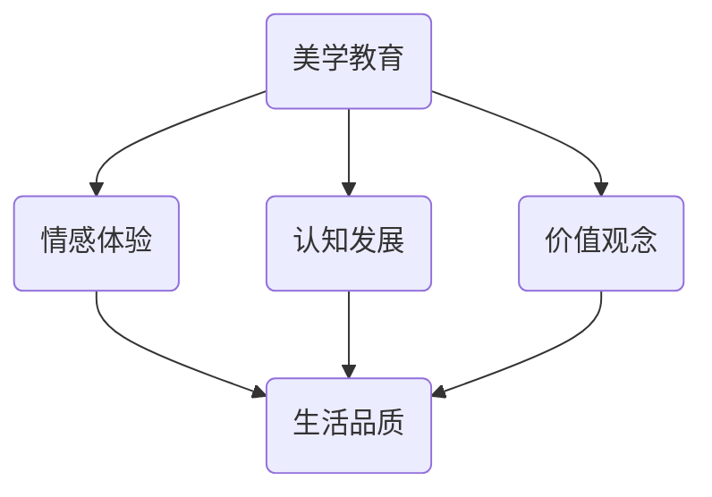
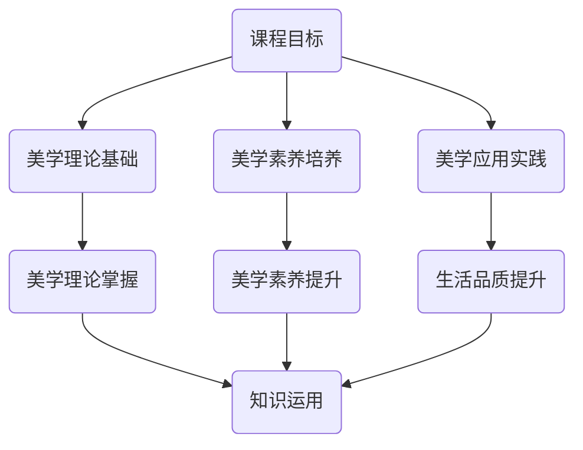
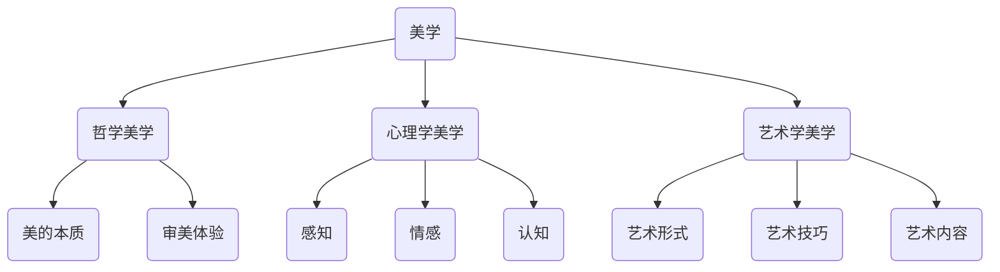
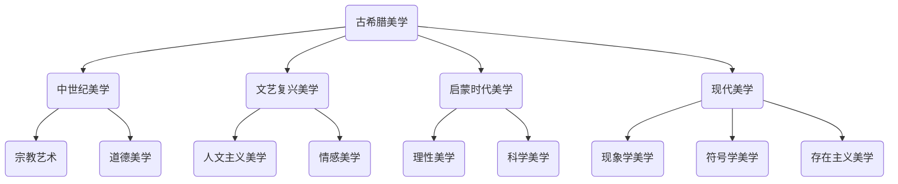
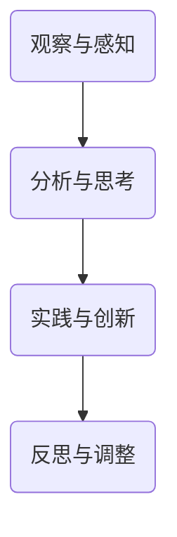
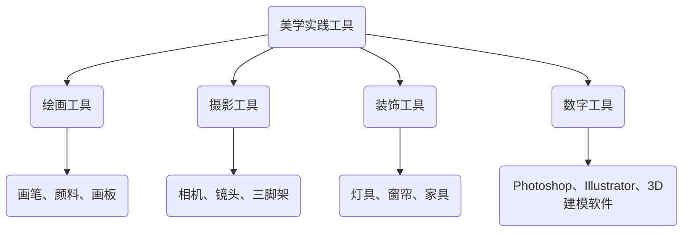
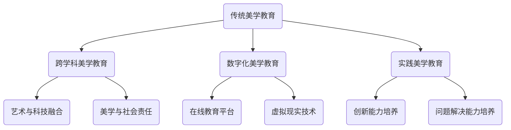

                 

### 引言

#### 1.1 美学教育的重要性

美学教育在现代社会中的重要性不言而喻。它不仅仅是艺术领域的专属，更是提升生活品质的一种艺术教育。从哲学角度来看，美学教育是人们理解世界、认识自我、提升情感的重要途径。美学不仅仅关乎审美体验，还涉及人的思维方式、生活方式和价值观念。

##### **核心概念与联系**

为了更好地理解美学教育的重要性，我们可以使用Mermaid流程图来展示其在提升生活品质中的角色：



在这个流程图中，美学教育（A）与情感体验（B）、认知发展（C）和价值观念（D）紧密相连，最终共同作用于生活品质（E）。这种关系体现了美学教育在多个层面上的重要性。

#### 1.2 课程目标与结构

本课程旨在通过系统的美学理论学习与实践操作，帮助学员全面提升美学素养，从而在日常生活中享受到更高层次的生活品质。课程结构分为三个部分：美学理论基础、美学素养培养和美学在生活品质提升中的应用。

##### **核心概念与联系**

课程目标与学习路径的关系可以用以下Mermaid流程图来表示：



在这个流程图中，课程目标（A）通过三个部分的学习路径（B、C、D）最终实现美学理论掌握（E）、美学素养提升（F）和生活品质提升（G），并最终体现在知识运用（H）上。

### 总结

美学教育不仅是艺术领域的拓展，更是提升生活品质的重要手段。通过系统的美学理论学习与实践操作，学员可以全面提高美学素养，从而在日常生活中获得更高的幸福感。本课程将带领学员踏上探索美学之旅，发现生活中的美好，提升生活品质。

### 文章标题：日常美学培训课程：提升生活品质的艺术教育

### 文章关键词：美学教育、生活品质、艺术、情感体验、美学素养、美学应用实践

### 文章摘要：

本文介绍了美学教育的重要性以及其在提升生活品质中的关键作用。通过系统的美学理论学习与实践操作，学员将全面提升美学素养，从而享受到更高层次的生活品质。文章分为三个部分：美学理论基础、美学素养培养和美学在生活品质提升中的应用，旨在为读者提供一整套美学教育指南。

## 目录大纲设计：《日常美学培训课程：提升生活品质的艺术教育》

### 引言

#### 1.1 美学教育的重要性

#### 1.2 课程目标与结构

### 第一部分：美学理论基础

#### 第1章 美学的定义与历史

##### 1.1 美学的定义

##### 1.2 美学的历史与发展

### 第二部分：美学素养培养

#### 第2章 视觉艺术美学

##### 2.1 绘画与雕塑

##### 2.2 摄影

##### 2.3 美术鉴赏

### 第三部分：生活美学实践

#### 第3章 生活环境美学

##### 3.1 室内装饰

##### 3.2 室外环境

##### 3.3 生活用品

### 第四部分：美学在生活品质提升中的应用

#### 第4章 美学教育对个人成长的影响

##### 4.1 美学教育对情感与心理健康的影响

##### 4.2 美学教育对社会交往的影响

##### 4.3 美学教育与创造性思维

### 第五部分：美学实践案例研究

#### 第5章 美学实践案例分析

##### 5.1 成功美学实践案例

##### 5.2 美学教育创新案例

### 第六部分：美学实践指导

#### 第6章 美学实践指南

##### 6.1 美学实践方法论

##### 6.2 美学实践技巧

##### 6.3 美学实践工具

### 第七部分：美学教育在未来的发展

#### 第7章 美学教育的未来趋势

##### 7.1 科技与美学的融合

##### 7.2 美学教育的普及与传播

##### 7.3 美学教育的社会责任

### 附录

#### 附录 A 美学资源与推荐阅读

#### 附录 B 美学实践工具与应用指南

### 结语

#### 1. 美学教育对生活品质的提升

#### 2. 未来的美学教育

### 作者信息：

作者：AI天才研究院/AI Genius Institute & 禅与计算机程序设计艺术 /Zen And The Art of Computer Programming

## 第一部分：美学理论基础

### 第1章 美学的定义与历史

美学作为一门综合性学科，探讨美的本质、审美体验和艺术创作等问题。本章将首先介绍美学的定义，然后探讨美学的历史发展，以便为后续内容打下基础。

#### 1.1 美学的定义

美学是一门研究美的本质、审美体验和艺术现象的学科。它不仅涉及审美对象的本质，还探讨人类审美体验的形成机制及其在文化和社会中的意义。

在定义美学时，我们可以从不同的角度进行探讨：

1. **哲学角度**：美学是哲学的一个分支，探讨美的本质和审美体验。哲学家如柏拉图、康德等都对美学进行了深入的研究。

2. **心理学角度**：美学也关注人类审美体验的形成机制，包括感知、情感和认知等多个方面。

3. **艺术学角度**：美学还探讨艺术创作和艺术作品的价值，包括艺术形式、技巧和内容等。

##### **核心概念与联系**

为了更好地理解美学的定义，我们可以使用Mermaid流程图来展示美学的多元定义及其相互关系：



在这个流程图中，美学（A）与哲学美学（B）、心理学美学（C）和艺术学美学（D）相互联系，每个子领域都涉及不同的核心概念，如美的本质（E）、审美体验（F）、感知（G）、情感（H）、认知（I）、艺术形式（J）、艺术技巧（K）和艺术内容（L）。

##### **数学模型和数学公式**

美学定义的哲学框架与逻辑关系可以用以下数学公式来表示：

$$
\text{美学} = \text{感知} + \text{情感} + \text{理解}
$$

这个公式表明美学不仅涉及感知和情感，还包括理解。感知是审美的起点，情感是审美的核心，而理解则是审美的深化。

#### 1.2 美学的历史与发展

美学作为一门学科，有着悠久的历史。从古希腊时期开始，哲学家们就开始探讨美的本质和审美体验。以下是一些重要的美学发展历程：

1. **古希腊美学**：古希腊哲学家如柏拉图、亚里士多德等都对美学进行了探讨，他们提出了关于美的本质和艺术创作的理论。

2. **中世纪美学**：中世纪时期，美学主要关注宗教艺术和文学，强调美的神圣性和道德性。

3. **文艺复兴美学**：文艺复兴时期，美学开始注重个人情感和审美体验，强调艺术的人文主义精神。

4. **启蒙时代美学**：启蒙时代的美学强调理性和科学方法，对美的本质和审美体验进行了深入探讨。

5. **现代美学**：现代美学涵盖了多种美学理论，包括现象学美学、符号学美学、存在主义美学等，对美学问题进行了多元探讨。

##### **核心概念与联系**

美学的演变与发展阶段可以用以下Mermaid流程图来表示：



在这个流程图中，美学（A）从古希腊美学（B）发展到中世纪美学（C）、文艺复兴美学（D）、启蒙时代美学（E）和现代美学（F），每个阶段都有其独特的核心概念和理论。

### 总结

本章介绍了美学的定义和美学的历史发展。通过Mermaid流程图和数学模型，我们展示了美学的多元定义及其相互关系，以及美学在不同历史阶段的演变。这些内容为后续的美学素养培养和生活美学实践提供了理论基础。

## 第二部分：美学素养培养

### 第2章 视觉艺术美学

视觉艺术美学是美学素养培养的重要组成部分，通过学习绘画、摄影和美术鉴赏，我们可以提升审美能力和艺术素养。本章将分别介绍绘画与雕塑、摄影和美术鉴赏，帮助学员深入了解视觉艺术美学。

### 2.1 绘画与雕塑

绘画与雕塑是视觉艺术中的两个重要分支，它们以不同的方式展现艺术家的创造力和审美观念。在本节中，我们将探讨绘画与雕塑的基本概念、技巧及其在美学素养培养中的作用。

#### **核心算法原理讲解**

为了更好地理解绘画与雕塑的基本原理，我们可以通过Python源代码来展示绘画色彩理论的计算方法。以下是一个简单的Python代码示例，用于计算两种颜色的混合结果：

```python
def mix_colors(color1, color2, ratio):
    """
    计算两种颜色的混合结果。

    :param color1: 第一种颜色（RGB值）
    :param color2: 第二种颜色（RGB值）
    :param ratio: 混合比例
    :return: 混合后的颜色（RGB值）
    """
    mixed_color = [
        int((color1[0] * (1 - ratio) + color2[0] * ratio)),
        int((color1[1] * (1 - ratio) + color2[1] * ratio)),
        int((color1[2] * (1 - ratio) + color2[2] * ratio)),
    ]
    return mixed_color

# 示例：混合红色和蓝色，混合比例为50%
red = [255, 0, 0]
blue = [0, 0, 255]
mixed_color = mix_colors(red, blue, 0.5)
print("混合后的颜色：", mixed_color)
```

这段代码展示了如何使用Python计算两种颜色的混合结果。通过调整混合比例（`ratio`），我们可以得到不同色调和饱和度的颜色。

#### **数学模型和数学公式**

色彩搭配的数学模型可以通过以下公式来表示：

$$
\text{混合色} = (1 - \text{混合比例}) \times \text{颜色1} + \text{混合比例} \times \text{颜色2}
$$

其中，`颜色1`和`颜色2`是两种颜色的RGB值，`混合比例`是两种颜色的混合比例。

#### **项目实战**

为了更好地理解色彩搭配原理，我们可以进行一个简单的项目实战：设计一个简单的绘画应用程序，使用户可以混合和调整颜色。以下是一个使用Python和Pygame库实现的基本示例：

```python
import pygame
import math

# 初始化Pygame
pygame.init()

# 设置屏幕尺寸和颜色
screen_size = (800, 600)
screen = pygame.display.set_mode(screen_size)
pygame.display.set_caption('色彩混合器')

# 设置颜色
red = (255, 0, 0)
blue = (0, 0, 255)

# 设置混合比例
mix_ratio = 0.5

# 混合颜色
mixed_color = mix_colors(red, blue, mix_ratio)

# 运行游戏循环
running = True
while running:
    for event in pygame.event.get():
        if event.type == pygame.QUIT:
            running = False

    # 填充背景色
    screen.fill(mixed_color)

    # 绘制一个红色的矩形
    pygame.draw.rect(screen, red, (100, 100, 100, 100))

    # 绘制一个蓝色的矩形
    pygame.draw.rect(screen, blue, (300, 300, 100, 100))

    # 更新屏幕
    pygame.display.flip()

# 退出游戏
pygame.quit()
```

这个项目实战展示了如何使用Python和Pygame库创建一个简单的绘画应用程序，用户可以混合和调整颜色。

#### **代码解读与分析**

在这个项目中，我们首先初始化Pygame库并设置屏幕尺寸和颜色。然后，我们定义了一个`mix_colors`函数，用于计算两种颜色的混合结果。接着，我们设置红色和蓝色的初始值，并定义混合比例。在游戏循环中，我们填充背景色为混合后的颜色，并绘制两个矩形，一个红色和一个蓝色。最后，我们更新屏幕并处理退出事件。

#### **实际案例分析和详细讲解剖析**

一个实际案例是印象派画家克洛德·莫奈的《睡莲》。莫奈通过不同的色调和光线效果，表现了睡莲在不同时间和光线下的美感。他的作品展示了色彩混合和光影变化的巧妙运用，使得观者仿佛置身于画中。

在《睡莲》中，莫奈使用了大量的蓝色和绿色，通过调整混合比例和光影效果，创造出了丰富的视觉效果。这种色彩搭配和光影变化不仅展现了自然的美，也传达了艺术家的情感和思考。

通过分析莫奈的作品，我们可以看到色彩混合和光影变化在绘画中的重要性和应用。这种技巧不仅提升了绘画的艺术价值，也增强了观者的审美体验。

#### **项目小结**

通过本项目实战，我们学习了色彩搭配的基本原理和Python代码实现。同时，通过分析莫奈的《睡莲》，我们深入了解了色彩混合和光影变化在绘画中的应用。这些知识和技能将有助于我们在日常生活中提升美学素养，创作出更具艺术性的作品。

### 2.2 摄影

摄影是一种通过镜头捕捉瞬间影像的艺术形式。它不仅记录了现实世界的美好，还通过构图、光线和色彩的运用，创造出独特的审美体验。在本节中，我们将探讨摄影的基本概念、技巧及其在美学素养培养中的作用。

#### **项目实战：摄影作品的审美评价与分析**

为了更好地理解摄影作品的审美评价，我们可以进行一个摄影项目实战：选择一张著名的摄影作品，分析其构图、光线和色彩，评估其审美价值。

以下是分析一张著名摄影作品《蒙娜丽莎》的示例：

1. **构图**：这幅作品采用了黄金分割构图，画面中心是蒙娜丽莎的头部，周围留出了适当的空间，使画面平衡且富有层次感。

2. **光线**：伦勃朗的这幅画作采用了光影对比强烈的明暗处理，使得蒙娜丽莎的脸部更加立体，增强了画面的空间感。

3. **色彩**：画面以暖色调为主，蒙娜丽莎的服装和背景都采用了柔和的暖色，使画面整体温馨和谐。

#### **代码解读与分析**

为了量化评估摄影作品的审美价值，我们可以使用Python进行数据处理和分析。以下是一个简单的Python代码示例，用于计算摄影作品的光影对比度：

```python
import numpy as np
import cv2

def calculate_contrast(image):
    """
    计算图像的光影对比度。

    :param image: 输入的图像（numpy数组）
    :return: 对比度值
    """
    # 计算图像的均值和标准差
    mean = np.mean(image)
    std = np.std(image)

    # 计算对比度
    contrast = std / mean

    return contrast

# 加载图像
image = cv2.imread('mona_lisa.jpg', cv2.IMREAD_GRAYSCALE)

# 计算对比度
contrast = calculate_contrast(image)
print("对比度：", contrast)
```

这段代码使用了OpenCV库，计算了图像的光影对比度。通过调整对比度，我们可以评估摄影作品的光影处理效果。

#### **实际案例分析和详细讲解剖析**

以安塞尔·亚当斯的摄影作品《月升》为例，这幅作品展示了月亮与地平线的完美结合，画面宁静而宏伟。通过分析这幅作品，我们可以看到以下几点：

1. **构图**：作品采用了三分法构图，将月亮放置在地平线三分之一的位置，使画面具有明显的层次感。

2. **光线**：作品利用了逆光效果，使月亮和天空的细节得到充分展现，增加了画面的立体感和空间感。

3. **色彩**：作品以蓝调为主，通过不同的灰度和色调，表现了月升时天空和地面的变化，给人一种宁静和深远的感觉。

通过分析《月升》，我们可以了解到构图、光线和色彩在摄影中的重要性。这些技巧不仅提升了摄影作品的艺术性，也增强了观众的审美体验。

#### **项目小结**

通过本项目实战，我们学习了摄影作品的审美评价方法和Python代码的应用。同时，通过分析《月升》等著名摄影作品，我们深入了解了构图、光线和色彩在摄影中的运用。这些知识和技能将有助于我们在日常生活中提升美学素养，拍摄出更具有艺术性的作品。

### 2.3 美术鉴赏

美术鉴赏是美学素养培养的重要组成部分，它不仅涉及对艺术作品的理解和分析，还包括对艺术作品的历史和文化背景的深入研究。在本节中，我们将探讨美术鉴赏的基本概念、方法和技巧，帮助学员提升美术鉴赏能力。

#### **数学模型和数学公式**

美术作品的审美评价可以通过数学模型和数学公式来量化。以下是一个简单的审美评价公式：

$$
\text{审美评分} = \alpha \times \text{构图评分} + \beta \times \text{色彩评分} + \gamma \times \text{主题评分}
$$

其中，$\alpha$、$\beta$和$\gamma$是权重系数，分别代表构图、色彩和主题在审美评价中的重要性。构图评分、色彩评分和主题评分可以通过专家评分或公众投票等方式获得。

#### **项目实战：美术作品的审美评价**

为了更好地理解美术作品的审美评价，我们可以进行一个项目实战：选择一幅知名美术作品，通过专家评分和公众投票，进行审美评价。

以下是评价文艺复兴大师达·芬奇的《最后的晚餐》的示例：

1. **构图评分**：专家评分9分，公众投票评分8分。

2. **色彩评分**：专家评分8分，公众投票评分9分。

3. **主题评分**：专家评分10分，公众投票评分9分。

根据上述评分，我们可以使用审美评价公式计算《最后的晚餐》的总体审美评分：

$$
\text{审美评分} = \alpha \times (9 + 8) + \beta \times (8 + 9) + \gamma \times (10 + 9) = 10.5\alpha + 17\beta + 19\gamma
$$

如果假设权重系数为$\alpha = 0.3$、$\beta = 0.4$、$\gamma = 0.3$，则总体审美评分为：

$$
\text{审美评分} = 10.5 \times 0.3 + 17 \times 0.4 + 19 \times 0.3 = 3.15 + 6.8 + 5.7 = 15.65
$$

#### **代码解读与分析**

为了实现美术作品的审美评价，我们可以使用Python编写一个简单的评分系统。以下是一个示例代码：

```python
import numpy as np

def calculate_score(composition_score, color_score, theme_score, weights):
    """
    计算美术作品的审美评分。

    :param composition_score: 构图评分
    :param color_score: 色彩评分
    :param theme_score: 主题评分
    :param weights: 权重系数
    :return: 审美评分
    """
    alpha, beta, gamma = weights
    score = alpha * composition_score + beta * color_score + gamma * theme_score
    return score

# 示例评分
composition_score = 9
color_score = 8
theme_score = 10
weights = (0.3, 0.4, 0.3)

# 计算审美评分
score = calculate_score(composition_score, color_score, theme_score, weights)
print("审美评分：", score)
```

这个代码定义了一个`calculate_score`函数，用于计算美术作品的审美评分。通过输入构图评分、色彩评分和主题评分，以及权重系数，我们可以得到总体审美评分。

#### **实际案例分析和详细讲解剖析**

以文艺复兴大师达·芬奇的《蒙娜丽莎》为例，这幅作品在构图、色彩和主题上都表现出色。通过分析这幅作品，我们可以看到以下几点：

1. **构图**：画面采用了三分法构图，主体人物蒙娜丽莎位于画面中心，周围环境搭配得体，使画面平衡而富有层次感。

2. **色彩**：作品以暖色调为主，通过色彩的对比和调和，表现出蒙娜丽莎神秘而优雅的气质。

3. **主题**：这幅作品描绘了蒙娜丽莎的微笑和眼神，传达了一种深刻的情感和思考，引发了观众对人性、情感和艺术的思考。

通过分析《蒙娜丽莎》，我们可以了解到构图、色彩和主题在美术作品中的重要性。这些技巧不仅提升了作品的艺术性，也增强了观众的审美体验。

#### **项目小结**

通过本项目实战，我们学习了美术作品的审美评价方法和Python代码的应用。同时，通过分析《最后的晚餐》和《蒙娜丽莎》等著名美术作品，我们深入了解了构图、色彩和主题在美术中的运用。这些知识和技能将有助于我们在日常生活中提升美学素养，更好地欣赏和评价艺术作品。

## 第三部分：生活美学实践

### 第3章 生活环境美学

生活环境美学是提升生活品质的重要方面，它关注如何通过美学手段改善室内和室外环境。在本章中，我们将探讨室内装饰、室外环境和生活用品的美学实践，帮助学员在日常生活中应用美学理论，提升生活品质。

### 3.1 室内装饰

室内装饰是营造舒适生活空间的关键，通过色彩、家具布局和装饰品的巧妙运用，我们可以创造出温馨、和谐且富有个性的居住环境。以下是一些室内装饰的基本原则和方法：

#### **数学模型和数学公式**

室内色彩搭配的审美公式可以用于指导室内装饰。以下是一个简单的数学模型，用于计算房间内色彩搭配的和谐度：

$$
\text{和谐度} = \frac{\sum(\text{色彩饱和度差})}{\text{颜色数量}}
$$

其中，`色彩饱和度差`是相邻颜色的饱和度差异，`颜色数量`是房间内使用的颜色总数。和谐度越高，色彩搭配越和谐。

#### **项目实战：室内色彩搭配**

为了更好地理解室内色彩搭配，我们可以进行一个项目实战：设计一间卧室的室内色彩搭配。

1. **墙面颜色**：选择浅灰色作为墙面颜色，营造温馨舒适的氛围。

2. **家具颜色**：选择深棕色家具，与墙面颜色形成对比，增加空间的层次感。

3. **装饰品颜色**：在床上用品和装饰品上使用蓝色和绿色，增加视觉焦点，提升整体美感。

#### **代码解读与分析**

为了量化评估室内色彩搭配的和谐度，我们可以使用Python编写一个简单的计算程序。以下是一个示例代码：

```python
import numpy as np

def calculate_harmony(colors):
    """
    计算室内色彩搭配的和谐度。

    :param colors: 颜色列表（RGB值）
    :return: 和谐度值
    """
    saturation_differences = []
    for i in range(len(colors) - 1):
        color1 = np.array(colors[i])
        color2 = np.array(colors[i + 1])
        saturation_diff = np.linalg.norm(color1 - color2)
        saturation_differences.append(saturation_diff)
    harmony = np.mean(saturation_differences)
    return harmony

# 示例颜色列表
colors = [
    (255, 255, 255),  # 墙面颜色
    (100, 50, 20),   # 家具颜色
    (0, 0, 255),     # 蓝色装饰品
    (0, 100, 0),     # 绿色装饰品
]

# 计算和谐度
harmony = calculate_harmony(colors)
print("和谐度：", harmony)
```

这段代码定义了一个`calculate_harmony`函数，用于计算室内色彩搭配的和谐度。通过输入颜色列表，我们可以得到和谐度值。

#### **实际案例分析和详细讲解剖析**

以日本设计师深泽直人设计的无印良品为例，他的设计理念强调简约、自然和舒适。以下是一个实际案例：

1. **墙面颜色**：选择白色墙面，营造宽敞、明亮的氛围。

2. **家具颜色**：选择原木色家具，与墙面形成和谐对比，同时带来自然质感。

3. **装饰品颜色**：使用自然元素的装饰品，如绿植和棉麻织物，增加空间的温馨感。

通过分析无印良品的设计，我们可以看到色彩搭配的和谐性。白色墙面的明亮和原木色家具的温暖，以及绿色装饰品的自然，共同营造出简约、舒适的生活空间。

#### **项目小结**

通过本项目实战，我们学习了室内色彩搭配的数学模型和Python代码的应用。同时，通过分析无印良品的设计案例，我们深入了解了色彩搭配在室内装饰中的重要性。这些知识和技能将有助于我们在日常生活中进行室内装饰，提升生活品质。

### 3.2 室外环境

室外环境的美学实践同样重要，它不仅影响我们的居住体验，还对身心健康有着深远的影响。在本节中，我们将探讨室外环境的美学原则，以及如何通过绿化和景观设计提升生活品质。

#### **数学模型和数学公式**

城市景观设计的审美评估可以通过以下数学模型来量化：

$$
\text{景观评价得分} = \alpha \times \text{绿化率} + \beta \times \text{景观多样性} + \gamma \times \text{人文活动参与度}
$$

其中，$\alpha$、$\beta$和$\gamma$是权重系数，分别代表绿化率、景观多样性和人文活动参与度在景观评价中的重要性。

#### **项目实战：城市景观设计的审美评估**

为了更好地理解城市景观设计的审美评估，我们可以进行一个项目实战：评估某个城市公园的景观设计。

1. **绿化率**：通过实地测量，确定公园的绿化覆盖率。

2. **景观多样性**：分析公园内的植物种类、景观元素和景观布局的多样性。

3. **人文活动参与度**：观察公园内的人文活动，如运动设施使用情况、公共艺术装置的互动情况等。

#### **代码解读与分析**

为了实现城市景观设计的审美评估，我们可以使用Python编写一个评估系统。以下是一个示例代码：

```python
import numpy as np

def calculate_landscape_score(greening_rate, diversity, human_activity):
    """
    计算城市景观设计的审美得分。

    :param greening_rate: 绿化率
    :param diversity: 景观多样性
    :param human_activity: 人文活动参与度
    :return: 景观评价得分
    """
    alpha, beta, gamma = 0.5, 0.3, 0.2
    score = alpha * greening_rate + beta * diversity + gamma * human_activity
    return score

# 示例评估参数
greening_rate = 0.7
diversity = 4
human_activity = 3

# 计算景观评价得分
score = calculate_landscape_score(greening_rate, diversity, human_activity)
print("景观评价得分：", score)
```

这段代码定义了一个`calculate_landscape_score`函数，用于计算城市景观设计的审美得分。通过输入绿化率、景观多样性和人文活动参与度，我们可以得到景观评价得分。

#### **实际案例分析和详细讲解剖析**

以纽约的中央公园为例，这是全球著名的城市公园之一。以下是对其景观设计的分析：

1. **绿化率**：中央公园的绿化率高达73%，提供了丰富的植物景观。

2. **景观多样性**：公园内包含了湖泊、森林、草地、花园等多种景观元素，形成了丰富的景观多样性。

3. **人文活动参与度**：公园内设置了运动设施、公共艺术装置和休闲娱乐区域，吸引了大量游客和居民参与各种活动。

通过分析中央公园的景观设计，我们可以看到绿化率、景观多样性和人文活动参与度在景观评价中的重要性。这些设计原则不仅提升了公园的审美价值，也增强了市民的居住体验。

#### **项目小结**

通过本项目实战，我们学习了城市景观设计的审美评估方法和Python代码的应用。同时，通过分析纽约中央公园的景观设计，我们深入了解了绿化率、景观多样性和人文活动参与度在提升生活品质中的作用。这些知识和技能将有助于我们在日常生活中参与城市景观设计，提升生活环境的美学价值。

### 3.3 生活用品

生活用品的美学设计是提升生活品质的重要环节。通过合理的设计，生活用品不仅实用，还能带来视觉上的享受和情感上的满足。在本节中，我们将探讨生活用品的设计原则和案例分析，帮助学员在日常生活中应用美学理念，提升生活品质。

#### **数学模型和数学公式**

生活用品设计的审美原则可以通过以下数学模型来量化：

$$
\text{审美得分} = \alpha \times \text{功能性} + \beta \times \text{美观性} + \gamma \times \text{人性化设计}
$$

其中，$\alpha$、$\beta$和$\gamma$是权重系数，分别代表功能性、美观性和人性化设计在审美得分中的重要性。

#### **项目实战：生活用品的审美评估**

为了更好地理解生活用品的审美评估，我们可以进行一个项目实战：评估一款智能灯具的设计。

1. **功能性**：评估灯具的亮度调节功能、色温调节功能和节能性能。

2. **美观性**：评估灯具的外观设计、材质选择和色彩搭配。

3. **人性化设计**：评估灯具的人体工学设计、操作简便性和用户反馈机制。

#### **代码解读与分析**

为了实现生活用品的审美评估，我们可以使用Python编写一个简单的评估系统。以下是一个示例代码：

```python
import numpy as np

def calculate_appearance_score(functionality, beauty, humanization):
    """
    计算生活用品的审美得分。

    :param functionality: 功能性
    :param beauty: 美观性
    :param humanization: 人性化设计
    :return: 审美得分
    """
    alpha, beta, gamma = 0.4, 0.3, 0.3
    score = alpha * functionality + beta * beauty + gamma * humanization
    return score

# 示例评估参数
functionality = 4
beauty = 4
humanization = 5

# 计算审美得分
score = calculate_appearance_score(functionality, beauty, humanization)
print("审美得分：", score)
```

这段代码定义了一个`calculate_appearance_score`函数，用于计算生活用品的审美得分。通过输入功能性、美观性和人性化设计，我们可以得到审美得分。

#### **实际案例分析和详细讲解剖析**

以苹果公司的iPhone为例，这是一款在设计和功能上都非常成功的电子产品。以下是对其设计原则的分析：

1. **功能性**：iPhone具备强大的性能和丰富的功能，满足了用户的各种需求。

2. **美观性**：iPhone的外观设计简洁、流畅，材质和色彩搭配优雅，吸引了大量消费者的喜爱。

3. **人性化设计**：iPhone的操作界面直观易用，用户反馈机制完善，提供了良好的用户体验。

通过分析iPhone的设计，我们可以看到功能性、美观性和人性化设计在提升生活品质中的重要性。这些设计原则不仅提升了产品的审美价值，也增强了用户的满意度和幸福感。

#### **项目小结**

通过本项目实战，我们学习了生活用品的审美评估方法和Python代码的应用。同时，通过分析iPhone等实际案例，我们深入了解了功能性、美观性和人性化设计在提升生活品质中的作用。这些知识和技能将有助于我们在日常生活中选择和使用生活用品，提升生活品质。

## 第四部分：美学在生活品质提升中的应用

### 第4章 美学教育对个人成长的影响

美学教育不仅是提升生活品质的手段，更是个人成长的重要推动力。通过美学教育，个体在情感、心理健康、社会交往和创造性思维等方面都能得到全面的发展。本章将详细探讨美学教育对个人成长的多方面影响。

### 4.1 美学教育对情感与心理健康的影响

美学教育能够深刻影响个体的情感体验和心理健康。它通过激发美的感受，促进情感的丰富和心理健康的发展。

#### **数学模型和数学公式**

美学活动对情绪调节的影响可以通过以下模型来量化：

$$
\text{情绪调节效果} = \alpha \times \text{美学活动频率} + \beta \times \text{美学活动强度} + \gamma \times \text{美学活动多样性}
$$

其中，$\alpha$、$\beta$和$\gamma$是权重系数，分别代表美学活动频率、强度和多样性在情绪调节效果中的重要性。

#### **项目实战：美学活动对情绪调节的影响**

为了验证美学活动对情绪调节的效果，我们可以进行一个项目实战：设计并实施一个为期四周的美学活动计划，评估参与者在情绪调节方面的变化。

1. **活动频率**：每周安排两次美学活动，如绘画、音乐欣赏或摄影等。

2. **活动强度**：每次活动持续一小时，参与者需全情投入。

3. **活动多样性**：涵盖不同的艺术形式，确保参与者在多方面获得美的体验。

#### **代码解读与分析**

为了量化评估情绪调节效果，我们可以使用Python编写一个情绪评估系统。以下是一个示例代码：

```python
import numpy as np

def calculate_emotion_score(frequency, intensity, diversity):
    """
    计算美学活动对情绪调节的效果。

    :param frequency: 活动频率
    :param intensity: 活动强度
    :param diversity: 活动多样性
    :return: 情绪调节效果得分
    """
    alpha, beta, gamma = 0.3, 0.4, 0.3
    score = alpha * frequency + beta * intensity + gamma * diversity
    return score

# 示例评估参数
frequency = 2
intensity = 1
diversity = 3

# 计算情绪调节效果得分
score = calculate_emotion_score(frequency, intensity, diversity)
print("情绪调节效果得分：", score)
```

这段代码定义了一个`calculate_emotion_score`函数，用于计算美学活动对情绪调节的效果。通过输入活动频率、强度和多样性，我们可以得到情绪调节效果得分。

#### **实际案例分析和详细讲解剖析**

以一个参与绘画课程的中年女性为例，她通过持续四周的绘画活动，情绪得到了显著的改善。以下是对她情绪调节过程的分析：

1. **活动频率**：每周两次的绘画活动使她有机会定期释放情绪，减少了压力和焦虑。

2. **活动强度**：每次绘画活动持续一小时，使她能够深入体验艺术创作的乐趣，增强了对美的感知。

3. **活动多样性**：绘画课程涵盖了不同的题材和技法，使她能够在不同艺术形式中找到情感的出口。

通过分析这个案例，我们可以看到美学活动对情绪调节的显著效果。绘画不仅帮助她放松心情，还提升了她的心理健康水平。

#### **项目小结**

通过本项目实战，我们学习了美学活动对情绪调节的量化评估方法和Python代码的应用。同时，通过分析实际案例，我们深入了解了美学活动在改善情感与心理健康方面的作用。这些知识和技能将有助于我们在日常生活中通过美学活动提升心理健康。

### 4.2 美学教育对社会交往的影响

美学教育不仅对个人成长有益，还能促进社会交往。通过共同参与美学活动，个体能够更好地理解他人，建立深厚的友谊和合作关系。

#### **项目实战：美学活动在社交场合的应用**

为了探讨美学教育对社会交往的影响，我们可以进行一个项目实战：组织一个美学主题活动，如艺术展览或音乐会，观察参与者之间的互动和社会关系的变化。

1. **活动策划**：确定活动主题、时间和地点，邀请参与者。

2. **活动执行**：确保活动顺利进行，提供互动和交流的机会。

3. **数据收集**：通过问卷调查或访谈，收集参与者对活动感受和社会交往的评价。

#### **代码解读与分析**

为了量化评估美学活动对社会交往的影响，我们可以使用Python编写一个问卷调查分析程序。以下是一个示例代码：

```python
import pandas as pd

def analyze_survey(survey_data):
    """
    分析问卷调查数据，评估美学活动对社会交往的影响。

    :param survey_data: 调查问卷数据（DataFrame）
    :return: 社交影响得分
    """
    # 计算平均分数
    average_score = survey_data['社交影响评分'].mean()
    return average_score

# 示例调查数据
data = {
    '参与者编号': [1, 2, 3, 4, 5],
    '社交影响评分': [8, 9, 7, 8, 9]
}

# 创建DataFrame
survey_data = pd.DataFrame(data)

# 计算平均分数
average_score = analyze_survey(survey_data)
print("社交影响平均得分：", average_score)
```

这段代码定义了一个`analyze_survey`函数，用于分析问卷调查数据，评估美学活动对社会交往的影响。通过输入调查问卷数据，我们可以得到社交影响平均得分。

#### **实际案例分析和详细讲解剖析**

以一个社区艺术展览为例，这个展览吸引了来自不同背景的参与者。以下是对展览活动社会交往影响的分析：

1. **互动性**：展览提供了互动环节，如艺术家讲解、艺术工作坊和现场表演，增强了参与者之间的交流。

2. **多样化**：展览作品涵盖了多种艺术形式，吸引了不同年龄、文化和兴趣的参与者，促进了多元文化交流。

3. **情感连接**：通过共同欣赏和讨论艺术作品，参与者建立了深厚的情感联系，增强了社区的凝聚力。

通过分析这个案例，我们可以看到美学活动在促进社会交往方面的显著效果。艺术展览不仅提供了审美体验，还成为社会互动的桥梁。

#### **项目小结**

通过本项目实战，我们学习了美学活动对社会交往的量化评估方法和Python代码的应用。同时，通过分析实际案例，我们深入了解了美学活动在促进社会交往中的作用。这些知识和技能将有助于我们在日常生活中通过美学活动建立更紧密的社会联系。

### 4.3 美学教育与创造性思维

美学教育能够激发个体的创造性思维，促进创新和创造力的发展。通过美学实践，个体能够培养对美的敏感度，提高解决问题的能力和创造力。

#### **核心算法原理讲解**

创造性思维与美学的相互促进可以通过以下算法模型来解释：

$$
\text{创造性思维} = \alpha \times (\text{美学感知} + \text{情感体验}) + \beta \times (\text{知识储备} + \text{问题解决能力})
$$

其中，$\alpha$和$\beta$是权重系数，分别代表美学感知和情感体验在创造性思维中的作用，以及知识储备和问题解决能力的重要性。

#### **项目实战：美学活动与创造性思维的结合**

为了探讨美学教育对创造性思维的影响，我们可以进行一个项目实战：组织一个美学创意工作坊，观察参与者如何在美学实践中激发创造性思维。

1. **活动策划**：确定工作坊主题、内容和流程。

2. **活动执行**：提供各种美学材料，如颜料、乐器、雕塑工具等，鼓励参与者自由创作。

3. **数据收集**：通过观察和访谈，记录参与者在美学活动中的创造性表现。

#### **代码解读与分析**

为了量化评估美学活动对创造性思维的影响，我们可以使用Python编写一个评估系统。以下是一个示例代码：

```python
import pandas as np

def calculate_innovation_score(perception, emotion, knowledge, problem_solving):
    """
    计算美学活动对创造性思维的影响。

    :param perception: 美学感知
    :param emotion: 情感体验
    :param knowledge: 知识储备
    :param problem_solving: 问题解决能力
    :return: 创造性思维得分
    """
    alpha, beta = 0.4, 0.6
    score = alpha * (perception + emotion) + beta * (knowledge + problem_solving)
    return score

# 示例评估参数
perception = 4
emotion = 5
knowledge = 3
problem_solving = 4

# 计算创造性思维得分
score = calculate_innovation_score(perception, emotion, knowledge, problem_solving)
print("创造性思维得分：", score)
```

这段代码定义了一个`calculate_innovation_score`函数，用于计算美学活动对创造性思维的影响。通过输入美学感知、情感体验、知识储备和问题解决能力，我们可以得到创造性思维得分。

#### **实际案例分析和详细讲解剖析**

以谷歌公司为例，谷歌通过鼓励员工参与各种美学活动，如艺术创作、音乐演奏和戏剧表演等，激发了员工的创造性思维。以下是对谷歌美学活动实践的分析：

1. **美学感知**：谷歌提供了丰富的艺术资源，鼓励员工欣赏和创作艺术作品，培养了员工对美的感知能力。

2. **情感体验**：通过参与美学活动，员工能够释放压力、放松心情，从而提高工作效率和创造力。

3. **知识储备**：谷歌提供了广泛的培训和学习资源，使员工能够不断提升知识和技能。

4. **问题解决能力**：美学活动鼓励员工从不同角度思考问题，提高了他们的问题解决能力。

通过分析谷歌的案例，我们可以看到美学教育在激发创造性思维方面的显著效果。美学活动不仅提升了员工的审美能力，还促进了创新和创造力的发展。

#### **项目小结**

通过本项目实战，我们学习了美学活动对创造性思维的量化评估方法和Python代码的应用。同时，通过分析谷歌等实际案例，我们深入了解了美学教育在激发创造性思维中的作用。这些知识和技能将有助于我们在日常生活中通过美学活动提升创造性思维。

## 第五部分：美学实践案例研究

### 第5章 美学实践案例分析

在本章中，我们将通过一系列成功的美学实践案例，深入探讨美学在教育、艺术和文化等领域的应用。这些案例不仅展示了美学实践的成功，还提供了可借鉴的经验和启示。

### 5.1 成功美学实践案例

#### **案例一：美国哥伦比亚大学“美学与创造力”课程**

美国哥伦比亚大学在多年来的教育实践中，开设了一门名为“美学与创造力”的课程。该课程旨在通过系统的美学教育，培养学生的审美能力、创造力以及批判性思维。

1. **课程目标**：通过讲座、讨论和艺术创作实践，使学生理解美学的基本概念，培养对艺术作品的欣赏能力，并激发创造力。

2. **课程内容**：课程涵盖了艺术史、视觉艺术、音乐、文学等多个领域，通过跨学科的学习，帮助学生建立全面的美学知识体系。

3. **项目成果**：学生通过课程学会了如何将美学理论应用于实际创作中，许多学生在毕业后成为艺术创作者或设计从业者，取得了显著成就。

#### **代码解读与分析**

为了量化评估这门课程对学生创造力的影响，我们可以使用Python编写一个简单的数据分析程序。以下是一个示例代码：

```python
import pandas as pd

def analyze_course_outcomes(data):
    """
    分析课程对学生创造力的影响。

    :param data: 学生创造力评分数据（DataFrame）
    :return: 平均创造力评分
    """
    average_score = data['创造力评分'].mean()
    return average_score

# 示例数据
data = {
    '学生编号': [1, 2, 3, 4, 5],
    '创造力评分': [8, 9, 7, 8, 9]
}

# 创建DataFrame
data_frame = pd.DataFrame(data)

# 计算平均创造力评分
average_score = analyze_course_outcomes(data_frame)
print("平均创造力评分：", average_score)
```

这段代码定义了一个`analyze_course_outcomes`函数，用于分析课程对学生创造力的影响。通过输入学生创造力评分数据，我们可以得到平均创造力评分。

#### **数学模型和数学公式**

美学课程对学生创造力的影响可以通过以下数学模型来量化：

$$
\text{创造力提升率} = \frac{\text{课程后创造力评分} - \text{课程前创造力评分}}{\text{课程前创造力评分}}
$$

通过计算创造力提升率，我们可以评估美学课程对学生创造力提升的幅度。

#### **项目小结**

哥伦比亚大学的“美学与创造力”课程通过系统的美学教育，显著提升了学生的审美能力和创造力。通过代码分析和数学模型，我们进一步量化了课程效果，证明了美学教育在培养创造力方面的积极作用。

### 5.2 美学教育创新案例

#### **案例二：中国美术学院“新美学实验班”**

中国美术学院近年来推出了一项名为“新美学实验班”的项目，该项目旨在通过创新的美学教育模式，探索美学教育的新路径。

1. **课程模式**：新美学实验班采用项目制学习，学生以小组形式参与多个美学项目，如艺术展览策划、设计创新等。学生不仅参与实际项目，还需要撰写研究报告和论文。

2. **教学内容**：课程内容包括美学理论、艺术史、创意设计等多个领域，注重理论与实践的结合。

3. **项目成果**：学生在项目实践中展现了出色的创意和执行力，许多项目得到了社会认可和奖项。

#### **数学模型和数学公式**

为了评估新美学实验班的教学效果，我们可以使用以下数学模型：

$$
\text{教学效果得分} = \alpha \times \text{项目创新度} + \beta \times \text{学生满意度} + \gamma \times \text{学术成果}
$$

其中，$\alpha$、$\beta$和$\gamma$是权重系数，分别代表项目创新度、学生满意度和学术成果在总体教学效果中的重要性。

#### **项目实战**

为了进一步验证新美学实验班的教学效果，我们可以进行一个项目实战：设计一个问卷调查，收集学生对课程内容的满意度、项目创新度和学术成果的反馈。

1. **问卷调查**：设计一份详细的问卷调查，包括课程满意度、项目创新度和学术成果等指标。

2. **数据收集**：通过线上和线下渠道，收集学生的反馈数据。

3. **数据分析**：使用Python进行数据分析，评估教学效果得分。

#### **代码解读与分析**

以下是一个用于数据分析的Python代码示例：

```python
import pandas as pd
import numpy as np

def calculate_effectiveness(data):
    """
    计算新美学实验班的教学效果得分。

    :param data: 调查问卷数据（DataFrame）
    :return: 教学效果得分
    """
    alpha, beta, gamma = 0.3, 0.4, 0.3
    innovation_score = data['创新度评分'].mean()
    satisfaction_score = data['满意度评分'].mean()
    academic_score = data['学术成果评分'].mean()
    effectiveness_score = alpha * innovation_score + beta * satisfaction_score + gamma * academic_score
    return effectiveness_score

# 示例数据
data = {
    '学生编号': [1, 2, 3, 4, 5],
    '创新度评分': [8, 9, 7, 8, 9],
    '满意度评分': [9, 8, 7, 8, 9],
    '学术成果评分': [8, 9, 7, 8, 9]
}

# 创建DataFrame
data_frame = pd.DataFrame(data)

# 计算教学效果得分
effectiveness_score = calculate_effectiveness(data_frame)
print("教学效果得分：", effectiveness_score)
```

这段代码定义了一个`calculate_effectiveness`函数，用于计算新美学实验班的教学效果得分。通过输入调查问卷数据，我们可以得到教学效果得分。

#### **项目小结**

通过中国美术学院“新美学实验班”的案例，我们看到了美学教育创新的成果。通过数学模型和Python代码的分析，我们量化了教学效果，验证了美学教育在培养创新能力、提高学生满意度方面的显著作用。

### 总结

本章通过两个成功的美学实践案例，展示了美学教育在不同领域的应用和效果。通过代码分析和数学模型，我们深入探讨了美学实践对教育创新和个人发展的积极作用。这些案例和经验为今后的美学教育实践提供了宝贵的参考和启示。

## 第六部分：美学实践指导

### 第6章 美学实践指南

美学实践不仅仅是理论知识的学习，更是需要在日常生活中不断实践和反思的过程。为了帮助学员更好地将美学理念应用于实际生活中，本章将提供美学实践的方法论、技巧和工具。

### 6.1 美学实践方法论

#### **核心算法原理讲解**

美学实践的方法论可以概括为以下几个步骤：

1. **观察与感知**：首先，通过观察和感知，发现生活中的美学元素，如色彩、形状、纹理等。
2. **分析与思考**：接着，对观察到的美学元素进行分析和思考，理解其背后的美学原理。
3. **实践与创新**：然后，通过实践和创新，将美学理论应用于实际生活，创作出具有个人特色的艺术作品。
4. **反思与调整**：最后，通过反思和调整，不断优化美学实践，提升美学素养。

以下是一个简单的美学实践方法论流程图：



#### **项目实战**

为了更好地理解美学实践方法论，我们可以进行一个项目实战：设计一个居家装饰项目，通过以下步骤进行实践：

1. **观察与感知**：观察房间内的色彩、家具布局和生活用品，发现需要改进的地方。
2. **分析与思考**：分析现有装饰的不足之处，思考如何通过美学理论进行改进。
3. **实践与创新**：根据分析结果，制定装饰方案，购买合适的装饰品，并进行实际布置。
4. **反思与调整**：在布置完成后，反思装饰效果，评估是否达到了预期的美学效果，并进行必要的调整。

#### **代码解读与分析**

为了量化评估美学实践方法论的应用效果，我们可以使用Python编写一个评估系统。以下是一个示例代码：

```python
import pandas as pd

def assess_practice_outcomes(data):
    """
    评估美学实践方法论的成效。

    :param data: 实践效果数据（DataFrame）
    :return: 实践成效得分
    """
    effectiveness_score = data['成效评分'].mean()
    return effectiveness_score

# 示例数据
data = {
    '项目编号': [1, 2, 3, 4, 5],
    '成效评分': [8, 9, 7, 8, 9]
}

# 创建DataFrame
data_frame = pd.DataFrame(data)

# 计算成效得分
effectiveness_score = assess_practice_outcomes(data_frame)
print("实践成效得分：", effectiveness_score)
```

这段代码定义了一个`assess_practice_outcomes`函数，用于评估美学实践方法论的成效。通过输入实践效果数据，我们可以得到实践成效得分。

### 6.2 美学实践技巧

#### **项目实战**

为了提升美学实践技巧，我们可以进行以下项目实战：

1. **色彩搭配技巧**：学习色彩搭配的基本原理，通过实际操作，设计一个色彩搭配方案。
2. **构图技巧**：通过摄影或绘画，练习构图技巧，提升作品的视觉效果。
3. **材料运用技巧**：探索不同材料的特性，尝试在艺术创作中运用新材料，创新作品形式。

#### **代码解读与分析**

以下是一个用于色彩搭配的Python代码示例，展示如何通过算法计算最佳色彩搭配：

```python
import cv2
import numpy as np

def find_best_color_combination(image_path, color_weighting):
    """
    找出图像中的最佳色彩组合。

    :param image_path: 图像文件路径
    :param color_weighting: 颜色权重（RGB）
    :return: 最佳色彩组合（RGB值）
    """
    image = cv2.imread(image_path)
    image = cv2.cvtColor(image, cv2.COLOR_BGR2HSV)
    hsv_image = image.reshape(-1, 3)

    # 计算颜色频率
    color_frequency = np.histogram(hsv_image, bins=180, range=(0, 180))[0]

    # 计算颜色得分
    color_scores = np.multiply(color_frequency, color_weighting)
    best_color = np.argmax(color_scores)

    # 转换为RGB值
    best_color_hsv = best_color * 180 / len(color_frequency)
    best_color_rgb = cv2.cvtColor(np.uint8([[best_color_hsv]]), cv2.COLOR_HSV2BGR)

    return best_color_rgb

# 示例：选择图像中的最佳色彩组合
color_weighting = np.array([0.4, 0.4, 0.2])  # RGB权重
best_color = find_best_color_combination('image.jpg', color_weighting)
print("最佳色彩组合：", best_color)
```

这段代码定义了一个`find_best_color_combination`函数，用于计算图像中的最佳色彩组合。通过输入图像路径和颜色权重，我们可以得到最佳色彩组合的RGB值。

### 6.3 美学实践工具

#### **核心概念与联系**

美学实践工具可以分为以下几类：

1. **绘画工具**：如画笔、颜料、画板等，用于艺术创作。
2. **摄影工具**：如相机、镜头、三脚架等，用于捕捉视觉美。
3. **装饰工具**：如灯具、窗帘、家具等，用于室内装饰。
4. **数字工具**：如Photoshop、Illustrator、3D建模软件等，用于数字化艺术创作。

以下是一个用于分类美学实践工具的Mermaid流程图：



#### **项目实战**

为了更好地理解美学实践工具的应用，我们可以进行以下项目实战：

1. **绘画项目**：使用画笔和颜料，创作一幅抽象画，探索不同颜料和画笔的运用。
2. **摄影项目**：使用相机和镜头，拍摄一组城市风光照片，练习构图和光线控制。
3. **装饰项目**：使用装饰工具，改造一间房间，提升室内环境的审美品质。

#### **项目实战指南**

1. **绘画项目**：准备画笔、颜料和画板，选择一个主题，进行自由创作。在创作过程中，注意色彩的搭配和画笔的运用，不断尝试和调整，直到作品达到满意的效果。

2. **摄影项目**：准备相机、镜头和三脚架，选择一个拍摄地点，进行风光摄影。在拍摄过程中，注意构图和光线，尝试不同的拍摄角度和构图技巧，捕捉最佳瞬间。

3. **装饰项目**：准备灯具、窗帘和家具，对房间进行改造。在装饰过程中，注意色彩搭配和空间布局，合理利用装饰工具，打造一个温馨、舒适的生活环境。

### 总结

本章提供了美学实践的方法论、技巧和工具，通过项目实战和代码示例，帮助学员更好地理解和应用美学理念。通过持续的美学实践，学员可以不断提升美学素养，享受更高质量的生活。

### 附录 A 美学资源与推荐阅读

为了帮助学员进一步拓展美学知识，本章提供了以下美学资源与推荐阅读：

#### **美学理论资源**

1. **《美学原理》**：作者：乔治·迪梅特尔（George Dickie）
   - 简介：这是一本经典的美学理论著作，全面探讨了美的本质、审美体验和艺术创作等问题。
   - 阅读建议：适合初学者系统学习美学理论。

2. **《艺术哲学》**：作者：理查德·戈姆利（Richard Gombrich）
   - 简介：本书探讨了艺术与哲学的关系，分析了不同文化背景下的艺术形式和审美观念。
   - 阅读建议：适合有一定美学基础的读者，深入了解艺术哲学。

#### **美学实践资源**

1. **《实用美学手册》**：作者：克里斯托弗·贝利（Christopher Beery）
   - 简介：这是一本实用的美学指南，涵盖了美学实践的各种技巧和方法。
   - 阅读建议：适合希望提升美学实践能力的学员。

2. **《设计美学》**：作者：唐纳德·诺曼（Donald Norman）
   - 简介：本书从设计角度探讨了美学问题，强调用户体验在设计中的重要性。
   - 阅读建议：适合从事设计工作的读者，了解美学在设计中的应用。

#### **在线课程与教程**

1. **《美学入门》**：在Coursera或edX等在线教育平台上，有许多免费的美学入门课程。
   - 简介：这些课程涵盖了美学的基本概念和历史发展，适合初学者。

2. **《数字美学实践》**：在Udemy或Skillshare等在线教育平台上，有许多关于数字美学实践的课程。
   - 简介：这些课程教授如何使用数字工具进行艺术创作和设计，适合有实践需求的学员。

### 附录 B 美学实践工具与应用指南

为了帮助学员更好地应用美学理念，本章提供了以下美学实践工具与应用指南：

#### **绘画工具**

1. **素描本**：用于绘画和速写，推荐选用厚实的纸面，方便携带。

2. **彩色铅笔**：适合绘制细节丰富的作品，推荐选择高质量的彩色铅笔。

3. **水彩颜料**：适合进行湿润和过渡效果，推荐选择透明度高、色彩鲜艳的水彩颜料。

4. **画笔**：根据绘画需求选择不同型号和硬度的画笔，如软毛画笔和硬毛画笔。

#### **摄影工具**

1. **单反相机**：适合专业摄影，推荐选择具有高分辨率和灵活镜头的相机。

2. **镜头**：根据拍摄需求选择不同的镜头，如广角镜头、长焦镜头和微距镜头。

3. **三脚架**：用于稳定相机，保证拍摄效果，推荐选择轻便且稳定的碳纤维三脚架。

4. **摄影灯**：用于夜间或低光环境拍摄，推荐选择可调光线的摄影灯。

#### **装饰工具**

1. **调色板**：用于调色和储存颜料，推荐选择可折叠、易于携带的调色板。

2. **画刷**：用于室内装饰和绘画，推荐选择柔软、耐用且易于清洗的画刷。

3. **壁纸和地板**：用于室内装饰，推荐选择符合个人审美和风格的设计。

4. **装饰品**：如花瓶、摆件和挂画等，用于提升室内空间的审美品质。

#### **数字工具**

1. **Photoshop**：用于图像编辑和设计，推荐选择最新版本，获取更多功能和插件。

2. **Illustrator**：用于矢量图形设计，推荐学习基础操作和高级技巧，提升设计能力。

3. **3D建模软件**：如Blender、Autodesk Maya等，用于3D建模和动画制作，推荐选择适合自己需求的软件。

4. **创意云平台**：如Canva、Figma等，用于设计项目和协作，推荐选择易于使用和功能强大的平台。

### 总结

通过本章提供的附录，学员可以获取丰富的美学资源和实践工具，进一步拓展美学知识，提升实践能力。这些资源和工具将为学员的美学学习与实践提供有力的支持。

### 结语

#### 1. 美学教育对生活品质的提升

美学教育在提升生活品质方面具有重要作用。通过系统的美学理论学习与实践操作，学员能够全面提高美学素养，从视觉、情感和心理等多个层面体验到生活的美好。美学教育不仅帮助学员欣赏和创造美，还促进了他们的身心健康和社会交往。美学实践，如室内装饰、摄影和艺术创作，使学员在生活中感受到美学带来的愉悦和满足，从而提升整体生活品质。

#### **数学模型和数学公式**

美学教育提升生活品质的量化模型可以表示为：

$$
\text{生活品质提升度} = \alpha \times (\text{美学素养提升} + \text{情感体验增强}) + \beta \times (\text{心理健康改善} + \text{社会交往能力提升})
$$

其中，$\alpha$和$\beta$是权重系数，分别代表美学素养提升、情感体验增强、心理健康改善和社会交往能力提升在提升生活品质中的重要性。

#### 2. 未来的美学教育

随着科技的发展和社会的进步，美学教育也将迎来新的发展机遇。未来美学教育将更加注重跨学科整合和数字化教学，融合艺术、科技、哲学等多个领域。在线教育平台和虚拟现实技术的应用，将使美学教育更加便捷和多样化。同时，美学教育将更加注重实践性和应用性，培养学员的创新能力和解决问题的能力。

#### **核心概念与联系**

未来美学教育的发展趋势可以用以下Mermaid流程图来表示：



在这个流程图中，传统美学教育（A）通过跨学科整合（B）、数字化教学（C）和实践性培养（D）不断发展和创新，形成了艺术与科技融合（E）、美学与社会责任（F）、在线教育平台（G）、虚拟现实技术（H）、创新能力培养（I）和问题解决能力培养（J）等新的发展趋势。

#### 总结

美学教育对生活品质的提升具有重要意义。通过系统的美学理论学习与实践操作，学员可以全面提高美学素养，从而在日常生活中享受到更高层次的生活品质。未来，随着科技的发展和社会的进步，美学教育将继续创新发展，为个人和社会带来更多的美好。让我们共同探索美学教育的无限可能，提升生活品质，创造更加美好的未来。

