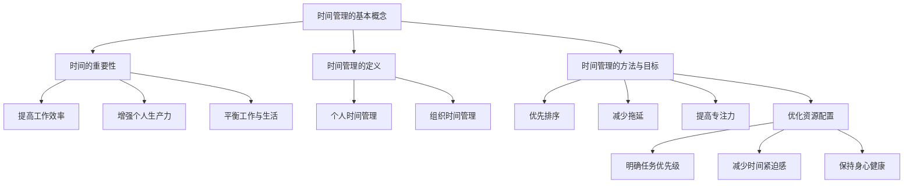
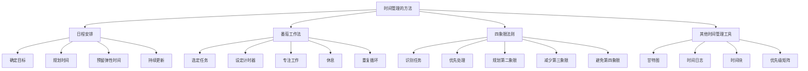

                 

### 引言

在当今快节奏的社会中，时间管理已成为一个至关重要的技能，无论是对于个人还是组织。时间不仅是有限的资源，更是构建生活质量的基石。随着现代科技的进步和信息的爆炸式增长，我们面临的挑战是如何在忙碌中找到平衡，有效地利用时间，实现个人与职业的全面发展。

本博客文章旨在探讨时间管理与生活意义的深层次联系，通过逻辑清晰、结构紧凑的论述，帮助读者理解时间管理的重要性，掌握有效的策略和技巧，并在忙碌的生活中找到内心的平和。文章将分为四个主要部分，分别从时间管理的核心概念、时间管理的方法与技巧、生活平衡的实践与探索，以及时间管理与生活意义的整合等方面展开。

**第一部分：时间管理的核心概念**，将介绍时间管理的基本概念、生活平衡的概念，以及忙碌中的挑战。

**第二部分：时间管理的方法与技巧**，将详细阐述番茄工作法和四象限法则等时间管理工具的原理和运用。

**第三部分：生活平衡的实践与探索**，将探讨个人时间规划、工作与生活的平衡、精力管理和心理调适等实际操作。

**第四部分：时间管理与生活意义的整合**，将讨论时间管理与个人成长、幸福生活、社会责任以及生活哲学的关系。

通过这篇文章，我们希望读者能够认识到时间管理不仅仅是提高效率的工具，更是提升生活质量、实现自我价值的手段。让我们一起探索如何在忙碌中找到平衡，过上更有意义的生活。

---

**关键词**：时间管理、生活平衡、忙碌、平衡策略、效率提升、工作与生活、个人成长、幸福生活、社会责任、生活哲学。

**摘要**：本文通过深入探讨时间管理的核心概念、方法和实践，帮助读者理解如何有效地管理时间，实现工作与生活的平衡。文章结合实际案例和数学模型，阐述了时间管理对个人成长和生活质量的重要影响，并提供了一系列实用的策略和技巧，以帮助读者在忙碌中找到平衡，实现内心的平和和自我价值的提升。

---

接下来，我们将进入第一部分：时间管理的核心概念，首先介绍时间管理的基本概念和背景。

----------------------------------------------------------------

## 第一部分：时间管理的核心概念

### 1.1 时间管理的基本概念

时间管理是一个系统的过程，旨在最大化时间的利用效率，以实现个人和组织的既定目标。时间管理不仅仅是为了提高工作效率，更重要的是通过合理分配时间，实现工作与生活的平衡，提升生活质量。

#### 时间的重要性

时间是一种不可再生的资源，对于每个人来说都是公平的。尽管每个人每天都有24小时，但如何有效利用这有限的时间，决定了个人成就和生活满意度。时间管理能够帮助我们：

1. **提高工作效率**：合理的时间规划可以减少无效工作时间，集中精力处理重要任务，从而提高工作效率。
2. **增强个人生产力**：有效的时间管理能够帮助个人更好地利用资源，提高产出，实现自我价值的提升。
3. **平衡工作与生活**：通过合理分配时间，确保工作与家庭、社交、休闲等各个方面的需求得到满足。

#### 时间管理的定义

时间管理可以定义为一系列策略和技巧，用于规划、控制、优先排序和优化个人或团队的时间使用。它涉及到以下几个方面：

1. **个人时间管理**：个人如何规划和安排自己的时间，确保实现个人目标。
2. **组织时间管理**：组织如何协调和分配团队成员的时间，以实现整体目标。

时间管理的目标主要包括：

- **优先排序**：确定哪些任务是重要的，哪些是紧急的，从而优先处理关键任务。
- **减少拖延**：通过制定明确的时间计划和目标，减少拖延现象。
- **提高专注力**：通过合理安排时间，避免多任务处理，提高专注力。
- **优化资源配置**：确保时间和人力资源的合理分配，提高整体效率。

### 1.2 生活平衡的概念

生活平衡是指在工作、家庭、社交、休闲等方面保持和谐与平衡的状态。生活平衡的重要性体现在以下几个方面：

1. **心理健康**：生活平衡有助于减轻压力和焦虑，促进心理健康。
2. **提高工作效率**：通过平衡工作和生活，能够保持良好的身体和心理状态，从而提高工作效率。
3. **增强幸福感**：生活平衡能够帮助人们更好地享受生活，提高幸福感。

#### 生活平衡的挑战和机遇

在现代社会，生活平衡面临着诸多挑战：

1. **工作压力**：工作负荷大、竞争激烈，容易导致工作与生活的失衡。
2. **科技干扰**：智能手机、社交媒体等现代科技产品，容易使人沉迷，影响生活平衡。
3. **个人期望**：现代社会对个人成就和成功的期望较高，容易导致个人在工作和生活中过度追求。

然而，生活平衡也带来了一系列机遇：

1. **自我实现**：通过平衡工作与生活，能够更好地实现个人价值和目标。
2. **创新能力**：生活平衡有助于保持良好的身心状态，提高创新能力和创造力。
3. **社会和谐**：家庭、社会和谐是生活平衡的重要组成部分，能够促进社会和谐与进步。

### 1.3 忙碌中的挑战

在现代社会，忙碌已成为一种普遍现象。忙碌不仅带来压力和焦虑，还可能导致时间管理和生活平衡的失衡。以下是忙碌中常见的挑战：

1. **时间紧迫感**：工作任务繁多，常常感到时间不够用，容易出现时间紧迫感。
2. **任务优先级不明确**：在繁忙的工作中，容易忽略重要任务，导致工作效率低下。
3. **多任务处理**：现代科技使人容易陷入多任务处理的陷阱，降低专注力和工作效率。
4. **身心健康问题**：长期忙碌可能导致身心健康问题，如焦虑、抑郁、失眠等。

为了应对这些挑战，我们需要采取一系列策略和技巧，包括：

1. **制定明确的时间计划**：通过制定详细的时间计划，明确任务优先级，减少时间紧迫感。
2. **专注力训练**：通过专注力训练，提高专注力，减少多任务处理。
3. **健康的生活方式**：保持良好的作息习惯，定期锻炼，提高身心健康水平。
4. **心理调适**：通过心理调适，减轻压力和焦虑，保持良好的心态。

### 总结

时间管理和生活平衡在现代社会中具有至关重要的意义。通过合理的时间管理和生活平衡，我们能够提高工作效率、实现个人价值，同时保持身心健康和幸福感。接下来，我们将探讨时间管理的方法与技巧，帮助读者在忙碌中找到平衡。

---

**Mermaid 流程图**

---

在理解了时间管理的基本概念和背景后，我们将进一步探讨如何具体实施时间管理，以及各种时间管理方法在实际中的应用。

----------------------------------------------------------------

### 1.4 时间管理的方法

在了解了时间管理的基本概念和重要性之后，接下来我们将讨论几种常见的时间管理方法，包括传统的日程安排、现代的番茄工作法、四象限法则等。这些方法各有特点，可以根据个人需求和环境进行选择和应用。

#### 1.4.1 日程安排

日程安排是时间管理中最基础的方法之一，通过制定详细的日程表，规划每天的工作和活动，以确保时间得到有效利用。以下是日程安排的几个关键步骤：

1. **确定目标**：在每天或每周的开始，明确当天的目标和任务，这些目标应当是具体、可量化的。
2. **规划时间**：将任务分配到具体的时间段，确保每个任务都有足够的时间来完成。
3. **预留弹性时间**：在实际执行过程中，难免会遇到突发事件，预留一定的弹性时间可以应对这些不可预见的任务。
4. **持续更新**：随着时间的推移，日程安排可能需要不断调整，因此需要定期回顾和更新日程表。

#### 1.4.2 番茄工作法

番茄工作法（Pomodoro Technique）是由弗朗西斯科·西里洛（Francesco Cirillo）在20世纪80年代末发明的一种时间管理方法。该方法通过将工作时间分割成短暂且集中的“番茄时间”，来提高工作效率。以下是番茄工作法的具体步骤：

1. **选定任务**：选择一个需要完成的任务。
2. **设定计时器**：将计时器设置为25分钟，这被称为一个“番茄时间”。
3. **专注工作**：在这25分钟内，全身心投入任务，避免任何干扰。
4. **休息**：当计时器响起时，休息5分钟，可以站起来活动，喝杯水，或者做一些轻松的事情。
5. **重复循环**：每完成4个“番茄时间”后，可以进行一次更长的休息，通常为15-30分钟。

番茄工作法的优势在于：

- **提高专注力**：通过设定明确的番茄时间，可以帮助人们集中注意力，减少分心。
- **增强自律**：每次番茄时间的完成都带来成就感，有助于培养自律。
- **减少疲劳**：短暂的休息可以让大脑和身体得到恢复，提高工作效率。

#### 1.4.3 四象限法则

四象限法则（Eisenhower Box）是由美国总统德怀特·D·艾森豪威尔提出的，它将任务根据紧急程度和重要性分为四个象限。以下是四象限法则的具体分类和应用：

1. **第一象限：重要且紧急**：处理这些任务通常需要立即行动，因为它们既重要又紧急，如紧急的电话会议或突发问题。
2. **第二象限：重要但不紧急**：这些任务对于长期目标至关重要，但通常不会引起立即的关注。例如，制定计划或进行技能提升。
3. **第三象限：不重要但紧急**：这些任务通常由外部因素引起，如不必要的电话或会议。虽然它们紧急，但通常并不重要。
4. **第四象限：不重要且不紧急**：这些任务通常是消磨时间的活动，如社交媒体浏览或无目的的闲聊。

四象限法则的应用步骤如下：

1. **识别任务**：将所有任务按照紧急程度和重要性进行分类。
2. **优先处理**：首先处理第一象限的任务，这些任务通常需要立即处理。
3. **规划第二象限**：为这些任务分配时间，确保它们得到完成。
4. **减少第三象限**：尽量减少这类任务，可以通过拒绝不必要的会议或电话来实现。
5. **避免第四象限**：尽可能避免这类任务，以确保时间得到有效利用。

#### 1.4.4 其他时间管理工具

除了上述方法，还有一些其他时间管理工具和方法可以辅助时间管理，如：

- **甘特图（Gantt Chart）**：一种可视化工具，用于规划项目的时间线和进度。
- **时间日志（Time Log）**：记录每天的活动和时间分配，帮助识别时间浪费的环节。
- **时间块（Time Blocking）**：将每天划分为不同的时间块，每个时间块专注于一项任务。
- **优先级矩阵（Priority Matrix）**：将任务按照重要性和紧急性进行评估，帮助确定优先级。

这些工具和方法可以根据个人的工作习惯和环境进行选择和应用，以达到最佳的时间管理效果。

### 总结

时间管理是一个复杂但至关重要的任务，通过了解和运用各种时间管理方法，我们可以更好地利用时间，提高工作效率和生活质量。在接下来的部分，我们将进一步探讨如何在具体的工作和生活中应用这些时间管理方法。

---

**Mermaid 流程图**

---

在了解了时间管理的基本概念和方法后，接下来我们将探讨如何通过具体的时间管理实践，将理论应用到实际生活中。

----------------------------------------------------------------

### 2.1 个人时间规划

个人时间规划是时间管理的重要组成部分，通过合理规划和高效利用时间，可以帮助我们实现个人目标，提高生活质量。以下是一些建议和步骤，帮助您制定和执行个人时间规划。

#### 2.1.1 个人时间规划的步骤

1. **明确目标**：
   - **短期目标**：设定3-6个月内要达成的目标，例如学习一门新技能、完成一个小项目等。
   - **长期目标**：设定一年以上要达成的目标，例如提升职业发展、实现财务自由等。
   - 确保目标是具体、可量化的，以便于跟踪和评估。

2. **评估时间分配**：
   - 记录一段时间内的时间使用情况，包括工作时间、休息时间、娱乐时间等。
   - 分析时间分配的合理性，识别哪些活动占用了过多的时间，哪些活动是无效或低效的。

3. **制定时间表**：
   - 将每天的时间划分为不同的时间段，每个时间段专注于一项任务或活动。
   - 为每个任务或活动分配具体的时间，确保有足够的时间来完成。
   - 留出一定的弹性时间，以应对突发事件或额外任务。

4. **设定优先级**：
   - 根据任务的重要性和紧急程度，设定优先级。
   - 首先完成重要且紧急的任务，然后是重要但不紧急的任务，最后是紧急但不重要的任务。
   - 对于不重要且不紧急的任务，可以适当调整或推迟。

5. **定期回顾和调整**：
   - 每周或每月回顾时间表和目标完成情况，评估效果。
   - 根据实际情况调整时间表，确保目标的实现和时间的合理利用。

#### 2.1.2 个人时间规划的案例分析

假设小明是一名软件工程师，他希望通过个人时间规划提高工作效率，实现职业发展。以下是他制定个人时间规划的过程：

1. **明确目标**：
   - **短期目标**：在接下来的三个月内，掌握一种新的编程语言（如Python）并完成一个小型项目。
   - **长期目标**：在未来一年内，提升到中级工程师水平，参与公司关键项目。

2. **评估时间分配**：
   - 通过记录一周的时间使用情况，小明发现他在工作日每天工作9小时，但效率不高，常常被社交媒体和邮件干扰。
   - 娱乐时间较多，常常在晚上熬夜看电影或玩游戏。

3. **制定时间表**：
   - **工作时间表**：
     - 上午9点到下午6点：专注工作，每小时休息5分钟，中午休息1小时。
     - 下午6点到晚上9点：学习Python，每小时休息10分钟。
     - 晚上9点到晚上10点：进行轻松的运动，如散步或瑜伽。
   - **休息时间表**：
     - 工作日每天晚上10点半睡觉，保证7-8小时的睡眠。

4. **设定优先级**：
   - 重要且紧急的任务：优先处理紧急的工作任务，如客户反馈或项目需求。
   - 重要但不紧急的任务：安排时间学习Python，每周至少学习20小时。
   - 紧急但不重要的任务：尽量拒绝或推迟，如不必要的会议或电话。
   - 不重要且不紧急的任务：尽量减少，如社交媒体浏览或无目的的闲聊。

5. **定期回顾和调整**：
   - 每周回顾一次时间表和目标完成情况，评估效果。
   - 根据实际情况调整时间表，确保目标的实现和时间的合理利用。

#### 2.1.3 个人时间规划的调整与优化

在执行个人时间规划的过程中，可能需要不断进行调整和优化。以下是一些调整与优化的方法：

1. **灵活调整时间表**：
   - 根据实际情况和任务变化，灵活调整时间表，确保任务能够按时完成。
   - 可以设置定期的时间检查点，评估时间表的执行情况，必要时进行调整。

2. **优先级动态调整**：
   - 随着任务进展和目标的变化，动态调整任务的优先级。
   - 对于已经完成的任务，及时更新目标，确保时间规划的连续性和有效性。

3. **利用工具辅助**：
   - 使用时间管理工具，如日历、时间跟踪应用等，帮助记录和调整时间表。
   - 使用项目管理工具，如Trello、JIRA等，帮助跟踪任务进度和优先级。

4. **保持心态调整**：
   - 面对任务繁多或突发情况时，保持积极的心态，避免焦虑和压力。
   - 通过心理调适和放松技巧，如冥想、深呼吸等，帮助缓解压力。

通过以上步骤和方法，我们可以制定和执行有效的个人时间规划，提高工作效率和生活质量。在接下来的部分，我们将探讨如何在工作与生活之间找到平衡。

----------------------------------------------------------------

### 2.2 工作与生活的平衡

工作与生活的平衡是现代时间管理的核心目标之一。在追求职业发展的同时，保持生活的丰富多彩和身心健康，是实现长期成功和幸福的关键。以下是一些策略和实践方法，帮助您在工作与生活之间找到平衡。

#### 2.2.1 工作与生活平衡的重要性

1. **心理健康**：长期的工作压力和过度劳累可能导致心理健康问题，如焦虑、抑郁和失眠等。工作与生活平衡有助于减轻压力，提高心理健康水平。

2. **身体健康**：过度工作可能导致缺乏锻炼和不良的饮食习惯，影响身体健康。平衡工作与生活，确保有足够的时间和精力进行锻炼和保持健康的饮食习惯。

3. **家庭和社会关系**：工作占据了我们大部分时间，但家庭和社会关系同样重要。平衡工作与生活，确保有足够的时间和精力陪伴家人、朋友和参与社交活动。

4. **工作效率**：过度工作可能导致疲劳和分心，降低工作效率。通过平衡工作与生活，保持良好的身体和心理状态，可以提高工作效率。

#### 2.2.2 实现工作与生活平衡的策略

1. **时间管理**：
   - **制定明确的时间计划**：合理安排工作时间，确保任务有足够的时间完成，避免加班和长时间工作。
   - **设定工作时间和休息时间**：明确每天的工作时间，确保有足够的休息和放松时间。
   - **避免多任务处理**：专注于一项任务，提高工作效率，减少分心和疲劳。

2. **设定优先级**：
   - **明确工作目标**：确定最重要的工作任务和目标，确保这些任务得到优先处理。
   - **区分紧急和重要任务**：区分紧急但不太重要的任务和重要但不紧急的任务，优先处理重要任务。

3. **工作区域与生活区域分离**：
   - **在家办公时**：设立独立的工作空间，减少家庭干扰，提高工作效率。
   - **外出工作时**：保持工作专注，避免将工作带回家，确保家庭生活不受影响。

4. **休息和放松**：
   - **定期休息**：确保每天有足够的休息时间，避免长时间连续工作。
   - **安排娱乐和休闲活动**：定期安排娱乐和休闲活动，如运动、旅行、阅读等，放松身心。

5. **家庭和社会关系**：
   - **定期与家人交流**：确保每天有足够的时间陪伴家人，交流感情。
   - **参与社交活动**：参与社区活动和社交聚会，维护和扩展人际关系。

#### 2.2.3 工作与生活平衡的案例分析

张女士是一名项目经理，她在工作和家庭之间寻找平衡的经历，为我们提供了宝贵的经验。

1. **时间管理**：
   - **制定详细的时间计划**：张女士每天早上都会制定一天的时间计划，明确工作任务和优先级。
   - **避免加班**：她尽量确保每天的工作在正常工作时间内完成，避免加班。
   - **灵活安排工作时间**：根据项目需求和家庭需求，灵活调整工作时间，确保工作与家庭时间不冲突。

2. **设定优先级**：
   - **明确工作目标**：张女士每个月都会设定项目目标和个人学习目标，确保这些目标得到优先处理。
   - **区分紧急和重要任务**：对于紧急但不太重要的任务，她会选择推迟处理，确保重要任务得到优先处理。

3. **工作区域与生活区域分离**：
   - **在家办公时**：张女士在家中设立了一个独立的工作空间，减少家庭干扰。
   - **外出工作时**：她尽量保持工作专注，避免将工作带回家，确保家庭生活不受影响。

4. **休息和放松**：
   - **定期休息**：张女士每天下午会安排30分钟的小憩，以提高工作效率。
   - **安排娱乐和休闲活动**：每周她都会安排一些娱乐和休闲活动，如瑜伽、旅行等，放松身心。

5. **家庭和社会关系**：
   - **定期与家人交流**：张女士每天晚上都会抽出时间与家人交流，分享工作和生活的点滴。
   - **参与社交活动**：她定期参加社区活动和社交聚会，维护和扩展人际关系。

通过以上策略和实践，张女士成功地实现了工作与生活的平衡，提高了工作效率，同时也保持了良好的家庭关系和身心健康。

### 总结

工作与生活的平衡是一个长期的过程，需要不断的努力和实践。通过合理的规划、设定优先级、合理安排时间、休息和放松，以及维护家庭和社会关系，我们可以在忙碌的生活中找到平衡，实现职业发展和生活质量的提升。在接下来的部分，我们将进一步探讨如何进行精力管理，以保持高效和精力充沛的状态。

----------------------------------------------------------------

### 3.3 精力管理

精力管理是时间管理的重要组成部分，它关注如何保持精力充沛，从而提高工作和生活质量。有效管理精力不仅能够提高工作效率，还能增强身心健康和幸福感。以下是一些基本的原则、方法和实践技巧，帮助您更好地管理精力。

#### 3.3.1 精力管理的基本原则

1. **平衡工作与休息**：
   - **工作-休息周期**：遵循工作与休息的周期，确保在长时间工作后有足够的休息时间。
   - **避免过度劳累**：合理安排工作时间，避免长时间连续工作，防止身体和心理的过度疲劳。

2. **保持身心健康**：
   - **锻炼身体**：定期进行体育锻炼，增强体质，提高免疫力。
   - **健康饮食**：保持均衡饮食，摄入充足的维生素和矿物质，确保身体得到充分的营养。

3. **心理调适**：
   - **减压技巧**：学习减压技巧，如冥想、深呼吸等，帮助缓解压力和焦虑。
   - **积极心态**：保持积极乐观的心态，面对困难和挑战时，能够保持冷静和应对能力。

4. **高效休息**：
   - **短暂休息**：每工作一段时间后，进行短暂的休息，如5-10分钟，帮助恢复精力。
   - **深度睡眠**：确保每晚有7-8小时的深度睡眠，提高精力储备和恢复能力。

#### 3.3.2 精力管理的方法与实践

1. **能量管理法**：

   **原理**：能量管理法认为精力就像是一种可以储存和消耗的能源，通过合理安排和利用，可以提高工作效率和生活质量。

   **方法**：
   - **时间规划**：合理安排每天的工作和学习时间，确保有足够的休息时间。
   - **能量储备**：在工作和学习之前，进行适当的能量储备活动，如短暂的运动或深呼吸。
   - **能量释放**：确保在工作中合理分配任务，避免长时间连续工作，适时释放能量。

2. **分散精力法**：

   **原理**：分散精力法通过将注意力分散到多个任务上，减少单任务长时间工作带来的疲劳。

   **方法**：
   - **多任务处理**：合理分配注意力，同时处理多个任务，提高工作效率。
   - **短暂切换**：每完成一项任务后，适当休息，再切换到另一项任务，避免长时间专注单一任务。

3. **自我激励法**：

   **原理**：自我激励法通过设定目标和奖励机制，提高工作动力和积极性。

   **方法**：
   - **目标设定**：设定明确、具体、可量化的目标，提高工作方向和动力。
   - **奖励机制**：完成任务后，给自己设定奖励，如休息时间、娱乐活动等，提高工作积极性。

4. **时间管理技巧**：

   **原理**：通过合理的时间管理，确保工作与休息的平衡，提高精力利用率。

   **方法**：
   - **番茄工作法**：将工作时间分割成短暂且集中的“番茄时间”，每25分钟后休息5分钟，确保精力得到恢复。
   - **专注力训练**：通过专注力训练，提高专注力，减少分心和疲劳。

#### 3.3.3 精力管理的案例分析

李先生是一名软件开发工程师，他通过精力管理的方法，显著提高了工作效率和生活质量。

1. **能量管理法**：
   - **时间规划**：每天早上制定详细的时间计划，确保工作与休息时间的平衡。
   - **能量储备**：早上工作前进行30分钟的有氧运动，提高身体和心理状态。
   - **能量释放**：每工作2小时后，进行15分钟的短暂休息，如散步或喝杯咖啡，恢复精力。

2. **分散精力法**：
   - **多任务处理**：同时处理多个任务，如编写代码、回复邮件、参加会议等，提高工作效率。
   - **短暂切换**：每完成一个任务后，适当休息，再切换到另一个任务，避免长时间专注单一任务。

3. **自我激励法**：
   - **目标设定**：每周设定具体的工作目标，如完成一个小项目或编写一定的代码量。
   - **奖励机制**：完成任务后，给自己设定奖励，如周末看电影或去健身房。

4. **时间管理技巧**：
   - **番茄工作法**：将工作时间分割成25分钟的工作时间和5分钟的休息时间，确保精力得到恢复。
   - **专注力训练**：通过专注力训练应用，提高专注力，减少分心和疲劳。

通过以上方法，李先生成功实现了精力管理，不仅提高了工作效率，还保持了身心健康和良好的生活质量。

### 总结

精力管理是时间管理的重要组成部分，通过合理分配精力、保持身心健康、运用有效的方法和实践技巧，我们可以在工作和生活中保持高效和精力充沛。在接下来的部分，我们将探讨如何通过心理调适，进一步提升精力管理和时间管理的效率。

----------------------------------------------------------------

### 3.4 心理调适

在时间管理和精力管理的基础上，心理调适也是确保高效和长久工作的重要环节。良好的心理状态能够帮助我们更好地应对压力，保持积极的态度，从而在忙碌中找到内心的平和。以下是一些常见的心理调适方法，帮助我们在面对压力和挑战时保持冷静和专注。

#### 3.4.1 心理调适的重要性

1. **提高抗压能力**：在现代社会，工作和生活压力无处不在。良好的心理调适能够帮助我们提高抗压能力，减少压力带来的负面影响。

2. **增强情绪稳定性**：情绪波动会影响工作效率和生活质量。通过心理调适，我们可以学会更好地管理情绪，保持情绪的稳定性。

3. **提升决策能力**：在高压环境下，决策能力可能受到影响。良好的心理调适可以帮助我们保持清晰的思路，做出更明智的决策。

4. **促进身心健康**：长期的心理压力会导致身心健康问题，如焦虑、抑郁、失眠等。心理调适有助于预防和缓解这些问题，促进身心健康。

#### 3.4.2 常见的心理调适方法

1. **认知重构**：

   **原理**：认知重构是一种心理疗法，通过改变对事件的看法和解释，来减轻负面情绪和压力。

   **方法**：
   - **识别负面思维**：首先识别那些导致负面情绪的思维模式，如过度概括、以偏概全等。
   - **替代思维**：用更积极、理性的思维模式来替代负面思维，例如将“我做不到”改为“我可以尝试找到解决方案”。

2. **正念冥想**：

   **原理**：正念冥想是一种通过专注于当前瞬间，提高意识和觉察力的技巧。

   **方法**：
   - **静坐冥想**：找一个安静的环境，闭上眼睛，专注于呼吸或身体感觉，保持意识在当前时刻。
   - **行禅**：在行走过程中，专注于每一步的触感和移动，体验身体与自然的联系。

3. **情绪释放**：

   **原理**：情绪释放通过物理或心理的方式，帮助释放积累的情绪压力。

   **方法**：
   - **哭泣**：允许自己哭泣，释放内心的悲伤和压力。
   - **运动**：通过剧烈的运动，如跑步、健身等，释放体内的紧张情绪。
   - **发泄**：找一个安全的方式发泄情绪，如击打沙袋、写日记等。

4. **社交支持**：

   **原理**：社交支持是通过与家人、朋友或专业人士交流，获得情感上的支持和建议。

   **方法**：
   - **与他人交流**：与亲朋好友分享自己的压力和困扰，寻求他们的理解和建议。
   - **专业咨询**：在必要时，寻求专业心理咨询师的帮助，通过专业的心理治疗来缓解压力。

#### 3.4.3 心理调适的案例分析

王小姐是一名市场营销经理，她在工作中经常面临压力和挑战。通过心理调适的方法，她成功地应对了这些压力，保持了良好的工作状态。

1. **认知重构**：
   - **识别负面思维**：王小姐意识到，她常常因为任务繁多和截止日期紧迫而产生焦虑。她开始识别这些负面思维，并将其记录下来。
   - **替代思维**：通过认知重构，王小姐学会了用更积极的方式来思考，例如将“任务多到无法完成”改为“这些任务是我成长和学习的机会”。

2. **正念冥想**：
   - **静坐冥想**：每天早上，王小姐会花15分钟进行静坐冥想，专注于呼吸和当下的感觉，这帮助她平静了思绪，提高了专注力。
   - **行禅**：在繁忙的工作间隙，王小姐会进行短暂的行禅，通过专注于每一步的触感和移动，放松身心。

3. **情绪释放**：
   - **运动**：王小姐每周会安排2-3次跑步或健身，通过运动释放体内的紧张情绪，保持身体和精神的健康。
   - **发泄**：在情绪低落时，她会写日记或与信任的朋友分享自己的感受，通过发泄释放内心的压力。

4. **社交支持**：
   - **与他人交流**：王小姐经常与同事和上级沟通，分享工作中的挑战和压力，获得了他们的理解和支持。
   - **专业咨询**：在压力特别大的时候，王小姐会寻求专业心理咨询师的帮助，通过心理咨询来调整自己的心态。

通过以上方法，王小姐成功地缓解了工作压力，提高了工作效率，同时也保持了良好的心理健康。

### 总结

心理调适是时间管理和精力管理的重要组成部分，通过有效的心理调适方法，我们可以更好地应对工作和生活中的压力，保持内心的平和和积极的态度。在接下来的部分，我们将探讨如何整合时间管理、个人成长和生活意义，实现全面的发展。

----------------------------------------------------------------

### 4.1 时间管理与个人成长

时间管理不仅是提高工作效率的工具，更是个人成长的重要支撑。通过合理的时间管理，我们可以更好地平衡工作与生活，从而实现自我提升和全面发展。

#### 4.1.1 时间管理与个人成长的关系

1. **提升学习效率**：时间管理能够帮助我们更有效地利用碎片时间，进行学习和知识积累。通过设定具体的学习目标和计划，我们可以在有限的时间内取得更好的学习效果。

2. **培养自律能力**：时间管理要求我们遵循既定的计划和目标，这有助于培养自律能力。自律是个人成长的重要品质，通过坚持时间管理，我们能够逐步提高自律水平。

3. **实现职业目标**：时间管理可以帮助我们更清晰地设定职业目标，并制定详细的行动计划。通过合理分配时间，我们可以专注于职业发展，提升职业素养和技能。

4. **平衡工作与生活**：良好的时间管理能够帮助我们更好地平衡工作与生活，确保有足够的时间和精力投入到个人成长和家庭生活中。

#### 4.1.2 如何通过时间管理促进个人成长

1. **设定个人成长目标**：
   - **明确目标**：设定具体的个人成长目标，如学习新技能、提升职业素养、参与社区活动等。
   - **分解目标**：将大目标分解为小目标，制定详细的行动计划和时间表。

2. **优先处理重要任务**：
   - **识别关键任务**：在时间管理中，识别出对个人成长有重要影响的任务，并优先处理。
   - **避免拖延**：通过设定截止日期和提醒，避免拖延，确保重要任务得到及时完成。

3. **高效利用碎片时间**：
   - **碎片时间规划**：合理利用碎片时间，如通勤、休息等，进行学习或进行其他有益的活动。
   - **多任务处理**：在确保不影响主要任务的前提下，合理安排多个任务，提高时间利用效率。

4. **定期回顾和调整**：
   - **总结经验**：定期回顾时间管理的效果，总结成功经验和不足之处。
   - **调整计划**：根据实际情况和需求，调整时间管理计划，确保目标的实现。

#### 4.1.3 个人成长的案例分析

小李是一名年轻的软件工程师，他通过有效的时间管理，实现了个人成长和职业发展。

1. **设定个人成长目标**：
   - **学习目标**：小李设定了学习Python编程的目标，并在时间管理计划中安排了每天2小时的学习时间。
   - **职业目标**：他制定了3年内晋升为高级工程师的计划，并制定了详细的职业发展路径。

2. **优先处理重要任务**：
   - **关键任务**：小李优先处理与职业发展相关的重要任务，如参与公司关键项目、学习新技能等。
   - **避免拖延**：他通过设置提醒和截止日期，确保重要任务按时完成。

3. **高效利用碎片时间**：
   - **通勤时间**：在通勤时，小李会使用学习软件进行编程学习。
   - **休息时间**：在休息时，他会阅读相关的技术书籍或参加线上课程。

4. **定期回顾和调整**：
   - **总结经验**：每月回顾一次时间管理的效果，总结成功经验和不足之处。
   - **调整计划**：根据实际情况和需求，调整时间管理计划，确保目标的实现。

通过以上方法，小李不仅实现了个人成长，还成功晋升为高级工程师，实现了职业目标。

### 总结

时间管理是个人成长的重要工具，通过合理的时间规划、优先处理重要任务、高效利用碎片时间和定期回顾调整，我们可以在工作和生活中实现自我提升和全面发展。在接下来的部分，我们将探讨时间管理与幸福生活的关系。

----------------------------------------------------------------

### 4.2 时间管理与幸福生活

时间管理不仅仅是提高工作效率和实现职业目标，它更是构建幸福生活的重要基石。在现代社会，时间作为一种有限的资源，如何有效地管理和利用时间，直接关系到我们的生活质量和个人幸福感。

#### 4.2.1 时间管理与幸福生活的关系

1. **提高生活质量**：通过合理的时间管理，我们可以更有效地安排日常活动，确保工作、家庭和休闲时间得到平衡，从而提高生活质量。

2. **增强个人满意度**：有效的时间管理能够帮助我们在有限的时间内实现更多的目标，减少因时间不足带来的焦虑和压力，增强个人满意度和幸福感。

3. **促进身心健康**：良好的时间管理习惯，如合理规划作息时间和工作节奏，有助于保持身心健康，减少因长时间工作带来的身体疲劳和心理压力。

4. **增强人际关系**：通过有效的时间管理，我们可以确保有足够的时间和精力投入到家庭和朋友中，维护和增强人际关系，从而提升幸福感。

#### 4.2.2 实现幸福生活的策略

1. **设定明确的生活目标**：
   - **短期目标**：设定近期内想要实现的生活目标，如提升生活质量、改善家庭环境等。
   - **长期目标**：设定一年以上想要实现的生活目标，如提升职业技能、实现财务自由等。
   - 确保目标是具体、可量化的，以便于跟踪和评估。

2. **合理规划日常活动**：
   - **工作与休息平衡**：合理安排工作时间，确保有足够的休息和放松时间，避免过度劳累。
   - **家庭与个人时间**：确保有足够的时间陪伴家人，参与家庭活动，同时也要有时间进行个人兴趣和爱好。

3. **高效利用时间**：
   - **利用碎片时间**：合理利用通勤、等待等碎片时间，进行学习或放松，提高时间利用率。
   - **避免多任务处理**：专注于一项任务，避免分心和疲劳，提高工作效率。

4. **定期评估和调整**：
   - **回顾和总结**：定期回顾时间管理的效果，总结成功经验和不足之处。
   - **调整计划**：根据实际情况和需求，及时调整时间管理计划，确保目标的实现。

#### 4.2.3 幸福生活的案例分析

张先生是一名企业高管，他通过时间管理，实现了工作和生活的平衡，过上了幸福的生活。

1. **设定明确的生活目标**：
   - **短期目标**：张先生设定了提升家庭生活质量的目标，包括改善家庭环境、增加家庭活动等。
   - **长期目标**：他设定了在5年内实现财务自由的目标，通过合理投资和管理财务，逐步实现这一目标。

2. **合理规划日常活动**：
   - **工作与休息平衡**：张先生每天确保有足够的休息时间，避免长时间连续工作，保持身心健康。
   - **家庭与个人时间**：他每周安排固定的时间陪伴家人，参与家庭活动，同时也留出时间进行个人兴趣和爱好。

3. **高效利用时间**：
   - **利用碎片时间**：张先生在通勤和等待时，会阅读书籍或进行学习，提高时间利用率。
   - **避免多任务处理**：他专注于一项任务，避免分心和疲劳，提高工作效率。

4. **定期评估和调整**：
   - **回顾和总结**：每月回顾一次时间管理的效果，总结成功经验和不足之处。
   - **调整计划**：根据实际情况和需求，及时调整时间管理计划，确保目标的实现。

通过以上策略，张先生不仅实现了工作和生活的平衡，还提高了生活质量，实现了个人和家庭的幸福。

### 总结

时间管理是实现幸福生活的重要手段，通过设定明确的生活目标、合理规划日常活动、高效利用时间和定期评估和调整，我们可以在工作和生活中找到平衡，提高生活质量，实现个人和家庭的幸福。在接下来的部分，我们将探讨时间管理与社会责任的关系。

----------------------------------------------------------------

### 4.3 时间管理与社会责任

在现代社会，个人不仅追求自身的发展和幸福，还应承担起社会责任，为社会的进步和和谐做出贡献。时间管理在这个过程中起着至关重要的作用，通过有效的时间管理，我们可以更高效地投入社会工作和公益活动，实现个人价值的同时，促进社会的发展。

#### 4.3.1 时间管理与社会责任的关系

1. **提高社会效率**：通过合理的时间管理，个人和组织能够更高效地利用资源，提高工作效率，从而为社会创造更多的价值和效益。

2. **促进社会和谐**：良好的时间管理有助于平衡个人生活和社会责任，减少因个人时间分配不当带来的社会矛盾，促进社会的和谐发展。

3. **增强社会责任感**：通过参与社会工作和公益活动，个人可以培养和增强社会责任感，同时通过时间管理，确保在完成个人目标和职责的同时，为社会贡献自己的力量。

4. **提升个人影响力**：有效的时间管理和社会责任的实践，可以提升个人的社会影响力，建立良好的社会形象，从而为个人的长远发展打下坚实的基础。

#### 4.3.2 如何通过时间管理履行社会责任

1. **设定社会责任目标**：
   - **明确目标**：设定具体的社会责任目标，如参与公益活动、志愿服务、社区建设等。
   - **分解目标**：将社会责任目标分解为可执行的小目标，制定详细的行动计划和时间表。

2. **合理规划时间**：
   - **平衡个人与责任**：在时间管理中，合理规划个人时间和社会责任时间，确保两者之间的平衡。
   - **优先处理社会责任**：在时间安排上，优先处理社会责任相关的工作和活动，确保重要任务得到及时完成。

3. **高效利用时间**：
   - **碎片时间利用**：合理利用碎片时间，如通勤、等待等，进行社会责任相关的学习和准备。
   - **多任务处理**：在确保不影响主要任务的前提下，合理安排多个任务，提高时间利用效率。

4. **建立责任体系**：
   - **团队协作**：通过团队协作，共同承担社会责任，提高工作效率。
   - **可持续性**：确保社会责任活动的持续性和长期性，形成有效的责任管理体系。

#### 4.3.3 社会责任的案例分析

李女士是一名职业女性，她在工作中取得了优异的成绩，同时也积极参与社会责任工作，展现了良好的社会责任感。

1. **设定社会责任目标**：
   - **明确目标**：李女士设定了参与社区公益活动和志愿服务的目标，每周至少投入2小时的时间。
   - **分解目标**：她将年度目标分解为每月的具体行动，如参与社区清洁活动、志愿服务等。

2. **合理规划时间**：
   - **平衡个人与责任**：李女士在工作时间安排上，优先处理社会责任相关的工作，确保有足够的时间参与公益活动。
   - **优先处理社会责任**：在时间安排上，优先处理社会责任相关的工作和活动，确保重要任务得到及时完成。

3. **高效利用时间**：
   - **碎片时间利用**：在通勤和等待时，李女士会阅读与社会责任相关的书籍或新闻，提高时间利用率。
   - **多任务处理**：她通过合理安排工作和活动，确保在完成工作任务的同时，能够积极参与社会责任工作。

4. **建立责任体系**：
   - **团队协作**：李女士与同事共同参与社会责任工作，形成团队协作，提高工作效率。
   - **可持续性**：她通过持续参与社会责任工作，建立了一套有效的责任管理体系，确保活动的持续性和长期性。

通过以上实践，李女士不仅实现了个人职业目标，还积极参与社会责任工作，为社会的进步和和谐做出了贡献，展现了良好的社会责任感。

### 总结

时间管理与社会责任密不可分，通过合理的时间管理，我们可以更高效地履行社会责任，促进社会的和谐与进步。在个人成长和幸福生活的过程中，我们不仅要关注自身的需求，更要承担起社会责任，为社会的美好贡献力量。在接下来的部分，我们将进一步探讨时间管理和生活哲学的关系。

----------------------------------------------------------------

### 4.4 时间管理和生活哲学

时间管理不仅仅是技术和方法的集合，它还与生活哲学密切相关。生活哲学涉及到对生活本质和意义的理解，指导我们如何行动和选择。通过将时间管理融入生活哲学，我们可以更加深入地理解时间的价值，从而在忙碌的生活中找到平衡和内心的满足。

#### 4.4.1 时间管理和生活哲学的关系

1. **生活哲学指导时间管理**：生活哲学提供了对时间的看法和价值观，这些观念指导我们如何规划和利用时间。例如，某些哲学观念强调“活在当下”，这会影响我们的时间管理策略，使我们更注重当下的体验而非未来的目标。

2. **时间管理实现生活哲学**：通过有效的时间管理，我们能够更好地实践生活哲学，实现其理念。例如，通过合理分配时间，我们可以在工作和个人生活中找到平衡，从而实现“和谐生活”的理念。

3. **时间管理反思生活哲学**：时间管理的实践会促使我们反思自己的生活哲学。通过观察和评估时间管理的实际效果，我们可以进一步理解时间的本质，并对自己的生活哲学进行修正和完善。

#### 4.4.2 生活哲学的探索与实践

1. **存在主义**：

   **理念**：存在主义强调个体的自由和选择，认为每个人的生活都是独特的，每个人都有责任为自己选择生活方式。

   **实践**：
   - **自主选择**：在时间管理中，我们应该根据自己的价值观和目标进行自主选择，而不是盲目跟随他人。
   - **自我反思**：定期反思时间管理的决策，确保这些决策符合个人的价值观和目标。

2. **儒家哲学**：

   **理念**：儒家哲学强调“仁爱”、“中庸”和“礼义”，提倡和谐、平衡和有序的生活。

   **实践**：
   - **平衡工作与生活**：通过时间管理，确保工作和生活之间的平衡，避免过度劳累和疏忽家庭。
   - **人际关系**：通过合理的时间管理，保证有足够的时间与家人、朋友和同事交往，维护和谐的人际关系。

3. **佛教哲学**：

   **理念**：佛教哲学强调“无常”、“无我”和“涅槃”，提倡摆脱贪欲、执着和痛苦，追求内心的平和和解脱。

   **实践**：
   - **活在当下**：通过时间管理，学会专注于当前的任务和体验，避免过度担忧未来或回忆过去。
   - **冥想和正念**：将冥想和正念练习融入日常时间管理，通过冥想和正念来提升专注力和内心的平静。

4. **实用主义**：

   **理念**：实用主义强调实际效果和实用价值，认为知识和理念应当服务于实际生活和实践。

   **实践**：
   - **实用导向**：在时间管理中，注重实际效果和结果，而不是理论上的完美。
   - **反馈与调整**：通过实践和时间管理的效果反馈，不断调整策略和方法，以实现最佳效果。

#### 4.4.3 生活哲学的案例分析

王先生是一名忙碌的企业高管，他通过结合生活哲学和时间管理，实现了工作和生活的和谐。

1. **存在主义实践**：
   - **自主选择**：王先生根据自己的兴趣和价值观，选择了与自己的职业目标相符合的工作，确保工作与个人目标的统一。
   - **自我反思**：他定期反思自己的时间管理决策，确保每一项决策都符合自己的价值观和长期目标。

2. **儒家哲学实践**：
   - **平衡工作与生活**：王先生通过时间管理，确保有足够的时间陪伴家人，参与家庭活动，维护和谐的家庭关系。
   - **人际关系**：他利用空闲时间与朋友和同事交往，通过分享经验和共同活动，建立了深厚的人际关系网络。

3. **佛教哲学实践**：
   - **活在当下**：王先生在繁忙的工作中，通过冥想和正念练习，保持内心的平静和专注，避免了焦虑和压力。
   - **冥想和正念**：每天早上，他都会花15分钟进行冥想，这帮助他在一天的工作中保持清晰的思路和良好的心态。

4. **实用主义实践**：
   - **实用导向**：王先生在时间管理中，注重实际效果，不追求形式上的完美，而是追求实际的效率。
   - **反馈与调整**：他定期评估时间管理的效果，根据实际情况和反馈，不断调整自己的时间管理策略，以实现最佳效果。

通过结合生活哲学和时间管理，王先生实现了个人职业发展和家庭生活的和谐，过上了充实而幸福的生活。

### 总结

生活哲学为时间管理提供了深层次的理念和指导，通过将时间管理融入生活哲学，我们可以在忙碌的生活中找到内心的平衡和满足。在个人成长、幸福生活和实现社会责任的过程中，生活哲学帮助我们理解时间的本质和价值，从而更加高效地管理时间，实现个人和社会的目标。在接下来的部分，我们将提供一些附录，包括时间管理工具推荐和资源，帮助读者更好地实践时间管理。

### 附录

#### 附录A：时间管理工具推荐

**电子时间管理工具**

1. **Google Calendar**：一款功能强大的日历应用，可以设置事件提醒、共享日历等。
2. **Trello**：一款基于看板的项目管理工具，适用于团队协作和个人任务管理。
3. **Asana**：一款专业的项目管理工具，可以帮助团队和个人高效协作。
4. **Evernote**：一款笔记和组织工具，适合记录想法、任务和重要信息。

**手写时间管理工具**

1. **日程表**：传统的纸质日程表，适合记录日常活动和重要事件。
2. **任务清单**：手写的任务清单，可以帮助跟踪任务进度和完成情况。
3. **习惯跟踪器**：记录日常习惯和目标完成的工具，如健身记录、读书记录等。

**时间管理应用案例分析**

1. **使用Google Calendar进行时间管理**：
   - **案例背景**：张女士是一名自由职业者，需要灵活管理她的工作日程。
   - **案例分析**：张女士利用Google Calendar制定每天的工作计划，设置提醒和事件，确保按时完成任务，同时也能有效地平衡工作与生活。

2. **使用Trello进行项目协作**：
   - **案例背景**：李先生是一名项目经理，需要协调团队成员的工作。
   - **案例分析**：李先生通过Trello创建项目看板，分配任务和跟踪进度，确保项目按时完成，同时提高了团队的协作效率。

3. **使用Evernote进行任务记录**：
   - **案例背景**：王先生是一名创业者，需要记录和管理大量的商业信息。
   - **案例分析**：王先生使用Evernote记录商业想法、任务和重要信息，通过标签和搜索功能，轻松找到所需内容，提高了工作效率。

#### 附录B：时间管理资源

**常见的时间管理书籍推荐**

1. **《时间管理：如何充分利用时间》（Time Management: How to Gain Control of Your Life）** - 这本书提供了详细的时间管理技巧和策略，帮助读者提高工作效率和生活质量。
2. **《番茄工作法：简单、实用的效率提升方法》（The Pomodoro Technique: The Simple, Effective Way to Accomplish More in Less Time）** - 详细介绍了番茄工作法的原理和应用，帮助读者提高专注力和工作效率。
3. **《工作、消费主义和新穷人》（Work, Consumerism and the New Poor）** - 这本书探讨了现代社会工作与生活压力的关系，提供了关于如何平衡工作与生活的深刻见解。

**时间管理博客和网站推荐**

1. **Lifehacker**：提供各种时间管理和生活技巧的博客，内容实用且更新频繁。
2. **Productivityist**：专注于时间管理和个人生产力，提供实用的方法和案例分析。
3. **The Time Doctor**：提供关于时间管理和工作习惯的深度文章和资源。

**时间管理相关的在线课程推荐**

1. **“时间管理：如何更高效地工作”**（Time Management: How to Work More Efficiently）- Coursera上的一门免费课程，教授时间管理的基本原则和实用技巧。
2. **“高效时间管理：如何最大化你的时间”**（Effective Time Management: Maximize Your Time）- Udemy上的一门实践性课程，通过案例和实践帮助学员掌握时间管理技能。
3. **“时间管理：提升工作效率”**（Time Management: Increase Your Productivity）- edX上的一门专业课程，涵盖时间管理的各个方面，帮助学员全面提升时间管理能力。

通过以上推荐，读者可以获取更多关于时间管理的方法和实践，进一步优化自己的时间管理策略，实现个人成长和幸福生活。

---

**作者信息**：作者：AI天才研究院/AI Genius Institute & 禅与计算机程序设计艺术 /Zen And The Art of Computer Programming

