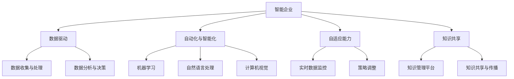

                 

### 引言

在当今快速发展的数字经济时代，企业面临的竞争环境日益复杂多变。在这种背景下，如何高效地管理企业知识，推动组织学习，成为企业持续创新和发展的关键因素。智能企业知识管理应运而生，成为企业实现数字化转型和提升核心竞争力的重要手段。

**智能企业知识管理**是指利用先进的信息技术和人工智能（AI）技术，对企业的知识进行系统化的收集、存储、处理、共享和应用，从而构建一个可持续发展的组织学习生态。这一概念不仅涵盖了知识管理的传统方法，更强调了AI技术在知识获取、分析、利用和传播中的重要作用。

本篇文章将深入探讨智能企业知识管理的内涵和意义，通过逻辑清晰、结构紧凑的分析方式，逐步解读AI在构建组织学习生态中的应用。文章将分为四个主要部分：

1. **基础理论与核心概念**：介绍智能企业的定义与特征，知识管理的重要性与原则，以及AI在知识管理中的应用和组织的知识学习生态的构建。
  
2. **技术实现与工具**：详细讲解AI技术在知识管理中的具体应用，包括数据收集与处理、AI算法与应用、知识库构建与维护，以及知识共享与传播。

3. **案例分析与实践**：通过成功案例介绍，分析面临的挑战与解决方案，提供实践指南与建议。

4. **未来趋势与展望**：探讨AI技术在知识管理领域的未来发展方向，以及智能企业与组织学习的未来发展。

通过这一系列的分析，本文旨在为读者提供一个全面而深入的智能企业知识管理全景图，帮助企业和个人更好地理解和应用这一前沿技术，提升组织的学习能力和创新能力。

#### 关键词
- 智能企业
- 知识管理
- 人工智能
- 组织学习生态
- 知识库
- 数据处理
- 知识共享

#### 摘要

本文探讨了智能企业知识管理的概念、意义和实现方法。通过深入分析智能企业的特征，知识管理的重要性，以及AI技术在知识管理中的应用，本文揭示了AI在构建组织学习生态中的关键作用。文章首先介绍了智能企业知识管理的理论基础，包括数据收集与处理、AI算法的应用、知识库的构建与维护，以及知识共享与传播。随后，通过案例分析，探讨了智能企业知识管理实践中的挑战和解决方案。最后，本文展望了AI技术在知识管理领域的未来发展趋势，为智能企业知识管理提供了实践指南和策略建议。通过对本文的阅读，读者将获得关于智能企业知识管理的全面理解和实用启示。

### 第一部分：基础理论与核心概念

#### 第1章 智能企业概述

##### 1.1 智能企业的定义与特征

智能企业是指利用先进的信息技术，特别是人工智能（AI）技术，实现自动化、智能化运作的企业。这种企业通过数据驱动决策，具备高度灵活性和自适应能力，能够快速响应市场变化和客户需求。智能企业的核心特征包括：

1. **数据驱动**：智能企业依赖于大量的数据收集和分析，通过数据驱动决策，从而提高决策的精准度和效率。
2. **自动化与智能化**：利用机器学习、自然语言处理、计算机视觉等AI技术，实现业务流程的自动化和智能化，减少人工干预。
3. **自适应能力**：具备快速适应环境变化的能力，能够根据实时数据调整策略和决策。
4. **知识共享**：智能企业通过知识管理平台，实现知识的共享和传播，提高组织的知识利用率。

##### 1.2 智能企业的重要性

智能企业在当前的商业环境中具有重要意义，主要体现在以下几个方面：

1. **提升竞争力**：通过数据驱动和智能化运营，智能企业能够更快速地响应市场变化，提高生产效率和产品质量，从而增强竞争力。
2. **降低成本**：自动化和智能化的业务流程能够减少人工成本，提高资源利用效率，降低运营成本。
3. **提高创新能力**：智能企业通过知识共享和协作，激发员工的创新思维，推动持续创新，增强企业的创新能力。
4. **优化客户体验**：智能企业能够利用AI技术提供个性化的客户服务，优化客户体验，提升客户满意度。

##### 1.3 智能企业的核心概念联系图（Mermaid）



在这个联系图中，智能企业通过数据驱动、自动化与智能化、自适应能力和知识共享等核心概念相互联系，共同构建一个高效、智能的运营体系。

### 第2章 知识管理基础

##### 2.1 知识管理的定义与原则

知识管理是指通过系统的方法，对企业的知识进行识别、收集、存储、共享、应用和创新，从而提升企业的整体竞争力和创新能力。知识管理的基本原则包括：

1. **全员参与**：知识管理需要全员参与，鼓励员工主动分享和贡献知识，形成知识共享的文化。
2. **知识共享**：知识共享是知识管理的核心，通过建立知识共享平台，实现知识的有效传播和利用。
3. **持续改进**：知识管理需要持续改进，通过不断地收集、分析和应用知识，提高知识管理水平。
4. **知识创新**：知识管理不仅关注知识的传播和利用，还注重知识的创新，通过知识的融合和碰撞，激发新的创意和方案。

##### 2.2 知识管理的类型与流程

知识管理可以分为多种类型，主要包括：

1. **内部知识管理**：主要关注企业内部的隐性知识和显性知识的管理，通过内部培训、经验交流等方式，促进知识的内部传播和应用。
2. **外部知识管理**：主要关注企业外部的知识资源，如合作伙伴、行业专家等，通过建立外部知识网络，获取外部知识，提高企业的创新能力。
3. **知识创新管理**：主要关注知识的创新和应用，通过跨部门的协作和知识融合，推动企业的持续创新。

知识管理的流程主要包括：

1. **知识识别**：识别企业内部的显性和隐性知识，明确知识的重要性和价值。
2. **知识收集**：通过多种方式收集知识，如文档、数据库、社交媒体等。
3. **知识存储**：将收集到的知识进行系统化存储，建立知识库，便于知识的查询和应用。
4. **知识共享**：通过知识共享平台，实现知识的传播和共享，促进知识的利用。
5. **知识应用**：将知识应用到实际业务中，提高业务效率和创新能力。

##### 2.3 知识管理的重要性

知识管理在智能企业中具有重要意义，主要体现在以下几个方面：

1. **提升创新能力**：知识管理能够激发员工的创新思维，促进知识的创新和转化，提高企业的创新能力。
2. **提高决策效率**：通过知识管理，企业能够更好地收集、分析和利用数据，提高决策的精准度和效率。
3. **增强竞争力**：知识管理能够帮助企业更好地利用内外部知识资源，提高市场竞争力。
4. **优化业务流程**：通过知识管理，企业能够优化业务流程，提高生产效率和产品质量。

##### 2.4 智能企业与知识管理的联系

智能企业与知识管理密切相关，智能企业的运作高度依赖于知识管理。具体来说：

1. **数据驱动**：智能企业的运作基于数据驱动，知识管理能够帮助企业更好地收集、分析和利用数据，为智能决策提供支持。
2. **知识共享**：智能企业强调知识共享，通过知识管理平台，实现知识的有效传播和利用，提高企业的整体创新能力。
3. **自动化与智能化**：知识管理能够支持企业的自动化和智能化运营，通过AI技术，实现知识的自动化收集、分析和应用。
4. **自适应能力**：智能企业需要具备快速适应环境变化的能力，知识管理能够帮助企业及时获取和利用外部知识资源，提高自适应能力。

通过以上分析，我们可以看到，智能企业与知识管理相互促进，共同构建了一个高效、智能的运营体系，为企业的发展提供了强大的动力。

### 第3章 AI与知识管理

##### 3.1 AI在知识管理中的应用

人工智能（AI）技术在知识管理中的应用越来越广泛，其核心价值在于通过自动化和智能化的手段，提高知识收集、分析和利用的效率。以下是AI在知识管理中的一些主要应用：

1. **知识识别与分类**：利用自然语言处理（NLP）技术，自动识别和分类文本数据，提高知识的收集和整理效率。
2. **知识挖掘与关联**：通过机器学习算法，从大量数据中挖掘潜在的关联和模式，帮助发现新的知识。
3. **知识检索与推荐**：利用AI技术，实现高效的知识检索和个性化推荐，提高知识的应用效果。
4. **知识问答与对话**：通过聊天机器人等技术，实现知识的自动化问答和对话，提供便捷的知识服务。
5. **知识可视化**：利用数据可视化技术，将复杂的数据和知识以直观的形式展示，帮助用户更好地理解和利用知识。

##### 3.2 AI技术在知识管理中的优势

AI技术在知识管理中具有显著的优势，主要体现在以下几个方面：

1. **高效性**：AI技术能够自动化处理大量的数据，大幅提高知识管理的效率。
2. **准确性**：通过机器学习和深度学习算法，AI技术能够精确地识别和分类知识，提高知识的准确性。
3. **灵活性**：AI技术能够根据不同的业务需求和场景，灵活地调整和应用知识管理策略。
4. **创新性**：AI技术能够从大量数据中发现新的模式和关联，推动知识的创新和应用。
5. **智能化**：通过智能化的系统，AI技术能够提供个性化的知识服务，提高用户体验。

##### 3.3 AI与知识管理的挑战

尽管AI技术在知识管理中具有巨大的潜力，但其在实际应用中仍面临一些挑战：

1. **数据质量**：知识管理依赖于高质量的数据，但数据质量往往难以保证，这会影响AI算法的性能。
2. **算法偏见**：AI算法可能存在偏见，导致知识的不公平性，影响知识的公正性。
3. **技术成熟度**：虽然AI技术发展迅速，但在某些领域的应用仍不成熟，需要进一步研究和改进。
4. **隐私保护**：AI技术在知识管理中会涉及大量的个人和敏感数据，如何保护数据隐私是一个重要问题。
5. **组织文化**：知识管理需要全员参与和共享，但许多企业缺乏相应的文化氛围，这会影响AI技术的应用效果。

##### 3.4 AI在知识管理中的未来发展方向

展望未来，AI技术在知识管理中将继续发挥重要作用，其发展方向主要包括：

1. **知识自动化**：通过更高级的AI算法，实现知识的自动化识别、分类、挖掘和应用，进一步提高知识管理的效率。
2. **知识智能化**：利用AI技术，实现更智能的知识检索、推荐和问答，提供更个性化的知识服务。
3. **知识融合**：通过跨领域、跨组织的知识融合，构建更加丰富和全面的知识体系，推动知识的创新和共享。
4. **知识安全管理**：加强数据安全和隐私保护，确保AI技术在知识管理中的安全可靠。
5. **知识伦理**：在AI技术的应用过程中，注重知识伦理，确保知识的公正、公平和可解释性。

通过以上分析，我们可以看到，AI技术在知识管理中具有巨大的潜力，但也面临一些挑战。未来，随着AI技术的不断发展和完善，智能企业知识管理将迎来更加广阔的应用前景。

### 第4章 组织学习生态

##### 4.1 组织学习的定义与目的

组织学习是指企业通过持续地学习、创新和变革，提高整体绩效和能力的过程。其核心目标是实现知识的共享和创造，推动组织的持续发展。组织学习包括以下几个关键组成部分：

1. **知识共享**：组织学习强调知识的共享，通过建立共享机制，鼓励员工分享经验和知识，实现知识的传承和扩散。
2. **知识创造**：通过跨部门、跨领域的协作，推动知识的创新和创造，形成新的知识和观念。
3. **能力提升**：组织学习通过知识的积累和应用，提升员工的能力和技能，增强组织的整体竞争力。
4. **文化变革**：组织学习还涉及到组织文化的变革，通过培养学习型组织的文化，推动组织的持续变革和发展。

##### 4.2 组织学习生态的概念与构建

组织学习生态是指一个动态、可持续发展的知识环境，通过内外部资源的整合和互动，实现知识的获取、传播和应用。构建组织学习生态的关键要素包括：

1. **知识源**：组织学习生态的基础是丰富的知识源，包括内部的知识库、经验库、文档库，以及外部的行业信息、学术研究等。
2. **知识共享平台**：通过建立知识共享平台，实现知识的收集、存储、检索和共享，提高知识的可获取性和利用率。
3. **知识管理工具**：利用先进的信息技术和AI技术，如大数据分析、机器学习、自然语言处理等，实现知识的自动化管理和智能化应用。
4. **激励机制**：通过建立激励机制，鼓励员工积极参与知识共享和创造，形成知识共享的文化氛围。
5. **培训与学习**：定期开展培训和学习活动，提高员工的知识水平和技能，推动组织学习的深入发展。

##### 4.3 组织学习生态的核心算法原理

组织学习生态的核心算法原理主要涉及以下几个方面：

1. **知识挖掘与关联**：利用机器学习算法，从大量数据中挖掘潜在的关联和模式，帮助发现新的知识和洞见。
2. **知识分类与标注**：通过自然语言处理技术，对知识进行分类和标注，实现知识的系统化和规范化管理。
3. **知识推荐与检索**：利用推荐系统和搜索引擎算法，实现知识的个性化推荐和高效检索，提高知识的利用效率。
4. **知识融合与创新**：通过跨领域、跨组织的知识融合，推动知识的创新和创造，形成新的知识和观念。

以下是一个简化的核心算法原理的Python代码示例：

```python
import pandas as pd
from sklearn.feature_extraction.text import TfidfVectorizer
from sklearn.metrics.pairwise import cosine_similarity

# 假设有一个知识库dataframe，包含文本数据和标签
knowledge_base = pd.DataFrame({
    'text': ['知识1', '知识2', '知识3', '知识4'],
    'label': ['标签A', '标签B', '标签A', '标签C']
})

# 使用TF-IDF向量表示文本
vectorizer = TfidfVectorizer()
knowledge_vectors = vectorizer.fit_transform(knowledge_base['text'])

# 计算文本之间的相似度
similarity_matrix = cosine_similarity(knowledge_vectors)

# 推荐相似知识
def recommend_similar_knowledge(text, top_n=3):
    text_vector = vectorizer.transform([text])
   相似度 = text_vector.dot(knowledge_vectors.T)
    similar_indices = similarity_matrix.argsort()[0][-top_n:]
    return knowledge_base.iloc[similar_indices]

# 测试推荐相似知识
new_text = '知识5'
recommended_knowledge = recommend_similar_knowledge(new_text)
print(recommended_knowledge)

```

在这个示例中，我们首先使用TF-IDF向量表示知识库中的文本数据，然后计算文本之间的相似度，最后实现相似知识的推荐功能。通过这样的算法，组织学习生态能够实现知识的有效组织和利用，推动组织的持续学习和创新。

### 第二部分：技术实现与工具

#### 第5章 数据收集与处理

##### 5.1 数据收集的方法与工具

数据收集是智能企业知识管理的基础工作，其质量直接影响到后续的知识处理和分析。以下是几种常用的数据收集方法和工具：

1. **日志文件收集**：通过服务器和应用程序的日志文件，收集系统运行的数据。常用的工具包括Logstash、Fluentd等。
2. **API调用**：通过API接口调用外部数据源，如社交媒体、市场研究数据库等。常用的工具包括curl、Postman等。
3. **网络爬虫**：使用Python的requests库和BeautifulSoup库，模拟浏览器行为，从网站上爬取数据。
4. **数据库连接**：通过数据库连接工具，如JDBC、ODBC，直接从数据库中提取数据。常用的数据库连接工具包括MySQL Connector、PostgreSQL ODBC等。
5. **传感器数据收集**：通过物联网（IoT）传感器收集环境数据，如温度、湿度、位置等。常用的工具包括MQTT、CoAP等。

##### 5.2 数据处理的步骤与算法

数据处理是数据收集后的重要步骤，其目标是清洗、转换和整合数据，为后续的分析和应用提供高质量的输入。数据处理的主要步骤包括：

1. **数据清洗**：去除数据中的噪声和错误，包括缺失值填充、异常值处理、重复值删除等。
2. **数据转换**：将数据转换为适合分析的形式，如归一化、标准化、离散化等。
3. **数据整合**：将来自不同来源和格式的数据整合到一起，建立统一的数据视图。
4. **特征工程**：从原始数据中提取出有用的特征，如文本特征、图像特征、时间序列特征等。

常用的数据处理算法包括：

1. **机器学习算法**：如分类、回归、聚类等，用于从数据中提取模式和关系。
2. **数据可视化**：通过图表和可视化工具，展示数据分布、趋势和关系。
3. **自然语言处理（NLP）**：用于处理和解析文本数据，如文本分类、情感分析、命名实体识别等。
4. **图像处理**：用于处理和识别图像数据，如图像分类、目标检测、图像分割等。

##### 5.3 数据质量控制与优化

数据质量控制是确保数据质量的重要环节，其目标是通过一系列的检查和修正，确保数据的准确性、完整性和一致性。以下是几种常见的数据质量控制方法和优化策略：

1. **数据质量检查**：通过编写检查脚本或使用数据质量检查工具，对数据进行完整性、一致性和准确性的检查。
2. **数据质量修正**：对发现的问题数据，进行修正或删除，如填补缺失值、修正错误值等。
3. **数据质量监控**：建立数据质量监控机制，定期对数据质量进行评估和报告，确保数据质量的持续改进。
4. **数据标准化**：通过建立数据标准，统一数据格式和命名规范，提高数据的一致性和可维护性。
5. **数据加密与安全**：对敏感数据进行加密存储和传输，确保数据的安全性和隐私性。

通过上述方法和策略，可以有效地提高数据质量，为智能企业知识管理的实施提供可靠的数据基础。

### 第6章 AI算法与应用

##### 6.1 主流AI算法介绍

人工智能（AI）技术在知识管理中的应用日益广泛，主流的AI算法包括但不限于以下几种：

1. **机器学习算法**：机器学习算法通过训练数据模型，从数据中学习规律和模式，实现自动预测和决策。常见的机器学习算法包括：
   - **线性回归**：用于预测连续值输出。
   - **逻辑回归**：用于分类任务，预测概率。
   - **支持向量机（SVM）**：用于分类和回归任务。
   - **决策树**：用于分类和回归任务。
   - **随机森林**：结合了多个决策树，提高模型的预测能力。
   - **神经网络**：包括多层感知机（MLP）、卷积神经网络（CNN）和循环神经网络（RNN）等，用于复杂的数据分析和预测。

2. **深度学习算法**：深度学习是机器学习的子领域，主要依赖于多层神经网络，实现更复杂的特征学习和模式识别。常见的深度学习算法包括：
   - **卷积神经网络（CNN）**：主要用于图像处理。
   - **循环神经网络（RNN）**：主要用于序列数据处理，如自然语言处理。
   - **长短时记忆网络（LSTM）**：RNN的变体，适用于长期依赖关系。
   - **生成对抗网络（GAN）**：用于生成新的数据或图像。
   - **变分自编码器（VAE）**：用于数据降维和生成。

3. **强化学习算法**：强化学习通过试错和反馈机制，从环境中学习最优策略。常见的强化学习算法包括：
   - **Q-learning**：通过更新Q值表进行学习。
   - **深度Q网络（DQN）**：结合深度学习和Q-learning。
   - **策略梯度方法**：如REINFORCE和PPO，直接学习策略。

##### 6.2 AI算法在知识管理中的应用案例

AI算法在知识管理中的应用非常广泛，以下是一些具体的案例：

1. **知识挖掘与关联分析**：使用聚类算法（如K-means）对知识库中的文档进行分类，发现相似的知识片段，从而实现知识的关联和整合。
2. **知识推荐系统**：利用协同过滤算法，根据用户的历史行为和偏好，推荐相关的知识内容。
3. **知识问答系统**：使用自然语言处理技术，构建问答系统，自动回答用户的问题，提高知识检索的效率。
4. **知识图谱构建**：通过深度学习算法，构建知识图谱，实现知识的可视化展示和快速查询。
5. **自动化知识分类**：使用机器学习模型，自动分类和标注知识文档，减少人工工作量。

以下是一个简单的使用Python实现的知识推荐系统的代码示例：

```python
from sklearn.metrics.pairwise import cosine_similarity
from sklearn.feature_extraction.text import TfidfVectorizer

# 假设有一个知识库，包含多个文档
knowledge_base = [
    "人工智能技术及其应用",
    "机器学习算法研究",
    "深度学习与神经网络",
    "自然语言处理技术",
    "数据挖掘与分析方法"
]

# 构建TF-IDF向量模型
vectorizer = TfidfVectorizer()
tfidf_matrix = vectorizer.fit_transform(knowledge_base)

# 定义一个函数，用于推荐相似的知识文档
def recommend_knowledge(doc, top_n=3):
    doc_vector = vectorizer.transform([doc])
    similarity_scores = cosine_similarity(doc_vector, tfidf_matrix)
    recommended_indices = similarity_scores[0].argsort()[0][-top_n:]
    recommended_docs = [knowledge_base[i] for i in recommended_indices]
    return recommended_docs

# 测试推荐相似的知识文档
new_doc = "深度学习在图像识别中的应用"
recommended_docs = recommend_knowledge(new_doc)
print(recommended_docs)

```

在这个示例中，我们使用TF-IDF向量表示知识库中的文档，并利用余弦相似度计算文档之间的相似度，从而推荐相似的知识文档。

##### 6.3 AI算法的性能评估与优化

为了确保AI算法在知识管理中的有效性和可靠性，需要对算法的性能进行评估和优化。以下是一些常用的性能评估方法和优化策略：

1. **模型评估指标**：常用的评估指标包括准确率、召回率、F1分数、均方误差（MSE）等。不同的评估指标适用于不同类型的任务，需要根据具体需求选择合适的指标。

2. **交叉验证**：通过交叉验证方法，将数据集划分为多个子集，分别训练和评估模型，以提高评估结果的可靠性和泛化能力。

3. **超参数调优**：通过网格搜索、贝叶斯优化等策略，调整模型的超参数，寻找最优配置，提高模型的性能。

4. **模型集成**：将多个模型的结果进行集成，如Bagging、Boosting等方法，提高模型的预测能力。

5. **数据预处理**：优化数据预处理流程，如特征选择、数据标准化等，提高数据的质

### 第7章 知识库构建与维护

##### 7.1 知识库的定义与分类

知识库是智能企业知识管理的重要组成部分，它是一个结构化的数据集合，用于存储、管理和检索知识。知识库可以被视为一个动态的知识管理系统，能够支持知识的共享、传递和应用。根据知识库的组织形式和应用场景，知识库可以分类为以下几种类型：

1. **基于文档的知识库**：这种知识库主要用于存储文本、图片、音频等多媒体文档，适合用于文档管理、知识共享和查询。

2. **基于对象的数据库**：这种知识库采用对象关系模型，将知识以对象的形式存储，支持复杂的查询和操作，常用于知识管理和内容管理。

3. **基于知识的数据库**：这种知识库专门用于存储和管理特定领域的知识，如医疗知识库、法律知识库等，支持知识推理和智能应用。

4. **基于语义的知识库**：这种知识库利用语义网技术和本体论，对知识进行语义标注和关联，实现知识的语义查询和推理。

##### 7.2 知识库的构建方法与流程

构建知识库是一个复杂的过程，涉及多个阶段和步骤。以下是构建知识库的一般方法和流程：

1. **需求分析**：确定知识库的目标和应用场景，明确需要存储和管理哪些知识，以及用户的需求和期望。

2. **知识识别**：通过调查和分析，识别企业内部和外部的知识资源，包括显性知识和隐性知识。

3. **知识收集**：采用多种方式收集知识，如文档扫描、数据库导入、用户输入等，确保知识库的完整性。

4. **知识分类与标注**：对收集到的知识进行分类和标注，建立标准的命名和分类体系，以便于知识的组织和检索。

5. **知识存储**：将知识存储在合适的数据库或存储系统中，如关系数据库、NoSQL数据库、分布式存储系统等。

6. **知识可视化**：利用数据可视化技术，将知识库中的知识以直观、易理解的形式展示，提高知识的可访问性和可理解性。

7. **知识共享与传播**：建立知识共享机制，如知识论坛、内部社交网络等，鼓励员工参与知识共享和讨论，促进知识的传播和应用。

##### 7.3 知识库的维护策略

知识库的维护是确保知识库长期有效和可靠的重要环节。以下是几种常见的知识库维护策略：

1. **定期更新**：定期对知识库中的内容进行更新，删除过时或错误的知识，添加新的知识资源，保持知识库的时效性和准确性。

2. **版本管理**：采用版本控制机制，记录知识的版本历史，方便追溯和审核，确保知识库的版本一致性。

3. **用户反馈**：收集用户对知识库的反馈和评价，根据用户需求和建议，优化知识库的内容和功能。

4. **安全性管理**：确保知识库的安全性，采用访问控制、数据加密等技术，保护知识库中的敏感信息。

5. **知识库扩展**：根据业务发展和用户需求，不断扩展知识库的内容和功能，提升知识库的实用性和价值。

6. **培训与支持**：定期对用户进行知识库使用培训，提供技术支持，提高用户对知识库的熟悉度和使用效率。

通过以上策略，可以有效地维护知识库，确保知识库的持续更新和优化，为智能企业的知识管理提供有力支持。

### 第8章 知识共享与传播

##### 8.1 知识共享的机制与工具

知识共享是智能企业知识管理的核心任务之一，其目标是实现知识的有效传递和利用，以提高企业的创新能力和竞争力。以下是几种常见的知识共享机制和工具：

1. **内部论坛与讨论区**：内部论坛和讨论区是员工分享经验和知识的重要平台，通过实时讨论和交流，促进知识的传播和共享。

2. **企业内部社交网络**：企业内部社交网络（如企业微信、企业微博等）提供了一种基于社交关系的知识共享方式，员工可以发布知识、评论和点赞，促进知识的互动和传播。

3. **知识库与文档管理系统**：知识库和文档管理系统（如Confluence、SharePoint等）用于集中存储和管理知识文档，员工可以通过搜索和浏览，快速获取所需的知识。

4. **在线培训与学习平台**：在线培训与学习平台（如Coursera、LinkedIn Learning等）提供系统化的知识和技能培训，员工可以通过在线课程和视频，提升自身的知识水平。

5. **协作工具**：协作工具（如Trello、Asana等）支持团队协作和项目管理，通过任务分配和进度追踪，促进知识的共创和共享。

##### 8.2 知识传播的途径与策略

有效的知识传播是实现知识共享的关键环节，以下是一些常见的知识传播途径和策略：

1. **正式途径**：
   - **内部培训**：定期举办内部培训课程，分享行业趋势、技术进步和业务经验。
   - **知识分享会**：组织定期的知识分享会，邀请专家和员工分享他们的经验和见解。
   - **内部出版物**：发布内部杂志、研究报告和白皮书，传播深度的知识和思考。

2. **非正式途径**：
   - **团队讨论**：通过日常的团队讨论和交流，促进知识的非正式传播。
   - **导师制度**：实施导师制度，让经验丰富的员工指导新员工，传授知识和技能。
   - **社交媒体**：利用企业内部的社交媒体平台，鼓励员工发布观点和经验，扩大知识的影响力。

3. **知识共享策略**：
   - **激励机制**：建立激励机制，如知识分享积分、荣誉奖励等，鼓励员工积极参与知识共享。
   - **知识共享文化**：营造知识共享的企业文化，让知识共享成为员工的自觉行为。
   - **透明度**：提高知识共享的透明度，让员工了解知识的来源和使用情况，增强知识共享的信任度。

##### 8.3 知识共享与传播的效果评估

为了确保知识共享与传播的有效性，需要对其实施效果进行评估。以下是几种常见的评估方法和指标：

1. **知识共享频率**：评估员工参与知识共享的频率，如知识分享会的参与率、论坛的发帖量等。

2. **知识传播范围**：评估知识传播的覆盖范围，如知识文档的访问次数、在线课程的完成率等。

3. **知识应用效果**：评估知识应用的效果，如业务流程改进、项目成功案例等。

4. **员工满意度**：通过员工满意度调查，了解员工对知识共享与传播的满意度和建议。

5. **知识库更新率**：评估知识库的更新频率和质量，确保知识的及时性和准确性。

通过上述评估方法和指标，可以全面了解知识共享与传播的效果，为持续优化知识共享与传播策略提供依据。

### 第三部分：案例分析与实践

#### 第9章 成功案例介绍

在本章节中，我们将探讨几个成功的智能企业知识管理案例，这些案例展示了如何通过AI技术有效地实现知识管理，提升企业的竞争力。以下将详细介绍三个具体的案例，包括其背景、具体实施过程和取得的成果。

##### 案例一：某大型科技公司的知识图谱构建

**背景**：某大型科技公司（以下称“公司”）在业务扩展过程中，面临知识分散、难以快速获取所需信息的问题，严重影响了决策效率和业务创新。

**实施过程**：
1. **需求分析**：公司进行了详细的内部调查，识别出核心业务领域和关键知识节点，明确构建知识图谱的需求。
2. **知识收集**：通过数据爬取、员工贡献和外部采购等多种方式，收集大量结构化和非结构化的知识数据。
3. **知识整合**：利用自然语言处理和关系抽取技术，对收集到的知识进行预处理和结构化整合。
4. **知识图谱构建**：采用图数据库技术，将结构化的知识数据构建为知识图谱，实现知识的可视化和高效查询。

**成果**：
- 构建了一个包含数百万个节点和边的大型知识图谱，实现了知识的可视化展示和快速查询。
- 通过知识图谱，公司能够快速获取业务相关知识和信息，提高了决策效率和业务创新能力。

##### 案例二：某金融公司的智能问答系统

**背景**：某金融公司（以下称“公司”）的客户服务部门在处理客户咨询时，需要依赖大量业务文档和知识库，导致响应速度较慢，客户满意度不高。

**实施过程**：
1. **需求分析**：公司明确了智能问答系统的目标，即通过AI技术自动回答客户的常见问题，提高服务效率。
2. **知识库构建**：收集和整理公司的业务文档和知识库，构建一个涵盖所有业务领域的问答库。
3. **自然语言处理**：采用自然语言处理技术，对问答库中的知识进行语义理解和处理，实现自动问答。
4. **系统集成**：将智能问答系统集成到公司的客户服务平台，实现客户咨询的自动响应。

**成果**：
- 构建了一个高效的智能问答系统，大幅提高了客户咨询的响应速度和满意度。
- 通过智能问答系统，公司能够更好地理解客户需求，提供更个性化的服务。

##### 案例三：某制造业企业的知识共享平台

**背景**：某制造业企业（以下称“公司”）在生产和管理过程中，积累了大量经验知识和最佳实践，但缺乏有效的知识共享和传播机制。

**实施过程**：
1. **需求分析**：公司识别出需要建立知识共享平台，以促进知识的传播和应用。
2. **平台构建**：开发一个基于云的知识共享平台，支持知识文档的存储、检索和共享。
3. **知识分类与标注**：对知识库中的知识进行分类和标注，建立标准化的命名和分类体系。
4. **激励机制**：建立知识共享激励机制，鼓励员工积极贡献和利用知识。

**成果**：
- 构建了一个功能齐全的知识共享平台，实现了知识的系统化管理和高效传播。
- 通过知识共享平台，公司员工能够更便捷地获取所需知识，提高了工作效率和生产质量。

通过这些成功案例，我们可以看到，智能企业知识管理通过AI技术的应用，不仅解决了知识分散和获取困难的问题，还大大提高了决策效率、服务质量和创新能力，为企业的发展提供了强有力的支持。

#### 第10章 面临的挑战与解决方案

尽管智能企业知识管理带来了显著的优势，但在实际应用过程中，仍面临着一系列的挑战。以下是智能企业知识管理中常见的一些挑战以及相应的解决方案：

##### 10.1 数据隐私与安全

**挑战**：知识管理涉及大量的个人和企业敏感数据，如何确保这些数据的安全性和隐私性成为一大挑战。

**解决方案**：
1. **数据加密**：对存储和传输的数据进行加密处理，确保数据在传输和存储过程中不被窃取或篡改。
2. **访问控制**：建立严格的访问控制机制，确保只有授权用户能够访问特定数据。
3. **数据脱敏**：对敏感数据进行脱敏处理，如将个人身份信息替换为匿名标识，以减少数据泄露的风险。
4. **定期审计**：定期进行数据安全审计，检查系统漏洞和潜在风险，及时进行修补和改进。

##### 10.2 算法偏见与公平性

**挑战**：AI算法在知识管理中的应用可能引入偏见，导致知识的不公平性，影响企业的公正性和可信度。

**解决方案**：
1. **算法透明性**：提高算法的透明度，确保算法的决策过程可以被理解、审查和改进。
2. **数据多样性**：确保数据集的多样性，避免数据偏见，提高算法的公平性。
3. **公平性评估**：定期对算法进行公平性评估，检测和纠正潜在的偏见。
4. **伦理规范**：建立AI伦理规范，确保算法的设计和应用符合伦理和道德标准。

##### 10.3 技术成熟度

**挑战**：AI技术虽然发展迅速，但在某些领域的应用仍不够成熟，如何选择和应用合适的技术成为难题。

**解决方案**：
1. **技术评估**：对不同的AI技术进行评估，选择成熟度较高、性能较优的技术。
2. **持续更新**：紧跟AI技术的前沿发展，定期更新和升级现有技术。
3. **试点应用**：在局部范围内进行技术试点，验证技术的可行性和效果。
4. **合作伙伴**：与AI领域的专业团队合作，共同开发和优化技术。

##### 10.4 组织文化

**挑战**：知识管理需要全员参与，但许多企业缺乏知识共享和协作的文化氛围，如何营造和培养这样的文化成为挑战。

**解决方案**：
1. **领导示范**：企业领导层应积极倡导和示范知识共享的行为，树立榜样。
2. **激励机制**：建立知识共享激励机制，如知识分享积分、荣誉奖励等，鼓励员工积极参与知识共享。
3. **文化建设**：通过培训和宣传活动，营造知识共享和协作的企业文化。
4. **反馈机制**：建立反馈机制，及时收集员工的意见和建议，改进知识管理流程。

##### 10.5 数据质量

**挑战**：知识管理依赖于高质量的数据，但数据质量往往难以保证，这会影响AI算法的性能。

**解决方案**：
1. **数据清洗**：定期对数据进行清洗，去除噪声和错误，提高数据质量。
2. **数据标准化**：建立统一的数据标准和格式，确保数据的准确性和一致性。
3. **数据监控**：建立数据监控机制，及时发现和处理数据质量问题。
4. **用户培训**：对数据输入人员进行培训，提高他们的数据意识和质量意识。

通过上述解决方案，智能企业知识管理可以在应对挑战的同时，充分发挥AI技术的优势，实现知识的高效管理和利用，推动企业的持续创新和发展。

#### 第11章 实践指南与建议

在本章节中，我们将提供具体的实践指南和建议，以帮助企业和个人在智能企业知识管理领域取得成功。以下是关键步骤、成功案例、实践建议以及注意事项：

##### 11.1 实践指南

1. **明确目标与需求**：首先，企业需要明确知识管理的目标和需求，如提高决策效率、增强创新能力、优化业务流程等。
2. **构建知识库**：构建一个全面、系统的知识库，包括文档、数据、经验和最佳实践，为知识共享和利用提供基础。
3. **引入AI技术**：引入AI技术，如机器学习、自然语言处理、知识图谱等，提高知识的自动化收集、分析和利用效率。
4. **建立共享机制**：建立知识共享平台和机制，如内部论坛、企业社交网络、知识库等，鼓励员工积极参与知识共享。
5. **持续培训与学习**：定期对员工进行知识管理和AI技术的培训，提高他们的知识和技能，推动知识管理文化的形成。
6. **监测与优化**：建立监测机制，定期评估知识管理的效果，根据反馈进行调整和优化。

##### 11.2 成功案例分析

1. **案例一：某金融公司的智能知识库**：该金融公司通过构建智能知识库，实现了知识的高效管理和利用。具体做法包括：
   - 收集和整理业务文档、数据和市场信息。
   - 利用自然语言处理技术，自动分类和标注知识。
   - 建立知识图谱，实现知识的可视化和快速查询。
   - 通过智能问答系统，提高客户咨询的响应速度。
   - 定期更新和优化知识库，确保知识的时效性和准确性。

2. **案例二：某科技企业的知识共享平台**：该科技企业通过建立知识共享平台，促进了知识的传播和应用。具体做法包括：
   - 开发基于云的知识共享平台，支持知识的存储、检索和共享。
   - 建立分类和标注体系，确保知识的规范化和标准化。
   - 设立知识共享积分和奖励机制，鼓励员工积极贡献知识。
   - 通过在线培训和讨论，提高员工的知识水平和技能。

##### 11.3 实践建议

1. **注重数据质量**：确保知识库中的数据质量，定期进行数据清洗、标准化和监控，提高数据的准确性。
2. **培养知识共享文化**：营造知识共享的企业文化，鼓励员工积极参与知识共享和协作。
3. **灵活应用AI技术**：根据具体需求和场景，灵活应用AI技术，如机器学习、自然语言处理等，提高知识管理的效率。
4. **持续迭代与优化**：定期评估知识管理的效果，根据反馈进行调整和优化，确保知识管理的持续改进。
5. **强化安全管理**：加强数据安全和隐私保护，建立严格的安全管理和监控机制，确保知识库的安全性和可靠性。

##### 11.4 注意事项

1. **避免数据孤岛**：确保知识库和数据系统能够与其他业务系统无缝集成，避免数据孤岛。
2. **平衡效率和隐私**：在应用AI技术时，平衡知识管理的效率和数据隐私保护，避免过度收集和处理敏感数据。
3. **尊重员工隐私**：在知识共享和传播过程中，尊重员工的隐私和权益，避免泄露个人敏感信息。
4. **遵循法律法规**：确保知识管理的实施符合相关法律法规和伦理规范，如数据保护法、隐私法等。
5. **持续监测与改进**：定期对知识管理的效果进行监测和评估，根据实际情况进行调整和优化，确保知识管理的持续有效。

通过以上实践指南和注意事项，企业和个人可以更好地实施智能企业知识管理，提升组织的知识利用效率和创新能力，实现持续发展。

### 第四部分：未来趋势与展望

#### 第12章 AI技术在知识管理领域的未来发展方向

随着人工智能（AI）技术的不断进步，其在知识管理领域的应用前景也十分广阔。未来，AI技术将在以下几个方面继续发展和深化：

1. **知识自动化与智能化**：随着AI技术的不断进化，未来的知识管理将更加自动化和智能化。例如，通过深度学习和自然语言处理技术，AI能够自动识别和分类知识，实现知识的自动化整理和推荐。

2. **知识图谱与语义网**：知识图谱和语义网技术将在知识管理中发挥更大的作用。通过构建大规模、多层次的语义网，企业可以更好地理解和利用知识，实现跨领域、跨组织的知识融合和创新。

3. **个性化与定制化**：AI技术将能够根据用户的行为和偏好，提供个性化的知识推荐和定制化服务。这将大大提高知识应用的效率和效果，满足不同用户的需求。

4. **实时分析与决策**：实时数据分析技术将使企业能够更快速地响应市场变化和客户需求。通过AI技术，企业可以在海量数据中迅速提取有价值的信息，为决策提供实时支持。

5. **智能知识问答与对话系统**：未来的智能知识问答与对话系统将更加自然和智能，通过语音识别、语音生成等技术，AI能够实现与用户的自然语言交互，提供高效的知识服务。

6. **跨领域融合**：AI技术将在不同领域之间实现更广泛的融合，如将AI技术与医疗、教育、金融等领域的知识管理相结合，创造新的应用场景和商业模式。

#### 第13章 智能企业与组织学习的未来发展

智能企业在未来的发展中，将更加依赖于知识管理和组织学习，以实现持续的创新和竞争优势。以下是智能企业与组织学习的未来发展方向：

1. **学习型组织**：智能企业将逐步转型为学习型组织，通过建立持续的学习和知识共享机制，提升员工的技能和知识水平，推动企业的持续发展和创新。

2. **知识驱动创新**：知识管理将成为智能企业创新的核心驱动力。通过有效的知识管理，企业能够快速获取和利用内外部的知识资源，推动新产品、新服务的开发。

3. **智能决策支持**：智能企业将通过AI技术，实现更智能的决策支持系统。通过大数据分析和机器学习算法，企业能够更精准地预测市场趋势和客户需求，做出更明智的决策。

4. **全球知识网络**：智能企业将建立全球范围内的知识网络，通过跨地域、跨组织的知识共享和协作，实现知识的全球流动和应用。

5. **文化与机制**：智能企业将注重培养知识共享和协作的企业文化，建立相应的激励机制和管理机制，确保知识管理的持续有效。

6. **可持续性**：智能企业将关注知识管理的可持续性，通过绿色AI技术、数据隐私保护等手段，实现知识管理的可持续发展。

通过AI技术的深入应用和知识管理的持续优化，智能企业将实现更加智能、高效和可持续的发展，为未来的商业竞争提供强大的支持。

### 结论

本文探讨了智能企业知识管理的概念、意义、实现方法及其在未来发展中的应用趋势。通过分析智能企业的特征，知识管理的重要性，以及AI技术在知识管理中的应用，我们揭示了AI在构建组织学习生态中的关键作用。文章详细介绍了数据收集与处理、AI算法应用、知识库构建与维护、知识共享与传播等方面的技术实现，并通过成功案例分析提供了实践经验。此外，我们还探讨了数据隐私、算法偏见、技术成熟度等挑战，并提出了相应的解决方案。

总结而言，智能企业知识管理不仅有助于提高企业的决策效率和创新能力，还能促进知识共享和组织学习，为企业持续发展提供动力。随着AI技术的不断进步，未来智能企业知识管理将实现更高的自动化和智能化，推动企业走向更加高效、智能和可持续的发展道路。

#### 拓展阅读

1. **《人工智能：一种现代方法》** - Stuart J. Russell & Peter Norvig
   - 详细介绍了AI的基本概念、算法和技术，对AI技术有全面的解读。

2. **《大数据时代：生活、工作与思维的大变革》** - Viktor Mayer-Schönberger & Kenneth Cukier
   - 探讨了大数据对企业和个人生活的影响，提供了数据管理和分析的重要观点。

3. **《组织学习：理论、方法与实践》** - 詹姆斯·M·赫斯克特、斯蒂芬·D·罗宾斯
   - 分析了组织学习的理论基础和实践方法，对组织学习有深入的研究。

4. **《知识管理：理论与实践》** - 约翰·S·塞蒙
   - 提供了知识管理的综合视角，包括知识识别、收集、共享和应用。

5. **《智能企业：数字化转型的新战略》** - 马克·海里
   - 探讨了智能企业在数字化转型中的策略和实施方法，对智能企业有详细的论述。

这些书籍和文献将为读者提供更深入的知识管理、人工智能和组织学习领域的见解，有助于更好地理解和应用智能企业知识管理。作者：AI天才研究院/AI Genius Institute & 禅与计算机程序设计艺术 /Zen And The Art of Computer Programming。

