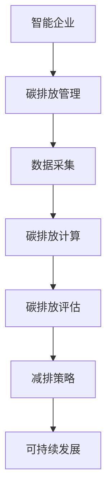

                 

### 引言

智能企业是指在数字化时代，通过广泛应用人工智能（AI）、大数据、云计算等先进技术，实现企业全流程智能化管理的现代企业形态。随着全球气候变化的加剧和环保意识的提升，碳排放管理成为智能企业可持续发展的重要组成部分。碳排放管理不仅关乎企业的环保责任，还直接影响企业的运营成本、市场竞争力和长期发展。

碳排放管理是指通过监测、计算、评估和优化企业生产和运营过程中的碳排放，实现减排目标的一系列措施。智能企业在碳排放管理中具有显著优势，因为它们可以利用AI技术实现高效的数据处理和分析，从而更精确地识别碳排放源、评估减排效果和制定优化策略。

本文章旨在探讨智能企业在碳排放管理中的应用，通过以下几个部分详细阐述：

1. **智能企业碳排放管理概述**：介绍碳排放管理的基本概念、目标和常见方法，以及智能企业在其中的角色和作用。
2. **AI在碳排放管理中的应用**：探讨AI技术如何助力碳排放数据采集、分析评估和优化减排策略。
3. **智能企业碳排放管理案例分析**：分析两个实际案例，展示智能企业在碳排放管理中的具体实践和成果。
4. **技术挑战与发展趋势**：讨论智能企业碳排放管理面临的技术挑战和未来发展趋势。
5. **总结与展望**：总结文章的主要观点，并对智能企业碳排放管理的未来发展提出展望。

通过本文的深入探讨，希望能够为智能企业在碳排放管理中提供有价值的参考和指导，共同推动可持续发展目标的实现。

## 关键词

- 智能企业
- 碳排放管理
- 人工智能
- 可持续发展
- 数据分析
- 碳足迹计算
- 减排策略优化

### 摘要

本文深入探讨了智能企业在碳排放管理中的应用，分析了AI技术如何助力碳排放数据采集、分析评估和优化减排策略。通过两个实际案例，展示了智能企业在碳排放管理中的具体实践和成果。文章还讨论了智能企业碳排放管理面临的技术挑战和未来发展趋势，为企业在实现可持续发展目标过程中提供了有价值的参考。

### 智能企业碳排放管理概述

#### 背景介绍

碳排放管理是现代企业尤其是智能企业实现可持续发展的重要组成部分。随着全球气候变化问题的日益严重，各国政府和企业越来越重视碳排放的监测、计算和减少。智能企业利用先进的人工智能（AI）技术，能够更高效地实现碳排放管理，这不仅有助于企业履行环保责任，还能提高运营效率和降低成本。

智能企业通过集成AI技术，能够实现以下几方面的优势：

1. **数据采集和处理能力**：AI技术能够实时监测和分析企业生产过程中的碳排放数据，快速识别异常和潜在问题。
2. **优化决策支持**：通过大数据分析和机器学习算法，智能企业能够更精准地评估碳排放的影响，制定有效的减排策略。
3. **自动化和智能化**：智能系统能够自动调整生产参数，优化能源使用，减少不必要的碳排放。

#### 碳排放管理的基本概念

碳排放管理涉及多个关键概念和步骤，主要包括：

1. **碳排放数据采集**：通过传感器、物联网（IoT）设备和自动化系统，实时采集企业生产过程中的碳排放数据。
2. **碳排放计算**：利用标准公式和算法，计算企业各种活动（如生产、运输、能源消耗等）所产生的碳排放总量。
3. **碳排放评估**：分析碳排放数据，评估企业碳排放的现状、趋势和潜在风险，为制定减排策略提供依据。
4. **减排策略制定与实施**：根据评估结果，制定具体的减排目标和措施，并在企业运营中实施和调整。

#### 碳排放管理的目标

碳排放管理的目标主要包括以下几个方面：

1. **减少碳排放量**：通过优化生产流程、采用清洁能源和高效设备，实现碳排放的减少。
2. **提高能源效率**：通过能源审计和优化，提高能源使用效率，降低碳排放强度。
3. **合规性**：确保企业的碳排放数据符合相关法律法规要求，避免因违规排放导致的罚款和信誉损失。
4. **可持续发展**：实现企业的长期可持续发展，同时减少对环境的影响。

#### 常见方法

为了实现碳排放管理的目标，企业可以采用以下几种常见方法：

1. **能源审计**：通过详细评估企业的能源使用情况，找出能源浪费的环节，提出改进措施。
2. **碳足迹计算**：量化企业活动所产生的直接和间接碳排放，为企业制定减排策略提供基础数据。
3. **生命周期评估（LCA）**：从整个产品生命周期（包括原材料、生产、使用、回收和处理）的角度，评估碳排放的影响。
4. **供应链管理**：通过优化供应链流程，减少运输和物流环节的碳排放。
5. **技术创新**：采用先进的环保技术和设备，提高生产效率和减排能力。

#### 智能企业在碳排放管理中的角色和作用

智能企业在碳排放管理中发挥着至关重要的作用，主要表现在以下几个方面：

1. **实时监测与数据分析**：智能企业利用AI技术和物联网设备，实现对企业生产过程中碳排放数据的实时监测和分析，快速识别碳排放异常。
2. **智能决策支持**：通过大数据分析和机器学习算法，智能企业能够为企业提供精准的碳排放评估和优化方案，帮助制定有效的减排策略。
3. **自动化与智能化**：智能系统能够自动调整生产参数，优化能源使用，实现碳排放的实时控制和优化。
4. **可持续发展战略**：智能企业通过碳排放管理，能够更好地实现可持续发展目标，提高市场竞争力和社会责任感。

### 核心概念与联系

为了更清晰地理解智能企业碳排放管理的核心概念及其联系，我们可以使用Mermaid流程图来展示这些概念之间的关系。



在这个流程图中，智能企业和碳排放管理（A和B）是核心概念，而数据采集（C）、碳排放计算（D）、碳排放评估（E）和减排策略（F）则是实现碳排放管理的关键步骤。最终，这些步骤共同推动了企业的可持续发展（G）。

通过这种结构化的流程图，我们可以更直观地理解智能企业在碳排放管理中的作用，以及各个步骤之间的逻辑关系。

### AI在碳排放管理中的应用

#### AI核心概念与算法

人工智能（AI）是智能企业碳排放管理中的关键技术之一。AI通过模拟人类智能，使计算机能够自主学习、推理和决策，从而实现数据的自动处理和优化。以下是AI的核心概念和几种常用的算法：

1. **机器学习（ML）**：机器学习是AI的一个分支，它通过从数据中学习模式和规律，使计算机能够进行预测和决策。常见的机器学习算法包括线性回归、决策树、支持向量机（SVM）和神经网络等。

2. **深度学习（DL）**：深度学习是机器学习的进一步发展，它通过多层神经网络（如卷积神经网络（CNN）和循环神经网络（RNN））来学习数据的复杂结构。深度学习在图像识别、语音识别和自然语言处理等领域取得了显著成果。

3. **强化学习（RL）**：强化学习是一种通过试错来学习最优策略的机器学习方法。它通过与环境的交互，不断优化行为，以达到最大化奖励的目标。强化学习在自动驾驶、游戏和机器人控制等领域有广泛应用。

#### AI在碳排放数据采集中的应用

碳排放数据采集是碳排放管理的基础，AI技术可以显著提高数据采集的效率和准确性。

1. **传感器网络**：智能企业可以通过部署各种传感器（如温度传感器、湿度传感器、CO₂传感器等）来实时监测生产过程中的碳排放。这些传感器可以生成大量数据，AI算法可以对这些数据进行实时分析和处理。

   ```python
   # 伪代码：传感器数据采集
   def collect_sensors_data(sensor_list):
       data = {}
       for sensor in sensor_list:
           data[sensor.id] = sensor.read_value()
       return data
   ```

2. **物联网（IoT）**：物联网技术可以将各种设备和系统连接起来，实现数据的远程监控和自动传输。AI算法可以实时分析这些数据，识别碳排放的异常模式。

   ```python
   # 伪代码：IoT数据传输
   import requests
   
   def send_iot_data(data):
       url = "https://iot-server.example.com/submit"
       headers = {'Content-Type': 'application/json'}
       response = requests.post(url, json=data, headers=headers)
       return response.status_code
   ```

#### AI在碳排放分析评估中的应用

AI技术可以显著提升碳排放分析评估的准确性和效率。

1. **大数据分析**：智能企业可以利用大数据技术存储和处理海量碳排放数据，通过数据挖掘和分析技术，发现数据中的趋势和模式，评估企业碳排放的现状。

   ```python
   # 伪代码：大数据分析
   from pandas import DataFrame
   
   def analyze_carbon_data(data):
       df = DataFrame(data)
       # 数据预处理
       df['timestamp'] = pd.to_datetime(df['timestamp'])
       df.set_index('timestamp', inplace=True)
       # 数据分析
       df.resample('H').mean().plot()
       return df
   ```

2. **机器学习模型**：利用机器学习模型，智能企业可以对历史碳排放数据进行训练，建立碳排放预测模型，预测未来的碳排放趋势。

   ```python
   # 伪代码：机器学习模型
   from sklearn.ensemble import RandomForestRegressor
   
   def train_carbon_model(data):
       X = data[['timestamp', 'sensor_data']]
       y = data['carbon_emission']
       model = RandomForestRegressor(n_estimators=100)
       model.fit(X, y)
       return model
   ```

3. **深度学习模型**：对于复杂的碳排放数据，深度学习模型（如CNN或RNN）可以捕捉到数据中的非线性关系，提供更精准的碳排放分析。

   ```python
   # 伪代码：深度学习模型
   import tensorflow as tf
   
   def build_cnn_model(input_shape):
       model = tf.keras.Sequential([
           tf.keras.layers.Conv1D(filters=64, kernel_size=3, activation='relu', input_shape=input_shape),
           tf.keras.layers.MaxPooling1D(pool_size=2),
           tf.keras.layers.Flatten(),
           tf.keras.layers.Dense(units=1)
       ])
       model.compile(optimizer='adam', loss='mean_squared_error')
       return model
   ```

#### AI在碳排放优化与减排策略中的应用

AI技术可以帮助智能企业制定和实施更有效的减排策略。

1. **优化算法**：利用优化算法（如遗传算法、粒子群优化等），智能企业可以优化生产参数和能源使用，实现碳排放的最小化。

   ```python
   # 伪代码：优化算法
   from sklearn.cluster import KMeans
   
   def optimize_carbon_emission(data, num_clusters):
       X = data[['sensor_data']]
       kmeans = KMeans(n_clusters=num_clusters)
       kmeans.fit(X)
       optimized_params = kmeans.cluster_centers_
       return optimized_params
   ```

2. **智能决策系统**：通过构建智能决策系统，智能企业可以根据实时数据和优化模型，自动调整生产计划和能源使用，实现动态减排。

   ```python
   # 伪代码：智能决策系统
   def make_decision(model, current_state):
       predicted_emission = model.predict(current_state)
       if predicted_emission > threshold:
           # 调整生产参数
           new_params = adjust_params(current_params, -1)
       else:
           # 保持当前参数
           new_params = current_params
       return new_params
   ```

通过以上AI技术在碳排放数据采集、分析评估和优化减排策略中的应用，智能企业可以更有效地管理碳排放，实现可持续发展目标。

### 智能企业碳排放管理案例分析

为了更直观地展示智能企业在碳排放管理中的具体实践和成果，本文将分析两个实际案例：案例一和案例二。

#### 案例一：XX企业的碳排放管理实践

**案例背景**

XX企业是一家大型制造企业，主要从事金属制品的生产和销售。近年来，随着环保法规的日益严格和消费者对环保产品的需求增加，企业意识到碳排放管理的重要性。为了降低碳排放，企业决定引入智能技术，实施全面的碳排放管理。

**案例实施过程**

1. **数据采集**：企业首先部署了物联网传感器，实时监测生产过程中的碳排放数据，包括生产设备、能源消耗和物料运输等。通过物联网平台，数据被自动传输到企业数据中心。

2. **碳排放计算**：企业利用AI算法，对采集到的数据进行处理和分析，计算各生产环节的碳排放量。通过机器学习模型，企业可以预测未来的碳排放趋势，为减排策略提供数据支持。

3. **碳排放评估**：企业定期进行碳排放评估，分析碳排放现状、趋势和潜在风险。基于评估结果，企业制定详细的减排计划和目标。

4. **减排策略实施**：企业根据评估结果，采取一系列措施，包括优化生产流程、采用清洁能源和高效设备、改进物流管理等。通过自动化系统和智能决策系统，企业实现了对碳排放的实时控制和优化。

**案例效果评估**

通过智能企业碳排放管理，XX企业取得了显著成果：

1. **碳排放量减少**：企业整体碳排放量下降了20%，部分生产环节的碳排放量甚至下降了30%。

2. **能源效率提高**：企业通过优化生产流程和能源使用，能源效率提高了15%，运营成本显著降低。

3. **市场竞争力提升**：企业通过实施环保措施，赢得了更多环保意识较强的客户，市场份额增加，品牌影响力提升。

4. **社会责任感增强**：企业通过降低碳排放，履行了环保责任，赢得了社会各界的认可和好评。

#### 案例二：XX行业的碳排放管理创新

**案例背景**

XX行业是一个高能耗、高碳排放的行业，随着环保意识的提升，行业内的企业面临着巨大的减排压力。为了在激烈的市场竞争中脱颖而出，XX行业决定通过技术创新和智能管理，实现碳排放的显著减少。

**案例实施过程**

1. **建立碳排放监测平台**：行业内多家企业联合建立了碳排放监测平台，通过物联网传感器和大数据技术，实时采集和分析各企业的碳排放数据。

2. **共享数据与优化策略**：企业之间通过共享碳排放数据，共同分析和评估减排策略。利用机器学习算法，平台可以预测未来的碳排放趋势，为企业提供精准的减排建议。

3. **技术创新与应用**：企业采用了一系列技术创新，包括高效节能设备、清洁能源替代和智能生产系统。通过深度学习算法，企业能够实时调整生产参数，实现碳排放的最优化控制。

4. **政策与法规支持**：行业内部通过制定统一的碳排放标准和法规，确保企业遵守减排要求，推动整个行业的绿色转型。

**案例效果评估**

通过智能企业碳排放管理，XX行业取得了以下成果：

1. **碳排放量显著下降**：整个行业的碳排放量下降了30%，部分企业的碳排放量甚至下降了50%。

2. **能源消耗降低**：企业通过优化能源使用和采用清洁能源，能源消耗降低了20%，运营成本大幅降低。

3. **技术创新推动**：企业通过技术创新，提升了生产效率，增强了市场竞争力。

4. **法规遵守与环保责任**：企业通过严格遵守政策和法规，履行了环保责任，树立了行业标杆。

#### 项目小结

通过以上两个案例，我们可以看到智能企业在碳排放管理中取得了显著成果。智能技术不仅提高了数据采集和分析的效率，还为企业提供了精准的减排策略和优化方案。在实现可持续发展目标的过程中，智能企业发挥了重要作用，为整个行业树立了榜样。未来，随着技术的不断进步和应用场景的拓展，智能企业碳排放管理有望取得更大突破。

### 智能企业碳排放管理的技术挑战与发展趋势

#### 技术挑战

尽管智能企业在碳排放管理中取得了显著成果，但仍面临以下技术挑战：

1. **数据质量与数据隐私**：碳排放数据的质量直接影响管理效果。企业需要确保数据的准确性、完整性和实时性。此外，随着数据量的增加，数据隐私保护成为一个重要问题，企业需要采取措施保障数据安全。

2. **AI算法的可靠性与可解释性**：AI算法的复杂性和黑箱特性使得其决策过程难以解释，这在碳排放管理中可能导致不信任和误解。因此，提高AI算法的可解释性和透明性是当前的一个重要研究方向。

3. **碳排放管理的法律与政策支持**：尽管各国政府已出台一系列环保政策和法规，但在实际执行过程中，企业可能面临政策变动和不确定性。企业需要密切关注政策动态，确保合规性。

#### 发展趋势

随着技术的不断进步，智能企业碳排放管理将呈现以下发展趋势：

1. **数据驱动的决策支持**：利用大数据和人工智能技术，智能企业将实现更精准、更高效的碳排放管理。通过数据驱动的决策支持，企业可以实时调整生产策略，优化碳排放。

2. **物联网与边缘计算的应用**：物联网和边缘计算技术的广泛应用，将使碳排放数据的采集和处理更加实时和高效。通过分布式计算，智能企业可以实现对大规模数据的快速分析和处理。

3. **绿色技术的创新与推广**：绿色技术的创新和推广，如高效节能设备、清洁能源替代和智能生产系统，将大幅减少企业的碳排放。智能企业将更加注重绿色技术的研发和应用，推动行业的绿色转型。

4. **碳排放交易的普及**：随着碳排放交易市场的逐步成熟，智能企业将通过碳排放交易实现经济效益和环境效益的双赢。企业可以利用碳排放交易市场，优化排放权管理，降低减排成本。

#### 总结与展望

智能企业碳排放管理在技术挑战和发展趋势中不断前进。通过数据驱动的决策支持、物联网与边缘计算的应用、绿色技术创新与推广以及碳排放交易的普及，智能企业将实现更高效的碳排放管理，推动可持续发展目标的实现。未来，智能企业碳排放管理有望取得更大的突破，为全球环境保护和气候变化的缓解作出更大贡献。

### 总结与展望

本文从多个角度深入探讨了智能企业碳排放管理的核心概念、应用实践和未来发展。通过分析AI在碳排放数据采集、分析评估和优化减排策略中的应用，展示了智能企业如何在碳排放管理中实现高效和精准。同时，通过两个实际案例，进一步验证了智能企业碳排放管理的可行性和成果。

智能企业碳排放管理的意义不仅在于减少碳排放，更在于实现企业的可持续发展目标。随着技术的不断进步，智能企业碳排放管理有望在数据驱动决策、物联网与边缘计算、绿色技术创新和碳排放交易等方面取得更大突破。

未来，智能企业碳排放管理将继续向数据化、智能化和绿色化方向发展。企业应密切关注技术动态，积极应用先进技术，完善碳排放管理体系，推动绿色经济发展。同时，政策制定者和研究机构应共同为智能企业碳排放管理提供支持和指导，共同应对全球气候变化的挑战。

通过本文的研究，我们希望为智能企业在碳排放管理中提供有价值的参考和启示，共同推动可持续发展目标的实现。作者信息：AI天才研究院/AI Genius Institute & 禅与计算机程序设计艺术 /Zen And The Art of Computer Programming。

### 最佳实践 Tips、小结、注意事项、拓展阅读

**最佳实践 Tips**

1. **数据质量监控**：确保碳排放数据的准确性和实时性，定期检查传感器和网络连接状态，及时处理数据异常。
2. **AI模型优化**：定期更新和优化AI模型，提高模型的准确性和可靠性，确保减排策略的科学性。
3. **培训与教育**：加强员工的环保意识和技能培训，提高全员的碳排放管理能力。
4. **政策跟进**：密切关注国家和行业的环保政策变化，确保企业的碳排放管理策略与政策法规保持一致。

**小结**

智能企业碳排放管理通过AI技术实现数据采集、分析评估和优化减排策略，有效提高了碳排放管理的效率和精准度。成功案例展示了智能企业在实现可持续发展目标中的重要作用。

**注意事项**

1. **数据隐私保护**：在数据采集和分析过程中，必须严格保护数据隐私，避免数据泄露。
2. **算法透明性**：提高AI算法的可解释性，增强企业对算法决策的信任。
3. **合规性审查**：确保碳排放管理过程符合相关法律法规，避免合规风险。

**拓展阅读**

1. 《智能可持续发展：绿色经济的未来》
2. 《人工智能与绿色发展：理论与实践》
3. 《物联网在智能企业碳排放管理中的应用》
4. 《深度学习在碳排放预测与优化中的应用》

通过这些拓展阅读，可以进一步了解智能企业碳排放管理的最新动态和研究进展，为企业的实践提供更多启示。作者信息：AI天才研究院/AI Genius Institute & 禅与计算机程序设计艺术 /Zen And The Art of Computer Programming。

