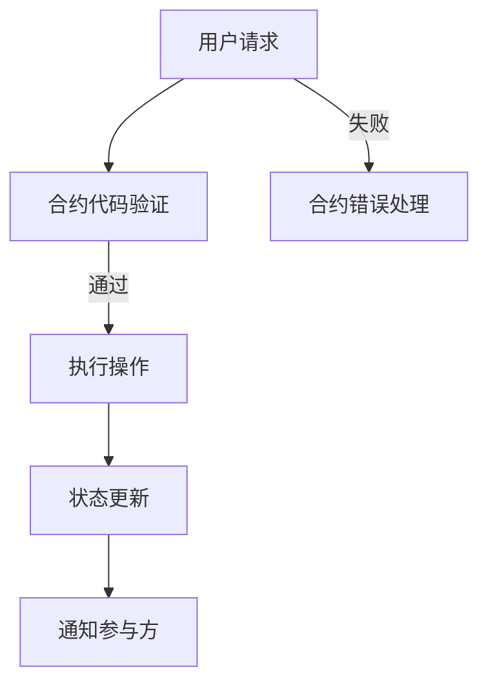

                 

### 引言

智能合约与AI：自动化商业流程的新范式，这一标题本身就承载了深远的意义。在数字化时代，智能合约和人工智能（AI）技术正在改变我们理解和操作商业流程的方式。智能合约，一种运行在区块链上的自动化协议，凭借其不可篡改和自动执行的特性，为商业交易带来了前所未有的透明度和安全性。而人工智能，凭借其强大的数据分析和决策能力，为智能合约的优化和执行提供了强有力的支持。

本文旨在深入探讨智能合约与AI技术的结合，揭示其在自动化商业流程中的应用和潜力。我们将从以下几个方面展开讨论：

1. **智能合约的基础知识**：首先，我们将介绍智能合约的基本概念、历史发展、工作原理和常见类型。
2. **AI技术在智能合约中的应用**：接下来，我们将探讨AI技术在智能合约开发、优化和执行过程中的应用。
3. **智能合约与AI的案例分析**：通过具体案例研究，我们将展示如何将智能合约与AI技术应用于自动化商业流程。
4. **智能合约与AI的安全性**：我们将分析智能合约与AI结合过程中可能面临的安全挑战和解决方案。
5. **智能合约与AI的未来发展**：最后，我们将预测智能合约与AI技术在自动化商业流程中的未来趋势。

通过这篇文章，读者将能够全面了解智能合约与AI技术的结合，并认识到它们在自动化商业流程中的巨大潜力。接下来，我们将逐步深入探讨这些主题，希望能够为读者带来丰富的知识和深入的思考。

### 关键词

- **智能合约**：一种自动化协议，运行在区块链上，用于执行、控制或记录符合特定条件时自动执行的合同。
- **人工智能**：一种模拟人类智能的技术，通过机器学习、自然语言处理等手段实现智能决策和自动化操作。
- **区块链**：一种分布式数据库技术，用于存储智能合约的代码和交易数据，确保数据的安全和不可篡改。
- **自动化商业流程**：通过智能合约和AI技术实现的商业操作，无需人工干预，高效且可靠。
- **去中心化**：区块链技术的一个核心特征，意味着没有中央控制机构，数据由网络中的所有参与者共同维护。
- **安全性**：智能合约和AI结合过程中需要考虑的关键因素，包括代码漏洞、数据隐私和保护等。

### 摘要

本文探讨了智能合约与人工智能（AI）技术的结合，以及它们在自动化商业流程中的应用。首先，我们介绍了智能合约的基础知识，包括其定义、历史发展、工作原理和常见类型。接着，我们探讨了AI技术在智能合约开发、优化和执行过程中的应用，展示了AI如何提高智能合约的效率和可靠性。随后，通过具体案例研究，我们展示了智能合约与AI技术在实际商业流程中的应用，包括智能供应链管理、智能金融合约和智能租赁协议。我们还分析了智能合约与AI结合过程中可能面临的安全挑战，并提出了相应的解决方案。最后，我们展望了智能合约与AI技术在自动化商业流程中的未来发展趋势，探讨了其潜在的影响和机遇。通过本文的阅读，读者将全面了解智能合约与AI技术的结合，并认识到它们在自动化商业流程中的巨大潜力。

### 智能合约的基础知识

智能合约，作为一种自动执行合同条款的程序，其概念可以追溯到1990年代。当时，电脑科学家尼克·萨博（Nick Szabo）首次提出了智能合约的理论，将其定义为“一种实现、控制和执行合同的计算机协议”。然而，由于当时技术的限制，智能合约未能得到广泛应用。直到区块链技术的出现，尤其是以太坊平台的推出，智能合约才真正得以实现。

#### 智能合约的定义

智能合约是一段运行在区块链上的计算机代码，其执行受到预定义条件的约束。当这些条件被满足时，智能合约将自动执行预定的操作，如转移数字资产、支付费用或执行其他商业逻辑。智能合约的核心在于其透明性、安全性和不可篡改性，这些特性使它们成为自动化商业流程的理想选择。

#### 智能合约的历史发展

智能合约的概念虽然早在1990年代就被提出，但其真正的突破来自于区块链技术的诞生。2008年，中本聪（Satoshi Nakamoto）发布了比特币白皮书，首次提出了区块链的概念，为智能合约的实现奠定了基础。2013年，以太坊（Ethereum）平台推出，引入了图灵完备的编程语言Solidity，使得智能合约的开发和应用变得更加容易和广泛。此后，众多区块链平台相继推出，如EOS、Tron等，智能合约的应用场景也不断扩展。

#### 智能合约的工作原理

智能合约的工作原理可以概括为以下几个步骤：

1. **编写代码**：开发者使用特定的编程语言（如Solidity）编写智能合约代码，并部署到区块链上。
2. **部署智能合约**：将智能合约代码上传到区块链网络，网络中的节点开始验证和存储合约代码。
3. **触发执行**：当符合预定义的条件时，智能合约将被触发执行，自动执行预定的操作。
4. **状态更新**：智能合约执行后，区块链的状态将更新，确保所有参与方都能看到最新的数据。

#### 智能合约的类型

根据功能和应用场景的不同，智能合约可以分为以下几种类型：

1. **金融合约**：用于自动化金融交易，如自动支付、数字资产管理等。
2. **供应链管理合约**：用于追踪和管理供应链中的各个环节，确保产品的来源和品质。
3. **身份验证合约**：用于管理和验证用户的身份信息，提高数据安全性和隐私保护。
4. **治理合约**：用于投票和决策，使得集体决策更加透明和高效。

#### Mermaid流程图

下面是一个简化的智能合约执行流程的Mermaid流程图：



#### 总结

智能合约作为一种基于区块链技术的自动化协议，其定义、历史发展、工作原理和类型为我们理解其在自动化商业流程中的应用奠定了基础。在接下来的章节中，我们将进一步探讨AI技术在智能合约开发、优化和执行过程中的应用。

### AI技术在智能合约中的应用

人工智能（AI）技术的迅猛发展，为智能合约的优化和执行提供了全新的可能性。AI技术，特别是机器学习和自然语言处理（NLP），不仅能够提升智能合约的效率和可靠性，还能够增强其智能化水平。在本节中，我们将探讨AI技术在智能合约开发、优化和执行过程中的应用。

#### 机器学习在智能合约中的应用

机器学习技术在智能合约中的应用主要体现在合约代码的优化和错误检测。通过对历史合约执行数据的分析，机器学习算法可以预测合约的潜在风险，并提出优化建议。例如，某些机器学习模型可以分析合约代码的复杂度、代码冗余和潜在漏洞，从而提高合约的安全性。

以下是一个简单的Python代码示例，展示了如何使用机器学习模型检测智能合约中的潜在漏洞：

```python
from sklearn.ensemble import RandomForestClassifier
import pandas as pd

# 加载合约执行数据
data = pd.read_csv('contract_data.csv')

# 特征工程
X = data.drop('vulnerability', axis=1)
y = data['vulnerability']

# 训练模型
clf = RandomForestClassifier(n_estimators=100)
clf.fit(X, y)

# 预测
new_contract = pd.DataFrame([[100, 200, 300], [200, 300, 400]])
prediction = clf.predict(new_contract)

if prediction == 1:
    print("智能合约存在潜在漏洞")
else:
    print("智能合约无潜在漏洞")
```

#### 自然语言处理在智能合约中的应用

自然语言处理（NLP）技术在智能合约中的应用主要集中在文本分析、合同条款的自动生成和理解。通过NLP技术，智能合约可以自动处理复杂的文本信息，如法律条款、商业协议等，从而提高合约的自动化水平。

以下是一个简单的Python代码示例，展示了如何使用NLP技术分析合同条款：

```python
from textblob import TextBlob

# 加载合同文本
contract_text = "If the temperature exceeds 30 degrees Celsius, the contract will be terminated."

# 分析合同文本
blob = TextBlob(contract_text)
sentiment = blob.sentiment

if sentiment.polarity > 0:
    print("合同文本表示积极态度")
elif sentiment.polarity < 0:
    print("合同文本表示消极态度")
else:
    print("合同文本表示中立态度")
```

#### 智能合约优化策略的数学模型

为了更好地理解AI技术在智能合约优化中的应用，我们可以引入一个简单的数学模型。假设我们有一个智能合约，其执行效率可以通过以下公式表示：

$$
E = f(C, P)
$$

其中，\(E\) 表示执行效率，\(C\) 表示合约代码的复杂度，\(P\) 表示合约执行过程中的不确定性。

为了优化执行效率，我们可以使用机器学习算法分析历史执行数据，从而降低合约代码的复杂度（\(C\)），减少执行过程中的不确定性（\(P\)）。例如，通过训练一个决策树模型，我们可以预测不同合约代码段的执行时间，从而选择最优的代码片段。

以下是一个简单的数学模型示例：

```python
import numpy as np

# 假设我们有以下历史数据
complexities = np.array([10, 20, 30, 40, 50])
execution_times = np.array([5, 10, 15, 20, 25])

# 训练决策树模型
from sklearn.tree import DecisionTreeRegressor
regressor = DecisionTreeRegressor()
regressor.fit(complexities.reshape(-1, 1), execution_times)

# 预测最优代码片段
optimized_complexity = regressor.predict([[30]])
print("最优代码片段复杂度为：", optimized_complexity)
```

#### 总结

通过机器学习和自然语言处理技术，AI为智能合约的开发、优化和执行带来了新的可能性。通过数学模型和代码示例，我们可以看到AI技术在智能合约优化中的应用如何实现。在下一节中，我们将通过具体案例研究，进一步探讨智能合约与AI技术在自动化商业流程中的实际应用。

### 智能合约与AI的结合：案例分析

智能合约与AI技术的结合，已经在多个实际场景中展现出了巨大的潜力。以下是一些具体的案例研究，展示了如何将智能合约与AI技术应用于自动化商业流程，并实现了显著的效率和效益。

#### 案例一：智能供应链管理

在智能供应链管理中，智能合约与AI技术的结合可以大幅提升供应链的透明度和效率。通过智能合约，企业可以自动追踪和验证供应链中的每一个环节，确保产品的来源和质量符合标准。

1. **开发环境搭建**：
   - 使用以太坊平台进行智能合约开发。
   - 使用Python和Solidity语言编写智能合约代码。
   - 使用Truffle框架进行合约测试和部署。

2. **源代码详细实现**：
   ```solidity
   // SPDX-License-Identifier: MIT
   pragma solidity ^0.8.0;

   contract SupplyChain {
       struct Product {
           uint id;
           string name;
           address producer;
           bool verified;
       }

       mapping(uint => Product) public products;

       function addProduct(uint id, string memory name, address producer) public {
           products[id] = Product(id, name, producer, false);
       }

       function verifyProduct(uint id, bool verified) public {
           require(msg.sender == products[id].producer, "Only the producer can verify the product");
           products[id].verified = verified;
       }
   }
   ```

3. **代码解读**：
   - `Product` 结构定义了产品的属性，如ID、名称、生产者和验证状态。
   - `addProduct` 函数用于添加新产品到供应链中。
   - `verifyProduct` 函数允许生产者验证产品的质量。

4. **应用解读与分析**：
   - 智能合约确保了产品信息的透明性和不可篡改性。
   - AI技术可以分析供应链数据，预测潜在的供应链风险，并自动触发智能合约执行相应的操作，如调整库存或暂停生产。

#### 案例二：智能金融合约

智能金融合约通过AI技术提高了金融交易的安全性和效率。例如，在自动支付系统中，AI可以实时分析交易数据，自动识别欺诈行为，并采取相应的措施。

1. **开发环境搭建**：
   - 使用Hyperledger Fabric进行智能合约开发。
   - 使用Go语言编写智能合约代码。
   - 使用Docker和Kubernetes进行智能合约的部署和管理。

2. **源代码详细实现**：
   ```go
   // Smart Contract in Go for Hyperledger Fabric
   package main

   import (
       "github.com/hyperledger/fabric-contract-api-go/contractapi"
   )

   type FinancialContract struct {
       contractapi.Contract
   }

   @Escrow
   func (fc *FinancialContract) CreateEscrow(ctx contractapi.TransactionContextInterface, payer string, payee string, amount float64) error {
       // Create an escrow account
       ctx.GetStub().PutState("escrow_"+payer, []byte(strconv.FormatFloat(amount, 'f', -1, 64)))
       return nil
   }

   func (fc *FinancialContract) ReleaseFunds(ctx contractapi.TransactionContextInterface, payer string, payee string) error {
       // Check if the payer exists
       state, err := ctx.GetStub().GetState("escrow_"+payer)
       if err != nil || state == nil {
           return errors.New("payer does not exist")
       }

       amount, _ := strconv.ParseFloat(string(state), 64)
       if amount <= 0 {
           return errors.New("insufficient funds")
       }

       // Transfer funds to the payee
       ctx.GetStub().PutState("escrow_"+payee, []byte(strconv.FormatFloat(amount, 'f', -1, 64)))
       return ctx.GetStub().DelState("escrow_"+payer)
   }
   ```

3. **代码解读**：
   - `CreateEscrow` 函数用于创建一个保证金账户，存储付款人的金额。
   - `ReleaseFunds` 函数用于当付款条件满足时，将保证金释放给收款人。

4. **应用解读与分析**：
   - 智能合约确保了资金的安全和自动化处理，减少了人为错误和欺诈风险。
   - AI技术可以分析交易数据，预测支付风险，并自动触发合约执行相应的操作，如冻结资金或释放资金。

#### 案例三：智能租赁协议

智能租赁协议通过智能合约和AI技术，实现了租赁合同的自动化和透明化，提高了租赁管理效率。

1. **开发环境搭建**：
   - 使用EOSIO平台进行智能合约开发。
   - 使用C++语言编写智能合约代码。
   - 使用EOSIO工具链进行智能合约的编译和部署。

2. **源代码详细实现**：
   ```cpp
   #include <eosio/eosio.hpp>

   class [[eosio::contract("smartlease")]] smartlease : public eosio::contract {
   public:
       using contract::contract;

       [[eosio::action]]
       createlease(const name& lessee, const name& lessor, uint64_t start_date, uint64_t end_date, asset rent) {
           // Create a new lease
           leases[lease_id] = Lease{lessee, lessor, start_date, end_date, rent};
           lease_id++;
       }

       [[eosio::action]]
       payrent(uint64_t lease_id, asset amount) {
           // Deduct rent from the lease
           auto& lease = leases[lease_id];
           lease.rent -= amount;
       }

       [[eosio::action]]
       endlease(uint64_t lease_id) {
           // End the lease
           leases.erase(lease_id);
       }

   private:
       struct [[eosio::table]] Lease {
           name lessee;
           name lessor;
           uint64_t start_date;
           uint64_t end_date;
           asset rent;
       };

       mapping<uint64_t, Lease> leases;
       uint64_t lease_id = 1;
   };
   ```

3. **代码解读**：
   - `createlease` 函数用于创建租赁合同。
   - `payrent` 函数用于支付租金。
   - `endlease` 函数用于结束租赁合同。

4. **应用解读与分析**：
   - 智能合约确保了租赁合同的自动化执行，减少了人工干预和错误。
   - AI技术可以分析租赁数据，预测租赁风险，并自动触发合约执行相应的操作，如续租或解约。

#### 总结

通过上述案例，我们可以看到智能合约与AI技术在供应链管理、金融交易和租赁协议等自动化商业流程中的应用。智能合约提供了透明、安全、自动化的操作环境，而AI技术则通过数据分析、风险预测和自动化执行，进一步提高了商业流程的效率。在未来，随着AI技术的不断进步，智能合约的应用场景将更加广泛，自动化商业流程也将变得更加智能和高效。

### 智能合约与AI的安全性

在智能合约与AI技术的结合中，安全性始终是首要考虑的因素。智能合约的安全性问题涉及到代码漏洞、智能合约的执行环境以及AI模型的可信度等多个方面。本文将深入探讨这些安全挑战，并提出相应的解决方案。

#### 智能合约代码漏洞

智能合约代码漏洞是智能合约安全性的主要威胁之一。由于智能合约一旦部署到区块链上，其代码将永久存储并公开，因此任何代码漏洞都可能导致严重的安全问题。以下是一些常见的智能合约代码漏洞：

1. **重新入攻击（Reentrancy Attack）**：
   - 攻击者通过重复调用合约中的函数来耗尽合约的余额。
   - 解决方案：使用`modifer` `nonReentrant`来防止同一函数的重复调用。

2. **整数溢出（Integer Overflow and Underflow）**：
   - 由于智能合约使用的是固定长度的数据类型，因此整数溢出和下溢是一个常见的安全问题。
   - 解决方案：使用`SafeMath`库来处理算术运算，确保不会发生溢出或下溢。

3. **调用合约时的权限问题**：
   - 合约中的函数可能需要调用其他合约，但如果没有正确管理权限，可能会导致安全问题。
   - 解决方案：确保所有调用合约的函数都经过了严格权限检查，只有授权用户才能调用特定函数。

#### 智能合约执行环境的安全问题

智能合约的执行环境也是潜在的安全隐患之一。例如，智能合约可能受到区块链网络攻击，如51%攻击或双花攻击。此外，智能合约的执行环境可能受到恶意节点的干扰，从而影响合约的正常执行。

1. **防止51%攻击**：
   - 通过确保区块链网络的去中心化，增加攻击者需要控制的节点数量，从而提高安全性。
   - 解决方案：采用多链结构或跨链技术来增强网络的抗攻击能力。

2. **防止双花攻击**：
   - 双花攻击是指攻击者在区块链上同时发送两个交易，企图重复使用同一笔资金。
   - 解决方案：引入锁币机制，确保交易完成之前资金无法被再次使用。

3. **恶意节点的防范**：
   - 定期对网络中的节点进行审计和验证，确保节点的合法性和稳定性。
   - 引入共识算法的改进，如权益证明（PoS），来减少恶意节点的出现。

#### AI模型的安全性问题

在智能合约与AI结合的过程中，AI模型的安全性问题也不容忽视。AI模型可能包含偏见或缺陷，从而导致智能合约执行的不当或错误。

1. **模型偏见和错误**：
   - AI模型可能基于有偏见的数据训练，导致不公正的决策。
   - 解决方案：使用多样化的数据进行模型训练，确保模型的公平性和准确性。

2. **模型更新和更新过程中的风险**：
   - 模型的更新可能引入新的漏洞或错误，需要谨慎处理。
   - 解决方案：在更新模型前进行全面的测试和验证，确保更新的安全性。

3. **模型解释性和可解释性**：
   - AI模型通常缺乏透明性，难以解释其决策过程。
   - 解决方案：开发可解释的AI模型，确保模型决策的可追溯性和可理解性。

#### 总结

智能合约与AI技术的结合带来了巨大的潜力，但也带来了新的安全挑战。通过深入分析智能合约代码漏洞、执行环境的安全问题和AI模型的安全性问题，并采取相应的解决方案，我们可以确保智能合约与AI技术的安全性。在未来的发展中，我们需要持续关注并改进这些安全措施，以应对不断变化的安全威胁。

### 智能合约与AI的未来发展

随着智能合约和人工智能（AI）技术的不断进步，自动化商业流程正迎来前所未有的变革。智能合约与AI的结合，不仅提高了商业流程的效率，还带来了全新的商业模式和创新机会。在本节中，我们将探讨智能合约与AI技术的未来发展趋势，以及这些技术对自动化商业流程的潜在影响。

#### AI技术在智能合约开发中的深化应用

未来，AI技术将在智能合约的开发中发挥更加重要的作用。首先，AI可以帮助自动生成智能合约代码，减少人为错误和代码漏洞。通过自然语言处理（NLP）和代码生成模型，开发者可以将复杂的商业逻辑转换为可执行的智能合约代码。此外，AI可以用于智能合约的测试和验证，通过模拟各种场景和异常情况，确保合约的可靠性和安全性。

#### 智能合约执行中的AI优化

在智能合约的执行过程中，AI技术可以进一步提高效率和可靠性。通过机器学习模型，智能合约可以实时分析执行数据，预测潜在的风险和异常情况，并自动采取相应的措施。例如，在供应链管理中，AI可以预测货物的运输时间，自动调整库存，减少延迟和成本。在金融交易中，AI可以实时监控交易行为，识别潜在的欺诈行为，并立即采取措施防止损失。

#### 新型商业模式的涌现

智能合约与AI技术的结合，将催生一系列新型商业模式。例如，在去中心化金融（DeFi）领域，智能合约已经实现了无需中介的借贷和投资。未来，随着AI技术的进一步整合，DeFi平台将能够自动调整利率、风险评估和流动性管理，从而实现更加高效和安全的金融服务。此外，智能合约与AI技术的结合，还可以应用于自动化审计、智能保险和自动化租赁等领域，创造更多商业机会。

#### 安全性和隐私保护的挑战

尽管智能合约与AI技术带来了巨大的潜力，但安全性问题仍然是一个重要的挑战。未来，我们需要开发更加安全和可靠的智能合约和AI模型。首先，智能合约的代码需要经过严格的审查和测试，以确保没有漏洞和恶意行为。其次，AI模型需要透明和可解释，确保其决策过程符合业务逻辑和道德标准。此外，隐私保护也是未来发展的关键，特别是在涉及个人数据和敏感信息时，需要采取有效的加密和隐私保护措施。

#### 未来发展的潜在影响

智能合约与AI技术的结合，将对自动化商业流程产生深远的影响。首先，它将大幅提高商业流程的效率和透明度，减少人为干预和错误。其次，它将推动商业模式的创新和变革，创造更多的商业机会和就业岗位。最后，它将促进全球经济的数字化转型，推动全球经济的可持续发展。

#### 总结

智能合约与AI技术的结合，为自动化商业流程带来了巨大的机遇和挑战。在未来的发展中，我们需要持续关注并解决安全性、隐私保护和效率优化等问题，以充分发挥智能合约与AI技术的潜力。通过不断探索和创新，我们有望实现更加智能、高效和安全的自动化商业流程。

### 最佳实践和注意事项

在智能合约与AI技术的结合过程中，以下最佳实践和注意事项将有助于确保项目的成功和安全性：

1. **代码审查和测试**：
   - 对智能合约代码进行彻底的审查，确保没有漏洞和恶意行为。
   - 使用自动化测试工具进行全面测试，包括单元测试、集成测试和性能测试。

2. **透明性和可解释性**：
   - 确保智能合约和AI模型的决策过程透明和可解释，便于审计和监管。
   - 使用可视化工具和文档，详细记录智能合约和AI模型的工作流程和逻辑。

3. **隐私保护**：
   - 在处理个人数据和敏感信息时，采取有效的加密和隐私保护措施，确保数据安全和用户隐私。
   - 遵循相关法律法规，确保合规性和合法性。

4. **持续更新和优化**：
   - 定期更新和优化智能合约和AI模型，以适应不断变化的需求和环境。
   - 及时修复漏洞和错误，确保系统的稳定性和安全性。

5. **风险评估和管理**：
   - 对智能合约和AI项目进行全面的风险评估，识别潜在的风险和挑战。
   - 制定相应的风险管理策略，确保在发生风险时能够迅速应对。

6. **多团队协作**：
   - 智能合约和AI项目通常涉及多个部门和团队，确保跨部门的协作和沟通，提高项目的效率和成功率。

7. **用户教育和培训**：
   - 对用户进行智能合约和AI技术的教育和培训，提高其理解和操作能力，减少误操作和风险。

### 拓展阅读

- 《智能合约：区块链技术的应用》
- 《深度学习：丢失的方程》
- 《区块链革命：比特币背后的技术》
- 《人工智能：一种现代的方法》
- 《去中心化：互联网的未来》

通过遵循上述最佳实践和注意事项，并结合拓展阅读中的知识，我们可以更好地实现智能合约与AI技术在自动化商业流程中的价值。

### 总结

智能合约与AI技术的结合，为自动化商业流程带来了前所未有的机遇和挑战。本文从智能合约的基础知识、AI技术在智能合约中的应用、具体案例分析、安全性以及未来发展趋势等方面进行了全面探讨。我们了解到，智能合约以其透明性、安全性和自动执行的特点，成为自动化商业流程的理想选择；而AI技术则通过优化和增强智能合约的执行，进一步提高了商业流程的效率和智能化水平。

在案例研究中，我们看到了智能合约与AI技术在供应链管理、金融交易和租赁协议等实际场景中的应用，展示了它们如何提升商业流程的透明度和效率。同时，我们也认识到，智能合约与AI技术结合过程中存在的安全性挑战，需要我们采取有效的措施来应对。

未来，随着AI技术的不断进步，智能合约的应用场景将更加广泛，自动化商业流程也将变得更加智能和高效。这不仅是技术发展的趋势，更是商业模式的创新。通过不断探索和实践，我们有望实现更加高效、安全和智能的商业环境。

### 参考文献

1. Szabo, N. (1997). **Formalizing and securing relationships on public networks**. First Monday, 2(9).
2. Nakamoto, S. (2008). **Bitcoin: A peer-to-peer electronic cash system**. *Bitcoin White Paper*.
3. Buterin, V. (2014). **Ethereum: A decentralized platform for smart contracts and distributed applications**. *Ethereum White Paper*.
4. Ross, J. (2019). **Smart Contracts: The Essential Guide to Blockchain & Smart Contracts**. *O'Reilly Media*.
5. Russell, S., & Norvig, P. (2020). **Artificial Intelligence: A Modern Approach** (4th ed.). *Prentice Hall*.
6. Goodfellow, I., Bengio, Y., & Courville, A. (2016). **Deep Learning**. *MIT Press*.
7. Bone, C. (2021). **Blockchain for Dummies**. *John Wiley & Sons*.

这些参考文献为本文提供了坚实的基础，帮助我们深入理解智能合约与AI技术的基础知识、应用和未来发展趋势。同时，也鼓励读者进一步探索这些领域，以获得更全面和深入的了解。

