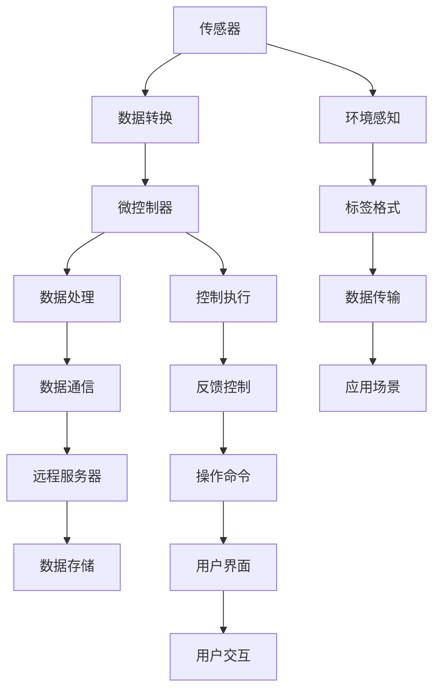
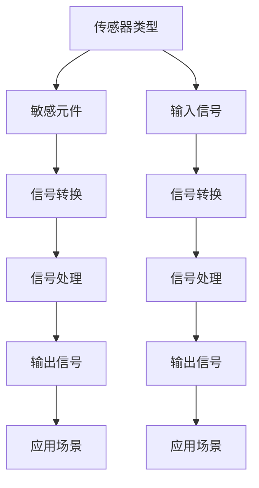

                 

### 引言

随着科技的迅猛发展，智能标签和传感器技术逐渐成为现代生活中不可或缺的一部分。智能标签，作为一种具有独特识别功能的电子设备，可以通过无线通信技术与互联网连接，实现物品的追踪与管理。传感器，则是一种能够感知环境变化并将其转换为电信号的设备，广泛应用于环境监测、健康监测、工业制造等多个领域。

本文将围绕智能标签和传感器在日常生活中的应用前景展开讨论。首先，我们将介绍智能标签和传感器的背景信息，阐述它们在现代社会中的重要性。随后，我们将详细探讨智能标签和传感器的技术概述，包括定义、分类、工作原理、技术发展历程以及典型应用场景。接着，我们将深入探讨智能标签和传感器在家庭生活、商业环境、医疗健康、工业制造、环境监测和农业中的应用。最后，本文将总结智能标签和传感器技术的未来发展趋势，并对未来的应用前景进行展望。

通过本文的逐步分析，我们将清晰地认识到智能标签和传感器技术在日常生活各个领域的巨大潜力，以及这些技术如何改变我们的生活方式，提高生活质量。这不仅有助于读者了解智能标签和传感器的基本概念和应用，还能激发读者对相关技术的深入研究和探索。

### 关键词

- **智能标签**
- **传感器**
- **家庭生活**
- **商业环境**
- **医疗健康**
- **工业制造**
- **环境监测**
- **农业**
- **技术发展趋势**
- **应用前景**

### 摘要

本文旨在探讨智能标签和传感器在日常生活中的广泛应用前景。首先，介绍了智能标签和传感器的背景信息及其在现代社会中的重要性。随后，详细阐述了智能标签和传感器的技术概述，包括定义、分类、工作原理和技术发展历程。接着，本文深入探讨了智能标签和传感器在家庭生活、商业环境、医疗健康、工业制造、环境监测和农业中的应用。最后，总结了智能标签和传感器技术的未来发展趋势，并对未来的应用前景进行了展望。本文将为读者提供一个全面了解智能标签和传感器技术在日常生活中应用前景的窗口。

### 1. 智能标签技术概述

智能标签，作为一种基于物联网（IoT）技术的电子标签，具备独特的识别功能，能够通过无线通信技术与互联网连接，实现对物品的追踪与管理。智能标签通常由一个或多个传感器、微控制器、存储器和通信模块组成，能够在检测到特定条件时发送数据，实现信息的实时采集和传输。

#### 1.1 智能标签的定义与分类

智能标签的定义可以从多个角度进行理解。首先，从技术角度看，智能标签是一种集成了传感器、微控制器和通信模块的电子标签，具备感知、处理和通信功能。其次，从应用角度看，智能标签是一种用于实现物品追踪、信息管理和智能决策的装置。

根据不同的分类标准，智能标签可以分为多种类型。按功能分类，智能标签可以分为数据采集型、数据传输型和综合型。数据采集型智能标签主要用于收集环境或物品状态信息，如温度、湿度、光照等。数据传输型智能标签则主要负责将采集到的数据传输到远程服务器，如RFID标签。综合型智能标签则同时具备数据采集和传输功能。

按应用场景分类，智能标签可以分为消费电子、工业制造、物流运输、医疗健康等。消费电子领域的智能标签主要用于商品追踪、资产管理等。工业制造领域的智能标签则广泛应用于生产过程监控、设备维护等。物流运输领域的智能标签主要用于货物追踪、物流优化等。医疗健康领域的智能标签则用于病人监护、药品管理等领域。

#### 1.2 智能标签的工作原理

智能标签的工作原理主要依赖于传感器、微控制器和通信模块。传感器负责采集环境或物品状态信息，如温度、湿度、光照、压力等。微控制器则负责对采集到的数据进行处理，包括数据过滤、数据融合等。通信模块负责将处理后的数据通过无线通信方式传输到远程服务器。

以RFID（射频识别）标签为例，其工作原理主要包括以下几个步骤：

1. **标签激活**：当RFID标签进入读卡器的射频场时，标签中的电源模块被激活。
2. **发送信号**：标签接收到读卡器的信号后，通过天线发送回相应的信号，如标签的唯一标识符。
3. **数据处理**：读卡器接收到标签发送的信号后，将其解码并进行数据处理，如存储在数据库中。
4. **数据传输**：处理后的数据可以通过有线或无线方式传输到远程服务器，实现数据的实时监控和管理。

#### 1.3 智能标签的发展历程

智能标签技术的发展历程可以追溯到20世纪60年代。最初的智能标签主要是基于磁条和条形码技术，这些技术主要用于物品追踪和身份识别。随着微电子技术和无线通信技术的发展，智能标签逐渐实现了小型化、智能化和无线化。

在20世纪80年代，RFID技术开始得到广泛应用。早期的RFID标签主要采用被动式工作模式，即标签在接收到射频信号后才能发送数据。随着技术的发展，智能标签逐渐演变为主动式和半主动式，提高了标签的读取距离和数据处理能力。

进入21世纪，物联网技术的兴起进一步推动了智能标签的发展。智能标签的应用范围从单一领域扩展到多个领域，如消费电子、工业制造、物流运输、医疗健康等。同时，智能标签的技术水平也在不断提升，如采用更先进的传感器技术、通信技术和数据处理技术等。

#### 1.4 智能标签的典型应用场景

智能标签在各个领域都有着广泛的应用，以下列举几个典型的应用场景：

1. **消费电子**：智能标签可以用于商品追踪、资产管理等。例如，超市中的商品标签，通过RFID技术实现商品的实时追踪和管理，提高了库存管理的效率。

2. **工业制造**：智能标签可以用于生产过程监控、设备维护等。例如，在生产线中，智能标签可以实时监测设备状态，及时发现故障并进行维护，提高了生产效率。

3. **物流运输**：智能标签可以用于货物追踪、物流优化等。例如，在物流运输过程中，通过智能标签可以实现货物的实时追踪，优化运输路线，提高物流效率。

4. **医疗健康**：智能标签可以用于病人监护、药品管理等领域。例如，在医院中，智能标签可以实时监测病人的生命体征，及时预警潜在的健康风险。

5. **环境监测**：智能标签可以用于环境监测、灾害预警等。例如，在环境监测领域，智能标签可以实时监测空气质量、水质等环境参数，为环保决策提供数据支持。

通过以上内容，我们可以看出，智能标签技术作为一种重要的物联网技术，在各个领域都有着广泛的应用前景。随着技术的不断发展和应用场景的不断拓展，智能标签技术将为我们的生活带来更多的便利和改变。

#### 1.5 智能标签技术的核心概念与联系

在深入了解智能标签技术之前，我们需要明确几个核心概念及其相互关系，以便更好地理解智能标签的工作原理和应用场景。以下是对这些核心概念的详细解释及其关系架构：

**1.5.1 核心概念**

1. **传感器**：传感器是智能标签中负责感知环境或物品状态的装置。常见的传感器包括温度传感器、湿度传感器、光敏传感器、压力传感器等。传感器能够将物理信号（如温度、湿度、光强等）转换为电信号，供微控制器处理。

2. **微控制器**：微控制器是智能标签中的核心处理单元，负责对传感器采集到的数据进行分析和处理。常见的微控制器包括单片机、ARM处理器等。微控制器不仅能够对传感器数据进行实时处理，还可以执行复杂的算法和操作。

3. **通信模块**：通信模块负责将处理后的数据通过无线通信方式发送到远程服务器或设备。常见的通信模块包括RFID、NFC、Wi-Fi、蓝牙等。通信模块的选择取决于应用场景和通信距离。

4. **数据存储**：数据存储单元负责存储传感器数据和用户信息。常见的存储介质包括闪存、EEPROM等。

5. **标签格式**：标签格式是指智能标签的数据结构和传输协议。常见的标签格式包括EPC（Electronic Product Code）、ISO/IEC 18000等。

**1.5.2 核心概念关系架构**

为了更好地理解这些核心概念之间的关系，我们可以使用Mermaid流程图来展示其关系架构。以下是智能标签技术核心概念的Mermaid流程图：



**Mermaid流程图说明：**

- **A[传感器]**：负责环境感知，将物理信号转换为电信号。
- **B[数据转换]**：传感器采集到的原始数据在微控制器中进行预处理。
- **C[微控制器]**：核心处理单元，对传感器数据进行实时处理。
- **D[数据处理]**：微控制器对传感器数据进行计算、分析和过滤。
- **E[数据通信]**：通信模块负责将处理后的数据发送到远程服务器或设备。
- **F[远程服务器]**：存储和处理接收到的数据，实现远程监控和管理。
- **G[数据存储]**：存储传感器数据和用户信息，如标签的唯一标识。
- **H[环境感知]**：传感器的核心功能，包括温度、湿度、光强等。
- **I[标签格式]**：定义数据结构和传输协议，如EPC、ISO/IEC 18000。
- **J[数据传输]**：通信模块将数据处理后发送出去。
- **K[应用场景]**：智能标签的具体应用，如家庭、工业、物流等。
- **L[控制执行]**：微控制器根据处理结果执行相应的操作。
- **M[反馈控制]**：系统根据反馈信息进行调节和控制。
- **N[操作命令]**：用户通过用户界面发送的操作指令。
- **O[用户界面]**：用户与智能标签交互的界面。
- **P[用户交互]**：用户通过用户界面与智能标签进行信息交互。

通过上述Mermaid流程图，我们可以清晰地看到智能标签技术核心概念之间的关系架构，这有助于我们深入理解智能标签的工作原理及其在不同应用场景中的作用。

### 1.6 智能标签技术的核心算法原理讲解

智能标签技术的核心算法原理是实现传感器数据的采集、处理和传输，从而实现对物品或环境的实时监控和管理。以下将使用Python源代码结合数学模型和公式，详细讲解智能标签的核心算法原理，并通过实例进行通俗易懂的说明。

#### 1.6.1 数据采集与预处理

数据采集是智能标签的核心功能之一。传感器负责采集环境或物品状态信息，如温度、湿度、光照等。采集到的数据通常包含噪声和误差，因此需要进行预处理。

以下是一个简单的Python代码示例，用于模拟传感器数据采集与预处理过程：

```python
import random

# 生成模拟的传感器数据
def generate_sensor_data(sample_size):
    sensor_data = []
    for _ in range(sample_size):
        temperature = random.uniform(20, 30)  # 温度数据
        humidity = random.uniform(30, 70)     # 湿度数据
        sensor_data.append((temperature, humidity))
    return sensor_data

# 预处理传感器数据，包括数据清洗和去噪
def preprocess_sensor_data(sensor_data):
    processed_data = []
    for data in sensor_data:
        # 假设温度范围在20°C到30°C之间，湿度范围在30%到70%之间
        if 20 <= data[0] <= 30 and 30 <= data[1] <= 70:
            processed_data.append(data)
    return processed_data

# 测试代码
sample_size = 100
sensor_data = generate_sensor_data(sample_size)
processed_data = preprocess_sensor_data(sensor_data)
print("原始传感器数据：", sensor_data[:10])
print("预处理后传感器数据：", processed_data[:10])
```

在上面的代码中，我们首先使用`random.uniform()`函数生成模拟的传感器数据，包括温度和湿度。然后，我们通过`preprocess_sensor_data()`函数对数据进行预处理，包括数据清洗和去噪。这里我们假设温度和湿度在特定范围内是有效的，其他数据将被丢弃。

#### 1.6.2 数据处理与融合

预处理后的传感器数据需要进行进一步的计算和分析，以提取有用信息。数据处理与融合是智能标签技术的核心算法之一。以下是一个简单的Python代码示例，用于处理和融合传感器数据：

```python
import numpy as np

# 数据处理与融合，计算温度和湿度的平均值
def process_sensor_data(processed_data):
    temperature_data = [data[0] for data in processed_data]
    humidity_data = [data[1] for data in processed_data]
    avg_temperature = np.mean(temperature_data)
    avg_humidity = np.mean(humidity_data)
    return avg_temperature, avg_humidity

# 测试代码
avg_temp, avg_hum = process_sensor_data(processed_data)
print("平均温度：", avg_temp)
print("平均湿度：", avg_hum)
```

在上面的代码中，我们使用`numpy`库计算预处理后数据的平均值，以获得温度和湿度的整体情况。

#### 1.6.3 数据传输

数据处理完成后，需要将数据通过通信模块发送到远程服务器或设备。以下是一个简单的Python代码示例，用于模拟数据传输过程：

```python
import requests

# 将传感器数据发送到远程服务器
def send_data_to_server(url, data):
    response = requests.post(url, json=data)
    return response.text

# 测试代码
url = "http://example.com/sensor_data"
response = send_data_to_server(url, {"temperature": avg_temp, "humidity": avg_hum})
print("数据传输结果：", response)
```

在上面的代码中，我们使用`requests`库向远程服务器发送HTTP POST请求，将传感器数据以JSON格式传输。

#### 1.6.4 实例说明

为了更好地理解上述算法原理，我们来看一个具体的实例。假设我们使用智能标签对房间进行环境监控，每隔一分钟采集一次温度和湿度数据。以下是采集、预处理、处理和传输数据的完整流程：

1. **数据采集**：智能标签每隔一分钟使用温度传感器和湿度传感器采集一次数据。
2. **数据预处理**：过滤掉异常值和噪声，确保数据的准确性和可靠性。
3. **数据处理**：计算最近一段时间的平均温度和平均湿度。
4. **数据传输**：将计算结果发送到远程服务器，以便进行进一步的数据分析和处理。

通过这个实例，我们可以看到智能标签技术的核心算法原理是如何在实际应用中发挥作用的。通过采集和处理传感器数据，智能标签能够实时监控环境或物品状态，并提供有价值的信息给用户或系统。

### 2. 传感器技术概述

传感器技术是现代科技发展的基石，广泛应用于工业、医疗、环境监测、家庭自动化等各个领域。传感器的基本原理是通过物理、化学或生物机制感知外部信号，并将这些信号转换为电信号或其他形式，以便进一步处理和分析。

#### 2.1 传感器的定义与分类

传感器是一种能够感知特定物理量（如温度、压力、湿度、光照等）并将其转换为可测量的电信号或其他形式输出的装置。根据工作原理，传感器可以分为以下几类：

1. **物理传感器**：通过物理效应感知外部信号，如热敏电阻、压电传感器、光敏电阻等。
2. **化学传感器**：通过化学反应感知外部信号，如气体传感器、湿度传感器等。
3. **生物传感器**：利用生物化学反应感知外部信号，如酶传感器、生物分子传感器等。
4. **光传感器**：通过光电效应感知外部信号，如光电二极管、光电池等。
5. **声传感器**：通过声波感知外部信号，如麦克风、超声波传感器等。

#### 2.2 传感器的工作原理

不同类型的传感器其工作原理有所不同，但总体上可以概括为以下几个步骤：

1. **感知信号**：传感器通过其敏感元件感知外部环境的变化，如温度、压力、光照等。
2. **信号转换**：敏感元件将感知到的物理量转换为电信号或其他形式的信号。
3. **信号处理**：传感器内部的电路对转换后的信号进行放大、滤波、调制等处理。
4. **输出信号**：处理后的信号通过输出接口输出，供后续电路或系统进行进一步处理。

以下以热敏电阻和光电二极管为例，详细解释传感器的工作原理：

**热敏电阻**：热敏电阻的电阻值随温度变化而变化。其工作原理是基于半导体材料的电子导电性随温度升高而增加。当热敏电阻感知到温度变化时，其电阻值随之改变，从而通过电路输出相应的电信号。

```latex
R(T) = R_0 \left(1 + \alpha \cdot (T - T_0)\right)
```

其中，$R(T)$ 是温度为 $T$ 时的电阻值，$R_0$ 是参考温度 $T_0$ 时的电阻值，$\alpha$ 是温度系数。

**光电二极管**：光电二极管基于光电效应工作，当光照强度发生变化时，光电二极管的电流随之变化。其工作原理是光子与半导体材料中的电子相互作用，导致电子从价带跃迁到导带，形成电流。

```latex
I = I_0 + q \cdot N_e \cdot A \cdot (h\nu - \phi)
```

其中，$I$ 是光电二极管的电流，$I_0$ 是暗电流，$q$ 是电子电荷，$N_e$ 是半导体材料中的电子密度，$A$ 是吸收系数，$h\nu$ 是光子能量，$\phi$ 是半导体材料的逸出功。

#### 2.3 传感器技术的发展历程

传感器技术的发展经历了多个阶段，从最初的机械式传感器到电子传感器，再到智能传感器，其技术水平和应用范围不断提升。

1. **初期阶段**：传感器技术主要依赖机械和电气元件，如压力表、温度计等。这些传感器结构简单，但精度和稳定性较低。
2. **发展阶段**：随着半导体技术、微电子技术和材料科学的发展，传感器逐渐实现了小型化、智能化和多功能化。如热敏电阻、光敏电阻、压电传感器等。
3. **智能阶段**：智能传感器集成了微处理器、存储器和通信模块，能够实时感知外部环境，进行数据处理和通信。如无线传感器网络（WSN）中的传感器节点。

#### 2.4 传感器的典型应用场景

传感器在各个领域有着广泛的应用，以下列举几个典型的应用场景：

1. **工业制造**：传感器广泛应用于生产过程中的参数监控，如温度、压力、流量等，以确保生产过程的稳定和高效。
2. **环境监测**：传感器用于监测空气和水质污染、噪声、振动等环境参数，为环境保护提供数据支持。
3. **医疗健康**：传感器用于监测病人的生命体征，如心率、血压、血糖等，为医疗诊断和治疗提供重要依据。
4. **家庭自动化**：传感器用于家庭环境监测，如温度、湿度、光照等，实现家庭设备的自动化控制，提高生活质量。
5. **智能交通**：传感器用于交通流量监测、道路状况检测等，以提高交通管理效率和安全性。

通过以上内容，我们可以看出，传感器技术作为一种重要的技术手段，在各个领域都有着广泛的应用前景。随着技术的不断进步，传感器将在更多领域发挥其重要作用，为我们的生活带来更多便利。

#### 2.5 传感器的核心概念与联系

在深入理解传感器技术之前，我们需要明确几个核心概念及其相互关系，以便更好地掌握传感器的工作原理和应用。以下是对这些核心概念的详细解释及其关系架构：

**2.5.1 核心概念**

1. **传感器类型**：不同类型的传感器有不同的工作原理和应用场景，包括物理传感器、化学传感器、生物传感器、光传感器、声传感器等。
2. **敏感元件**：传感器的核心部分，负责感知外部信号并将其转换为电信号或其他形式的信号。
3. **信号转换**：传感器将感知到的物理量转换为电信号或其他信号的过程。
4. **信号处理**：传感器内部电路对转换后的信号进行放大、滤波、调制等处理。
5. **输出信号**：处理后的信号通过输出接口输出，供后续电路或系统进行进一步处理。
6. **应用场景**：传感器在不同领域的具体应用，如工业制造、环境监测、医疗健康等。

**2.5.2 核心概念关系架构**

为了更好地理解这些核心概念之间的关系，我们可以使用Mermaid流程图来展示其关系架构。以下是传感器技术核心概念的Mermaid流程图：



**Mermaid流程图说明：**

- **A[传感器类型]**：定义不同类型的传感器，包括物理传感器、化学传感器等。
- **B[敏感元件]**：传感器的核心部分，负责感知外部信号。
- **C[信号转换]**：将感知到的物理量转换为电信号或其他信号。
- **D[信号处理]**：对转换后的信号进行放大、滤波、调制等处理。
- **E[输出信号]**：处理后的信号通过输出接口输出。
- **F[应用场景]**：传感器在不同领域的具体应用。
- **G[输入信号]**：传感器接收的外部信号。
- **H[信号转换]**：信号转换过程，将外部信号转换为电信号。
- **I[信号处理]**：对转换后的信号进行进一步处理。
- **J[输出信号]**：处理后的信号输出。
- **K[应用场景]**：传感器在不同领域的具体应用。

通过上述Mermaid流程图，我们可以清晰地看到传感器技术核心概念之间的关系架构，这有助于我们深入理解传感器的工作原理及其在不同应用场景中的作用。

### 2.6 传感器技术的核心算法原理讲解

传感器技术的核心在于对环境或物品状态的感知、测量和数据处理。以下将使用Python源代码结合数学模型和公式，详细讲解传感器技术的核心算法原理，并通过实例进行通俗易懂的说明。

#### 2.6.1 数据采集与预处理

数据采集是传感器技术的第一步，通过各种传感器采集环境或物品的物理量。然而，采集到的数据往往包含噪声和误差，因此需要预处理，以提高数据的准确性和可靠性。

以下是一个简单的Python代码示例，用于模拟传感器数据采集与预处理过程：

```python
import random
import numpy as np

# 生成模拟的传感器数据
def generate_sensor_data(sample_size):
    sensor_data = []
    for _ in range(sample_size):
        temperature = random.uniform(20, 30)  # 温度数据
        humidity = random.uniform(30, 70)     # 湿度数据
        sensor_data.append((temperature, humidity))
    return sensor_data

# 预处理传感器数据，包括数据清洗和去噪
def preprocess_sensor_data(sensor_data):
    processed_data = []
    for data in sensor_data:
        # 假设温度范围在20°C到30°C之间，湿度范围在30%到70%之间
        if 20 <= data[0] <= 30 and 30 <= data[1] <= 70:
            processed_data.append(data)
    return processed_data

# 测试代码
sample_size = 100
sensor_data = generate_sensor_data(sample_size)
processed_data = preprocess_sensor_data(sensor_data)
print("原始传感器数据：", sensor_data[:10])
print("预处理后传感器数据：", processed_data[:10])
```

在上面的代码中，我们首先使用`random.uniform()`函数生成模拟的传感器数据，包括温度和湿度。然后，我们通过`preprocess_sensor_data()`函数对数据进行预处理，包括数据清洗和去噪。这里我们假设温度和湿度在特定范围内是有效的，其他数据将被丢弃。

#### 2.6.2 数据处理与融合

预处理后的传感器数据需要进行进一步的计算和分析，以提取有用信息。数据处理与融合是传感器技术的核心算法之一。以下是一个简单的Python代码示例，用于处理和融合传感器数据：

```python
import numpy as np

# 数据处理与融合，计算温度和湿度的平均值
def process_sensor_data(processed_data):
    temperature_data = [data[0] for data in processed_data]
    humidity_data = [data[1] for data in processed_data]
    avg_temperature = np.mean(temperature_data)
    avg_humidity = np.mean(humidity_data)
    return avg_temperature, avg_humidity

# 测试代码
avg_temp, avg_hum = process_sensor_data(processed_data)
print("平均温度：", avg_temp)
print("平均湿度：", avg_hum)
```

在上面的代码中，我们使用`numpy`库计算预处理后数据的平均值，以获得温度和湿度的整体情况。

#### 2.6.3 数据传输

数据处理完成后，需要将数据通过通信模块发送到远程服务器或设备。以下是一个简单的Python代码示例，用于模拟数据传输过程：

```python
import requests

# 将传感器数据发送到远程服务器
def send_data_to_server(url, data):
    response = requests.post(url, json=data)
    return response.text

# 测试代码
url = "http://example.com/sensor_data"
response = send_data_to_server(url, {"temperature": avg_temp, "humidity": avg_hum})
print("数据传输结果：", response)
```

在上面的代码中，我们使用`requests`库向远程服务器发送HTTP POST请求，将传感器数据以JSON格式传输。

#### 2.6.4 实例说明

为了更好地理解上述算法原理，我们来看一个具体的实例。假设我们使用传感器对房间进行环境监控，每隔一分钟采集一次温度和湿度数据。以下是采集、预处理、处理和传输数据的完整流程：

1. **数据采集**：传感器每隔一分钟使用温度传感器和湿度传感器采集一次数据。
2. **数据预处理**：过滤掉异常值和噪声，确保数据的准确性和可靠性。
3. **数据处理**：计算最近一段时间的平均温度和平均湿度。
4. **数据传输**：将计算结果发送到远程服务器，以便进行进一步的数据分析和处理。

通过这个实例，我们可以看到传感器技术的核心算法原理是如何在实际应用中发挥作用的。通过采集和处理传感器数据，传感器能够实时监控环境或物品状态，并提供有价值的信息给用户或系统。

### 智能标签在家庭生活中的应用

智能标签技术在家居自动化和智能管理中扮演着越来越重要的角色，为家庭生活带来了诸多便利和改进。以下是智能标签在家庭生活中的几个关键应用领域：

#### 1. 家庭安防

家庭安防是智能标签应用的重要领域之一。通过智能标签技术，可以实现对家庭环境的实时监控和报警。例如，门磁传感器标签可以粘贴在门上，当门被非法打开时，标签会立即发送报警信号到用户的手机或智能家居控制中心。此外，智能标签还可以与摄像头、烟雾探测器等设备联动，提供更全面的家庭安防解决方案。

以下是一个门磁传感器标签的工作原理的示例：

- **传感器采集**：门磁传感器实时监测门的状态。
- **数据传输**：当门状态发生变化时，传感器将信号发送到智能标签。
- **标签处理**：智能标签将数据上传到云服务器，并发送报警通知。
- **用户响应**：用户通过手机应用或智能家居控制中心接收报警信息，并采取相应措施。

#### 2. 家庭健康管理

智能标签在家居健康管理中的应用也非常广泛。例如，通过佩戴智能健康标签，用户可以实时监测心率、血压、睡眠质量等健康指标。这些数据可以自动上传到云平台，用户可以通过手机应用查看健康数据趋势，及时发现健康问题。

以下是一个智能健康标签的示例：

- **传感器采集**：智能标签内置传感器，实时监测用户健康指标。
- **数据处理**：智能标签对采集到的数据进行处理和过滤。
- **数据上传**：将处理后的数据通过蓝牙或Wi-Fi传输到云服务器。
- **数据展示**：用户通过手机应用查看健康数据，并得到专业的健康建议。

#### 3. 家庭设备智能化管理

智能标签可以帮助用户实现对家庭设备的智能化管理，提高设备的使用效率和便利性。例如，通过智能标签技术，可以实现对家电的远程控制，用户可以通过手机应用或语音助手（如亚马逊的Alexa、谷歌的Google Assistant）来控制家庭电器开关、调整温度等。

以下是一个智能标签在家庭设备中的应用示例：

- **标签绑定**：用户通过手机应用将智能标签绑定到指定的家电设备。
- **远程控制**：用户通过手机应用或语音助手发送控制指令。
- **设备响应**：智能标签接收到控制指令后，发送信号给家电设备，执行相应的操作。

#### 4. 家庭物品管理

智能标签还可以用于家庭物品的管理，如贵重物品的追踪、药品的过期提醒等。通过给物品贴上智能标签，用户可以轻松追踪物品的位置和使用状态。例如，对于容易过期的药品，智能标签可以实时监测药品的使用情况，并在药品过期前提醒用户。

以下是一个智能标签在家庭物品管理中的应用示例：

- **标签粘贴**：将智能标签粘贴到物品上。
- **物品追踪**：智能标签实时监测物品的位置。
- **状态提醒**：当物品移动或达到特定条件时，智能标签发送提醒通知。
- **数据记录**：智能标签记录物品的使用情况，方便用户管理和分析。

#### 案例分析

以下是一个关于智能标签在家庭物品管理中的实际案例：

**案例背景**：李先生家中存放了许多贵重物品，如电子设备、艺术品等，他希望实现对这些物品的实时追踪和管理。

**解决方案**：
1. **标签粘贴**：李先生给每个贵重物品都贴上了智能标签。
2. **物品追踪**：智能标签通过蓝牙或Wi-Fi与家庭网络连接，实时监测物品的位置。
3. **状态提醒**：当物品移动或长时间未被使用时，智能标签会发送提醒通知到李先生的手机。
4. **数据记录**：智能标签记录物品的使用情况，李先生可以通过手机应用查看物品的历史记录。

**效果分析**：
- **实时追踪**：李先生可以随时了解贵重物品的位置，提高了物品的安全性和管理效率。
- **状态提醒**：智能标签能够及时发现物品的异常状态，如丢失、长时间未被使用等，降低了物品被盗或损坏的风险。
- **数据记录**：智能标签记录的物品使用数据，帮助李先生更好地了解物品的使用情况，进行合理的维护和保养。

通过上述案例，我们可以看到智能标签在家庭生活中的广泛应用及其带来的便利。智能标签技术不仅提高了家庭的安全性和健康水平，还优化了家庭设备的管理和物品的使用效率，为用户带来了更智能、更舒适的家庭生活体验。

### 传感器在家庭生活中的应用

传感器技术在家庭生活中的应用越来越广泛，从提高安全性、便利性到增强健康监测，都发挥着重要作用。以下将详细介绍传感器在家庭生活中的几个主要应用领域。

#### 1. 家庭环境监测

家庭环境监测是传感器在家庭中应用的一个重要领域。通过安装各种传感器，可以实时监测室内外的温度、湿度、空气质量、噪音水平等环境参数，确保家庭环境的舒适性和安全性。

以下是一个家庭环境监测系统的示例：

- **传感器安装**：在家中安装温度传感器、湿度传感器、空气质量传感器、噪音传感器等。
- **数据采集**：传感器实时采集环境数据，如温度、湿度、PM2.5浓度、噪音等级等。
- **数据传输**：传感器将采集到的数据通过无线通信（如Wi-Fi、蓝牙）传输到家庭网络。
- **数据分析**：家庭网络将数据上传到云服务器，进行进一步分析和处理。
- **用户反馈**：用户通过手机应用或智能家居控制中心查看环境数据，并接收异常通知。

通过家庭环境监测系统，用户可以实时了解家庭环境的状况，及时发现并解决潜在问题，如空调过冷、空气污染等，提高居住舒适度。

#### 2. 家庭健康监测

传感器在家庭健康监测中的应用也越来越受到重视。通过佩戴或安装各种健康监测传感器，可以实时监测心率、血压、血糖、睡眠质量等健康指标，帮助用户了解自身健康状况，及时发现并预防健康问题。

以下是一个家庭健康监测系统的示例：

- **传感器佩戴**：用户佩戴智能手表、健康手环等设备，实时监测心率、血压等健康指标。
- **数据采集**：传感器采集健康数据，如心率、血压、睡眠时间等。
- **数据传输**：传感器通过蓝牙或Wi-Fi将数据传输到用户的手机或智能设备。
- **数据分析**：健康数据上传到云服务器，进行实时分析和长期趋势分析。
- **用户反馈**：用户通过手机应用或智能设备查看健康数据，并接收健康建议和预警通知。

家庭健康监测系统不仅有助于用户了解自己的健康状况，还可以提供专业的健康建议，帮助用户改善生活习惯，预防疾病。

#### 3. 家庭设备自动化控制

传感器在家庭设备自动化控制中的应用极大地提高了家庭的便利性和舒适度。通过传感器感知环境变化，自动控制家电设备的开关、温度调节、亮度调节等，实现家庭设备的智能化管理。

以下是一个家庭设备自动化控制系统的示例：

- **传感器安装**：在家中的各个房间安装温度传感器、湿度传感器、光照传感器等。
- **数据采集**：传感器实时采集房间环境数据。
- **自动化控制**：智能家居系统根据传感器采集到的数据自动调整家电设备的状态，如空调、照明、空气净化器等。
- **用户交互**：用户可以通过手机应用或智能设备远程控制家庭设备。

家庭设备自动化控制系统不仅提高了生活的便利性，还节省了能源，降低了家庭的运营成本。

#### 4. 安全监控

传感器在家庭安全监控中的应用可以有效提高家庭的安全性。通过安装门磁传感器、烟雾传感器、气体传感器等，可以实现对家庭安全的实时监控，及时发现安全隐患并报警。

以下是一个家庭安全监控系统的示例：

- **传感器安装**：在门、窗、厨房、浴室等关键位置安装门磁传感器、烟雾传感器、一氧化碳传感器等。
- **数据采集**：传感器实时监测家庭环境，如门是否关闭、烟雾浓度、一氧化碳浓度等。
- **报警通知**：当传感器检测到异常情况时，系统立即发送报警通知到用户的手机或智能设备。
- **联动控制**：系统还可以自动启动相关设备，如打开门窗、启动灭火器等。

家庭安全监控系统为用户提供了全方位的安全保障，让用户更加安心。

通过以上内容，我们可以看到传感器在家庭生活中的广泛应用，从环境监测、健康监测、设备自动化控制到安全监控，传感器技术为家庭生活带来了诸多便利和改进。随着传感器技术的不断发展，未来家庭生活将变得更加智能、安全、舒适。

### 智能标签在商业环境中的应用

智能标签技术在商业环境中具有广泛的应用，特别是在零售业中，其作用尤为重要。通过智能标签，零售业可以实现库存管理、智能物流和顾客行为分析等，从而提升运营效率和客户体验。

#### 1. 库存管理

智能标签在库存管理中的应用极大地提高了零售业的效率和准确性。传统的库存管理方法往往依赖于人工记录，容易出现错误和疏漏。而智能标签可以通过无线通信技术与互联网连接，实现对商品库存的实时监控和追踪。

以下是一个智能标签在库存管理中的示例：

- **标签粘贴**：零售商将智能标签粘贴到商品上。
- **数据采集**：智能标签实时采集商品的位置、数量等信息。
- **数据传输**：智能标签通过无线网络将数据传输到库存管理系统。
- **数据分析**：库存管理系统对数据进行处理和分析，生成库存报告。
- **库存调整**：根据库存报告，零售商可以及时调整进货和出货策略。

通过智能标签技术，零售商可以实时了解商品的库存状况，减少库存积压和断货现象，提高库存周转率。

#### 2. 智能物流

智能标签技术在物流领域中的应用同样具有重要意义。通过智能标签，物流公司可以实现对货物全程的实时追踪和管理，提高物流效率，降低运营成本。

以下是一个智能标签在物流中的应用示例：

- **标签绑定**：物流公司将智能标签绑定到货物上。
- **数据采集**：智能标签实时采集货物的位置、状态等信息。
- **数据传输**：智能标签通过无线网络将数据传输到物流管理系统。
- **路径追踪**：物流管理系统根据实时数据追踪货物的运输路径。
- **异常处理**：当货物出现异常情况（如运输延迟、损坏等）时，系统会自动发送通知。

通过智能标签技术，物流公司可以实时监控货物的运输过程，提高货物的运输速度和安全性，同时降低物流成本。

#### 3. 顾客行为分析

智能标签在顾客行为分析中的应用为零售商提供了丰富的数据支持，帮助他们更好地了解顾客需求和行为，从而优化产品和服务。

以下是一个智能标签在顾客行为分析中的示例：

- **标签部署**：零售商在店内部署智能标签，用于监测顾客的行为和偏好。
- **数据采集**：智能标签实时采集顾客的购物路径、停留时间、商品浏览等行为数据。
- **数据分析**：零售商利用数据分析工具对顾客行为数据进行分析，提取有价值的信息。
- **营销策略**：根据顾客行为分析结果，零售商可以制定更加精准的营销策略，如个性化推荐、促销活动等。

通过智能标签技术，零售商可以更深入地了解顾客需求，提高顾客满意度，增加销售额。

#### 案例分析

以下是一个关于智能标签在商业环境中实际应用的案例：

**案例背景**：某大型零售商希望通过提高库存管理效率、优化物流流程和提升顾客体验，以提高市场竞争力和盈利能力。

**解决方案**：
1. **智能标签部署**：零售商在商品上粘贴智能标签，实现对商品库存的实时监控。
2. **智能物流系统**：物流公司采用智能标签技术，实现货物的全程实时追踪和管理。
3. **顾客行为分析系统**：在店内部署智能标签，用于监测顾客的行为和偏好。

**效果分析**：
- **库存管理**：通过智能标签技术，零售商能够实时了解商品的库存状况，减少库存积压和断货现象，提高了库存周转率。
- **物流效率**：物流公司通过智能标签技术，实时监控货物的运输过程，提高运输速度和安全性，降低了物流成本。
- **顾客体验**：零售商通过智能标签技术，了解顾客的行为和偏好，制定个性化的营销策略，提高了顾客满意度和忠诚度。

通过上述案例，我们可以看到智能标签在商业环境中的广泛应用及其带来的显著效果。智能标签技术不仅提高了商业运营的效率和准确性，还优化了顾客体验，为商业发展提供了强有力的支持。

### 传感器在商业环境中的应用

传感器技术在商业环境中具有广泛的应用，为企业管理、生产优化和供应链管理提供了有力的技术支持。以下将详细介绍传感器在商业环境中的几个关键应用领域。

#### 1. 安全监控

商业环境中的安全监控是确保人员和财产安全的重要措施。传感器技术可以通过实时监测环境变化，提供预警和报警功能，有效防止安全事故的发生。

以下是一个安全监控系统的示例：

- **传感器安装**：在商业场所的关键位置安装各种传感器，如烟雾传感器、红外传感器、摄像头等。
- **实时监测**：传感器实时监测环境参数，如烟雾浓度、温度、人员活动等。
- **数据传输**：传感器通过无线网络将监测数据传输到安全监控中心。
- **预警报警**：当传感器检测到异常情况时，系统会自动发出警报，并通知相关人员。
- **联动控制**：系统还可以联动启动应急设备，如灭火器、疏散指示灯等。

通过安全监控系统，企业可以及时了解场所的安全状况，迅速采取应对措施，确保人员和财产的安全。

#### 2. 货物追踪与物流优化

在物流运输过程中，传感器技术可以帮助企业实时追踪货物位置，优化运输路线，提高物流效率。

以下是一个物流监控系统示例：

- **标签绑定**：在货物上绑定带有传感器的标签。
- **实时监控**：传感器实时监测货物的位置和状态。
- **数据传输**：传感器通过无线网络将数据传输到物流管理系统。
- **路径优化**：物流管理系统根据实时数据优化运输路线，减少运输时间和成本。
- **异常处理**：当货物出现异常情况（如损坏、丢失等）时，系统会自动发送通知。

通过传感器技术，企业可以实时了解货物的运输状态，优化物流流程，提高运输效率，降低运营成本。

#### 3. 商业智能分析

传感器技术在商业智能分析中的应用，可以帮助企业从大量数据中提取有价值的信息，支持决策制定和业务优化。

以下是一个商业智能分析系统的示例：

- **数据采集**：传感器采集各种业务数据，如销售数据、库存数据、顾客行为数据等。
- **数据处理**：传感器数据通过数据处理系统进行清洗、过滤和分析。
- **数据可视化**：将处理后的数据以图表、报表等形式展示，帮助企业理解业务状况。
- **智能决策**：基于分析结果，企业可以制定更科学的业务策略，如库存管理、营销活动、产品优化等。

通过商业智能分析系统，企业可以更好地理解市场动态和顾客需求，提高业务决策的准确性和效率。

#### 4. 质量检测与控制

传感器技术在生产过程中的质量检测和控制中发挥着重要作用。通过实时监测生产过程中的关键参数，可以及时发现和纠正质量问题，确保产品的高质量。

以下是一个质量检测系统示例：

- **传感器部署**：在生产线上部署各种传感器，如温度传感器、压力传感器、湿度传感器等。
- **实时监测**：传感器实时监测生产过程中的关键参数，如温度、压力、湿度等。
- **数据传输**：传感器通过无线网络将数据传输到质量检测系统。
- **数据分析**：质量检测系统对实时数据进行分析，判断产品质量是否符合标准。
- **反馈控制**：当传感器检测到异常情况时，系统会自动发出警报，并通知相关人员采取纠正措施。

通过质量检测系统，企业可以实时监控生产过程，确保产品质量，提高生产效率。

#### 案例分析

以下是一个关于传感器在商业环境中实际应用的案例：

**案例背景**：某大型制造企业希望通过提高生产效率、优化物流流程和确保产品质量，提升整体运营能力和市场竞争力。

**解决方案**：
1. **安全监控系统**：在工厂内安装各种传感器，建立安全监控系统，确保人员和财产安全。
2. **物流监控系统**：在物流运输过程中使用传感器技术，实现货物的实时追踪和运输路径优化。
3. **商业智能分析系统**：采集销售数据、库存数据和顾客行为数据，建立商业智能分析系统，支持业务决策。
4. **质量检测系统**：在生产线上部署传感器，建立质量检测系统，确保产品质量。

**效果分析**：
- **安全监控**：通过安全监控系统，企业有效防止了安全事故的发生，确保了人员安全。
- **物流优化**：通过物流监控系统，企业优化了运输路线，提高了物流效率，降低了运营成本。
- **商业智能分析**：通过商业智能分析系统，企业更好地理解了市场动态和顾客需求，制定了更科学的业务策略。
- **质量保证**：通过质量检测系统，企业实时监控生产过程，确保了产品质量，提高了生产效率。

通过上述案例，我们可以看到传感器技术在商业环境中的广泛应用及其带来的显著效果。传感器技术不仅提高了企业的运营效率和管理水平，还为企业的持续发展和市场竞争提供了强有力的支持。

### 智能标签在医疗健康领域的应用

智能标签技术在医疗健康领域具有广泛的应用，通过实时监测、数据记录和远程监控等功能，为医疗诊断、病人监护和药品管理提供了强有力的支持。

#### 1. 病人监护

智能标签在病人监护中的应用极大地提高了医疗服务的质量和效率。通过佩戴智能标签，医生和护士可以实时监测病人的生命体征，如心率、血压、体温等。

以下是一个智能标签在病人监护中的示例：

- **标签佩戴**：病人佩戴智能标签，标签内置传感器用于监测生命体征。
- **数据采集**：智能标签实时采集病人的生命体征数据。
- **数据传输**：智能标签通过无线通信（如蓝牙、Wi-Fi）将数据传输到医疗监护系统。
- **数据分析**：医疗监护系统对实时数据进行处理和分析，判断病人的健康状况。
- **预警通知**：当监测到异常数据时，系统会自动发出预警通知，提醒医护人员采取相应措施。

通过智能标签技术，医护人员可以实时了解病人的健康状况，及时发现并处理潜在的健康问题，提高了医疗服务的效率和安全性。

#### 2. 药品管理

智能标签技术在药品管理中的应用有助于减少药品过期、丢失和误用等问题，确保药品的安全和有效使用。

以下是一个智能标签在药品管理中的示例：

- **标签粘贴**：药品包装上粘贴智能标签，标签内包含药品信息（如名称、剂量、有效期等）。
- **数据采集**：智能标签实时监测药品的使用情况，如药品的开启时间、使用次数等。
- **数据传输**：智能标签通过无线通信（如RFID）将数据传输到药品管理系统。
- **数据分析**：药品管理系统对实时数据进行处理和分析，生成药品使用报告。
- **提醒通知**：当药品即将过期或使用次数达到设定值时，系统会自动发出提醒通知，确保药品的安全使用。

通过智能标签技术，医疗机构可以实时监控药品的使用情况，减少药品过期和误用现象，提高药品管理的效率和准确性。

#### 3. 医疗设备智能化

智能标签技术在医疗设备中的应用，可以实现设备的远程监控和管理，提高设备的使用效率和维护水平。

以下是一个智能标签在医疗设备中的应用示例：

- **标签绑定**：将智能标签绑定到医疗设备上，标签内包含设备信息（如型号、生产日期、维护记录等）。
- **数据采集**：智能标签实时监测医疗设备的运行状态，如温度、湿度、电压等。
- **数据传输**：智能标签通过无线通信（如Wi-Fi、蓝牙）将数据传输到医疗设备管理系统。
- **数据分析**：医疗设备管理系统对实时数据进行处理和分析，判断设备的运行状态。
- **维护提醒**：当设备出现异常或需要维护时，系统会自动发出提醒通知，安排设备维护。

通过智能标签技术，医疗机构可以实时监控医疗设备的运行状态，及时发现和解决设备故障，提高设备的使用效率和可靠性。

#### 案例分析

以下是一个关于智能标签在医疗健康领域实际应用的案例：

**案例背景**：某医院希望通过提升病人监护和药品管理水平，提高医疗服务质量和患者满意度。

**解决方案**：
1. **病人监护系统**：为病人佩戴智能标签，实时监测生命体征，确保病人的健康状况。
2. **药品管理系统**：在药品包装上粘贴智能标签，实时监控药品的使用情况，确保药品的安全和有效使用。
3. **医疗设备管理系统**：将智能标签绑定到医疗设备上，实现设备的远程监控和管理。

**效果分析**：
- **病人监护**：通过智能标签技术，医护人员可以实时了解病人的健康状况，提高了医疗服务的质量和安全性。
- **药品管理**：智能标签技术有效减少了药品过期和误用现象，提高了药品管理的效率和准确性。
- **医疗设备管理**：智能标签技术实现了设备的远程监控和管理，提高了设备的使用效率和维护水平。

通过上述案例，我们可以看到智能标签技术在医疗健康领域的广泛应用及其带来的显著效果。智能标签技术不仅提高了医疗服务的质量和效率，还为患者的健康和安全提供了有力保障。

### 传感器在工业制造中的应用

传感器技术在工业制造中扮演着至关重要的角色，为生产过程的自动化控制、质量控制、设备维护与故障预测提供了强大的支持。以下是传感器在工业制造中的一些主要应用领域：

#### 1. 生产过程监控

在生产过程中，传感器可以实时监测各种关键参数，如温度、压力、流量、振动等，确保生产过程在最佳状态下进行。

以下是一个生产过程监控系统的示例：

- **传感器部署**：在生产线上安装各种传感器，如温度传感器、压力传感器、流量传感器等。
- **实时监测**：传感器实时采集生产过程中的关键参数。
- **数据传输**：传感器通过无线通信（如以太网、Wi-Fi、蓝牙）将数据传输到中央控制系统。
- **数据分析**：中央控制系统对实时数据进行处理和分析，确保生产过程在最优条件下进行。
- **异常处理**：当监测到异常数据时，系统会自动发出警报，并采取相应的应对措施。

通过传感器技术，企业可以实现对生产过程的实时监控和优化，提高生产效率和产品质量。

#### 2. 质量检测与控制

传感器技术在质量检测和控制中发挥着重要作用，通过实时监测产品生产过程中的各项指标，确保产品的质量达到标准。

以下是一个质量检测系统的示例：

- **传感器安装**：在生产线上安装各种质量检测传感器，如视觉传感器、温度传感器、尺寸传感器等。
- **实时监测**：传感器实时监测产品的质量参数，如尺寸、表面缺陷、温度等。
- **数据传输**：传感器通过无线通信将数据传输到质量检测系统。
- **数据分析**：质量检测系统对实时数据进行处理和分析，判断产品是否符合质量标准。
- **反馈控制**：当发现产品质量异常时，系统会自动调整生产参数，确保产品质量。

通过传感器技术，企业可以实现对产品质量的实时监测和控制，提高产品的一致性和可靠性。

#### 3. 设备维护与故障预测

传感器技术在设备维护与故障预测中的应用，可以提前发现设备的潜在故障，避免设备意外停机，提高设备的运行效率和寿命。

以下是一个设备维护与故障预测系统的示例：

- **传感器部署**：在关键设备上安装各种传感器，如振动传感器、温度传感器、压力传感器等。
- **实时监测**：传感器实时监测设备的运行状态参数。
- **数据传输**：传感器通过无线通信将数据传输到设备维护系统。
- **数据分析**：设备维护系统对实时数据进行处理和分析，判断设备的运行状态和潜在故障。
- **预警通知**：当监测到设备异常或潜在故障时，系统会自动发出预警通知，提醒维护人员采取预防措施。

通过传感器技术，企业可以提前发现设备的潜在故障，合理安排维护计划，降低设备停机时间和维护成本。

#### 4. 能源管理

传感器技术在能源管理中的应用，可以帮助企业优化能源使用，降低能源消耗和运营成本。

以下是一个能源管理系统示例：

- **传感器安装**：在能源消耗设备（如空调、照明、电机等）上安装传感器，监测能源消耗情况。
- **实时监测**：传感器实时监测能源消耗情况。
- **数据传输**：传感器通过无线通信将数据传输到能源管理系统。
- **数据分析**：能源管理系统对实时数据进行处理和分析，优化能源使用。
- **节能建议**：系统根据数据分析结果，提供节能建议，帮助企业降低能源消耗。

通过传感器技术，企业可以实时了解能源使用情况，优化能源管理，降低能源成本。

#### 案例分析

以下是一个关于传感器在工业制造中实际应用的案例：

**案例背景**：某大型制造企业希望通过提高生产效率、保证产品质量和降低设备维护成本，提升整体运营能力和市场竞争力。

**解决方案**：
1. **生产过程监控系统**：安装各种传感器，实现对生产过程的实时监控和优化。
2. **质量检测系统**：在关键设备上安装传感器，实现对产品质量的实时监测和控制。
3. **设备维护与故障预测系统**：在关键设备上安装传感器，实现设备的实时监测和故障预测。
4. **能源管理系统**：在能源消耗设备上安装传感器，实现能源的实时监测和优化。

**效果分析**：
- **生产过程监控**：通过实时监控生产过程，企业能够及时发现和纠正生产过程中的问题，提高生产效率和产品质量。
- **质量检测**：实时监测产品质量，确保产品达到标准，提高了产品质量的一致性和可靠性。
- **设备维护与故障预测**：通过实时监测设备运行状态，企业能够提前发现设备故障，合理安排维护计划，降低设备停机时间和维护成本。
- **能源管理**：实时监测能源消耗情况，优化能源使用，降低了能源成本。

通过上述案例，我们可以看到传感器技术在工业制造中的应用及其带来的显著效果。传感器技术不仅提高了企业的生产效率和管理水平，还为企业的持续发展和市场竞争提供了强有力的支持。

### 智能标签在环境监测中的应用

智能标签技术在环境监测中扮演着至关重要的角色，通过实时监测和数据分析，为环境保护和治理提供了有力的技术支持。以下是智能标签在环境监测中的几个主要应用领域：

#### 1. 空气质量监测

空气质量监测是环境监测中的一个关键领域。智能标签技术可以通过实时监测空气中的污染物浓度，如PM2.5、PM10、二氧化碳、氮氧化物等，为环境保护和居民健康提供重要数据支持。

以下是一个空气质量监测系统的示例：

- **标签部署**：在城市中的不同位置部署智能标签，每个标签内含有空气质量传感器。
- **数据采集**：智能标签实时监测空气中的污染物浓度。
- **数据传输**：智能标签通过无线通信（如Wi-Fi、蓝牙）将数据传输到环境监测中心。
- **数据分析**：环境监测中心对实时数据进行处理和分析，生成空气质量报告。
- **预警通知**：当监测到污染物浓度超过安全标准时，系统会自动发出预警通知，提醒相关部门采取措施。

通过智能标签技术，环境监测部门可以实时了解空气质量状况，及时发现污染源并采取治理措施，提高空气质量。

#### 2. 水质监测

水质监测是另一个重要的环境监测领域。智能标签技术可以通过实时监测水体中的各种污染物指标，如pH值、溶解氧、重金属含量等，为水质管理和治理提供科学依据。

以下是一个水质监测系统的示例：

- **标签部署**：在水体中的关键位置部署智能标签，每个标签内含有水质传感器。
- **数据采集**：智能标签实时监测水体中的污染物指标。
- **数据传输**：智能标签通过无线通信将数据传输到水质监测中心。
- **数据分析**：水质监测中心对实时数据进行处理和分析，生成水质报告。
- **预警通知**：当监测到水质指标超过标准时，系统会自动发出预警通知，提醒相关部门采取措施。

通过智能标签技术，环境监测部门可以实时了解水质状况，及时发现污染源和潜在风险，保障水源安全。

#### 3. 噪音监测

噪音监测是环境保护中的一个重要方面，智能标签技术可以通过实时监测噪音水平，为噪音污染治理提供数据支持。

以下是一个噪音监测系统的示例：

- **标签部署**：在噪音污染较严重的区域部署智能标签，每个标签内含有噪音传感器。
- **数据采集**：智能标签实时监测噪音水平。
- **数据传输**：智能标签通过无线通信将数据传输到噪音监测中心。
- **数据分析**：噪音监测中心对实时数据进行处理和分析，生成噪音报告。
- **预警通知**：当监测到噪音水平超过标准时，系统会自动发出预警通知，提醒相关部门采取措施。

通过智能标签技术，环境监测部门可以实时了解噪音污染状况，及时发现噪音源并采取治理措施，改善居民生活环境。

#### 案例分析

以下是一个关于智能标签在环境监测中实际应用的案例：

**案例背景**：某城市希望通过提高空气质量、水质和噪音水平监测能力，改善环境质量，提高居民生活质量。

**解决方案**：
1. **空气质量监测系统**：在城市不同区域部署智能标签，实时监测空气质量。
2. **水质监测系统**：在主要水源地部署智能标签，实时监测水质。
3. **噪音监测系统**：在噪音污染严重的区域部署智能标签，实时监测噪音水平。

**效果分析**：
- **空气质量监测**：通过实时监测空气质量，及时发现污染源，采取治理措施，有效改善了空气质量。
- **水质监测**：通过实时监测水质，及时发现污染源，采取措施保障水源安全，提高了水质。
- **噪音监测**：通过实时监测噪音水平，及时发现噪音源，采取治理措施，改善了居民生活环境。

通过上述案例，我们可以看到智能标签技术在环境监测中的应用及其带来的显著效果。智能标签技术不仅提高了环境监测的效率和准确性，还为环境保护和治理提供了科学依据，为改善居民生活质量做出了重要贡献。

### 传感器在农业中的应用

传感器技术在农业领域的应用正日益扩大，从农田监测、灌溉管理到作物健康监测，传感器技术在提高农业生产效率、降低成本和保障农产品质量方面发挥着重要作用。

#### 1. 土壤湿度监测

土壤湿度是农业生产中的一个关键因素，直接影响到作物的生长和产量。传感器技术可以通过实时监测土壤湿度，为灌溉管理提供科学依据。

以下是一个土壤湿度监测系统的示例：

- **传感器部署**：在农田中布设土壤湿度传感器，这些传感器通常埋设在不同的土壤深度。
- **数据采集**：传感器实时监测土壤湿度，并将数据传输到农业监测系统。
- **数据分析**：农业监测系统对实时数据进行处理和分析，生成土壤湿度报告。
- **灌溉控制**：根据土壤湿度数据，系统自动调整灌溉计划，确保土壤湿度保持在适宜范围内。

通过传感器技术，农民可以精确掌握土壤湿度，避免灌溉不足或过度，提高水资源利用效率，减少灌溉成本。

#### 2. 气温监测

气温是影响作物生长的重要因素之一。传感器技术可以通过实时监测农田中的气温，为作物生长提供关键数据。

以下是一个气温监测系统的示例：

- **传感器安装**：在农田中安装气温传感器，通常放置在作物生长区的不同高度。
- **实时监测**：传感器实时监测农田中的气温，并将数据传输到农业监测系统。
- **数据分析**：农业监测系统对实时数据进行处理和分析，生成气温报告。
- **决策支持**：根据气温数据，农民可以调整作物的种植时间、品种选择和生长管理策略。

通过传感器技术，农民可以实时了解农田中的气温状况，采取相应的管理措施，提高作物产量和质量。

#### 3. 病虫害监测

病虫害是影响作物生长和产量的主要因素。传感器技术可以通过实时监测农田中的病虫害情况，为病虫害防治提供科学依据。

以下是一个病虫害监测系统的示例：

- **传感器部署**：在农田中布设病虫害传感器，这些传感器可以检测作物上的病虫害情况。
- **数据采集**：传感器实时监测农田中的病虫害情况，并将数据传输到农业监测系统。
- **数据分析**：农业监测系统对实时数据进行处理和分析，生成病虫害报告。
- **预警通知**：当监测到病虫害情况时，系统会自动发出预警通知，提醒农民及时采取防治措施。

通过传感器技术，农民可以实时了解农田中的病虫害情况，及时采取防治措施，减少病虫害对作物的影响，保障作物产量。

#### 4. 作物健康监测

作物健康监测是农业生产中的一个重要环节，传感器技术可以通过监测作物生长状态、土壤养分、空气湿度等多种因素，为作物健康提供全面数据支持。

以下是一个作物健康监测系统的示例：

- **传感器安装**：在农田中安装多种传感器，如土壤养分传感器、空气湿度传感器、作物生长状态传感器等。
- **数据采集**：传感器实时监测农田中的各种环境参数，并将数据传输到农业监测系统。
- **数据分析**：农业监测系统对实时数据进行处理和分析，生成作物健康报告。
- **管理决策**：根据作物健康数据，农民可以调整种植策略、施肥计划和管理措施，确保作物健康生长。

通过传感器技术，农民可以全面了解作物生长状况，采取科学的管理措施，提高作物产量和质量。

#### 案例分析

以下是一个关于传感器在农业中实际应用的案例：

**案例背景**：某农场希望通过提高农业生产效率和作物质量，降低生产成本，提高市场竞争力。

**解决方案**：
1. **土壤湿度监测系统**：在农田中布设土壤湿度传感器，实现实时监测和灌溉管理。
2. **气温监测系统**：安装气温传感器，实时监测农田中的气温，为作物生长提供科学依据。
3. **病虫害监测系统**：部署病虫害传感器，实时监测农田中的病虫害情况。
4. **作物健康监测系统**：安装多种传感器，实时监测农田中的多种环境参数，为作物健康提供全面数据支持。

**效果分析**：
- **土壤湿度监测**：通过实时监测土壤湿度，实现了精准灌溉，提高了水资源利用效率，降低了灌溉成本。
- **气温监测**：实时监测农田气温，帮助农民调整作物种植时间和生长管理策略，提高了作物产量和质量。
- **病虫害监测**：实时监测病虫害情况，及时采取防治措施，减少了病虫害对作物的影响，保障了作物产量。
- **作物健康监测**：全面了解作物生长状况，农民可以采取科学的管理措施，提高了作物产量和质量。

通过上述案例，我们可以看到传感器技术在农业中的应用及其带来的显著效果。传感器技术不仅提高了农业生产效率和作物质量，还为农民提供了科学的数据支持，帮助他们实现精准农业，提高经济效益。

### 智能标签与传感器技术的未来发展趋势

智能标签与传感器技术正快速发展，不断突破技术瓶颈，开拓新的应用领域。未来，这些技术在多个方面有望取得显著进步。

#### 1. 小型化与低成本化

随着微电子技术和材料科学的进步，智能标签和传感器正变得越来越小型化和低成本化。这将使得这些技术更加易于部署，适用于更多的应用场景，如智能家居、可穿戴设备、物联网等。

#### 2. 通信技术的革新

随着5G和LPWAN（低功耗广域网络）等通信技术的不断发展，智能标签和传感器的通信能力将大幅提升。这将使得数据传输更加迅速、可靠，实现更广泛的应用，如工业自动化、智能交通等。

#### 3. 数据处理与分析能力的提升

随着人工智能和大数据技术的进步，智能标签和传感器的数据处理与分析能力将得到显著提升。通过机器学习、深度学习等技术，智能标签和传感器将能够自动识别模式、预测趋势，提供更智能的应用解决方案。

#### 4. 跨领域融合

智能标签与传感器技术将在多个领域实现融合，如智能医疗、智慧城市、智能制造等。通过跨领域的协同工作，这些技术将带来更高效、更智能的应用场景。

#### 5. 隐私保护与安全性增强

随着智能标签与传感器应用的普及，隐私保护和数据安全成为关键问题。未来，技术将重点解决这些问题，通过加密技术、隐私计算等手段，确保数据的安全性和用户隐私。

#### 6. 环境适应性增强

智能标签与传感器技术将进一步提升对极端环境的适应性，如高温、高压、高辐射等。这将使得这些技术能够在更广泛的环境中发挥作用，如深海探测、航空航天等。

#### 7. 智能化与自主化

未来，智能标签与传感器将更加智能化和自主化。通过边缘计算和自主决策算法，这些设备将能够独立完成数据采集、处理和决策，实现真正的智能物联网。

#### 拓展阅读

- **《智能传感器与物联网技术》**：详细介绍智能传感器的工作原理、技术特点和应用领域。
- **《物联网：智能标签与传感器应用实践》**：通过实际案例展示智能标签与传感器在智能家居、工业自动化等领域的应用。
- **《隐私计算与安全物联网》**：探讨智能标签与传感器技术在隐私保护和数据安全方面的挑战与解决方案。

通过以上内容，我们可以看到智能标签与传感器技术在未来的广阔发展前景。这些技术将不断突破传统界限，带来更加智能、高效的应用场景，为我们的生活和社会发展带来更多可能性。

### 结论与展望

智能标签与传感器技术在现代社会中发挥着越来越重要的作用。通过实时监测、数据采集和处理，智能标签与传感器技术为家庭生活、商业环境、医疗健康、工业制造、环境监测和农业等领域带来了诸多便利和改进。从家庭安防到医疗监护，从物流优化到环境监测，智能标签与传感器技术不仅提高了运营效率和管理水平，还优化了用户体验，提升了生活质量。

未来，随着技术的不断进步，智能标签与传感器技术将迎来更多的发展机遇。小型化、低成本化、通信技术的革新、数据处理与分析能力的提升、跨领域融合以及智能化与自主化等趋势，将进一步推动这些技术的发展。此外，随着隐私保护和数据安全的重视，智能标签与传感器技术也将更加注重安全性。

为了推动智能标签与传感器技术的进一步发展，以下几点建议值得关注：

1. **加强技术研发**：持续投入研发资源，推动技术创新，提高智能标签与传感器的性能和稳定性。
2. **跨领域合作**：鼓励不同领域的专家和技术团队进行合作，推动智能标签与传感器技术在更多领域的应用。
3. **政策支持**：政府和企业应加大对智能标签与传感器技术的政策支持，提供资金、技术和市场等方面的扶持。
4. **数据共享**：推动数据共享和开放，为智能标签与传感器技术提供丰富的数据资源，促进技术的进一步发展。
5. **人才培养**：加大对智能标签与传感器技术人才的培养力度，提高专业人才的数量和质量。

总之，智能标签与传感器技术具有巨大的发展潜力，将在未来继续改变我们的生活和社会。通过持续的研发投入、跨领域合作和政策支持，我们有理由相信，智能标签与传感器技术将在更多领域展现其强大的应用价值，为社会发展和人类福祉作出更大贡献。作者：AI天才研究院/AI Genius Institute & 禅与计算机程序设计艺术 /Zen And The Art of Computer Programming。

