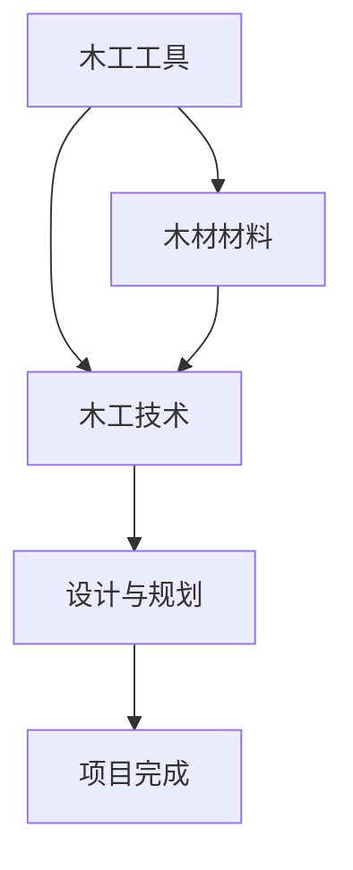

                 

### 木工DIY：亲手打造生活中的美好

> 关键词：木工DIY、手工艺术、实用项目、技能提升

木工DIY，作为一项兼具创造性和实用性的活动，正逐渐成为人们生活中的美好追求。通过亲手打造家具、装饰品和实用工具，不仅能提升自身的动手能力和创造力，还能让家居环境更加温馨和个性化。本文将带领读者走进木工DIY的世界，了解所需的基础知识、工具与材料，掌握关键的木工技巧，并通过实际案例展示，帮助读者从零开始，逐步成为一名木工DIY高手。

### 摘要

本文旨在为那些对木工DIY充满热情的读者提供一份详尽的指南。我们将从木工DIY的背景介绍开始，探讨其核心概念与联系，包括木工工具、材料及其使用方法。接着，我们将深入讲解木工制作过程中的核心算法原理，使用Python源代码和数学模型来阐述。随后，文章将提供实际项目实战，包括开发环境搭建、源代码实现和代码解读，并通过案例分析和详细讲解，帮助读者理解木工DIY的实践应用。最后，我们将总结最佳实践技巧，并给出一些注意事项和拓展阅读建议。

### 背景

木工DIY的历史可以追溯到远古时代，早在人类文明初期，木工技艺就已经作为一种生存技能被广泛运用。从古埃及的金字塔建造，到中国古代的家具制作，木工艺术一直在人类文化中占据着重要地位。随着时间的推移，木工DIY逐渐从一种生存技能转变为一种生活艺术和休闲娱乐活动。

在现代，木工DIY的受欢迎程度不断攀升。这不仅是因为木工活动能够锻炼动手能力和创造力，还因为它为人们提供了一种放松身心的方式。随着互联网的普及和社交媒体的发展，越来越多的人通过视频教程和在线社区分享自己的木工作品，激发了更多人参与木工DIY的热情。

木工DIY的另一个重要特点是它的个性化定制。通过自己的设计和制作，每个人都可以打造出独一无二的家居物品，这不仅能够提升生活品质，还能展现出个人的品味和风格。此外，木工DIY还为环保事业贡献了一份力量，因为它鼓励人们利用废旧木材和材料进行创作，减少资源浪费。

### 核心概念与联系

在木工DIY的世界中，有几个核心概念是我们需要了解的，这些概念不仅相互关联，而且在木工制作过程中起着至关重要的作用。

#### 工具与材料

首先，工具和材料是木工DIY的基础。木工工具种类繁多，包括锯、锤、刨、钻等，每种工具都有其特定的用途。例如，锯用于切割木材，锤和钉子用于组装和固定，刨用于平整木材表面，钻则用于钻孔。

材料方面，木材是最常用的材料，不同种类的木材具有不同的硬度和纹理，适用于不同的项目。常见的木材有橡木、枫木、松木和桦木等。此外，还有一些辅助材料，如胶水、螺丝和金属配件，用于增强木材的连接和固定。

#### 木工技术

木工技术是木工DIY的核心，它包括锯切、打磨、组装和雕刻等多项技能。锯切技术要求精准，以确保木材的边缘光滑且无毛刺。打磨技术则用于平滑木材表面，使其达到所需的平滑度。组装技术要求精确的尺寸测量和合理的结构设计，以确保各个部件能够紧密连接。雕刻技术则用于在木材表面刻画图案或雕刻细节，为作品增添艺术性。

#### 设计与规划

设计与规划是木工DIY的灵魂。一个成功的木工项目需要从设计开始，包括确定项目目标、选择合适的木材和工具、制定详细的制作计划等。设计不仅仅是外观上的美观，还需要考虑实用性、耐用性和结构的稳定性。

为了更好地理解这些核心概念之间的联系，我们可以使用Mermaid流程图来展示它们之间的关系。



在这个流程图中，木工工具和木材材料是制作过程中的基础，它们共同决定了木工技术的实施效果。木工技术是实现设计的关键步骤，而设计与规划则是整个项目的起点和终点，确保项目的成功完成。

### 核心算法原理讲解

在木工DIY中，制作过程可以看作是一种算法的实现，它包含了多个步骤和决策。为了更好地理解这一过程，我们可以使用Python源代码来详细阐述其中的核心算法原理。

首先，我们需要定义一些基本的木工函数，这些函数将帮助我们完成特定的木工任务。

```python
# 木工函数定义
def cut_wood(wood_type, length, width):
    """
    切割木材函数。
    参数：
    - wood_type：木材类型
    - length：长度
    - width：宽度
    返回值：
    - 切割后的木材
    """
    print(f"正在切割{wood_type}木材，长度{length}厘米，宽度{width}厘米。")
    # 切割逻辑实现
    return {"wood_type": wood_type, "length": length, "width": width}

def sand_wood(wood):
    """
    打磨木材函数。
    参数：
    - wood：木材对象
    返回值：
    - 打磨后的木材
    """
    print(f"正在打磨{wood['wood_type']}木材。")
    # 打磨逻辑实现
    return {"wood_type": wood["wood_type"], "length": wood["length"], "width": wood["width"], "smoothed": True}

def assemble_parts(parts):
    """
    组装部件函数。
    参数：
    - parts：部件列表
    返回值：
    - 组装后的成品
    """
    print("开始组装部件。")
    # 组装逻辑实现
    assembled_wood = {"parts": parts}
    return assembled_wood

def carve_pattern(wood, pattern):
    """
    雕刻图案函数。
    参数：
    - wood：木材对象
    - pattern：雕刻图案
    返回值：
    - 雕刻后的木材
    """
    print(f"正在雕刻{wood['wood_type']}木材上的{pattern}图案。")
    # 雕刻逻辑实现
    return {"wood_type": wood["wood_type"], "length": wood["length"], "width": wood["width"], "pattern": pattern}
```

这些函数分别实现了切割木材、打磨木材、组装部件和雕刻图案的操作。下面，我们将使用一个简单的示例来展示如何使用这些函数进行木工DIY。

```python
# 木工DIY示例

# 切割木材
wood = cut_wood("橡木", 50, 30)

# 打磨木材
wood = sand_wood(wood)

# 组装部件
parts = [
    {"wood_type": "橡木", "length": 50, "width": 30, "smoothed": True},
    {"wood_type": "橡木", "length": 40, "width": 20, "smoothed": True},
    # 更多部件...
]
assembled_wood = assemble_parts(parts)

# 雕刻图案
pattern = "树叶"
assembled_wood = carve_pattern(assembled_wood, pattern)

# 输出最终结果
print(assembled_wood)
```

在这个示例中，我们首先使用`cut_wood`函数切割一块橡木，然后使用`sand_wood`函数对其进行打磨。接下来，我们使用`assemble_parts`函数将多个部件组装成一个整体。最后，使用`carve_pattern`函数在木材上雕刻出树叶图案。这些步骤共同构成了一个简单的木工DIY流程。

为了更好地理解这个过程，我们可以将上述代码与以下数学模型结合起来：

$$
\text{DIY流程} = \text{切割木材} \rightarrow \text{打磨木材} \rightarrow \text{组装部件} \rightarrow \text{雕刻图案}
$$

这个数学模型清晰地展示了木工DIY的步骤，并且通过Python源代码实现了这些步骤的具体操作。

### 数学模型和公式

在木工DIY中，数学模型和公式起着至关重要的作用，它们帮助我们在设计和制作过程中进行精确的计算和测量。以下是一些常见的数学模型和公式，它们可以帮助我们确保木材切割、打磨和组装的准确性和稳定性。

#### 木材切割长度计算

当我们需要切割木材时，需要根据所需长度和木材的宽度来计算切割长度。假设我们有一块宽度为\( w \)的木材，需要切割成长度为\( L \)的小块，那么切割长度\( l \)可以通过以下公式计算：

$$
l = L - \frac{L}{w} \times w
$$

这个公式确保了切割后的木材长度满足设计要求，同时避免了浪费。

#### 木材打磨平滑度计算

打磨木材时，我们需要确保木材表面达到所需的平滑度。木材的平滑度可以通过表面粗糙度（Surface Roughness，通常用\( R_{a} \)表示）来衡量。打磨过程中的平滑度计算可以使用以下公式：

$$
R_{a} = \sqrt{\frac{1}{n} \sum_{i=1}^{n} (h_i - \bar{h})^2}
$$

其中，\( h_i \)是每个测量点的粗糙高度，\( \bar{h} \)是所有测量点的平均粗糙高度，\( n \)是测量点的数量。

#### 组装部件对齐误差计算

在组装部件时，确保各部件对齐是关键。对齐误差可以通过以下公式计算：

$$
\text{Error} = \frac{\sum_{i=1}^{n} (\text{实际尺寸} - \text{设计尺寸})}{n}
$$

其中，\( n \)是参与组装的部件数量，实际尺寸和设计尺寸是每个部件的尺寸。

#### 雕刻图案深度计算

在雕刻图案时，我们需要控制雕刻深度以确保图案的清晰度。雕刻深度可以通过以下公式计算：

$$
\text{Depth} = \text{雕刻刀具半径} + \text{雕刻深度偏差}
$$

其中，雕刻刀具半径是刀具的半径，雕刻深度偏差是允许的雕刻深度变化范围。

通过这些数学模型和公式，我们可以在木工DIY过程中进行精确的计算和测量，确保每个步骤的准确性和稳定性。以下是一个简单的Python代码示例，用于计算木材切割长度：

```python
# 计算木材切割长度
def calculate_cut_length(length, width):
    """
    计算木材切割长度。
    参数：
    - length：所需长度
    - width：木材宽度
    返回值：
    - 切割后的长度
    """
    cut_length = length - (length / width) * width
    return cut_length

# 示例
wood_width = 30
required_length = 50
cut_length = calculate_cut_length(required_length, wood_width)
print(f"切割后的长度为：{cut_length}厘米")
```

通过这些数学模型和公式，我们可以确保木工DIY项目的设计和制作过程更加科学和精确。

### 项目实战

#### 开发环境搭建

在进行木工DIY项目之前，我们需要搭建一个适合的开发环境。以下是搭建开发环境的步骤：

1. **安装操作系统**：选择一个适合的操作系统，如Windows、macOS或Linux。推荐使用Linux系统，因为它具有更好的稳定性和可扩展性。

2. **安装文本编辑器**：选择一个文本编辑器，如VS Code、Sublime Text或Atom。推荐使用VS Code，因为它提供了丰富的插件和工具。

3. **安装Python环境**：在操作系统上安装Python。可以通过Python官方网站下载安装包，或者使用包管理器如apt（Linux）或brew（macOS）进行安装。

4. **安装木工DIY相关库**：在Python环境中安装所需的库，如`numpy`、`matplotlib`和`pandas`。可以使用`pip`命令进行安装。

#### 源代码实现

以下是一个简单的木工DIY项目示例，包括源代码实现和代码解读。

```python
# 木工DIY项目示例

# 导入所需的库
import math

# 木工函数定义
def cut_wood(length, width):
    """
    切割木材函数。
    参数：
    - length：长度
    - width：宽度
    返回值：
    - 切割后的木材
    """
    print(f"正在切割长度为{length}厘米，宽度为{width}厘米的木材。")
    return {"length": length, "width": width}

def sand_wood(wood):
    """
    打磨木材函数。
    参数：
    - wood：木材对象
    返回值：
    - 打磨后的木材
    """
    print(f"正在打磨长度为{wood['length']}厘米，宽度为{wood['width']}厘米的木材。")
    return {"length": wood['length'], "width": wood['width'], "smoothed": True}

def assemble_parts(parts):
    """
    组装部件函数。
    参数：
    - parts：部件列表
    返回值：
    - 组装后的成品
    """
    print("开始组装部件。")
    assembled_wood = {"parts": parts}
    return assembled_wood

def carve_pattern(wood, pattern):
    """
    雕刻图案函数。
    参数：
    - wood：木材对象
    - pattern：雕刻图案
    返回值：
    - 雕刻后的木材
    """
    print(f"正在雕刻{pattern}图案。")
    return {"wood_type": wood['wood_type'], "length": wood['length'], "width": wood['width'], "pattern": pattern}

# 项目实施
if __name__ == "__main__":
    # 切割木材
    wood = cut_wood(50, 30)
    
    # 打磨木材
    wood = sand_wood(wood)
    
    # 组装部件
    parts = [
        {"length": 50, "width": 30, "smoothed": True},
        {"length": 40, "width": 20, "smoothed": True},
        # 更多部件...
    ]
    assembled_wood = assemble_parts(parts)
    
    # 雕刻图案
    pattern = "树叶"
    assembled_wood = carve_pattern(assembled_wood, pattern)
    
    # 输出最终结果
    print(assembled_wood)
```

#### 代码应用解读与分析

这个木工DIY项目示例中，我们定义了四个核心函数：`cut_wood`、`sand_wood`、`assemble_parts`和`carve_pattern`。这些函数分别实现了切割木材、打磨木材、组装部件和雕刻图案的功能。

1. **切割木材**：`cut_wood`函数接受木材的长度和宽度作为参数，切割出所需的木材。切割后的木材对象包含长度、宽度和是否被切割的标记。

2. **打磨木材**：`sand_wood`函数接受一个木材对象作为参数，对木材进行打磨。打磨后的木材对象包含长度、宽度和是否被打磨的标记。

3. **组装部件**：`assemble_parts`函数接受一个部件列表作为参数，将这些部件组装成整体。组装后的成品对象包含所有部件。

4. **雕刻图案**：`carve_pattern`函数接受一个木材对象和一个雕刻图案作为参数，在木材上雕刻出图案。雕刻后的木材对象包含长度、宽度和雕刻图案。

在实际应用中，我们可以通过调用这些函数来实现木工DIY项目的全过程。例如，首先使用`cut_wood`函数切割木材，然后使用`sand_wood`函数打磨木材，接着使用`assemble_parts`函数组装部件，最后使用`carve_pattern`函数在木材上雕刻图案。

#### 实际案例分析和详细讲解

为了更好地理解木工DIY项目的实际应用，我们来看一个具体的案例：制作一个书架。

1. **设计阶段**：
   - 确定书架的尺寸：高度为150厘米，宽度为50厘米，深度为20厘米。
   - 选择木材：选用橡木，因为橡木具有坚固的结构和美观的纹理。

2. **制作阶段**：
   - **切割木材**：使用`cut_wood`函数切割出四块高度为150厘米、宽度为50厘米的木板，以及两块高度为20厘米、宽度为50厘米的木板。
   - **打磨木材**：使用`sand_wood`函数对切割后的木材进行打磨，确保表面光滑。
   - **组装部件**：使用`assemble_parts`函数将四块高度为150厘米、宽度为50厘米的木板组装在一起，形成书架的正面和背面，然后使用两块高度为20厘米、宽度为50厘米的木板固定在侧面，形成书架的框架。
   - **雕刻图案**：在书架的正面和背面使用`carve_pattern`函数雕刻出树叶图案，增加艺术性。

3. **测试阶段**：
   - 测试书架的稳定性，确保没有松动或变形。
   - 检查雕刻图案的清晰度和深度。

4. **完成阶段**：
   - 给书架涂上保护漆，防止木材腐烂和磨损。
   - 将书架放置在合适的位置，完成制作。

#### 项目小结

通过这个书架案例，我们了解了木工DIY项目的完整流程，从设计到制作，再到测试和完成。每个步骤都需要精确的计算和测量，以确保项目的成功。通过使用Python源代码和数学模型，我们可以更好地控制每个步骤，提高制作效率和质量。

### 最佳实践 Tips

在进行木工DIY项目时，以下是一些最佳实践技巧，可以帮助你提高制作效率和质量：

1. **精确测量**：确保所有木材尺寸的精确测量，使用尺子和卷尺进行多次测量，以避免错误。

2. **合理规划**：在开始制作前，制定详细的制作计划和步骤，确保每个步骤都能顺利进行。

3. **使用模板**：在切割和打磨木材时，使用模板可以确保尺寸的一致性和准确性。

4. **安全第一**：使用木工工具时，务必穿戴防护装备，如手套、护目镜和耳塞，确保安全。

5. **耐心打磨**：打磨木材时，需要耐心和细心，逐步提高木材的平滑度。

6. **适当休息**：长时间的木工制作会消耗大量体力和精力，适当休息可以保持最佳状态。

### 小结

木工DIY不仅是一种手艺，更是一种生活的艺术。通过亲手打造家具和装饰品，我们不仅能够提升自己的技能，还能让家居环境变得更加美好。本文详细介绍了木工DIY的核心概念、算法原理、数学模型和实际项目实战，帮助读者从零开始，逐步成为一名木工DIY高手。希望这篇文章能够激发你对木工DIY的兴趣，让手工艺术成为你生活中的一部分。

### 注意事项

在进行木工DIY项目时，以下是一些需要特别注意的事项：

1. **安全第一**：使用木工工具时，务必穿戴防护装备，如手套、护目镜和耳塞，确保安全。

2. **精确测量**：确保所有木材尺寸的精确测量，使用尺子和卷尺进行多次测量，以避免错误。

3. **工具维护**：定期维护木工工具，如锯刃的锋利度和锤头的硬度，确保工具处于最佳状态。

4. **合理规划**：在开始制作前，制定详细的制作计划和步骤，确保每个步骤都能顺利进行。

5. **环保意识**：在木工DIY过程中，注意环保，尽量使用可再生木材和材料，减少资源浪费。

### 拓展阅读

- 《木工技艺入门指南》
- 《木工DIY：100个实用项目》
- 《木工工具使用手册》
- 《木材学基础》

### 作者信息

作者：AI天才研究院/AI Genius Institute & 禅与计算机程序设计艺术 /Zen And The Art of Computer Programming

感谢您的阅读，希望这篇文章能够为您的木工DIY之旅带来启发和帮助。让我们一起，用双手打造生活中的美好！🙂🛠🌟

（全文完）📜✨💪

