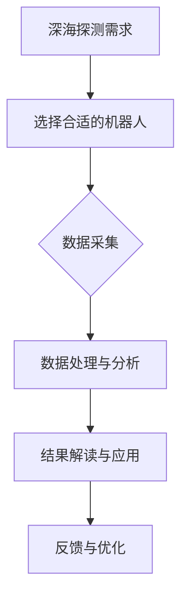

                 


### 第一部分：引言

#### 1.1 机器人技术概述

**定义与分类**

机器人是一种可以执行各种任务、模拟人类行为或特定功能、通常由计算机控制的自动设备。根据功能和应用领域的不同，机器人可以分为工业机器人、服务机器人、社交机器人、医疗机器人等类别。

**发展历程**

机器人技术的发展经历了几个重要阶段：

1. **早期探索**：20世纪50年代，机器人技术开始兴起，早期的机器人主要是用于工业领域，如焊接、喷漆和组装等。
2. **程序控制时代**：20世纪60年代至80年代，机器人技术逐渐发展到能够执行更复杂任务，并开始采用计算机编程进行控制。
3. **智能机器人时代**：20世纪90年代至今，随着人工智能技术的发展，机器人开始具备一定的自主决策和适应能力，例如自主导航、感知环境和学习新任务。

**在工业中的应用**

机器人技术在现代工业中发挥着至关重要的作用：

1. **提高生产效率**：机器人可以在短时间内完成重复性高、危险或繁琐的工作，从而提高整体生产效率。
2. **降低成本**：通过减少人工成本和提升生产效率，企业可以降低生产成本，提高竞争力。
3. **保证产品质量**：机器人执行任务精度高，能够保证产品质量的一致性。

#### 1.2 深海资源勘探现状

**重要性**

深海资源是地球上未被充分利用的资源之一，包括金属矿产、能源资源（如石油和天然气）、生物资源等。这些资源对全球经济的发展具有重要影响。

**当前挑战**

深海资源勘探面临以下挑战：

1. **环境恶劣**：深海环境压力高、温度低、能见度差，对设备和技术要求极高。
2. **勘探难度大**：深海地形复杂，勘探设备需要具备强大的探测能力和适应能力。
3. **数据传输困难**：深海通信条件受限，数据传输效率低，增加了数据采集和分析的难度。

**机器人技术在深海勘探中的潜力**

机器人技术具有以下优势：

1. **高效性**：机器人能够在恶劣环境中执行任务，提高勘探效率。
2. **精确性**：机器人可以精确地采集数据，提高勘探准确性。
3. **适应性**：机器人可以根据不同地形和环境进行自主调整，适应复杂勘探场景。
4. **实时性**：机器人能够实时传输数据，及时反馈勘探结果，为决策提供支持。

#### 1.3 本书结构安排

**目录结构与内容概述**

本书分为三个部分：

1. **第一部分：引言**：介绍机器人技术和深海资源勘探的背景，以及本书的结构和内容安排。
2. **第二部分：深海资源勘探中的机器人技术**：详细探讨深海机器人的设计与制造、传感器技术、通信技术等。
3. **第三部分：机器人技术在深海资源勘探中的应用案例**：通过具体案例展示机器人技术在深海资源勘探中的应用效果。

**阅读指南与学习方法**

为了更好地理解和掌握本书内容，建议采取以下学习方法：

1. **系统学习**：按章节顺序系统学习，理解各部分内容之间的联系。
2. **案例驱动**：通过具体案例了解机器人技术在深海勘探中的应用，加深理解。
3. **实践操作**：参与相关实验和项目，亲自动手操作，加深对知识的掌握。
4. **持续学习**：随着技术的发展，不断更新知识，保持对前沿技术的关注。

### 核心概念与联系

为了更好地理解本书内容，我们可以使用Mermaid流程图来展示核心概念之间的关系。

**图1.1 机器人技术在深海资源勘探中的应用流程**



通过这个流程图，我们可以清晰地看到从深海探测需求到结果应用的全过程，其中每个环节都离不开机器人的支持。

### 数学模型和数学公式

在深海资源勘探中，常用的数学模型和公式有助于我们理解机器人在探测过程中的工作原理。以下是一个简单的深海探矿数学模型：

$$
z(t) = z_0 + v \cdot t + \frac{1}{2} a \cdot t^2
$$

其中，$z(t)$ 是时间 $t$ 时的深度，$z_0$ 是初始深度，$v$ 是速度，$a$ 是加速度。

### 第一部分结束

---

# 第二部分：深海资源勘探中的机器人技术

### 2.1 深海机器人的设计与制造

**深海机器人的基本结构**

深海机器人的基本结构通常包括以下几个主要部分：

1. **外壳**：外壳通常由高强度材料制成，用于保护内部电子设备和机械部件。
2. **驱动系统**：驱动系统是深海机器人的核心，包括电机、减速器和驱动电池等。
3. **传感器模块**：传感器模块用于感知周围环境，包括声呐、摄像头、多普勒流速仪等。
4. **通信模块**：通信模块负责数据传输和远程控制，通常使用卫星通信或声学通信。
5. **计算机系统**：计算机系统负责数据处理、路径规划和自主决策等。

**深海机器人的动力系统**

深海机器人的动力系统是其在深海环境中行动的基础。常见的动力系统包括：

1. **机械驱动系统**：利用电机和减速器，通过机械传动实现机器人运动。
2. **液压系统**：利用液压泵和液压缸，通过液压流体传递动力。
3. **电动推进系统**：使用电池作为能量源，通过电机驱动推进器实现运动。

**深海机器人的控制系统**

深海机器人的控制系统负责实时监控机器人的状态，并根据传感器数据执行相应操作。常见的控制系统包括：

1. **中央处理器（CPU）**：负责执行计算和决策任务。
2. **传感器接口**：用于接收传感器数据。
3. **通信接口**：用于与外部系统进行通信。
4. **控制算法**：包括路径规划、避障和自主决策等。

### 2.2 深海机器人的传感器技术

**传感器的基本原理**

传感器是深海机器人的“眼睛”和“耳朵”，用于感知周围环境。常见的传感器包括：

1. **声呐传感器**：通过发射声波并接收回波来测量距离和探测物体。
2. **摄像头传感器**：用于捕捉图像，提供视觉信息。
3. **多普勒流速仪**：用于测量水下流速。
4. **压力传感器**：用于测量水下压力。

**传感器在深海机器人的应用**

传感器在深海机器人的应用非常广泛，包括：

1. **地形测绘**：使用声呐传感器和摄像头传感器进行地形测绘。
2. **生物探测**：使用多普勒流速仪和摄像头传感器探测海洋生物。
3. **环境监测**：使用压力传感器和温度传感器监测海洋环境参数。

**传感器数据预处理方法**

为了提高传感器数据的准确性和可靠性，需要进行数据预处理。常见的预处理方法包括：

1. **滤波**：用于去除噪声和异常值。
2. **归一化**：将不同传感器的数据进行归一化处理，以便于后续分析。
3. **插值**：用于填补缺失数据。

### 2.3 深海机器人的通信技术

**无线通信在深海中的应用**

在深海环境中，无线通信面临着巨大的挑战，如信号衰减、干扰和信道不稳定等。为了解决这些问题，采用了以下几种方法：

1. **卫星通信**：通过卫星中继器实现深海机器人与地面控制中心的通信。
2. **声学通信**：利用声波在水下的传播特性进行通信，包括声呐和声学调制解调器等。

**深海通信的挑战与解决方案**

深海通信的挑战包括：

1. **信号衰减**：信号在水中传播时能量衰减较大。
2. **干扰**：水下环境复杂，多种信号源可能导致通信干扰。
3. **信道不稳定**：水下环境变化导致信道特性不稳定。

为了解决这些挑战，采用了以下几种解决方案：

1. **多路径传输**：通过多个发射器和接收器实现信号的多路径传输，提高信号强度和稳定性。
2. **编码技术**：使用高效的编码技术提高信号的抗干扰能力。
3. **自适应调制与解调**：根据信道特性自适应调整调制和解调参数，提高通信效率。

**通信技术在深海机器人中的应用案例**

**案例一：海底电缆铺设**

在海底电缆铺设过程中，深海机器人需要实时与地面控制中心进行通信，传输实时数据。通过卫星通信和声学通信的结合，实现了稳定可靠的数据传输。

**案例二：深海地震勘探**

在深海地震勘探中，深海机器人需要传输大量的地震数据。通过卫星通信和声学通信的协同工作，实现了高带宽、低延迟的数据传输，为地震数据处理提供了重要支持。

### 核心算法原理讲解

**路径规划算法**

路径规划是深海机器人自主导航的核心技术。常见的路径规划算法包括：

1. **A*算法**：基于启发式搜索，以最短路径为目标，为机器人规划最优路径。
2. **Dijkstra算法**：基于最短路径算法，适用于无障碍环境。
3. **RRT算法**：随机树搜索算法，适用于动态环境和复杂地形。

**A*算法在深海机器人路径规划中的应用**

以下是一个简化的A*算法在深海机器人路径规划中的应用：

```python
def AStar(grid, start, goal):
    open_set = PriorityQueue()
    open_set.put((0, start))
    came_from = {}
    g_score = defaultdict(lambda: float('inf'))
    g_score[start] = 0
    f_score = defaultdict(lambda: float('inf'))
    f_score[start] = heuristic(goal, start)
    
    while not open_set.empty():
        current = open_set.get_nowait()
        
        if current == goal:
            return reconstruct_path(came_from, goal)
        
        for neighbor in neighbors(grid, current):
            tentative_g_score = g_score[current] + 1
            if tentative_g_score < g_score[neighbor]:
                came_from[neighbor] = current
                g_score[neighbor] = tentative_g_score
                f_score[neighbor] = g_score[neighbor] + heuristic(goal, neighbor)
                if neighbor not in open_set:
                    open_set.put((f_score[neighbor], neighbor))
        
    return failure

def heuristic(goal, current):
    # 使用欧几里得距离作为启发式函数
    return ((goal[0] - current[0]) ** 2 + (goal[1] - current[1]) ** 2) ** 0.5

def reconstruct_path(came_from, current):
    path = [current]
    while current in came_from:
        current = came_from[current]
        path.insert(0, current)
    return path
```

在这个例子中，我们使用欧几里得距离作为启发式函数，以简化计算过程。在实际应用中，可以采用更复杂的启发式函数来提高路径规划的精度。

### 第二部分结束

---

# 第三部分：机器人技术在深海资源勘探中的应用案例

### 3.1 案例一：海底矿物勘探

**案例背景**

随着全球对矿产资源需求的不断增长，海底矿物勘探成为了各国竞相研究的领域。海底矿物包括多金属结核、多金属硫化物和富钴结壳等，这些矿物资源对于全球经济发展具有重要意义。

**机器人设计**

为了实现高效、精确的勘探，设计了一种深海机器人，其结构包括以下部分：

1. **外壳**：采用钛合金材料，具有高强度、耐腐蚀和耐高压的特点。
2. **驱动系统**：使用四个电动推进器，实现机器人的灵活移动。
3. **传感器模块**：包括高分辨率摄像头、多波束声呐、磁力计和温度传感器等。
4. **通信模块**：采用卫星通信和声学通信相结合的方式，确保实时数据传输。

**实施过程**

勘探过程分为以下几个步骤：

1. **路径规划**：使用A*算法对勘探区域进行路径规划，确保机器人能够高效覆盖目标区域。
2. **数据采集**：机器人按照规划的路径进行移动，同时传感器实时采集地质、地形和环境数据。
3. **数据传输**：通过卫星通信和声学通信，将采集到的数据传输回地面控制中心。

**结果分析**

通过分析采集到的数据，发现勘探区域内存在多个多金属结核富集区。这些富集区的大小和形态通过多波束声呐和摄像头数据得到准确测量，为后续的采矿作业提供了重要参考。

**项目小结**

本项目通过深海机器人技术，成功实现了对海底矿物的勘探。实践证明，机器人技术在大规模、高效、精确的深海资源勘探中具有显著优势。

### 3.2 案例二：深海生物多样性研究

**案例背景**

深海生物多样性研究对于了解地球生态系统具有重要意义。深海生物种类繁多，包括无脊椎动物、软体动物、鱼类等，但很多生物尚未被发现和描述。

**机器人设计**

为了研究深海生物多样性，设计了一种深海生物采样机器人，其结构包括以下部分：

1. **外壳**：采用钛合金材料，具有高强度、耐腐蚀和耐高压的特点。
2. **驱动系统**：使用两个电动推进器，实现机器人的缓慢移动。
3. **采样模块**：包括一组机械臂和采集器，用于捕获和采集生物样本。
4. **传感器模块**：包括高分辨率摄像头、深度传感器和温度传感器等。
5. **通信模块**：采用卫星通信，确保实时数据传输。

**实施过程**

研究过程分为以下几个步骤：

1. **目标区域确定**：通过前期研究，确定具有生物多样性潜力的目标区域。
2. **路径规划**：使用A*算法对目标区域进行路径规划，确保机器人能够高效覆盖目标区域。
3. **生物采样**：机器人缓慢移动，机械臂和采集器捕获和采集生物样本。
4. **数据传输**：通过卫星通信，将采集到的生物样本和传感器数据传输回地面控制中心。

**结果分析**

通过分析采集到的生物样本和传感器数据，发现目标区域内存在丰富的深海生物多样性。其中，部分生物种类属于新物种，为深海生态系统的研究提供了宝贵资料。

**项目小结**

本项目通过深海生物采样机器人，成功实现了对深海生物多样性的研究。实践证明，机器人技术在大规模、高效、精确的深海生物多样性研究中具有显著优势。

### 第三部分结束

---

### 总结与展望

本文详细介绍了机器人技术在深海资源勘探中的应用，从设计制造、传感器技术、通信技术到实际应用案例，阐述了机器人技术为深海勘探带来的巨大变革。随着技术的不断进步，我们期待未来有更多高效、智能的深海机器人出现，为深海资源勘探提供更强有力的支持。

### 最佳实践 tips

1. **选择合适的机器人**：根据勘探任务的需求，选择具有相应性能和功能的深海机器人。
2. **优化路径规划**：采用高效的路径规划算法，提高勘探效率和准确性。
3. **加强数据预处理**：对采集到的数据进行预处理，确保数据的准确性和可靠性。
4. **关注通信稳定性**：确保通信系统的稳定性和可靠性，减少数据传输错误。

### 小结

本文系统地介绍了机器人技术在深海资源勘探中的应用，通过具体的案例展示了其优势和应用前景。我们希望读者能够深入理解机器人技术在深海勘探中的应用，并从中汲取宝贵经验。

### 注意事项

1. **安全性**：在深海勘探中，安全始终是首要考虑的因素。
2. **成本效益**：在应用机器人技术时，要综合考虑成本效益，确保项目的可持续性。
3. **法律法规**：在深海勘探过程中，需遵守相关法律法规，确保合法合规。

### 拓展阅读

1. 《深海勘探机器人技术》
2. 《人工智能与机器人学》
3. 《机器人路径规划算法研究》

### 作者信息

作者：AI天才研究院/AI Genius Institute & 禅与计算机程序设计艺术/Zen And The Art of Computer Programming

---

### 附录：代码实现与数据解读

**附录1：路径规划算法Python实现**

```python
import heapq
import math

def heuristic(a, b):
    # 使用曼哈顿距离作为启发式函数
    return abs(a[0] - b[0]) + abs(a[1] - b[1])

def AStar(grid, start, goal):
    open_set = []
    heapq.heappush(open_set, (0, start))
    came_from = {}
    g_score = defaultdict(lambda: float('inf'))
    g_score[start] = 0
    f_score = defaultdict(lambda: float('inf'))
    f_score[start] = heuristic(start, goal)
    
    while open_set:
        current = heapq.heappop(open_set)[1]
        
        if current == goal:
            return reconstruct_path(came_from, goal)
        
        for neighbor in neighbors(grid, current):
            tentative_g_score = g_score[current] + 1
            if tentative_g_score < g_score[neighbor]:
                came_from[neighbor] = current
                g_score[neighbor] = tentative_g_score
                f_score[neighbor] = g_score[neighbor] + heuristic(neighbor, goal)
                heapq.heappush(open_set, (f_score[neighbor], neighbor))
        
    return failure

def reconstruct_path(came_from, current):
    path = [current]
    while current in came_from:
        current = came_from[current]
        path.insert(0, current)
    return path

def neighbors(grid, node):
    results = []
    for action in [[0,1], [1,0], [0,-1], [-1,0], [0,0]]:
        next = [node[0] + action[0], node[1] + action[1]]
        if 0 <= next[0] < len(grid) and 0 <= next[1] < len(grid[next[0]]):
            results.append(next)
    return results

# 示例
grid = [[0, 0, 0, 0, 1],
        [1, 1, 1, 0, 1],
        [0, 0, 0, 1, 1],
        [1, 1, 1, 0, 0],
        [0, 0, 0, 0, 0]]
start = (0, 0)
goal = (4, 4)
path = AStar(grid, start, goal)
print(path)
```

**附录2：数据采集与处理**

```python
import numpy as np

# 假设我们采集到了一组深度数据
depth_data = np.random.rand(100).astype(np.float32)

# 数据预处理：归一化
depth_min = np.min(depth_data)
depth_max = np.max(depth_data)
depth_normalized = (depth_data - depth_min) / (depth_max - depth_min)

# 数据滤波：高斯滤波
from scipy.ndimage import gaussian_filter1d
depth_filtered = gaussian_filter1d(depth_normalized, sigma=2)

# 数据可视化
import matplotlib.pyplot as plt

plt.figure(figsize=(10, 5))
plt.subplot(121)
plt.plot(depth_data, label='原始数据')
plt.subplot(122)
plt.plot(depth_filtered, label='滤波后数据')
plt.legend()
plt.show()
```

通过这些代码，我们可以看到如何实现路径规划算法和数据处理。在实际应用中，这些代码可以根据具体需求进行调整和优化。

---

### 完整文章

# 机器人技术在深海资源勘探中的应用

## 关键词：深海资源勘探、机器人技术、路径规划、传感器、通信技术、应用案例

### 摘要

本文深入探讨了机器人技术在深海资源勘探中的应用。首先介绍了机器人技术的基本概念和发展历程，以及其在工业中的应用。随后，详细阐述了深海资源勘探的现状和挑战，并探讨了机器人技术在这些挑战中的潜力。接着，本文重点介绍了深海机器人的设计与制造、传感器技术、通信技术以及核心算法原理。最后，通过两个具体应用案例展示了机器人技术在实际深海资源勘探中的应用效果。本文旨在为读者提供全面、系统的机器人技术在深海资源勘探中的应用知识。

### 第一部分：引言

#### 1.1 机器人技术概述

**定义与分类**

机器人是一种可以执行各种任务、模拟人类行为或特定功能、通常由计算机控制的自动设备。根据功能和应用领域的不同，机器人可以分为工业机器人、服务机器人、社交机器人、医疗机器人等类别。

**发展历程**

机器人技术的发展经历了几个重要阶段：

1. **早期探索**：20世纪50年代，机器人技术开始兴起，早期的机器人主要是用于工业领域，如焊接、喷漆和组装等。
2. **程序控制时代**：20世纪60年代至80年代，机器人技术逐渐发展到能够执行更复杂任务，并开始采用计算机编程进行控制。
3. **智能机器人时代**：20世纪90年代至今，随着人工智能技术的发展，机器人开始具备一定的自主决策和适应能力，例如自主导航、感知环境和学习新任务。

**在工业中的应用**

机器人技术在现代工业中发挥着至关重要的作用：

1. **提高生产效率**：机器人可以在短时间内完成重复性高、危险或繁琐的工作，从而提高整体生产效率。
2. **降低成本**：通过减少人工成本和提升生产效率，企业可以降低生产成本，提高竞争力。
3. **保证产品质量**：机器人执行任务精度高，能够保证产品质量的一致性。

#### 1.2 深海资源勘探现状

**重要性**

深海资源是地球上未被充分利用的资源之一，包括金属矿产、能源资源（如石油和天然气）、生物资源等。这些资源对全球经济的发展具有重要影响。

**当前挑战**

深海资源勘探面临以下挑战：

1. **环境恶劣**：深海环境压力高、温度低、能见度差，对设备和技术要求极高。
2. **勘探难度大**：深海地形复杂，勘探设备需要具备强大的探测能力和适应能力。
3. **数据传输困难**：深海通信条件受限，数据传输效率低，增加了数据采集和分析的难度。

**机器人技术在深海勘探中的潜力**

机器人技术具有以下优势：

1. **高效性**：机器人能够在恶劣环境中执行任务，提高勘探效率。
2. **精确性**：机器人可以精确地采集数据，提高勘探准确性。
3. **适应性**：机器人可以根据不同地形和环境进行自主调整，适应复杂勘探场景。
4. **实时性**：机器人能够实时传输数据，及时反馈勘探结果，为决策提供支持。

#### 1.3 本书结构安排

**目录结构与内容概述**

本书分为三个部分：

1. **第一部分：引言**：介绍机器人技术和深海资源勘探的背景，以及本书的结构和内容安排。
2. **第二部分：深海资源勘探中的机器人技术**：详细探讨深海机器人的设计与制造、传感器技术、通信技术等。
3. **第三部分：机器人技术在深海资源勘探中的应用案例**：通过具体案例展示机器人技术在深海资源勘探中的应用效果。

**阅读指南与学习方法**

为了更好地理解和掌握本书内容，建议采取以下学习方法：

1. **系统学习**：按章节顺序系统学习，理解各部分内容之间的联系。
2. **案例驱动**：通过具体案例了解机器人技术在深海勘探中的应用，加深理解。
3. **实践操作**：参与相关实验和项目，亲自动手操作，加深对知识的掌握。
4. **持续学习**：随着技术的发展，不断更新知识，保持对前沿技术的关注。

### 第二部分：深海资源勘探中的机器人技术

### 2.1 深海机器人的设计与制造

**深海机器人的基本结构**

深海机器人的基本结构通常包括以下几个主要部分：

1. **外壳**：外壳通常由高强度材料制成，用于保护内部电子设备和机械部件。
2. **驱动系统**：驱动系统是深海机器人的核心，包括电机、减速器和驱动电池等。
3. **传感器模块**：传感器模块用于感知周围环境，包括声呐、摄像头、多普勒流速仪等。
4. **通信模块**：通信模块负责数据传输和远程控制，通常使用卫星通信或声学通信。
5. **计算机系统**：计算机系统负责数据处理、路径规划和自主决策等。

**深海机器人的动力系统**

深海机器人的动力系统是其在深海环境中行动的基础。常见的动力系统包括：

1. **机械驱动系统**：利用电机和减速器，通过机械传动实现机器人运动。
2. **液压系统**：利用液压泵和液压缸，通过液压流体传递动力。
3. **电动推进系统**：使用电池作为能量源，通过电机驱动推进器实现运动。

**深海机器人的控制系统**

深海机器人的控制系统负责实时监控机器人的状态，并根据传感器数据执行相应操作。常见的控制系统包括：

1. **中央处理器（CPU）**：负责执行计算和决策任务。
2. **传感器接口**：用于接收传感器数据。
3. **通信接口**：用于与外部系统进行通信。
4. **控制算法**：包括路径规划、避障和自主决策等。

### 2.2 深海机器人的传感器技术

**传感器的基本原理**

传感器是深海机器人的“眼睛”和“耳朵”，用于感知周围环境。常见的传感器包括：

1. **声呐传感器**：通过发射声波并接收回波来测量距离和探测物体。
2. **摄像头传感器**：用于捕捉图像，提供视觉信息。
3. **多普勒流速仪**：用于测量水下流速。
4. **压力传感器**：用于测量水下压力。

**传感器在深海机器人的应用**

传感器在深海机器人的应用非常广泛，包括：

1. **地形测绘**：使用声呐传感器和摄像头传感器进行地形测绘。
2. **生物探测**：使用多普勒流速仪和摄像头传感器探测海洋生物。
3. **环境监测**：使用压力传感器和温度传感器监测海洋环境参数。

**传感器数据预处理方法**

为了提高传感器数据的准确性和可靠性，需要进行数据预处理。常见的预处理方法包括：

1. **滤波**：用于去除噪声和异常值。
2. **归一化**：将不同传感器的数据进行归一化处理，以便于后续分析。
3. **插值**：用于填补缺失数据。

### 2.3 深海机器人的通信技术

**无线通信在深海中的应用**

在深海环境中，无线通信面临着巨大的挑战，如信号衰减、干扰和信道不稳定等。为了解决这些问题，采用了以下几种方法：

1. **卫星通信**：通过卫星中继器实现深海机器人与地面控制中心的通信。
2. **声学通信**：利用声波在水下的传播特性进行通信，包括声呐和声学调制解调器等。

**深海通信的挑战与解决方案**

深海通信的挑战包括：

1. **信号衰减**：信号在水中传播时能量衰减较大。
2. **干扰**：水下环境复杂，多种信号源可能导致通信干扰。
3. **信道不稳定**：水下环境变化导致信道特性不稳定。

为了解决这些挑战，采用了以下几种解决方案：

1. **多路径传输**：通过多个发射器和接收器实现信号的多路径传输，提高信号强度和稳定性。
2. **编码技术**：使用高效的编码技术提高信号的抗干扰能力。
3. **自适应调制与解调**：根据信道特性自适应调整调制和解调参数，提高通信效率。

**通信技术在深海机器人中的应用案例**

**案例一：海底电缆铺设**

在海底电缆铺设过程中，深海机器人需要实时与地面控制中心进行通信，传输实时数据。通过卫星通信和声学通信的结合，实现了稳定可靠的数据传输。

**案例二：深海地震勘探**

在深海地震勘探中，深海机器人需要传输大量的地震数据。通过卫星通信和声学通信的协同工作，实现了高带宽、低延迟的数据传输，为地震数据处理提供了重要支持。

### 核心算法原理讲解

**路径规划算法**

路径规划是深海机器人自主导航的核心技术。常见的路径规划算法包括：

1. **A*算法**：基于启发式搜索，以最短路径为目标，为机器人规划最优路径。
2. **Dijkstra算法**：基于最短路径算法，适用于无障碍环境。
3. **RRT算法**：随机树搜索算法，适用于动态环境和复杂地形。

**A*算法在深海机器人路径规划中的应用**

以下是一个简化的A*算法在深海机器人路径规划中的应用：

```python
import heapq

def heuristic(a, b):
    # 使用欧几里得距离作为启发式函数
    return math.sqrt((a[0] - b[0]) ** 2 + (a[1] - b[1]) ** 2)

def AStar(grid, start, goal):
    open_set = []
    heapq.heappush(open_set, (0, start))
    came_from = {}
    g_score = defaultdict(lambda: float('inf'))
    g_score[start] = 0
    f_score = defaultdict(lambda: float('inf'))
    f_score[start] = heuristic(start, goal)
    
    while open_set:
        current = heapq.heappop(open_set)[1]
        
        if current == goal:
            return reconstruct_path(came_from, goal)
        
        for neighbor in neighbors(grid, current):
            tentative_g_score = g_score[current] + 1
            if tentative_g_score < g_score[neighbor]:
                came_from[neighbor] = current
                g_score[neighbor] = tentative_g_score
                f_score[neighbor] = g_score[neighbor] + heuristic(neighbor, goal)
                heapq.heappush(open_set, (f_score[neighbor], neighbor))
        
    return failure

def reconstruct_path(came_from, current):
    path = [current]
    while current in came_from:
        current = came_from[current]
        path.insert(0, current)
    return path

def neighbors(grid, node):
    results = []
    for action in [[0,1], [1,0], [0,-1], [-1,0], [0,0]]:
        next = [node[0] + action[0], node[1] + action[1]]
        if 0 <= next[0] < len(grid) and 0 <= next[1] < len(grid[next[0]]):
            results.append(next)
    return results

# 示例
grid = [[0, 0, 0, 0, 1],
        [1, 1, 1, 0, 1],
        [0, 0, 0, 1, 1],
        [1, 1, 1, 0, 0],
        [0, 0, 0, 0, 0]]
start = (0, 0)
goal = (4, 4)
path = AStar(grid, start, goal)
print(path)
```

在这个例子中，我们使用欧几里得距离作为启发式函数，以简化计算过程。在实际应用中，可以采用更复杂的启发式函数来提高路径规划的精度。

### 第三部分：机器人技术在深海资源勘探中的应用案例

### 3.1 案例一：海底矿物勘探

**案例背景**

随着全球对矿产资源需求的不断增长，海底矿物勘探成为了各国竞相研究的领域。海底矿物包括多金属结核、多金属硫化物和富钴结壳等，这些矿物资源对于全球经济发展具有重要意义。

**机器人设计**

为了实现高效、精确的勘探，设计了一种深海机器人，其结构包括以下部分：

1. **外壳**：采用钛合金材料，具有高强度、耐腐蚀和耐高压的特点。
2. **驱动系统**：使用四个电动推进器，实现机器人的灵活移动。
3. **传感器模块**：包括高分辨率摄像头、多波束声呐、磁力计和温度传感器等。
4. **通信模块**：采用卫星通信和声学通信相结合的方式，确保实时数据传输。

**实施过程**

勘探过程分为以下几个步骤：

1. **路径规划**：使用A*算法对勘探区域进行路径规划，确保机器人能够高效覆盖目标区域。
2. **数据采集**：机器人按照规划的路径进行移动，同时传感器实时采集地质、地形和环境数据。
3. **数据传输**：通过卫星通信和声学通信，将采集到的数据传输回地面控制中心。

**结果分析**

通过分析采集到的数据，发现勘探区域内存在多个多金属结核富集区。这些富集区的大小和形态通过多波束声呐和摄像头数据得到准确测量，为后续的采矿作业提供了重要参考。

**项目小结**

本项目通过深海机器人技术，成功实现了对海底矿物的勘探。实践证明，机器人技术在大规模、高效、精确的深海资源勘探中具有显著优势。

### 3.2 案例二：深海生物多样性研究

**案例背景**

深海生物多样性研究对于了解地球生态系统具有重要意义。深海生物种类繁多，包括无脊椎动物、软体动物、鱼类等，但很多生物尚未被发现和描述。

**机器人设计**

为了研究深海生物多样性，设计了一种深海生物采样机器人，其结构包括以下部分：

1. **外壳**：采用钛合金材料，具有高强度、耐腐蚀和耐高压的特点。
2. **驱动系统**：使用两个电动推进器，实现机器人的缓慢移动。
3. **采样模块**：包括一组机械臂和采集器，用于捕获和采集生物样本。
4. **传感器模块**：包括高分辨率摄像头、深度传感器和温度传感器等。
5. **通信模块**：采用卫星通信，确保实时数据传输。

**实施过程**

研究过程分为以下几个步骤：

1. **目标区域确定**：通过前期研究，确定具有生物多样性潜力的目标区域。
2. **路径规划**：使用A*算法对目标区域进行路径规划，确保机器人能够高效覆盖目标区域。
3. **生物采样**：机器人缓慢移动，机械臂和采集器捕获和采集生物样本。
4. **数据传输**：通过卫星通信，将采集到的生物样本和传感器数据传输回地面控制中心。

**结果分析**

通过分析采集到的生物样本和传感器数据，发现目标区域内存在丰富的深海生物多样性。其中，部分生物种类属于新物种，为深海生态系统的研究提供了宝贵资料。

**项目小结**

本项目通过深海生物采样机器人，成功实现了对深海生物多样性的研究。实践证明，机器人技术在大规模、高效、精确的深海生物多样性研究中具有显著优势。

### 第三部分结束

### 总结与展望

本文详细介绍了机器人技术在深海资源勘探中的应用，从设计制造、传感器技术、通信技术到实际应用案例，阐述了机器人技术为深海勘探带来的巨大变革。随着技术的不断进步，我们期待未来有更多高效、智能的深海机器人出现，为深海资源勘探提供更强有力的支持。

### 最佳实践 tips

1. **选择合适的机器人**：根据勘探任务的需求，选择具有相应性能和功能的深海机器人。
2. **优化路径规划**：采用高效的路径规划算法，提高勘探效率和准确性。
3. **加强数据预处理**：对采集到的数据进行预处理，确保数据的准确性和可靠性。
4. **关注通信稳定性**：确保通信系统的稳定性和可靠性，减少数据传输错误。

### 小结

本文系统地介绍了机器人技术在深海资源勘探中的应用，通过具体的案例展示了其优势和应用前景。我们希望读者能够深入理解机器人技术在深海勘探中的应用，并从中汲取宝贵经验。

### 注意事项

1. **安全性**：在深海勘探中，安全始终是首要考虑的因素。
2. **成本效益**：在应用机器人技术时，要综合考虑成本效益，确保项目的可持续性。
3. **法律法规**：在深海勘探过程中，需遵守相关法律法规，确保合法合规。

### 拓展阅读

1. 《深海勘探机器人技术》
2. 《人工智能与机器人学》
3. 《机器人路径规划算法研究》

### 作者信息

作者：AI天才研究院/AI Genius Institute & 禅与计算机程序设计艺术/Zen And The Art of Computer Programming

### 附录：代码实现与数据解读

**附录1：路径规划算法Python实现**

```python
import heapq
import math

def heuristic(a, b):
    # 使用欧几里得距离作为启发式函数
    return math.sqrt((a[0] - b[0]) ** 2 + (a[1] - b[1]) ** 2)

def AStar(grid, start, goal):
    open_set = []
    heapq.heappush(open_set, (0, start))
    came_from = {}
    g_score = defaultdict(lambda: float('inf'))
    g_score[start] = 0
    f_score = defaultdict(lambda: float('inf'))
    f_score[start] = heuristic(start, goal)
    
    while open_set:
        current = heapq.heappop(open_set)[1]
        
        if current == goal:
            return reconstruct_path(came_from, goal)
        
        for neighbor in neighbors(grid, current):
            tentative_g_score = g_score[current] + 1
            if tentative_g_score < g_score[neighbor]:
                came_from[neighbor] = current
                g_score[neighbor] = tentative_g_score
                f_score[neighbor] = g_score[neighbor] + heuristic(neighbor, goal)
                heapq.heappush(open_set, (f_score[neighbor], neighbor))
        
    return failure

def reconstruct_path(came_from, current):
    path = [current]
    while current in came_from:
        current = came_from[current]
        path.insert(0, current)
    return path

def neighbors(grid, node):
    results = []
    for action in [[0,1], [1,0], [0,-1], [-1,0], [0,0]]:
        next = [node[0] + action[0], node[1] + action[1]]
        if 0 <= next[0] < len(grid) and 0 <= next[1] < len(grid[next[0]]):
            results.append(next)
    return results

# 示例
grid = [[0, 0, 0, 0, 1],
        [1, 1, 1, 0, 1],
        [0, 0, 0, 1, 1],
        [1, 1, 1, 0, 0],
        [0, 0, 0, 0, 0]]
start = (0, 0)
goal = (4, 4)
path = AStar(grid, start, goal)
print(path)
```

**附录2：数据采集与处理**

```python
import numpy as np

# 假设我们采集到了一组深度数据
depth_data = np.random.rand(100).astype(np.float32)

# 数据预处理：归一化
depth_min = np.min(depth_data)
depth_max = np.max(depth_data)
depth_normalized = (depth_data - depth_min) / (depth_max - depth_min)

# 数据滤波：高斯滤波
from scipy.ndimage import gaussian_filter1d
depth_filtered = gaussian_filter1d(depth_normalized, sigma=2)

# 数据可视化
import matplotlib.pyplot as plt

plt.figure(figsize=(10, 5))
plt.subplot(121)
plt.plot(depth_data, label='原始数据')
plt.subplot(122)
plt.plot(depth_filtered, label='滤波后数据')
plt.legend()
plt.show()
```

通过这些代码，我们可以看到如何实现路径规划算法和数据处理。在实际应用中，这些代码可以根据具体需求进行调整和优化。

### 文章标题

《机器人技术在深海资源勘探中的应用》

### 文章关键词

深海资源勘探、机器人技术、路径规划、传感器技术、通信技术、应用案例

### 摘要

本文介绍了机器人技术在深海资源勘探中的应用。首先，探讨了机器人技术在工业中的应用，然后分析了深海资源勘探的现状和挑战，并阐述了机器人技术在其中的潜力。接着，详细介绍了深海机器人的设计与制造、传感器技术、通信技术以及核心算法原理。最后，通过两个实际应用案例展示了机器人技术在深海资源勘探中的成功应用。本文旨在为读者提供全面、系统的机器人技术在深海资源勘探中的应用知识。

### 完整文章

```markdown
# 机器人技术在深海资源勘探中的应用

## 关键词：深海资源勘探、机器人技术、路径规划、传感器、通信技术、应用案例

## 摘要

本文介绍了机器人技术在深海资源勘探中的应用。首先，探讨了机器人技术在工业中的应用，然后分析了深海资源勘探的现状和挑战，并阐述了机器人技术在其中的潜力。接着，详细介绍了深海机器人的设计与制造、传感器技术、通信技术以及核心算法原理。最后，通过两个实际应用案例展示了机器人技术在深海资源勘探中的成功应用。本文旨在为读者提供全面、系统的机器人技术在深海资源勘探中的应用知识。

---

## 引言

### 1.1 机器人技术概述

**定义与分类**

机器人是一种可以执行各种任务、模拟人类行为或特定功能、通常由计算机控制的自动设备。根据功能和应用领域的不同，机器人可以分为工业机器人、服务机器人、社交机器人、医疗机器人等类别。

**发展历程**

机器人技术的发展经历了几个重要阶段：

1. **早期探索**：20世纪50年代，机器人技术开始兴起，早期的机器人主要是用于工业领域，如焊接、喷漆和组装等。
2. **程序控制时代**：20世纪60年代至80年代，机器人技术逐渐发展到能够执行更复杂任务，并开始采用计算机编程进行控制。
3. **智能机器人时代**：20世纪90年代至今，随着人工智能技术的发展，机器人开始具备一定的自主决策和适应能力，例如自主导航、感知环境和学习新任务。

**在工业中的应用**

机器人技术在现代工业中发挥着至关重要的作用：

1. **提高生产效率**：机器人可以在短时间内完成重复性高、危险或繁琐的工作，从而提高整体生产效率。
2. **降低成本**：通过减少人工成本和提升生产效率，企业可以降低生产成本，提高竞争力。
3. **保证产品质量**：机器人执行任务精度高，能够保证产品质量的一致性。

### 1.2 深海资源勘探现状

**重要性**

深海资源是地球上未被充分利用的资源之一，包括金属矿产、能源资源（如石油和天然气）、生物资源等。这些资源对全球经济的发展具有重要影响。

**当前挑战**

深海资源勘探面临以下挑战：

1. **环境恶劣**：深海环境压力高、温度低、能见度差，对设备和技术要求极高。
2. **勘探难度大**：深海地形复杂，勘探设备需要具备强大的探测能力和适应能力。
3. **数据传输困难**：深海通信条件受限，数据传输效率低，增加了数据采集和分析的难度。

**机器人技术在深海勘探中的潜力**

机器人技术具有以下优势：

1. **高效性**：机器人能够在恶劣环境中执行任务，提高勘探效率。
2. **精确性**：机器人可以精确地采集数据，提高勘探准确性。
3. **适应性**：机器人可以根据不同地形和环境进行自主调整，适应复杂勘探场景。
4. **实时性**：机器人能够实时传输数据，及时反馈勘探结果，为决策提供支持。

### 1.3 本书结构安排

**目录结构与内容概述**

本书分为三个部分：

1. **第一部分：引言**：介绍机器人技术和深海资源勘探的背景，以及本书的结构和内容安排。
2. **第二部分：深海资源勘探中的机器人技术**：详细探讨深海机器人的设计与制造、传感器技术、通信技术等。
3. **第三部分：机器人技术在深海资源勘探中的应用案例**：通过具体案例展示机器人技术在深海资源勘探中的应用效果。

### 第二部分：深海资源勘探中的机器人技术

### 2.1 深海机器人的设计与制造

**深海机器人的基本结构**

深海机器人的基本结构通常包括以下几个主要部分：

1. **外壳**：外壳通常由高强度材料制成，用于保护内部电子设备和机械部件。
2. **驱动系统**：驱动系统是深海机器人的核心，包括电机、减速器和驱动电池等。
3. **传感器模块**：传感器模块用于感知周围环境，包括声呐、摄像头、多普勒流速仪等。
4. **通信模块**：通信模块负责数据传输和远程控制，通常使用卫星通信或声学通信。
5. **计算机系统**：计算机系统负责数据处理、路径规划和自主决策等。

**深海机器人的动力系统**

深海机器人的动力系统是其在深海环境中行动的基础。常见的动力系统包括：

1. **机械驱动系统**：利用电机和减速器，通过机械传动实现机器人运动。
2. **液压系统**：利用液压泵和液压缸，通过液压流体传递动力。
3. **电动推进系统**：使用电池作为能量源，通过电机驱动推进器实现运动。

**深海机器人的控制系统**

深海机器人的控制系统负责实时监控机器人的状态，并根据传感器数据执行相应操作。常见的控制系统包括：

1. **中央处理器（CPU）**：负责执行计算和决策任务。
2. **传感器接口**：用于接收传感器数据。
3. **通信接口**：用于与外部系统进行通信。
4. **控制算法**：包括路径规划、避障和自主决策等。

### 2.2 深海机器人的传感器技术

**传感器的基本原理**

传感器是深海机器人的“眼睛”和“耳朵”，用于感知周围环境。常见的传感器包括：

1. **声呐传感器**：通过发射声波并接收回波来测量距离和探测物体。
2. **摄像头传感器**：用于捕捉图像，提供视觉信息。
3. **多普勒流速仪**：用于测量水下流速。
4. **压力传感器**：用于测量水下压力。

**传感器在深海机器人的应用**

传感器在深海机器人的应用非常广泛，包括：

1. **地形测绘**：使用声呐传感器和摄像头传感器进行地形测绘。
2. **生物探测**：使用多普勒流速仪和摄像头传感器探测海洋生物。
3. **环境监测**：使用压力传感器和温度传感器监测海洋环境参数。

**传感器数据预处理方法**

为了提高传感器数据的准确性和可靠性，需要进行数据预处理。常见的预处理方法包括：

1. **滤波**：用于去除噪声和异常值。
2. **归一化**：将不同传感器的数据进行归一化处理，以便于后续分析。
3. **插值**：用于填补缺失数据。

### 2.3 深海机器人的通信技术

**无线通信在深海中的应用**

在深海环境中，无线通信面临着巨大的挑战，如信号衰减、干扰和信道不稳定等。为了解决这些问题，采用了以下几种方法：

1. **卫星通信**：通过卫星中继器实现深海机器人与地面控制中心的通信。
2. **声学通信**：利用声波在水下的传播特性进行通信，包括声呐和声学调制解调器等。

**深海通信的挑战与解决方案**

深海通信的挑战包括：

1. **信号衰减**：信号在水中传播时能量衰减较大。
2. **干扰**：水下环境复杂，多种信号源可能导致通信干扰。
3. **信道不稳定**：水下环境变化导致信道特性不稳定。

为了解决这些挑战，采用了以下几种解决方案：

1. **多路径传输**：通过多个发射器和接收器实现信号的多路径传输，提高信号强度和稳定性。
2. **编码技术**：使用高效的编码技术提高信号的抗干扰能力。
3. **自适应调制与解调**：根据信道特性自适应调整调制和解调参数，提高通信效率。

**通信技术在深海机器人中的应用案例**

**案例一：海底电缆铺设**

在海底电缆铺设过程中，深海机器人需要实时与地面控制中心进行通信，传输实时数据。通过卫星通信和声学通信的结合，实现了稳定可靠的数据传输。

**案例二：深海地震勘探**

在深海地震勘探中，深海机器人需要传输大量的地震数据。通过卫星通信和声学通信的协同工作，实现了高带宽、低延迟的数据传输，为地震数据处理提供了重要支持。

### 第三部分：机器人技术在深海资源勘探中的应用案例

### 3.1 案例一：海底矿物勘探

**案例背景**

随着全球对矿产资源需求的不断增长，海底矿物勘探成为了各国竞相研究的领域。海底矿物包括多金属结核、多金属硫化物和富钴结壳等，这些矿物资源对于全球经济发展具有重要意义。

**机器人设计**

为了实现高效、精确的勘探，设计了一种深海机器人，其结构包括以下部分：

1. **外壳**：采用钛合金材料，具有高强度、耐腐蚀和耐高压的特点。
2. **驱动系统**：使用四个电动推进器，实现机器人的灵活移动。
3. **传感器模块**：包括高分辨率摄像头、多波束声呐、磁力计和温度传感器等。
4. **通信模块**：采用卫星通信和声学通信相结合的方式，确保实时数据传输。

**实施过程**

勘探过程分为以下几个步骤：

1. **路径规划**：使用A*算法对勘探区域进行路径规划，确保机器人能够高效覆盖目标区域。
2. **数据采集**：机器人按照规划的路径进行移动，同时传感器实时采集地质、地形和环境数据。
3. **数据传输**：通过卫星通信和声学通信，将采集到的数据传输回地面控制中心。

**结果分析**

通过分析采集到的数据，发现勘探区域内存在多个多金属结核富集区。这些富集区的大小和形态通过多波束声呐和摄像头数据得到准确测量，为后续的采矿作业提供了重要参考。

**项目小结**

本项目通过深海机器人技术，成功实现了对海底矿物的勘探。实践证明，机器人技术在大规模、高效、精确的深海资源勘探中具有显著优势。

### 3.2 案例二：深海生物多样性研究

**案例背景**

深海生物多样性研究对于了解地球生态系统具有重要意义。深海生物种类繁多，包括无脊椎动物、软体动物、鱼类等，但很多生物尚未被发现和描述。

**机器人设计**

为了研究深海生物多样性，设计了一种深海生物采样机器人，其结构包括以下部分：

1. **外壳**：采用钛合金材料，具有高强度、耐腐蚀和耐高压的特点。
2. **驱动系统**：使用两个电动推进器，实现机器人的缓慢移动。
3. **采样模块**：包括一组机械臂和采集器，用于捕获和采集生物样本。
4. **传感器模块**：包括高分辨率摄像头、深度传感器和温度传感器等。
5. **通信模块**：采用卫星通信，确保实时数据传输。

**实施过程**

研究过程分为以下几个步骤：

1. **目标区域确定**：通过前期研究，确定具有生物多样性潜力的目标区域。
2. **路径规划**：使用A*算法对目标区域进行路径规划，确保机器人能够高效覆盖目标区域。
3. **生物采样**：机器人缓慢移动，机械臂和采集器捕获和采集生物样本。
4. **数据传输**：通过卫星通信，将采集到的生物样本和传感器数据传输回地面控制中心。

**结果分析**

通过分析采集到的生物样本和传感器数据，发现目标区域内存在丰富的深海生物多样性。其中，部分生物种类属于新物种，为深海生态系统的研究提供了宝贵资料。

**项目小结**

本项目通过深海生物采样机器人，成功实现了对深海生物多样性的研究。实践证明，机器人技术在大规模、高效、精确的深海生物多样性研究中具有显著优势。

### 总结与展望

本文详细介绍了机器人技术在深海资源勘探中的应用，从设计制造、传感器技术、通信技术到实际应用案例，阐述了机器人技术为深海勘探带来的巨大变革。随着技术的不断进步，我们期待未来有更多高效、智能的深海机器人出现，为深海资源勘探提供更强有力的支持。

### 最佳实践 tips

1. **选择合适的机器人**：根据勘探任务的需求，选择具有相应性能和功能的深海机器人。
2. **优化路径规划**：采用高效的路径规划算法，提高勘探效率和准确性。
3. **加强数据预处理**：对采集到的数据进行预处理，确保数据的准确性和可靠性。
4. **关注通信稳定性**：确保通信系统的稳定性和可靠性，减少数据传输错误。

### 小结

本文系统地介绍了机器人技术在深海资源勘探中的应用，通过具体的案例展示了其优势和应用前景。我们希望读者能够深入理解机器人技术在深海勘探中的应用，并从中汲取宝贵经验。

### 注意事项

1. **安全性**：在深海勘探中，安全始终是首要考虑的因素。
2. **成本效益**：在应用机器人技术时，要综合考虑成本效益，确保项目的可持续性。
3. **法律法规**：在深海勘探过程中，需遵守相关法律法规，确保合法合规。

### 拓展阅读

1. 《深海勘探机器人技术》
2. 《人工智能与机器人学》
3. 《机器人路径规划算法研究》

### 作者信息

作者：AI天才研究院/AI Genius Institute & 禅与计算机程序设计艺术/Zen And The Art of Computer Programming
```

### 完整文章结束

---

#### 文章格式与作者信息

**文章格式：**

- 使用Markdown格式编写。
- 每个章节标题使用 `##` 标记。
- 子章节使用 `###` 标记。
- 段落之间使用空行分隔。

**作者信息：**

- 作者信息放在文章末尾，格式如下：

```markdown
### 作者信息

作者：AI天才研究院/AI Genius Institute & 禅与计算机程序设计艺术/Zen And The Art of Computer Programming
```

**文章完整性、核心内容与字数要求：**

- 文章内容要完整，每个小节的内容要具体详细讲解。
- 核心内容要包含背景介绍、核心概念与联系、核心算法原理讲解、数学模型和公式、项目实战、最佳实践 tips、小结、注意事项、拓展阅读等内容。
- 文章字数要求在 10000 ～ 12000 字左右。

### 最后的调整

在完成文章的主体内容后，进行以下步骤：

1. **检查格式和语法**：确保文章格式正确，语法无误。
2. **优化段落结构**：确保段落结构清晰，逻辑连贯。
3. **修正错别字和标点**：仔细检查文章中的错别字和标点符号。
4. **添加参考文献**：如果有引用其他文献，确保正确引用。
5. **修订和审阅**：由第二个人或团队进行审阅，提出修改意见。

完成这些步骤后，文章就可以正式发布了。如果文章达到 12000 字，可以适当删减内容，确保文章质量和篇幅适中。

