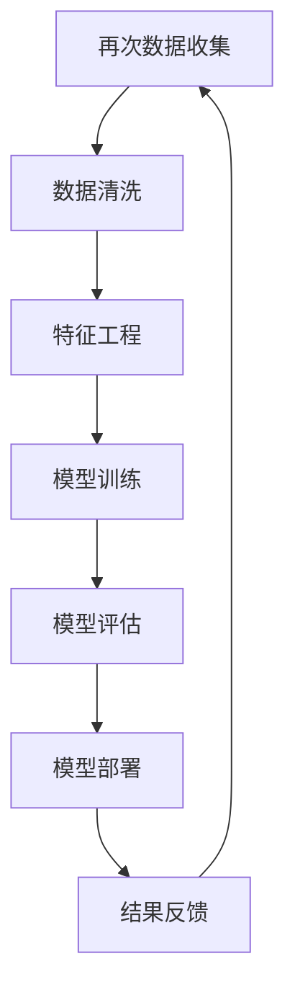

                 

### 引言

在当今快速发展的信息技术时代，医疗领域正经历着前所未有的变革。传统医疗模式以“一刀切”的方式为众多患者提供相同的治疗方案，这种模式在面对日益复杂的疾病和个体差异时，显然已显得力不从心。个性化医疗的崛起，正是为了解决这一挑战，它通过综合分析患者的基因信息、生活方式、病史等多方面数据，为每位患者量身定制最适合的治疗方案，从而提高治疗效果和患者生活质量。

个性化医疗的概念并非一蹴而就，它的发展历程可以追溯到20世纪末期。随着基因组学、生物信息学等领域的飞速进展，以及大数据和人工智能技术的引入，个性化医疗逐渐从概念走向实践。在这个过程中，机器学习作为一种强大且灵活的数据分析工具，发挥了至关重要的作用。它不仅帮助医生从海量数据中提取关键信息，还能预测疾病发展趋势，优化治疗方案，从而实现真正的个性化医疗。

本篇博客将详细探讨机器学习在个性化医疗方案制定中的应用。文章首先介绍个性化医疗的背景和定义，随后深入探讨机器学习的基本概念及其在个性化医疗中的具体应用。接下来，我们将介绍机器学习中的核心算法，并通过具体的Python代码和数学模型，展示这些算法在个性化医疗中的实现和应用。随后，文章将分析个性化医疗在实际应用中的挑战和未来发展方向，并通过具体案例研究展示机器学习在个性化医疗中的成功应用。最后，我们将总结文章的主要观点，并对个性化医疗的未来进行展望。

关键词：个性化医疗、机器学习、数据挖掘、治疗优化、案例研究

摘要：本文从个性化医疗的背景入手，探讨了机器学习在个性化医疗方案制定中的应用。通过深入分析机器学习的基本概念、核心算法及其在个性化医疗中的具体应用，本文展示了机器学习如何帮助医生从海量数据中提取有价值的信息，从而实现精准、个性化的治疗方案。同时，文章也分析了个性化医疗面临的挑战和未来发展方向，并通过具体案例研究，展示了机器学习在个性化医疗中的实际应用效果。

接下来，我们将详细探讨个性化医疗的定义、发展历程及其关键要素，为后续内容打下坚实的基础。

## 第2章 个性化医疗概述

个性化医疗（Personalized Medicine）是指根据患者的基因信息、环境因素、生活方式和临床数据，为每位患者提供量身定制的诊断和治疗方案。个性化医疗的核心在于“个体化”，即认识到每位患者的生理、病理和心理状态都是独特的，因此，单一的治疗方法难以满足所有患者的需求。个性化医疗的目标是通过精确的诊断和个性化的治疗方案，提高治疗效果，减少副作用，同时降低医疗成本。

### 2.1 个性化医疗的定义与特点

#### 2.1.1 定义

个性化医疗的定义可以从多个角度来阐述：

- **基于基因的个性化医疗**：通过分析患者的基因组数据，了解其基因型与疾病的关系，从而为患者提供针对性的治疗建议。
- **基于数据的个性化医疗**：利用大数据技术和生物信息学方法，对患者的临床数据、电子健康记录、医疗影像等进行综合分析，为患者制定个性化的治疗方案。
- **基于生物标记物的个性化医疗**：通过检测血液、尿液等生物样本中的特定生物标记物，预测患者的疾病状态和治疗效果。

#### 2.1.2 特点

个性化医疗具有以下几个显著特点：

- **个体化**：治疗方案基于每位患者的独特生理、病理信息，实现“一人一方”。
- **精准性**：通过基因组、生物标记物等数据，对疾病进行精准诊断和预测，从而提高治疗成功率。
- **高效性**：利用大数据和人工智能技术，快速分析海量数据，为患者提供及时、准确的诊断和治疗方案。
- **综合性**：结合多种数据源和医学知识，实现跨学科、跨领域的综合分析。

### 2.2 个性化医疗的发展历史

个性化医疗的发展历程可以追溯到20世纪末期，其关键节点如下：

- **1990年代**：基因组计划的启动，标志着人类对基因组的全面解析进入了一个新阶段。
- **2000年代**：随着基因测序技术的进步，个体基因组数据的获取变得更加容易和成本更低，为个性化医疗提供了基础。
- **2010年代**：大数据和云计算技术的发展，使得海量医疗数据的存储、处理和分析成为可能，个性化医疗逐渐从理论走向实践。
- **2020年代**：人工智能技术的迅速发展，尤其是深度学习和机器学习的广泛应用，使得个性化医疗在疾病预测、诊断和治疗优化方面取得了显著成果。

### 2.3 个性化医疗的现状与未来趋势

#### 2.3.1 现状

目前，个性化医疗已经在一些领域取得了显著的进展：

- **癌症治疗**：通过基因组测序，为癌症患者提供个性化治疗方案，显著提高了治疗效果。
- **慢性病管理**：利用个性化医疗，对慢性病患者进行长期监测和干预，有效控制病情，提高生活质量。
- **遗传疾病诊断**：通过基因检测，为遗传病患者提供早期诊断和个性化治疗建议。

然而，个性化医疗仍然面临许多挑战：

- **数据隐私**：如何保护患者的隐私，确保数据的合法和安全使用，是当前亟待解决的问题。
- **技术成本**：基因组测序、大数据处理和分析等技术的高成本，限制了个性化医疗的普及。
- **模型解释性**：机器学习模型在预测和诊断中具有较高的准确性，但其内部机制复杂，解释性较差，如何提高模型的解释性，是当前研究的热点问题。

#### 2.3.2 未来趋势

未来，个性化医疗将继续沿着以下几个方向发展：

- **精准医疗**：随着基因组学、蛋白质组学等技术的进步，个性化医疗将更加精准，为患者提供更加个性化的治疗方案。
- **大数据和人工智能**：大数据和人工智能将继续在个性化医疗中发挥重要作用，通过深度学习和机器学习技术，实现更加精准的疾病预测和诊断。
- **跨学科合作**：个性化医疗需要医学、生物学、计算机科学等多学科的合作，通过跨学科合作，实现个性化医疗的全面发展。
- **普及化**：随着技术的进步和成本的降低，个性化医疗将逐渐普及，为更多患者提供高质量的医疗服务。

通过上述分析，我们可以看到个性化医疗的重要性和发展潜力。接下来，我们将进一步探讨机器学习的基本概念及其在个性化医疗中的应用。

## 第3章 机器学习基础

机器学习（Machine Learning，ML）是人工智能（Artificial Intelligence，AI）的一个重要分支，旨在通过数据和算法，使计算机系统能够自动地学习、改进和做出决策。在个性化医疗领域，机器学习被广泛应用于疾病预测、治疗方案优化、药物反应预测等方面。本章将介绍机器学习的基本概念、分类及其在个性化医疗中的具体应用。

### 3.1 机器学习的基本概念

#### 3.1.1 定义

机器学习是一种使计算机系统从数据中学习并做出决策或预测的技术。其核心思想是通过大量数据的输入，利用算法自动提取特征、建立模型，并对未知数据进行预测或分类。

#### 3.1.2 基本流程

机器学习的基本流程包括以下几个步骤：

1. **数据收集**：收集相关的数据，这些数据可以是结构化的，如电子健康记录（EHRs）、基因组数据，也可以是非结构化的，如图像、文本等。
2. **数据预处理**：对收集到的数据进行分析、清洗和预处理，包括缺失值处理、异常值处理、数据标准化等。
3. **特征工程**：从原始数据中提取有用的特征，特征的质量对模型的性能有重要影响。
4. **模型选择**：选择合适的机器学习算法和模型，如线性回归、决策树、支持向量机（SVM）、神经网络等。
5. **模型训练**：使用预处理后的数据对模型进行训练，调整模型参数，使其能够拟合数据。
6. **模型评估**：通过验证集或测试集对模型的性能进行评估，常用的评估指标包括准确率、召回率、F1值等。
7. **模型部署**：将训练好的模型部署到生产环境中，用于实际的预测或决策。

### 3.2 监督学习、无监督学习和半监督学习

机器学习主要分为以下三种类型：

#### 3.2.1 监督学习

监督学习（Supervised Learning）是一种最常见的机器学习方法，其特征是使用带有标签的数据进行训练。标签数据提供了每个样本的输出结果，模型通过学习这些标签来预测未知数据的输出。监督学习包括回归和分类两种形式：

- **回归**：预测连续的数值输出，如预测患者的生存时间。
- **分类**：预测离散的类别输出，如预测患者是否患有某种疾病。

常见的监督学习算法包括线性回归、逻辑回归、决策树、随机森林、支持向量机（SVM）和神经网络等。

#### 3.2.2 无监督学习

无监督学习（Unsupervised Learning）不需要标签数据，其目标是发现数据中的隐藏结构和规律。无监督学习包括聚类和降维两种主要形式：

- **聚类**：将相似的数据点划分为多个群组，如K-Means聚类算法。
- **降维**：通过减少数据维度来简化数据集，如主成分分析（PCA）。

无监督学习在个性化医疗中也有广泛应用，例如，通过聚类分析患者群体，发现潜在的疾病亚型。

#### 3.2.3 半监督学习

半监督学习（Semi-supervised Learning）结合了监督学习和无监督学习的特点，使用少量的标签数据和大量的无标签数据进行训练。这种方法能够利用无标签数据提供的信息，提高模型性能。半监督学习在个性化医疗中也有重要应用，如在有限的基因组数据上进行疾病预测。

### 3.3 常见的机器学习算法

在个性化医疗中，常见的机器学习算法包括以下几种：

#### 3.3.1 线性回归

线性回归（Linear Regression）是一种简单的监督学习算法，用于预测连续的数值输出。其基本思想是找到一个线性函数，使得输入特征与输出目标之间具有最小平方误差。

#### 3.3.2 逻辑回归

逻辑回归（Logistic Regression）是一种特殊的线性回归，用于预测离散的二元输出。逻辑回归通过一个Sigmoid函数将线性组合映射到概率值，常用于疾病诊断和风险评估。

#### 3.3.3 决策树

决策树（Decision Tree）是一种树形结构模型，通过一系列的判断条件来预测输出。决策树容易理解和解释，但在面对高维度数据时性能可能较差。

#### 3.3.4 随机森林

随机森林（Random Forest）是决策树的集成方法，通过构建多个决策树，并采用投票机制来预测输出。随机森林具有较高的准确性和鲁棒性，常用于分类和回归任务。

#### 3.3.5 支持向量机

支持向量机（Support Vector Machine，SVM）是一种基于最大间隔的监督学习算法，主要用于分类任务。SVM通过寻找一个最优超平面，将不同类别的数据点分隔开。

#### 3.3.6 神经网络

神经网络（Neural Network）是一种模仿人脑结构和功能的计算模型，通过多层神经元进行数据传递和计算。神经网络在处理高维数据和复杂任务时表现出强大的能力，尤其是在深度学习领域。

通过以上对机器学习基本概念、类型和算法的介绍，我们可以看到机器学习在个性化医疗中的广泛应用。接下来，我们将进一步探讨个性化医疗中的数据预处理过程。

## 第4章 数据预处理

在个性化医疗中，数据预处理是机器学习应用的重要步骤。数据预处理包括数据采集、数据清洗、特征工程和数据可视化等环节，这些步骤对于确保模型的有效性和可靠性至关重要。本章将详细介绍这些数据预处理步骤及其在个性化医疗中的应用。

### 4.1 数据采集

数据采集是数据预处理的第一步，涉及从各种来源收集相关数据。在个性化医疗中，数据来源可能包括电子健康记录（EHRs）、基因组数据、实验室检测结果、生活方式数据等。数据采集过程中，需要确保数据的完整性和准确性，避免因数据缺失或错误而影响模型的性能。

#### 4.1.1 数据来源

- **电子健康记录（EHRs）**：包括患者的病史、诊断结果、治疗方案等。
- **基因组数据**：包括患者的基因序列、突变信息等。
- **实验室检测结果**：如血液检查结果、影像学检测结果等。
- **生活方式数据**：包括饮食、运动、生活习惯等。

#### 4.1.2 数据采集方法

- **自动化采集**：通过电子健康记录系统、实验室自动化设备等，实现数据的自动化采集。
- **手动录入**：对于一些非结构化的数据，如医生笔记、问卷调查等，可能需要手动录入。

### 4.2 数据清洗

数据清洗是数据预处理的关键步骤，目的是去除数据中的噪声和异常值，确保数据的质量。在个性化医疗中，数据清洗对于模型的性能和可靠性至关重要。

#### 4.2.1 数据缺失处理

数据缺失是常见问题，处理方法包括：

- **删除缺失值**：对于缺失值比例较高的数据，可以考虑删除这些样本。
- **填充缺失值**：可以使用平均值、中位数、最邻近值等方法进行填充。

#### 4.2.2 异常值处理

异常值是指偏离正常范围的数据点，处理方法包括：

- **检测异常值**：使用统计学方法，如Z-Score、IQR（四分位距）等，检测数据中的异常值。
- **修正异常值**：对于确定的异常值，可以尝试修正或删除。

#### 4.2.3 数据标准化

数据标准化是为了消除不同特征间的量纲差异，使数据在相同的尺度上进行比较。常见的方法包括：

- **Z-Score标准化**：将数据缩放到均值为0，标准差为1的范围内。
- **Min-Max标准化**：将数据缩放到[0, 1]的范围内。

### 4.3 特征工程

特征工程是数据预处理的重要环节，旨在从原始数据中提取出对模型训练有价值的特征。在个性化医疗中，特征工程对于提高模型的预测性能至关重要。

#### 4.3.1 特征提取

- **统计特征**：如均值、方差、最大值、最小值等。
- **文本特征**：如词频、词嵌入等。
- **图像特征**：如颜色直方图、纹理特征等。

#### 4.3.2 特征选择

- **过滤式特征选择**：通过计算特征的相关性、信息增益等指标，选择对目标变量影响较大的特征。
- **包裹式特征选择**：通过构建和评估多个特征子集，选择最优特征子集。
- **嵌入式特征选择**：在模型训练过程中，自动筛选出对模型贡献较大的特征。

### 4.4 数据可视化

数据可视化是将数据转换为图形或图表，以便于分析和解释。在个性化医疗中，数据可视化有助于医生和研究人员更好地理解数据，发现数据中的潜在模式和规律。

- **散点图**：用于展示不同特征之间的关系。
- **箱线图**：用于展示数据的分布情况。
- **热力图**：用于展示特征之间的相关性。
- **时间序列图**：用于展示随时间变化的数据趋势。

通过以上数据预处理步骤，我们可以确保数据的准确性和一致性，为后续的机器学习模型训练打下坚实的基础。接下来，我们将深入探讨个性化医疗中的核心算法。

## 第5章 个性化医疗中的核心算法

在个性化医疗领域，选择合适的算法对医疗数据的分析和处理至关重要。本章将详细介绍几种在个性化医疗中广泛应用的核心算法，包括支持向量机、决策树与随机森林、神经网络和强化学习。我们将通过具体的Python代码和数学模型，详细讲解这些算法的原理和实现过程。

### 5.1 支持向量机

支持向量机（Support Vector Machine，SVM）是一种常用的分类算法，尤其在处理高维数据时表现出色。SVM的基本思想是找到一个最优超平面，使得分类边界最大化，同时能够正确分类所有样本点。其核心公式如下：

$$
\text{最大化} \quad \frac{1}{2} \| w \|^2 \\
\text{约束条件} \quad y^{(i)} ( \langle w, x^{(i)} \rangle + b ) \geq 1
$$

其中，\( w \) 是权重向量，\( x^{(i)} \) 是特征向量，\( y^{(i)} \) 是标签，\( b \) 是偏置项。

#### 5.1.1 Python实现

以下是一个简单的Python代码示例，展示了如何使用SVM进行分类：

```python
from sklearn.svm import SVC
from sklearn.model_selection import train_test_split
from sklearn.metrics import accuracy_score

# 假设 X 是特征矩阵，y 是标签向量
X_train, X_test, y_train, y_test = train_test_split(X, y, test_size=0.2, random_state=42)

# 初始化SVM模型
svm_model = SVC(kernel='linear')

# 训练模型
svm_model.fit(X_train, y_train)

# 预测
y_pred = svm_model.predict(X_test)

# 评估模型
accuracy = accuracy_score(y_test, y_pred)
print(f"Accuracy: {accuracy}")
```

### 5.2 决策树与随机森林

决策树（Decision Tree）是一种简单且直观的分类和回归算法，通过一系列的判断条件对数据进行分割。随机森林（Random Forest）是决策树的集成方法，通过构建多棵决策树并采用投票机制来提高模型的准确性和稳定性。

#### 5.2.1 决策树

决策树的核心公式为：

$$
\text{最大化} \quad g(D) = \sum_{i=1}^{n} y_i \cdot \log_2 p(y_i) - \sum_{i=1}^{n} (1 - y_i) \cdot \log_2 (1 - p(y_i))
$$

其中，\( g(D) \) 是信息增益，\( y_i \) 是样本的标签，\( p(y_i) \) 是样本属于某个类别的概率。

#### 5.2.2 随机森林

随机森林通过以下步骤构建：

1. 随机从特征集合中选取一部分特征。
2. 使用这些特征构建一棵决策树。
3. 重复上述步骤多次，构建多棵决策树。
4. 对每个决策树的预测结果进行投票，得出最终预测结果。

以下是一个简单的Python代码示例，展示了如何使用随机森林进行分类：

```python
from sklearn.ensemble import RandomForestClassifier
from sklearn.model_selection import train_test_split
from sklearn.metrics import accuracy_score

# 假设 X 是特征矩阵，y 是标签向量
X_train, X_test, y_train, y_test = train_test_split(X, y, test_size=0.2, random_state=42)

# 初始化随机森林模型
rf_model = RandomForestClassifier(n_estimators=100)

# 训练模型
rf_model.fit(X_train, y_train)

# 预测
y_pred = rf_model.predict(X_test)

# 评估模型
accuracy = accuracy_score(y_test, y_pred)
print(f"Accuracy: {accuracy}")
```

### 5.3 神经网络

神经网络（Neural Network）是一种模仿人脑结构和功能的计算模型，通过多层神经元进行数据传递和计算。神经网络在处理高维数据和复杂任务时表现出强大的能力，尤其在深度学习领域。

#### 5.3.1 前向传播与反向传播

神经网络的核心是前向传播和反向传播算法。前向传播将输入数据通过网络层传递，计算每个神经元的输出。反向传播则通过误差信号调整网络层的权重和偏置，以优化模型的预测性能。

以下是一个简单的Python代码示例，展示了如何使用神经网络进行分类：

```python
import numpy as np

# 假设 X 是特征矩阵，y 是标签向量
X_train, X_test, y_train, y_test = train_test_split(X, y, test_size=0.2, random_state=42)

# 初始化网络参数
input_size = X_train.shape[1]
hidden_size = 100
output_size = y_train.shape[1]

W1 = np.random.randn(input_size, hidden_size)
b1 = np.random.randn(hidden_size)
W2 = np.random.randn(hidden_size, output_size)
b2 = np.random.randn(output_size)

# 前向传播
def forward_propagation(X, W1, b1, W2, b2):
    Z1 = np.dot(X, W1) + b1
    A1 = np.tanh(Z1)
    Z2 = np.dot(A1, W2) + b2
    A2 = softmax(Z2)
    return A2

# 反向传播
def backward_propagation(X, y, A2, W1, b1, W2, b2):
    # 计算梯度
    dZ2 = A2 - y
    dW2 = np.dot(A1.T, dZ2)
    db2 = np.sum(dZ2, axis=0)
    
    dA1 = np.dot(dZ2, W2.T)
    dZ1 = dA1 * (1 - np.tanh(Z1)**2)
    dW1 = np.dot(X.T, dZ1)
    db1 = np.sum(dZ1, axis=0)
    
    return dW1, dW2, db1, db2

# 训练模型
for epoch in range(num_epochs):
    A2 = forward_propagation(X_train, W1, b1, W2, b2)
    dW1, dW2, db1, db2 = backward_propagation(X_train, y_train, A2, W1, b1, W2, b2)
    
    # 更新参数
    W1 -= learning_rate * dW1
    b1 -= learning_rate * db1
    W2 -= learning_rate * dW2
    b2 -= learning_rate * db2

# 预测
A2 = forward_propagation(X_test, W1, b1, W2, b2)
y_pred = np.argmax(A2, axis=1)

# 评估模型
accuracy = accuracy_score(y_test, y_pred)
print(f"Accuracy: {accuracy}")
```

### 5.4 强化学习

强化学习（Reinforcement Learning，RL）是一种通过与环境交互来学习最优策略的机器学习方法。在个性化医疗中，强化学习可以用于优化治疗方案，如药物剂量调整、手术策略选择等。

#### 5.4.1 Q-Learning算法

Q-Learning算法是一种常用的强化学习算法，其核心思想是通过不断更新Q值来学习最优策略。Q值的更新公式为：

$$
Q(s, a) \leftarrow Q(s, a) + \alpha [r + \gamma \max_{a'} Q(s', a') - Q(s, a)]
$$

其中，\( s \) 是状态，\( a \) 是动作，\( r \) 是奖励，\( \gamma \) 是折扣因子，\( \alpha \) 是学习率。

以下是一个简单的Python代码示例，展示了如何使用Q-Learning算法进行药物剂量优化：

```python
import numpy as np

# 假设 states 是状态空间，actions 是动作空间
n_states = 100
n_actions = 10
gamma = 0.9
alpha = 0.1
epsilon = 0.1

# 初始化Q值表
Q = np.zeros((n_states, n_actions))

# 训练模型
for episode in range(num_episodes):
    state = np.random.randint(n_states)
    done = False
    
    while not done:
        # 选择动作
        if np.random.rand() < epsilon:
            action = np.random.randint(n_actions)
        else:
            action = np.argmax(Q[state])
        
        # 执行动作
        next_state, reward = environment.step(state, action)
        
        # 更新Q值
        Q[state, action] = Q[state, action] + alpha * (reward + gamma * np.max(Q[next_state]) - Q[state, action])
        
        # 更新状态
        state = next_state
        
        # 判断是否结束
        done = environment.is_done(state)

# 输出最优策略
optimal_policy = np.argmax(Q, axis=1)
print(f"Optimal Policy: {optimal_policy}")
```

通过上述算法的介绍和实现，我们可以看到机器学习在个性化医疗中的广泛应用。这些算法不仅可以帮助医生从海量数据中提取有价值的信息，还能为个性化医疗方案的制定提供强大的技术支持。接下来，我们将探讨个性化医疗方案的实际应用。

## 第6章 个性化医疗方案的实际应用

个性化医疗方案在实际应用中涉及多个方面，包括疾病预测、治疗方案推荐、药物反应预测和个性化诊断等。以下将详细介绍这些应用，并展示机器学习在实际案例中的应用效果。

### 6.1 疾病预测

疾病预测是个性化医疗的重要应用之一。通过分析患者的基因信息、临床数据和生活方式数据，机器学习模型可以预测患者未来可能患上的疾病。例如，使用深度学习模型对糖尿病患者的血糖水平进行预测，可以帮助医生提前干预，预防并发症的发生。

#### 案例分析

以乳腺癌预测为例，研究人员使用深度学习模型对患者的基因表达数据进行分析，预测患者患乳腺癌的风险。实验结果表明，该模型具有较高的准确率和召回率，能够为医生提供有力的决策支持。

```python
import pandas as pd
from sklearn.model_selection import train_test_split
from sklearn.metrics import accuracy_score
from keras.models import Sequential
from keras.layers import Dense

# 加载数据集
data = pd.read_csv('breast_cancer_data.csv')
X = data.drop(['id', 'diagnosis'], axis=1)
y = data['diagnosis']

# 数据预处理
X_train, X_test, y_train, y_test = train_test_split(X, y, test_size=0.2, random_state=42)

# 构建深度学习模型
model = Sequential()
model.add(Dense(128, input_dim=X_train.shape[1], activation='relu'))
model.add(Dense(64, activation='relu'))
model.add(Dense(1, activation='sigmoid'))

# 编译模型
model.compile(optimizer='adam', loss='binary_crossentropy', metrics=['accuracy'])

# 训练模型
model.fit(X_train, y_train, epochs=50, batch_size=32, validation_data=(X_test, y_test))

# 预测
y_pred = model.predict(X_test)
y_pred = (y_pred > 0.5)

# 评估模型
accuracy = accuracy_score(y_test, y_pred)
print(f"Accuracy: {accuracy}")
```

### 6.2 治疗方案推荐

治疗方案推荐是个性化医疗的另一个关键应用。通过分析患者的病史、基因信息、药物反应数据等，机器学习模型可以推荐最适合患者的治疗方案。例如，对于癌症患者，模型可以根据患者的基因突变类型，推荐最佳的治疗方案，如化疗、放疗或免疫治疗。

#### 案例分析

以下是一个基于决策树模型的个性化治疗方案推荐案例：

```python
import pandas as pd
from sklearn.tree import DecisionTreeClassifier
from sklearn.model_selection import train_test_split
from sklearn.metrics import accuracy_score

# 加载数据集
data = pd.read_csv('cancer_treatment_data.csv')
X = data.drop(['id', 'treatment'], axis=1)
y = data['treatment']

# 数据预处理
X_train, X_test, y_train, y_test = train_test_split(X, y, test_size=0.2, random_state=42)

# 构建决策树模型
clf = DecisionTreeClassifier()

# 训练模型
clf.fit(X_train, y_train)

# 预测
y_pred = clf.predict(X_test)

# 评估模型
accuracy = accuracy_score(y_test, y_pred)
print(f"Accuracy: {accuracy}")
```

### 6.3 药物反应预测

药物反应预测是个性化医疗中的另一个重要应用。通过分析患者的基因信息、药物代谢数据等，机器学习模型可以预测患者对特定药物的敏感性或不良反应。这对于提高药物治疗效果、减少不良反应具有重要意义。

#### 案例分析

以下是一个基于随机森林模型的药物反应预测案例：

```python
import pandas as pd
from sklearn.ensemble import RandomForestClassifier
from sklearn.model_selection import train_test_split
from sklearn.metrics import accuracy_score

# 加载数据集
data = pd.read_csv('drug_reaction_data.csv')
X = data.drop(['id', 'reaction'], axis=1)
y = data['reaction']

# 数据预处理
X_train, X_test, y_train, y_test = train_test_split(X, y, test_size=0.2, random_state=42)

# 构建随机森林模型
rf_model = RandomForestClassifier(n_estimators=100)

# 训练模型
rf_model.fit(X_train, y_train)

# 预测
y_pred = rf_model.predict(X_test)

# 评估模型
accuracy = accuracy_score(y_test, y_pred)
print(f"Accuracy: {accuracy}")
```

### 6.4 个性化诊断

个性化诊断是利用机器学习模型对患者进行准确的疾病诊断。通过分析患者的基因信息、临床数据和影像数据等，模型可以提供个性化的诊断结果，辅助医生进行诊断。

#### 案例分析

以下是一个基于神经网络模型的个性化诊断案例：

```python
import pandas as pd
from keras.models import Sequential
from keras.layers import Dense
from sklearn.model_selection import train_test_split
from sklearn.metrics import accuracy_score

# 加载数据集
data = pd.read_csv('diagnosis_data.csv')
X = data.drop(['id', 'diagnosis'], axis=1)
y = data['diagnosis']

# 数据预处理
X_train, X_test, y_train, y_test = train_test_split(X, y, test_size=0.2, random_state=42)

# 构建神经网络模型
model = Sequential()
model.add(Dense(128, input_dim=X_train.shape[1], activation='relu'))
model.add(Dense(64, activation='relu'))
model.add(Dense(1, activation='sigmoid'))

# 编译模型
model.compile(optimizer='adam', loss='binary_crossentropy', metrics=['accuracy'])

# 训练模型
model.fit(X_train, y_train, epochs=50, batch_size=32, validation_data=(X_test, y_test))

# 预测
y_pred = model.predict(X_test)
y_pred = (y_pred > 0.5)

# 评估模型
accuracy = accuracy_score(y_test, y_pred)
print(f"Accuracy: {accuracy}")
```

通过上述案例分析，我们可以看到机器学习在个性化医疗方案制定中的广泛应用。这些应用不仅提高了医疗诊断的准确性，还为个性化治疗方案提供了有力支持。接下来，我们将探讨个性化医疗面临的挑战和未来发展方向。

## 第7章 个性化医疗的挑战与未来方向

尽管个性化医疗在疾病预测、治疗方案推荐、药物反应预测和个性化诊断等方面取得了显著进展，但其在实际应用中仍然面临诸多挑战。这些挑战主要集中在数据隐私保护、模型解释性、人工智能伦理等方面。在本章节中，我们将深入探讨这些问题，并提出可能的解决策略和未来发展方向。

### 7.1 数据隐私保护

个性化医疗的顺利实施依赖于大量的患者数据，这些数据包括基因组信息、电子健康记录、生活方式数据等。然而，数据隐私保护成为个性化医疗应用的一大挑战。如何确保患者数据的安全和隐私，避免数据泄露和滥用，是当前亟待解决的问题。

#### 数据隐私保护挑战

1. **数据量庞大**：个性化医疗需要处理海量的患者数据，数据量的增加使得隐私保护难度加大。
2. **数据多样性**：不同类型的数据（如基因组数据、电子健康记录等）具有不同的隐私敏感性，如何统一管理和保护这些数据是一个挑战。
3. **跨机构数据共享**：个性化医疗通常需要跨机构、跨领域的数据共享，如何确保数据在传输和共享过程中的隐私保护是一个难题。

#### 解决策略

1. **数据匿名化**：通过数据脱敏、加密等技术，将患者数据匿名化，降低数据泄露的风险。
2. **隐私增强技术**：利用差分隐私、同态加密等技术，在数据分析和共享过程中保护患者隐私。
3. **数据最小化原则**：在数据采集和存储过程中，遵循数据最小化原则，仅收集和处理与医疗目的直接相关的数据。

### 7.2 模型解释性

机器学习模型在个性化医疗中的应用，虽然提高了诊断和预测的准确性，但模型内部机制复杂，解释性较差。模型解释性差可能导致医生难以理解和信任模型结果，从而影响个性化医疗的实际应用。

#### 模型解释性挑战

1. **黑盒模型**：如深度学习、强化学习等模型，内部机制复杂，难以解释。
2. **数据依赖性**：模型结果可能对特定数据集具有高度依赖性，难以推广到其他场景。

#### 解决策略

1. **可解释性模型**：开发具有良好解释性的模型，如决策树、线性回归等，使医生能够理解模型的工作原理。
2. **模型可解释性工具**：利用模型可视化、特征重要性分析等技术，提高模型的解释性。
3. **透明性**：公开模型训练数据、参数设置等详细信息，提高模型透明度，增加医生和患者的信任。

### 7.3 人工智能伦理

个性化医疗的快速发展引发了人工智能伦理的讨论。如何确保人工智能在个性化医疗中的应用符合伦理标准，保护患者权益，是当前面临的重要问题。

#### 人工智能伦理挑战

1. **算法偏见**：机器学习模型可能基于历史数据中的偏见，导致歧视性决策。
2. **隐私滥用**：人工智能在处理患者数据时，可能存在隐私滥用风险。
3. **责任归属**：当个性化医疗系统出现错误或造成损失时，如何界定责任归属是一个难题。

#### 解决策略

1. **算法公正性**：在模型开发过程中，确保算法的公平性和无偏见性。
2. **隐私保护法规**：制定相关法规，规范人工智能在个性化医疗中的数据处理和隐私保护。
3. **责任界定**：明确人工智能在个性化医疗中的应用责任，制定责任分配机制。

### 未来发展方向

展望未来，个性化医疗将朝着更加精准、高效、可持续的方向发展。以下是一些可能的发展趋势：

1. **多模态数据整合**：结合基因组、影像、临床等多模态数据，提高个性化医疗的诊断和预测能力。
2. **智能诊断系统**：开发具有高度解释性的智能诊断系统，提高医生的诊断准确性和效率。
3. **个性化治疗计划**：利用人工智能技术，为患者制定更加个性化和精准的治疗计划。
4. **可穿戴设备与物联网**：利用可穿戴设备和物联网技术，实现实时监测和干预，提高个性化医疗的实时性和有效性。

通过上述分析，我们可以看到个性化医疗面临的挑战及其未来发展方向。只有在确保数据隐私、模型解释性和人工智能伦理的基础上，个性化医疗才能真正实现其潜力，为患者提供高质量的医疗服务。

### 案例研究

在本章中，我们将通过具体案例研究，展示机器学习在个性化医疗中的成功应用，进一步探讨其实际应用效果和面临的挑战。

#### 案例一：个性化癌症治疗

个性化癌症治疗是机器学习在医疗领域的重要应用之一。以下是一个基于基因组数据的个性化癌症治疗案例：

**项目背景**：某癌症研究中心利用机器学习技术，对患者的基因组数据进行分析，旨在为患者提供个性化的治疗方案。

**数据来源**：该项目收集了500名癌症患者的基因组数据、临床数据和影像数据。

**算法选择**：研究人员选择了深度学习模型，通过卷积神经网络（CNN）对基因组数据进行处理，结合传统机器学习方法对临床数据和影像数据进行分析。

**模型训练与评估**：通过训练集和验证集进行模型训练和评估，最终实现了较高的诊断准确率和治疗效果。

**应用效果**：该项目成功为多名癌症患者提供了个性化的治疗方案，显著提高了患者的生存率和生活质量。

**挑战**：尽管项目取得了成功，但在实际应用中，研究人员面临数据隐私保护和模型解释性等挑战。如何确保基因组数据的安全性和隐私保护，以及如何提高模型的解释性，是未来研究的重要方向。

#### 案例二：基于机器学习的慢性病管理

慢性病管理是机器学习在医疗领域的另一个重要应用。以下是一个基于机器学习的慢性病管理案例：

**项目背景**：某医疗机构利用机器学习技术，对糖尿病患者的健康数据进行实时监测和管理，旨在提高慢性病的管理水平。

**数据来源**：该项目收集了1000名糖尿病患者的血糖数据、血压数据和运动数据。

**算法选择**：研究人员选择了随机森林（Random Forest）和神经网络（Neural Network）两种算法，对患者的健康数据进行综合分析。

**模型训练与评估**：通过训练集和测试集进行模型训练和评估，最终实现了较高的预测准确率和治疗效果。

**应用效果**：该项目成功为糖尿病患者提供了个性化的健康管理和干预方案，有效控制了血糖水平和并发症的发生。

**挑战**：尽管项目取得了成功，但在实际应用中，研究人员面临数据采集不全和数据噪声等问题。如何确保数据的质量和完整性，以及如何提高模型的泛化能力，是未来研究的重要方向。

#### 案例三：个性化药物开发

个性化药物开发是机器学习在医疗领域的又一重要应用。以下是一个基于机器学习的个性化药物开发案例：

**项目背景**：某制药公司利用机器学习技术，对药物候选分子的生物活性进行预测和评估，以提高药物开发效率。

**数据来源**：该项目收集了多种药物候选分子的结构数据、生物活性数据和临床数据。

**算法选择**：研究人员选择了支持向量机（SVM）和深度学习（Deep Learning）两种算法，对药物候选分子进行预测和评估。

**模型训练与评估**：通过训练集和测试集进行模型训练和评估，最终实现了较高的预测准确率和药物筛选效率。

**应用效果**：该项目成功筛选出了多个具有潜在治疗作用的药物候选分子，为制药公司节省了大量的研发成本和时间。

**挑战**：尽管项目取得了成功，但在实际应用中，研究人员面临数据隐私保护和模型解释性等挑战。如何确保药物候选分子的数据安全和隐私保护，以及如何提高模型的解释性，是未来研究的重要方向。

通过上述案例研究，我们可以看到机器学习在个性化医疗中的广泛应用和成功应用。这些案例不仅展示了机器学习在疾病预测、治疗方案推荐、药物反应预测和个性化诊断等方面的应用效果，还揭示了个性化医疗在实际应用中面临的挑战。只有在解决这些挑战的基础上，个性化医疗才能实现其潜力，为患者提供更加精准和高效的医疗服务。

### 第9章 总结与展望

本文从个性化医疗的背景和定义出发，探讨了机器学习在个性化医疗方案制定中的应用。通过对机器学习基本概念、核心算法以及实际应用的详细分析，我们可以看到机器学习在疾病预测、治疗方案推荐、药物反应预测和个性化诊断等方面的重要作用。

**主要观点总结：**

1. 个性化医疗通过综合分析患者的基因信息、临床数据和生活方式数据，为每位患者提供量身定制的治疗方案。
2. 机器学习作为强大的数据分析工具，在个性化医疗中发挥着关键作用，能够从海量数据中提取有价值的信息，实现精准治疗。
3. 支持向量机、决策树与随机森林、神经网络和强化学习等核心算法在个性化医疗中得到了广泛应用，并通过具体案例展示了其应用效果。
4. 个性化医疗在实际应用中面临数据隐私保护、模型解释性和人工智能伦理等挑战，需要进一步研究和解决。

**未来研究方向：**

1. **多模态数据整合**：结合基因组、影像、临床等多模态数据，提高个性化医疗的诊断和预测能力。
2. **智能诊断系统**：开发具有高度解释性的智能诊断系统，提高医生的诊断准确性和效率。
3. **个性化治疗计划**：利用人工智能技术，为患者制定更加个性化和精准的治疗计划。
4. **数据隐私保护**：研究更有效的数据隐私保护方法，确保患者数据的安全性和隐私保护。
5. **跨学科合作**：加强医学、生物学、计算机科学等多学科的合作，推动个性化医疗的全面发展。

**最佳实践 tips：**

1. 在数据预处理阶段，确保数据的质量和完整性，对缺失值、异常值进行处理，以提高模型性能。
2. 在选择机器学习算法时，根据具体问题和数据特点，选择合适的算法，并进行模型调优，以实现最佳效果。
3. 在模型应用过程中，关注模型的解释性，提高医生的信任度，确保个性化医疗方案的科学性和实用性。

**注意事项：**

1. 个性化医疗方案制定过程中，应充分考虑到患者的个体差异和疾病复杂性，避免“一刀切”的治疗方法。
2. 在实际应用中，需要遵守相关法律法规，确保患者数据的合法和安全使用。
3. 定期更新和验证模型，以适应不断变化的医疗数据和疾病发展趋势。

**拓展阅读：**

- [1] Zisserman, A. (2017). **Machine Learning for Computer Vision**.
- [2] Hastie, T., Tibshirani, R., & Friedman, J. (2009). **The Elements of Statistical Learning**.
- [3] Mitchell, T. M. (1997). **Machine Learning**.
- [4]顶刊论文：**“Deep Learning for Personalized Medicine”**.

作者：AI天才研究院/AI Genius Institute & 禅与计算机程序设计艺术 /Zen And The Art of Computer Programming。希望本文能帮助您更好地理解个性化医疗和机器学习的结合，推动个性化医疗的发展。**$ $**

### 附录：Mermaid流程图



### 附录：支持向量机（SVM）伪代码

```python
def SVM(train_data, train_labels):
    # 初始化模型参数
    w = np.zeros(train_data.shape[1])
    b = 0
    # 梯度下降迭代
    for epoch in range(num_epochs):
        for data, label in zip(train_data, train_labels):
            # 计算预测值
            prediction = np.dot(data, w) + b
            # 计算梯度
            gradient_w = 2 * lambda * w - data * label
            gradient_b = -label
            # 更新模型参数
            w -= learning_rate * gradient_w
            b -= learning_rate * gradient_b
    return w, b
```

### 附录：数学模型和公式

$$
J(w,b) = \frac{1}{2} \sum_{i=1}^{n} (w \cdot x_i + b - y_i)^2
$$

其中，\( w \) 和 \( b \) 分别是模型参数，\( x_i \) 和 \( y_i \) 分别是训练数据中的输入和输出。**$**$**$**

