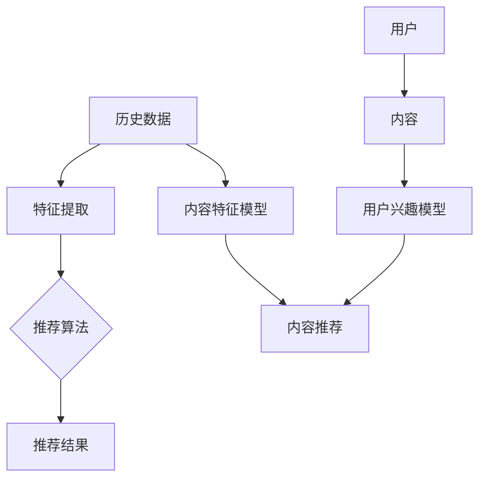

                 

# 个性化学习内容推荐中的核心概念与联系

## 1. Mermaid 流程图

在个性化学习内容推荐系统中，用户、内容、历史数据、推荐算法和推荐结果之间的联系是一个核心概念。以下是一个Mermaid流程图，展示了这些概念之间的互动关系：



这个流程图解释了用户的历史行为数据如何被转化为用户兴趣模型，以及内容特征模型如何帮助推荐算法生成个性化推荐结果。

### 1.1 用户与内容

用户是个性化学习内容推荐系统的核心。用户的历史数据（如学习记录、偏好、评价等）是构建用户兴趣模型的基础。内容则是用户学习的对象，内容特征模型则描述了每个内容的特点，如主题、难度、时长等。

### 1.2 历史数据与特征提取

历史数据包含了用户的学习行为和内容属性，通过特征提取，可以将这些数据转化为推荐算法可处理的格式。特征提取过程包括数据清洗、转换和降维等步骤，目的是提取出对推荐最重要的信息。

### 1.3 推荐算法与推荐结果

推荐算法基于用户兴趣模型和内容特征模型，利用机器学习技术生成推荐结果。常见的推荐算法有基于内容的推荐、协同过滤推荐和基于模型的推荐等。推荐结果的目标是提高用户的满意度和参与度。

### 1.4 用户兴趣模型与内容推荐

用户兴趣模型是推荐系统的关键，它通过分析用户的历史行为，捕捉用户的兴趣和偏好。这个模型可以用于预测用户对特定内容的潜在兴趣，从而生成个性化的推荐。

### 1.5 内容特征模型与内容推荐

内容特征模型描述了学习内容的属性，如文本、图像、音频和视频特征等。这个模型帮助推荐系统理解不同内容之间的相似性，从而为用户推荐相似的内容。

## 2. 核心算法原理讲解

### 2.1 基于内容的推荐算法

基于内容的推荐算法通过分析用户过去的偏好和内容特征，为用户推荐相似的内容。其核心思想是“物以类聚”，即如果用户喜欢某个内容，那么他们也可能喜欢与其具有相似特征的其他内容。

伪代码如下：

```python
def content_based_recommendation(content, user_profile, content_features):
    # 计算内容之间的相似度
    similarity = compute_similarity(content, user_profile)
    
    # 根据相似度排序推荐结果
    recommended_items = sort_by_similarity(similarity)
    
    return recommended_items
```

在上述伪代码中，`compute_similarity`函数用于计算内容之间的相似度，`sort_by_similarity`函数用于根据相似度排序推荐结果。

### 2.2 协同过滤推荐算法

协同过滤推荐算法通过分析用户之间的行为模式，发现相似的群体，并基于这些群体的共同偏好进行推荐。协同过滤分为两种：用户基于的协同过滤和项基于的协同过滤。

伪代码如下：

```python
def collaborative_filtering(user_history, item_ratings, k):
    # 计算用户之间的相似度
    user_similarity = compute_similarity(user_history, item_ratings)
    
    # 计算预测评分
    predicted_ratings = predict_ratings(user_similarity, item_ratings)
    
    # 根据预测评分排序推荐结果
    recommended_items = sort_by_rating(predicted_ratings)
    
    return recommended_items
```

在这个伪代码中，`compute_similarity`函数用于计算用户之间的相似度，`predict_ratings`函数用于根据相似度预测用户的评分，`sort_by_rating`函数用于根据预测评分排序推荐结果。

通过这些核心算法的讲解，我们可以更深入地理解个性化学习内容推荐系统中各组件之间的相互作用，以及如何通过机器学习技术实现个性化推荐。接下来，我们将进一步探讨这些算法在实践中的应用和实现细节。

