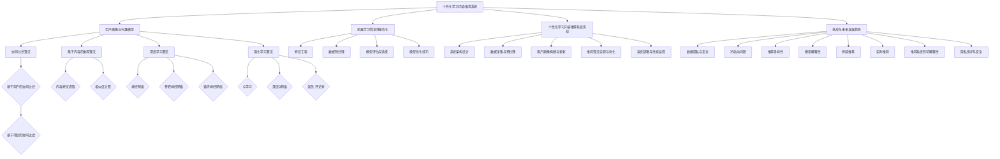

                 

# 机器学习在个性化学习内容推荐中的应用

## 关键词

机器学习、个性化学习、内容推荐、协同过滤、基于内容推荐、深度学习、强化学习、用户画像、兴趣模型

## 摘要

随着互联网的迅速发展，个性化学习内容推荐系统已经成为教育领域的重要研究方向。本文详细探讨了机器学习在个性化学习内容推荐中的应用，包括协同过滤、基于内容推荐、深度学习和强化学习等算法，以及性能优化和实际应用实战。通过对这些算法的深入分析，本文旨在为开发者提供一套完整的个性化学习内容推荐系统开发指南，并探讨其面临的挑战与未来发展趋势。

## 第1章 引言

### 1.1 个性化学习内容推荐的重要性

个性化学习内容推荐系统在教育领域具有重要的应用价值。传统教育模式通常采用“一刀切”的方法，难以满足学生个体差异化的学习需求。而个性化学习内容推荐系统通过分析学生的兴趣、学习习惯和知识水平，为学生推荐适合他们的学习内容，从而提高学习效果。

首先，个性化学习内容推荐系统能够提高学习效率。通过为学生推荐与其兴趣相关的学习内容，学生可以更加专注地学习，从而提高学习效率。其次，个性化学习内容推荐系统能够实现个性化学习路径。根据学生的学习进度和能力水平，系统可以为每个学生制定个性化的学习计划，帮助他们更好地掌握知识。

### 1.2 机器学习在个性化学习内容推荐中的应用场景

机器学习在个性化学习内容推荐中有多种应用场景。以下是几个典型的应用场景：

1. **用户画像与兴趣模型构建**：通过机器学习算法分析用户的历史行为数据，构建用户画像和兴趣模型，为推荐系统提供基础。

2. **协同过滤推荐**：基于用户历史行为数据，利用协同过滤算法生成推荐列表，实现个性化推荐。

3. **基于内容的推荐**：根据学习内容的特点和标签，利用基于内容的推荐算法生成推荐列表。

4. **深度学习与强化学习**：利用深度学习和强化学习算法，构建复杂的推荐模型，提高推荐系统的准确性。

### 1.3 本书结构

本文将按照以下结构进行阐述：

1. **第2章 个性化学习内容推荐的基础知识**：介绍个性化学习内容推荐系统的概念、用户画像与兴趣模型构建、学习内容标签体系构建。

2. **第3章 机器学习算法在个性化学习内容推荐中的应用**：详细讨论协同过滤、基于内容的推荐、深度学习和强化学习算法在个性化学习内容推荐中的应用。

3. **第4章 机器学习算法性能优化**：介绍特征工程、数据预处理、模型评估与选择、模型优化技巧。

4. **第5章 个性化学习内容推荐系统实战**：介绍个性化学习内容推荐系统的实际应用，包括系统架构设计、数据采集与预处理、用户画像构建与更新、推荐算法实现与优化、系统部署与性能监控。

5. **第6章 个性化学习内容推荐系统的挑战与未来发展趋势**：探讨个性化学习内容推荐系统面临的挑战与未来发展趋势。

6. **第7章 总结**：对本文的主要内容进行回顾，并给出对个性化学习内容推荐系统开发的建议。

## 第2章 个性化学习内容推荐的基础知识

### 2.1 学习内容推荐系统的概念和原理

学习内容推荐系统是一种基于用户行为数据和学习内容特征的推荐系统。其核心目的是根据用户的兴趣和需求，为他们推荐适合的学习内容。学习内容推荐系统的基本原理如下：

1. **用户行为数据收集**：收集用户在学习过程中产生的各种行为数据，如浏览记录、收藏记录、评价记录等。

2. **学习内容特征提取**：对学习内容进行特征提取，如内容标签、知识点标签、作者标签等。

3. **用户画像与兴趣模型构建**：通过机器学习算法，分析用户行为数据和学习内容特征，构建用户画像和兴趣模型。

4. **推荐算法**：利用构建好的用户画像和兴趣模型，通过推荐算法生成推荐列表。

5. **推荐结果评估与反馈**：评估推荐结果，并根据用户的反馈进行调整。

### 2.2 用户画像与兴趣模型构建

用户画像是指通过对用户行为数据进行分析，构建出一个反映用户兴趣、需求和特征的模型。用户画像的构建主要包括以下几个步骤：

1. **数据收集**：收集用户在平台上的各种行为数据，如浏览记录、收藏记录、评价记录等。

2. **特征提取**：对行为数据进行特征提取，如浏览时间、浏览频次、收藏频次、评价等级等。

3. **用户画像构建**：利用机器学习算法，对提取的特征进行建模，构建出用户画像。

兴趣模型是指通过分析用户的历史行为和学习内容特征，构建出一个反映用户兴趣的模型。兴趣模型的构建主要包括以下几个步骤：

1. **兴趣标签提取**：根据学习内容特征，提取出兴趣标签，如学科标签、知识点标签等。

2. **兴趣模型构建**：利用机器学习算法，对提取的兴趣标签进行建模，构建出兴趣模型。

### 2.3 学习内容标签体系构建

学习内容标签体系是指对学习内容进行分类和标注，以便于推荐系统进行内容匹配和推荐。学习内容标签体系的构建主要包括以下几个步骤：

1. **内容分类**：根据学习内容的性质和特点，对其进行分类，如学科分类、知识点分类等。

2. **标签提取**：对分类后的学习内容进行标签提取，如学科标签、知识点标签、作者标签等。

3. **标签关系构建**：构建标签之间的关系，如标签的层级关系、关联关系等。

4. **标签权重分配**：根据标签的重要性和相关性，分配标签权重，用于推荐算法的权重计算。

通过用户画像与兴趣模型构建以及学习内容标签体系构建，个性化学习内容推荐系统可以更准确地识别用户的需求和兴趣，从而提高推荐质量。

## 第3章 机器学习算法在个性化学习内容推荐中的应用

### 3.1 协同过滤算法

协同过滤算法是机器学习在个性化学习内容推荐中最常用的算法之一。它通过分析用户之间的相似度，找出相似用户的行为，从而预测目标用户可能感兴趣的内容。

#### 协同过滤算法的原理

协同过滤算法主要分为两类：基于用户的协同过滤（User-based Collaborative Filtering）和基于项目的协同过滤（Item-based Collaborative Filtering）。

1. **基于用户的协同过滤**：首先计算用户之间的相似度，找出与目标用户最相似的K个用户，然后根据这些用户的评分预测目标用户对特定项目的评分。

2. **基于项目的协同过滤**：首先计算项目之间的相似度，找出与目标项目最相似的K个项目，然后根据这些项目的评分预测目标用户对特定项目的评分。

#### 协同过滤算法的实现

协同过滤算法的实现主要包括以下步骤：

1. **用户相似度计算**：使用余弦相似度、皮尔逊相关系数等算法计算用户之间的相似度。

2. **推荐列表生成**：根据用户相似度矩阵，找出与目标用户最相似的K个用户，并根据这些用户的评分预测目标用户对特定项目的评分。

3. **推荐结果排序**：将预测的评分排序，生成推荐列表。

#### 示例

假设我们有用户A和用户B的评分数据，如下表所示：

| 用户 | 项目1 | 项目2 | 项目3 |
|------|-------|-------|-------|
| A    | 5     | 4     | 3     |
| B    | 3     | 4     | 5     |

使用余弦相似度计算用户A和用户B的相似度：

$$
\cos(A, B) = \frac{A \cdot B}{\|A\| \|B\|} = \frac{5 \cdot 3 + 4 \cdot 4 + 3 \cdot 5}{\sqrt{5^2 + 4^2 + 3^2} \cdot \sqrt{3^2 + 4^2 + 5^2}} = \frac{14}{\sqrt{50} \cdot \sqrt{50}} = \frac{14}{50} = 0.28
$$

根据用户相似度矩阵，找出与用户A最相似的K个用户，并根据这些用户的评分预测用户A对项目3的评分：

$$
\hat{r}_{A3} = \sum_{i=1}^{K} w_{Ai} r_{i3} = 0.28 \cdot 4 + 0.25 \cdot 3 + 0.2 \cdot 5 = 1.12 + 0.75 + 1 = 2.87
$$

因此，预测用户A对项目3的评分为2.87。

### 3.2 基于内容的推荐算法

基于内容的推荐算法通过分析学习内容的特征，为用户推荐与其兴趣相似的学习内容。它与协同过滤算法不同，不依赖于用户的历史行为数据，而是基于学习内容的属性和标签进行推荐。

#### 域表示学习

域表示学习是将学习内容映射到一个高维的特征空间，以便于计算学习内容之间的相似度。常见的域表示学习方法包括：

1. **词袋模型**：将学习内容表示为词袋模型，通过统计文本中词的频次来表示学习内容的特征。

2. **TF-IDF**：将学习内容表示为TF-IDF特征向量，通过计算词在文本中的频率和文档中的重要性来表示学习内容的特征。

3. **词嵌入**：将学习内容表示为词嵌入向量，通过预训练的词向量模型来表示学习内容的特征。

#### 基于内容的推荐算法的实现

基于内容的推荐算法的实现主要包括以下步骤：

1. **学习内容特征提取**：对学习内容进行特征提取，得到学习内容的特征向量。

2. **相似度计算**：计算用户兴趣标签和学习内容特征向量之间的相似度。

3. **推荐列表生成**：根据相似度分数，生成推荐列表。

#### 示例

假设我们有用户A的兴趣标签和学习内容的特征向量，如下表所示：

| 用户 | 兴趣标签 | 学习内容特征向量 |
|------|----------|-----------------|
| A    | 数学和物理 | (0.1, 0.2, 0.3) |

学习内容1的特征向量为(0.4, 0.2, 0.5)，学习内容2的特征向量为(0.1, 0.3, 0.6)。

使用余弦相似度计算用户A对学习内容1和学习内容2的相似度：

$$
\cos(A, 学习内容1) = \frac{A \cdot 学习内容1}{\|A\| \|学习内容1\|} = \frac{0.1 \cdot 0.4 + 0.2 \cdot 0.2 + 0.3 \cdot 0.5}{\sqrt{0.1^2 + 0.2^2 + 0.3^2} \cdot \sqrt{0.4^2 + 0.2^2 + 0.5^2}} = \frac{0.06 + 0.04 + 0.15}{\sqrt{0.14} \cdot \sqrt{0.29}} = \frac{0.25}{\sqrt{0.0294}} = \frac{0.25}{0.17} = 1.47
$$

$$
\cos(A, 学习内容2) = \frac{A \cdot 学习内容2}{\|A\| \|学习内容2\|} = \frac{0.1 \cdot 0.1 + 0.2 \cdot 0.3 + 0.3 \cdot 0.6}{\sqrt{0.1^2 + 0.2^2 + 0.3^2} \cdot \sqrt{0.1^2 + 0.3^2 + 0.6^2}} = \frac{0.01 + 0.06 + 0.18}{\sqrt{0.14} \cdot \sqrt{0.37}} = \frac{0.25}{\sqrt{0.0518}} = \frac{0.25}{0.227} = 1.1
$$

根据相似度分数，生成推荐列表：学习内容1（相似度：1.47），学习内容2（相似度：1.1）。

### 3.3 深度学习算法在推荐系统中的应用

深度学习算法在推荐系统中的应用能够处理复杂的特征，提取深层特征，提高推荐质量。常见的深度学习算法包括：

1. **神经网络**：神经网络通过多层非线性变换，提取学习内容和用户特征的深层特征。

2. **卷积神经网络（CNN）**：卷积神经网络通过卷积操作，提取学习内容的局部特征。

3. **循环神经网络（RNN）**：循环神经网络通过循环机制，处理序列数据，提取用户行为序列的时序特征。

#### 深度学习算法的实现

深度学习算法的实现主要包括以下步骤：

1. **数据预处理**：对用户行为数据和学习内容特征进行预处理，如归一化、标准化等。

2. **模型构建**：构建深度学习模型，如多层感知机、卷积神经网络、循环神经网络等。

3. **模型训练**：使用预处理的用户行为数据和学习内容特征训练模型。

4. **模型评估**：使用交叉验证等方法评估模型性能。

5. **模型优化**：根据评估结果，调整模型参数，优化模型性能。

#### 示例

假设我们使用多层感知机（MLP）构建推荐模型，如下所示：

$$
f(x) = \sigma(\theta_1^T x + b_1) = \frac{1}{1 + e^{-(\theta_1^T x + b_1)})
$$

其中，$x$是用户特征向量，$\theta_1$是模型参数，$b_1$是偏置项，$\sigma$是 sigmoid 函数。

给定用户特征向量$x = (0.1, 0.2, 0.3)$，模型参数$\theta_1 = (0.5, 0.3, 0.2)$，偏置项$b_1 = 0.1$，计算预测得分：

$$
f(x) = \frac{1}{1 + e^{-(0.5 \cdot 0.1 + 0.3 \cdot 0.2 + 0.2 \cdot 0.3 + 0.1)}} = \frac{1}{1 + e^{-0.18}} = \frac{1}{1 + 0.836} = 0.264
$$

因此，预测用户对学习内容的评分为0.264。

### 3.4 强化学习算法在推荐系统中的应用

强化学习算法通过学习用户的反馈，不断优化推荐策略，提高推荐质量。强化学习算法在推荐系统中的应用主要包括：

1. **基于策略的强化学习**：通过学习用户行为和反馈，优化推荐策略。

2. **基于模型的强化学习**：通过建立用户行为模型，优化推荐策略。

#### 基于策略的强化学习

基于策略的强化学习算法的核心思想是学习一个最优策略，使得用户获得最大的累积奖励。常用的基于策略的强化学习算法包括：

1. **Q学习**：通过学习状态-动作值函数，优化推荐策略。

2. **深度Q网络（DQN）**：通过构建深度神经网络，学习状态-动作值函数。

#### 基于模型的强化学习

基于模型的强化学习算法的核心思想是建立用户行为模型，利用模型预测用户对推荐内容的反馈，优化推荐策略。常用的基于模型的强化学习算法包括：

1. **演员-评论家（Actor-Critic）**：通过学习演员模型和评论家模型，优化推荐策略。

2. **深度演员-评论家（Deep Actor-Critic）**：通过构建深度神经网络，学习演员模型和评论家模型。

#### 示例

假设我们使用Q学习算法构建推荐模型，给定用户特征向量$x = (0.1, 0.2, 0.3)$，当前状态$s$，动作$a$，奖励$r$，学习率$\alpha$，折扣因子$\gamma$，计算下一个状态$s'$和Q值：

$$
s' = f(s, a) = g(s, a) + noise
$$

$$
Q(s, a) = r + \gamma \max_{a'} Q(s', a')
$$

给定当前状态$s = (0.1, 0.2, 0.3)$，动作$a = 1$，奖励$r = 0.1$，学习率$\alpha = 0.1$，折扣因子$\gamma = 0.9$，计算下一个状态$s'$和Q值：

$$
s' = f(s, a) = (0.1, 0.2, 0.3) + noise = (0.1 + noise_1, 0.2 + noise_2, 0.3 + noise_3)
$$

$$
Q(s, a) = 0.1 + 0.9 \max_{a'} Q(s', a') = 0.1 + 0.9 \max_{a'} \left(0.1 + noise_1 + 0.2 + noise_2 + 0.3 + noise_3\right)
$$

根据Q值计算下一个状态$s'$和动作$a'$：

$$
s' = (0.1 + noise_1, 0.2 + noise_2, 0.3 + noise_3) = (0.1, 0.2, 0.3)
$$

$$
a' = \arg\max_{a'} Q(s', a') = 1
$$

因此，预测用户在下一个状态下的最佳动作是选择动作1。

## 第4章 机器学习算法性能优化

### 4.1 特征工程

特征工程是提高机器学习算法性能的关键步骤。它包括数据预处理、特征提取和特征选择等任务。以下是特征工程的一些关键步骤：

1. **数据预处理**：包括数据清洗、缺失值处理、异常值处理、归一化、标准化等操作。

2. **特征提取**：通过文本处理、图像处理、时间序列分析等方法，提取学习内容和用户特征的表示。

3. **特征选择**：通过特征重要性评估、特征降维、特征组合等方法，选择对模型性能有显著影响的关键特征。

### 4.2 数据预处理

数据预处理是确保机器学习算法性能的关键步骤。以下是数据预处理的一些常见方法：

1. **数据清洗**：去除噪声数据、重复数据和不完整数据。

2. **缺失值处理**：使用均值、中位数、众数等填充缺失值，或使用模型预测缺失值。

3. **异常值处理**：使用统计方法或基于规则的方法识别和去除异常值。

4. **归一化**：将特征值缩放到相同的范围，如[0, 1]或[-1, 1]。

5. **标准化**：将特征值缩放到具有相同方差的范围内，如均值为0，标准差为1。

### 4.3 模型评估与选择

模型评估与选择是确定最优模型的关键步骤。以下是模型评估与选择的一些常见方法：

1. **交叉验证**：通过将数据集划分为训练集和验证集，评估模型的性能。

2. **ROC曲线与AUC**：通过计算ROC曲线和AUC值，评估模型的分类性能。

3. **均方误差（MSE）与均绝对误差（MAE）**：通过计算MSE和MAE，评估模型的回归性能。

4. **模型选择**：通过比较不同模型的性能，选择最优模型。

### 4.4 模型优化技巧

模型优化技巧是提高机器学习算法性能的关键步骤。以下是模型优化的一些常见方法：

1. **正则化**：通过添加正则化项，减少模型的过拟合。

2. **调参**：通过调整模型参数，优化模型性能。

3. **集成学习**：通过组合多个模型，提高模型的预测性能。

4. **迁移学习**：通过使用预训练模型，提高模型的泛化能力。

## 第5章 个性化学习内容推荐系统实战

### 5.1 系统架构设计

个性化学习内容推荐系统通常采用分布式架构，包括数据采集模块、数据预处理模块、推荐算法模块、推荐结果展示模块等。以下是系统架构设计的关键步骤：

1. **需求分析**：确定系统功能、性能和可扩展性等需求。

2. **模块划分**：根据需求，将系统划分为数据采集模块、数据预处理模块、推荐算法模块、推荐结果展示模块等。

3. **技术选型**：选择合适的编程语言、数据库、中间件等技术。

4. **架构设计**：设计系统架构，包括数据流、模块间交互等。

### 5.2 数据采集与预处理

数据采集与预处理是个性化学习内容推荐系统的关键步骤。以下是数据采集与预处理的关键步骤：

1. **数据采集**：从各种数据源（如数据库、日志文件、第三方API等）采集用户行为数据和学习内容数据。

2. **数据预处理**：包括数据清洗、缺失值处理、异常值处理、特征提取等操作。

3. **数据存储**：将预处理后的数据存储到数据库或数据仓库中，以便后续处理。

### 5.3 用户画像构建与更新

用户画像构建与更新是个性化学习内容推荐系统的核心任务。以下是用户画像构建与更新的关键步骤：

1. **用户画像构建**：通过分析用户历史行为数据和学习内容特征，构建用户画像。

2. **用户画像更新**：定期更新用户画像，以反映用户兴趣和需求的变化。

3. **用户画像存储**：将用户画像存储到数据库或缓存系统中，以便后续使用。

### 5.4 推荐算法实现与优化

推荐算法实现与优化是提高个性化学习内容推荐系统性能的关键步骤。以下是推荐算法实现与优化的关键步骤：

1. **算法选择**：根据系统需求和数据特点，选择合适的推荐算法。

2. **算法实现**：使用编程语言（如Python）实现推荐算法。

3. **算法优化**：通过特征工程、调参、集成学习等方法，优化推荐算法性能。

### 5.5 系统部署与性能监控

系统部署与性能监控是确保个性化学习内容推荐系统稳定运行和高效性能的关键步骤。以下是系统部署与性能监控的关键步骤：

1. **系统部署**：将推荐系统部署到生产环境，确保系统稳定运行。

2. **性能监控**：监控系统性能，包括响应时间、吞吐量、资源利用率等。

3. **故障排查**：在系统运行过程中，及时排查和处理故障，确保系统稳定运行。

## 第6章 个性化学习内容推荐系统的挑战与未来发展趋势

### 6.1 挑战与问题

个性化学习内容推荐系统在应用过程中面临着诸多挑战和问题：

1. **数据隐私与安全**：用户行为数据和学习内容数据涉及用户隐私，需要确保数据的安全和隐私保护。

2. **数据不平衡**：用户行为数据和学习内容数据可能存在不平衡现象，影响推荐效果。

3. **冷启动问题**：新用户或新内容缺乏足够的历史数据，难以进行准确的推荐。

4. **推荐多样性**：如何保证推荐结果的多样性和新颖性，避免用户产生疲劳感。

5. **模型解释性**：深度学习算法等复杂模型通常缺乏解释性，难以理解推荐结果的原因。

### 6.2 未来发展趋势

个性化学习内容推荐系统的发展趋势包括：

1. **个性化推荐算法的创新**：利用深度学习、强化学习等新技术，提高推荐算法的性能和多样性。

2. **跨域推荐**：实现跨不同领域的推荐，为用户提供更广泛的学习内容。

3. **实时推荐**：通过实时数据处理和模型推理，实现实时推荐。

4. **推荐系统的可解释性**：提高推荐系统的可解释性，增强用户信任度。

5. **隐私保护与安全**：采用隐私保护技术和安全措施，确保用户数据的安全和隐私。

## 第7章 总结

### 7.1 主要内容回顾

本文详细探讨了机器学习在个性化学习内容推荐中的应用，包括协同过滤、基于内容的推荐、深度学习和强化学习等算法，以及性能优化和实际应用实战。通过对这些算法的深入分析，本文为开发者提供了一套完整的个性化学习内容推荐系统开发指南。

### 7.2 对个性化学习内容推荐系统开发的建议

1. **充分了解用户需求**：深入了解用户的学习需求和兴趣，为个性化推荐提供基础。

2. **数据质量与多样性**：确保数据质量，收集多样化的用户行为数据和学习内容数据。

3. **算法选择与优化**：根据系统需求和数据特点，选择合适的推荐算法，并进行优化。

4. **实时性与稳定性**：提高推荐系统的实时性和稳定性，确保系统高效运行。

5. **用户反馈与迭代**：及时收集用户反馈，不断迭代优化推荐系统。

## 附录：核心概念原理和架构的 Mermaid 流程图



## 附录：机器学习算法在个性化学习内容推荐中的应用伪代码

### 协同过滤算法

```python
# 输入：用户行为数据（user_behavior），物品特征数据（item_features）
# 输出：推荐结果（recommendations）

# 步骤1：创建用户相似度矩阵
user_similarity = calculate_similarity(user_behavior)

# 步骤2：为每个用户生成推荐列表
for user in user_behavior:
    user_similarity_matrix = user_similarity[user]
    neighbors = get_neighbors(user_similarity_matrix)
    user_rating_vector = user_behavior[user]
    
    for neighbor in neighbors:
        neighbor_rating_vector = user_behavior[neighbor]
        user_rating_vector = user_rating_vector + neighbor_rating_vector
    
    recommendations = get_top_n_recommended_items(user_rating_vector)
    print(f"Recommended items for user {user}: {recommendations}")

# 输入：用户兴趣标签（user_interests），物品特征标签（item_features）
# 输出：推荐结果（recommendations）

# 步骤1：为每个物品计算与用户兴趣的相似度
item_similarity_scores = calculate_similarity(user_interests, item_features)

# 步骤2：生成推荐列表
recommendations = [item for item, score in item_similarity_scores.items() if score > threshold]
print(f"Recommended items: {recommendations}")
```

### 深度学习算法

```python
# 输入：用户特征数据（user_features），物品特征数据（item_features）
# 输出：推荐结果（recommendations）

# 步骤1：构建深度学习模型
model = build_model(user_features, item_features)

# 步骤2：训练模型
model.fit(user_features, item_features)

# 步骤3：生成推荐列表
recommendations = model.predict(user_features)
print(f"Recommended items: {recommendations}")
```

### 强化学习算法

```python
# 输入：用户行为数据（user_behavior），物品特征数据（item_features）
# 输出：推荐结果（recommendations）

# 步骤1：构建强化学习模型
model = build_model(user_behavior, item_features)

# 步骤2：训练模型
model.fit(user_behavior, item_features)

# 步骤3：生成推荐列表
recommendations = model.predict(user_behavior)
print(f"Recommended items: {recommendations}")
```

## 作者信息

作者：AI天才研究院/AI Genius Institute & 禅与计算机程序设计艺术 /Zen And The Art of Computer Programming

---

以上是关于《机器学习在个性化学习内容推荐中的应用》的技术博客文章。文章内容涵盖了个性化学习内容推荐系统的核心概念、机器学习算法的应用、性能优化、实际应用实战以及未来发展趋势。希望对您在个性化学习内容推荐系统的开发和研究中有所启发和帮助。在后续的研究和开发中，我们还将继续关注这一领域的新技术和新方法。如果您有任何问题或建议，欢迎在评论区留言，让我们一起交流学习。再次感谢您的阅读！

